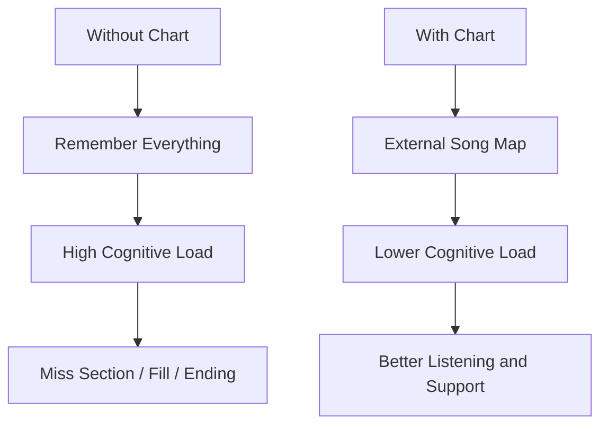
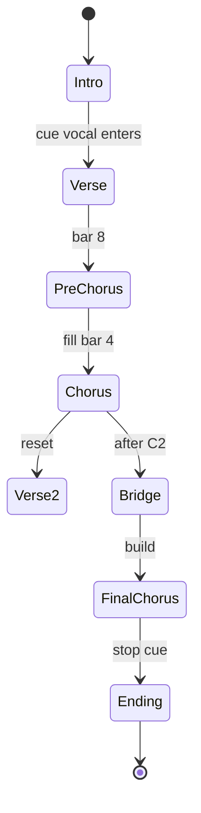
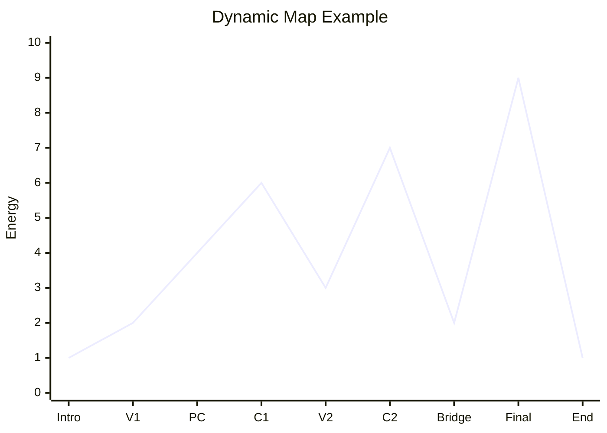
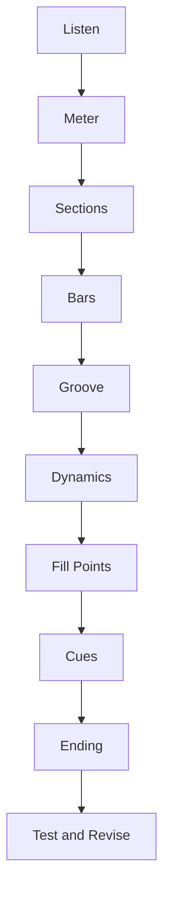

# learn-drum-cajon-part-024.md

# Part 024 — Membuat Drum/Cajon Chart Sederhana

## Status Seri

- Seri: `learn-drum-cajon`
- Part: `024`
- Topik: Drum/cajon chart sederhana untuk rehearsal dan performance
- Target akhir seri: mampu mengiringi penyanyi dengan drum dan/atau cajon secara stabil, musikal, dan sadar konteks
- Status: seri belum selesai
- Part sebelumnya: `learn-drum-cajon-part-023.md`
- Part berikutnya: `learn-drum-cajon-part-025.md`

---

## Tujuan Part Ini

Part ini membahas cara membuat chart sederhana. Chart adalah peta lagu yang membantumu:

- tidak tersesat,
- tahu kapan masuk,
- tahu kapan naik,
- tahu kapan fill,
- tahu kapan diam,
- tahu ending,
- mengingat cue,
- menjaga dinamika,
- mengiringi penyanyi dengan lebih aman.

Chart yang kita buat bukan notasi drum formal penuh. Ini adalah **performance chart praktis** untuk drummer/cajon player pemula yang ingin mengiringi penyanyi.

Setelah menyelesaikan part ini, kamu harus mampu:

1. memahami fungsi chart,
2. membuat section map,
3. menulis bar count,
4. memakai simbol sederhana,
5. menulis groove shorthand,
6. menulis dynamic notes,
7. menandai fill points,
8. menandai cue vokal,
9. menulis ending,
10. memakai chart saat rehearsal/performance.

---

# 1. Kenapa Butuh Chart?

Banyak pemula mengandalkan ingatan. Itu bisa bekerja untuk lagu sederhana, tetapi berisiko saat:

- lagu punya banyak section,
- penyanyi mengubah versi,
- chorus diulang,
- bridge drop,
- ending tag,
- ada rubato,
- kamu nervous saat tampil,
- kamu harus mengiringi banyak lagu.

Chart mengurangi beban kognitif.



Chart bukan tanda tidak hafal. Chart adalah alat navigasi.

---

# 2. Chart sebagai Runtime Map

Pikirkan chart seperti runtime map.

Chart memberi informasi:

- current state,
- next state,
- transition trigger,
- dynamic level,
- risk points,
- exit condition.



---

# 3. Level Detail Chart

Ada 3 level chart.

## 3.1 Level 1 — Section Only

```text
Intro x4
Verse x8
Chorus x8
Verse x8
Chorus x8
Bridge x8
Final Chorus x8
Ending
```

Cocok untuk lagu mudah.

## 3.2 Level 2 — Section + Dynamics + Fill

```text
Intro x4: no percussion
V1 x8: sparse, level 2
PC x4: build, fill bar 4
C x8: stronger, level 4
```

Cocok untuk latihan dan rehearsal.

## 3.3 Level 3 — Performance Chart

Menambahkan:

- lyric anchor,
- cue,
- groove shorthand,
- fill marker,
- ending detail,
- risk notes.

Cocok untuk performance.

---

# 4. Simbol Dasar

Gunakan simbol sederhana.

| Simbol | Arti |
|---|---|
| Intro | intro |
| V | verse |
| PC | pre-chorus |
| C | chorus |
| B | bridge |
| Int | interlude |
| Tag | pengulangan frasa |
| End | ending |
| x4 | 4 bar |
| x8 | 8 bar |
| Fill | fill |
| Stop | berhenti |
| Build | naik |
| Drop | turun |
| Soft | pelan |
| Big | besar |
| Tacet | tidak bermain |
| Cue | sinyal |
| Crash/Acc | accent section |

## 4.1 Simbol Dynamics

| Simbol | Arti |
|---|---|
| L1 | sangat pelan |
| L2 | pelan |
| L3 | sedang |
| L4 | besar |
| L5 | sangat besar |
| `<` | crescendo/build |
| `>` | turun/drop |
| `—` | tahan |
| `X` | accent/stop tertentu |

---

# 5. Simbol Drum

| Simbol | Arti |
|---|---|
| K | kick |
| S | snare |
| H | hi-hat |
| R | ride |
| C | crash |
| T | tom |
| Ft | floor tom |
| Rim | rim click/cross-stick |
| HH open | open hi-hat |
| HH cl | closed hi-hat |
| F | fill |

Contoh groove shorthand:

```text
H 8th / K 1,3 / S 2,4
```

Artinya:

- hi-hat 8th note,
- kick beat 1 dan 3,
- snare beat 2 dan 4.

---

# 6. Simbol Cajon

| Simbol | Arti |
|---|---|
| B | bass |
| S | slap |
| t | touch |
| g | ghost |
| m | muted |
| Acc | accent |
| Roll | touch/finger roll sederhana |
| Stop | diam |
| F | fill |

Contoh groove shorthand:

```text
B 1,3 / S 2,4 / t 8th soft
```

Artinya:

- bass beat 1 dan 3,
- slap beat 2 dan 4,
- touch 8th ringan.

---

# 7. Counting Bar di Chart

Tulis jumlah bar.

Contoh:

```text
V1 x8
PC x4
C1 x8
```

Jika section tidak simetris, tulis detail:

```text
Intro x2
V1 x6
PC x4
C x8
Tag x2
```

Jangan menebak saat performance. Hitung saat listening.

## 7.1 Bar Count Format

```text
V1 x8:
1 2 3 4 | 2 2 3 4 | 3 2 3 4 | 4 2 3 4 |
5 2 3 4 | 6 2 3 4 | 7 2 3 4 | 8 2 3 4
```

Untuk chart praktis, cukup tulis:

```text
V1 x8
Fill bar 8
```

---

# 8. Groove Notes

Chart harus menjawab:

> Saya main apa di section ini?

Tidak perlu notasi penuh. Tulis fungsi.

## 8.1 Drum Groove Note

```text
V1 x8: H quarter soft / K 1,3 / Rim 2,4 / L2
C x8: H 8th / K 1,2&,3 / S 2,4 / L4 / Crash beat 1
```

## 8.2 Cajon Groove Note

```text
V1 x8: B 1,3 / s 2,4 / sparse t / L2
C x8: B 1,2&,3 / S 2,4 / t 8th / L4 / Acc beat 1
```

## 8.3 Hybrid Note

```text
V1: cajon sparse
C: cajon + shaker
Bridge: stop first 2 bars, build touch
```

---

# 9. Dynamic Notes

Tulis level energi.

Contoh:

```text
Intro: L1
V1: L2
PC: L3<
C1: L4
V2: L3
C2: L5
Bridge: Drop L1 then Build L4
Final C: L5
End: Stop
```

Gunakan:

- angka,
- kata,
- arrow,
- warna jika di kertas.



---

# 10. Fill Markers

Tandai fill di chart.

Contoh:

```text
V1 x8: no fill
PC x4: fill bar 4
C x8: small fill bar 8
Bridge x8: no fill first 4, build fill bar 8
```

## 10.1 Fill Size

Gunakan kode:

| Kode | Arti |
|---|---|
| F0 | no fill |
| F1 | tiny fill |
| F2 | 1-beat fill |
| F3 | 2-beat fill |
| F4 | 1-bar fill |
| StopF | silence fill |

Contoh:

```text
PC x4: F2 on bar 4
C x8: F1 on bar 8
Bridge: StopF into final chorus
```

---

# 11. Cue Notes

Cue sangat penting untuk penyanyi.

Tulis:

- lyric cue,
- breath cue,
- visual cue,
- chord cue,
- stop cue,
- repeat cue.

## 11.1 Lyric Anchor

```text
C starts on lyric: "..."
Bridge starts after: "..."
End stop on word: "..."
```

Kamu tidak perlu menulis lirik panjang. Cukup anchor pendek.

## 11.2 Visual Cue

```text
Final C: wait singer hand cue
Ending: follow singer stop
Bridge: guitarist nod
```

## 11.3 Rubato Cue

```text
Intro rubato: no percussion until guitar steady strum
```

---

# 12. Ending Notes

Ending harus ditulis jelas.

Jenis ending:

```text
Stop
Ring out
Tag x2
Ritard
Button
Fade-like
Follow singer
```

Contoh:

```text
Ending: Tag last 2 bars x2, stop on final word.
```

Atau:

```text
Ending: final chorus last line, big accent beat 1, ring out.
```

Atau:

```text
Ending: follow singer ritard, no fill.
```

---

# 13. Risk Notes

Tulis area berisiko.

Contoh:

```text
Risk:
- PC to chorus tends to rush
- Bridge drop: don't fill
- Ending repeats tag if singer cues
- Cajon slap too loud in V1
```

Risk notes membantu performance.

---

# 14. Chart Template — Simple

```md
# Drum/Cajon Chart

Song:
Tempo:
Meter:
Instrument:
Version:

## Form
Intro:
V1:
PC:
C1:
V2:
PC2:
C2:
Bridge:
Final C:
End:

## Notes
Entry:
Dynamics:
Fill:
Ending:
Risks:
```

---

# 15. Chart Template — Performance

```md
# Drum/Cajon Performance Chart

Song:
Artist/Version:
Tempo:
Meter:
Key:
Instrument:
Mood:

| Section | Bars | Groove | Dyn | Fill | Cue | Notes |
|---|---:|---|---:|---|---|---|
| Intro | | | | | | |
| V1 | | | | | | |
| PC | | | | | | |
| C1 | | | | | | |
| V2 | | | | | | |
| PC2 | | | | | | |
| C2 | | | | | | |
| Bridge | | | | | | |
| Final C | | | | | | |
| End | | | | | | |

## Risk Areas
- 

## Ending
- 

## Backup Plan
- 
```

---

# 16. Chart Example — 4/4 Acoustic Pop

```md
# Drum/Cajon Performance Chart

Song:
Tempo: medium
Meter: 4/4
Instrument: Cajon
Mood: intimate → uplifting

| Section | Bars | Groove | Dyn | Fill | Cue | Notes |
|---|---:|---|---:|---|---|---|
| Intro | 4 | Tacet / touch only | L1 | F0 | guitar intro | wait vocal |
| V1 | 8 | B 1,3 / s 2,4 / sparse t | L2 | F0 | vocal enters | keep lyric clear |
| PC | 4 | add t 8th | L3< | F2 bar 4 | lyric before chorus | do not rush |
| C1 | 8 | B 1,2&,3 / S 2,4 / t 8th | L4 | F1 bar 8 | hook | no fill over hook |
| V2 | 8 | sparse + more touch | L3 | F1 bar 8 | vocal | reset energy |
| PC2 | 4 | build | L4< | F2 bar 4 | breath cue | prepare C2 |
| C2 | 8 | stronger | L5 | F2 bar 8 | hook | stable tempo |
| Bridge | 8 | drop 4 bars, build 4 bars | L1→L4 | StopF to final | singer cue | leave space |
| Final C | 8 | strongest controlled | L5 | F1 only | big hook | don't overplay |
| End | 2 | stop | L2 | Stop | final word | follow singer |
```

---

# 17. Chart Example — Drum Kit 4/4

```md
# Drum Kit Chart

Song:
Tempo: 78 BPM
Meter: 4/4
Instrument: Drum kit
Mood: soft verse / lifted chorus

| Section | Bars | Groove | Dyn | Fill | Cue | Notes |
|---|---:|---|---:|---|---|---|
| Intro | 4 | closed H quarter, no snare | L1 | F0 | piano/guitar | very soft |
| V1 | 8 | H 8th soft / K 1,3 / Rim 2,4 | L2 | F0 | vocal | no crash |
| PC | 4 | H 8th / K add 2& / S soft | L3< | F2 | lyric cue | build |
| C1 | 8 | H 8th / K 1,2&,3 / S 2,4 | L4 | F1 | hook | crash beat 1 only |
| V2 | 8 | H 8th soft / K 1,3 / S 2,4 | L3 | F1 | vocal | more than V1 |
| Bridge | 8 | half-time first 4, build next 4 | L2→L4 | F3 | chord change | no overfill |
| Final C | 8 | stronger, maybe ride | L5 | F2 | hook | tempo stable |
| End | 1 | button stop | L5 | accent | final cue | stop together |
```

---

# 18. Chart Example — 6/8 Ballad Cajon

```md
# Cajon Chart 6/8 Ballad

Song:
Tempo: slow
Meter: 6/8
Count: 1 2 3 4 5 6
Instrument: Cajon

| Section | Bars | Groove | Dyn | Fill | Cue | Notes |
|---|---:|---|---:|---|---|---|
| Intro | 2 | Tacet | L0 | F0 | piano rubato | wait steady |
| V1 | 8 | B on 1 / soft S on 4 / sparse t | L1-2 | F0 | vocal | lots of space |
| C1 | 8 | B 1, maybe 5 / S 4 / t all six | L3 | F1 | chorus lyric | don't rush |
| V2 | 8 | slightly fuller | L2 | F1 | vocal | keep 1/4 feel |
| Bridge | 6 | touch only, build | L1→L3 | F2 | breath cue | count 1-6 |
| Final C | 8 | stronger 6/8 | L4 | F2 | hook | accent 1 and 4 |
| End | 2 | stop/ring | L2 | StopF | final phrase | follow vocal |
```

---

# 19. Chart Example — 12/8 Drum/Cajon

```md
# 12/8 Ballad Chart

Song:
Meter: 12/8
Count: 1 la li 2 la li 3 la li 4 la li
Instrument: Drum or Cajon

| Section | Bars | Groove | Dyn | Fill | Cue | Notes |
|---|---:|---|---:|---|---|---|
| Intro | 4 | no percussion / light texture | L1 | F0 | keys/guitar | triplet feel |
| V1 | 8 | sparse triplet touch / K-B 1,3 / S 2,4 | L2 | F0 | vocal | soft |
| C1 | 8 | full triplet subdivision | L4 | F1 | hook | backbeat 2,4 |
| V2 | 8 | medium | L3 | F1 | lyric | don't flatten |
| Bridge | 8 | drop then build | L1→L4 | F2 | cue | keep triplet |
| Final | 8 | biggest controlled | L5 | F2 | hook | no rush |
| End | 2 | ritard/follow | L2 | none | singer | watch cue |
```

---

# 20. One-Page Chart Format

Untuk performance, chart harus ringkas. Idealnya muat satu halaman.

Format:

```text
SONG — Tempo — Meter

Intro x4: Tacet / light
V1 x8: sparse L2, no fill
PC x4: build L3<, F2
C1 x8: stronger L4, accent beat 1
V2 x8: L3, F1
PC2 x4: build, F2
C2 x8: L5
Bridge x8: drop 4 + build 4, StopF
Final C x8: biggest L5
End: tag x2, stop final word

Risks:
- don't rush PC fill
- no fill over hook
- follow singer ending
```

---

# 21. How to Create Chart from a Song

## Step 1 — Listen Once for Mood

Jangan tulis detail dulu.

## Step 2 — Find Meter

Tentukan:

- 4/4,
- 6/8,
- 12/8,
- other/uncertain.

## Step 3 — Mark Sections

Tulis:

```text
Intro / V / PC / C / B / End
```

## Step 4 — Count Bars

Hitung tiap section.

## Step 5 — Choose Groove

Tulis shorthand.

## Step 6 — Add Dynamics

Level 1–5 atau 1–10.

## Step 7 — Add Fill Points

Tandai akhir phrase.

## Step 8 — Add Cues

Lyric/visual/chord.

## Step 9 — Add Ending

Wajib.

## Step 10 — Test by Playing

Main dengan chart. Revisi.



---

# 22. Chart Revision

Chart pertama biasanya salah. Itu normal.

Revisi setelah rehearsal:

- bar count salah,
- fill terlalu banyak,
- chorus lebih besar dari rencana,
- bridge ternyata drop,
- ending berubah,
- singer minta masuk belakangan,
- tempo berbeda dari original.

Gunakan versioning:

```text
chart_v1
chart_v2_after_rehearsal
chart_v3_performance
```

---

# 23. Chart for Different Versions

Satu lagu bisa punya banyak versi:

- original,
- acoustic,
- live,
- worship version,
- singer's key,
- shortened version,
- extended chorus,
- medley.

Tulis versi jelas.

```md
Song:
Version:
Reference:
Key:
Tempo:
Notes:
```

Jangan menganggap semua versi sama.

---

# 24. Chart dan Rehearsal Communication

Chart membantu komunikasi.

Contoh kalimat:

```text
Di chart aku tulis bridge drop 4 bar lalu build 4 bar. Benar begitu?
Chorus terakhir mau diulang 2 kali atau langsung ending?
Aku masuk di verse 2 atau dari awal?
Pre-chorus bar terakhir aku isi fill kecil, aman?
Ending stop di kata terakhir atau ring out?
```

Chart membuat diskusi konkret.

---

# 25. Chart Backup Plan

Tuliskan backup plan jika terjadi perubahan.

Contoh:

```md
If singer repeats chorus:
- stay same groove, no big fill until cue.

If ending uncertain:
- reduce density, watch singer.

If lost:
- emergency skeleton: B/K 1,3 and S 2,4.

If too loud:
- remove touch/hat first.
```

Ini membuatmu lebih tenang.

---

# 26. Chart untuk Cajon vs Drum Kit

## 26.1 Cajon Chart Emphasis

Tulis:

- bass/slap/touch,
- slap volume,
- touch density,
- silence,
- hand fatigue risk.

## 26.2 Drum Kit Chart Emphasis

Tulis:

- kick/snare/hat,
- cymbal usage,
- crash points,
- rim click,
- ride switch,
- volume risk.

## 26.3 Hybrid Chart

Tulis:

- kapan cajon saja,
- kapan tambah shaker,
- kapan tambourine,
- kapan stop.

---

# 27. Chart Symbols Quick Reference

```text
V = Verse
PC = Pre-Chorus
C = Chorus
B = Bridge
Int = Interlude
Tag = repeat phrase
End = ending

L1-L5 = dynamic level
< = build
> = drop
F0 = no fill
F1 = tiny fill
F2 = 1-beat fill
F3 = 2-beat fill
F4 = 1-bar fill
StopF = silence fill

Drum:
K = kick
S = snare
H = hi-hat
R = ride
Cr = crash
Rim = rim click

Cajon:
B = bass
S = slap
t = touch
g = ghost
m = muted
```

---

# 28. Common Mistakes

## 28.1 Chart Terlalu Detail

Gejala:

- susah dibaca saat main,
- terlalu banyak teks.

Correction:

- gunakan shorthand,
- satu halaman,
- tulis hanya yang penting.

## 28.2 Chart Terlalu Minimal

Gejala:

- lupa ending,
- lupa fill,
- lupa bridge.

Correction:

- tambahkan cues dan risk notes.

## 28.3 Tidak Menulis Ending

Gejala:

- ending kacau.

Correction:

- ending wajib selalu ditulis.

## 28.4 Tidak Update Setelah Rehearsal

Gejala:

- chart tidak sesuai versi nyata.

Correction:

- revisi chart setelah rehearsal.

## 28.5 Tidak Menulis Dynamic

Gejala:

- semua section sama.

Correction:

- tulis L1-L5.

---

# 29. Debugging Guide

| Gejala | Chart Problem | Correction |
|---|---|---|
| miss chorus | bar count tidak jelas | tulis x8/x4 |
| fill salah | fill marker tidak ada | F markers |
| ending kacau | ending tidak ditulis | define ending |
| terlalu keras | dynamic tidak ada | L1-L5 |
| bridge bingung | role bridge tidak jelas | drop/build note |
| cue terlewat | cue tidak tertulis | lyric/visual cue |
| chart sulit dibaca | terlalu detail | simplify |
| performance panik | no backup plan | emergency note |

---

# 30. Practice Protocol 30 Menit: Chart Creation

| Durasi | Aktivitas |
|---:|---|
| 5 menit | listen mood/meter |
| 5 menit | mark sections |
| 5 menit | count bars |
| 5 menit | write groove/dynamics |
| 5 menit | mark fills/cues |
| 5 menit | play and revise |

---

# 31. Practice Protocol 45 Menit: Chart + Performance

| Durasi | Aktivitas |
|---:|---|
| 5 menit | listen |
| 10 menit | create chart |
| 10 menit | section practice |
| 10 menit | full run |
| 5 menit | record |
| 5 menit | revise chart |

---

# 32. Chart Quality Checklist

| Checklist | Ya/Tidak |
|---|---|
| meter tertulis | |
| tempo tertulis | |
| section lengkap | |
| bar count ada | |
| groove per section ada | |
| dynamic level ada | |
| fill points ada | |
| cue penting ada | |
| ending jelas | |
| risk notes ada | |
| backup plan ada | |
| muat satu halaman | |

---

# 33. Mini Capstone Part Ini

Pilih satu lagu dari repertoire. Buat chart lengkap:

```md
# Drum/Cajon Performance Chart

Song:
Version:
Tempo:
Meter:
Instrument:
Mood:

| Section | Bars | Groove | Dyn | Fill | Cue | Notes |
|---|---:|---|---:|---|---|---|
| Intro | | | | | | |
| V1 | | | | | | |
| PC | | | | | | |
| C1 | | | | | | |
| V2 | | | | | | |
| PC2 | | | | | | |
| C2 | | | | | | |
| Bridge | | | | | | |
| Final C | | | | | | |
| End | | | | | | |

## Risk Areas
- 

## Ending
- 

## Backup Plan
- 
```

Lalu rekam 2 menit sambil membaca chart.

---

# 34. Acceptance Criteria Part Ini

Kamu boleh lanjut ke Part 025 jika:

1. bisa menjelaskan fungsi chart,
2. bisa membuat section map,
3. bisa menghitung bar section,
4. bisa memakai simbol dasar,
5. bisa menulis groove shorthand,
6. bisa menulis dynamic level,
7. bisa menandai fill points,
8. bisa menandai cue,
9. bisa menulis ending,
10. bisa memakai chart saat memainkan satu lagu atau section.

---

# 35. Ringkasan

Chart adalah peta performance. Chart menurunkan beban memori sehingga kamu bisa lebih mendengar vokal, menjaga time, dan merespons cue.

Chart minimal harus punya:

1. tempo,
2. meter,
3. section,
4. bar count,
5. groove,
6. dynamics,
7. fill,
8. cue,
9. ending,
10. risk notes.

Chart tidak perlu rumit. Chart harus cukup jelas untuk membantumu bermain lebih musikal.

Rule paling penting:

> Chart yang baik bukan yang paling lengkap, tetapi yang paling membantu kamu tidak tersesat saat lagu berjalan.

---

# 36. Latihan untuk Part Berikutnya

Sebelum lanjut ke Part 025, lakukan:

1. Pilih satu lagu capstone.
2. Buat chart lengkap.
3. Mainkan verse → chorus sambil membaca chart.
4. Rekam.
5. Revisi chart berdasarkan error.
6. Pastikan ending tertulis jelas.

Part berikutnya membahas:

> live performance readiness: persiapan sebelum tampil, checklist alat, soundcheck, count-in, cue, nerves, recovery, dan cara tampil mengiringi penyanyi dengan aman.
