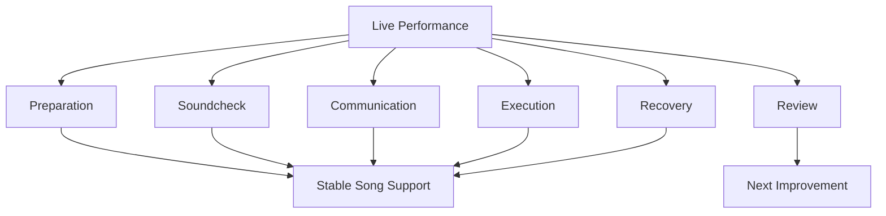

# learn-drum-cajon-part-025.md

# Part 025 — Live Performance Readiness

## Status Seri

- Seri: `learn-drum-cajon`
- Part: `025`
- Topik: Kesiapan tampil live sebagai drummer/cajon player pengiring penyanyi
- Target akhir seri: mampu mengiringi penyanyi dengan drum dan/atau cajon secara stabil, musikal, dan sadar konteks
- Status: seri belum selesai
- Part sebelumnya: `learn-drum-cajon-part-024.md`
- Part berikutnya: `learn-drum-cajon-part-026.md`

---

## Tujuan Part Ini

Part ini membahas kesiapan tampil live. Banyak pemain bisa bermain cukup baik saat latihan sendiri, tetapi berubah saat tampil:

- tempo rush karena gugup,
- volume terlalu keras,
- lupa form,
- fill berlebihan,
- tidak mendengar vokal,
- salah ending,
- panik saat ada kesalahan,
- alat belum siap,
- soundcheck tidak efektif.

Live performance bukan hanya soal bisa memainkan groove. Live performance adalah sistem yang melibatkan:

- persiapan alat,
- chart,
- komunikasi,
- soundcheck,
- count-in,
- cue,
- monitoring,
- nerves,
- recovery,
- stage discipline,
- post-performance review.

Setelah menyelesaikan part ini, kamu harus mampu:

1. membuat live readiness checklist,
2. menyiapkan alat drum/cajon,
3. melakukan soundcheck sederhana,
4. menyepakati count-in dan ending,
5. membaca cue penyanyi/band,
6. mengontrol volume live,
7. mengelola rasa gugup,
8. recover saat salah,
9. tampil dengan chart,
10. mengevaluasi performance setelah selesai.

---

# 1. Prinsip Utama Live Performance

Dalam live performance, tujuan utama bukan “main sempurna”. Tujuan utama adalah:

> membuat lagu berjalan aman, vokal terdengar jelas, form tidak kacau, dan kesalahan tidak merusak performance.

Performance live selalu punya variabel:

- sound ruangan berbeda,
- monitoring kurang jelas,
- penyanyi berubah phrasing,
- tempo terasa berbeda,
- audience memengaruhi adrenaline,
- alat tidak senyaman latihan,
- cue berubah,
- ending bisa spontan,
- kamu bisa salah.

Karena itu, skill live bukan hanya skill bermain, tetapi skill menjaga sistem tetap berjalan.



Rule:

> Live player yang baik bukan yang tidak pernah salah, tetapi yang salahnya tidak menjatuhkan lagu.

---

# 2. Readiness vs Perfection

Kamu tidak perlu sempurna untuk tampil. Tetapi kamu harus siap.

## 2.1 Belum Siap Jika

- tidak tahu form lagu,
- tidak tahu ending,
- belum bisa groove 2–3 menit stabil,
- fill selalu rush,
- volume tidak bisa dikontrol,
- belum pernah rekam latihan,
- tidak tahu entry,
- tidak tahu cue,
- tidak bisa recover saat salah.

## 2.2 Cukup Siap Jika

- tahu chart lagu,
- groove sederhana stabil,
- bisa main lebih pelan,
- tahu fill-safe spots,
- tahu ending,
- bisa no-fill jika gugup,
- bisa emergency skeleton,
- bisa mendengar vokal,
- punya alat siap,
- sudah simulasi performance minimal 1–2 kali.

Readiness bukan “saya bisa semua detail”. Readiness adalah “saya punya versi aman yang bisa saya mainkan tanpa merusak lagu”.

---

# 3. Live Readiness Checklist

Gunakan checklist ini sebelum tampil.

```md
# Live Readiness Checklist

## Song
- [ ] Saya tahu tempo/feel lagu.
- [ ] Saya tahu meter: 4/4, 6/8, 12/8, dll.
- [ ] Saya punya chart.
- [ ] Saya tahu entry.
- [ ] Saya tahu fill points.
- [ ] Saya tahu dynamic map.
- [ ] Saya tahu ending.
- [ ] Saya tahu backup plan jika tersesat.

## Instrument
- [ ] Alat tersedia.
- [ ] Posisi duduk nyaman.
- [ ] Volume bisa dikontrol.
- [ ] Sticks/brush/rods siap jika drum.
- [ ] Cajon stabil dan nyaman.
- [ ] Ear protection siap jika perlu.

## Communication
- [ ] Count-in disepakati.
- [ ] Ending disepakati.
- [ ] Cue penting disepakati.
- [ ] Jika terlalu keras, penyanyi tahu bisa memberi cue.
- [ ] Bridge/drop/build sudah jelas.

## Sound
- [ ] Saya bisa mendengar vokal.
- [ ] Saya bisa mendengar gitar/piano/bass.
- [ ] Penyanyi bisa mendengar groove.
- [ ] Volume saya tidak menutup vokal.
- [ ] Monitoring cukup.

## Mindset
- [ ] Saya punya versi sederhana.
- [ ] Saya tidak akan fill saat tidak yakin.
- [ ] Jika salah, saya kembali ke skeleton.
- [ ] Saya akan menjaga lagu, bukan ego.
```

---

# 4. Persiapan Alat

## 4.1 Drum Kit Checklist

Jika memakai drum kit:

```md
## Drum Kit Checklist

- [ ] Stick utama.
- [ ] Stick cadangan.
- [ ] Brush/rods jika perlu volume kecil.
- [ ] Hi-hat nyaman.
- [ ] Snare tidak terlalu keras.
- [ ] Kick pedal stabil.
- [ ] Drum throne nyaman.
- [ ] Cymbal tidak terlalu dominan.
- [ ] Tuning cukup.
- [ ] Ear protection.
- [ ] Karpet/mat agar kick tidak geser.
- [ ] Chart mudah dilihat.
```

## 4.2 Cajon Checklist

Jika memakai cajon:

```md
## Cajon Checklist

- [ ] Cajon stabil.
- [ ] Posisi duduk nyaman.
- [ ] Bass tone jelas.
- [ ] Slap tidak terlalu tajam.
- [ ] Tidak ada bagian yang sakit saat dimainkan.
- [ ] Mic tersedia jika venue sedang/besar.
- [ ] Shaker/tambourine jika diperlukan.
- [ ] Chart mudah dilihat.
- [ ] Kain/mat jika cajon licin.
```

## 4.3 Hybrid/Minimal Percussion

```md
## Hybrid Checklist

- [ ] Shaker.
- [ ] Tambourine.
- [ ] Foot tambourine.
- [ ] Brushes/rods.
- [ ] Cajon mic.
- [ ] Extra small percussion.
- [ ] Tidak membawa terlalu banyak alat yang tidak dipakai.
```

Rule:

> Alat yang terlalu banyak bisa menciptakan pilihan berlebihan dan meningkatkan risiko overplaying.

---

# 5. Chart Preparation

Chart live harus ringkas.

## 5.1 Chart Minimal

```text
Song — Tempo — Meter

Intro x4: tacet
V1 x8: sparse L2
PC x4: build L3, F2
C1 x8: groove L4, accent beat 1
V2 x8: L3
C2 x8: L5
Bridge x8: drop 4 + build 4
Final C x8: L5
End: stop final word

Risks:
- no fill over hook
- watch singer ending
```

## 5.2 Chart Live Harus Terlihat

Pastikan:

- font cukup besar,
- tidak terlalu banyak paragraf,
- section jelas,
- ending terlihat,
- risk notes singkat,
- chart tidak mudah jatuh.

## 5.3 Jangan Mengandalkan HP Saja Jika Berisiko

HP bisa:

- sleep,
- notifikasi,
- baterai habis,
- layar terlalu kecil,
- jatuh.

Jika penting, print atau siapkan screenshot offline.

---

# 6. Komunikasi Sebelum Tampil

Sebelum tampil, minimal pastikan 5 hal:

1. tempo,
2. entry,
3. dynamics,
4. bridge,
5. ending.

## 6.1 Pertanyaan Minimum

```text
Tempo-nya seperti latihan terakhir?
Aku masuk dari intro atau verse?
Chorus pertama full atau ditahan?
Bridge drop atau build?
Ending stop, ring out, tag, atau follow vocal?
```

## 6.2 Jika Waktu Sangat Sedikit

Tanyakan 3 hal paling critical:

```text
Aku masuk kapan?
Chorus/final chorus mau sebesar apa?
Ending-nya bagaimana?
```

Kalau ending tidak jelas, risiko performance tinggi.

---

# 7. Count-In

Count-in adalah kontrak tempo awal.

## 7.1 Count-In 4/4

```text
1 2 3 4
```

Atau:

```text
1 2, 1 2 3 4
```

## 7.2 Count-In 6/8

```text
1 2 3 4 5 6
```

Atau dengan dua pulse besar:

```text
ONE ... FOUR ...
```

## 7.3 Count-In Harus Mengandung Energi

Count-in bukan hanya angka. Count-in memberi:

- tempo,
- meter,
- dynamic feel,
- confidence.

Buruk:

```text
count-in ragu, terlalu cepat, tidak sesuai mood
```

Baik:

```text
count-in jelas, stabil, sesuai energi lagu
```

---

# 8. Soundcheck

Soundcheck bukan waktu untuk pamer. Soundcheck adalah memastikan semua orang bisa mendengar dan terdengar.

## 8.1 Drum Kit Soundcheck

Cek:

- kick cukup?
- snare terlalu keras?
- hi-hat terlalu tajam?
- crash terlalu besar?
- vokal tetap jelas?
- kamu mendengar penyanyi?
- penyanyi mendengar groove?

Mainkan groove asli lagu, bukan fill random.

## 8.2 Cajon Soundcheck

Cek:

- bass tone terdengar?
- slap terlalu tajam?
- mic menangkap bass?
- touch terlalu noisy?
- vokal tetap jelas?
- kamu mendengar gitar/piano?

Jika cajon bass tidak terdengar, jangan otomatis memukul lebih keras. Bisa jadi perlu mic placement atau arrangement lebih sederhana.

## 8.3 Soundcheck Phrase

Gunakan kalimat praktis:

```text
Boleh cek apakah cajon slap terlalu tajam di vocal?
Saya perlu sedikit lebih banyak vocal di monitor.
Kick/bass cajon cukup terdengar dari depan?
Hi-hat terlalu keras tidak?
```

---

# 9. Monitoring

Kamu harus bisa mendengar:

1. vokal,
2. harmonic instrument: gitar/piano,
3. bass jika ada,
4. dirimu secukupnya,
5. click/backing jika ada.

## 9.1 Jika Tidak Mendengar Vokal

Risiko:

- fill menabrak,
- dynamic tidak mengikuti,
- ending miss.

Solusi:

- minta vocal monitor,
- main lebih sederhana,
- kurangi fill,
- lihat cue visual.

## 9.2 Jika Tidak Mendengar Bass/Gitar/Piano

Risiko:

- tidak lock,
- form miss.

Solusi:

- dengar chord changes,
- lihat body cue,
- main skeleton,
- jangan terlalu banyak variasi.

---

# 10. Volume Control Live

Adrenaline membuat kamu cenderung main lebih keras.

## 10.1 Rule Praktis

Saat live, mainkan 20–30% lebih pelan dari rasa “normal” saat rehearsal kecil, terutama jika:

- ruangan kecil,
- vokal lembut,
- cajon slap tajam,
- drum kit acoustic,
- audience dekat.

## 10.2 Volume Hierarchy

Vokal harus jelas.

Jika vokal tidak jelas, kurangi berurutan:

1. crash/cymbal,
2. hi-hat/touch,
3. snare/slap,
4. fill,
5. kick/bass jika low-end terlalu besar.

Jangan langsung mengurangi groove sampai hilang pulse. Kurangi elemen yang menutup vokal.

---

# 11. Stage Discipline

Stage discipline berarti perilaku musikal saat tampil.

## 11.1 Jangan Noodle

Noodle berarti memainkan random lick/fill sebelum lagu, di antara lagu, atau saat orang bicara.

Risiko:

- mengganggu penyanyi,
- terlihat tidak profesional,
- mengacaukan mood.

## 11.2 Jangan Test Fill Keras di Panggung

Saat sudah di panggung, cukup test sound seperlunya.

## 11.3 Perhatikan Penyanyi

Jangan terlalu fokus ke tangan/kaki sendiri sampai tidak melihat cue.

## 11.4 Jangan Bereaksi Berlebihan Saat Salah

Jika salah:

- wajah tetap tenang,
- kembali groove,
- jangan minta maaf di tengah lagu,
- jangan fill untuk menutupi panik.

---

# 12. Nerves dan Adrenaline

Gugup itu normal.

Gejala:

- tempo rush,
- tangan kaku,
- napas pendek,
- fill berlebihan,
- volume naik,
- lupa chart,
- terlalu fokus error kecil.

## 12.1 Pre-Performance Reset

Sebelum main:

1. tarik napas panjang,
2. lemaskan bahu,
3. tap pulse,
4. lihat chart ending,
5. ingat versi sederhana,
6. dengar penyanyi.

## 12.2 Anti-Rush Strategy

Saat gugup:

- main pattern lebih sederhana,
- no fill di awal lagu,
- hi-hat/touch lebih kecil,
- count internal,
- dengar vokal.

Rule:

> Lagu pertama bukan tempat membuktikan semua skill. Lagu pertama adalah tempat membangun stabilitas.

---

# 13. Recovery Saat Salah

Kesalahan live pasti terjadi. Yang penting adalah recovery.

## 13.1 Jika Salah Fill

Lakukan:

1. jangan berhenti,
2. cari beat 1,
3. kembali ke groove,
4. jangan fill lagi beberapa bar,
5. dengar vokal.

## 13.2 Jika Salah Form

Lakukan:

1. sederhanakan,
2. dengar hook/vokal,
3. lihat cue,
4. kembali ke section yang sedang berlangsung,
5. jangan crash/fill sampai yakin.

## 13.3 Jika Terlalu Keras

Lakukan:

1. kurangi hi-hat/touch,
2. kurangi snare/slap,
3. jangan crash,
4. lebih banyak ruang.

## 13.4 Jika Tersesat Total

Emergency skeleton:

Drum:

```text
Kick  : 1 dan 3
Snare : 2 dan 4
Hat   : optional soft
```

Cajon:

```text
Bass  : 1 dan 3
Slap  : 2 dan 4
Touch : optional
```

Jika sangat tidak yakin, main lebih sedikit, bukan lebih banyak.

---

# 14. Backup Plan

Sebelum tampil, punya backup plan.

```md
# Backup Plan

If tempo feels unstable:
- simplify groove
- no fill
- count internally

If singer changes form:
- follow vocal
- stay skeleton
- wait cue

If too loud:
- reduce touch/hat
- reduce slap/snare
- no crash

If lost:
- emergency skeleton
- listen for chorus hook

If ending unclear:
- reduce density
- watch singer
- avoid big fill
```

Backup plan membuatmu tidak panik.

---

# 15. Live Fill Rules

Saat live, fill harus lebih konservatif daripada latihan.

## 15.1 Rule

- fill lebih sedikit dari yang kamu mau,
- fill lebih pendek dari yang kamu bisa,
- fill hanya saat tahu form,
- fill jangan menabrak vokal,
- fill harus kembali beat 1,
- jika gugup, no fill.

## 15.2 Fill Safe Level

| Kondisi | Fill |
|---|---|
| tidak yakin form | no fill |
| penyanyi sedang lyric penting | no fill |
| menuju chorus jelas | 1-beat fill |
| bridge to final jelas | 2-beat/build |
| ending cue jelas | final accent |
| monitoring buruk | minimal fill |

---

# 16. Live Dynamics

Performance live sering membuat dynamics terlalu besar terlalu cepat.

## 16.1 Simpan Energi

Jangan habiskan level 5 di chorus pertama jika final chorus masih jauh.

## 16.2 Dynamic Anchor

Tulis di chart:

```text
V1 L2
C1 L4
V2 L3
C2 L5
Bridge Drop L1
Final L5
```

## 16.3 Jika Audience Membuat Kamu Excited

Tetap jaga tempo. Audience energy bukan alasan untuk rushing.

---

# 17. Mengiringi Penyanyi Live

Saat live, penyanyi bisa melakukan hal berbeda dari latihan:

- memperpanjang intro,
- mengambil napas lebih lama,
- mengulang chorus,
- memperlambat ending,
- lupa lyric,
- memberi cue dadakan,
- meminta audience sing along.

Tugasmu:

- tetap mendengar,
- jangan panik,
- ikuti cue,
- jaga pulse,
- support vocal.

## 17.1 Jika Penyanyi Lupa Lirik

Jangan terlihat panik. Tetap groove sederhana, beri ruang. Jika band mengulang phrase, ikuti.

## 17.2 Jika Penyanyi Mengulang Chorus

Tetap main, jangan ending. Jika tidak yakin, turunkan fill dan tunggu cue ending.

## 17.3 Jika Penyanyi Menahan Ending

Ikuti. Jangan memukul final accent terlalu cepat.

---

# 18. Performance Simulation

Latihan live harus disimulasikan.

## 18.1 Mock Performance Rules

1. pilih 1–3 lagu,
2. gunakan chart,
3. rekam,
4. jangan berhenti saat salah,
5. jangan ulang dari awal,
6. lakukan seperti tampil,
7. review setelah selesai.

## 18.2 Kenapa Jangan Berhenti?

Karena live tidak bisa berhenti. Kamu harus melatih recovery.

## 18.3 Simulasi Dengan Nerves

Buat sedikit tekanan:

- rekam video,
- minta satu orang mendengar,
- main tanpa stop,
- pakai countdown,
- pakai chart kecil,
- berdandan/setting seperti tampil.

---

# 19. Pre-Show Timeline

## H-1 Hari

- cek alat,
- print/screenshot chart,
- dengarkan lagu,
- latihan ringan,
- jangan overpractice sampai lelah.

## H-3 Jam

- cek transport,
- cek stick/cajon,
- cek chart,
- makan/minum cukup,
- jangan latihan berat.

## Soundcheck

- main groove lagu,
- cek vocal monitor,
- cek volume,
- cek entry/ending.

## 5 Menit Sebelum

- napas,
- lihat chart,
- tap tempo,
- ingat backup plan.

## Saat Tampil

- dengar vokal,
- jaga groove,
- jangan overfill,
- follow cue.

## Setelah Tampil

- catat 3 hal:
  - apa yang berhasil,
  - apa yang error,
  - apa latihan berikutnya.

---

# 20. Live Performance Worksheet

```md
# Live Performance Worksheet

Event:
Date:
Venue:
Setlist:
Instrument:
Ensemble:

## Song Checklist
| Song | Tempo | Meter | Entry | Ending | Risk |
|---|---|---|---|---|---|
| | | | | | |

## Gear
- 

## Soundcheck Notes
Vocal monitor:
Drum/cajon volume:
Bass/guitar/piano:
Issues:

## Cue Agreements
Count-in:
Bridge:
Ending:
Repeat/tag:

## Backup Plan
If lost:
If too loud:
If singer repeats:
If monitoring bad:

## Post-Performance Review
What worked:
What failed:
Next drill:
```

---

# 21. Performance Readiness Scorecard

Nilai 1–5.

| Area | 1 | 3 | 5 |
|---|---|---|---|
| chart | tidak ada | sederhana | jelas |
| entry | tidak yakin | cukup | aman |
| ending | tidak tahu | cukup | jelas |
| tempo | goyah | cukup | stabil |
| volume | terlalu keras | cukup | vocal-safe |
| fill restraint | overfill | cukup | tepat |
| cue response | lambat | cukup | responsif |
| recovery | panik | cukup | tenang |
| soundcheck | tidak efektif | cukup | jelas |
| nerves | menguasai | cukup | terkendali |

Target live sederhana:

- minimal 3 semua area,
- minimal 4 untuk entry,
- minimal 4 untuk ending,
- minimal 4 untuk volume/vocal-safe,
- minimal 4 untuk recovery.

---

# 22. Common Live Mistakes

## 22.1 Terlalu Keras Karena Adrenaline

Correction:

- main 20–30% lebih pelan,
- kurangi hi-hat/touch,
- no crash awal.

## 22.2 Fill Terlalu Banyak

Correction:

- fill hanya charted points,
- no fill jika ragu,
- 1-beat fill.

## 22.3 Lupa Ending

Correction:

- ending wajib ditulis besar,
- confirm sebelum tampil.

## 22.4 Tidak Mendengar Vokal

Correction:

- minta monitor,
- lihat cue,
- kurangi playing.

## 22.5 Panik Saat Salah

Correction:

- emergency skeleton,
- jangan berhenti,
- wajah tenang.

## 22.6 Tidak Soundcheck dengan Musik Nyata

Correction:

- soundcheck pakai groove lagu,
- bukan solo/fill.

---

# 23. Debugging Guide

| Gejala Live | Penyebab | Solusi |
|---|---|---|
| tempo rush | adrenaline | simplify + count |
| vokal tertutup | volume/density | reduce hat/slap/snare |
| ending kacau | tidak disepakati | confirm ending |
| fill gagal | terlalu sulit | 1-beat/no fill |
| tidak dengar band | monitoring | ask monitor/simplify |
| singer berubah form | cue missed | follow vocal/skeleton |
| cajon bass hilang | no mic/technique | mic/check placement |
| drum terlalu besar | venue kecil | rods/brush/light |
| panik | no backup plan | emergency skeleton |

---

# 24. Practice Protocol 30 Menit: Live Simulation

| Durasi | Aktivitas |
|---:|---|
| 5 menit | cek chart dan entry/ending |
| 5 menit | warm-up pulse |
| 5 menit | verse/chorus dynamics |
| 5 menit | fill-safe transition |
| 5 menit | full song no stop |
| 5 menit | review |

---

# 25. Practice Protocol 45 Menit: Mock Set

| Durasi | Aktivitas |
|---:|---|
| 5 menit | setup alat/chart |
| 5 menit | soundcheck simulation |
| 10 menit | song 1 |
| 10 menit | song 2 |
| 10 menit | song 3 or repeat weak section |
| 5 menit | post-review |

Rule:

> Jangan berhenti saat salah. Catat setelah selesai.

---

# 26. Mini Capstone Part Ini

Buat live readiness plan untuk 1 lagu.

```md
# Live Readiness Plan

Song:
Instrument:
Venue assumption:
Ensemble:

## Chart
Entry:
Verse groove:
Chorus groove:
Bridge:
Ending:

## Sound
Volume risk:
What to reduce first:
Monitor needs:

## Cue
Count-in:
Bridge cue:
Ending cue:

## Fill Rules
Allowed fills:
No-fill zones:

## Backup
If lost:
If too loud:
If singer repeats:
If ending unclear:

## Mock Performance Result
Take:
Main error:
Correction:
```

Lalu rekam full song atau minimal 3 menit tanpa berhenti.

---

# 27. Acceptance Criteria Part Ini

Kamu boleh lanjut ke Part 026 jika:

1. bisa membuat live readiness checklist,
2. bisa menyiapkan alat sesuai konteks,
3. punya chart live ringkas,
4. tahu entry dan ending,
5. bisa melakukan soundcheck sederhana,
6. bisa menjelaskan backup plan,
7. bisa melakukan mock performance tanpa berhenti saat salah,
8. bisa mengontrol volume live,
9. bisa memakai emergency skeleton,
10. bisa membuat post-performance review.

---

# 28. Ringkasan

Live performance adalah sistem. Skill bermain hanya satu bagian dari sistem.

Kesiapan live mencakup:

- chart,
- alat,
- soundcheck,
- komunikasi,
- count-in,
- cue,
- volume,
- dynamics,
- fill restraint,
- recovery,
- review.

Tujuan live bukan sempurna. Tujuan live adalah menjaga lagu tetap berjalan dan membuat penyanyi terdengar kuat.

Rule paling penting:

> Saat live, versi sederhana yang aman lebih berharga daripada versi ambisius yang berisiko.

---

# 29. Latihan untuk Part Berikutnya

Sebelum lanjut ke Part 026, lakukan:

1. Buat live readiness plan untuk satu lagu.
2. Siapkan chart satu halaman.
3. Rekam mock performance 3 menit tanpa berhenti.
4. Review:
   - tempo,
   - volume,
   - form,
   - fill,
   - recovery.
5. Tulis satu correction drill.

Part berikutnya membahas:

> recording yourself: feedback loop yang jujur, cara merekam, cara mendengar ulang, cara memberi skor, dan cara mengubah rekaman menjadi latihan berikutnya.
