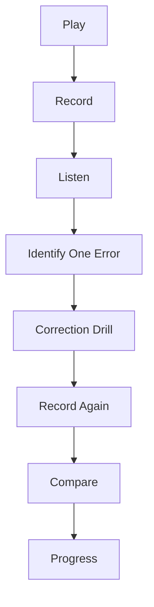
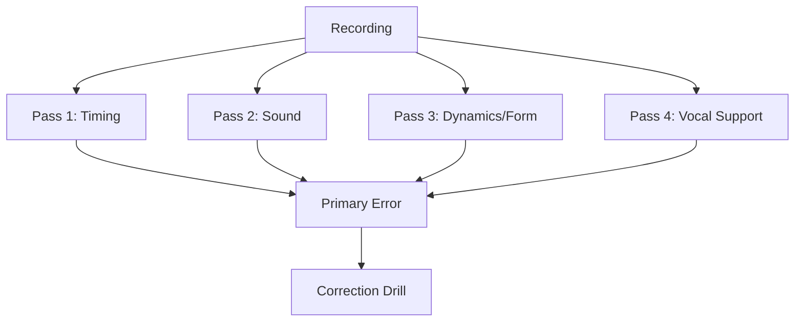
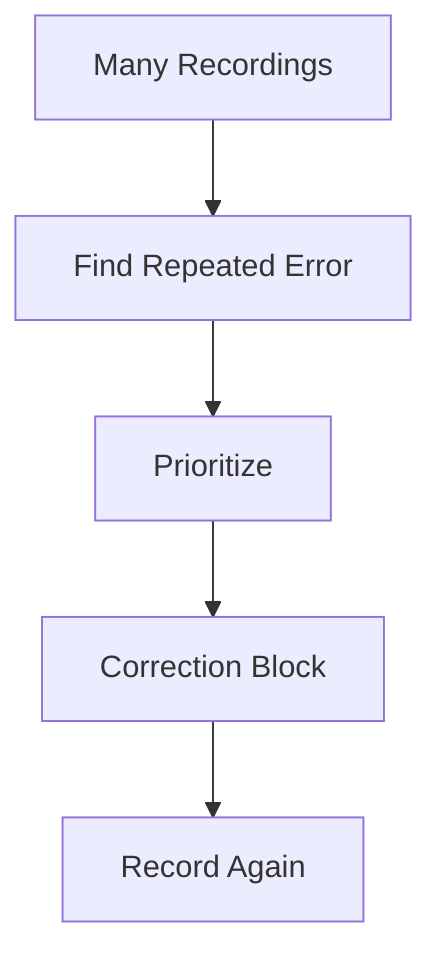

# learn-drum-cajon-part-026.md

# Part 026 — Recording Yourself: Feedback Loop yang Jujur

## Status Seri

- Seri: `learn-drum-cajon`
- Part: `026`
- Topik: Merekam diri sendiri sebagai feedback loop
- Target akhir seri: mampu mengiringi penyanyi dengan drum dan/atau cajon secara stabil, musikal, dan sadar konteks
- Status: seri belum selesai
- Part sebelumnya: `learn-drum-cajon-part-025.md`
- Part berikutnya: `learn-drum-cajon-part-027.md`

---

## Tujuan Part Ini

Part ini membahas salah satu alat belajar paling kuat: merekam diri sendiri. Rekaman adalah feedback loop yang jujur. Banyak pemain merasa sudah stabil, sudah pelan, sudah musikal, tetapi rekaman menunjukkan kenyataan berbeda.

Rekaman membantu menjawab:

- apakah tempo stabil?
- apakah fill rush?
- apakah vokal tertutup?
- apakah cajon slap terlalu keras?
- apakah hi-hat terlalu dominan?
- apakah verse dan chorus berbeda?
- apakah ending jelas?
- apakah sound mendukung lagu?
- apakah body tegang?
- apakah aku benar-benar siap tampil?

Setelah menyelesaikan part ini, kamu harus mampu:

1. merekam latihan dengan setup sederhana,
2. memilih apa yang direkam,
3. menamai file rekaman,
4. melakukan review 4-pass,
5. memberi skor objektif,
6. membedakan kritik dan data,
7. membuat correction drill dari rekaman,
8. melacak progress mingguan,
9. menghindari self-judgment berlebihan,
10. membangun feedback loop latihan yang konsisten.

---

# 1. Kenapa Rekaman Sangat Penting?

Saat bermain, otakmu sibuk:

- menjaga pattern,
- menghitung,
- mengontrol tangan/kaki,
- mendengar lagu,
- membaca chart,
- mengingat fill,
- mengelola gugup.

Karena itu, persepsi saat bermain sering tidak akurat.

Kamu mungkin merasa:

```text
Saya stabil.
```

Tetapi rekaman menunjukkan:

```text
fill selalu rush.
```

Kamu mungkin merasa:

```text
Saya main pelan.
```

Tetapi rekaman menunjukkan:

```text
slap cajon menutup vokal.
```

Rekaman mengubah latihan dari opini menjadi data.



Rule:

> Jika kamu tidak merekam, kamu hanya menebak.

---

# 2. Rekaman Bukan Penghakiman

Masalah umum:

- takut mendengar diri sendiri,
- merasa malu,
- merasa buruk,
- langsung membandingkan dengan profesional,
- berhenti karena kecewa.

Reframe:

```text
Rekaman bukan bukti saya buruk.
Rekaman adalah log observability.
```

Sebagai engineer, rekaman adalah seperti:

- logs,
- metrics,
- traces,
- profiling,
- test report.

Tanpa observability, debugging lambat.

---

# 3. Apa yang Harus Direkam?

Jangan selalu merekam full song. Rekam sesuai tujuan.

## 3.1 Rekaman Micro Skill

Durasi: 30–60 detik.

Contoh:

- cajon bass/slap separation,
- drum hi-hat level,
- fill 1 beat,
- 6/8 count,
- silence entry.

Cocok untuk debugging cepat.

## 3.2 Rekaman Section

Durasi: 1–2 menit.

Contoh:

- verse → chorus,
- bridge drop → final chorus,
- intro entry,
- ending.

Cocok untuk form/dynamics.

## 3.3 Rekaman Full Song

Durasi: lagu penuh.

Cocok untuk:

- endurance,
- live simulation,
- form,
- capstone,
- mock performance.

## 3.4 Rekaman Video

Cocok untuk:

- posture,
- tension,
- sticking,
- cajon hand pain,
- kick foot motion,
- body movement.

## 3.5 Rekaman Audio

Cocok untuk:

- timing,
- balance,
- dynamics,
- vocal support,
- groove feel.

---

# 4. Setup Rekaman Minimal

Kamu tidak butuh studio.

## 4.1 HP Saja

Cukup untuk awal.

Posisi:

- 1–2 meter dari alat,
- tidak terlalu dekat hi-hat/slap,
- arahkan ke performer,
- jika ada vokal/backing track, posisikan agar semua terdengar.

## 4.2 Rekam dari Posisi Pendengar

Jika tujuan accompaniment, rekam dari depan, bukan hanya dari dekat alat.

Pertanyaan:

```text
Dari posisi pendengar, apakah vokal jelas?
```

## 4.3 Rekam Close untuk Teknik

Jika tujuan sound/teknik:

- rekam dekat tangan/kaki,
- video lebih berguna,
- cek movement.

## 4.4 Jangan Terlalu Sempurna Setup

Setup terlalu rumit bisa jadi alasan tidak merekam. Untuk awal:

```text
HP + timer + folder file = cukup
```

---

# 5. File Naming

Beri nama file agar bisa dilacak.

Format:

```text
YYYY-MM-DD_instrument_skill_tempo_takeXX
```

Contoh:

```text
2026-06-25_cajon_basic-pop_70bpm_take01.mp3
2026-06-25_drum_fill-return_65bpm_take02.mp4
2026-06-25_cajon_song1_verse-chorus_take03.mp3
2026-06-25_drum_mock-performance_song1_take01.mp4
```

Nama file penting karena progress perlu dibandingkan.

---

# 6. Recording Log

Gunakan log:

```md
# Recording Log

Date:
File:
Instrument:
Tempo:
Focus:
Duration:
Take:

## Context
- 

## First impression
- 

## Timing notes
- 

## Sound notes
- 

## Dynamics notes
- 

## Form/fill notes
- 

## Vocal support notes
- 

## Primary error
- 

## Correction drill
- 
```

Jangan semua rekaman butuh log panjang. Tetapi rekaman penting perlu log.

---

# 7. Review 4-Pass Method

Jangan dengarkan semuanya sekaligus. Gunakan 4 pass.



## Pass 1 — Timing

Dengarkan:

- rush?
- drag?
- fill rush?
- chorus rush?
- slow tempo collapse?
- beat 1 jelas?

## Pass 2 — Sound Balance

Dengarkan:

- kick/bass jelas?
- snare/slap terlalu keras?
- hi-hat/touch terlalu dominan?
- crash/accent berlebihan?
- bass/slap separation?

## Pass 3 — Dynamics dan Form

Dengarkan:

- verse lebih kecil dari chorus?
- bridge drop/build jelas?
- fill di tempat benar?
- ending jelas?
- section tidak missed?

## Pass 4 — Vocal Support

Dengarkan:

- lirik jelas?
- fill menabrak?
- ada ruang napas?
- permainan mendukung emosi?
- terlalu ramai?

---

# 8. Review dengan Skor

Gunakan skor 1–5.

| Area | 1 | 3 | 5 |
|---|---|---|---|
| Time | goyah | cukup | stabil |
| Sound | kasar/tidak balance | cukup | jelas |
| Dynamics | datar | cukup | musikal |
| Form | tersesat | cukup | aman |
| Fill | mengganggu | cukup | membantu |
| Vocal Support | tertutup | cukup | sangat jelas |
| Recovery | panik | cukup | tenang |

Contoh:

```md
Time: 3
Sound: 2
Dynamics: 3
Form: 4
Fill: 2
Vocal Support: 2
Recovery: 3

Primary error:
- cajon slap/touch terlalu keras sehingga vokal tertutup.

Correction:
- slap level 2 drill + sparse verse.
```

Jangan memperbaiki semua skor rendah sekaligus. Pilih primary error.

---

# 9. Primary Error Rule

Setelah review, pilih satu primary error.

Buruk:

```text
Timing kurang, sound kurang, dynamics kurang, fill juga kurang.
```

Baik:

```text
Primary error: fill rush sebelum chorus.
```

Kenapa satu?

Karena latihan berikutnya harus fokus. Jika kamu memperbaiki semuanya sekaligus, kamu tidak tahu apa yang berhasil.

---

# 10. Before/After Comparison

Rekaman paling berguna jika dibandingkan.

## 10.1 Format

```md
# Before/After

Skill:
Before file:
After file:
Correction drill:

## Before
- 

## After
- 

## Improved?
- yes/no/partial

## Next
- 
```

## 10.2 Contoh

```md
Skill: fill return
Before: fill rush 8/10 times
Correction: 1-beat fill at 60 BPM
After: fill rush 3/10 times
Next: continue 65 BPM
```

Progress tidak harus langsung sempurna. Partial improvement adalah data bagus.

---

# 11. Video Review

Video membantu melihat hal yang tidak terdengar.

## 11.1 Drum Video Review

Cek:

- bahu naik?
- grip tegang?
- kaki kanan membuat badan goyang?
- hi-hat stroke terlalu besar?
- snare stroke terlalu tinggi?
- crash motion berlebihan?
- posture condong?

## 11.2 Cajon Video Review

Cek:

- badan terlalu membungkuk?
- tangan memukul terlalu keras?
- wrist kaku?
- slap membuat pain?
- bass area konsisten?
- tangan kiri/kanan timpang?
- cajon bergeser?

## 11.3 Visual Tension Checklist

| Checklist | Ya/Tidak |
|---|---|
| bahu rileks | |
| napas normal | |
| tangan tidak kaku | |
| gerak kecil cukup | |
| badan stabil | |
| tidak meringis saat slap | |
| tidak memukul berlebihan | |

---

# 12. Audio Review

Audio membantu mendengar hasil musikal.

## 12.1 Drum Audio Checklist

| Pertanyaan | Ya/Tidak |
|---|---|
| kick terdengar stabil? | |
| snare tidak terlalu keras? | |
| hi-hat tidak mendominasi? | |
| crash hanya marker? | |
| fill kembali beat 1? | |
| groove mendukung vokal? | |

## 12.2 Cajon Audio Checklist

| Pertanyaan | Ya/Tidak |
|---|---|
| bass jelas? | |
| slap tidak terlalu tajam? | |
| touch ringan? | |
| bass/slap berbeda? | |
| ghost tidak mengganggu? | |
| groove tidak monoton? | |

---

# 13. Recording with Metronome

Ada dua mode.

## 13.1 Metronome Terdengar di Rekaman

Kelebihan:

- mudah mendeteksi rush/drag,
- bagus untuk debugging.

Kekurangan:

- tidak seperti performance nyata,
- bisa membuat terlalu fokus click.

## 13.2 Metronome Tidak Terdengar

Kelebihan:

- lebih natural,
- menguji internal clock.

Kekurangan:

- timing lebih sulit dievaluasi tanpa reference.

## 13.3 Protocol

Untuk skill timing:

```text
Take 1: click audible
Take 2: click not audible / no click
```

Bandingkan.

---

# 14. Recording with Song/Backing Track

Jika rekam dengan lagu:

Dengarkan:

- apakah kamu lock dengan track?
- apakah kamu lebih keras dari vokal?
- apakah fill menabrak vokal asli?
- apakah groove cocok?
- apakah kamu mengikuti dynamics lagu?

Jangan menaruh volume backing track terlalu kecil. Kalau backing track kecil, kamu akan overplay.

---

# 15. Recording Without Song

Rekam groove kosong juga penting.

Kelebihan:

- timing terdengar jelas,
- sound balance mudah didengar,
- tidak tertutup track.

Kekurangan:

- tidak menguji vocal support,
- tidak menguji form musikal.

Gunakan keduanya:

- groove kosong untuk teknik,
- lagu/backing track untuk accompaniment.

---

# 16. Weekly Recording System

## 16.1 Daily Micro Recording

Durasi 1 menit.

Fokus:

- skill hari itu.

## 16.2 Weekly Song Recording

Durasi 2–4 menit.

Fokus:

- lagu capstone.

## 16.3 Phase Recording

Setiap milestone:

- jam 4,
- jam 8,
- jam 12,
- jam 16,
- jam 20.

Output:

```text
milestone_hour04_foundation
milestone_hour08_basic-groove
milestone_hour12_4-4-groove
milestone_hour16_form-fill
milestone_hour20_capstone
```

---

# 17. Progress Dashboard

```md
# Recording Progress Dashboard

Total recordings:
Best take:
Worst recurring error:
Most improved:
Current primary error:
Next correction drill:

## Scores
| Date | File | Time | Sound | Dynamics | Form | Fill | Vocal | Notes |
|---|---|---:|---:|---:|---:|---:|---:|---|
| | | | | | | | | |
```

Dengan dashboard, kamu bisa melihat pola.

---

# 18. Pattern Recognition dari Rekaman

Setelah beberapa rekaman, cari pola:

- selalu rush saat fill,
- selalu terlalu keras di chorus,
- cajon slap selalu dominan,
- hi-hat selalu menutup,
- verse selalu terlalu ramai,
- ending selalu tidak jelas,
- 6/8 selalu datar,
- bridge selalu bingung.

Pola lebih penting daripada error sekali-sekali.



---

# 19. How to Listen Without Self-Hate

Gunakan bahasa observasi.

Jangan:

```text
Saya payah.
```

Gunakan:

```text
Hi-hat terlalu keras di verse.
Fill bar 8 rush.
Snare masuk sedikit telat di 4.
```

Jangan:

```text
Ini jelek banget.
```

Gunakan:

```text
Primary issue adalah balance; timing cukup stabil.
```

Bahasa objektif membuat latihan berlanjut.

---

# 20. Share Recording for Feedback

Jika meminta feedback orang lain, berikan pertanyaan spesifik.

Buruk:

```text
Menurutmu gimana?
```

Baik:

```text
Apakah cajon slap terlalu keras dibanding vokal?
Apakah fill sebelum chorus rush?
Apakah verse dan chorus sudah terasa beda?
Apakah ending jelas?
```

Feedback spesifik lebih mudah dipakai.

## 20.1 Siapa yang Diminta Feedback?

- penyanyi,
- gitaris/pianis,
- guru,
- teman musisi,
- pendengar awam.

Pendengar awam bisa memberi feedback penting:

```text
vokal kurang terdengar
lagunya terasa kecepetan
bagian chorus kurang naik
```

Meskipun mereka tidak tahu istilah teknis.

---

# 21. Recording Review by Persona

Dengarkan rekaman sebagai tiga persona.

## 21.1 Sebagai Drummer/Cajon Player

Fokus:

- timing,
- sound,
- fill,
- groove.

## 21.2 Sebagai Penyanyi

Fokus:

- apakah nyaman bernyanyi di atas ini?
- apakah fill mengganggu?
- apakah napas punya ruang?

## 21.3 Sebagai Audience

Fokus:

- apakah lagu enak?
- apakah vokal jelas?
- apakah groove terasa stabil?
- apakah ada bagian mengganggu?

Ini membantu tidak terlalu teknis.

---

# 22. Correction Drill Design

Setelah menemukan error, buat drill.

Format:

```md
Error:
Correction drill:
Tempo:
Duration:
Constraint:
Success criteria:
Next test:
```

Contoh:

```md
Error:
- Fill rush before chorus.

Correction drill:
- Groove 3 bars + 1-beat fill + return.

Tempo:
- 60 BPM.

Duration:
- 10 min.

Constraint:
- fill only S-S or B-S.

Success:
- 8/10 returns land on beat 1.

Next test:
- record verse → chorus.
```

---

# 23. Recording-Based Practice Session

Durasi 30 menit.

| Durasi | Aktivitas |
|---:|---|
| 5 menit | dengar rekaman lama |
| 5 menit | pilih primary error |
| 10 menit | correction drill |
| 5 menit | rekam ulang |
| 5 menit | compare |

Ini sangat efektif.

---

# 24. Objective Metrics

Tidak semua musik bisa diukur angka, tetapi beberapa bisa.

## 24.1 Timing

- berapa kali fill rush?
- apakah beat 1 setelah fill tepat?
- berapa bar sebelum tempo terasa naik?

## 24.2 Dynamics

- apakah verse lebih kecil dari chorus?
- apakah final chorus paling besar?
- apakah bridge drop jelas?

## 24.3 Fill

- berapa fill per section?
- apakah fill menabrak vokal?
- apakah fill kembali beat 1?

## 24.4 Vocal Support

- apakah lirik jelas?
- apakah high-frequency rhythm terlalu dominan?
- apakah ruang napas ada?

---

# 25. Recording Mistakes

## 25.1 Terlalu Jarang Merekam

Correction:

- rekam 1 menit setiap sesi.

## 25.2 Merekam Tapi Tidak Review

Correction:

- review 5 menit langsung.

## 25.3 Review Terlalu Banyak Hal

Correction:

- pilih primary error.

## 25.4 Menghapus Semua Rekaman Buruk

Correction:

- simpan sebagai baseline.
- rekaman buruk menunjukkan progress nanti.

## 25.5 Hanya Merekam Saat Sudah Bagus

Correction:

- rekam proses, bukan hanya hasil.

---

# 26. Debugging Guide

| Gejala | Penyebab | Correction |
|---|---|---|
| merasa bagus tapi rekaman buruk | perception gap | record more often |
| tidak tahu error | review terlalu global | 4-pass method |
| self-critical berlebihan | bahasa judgement | symptom language |
| progress tidak terlihat | no file naming/log | dashboard |
| error berulang | no correction drill | error-specific drill |
| timing tidak jelas | no click reference | record with click |
| vocal tertutup | mic position/player volume | listener-position recording |
| body tegang tidak sadar | audio only | video review |

---

# 27. Practice Protocol 30 Menit: Recording Loop

```md
0-5 min:
- listen to previous take

5-10 min:
- identify primary error
- set correction

10-20 min:
- correction drill

20-25 min:
- record new take

25-30 min:
- compare before/after
```

---

# 28. Practice Protocol 45 Menit: Song Recording

```md
0-5 min:
- warm-up

5-10 min:
- review chart

10-20 min:
- practice weak transition

20-30 min:
- record full section/song

30-40 min:
- 4-pass review

40-45 min:
- update log and next drill
```

---

# 29. Recording Score Thresholds

Untuk performance readiness, target:

| Area | Minimum |
|---|---:|
| Time | 4 |
| Vocal Support | 4 |
| Form | 4 |
| Sound | 3 |
| Dynamics | 3 |
| Fill | 3 |
| Recovery | 3 |

Jika time/vocal/form di bawah 4, jangan menambah complexity. Perbaiki dulu.

---

# 30. Mini Capstone Part Ini

Ambil satu lagu capstone. Lakukan recording loop.

```md
# Recording Capstone

Song:
Instrument:
Date:
Take:

## Setup
Position:
With click/backing:
Chart used:

## Scores
Time:
Sound:
Dynamics:
Form:
Fill:
Vocal Support:
Recovery:

## Primary Error
- 

## Evidence
- 

## Correction Drill
- 

## Next Take Goal
- 
```

Lakukan minimal 2 take:

- Take 1 = baseline,
- Take 2 = setelah correction drill.

Bandingkan.

---

# 31. Acceptance Criteria Part Ini

Kamu boleh lanjut ke Part 027 jika:

1. bisa merekam latihan dengan HP atau alat sederhana,
2. bisa menamai file rekaman,
3. bisa memilih jenis rekaman: micro/section/full/video,
4. bisa melakukan review 4-pass,
5. bisa memberi skor 1–5,
6. bisa memilih primary error,
7. bisa membuat correction drill,
8. bisa membandingkan before/after,
9. bisa menghindari self-judgment vague,
10. bisa memakai rekaman untuk menentukan latihan berikutnya.

---

# 32. Ringkasan

Merekam diri sendiri adalah feedback loop paling jujur.

Rekaman membantu melihat:

- timing,
- sound,
- dynamics,
- form,
- fill,
- vocal support,
- body mechanics,
- recovery.

Gunakan:

1. record,
2. review,
3. primary error,
4. correction drill,
5. record again,
6. compare.

Jangan gunakan rekaman untuk menghukum diri. Gunakan rekaman sebagai observability.

Rule paling penting:

> Rekaman buruk yang direview dengan benar lebih berguna daripada latihan panjang tanpa feedback.

---

# 33. Latihan untuk Part Berikutnya

Sebelum lanjut ke Part 027, lakukan:

1. Rekam 1 menit basic groove.
2. Rekam 1 menit verse → chorus.
3. Review dengan 4-pass method.
4. Beri skor 1–5.
5. Pilih primary error.
6. Buat correction drill.
7. Rekam ulang.
8. Bandingkan before/after.

Part berikutnya membahas:

> genre pack minimum untuk accompaniment: pop, acoustic, worship, ballad, folk, rock ringan, shuffle/triplet, dan cara memilih feel tanpa tenggelam dalam genre theory.
