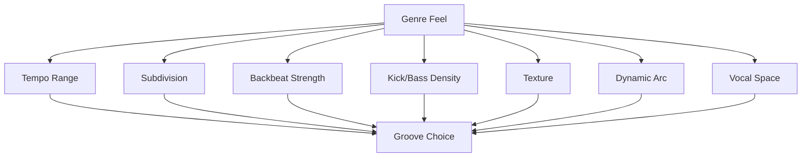
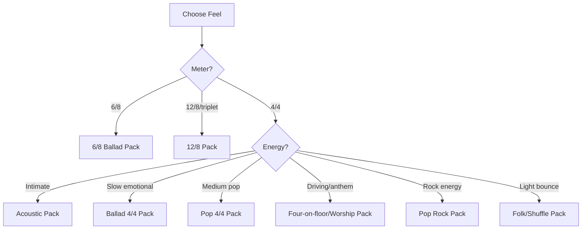

# learn-drum-cajon-part-027.md

# Part 027 — Genre Pack Minimum untuk Accompaniment

## Status Seri

- Seri: `learn-drum-cajon`
- Part: `027`
- Topik: Genre pack minimum untuk accompaniment drum/cajon
- Target akhir seri: mampu mengiringi penyanyi dengan drum dan/atau cajon secara stabil, musikal, dan sadar konteks
- Status: seri belum selesai
- Part sebelumnya: `learn-drum-cajon-part-026.md`
- Part berikutnya: `learn-drum-cajon-part-028.md`

---

## Tujuan Part Ini

Part ini membahas “genre pack” minimum. Tujuannya bukan menjadikanmu ahli semua genre. Tujuannya adalah memberi vocabulary praktis agar saat penyanyi berkata:

- “ini pop acoustic,”
- “ini ballad,”
- “ini agak worship,”
- “ini folk,”
- “ini rock ringan,”
- “ini 6/8,”
- “ini mau lebih driving,”
- “ini jangan terlalu rame,”

kamu punya respons musikal yang masuk akal.

Setelah menyelesaikan part ini, kamu harus mampu:

1. memahami genre sebagai kumpulan feel, bukan sekadar label,
2. memilih groove berdasarkan kebutuhan lagu,
3. memainkan pack dasar pop 4/4,
4. memainkan pack acoustic/singer-songwriter,
5. memainkan pack ballad 4/4,
6. memainkan pack 6/8 dan 12/8,
7. memainkan pack worship/acoustic build,
8. memainkan pack folk/light shuffle,
9. memainkan pack rock ringan,
10. mengadaptasi setiap genre ke drum kit dan cajon secara sederhana.

---

# 1. Genre sebagai Constraint, Bukan Penjara

Genre sering membuat pemula takut:

```text
Saya belum bisa pop.
Saya belum bisa worship.
Saya belum bisa rock.
Saya belum bisa folk.
Saya belum bisa shuffle.
```

Tetapi untuk accompaniment awal, genre bisa dipahami sebagai constraint praktis:

- tempo,
- feel,
- backbeat,
- subdivision,
- density,
- dynamics,
- texture,
- role vocal,
- typical energy arc.



Genre bukan hukum absolut. Genre adalah starting point.

Rule:

> Jangan bertanya “genre ini pattern-nya apa?” terlebih dahulu. Tanyakan “feel, energi, dan ruang vokal seperti apa yang dibutuhkan?”

---

# 2. Genre Pack Minimum

Kita akan membangun 8 pack:

| Pack | Fungsi |
|---:|---|
| 1 | Pop 4/4 Basic |
| 2 | Acoustic / Singer-Songwriter |
| 3 | Ballad 4/4 |
| 4 | 6/8 Ballad |
| 5 | 12/8 / Triplet Ballad |
| 6 | Worship / Anthem Build |
| 7 | Folk / Light Shuffle |
| 8 | Rock Ringan / Pop Rock |

Setiap pack akan dibahas dengan:

- feel,
- drum kit version,
- cajon version,
- dynamics,
- common mistakes,
- latihan,
- kapan dipakai.

---

# 3. Pack 1 — Pop 4/4 Basic

## 3.1 Feel

Pop 4/4 basic adalah default modern accompaniment.

Feel:

```text
1 & 2 & 3 & 4 &
```

Backbeat:

```text
2 dan 4
```

Karakter:

- jelas,
- stabil,
- tidak terlalu ramai,
- mudah dinyanyikan,
- cocok untuk banyak lagu.

## 3.2 Drum Kit Groove

```text
Count : 1 & 2 & 3 & 4 &
Hat   : x x x x x x x x
Kick  : K       K
Snare :     S       S
```

Variation chorus:

```text
Count : 1 & 2 & 3 & 4 &
Hat   : x x x x x x x x
Kick  : K     K K
Snare :     S       S
```

## 3.3 Cajon Groove

```text
Count : 1 & 2 & 3 & 4 &
Touch : t t t t t t t t
Bass  : B       B
Slap  :     S       S
```

Variation chorus:

```text
Count : 1 & 2 & 3 & 4 &
Touch : t t t t t t t t
Bass  : B     B B
Slap  :     S       S
```

## 3.4 Dynamic Map

| Section | Strategy |
|---|---|
| Verse | sparse / soft |
| Pre | add density |
| Chorus | full basic |
| Bridge | drop or half-time |
| Final | stronger controlled |

## 3.5 Common Mistakes

| Mistake | Correction |
|---|---|
| hi-hat/touch terlalu keras | level 1–2 |
| chorus rush | lift without speeding |
| verse terlalu full | sparse verse |
| fill terlalu sering | fill every 8 bars max |
| semua section sama | dynamic map |

## 3.6 Latihan

```text
4 bar sparse verse
4 bar basic chorus
repeat 5x
```

Acceptance:

- chorus naik,
- tempo tidak naik,
- vokal imajiner tetap jelas.

---

# 4. Pack 2 — Acoustic / Singer-Songwriter

## 4.1 Feel

Acoustic/singer-songwriter biasanya lebih vocal-forward.

Karakter:

- intimate,
- lyric-driven,
- dynamic kecil,
- ruang besar,
- fill sangat sedikit,
- gitar/piano sering dominan.

## 4.2 Drum Kit Approach

Gunakan:

- rim click,
- closed hi-hat sangat soft,
- kick ringan,
- no crash di verse,
- snare soft jika chorus.

Groove:

```text
Count : 1 & 2 & 3 & 4 &
Hat   : x   x   x   x
Kick  : K       K
Rim   :     r       r
```

Atau lebih sparse:

```text
Count : 1 & 2 & 3 & 4 &
Kick  : K
Rim   :         r
Hat   : x       x
```

## 4.3 Cajon Approach

Cajon sangat cocok untuk pack ini.

Groove:

```text
Count : 1 & 2 & 3 & 4 &
Bass  : B       B
Slap  :     s       s
Touch :   t       t
```

Lebih intimate:

```text
Count : 1 & 2 & 3 & 4 &
Bass  : B
Slap  :         s
Touch :       t
```

## 4.4 Dynamics

| Section | Level |
|---|---:|
| Intro | 0–1 |
| Verse | 1–2 |
| Chorus | 3 |
| Bridge | 0–2 |
| Final | 3–4 |

## 4.5 Common Mistakes

- terlalu banyak touch,
- slap/snare terlalu keras,
- fill di setiap jeda vokal,
- main seperti full band padahal acoustic,
- tidak mendengar gitar/piano density.

Correction:

- main 30% lebih pelan,
- no fill verse,
- gunakan lyric anchor,
- rekam dari depan.

## 4.6 Latihan

Pilih lagu acoustic. Mainkan 3 versi:

1. no percussion,
2. sparse cajon/drum,
3. fuller chorus.

Bandingkan mana yang paling mendukung vokal.

---

# 5. Pack 3 — Ballad 4/4

## 5.1 Feel

Ballad 4/4 adalah lagu lambat dengan pulse 4/4 straight.

Karakter:

- slow tempo,
- emotional,
- banyak ruang,
- fill minim,
- dynamics halus,
- internal subdivision penting.

## 5.2 Drum Kit Groove

Soft verse:

```text
Count : 1 & 2 & 3 & 4 &
Hat   : x   x   x   x
Kick  : K       K
Snare :     s       s
```

Chorus:

```text
Count : 1 & 2 & 3 & 4 &
Hat   : x x x x x x x x
Kick  : K       K
Snare :     S       S
```

Half-time option:

```text
Count : 1 & 2 & 3 & 4 &
Hat   : x x x x x x x x
Kick  : K       K
Snare :         S
```

## 5.3 Cajon Groove

Verse:

```text
Count : 1 & 2 & 3 & 4 &
Bass  : B       B
Slap  :     s       s
Touch :   t       t
```

Chorus:

```text
Count : 1 & 2 & 3 & 4 &
Touch : t t t t t t t t
Bass  : B       B
Slap  :     S       S
```

## 5.4 Ballad Rule

> Ballad tidak membutuhkan banyak note. Ballad membutuhkan kesabaran, time, dan ruang.

## 5.5 Common Mistakes

| Mistake | Correction |
|---|---|
| slow tempo rush | count 16th internally |
| fill terlalu panjang | 1-beat fill |
| semua terlalu keras | L1–L3 |
| chorus rush | dynamic metronome |
| verse terlalu ramai | sparse groove |

---

# 6. Pack 4 — 6/8 Ballad

## 6.1 Feel

6/8 terasa sebagai dua gelombang besar:

```text
1 2 3 4 5 6
ONE two three FOUR five six
```

Karakter:

- mengayun,
- emotional,
- cocok ballad/worship/acoustic,
- tidak square.

## 6.2 Drum Kit Groove

```text
Count : 1 2 3 4 5 6
Hat   : x x x x x x
Kick  : K
Snare :       S
```

Stronger:

```text
Count : 1 2 3 4 5 6
Hat   : x x x x x x
Kick  : K       K
Snare :       S
```

## 6.3 Cajon Groove

```text
Count : 1 2 3 4 5 6
Touch : t t t t t t
Bass  : B
Slap  :       S
```

Stronger:

```text
Count : 1 2 3 4 5 6
Touch : t t t t t t
Bass  : B       B
Slap  :       S
```

## 6.4 Fill 6/8

Simple fill:

```text
Count : 1 2 3 4 5 6
Fill  :       t t S
```

atau drum:

```text
Count : 1 2 3 4 5 6
Fill  :       S S T
```

## 6.5 Common Mistakes

- semua hitungan sama kuat,
- kehilangan aksen 1 dan 4,
- memaksa jadi 4/4,
- fill rush ke beat 1,
- touch/hat terlalu ramai.

Correction:

- clap 1 and 4,
- count out loud,
- fill hanya 4-5-6,
- slow tempo.

---

# 7. Pack 5 — 12/8 / Triplet Ballad

## 7.1 Feel

12/8 terasa seperti 4 beat besar, masing-masing dibagi tiga:

```text
1 la li 2 la li 3 la li 4 la li
```

Karakter:

- soulful,
- rolling,
- triplet-based,
- smooth,
- emotional.

## 7.2 Drum Kit Groove

```text
Count : 1 la li 2 la li 3 la li 4 la li
Hat   : x x x  x x x  x x x  x x x
Kick  : K             K
Snare :        S             S
```

Sparse:

```text
Count : 1 la li 2 la li 3 la li 4 la li
Hat   : x      x      x      x
Kick  : K             K
Snare :        s             s
```

## 7.3 Cajon Groove

```text
Count : 1 la li 2 la li 3 la li 4 la li
Touch : t t t  t t t  t t t  t t t
Bass  : B             B
Slap  :        S             S
```

Sparse:

```text
Touch : t      t      t      t
Bass  : B             B
Slap  :        s             s
```

## 7.4 Common Mistakes

- triplet terasa kaku,
- backbeat hilang,
- terlalu banyak fill,
- chorus rush,
- tidak membedakan 12/8 dan 4/4 straight.

Correction:

- ucapkan `1 la li 2 la li...`,
- tap 4 beat besar,
- jangan main terlalu keras,
- keep vocal first.

---

# 8. Pack 6 — Worship / Anthem Build

## 8.1 Feel

Worship/anthem build sering punya dynamic arc panjang:

```text
intro soft → verse soft → pre build → chorus big → bridge build → final chorus biggest
```

Karakter:

- gradual build,
- repeated chorus/tag,
- leader cue,
- dynamics penting,
- four-on-floor sering muncul,
- bridge bisa drop lalu build.

## 8.2 Drum Kit Groove

Verse:

```text
Hat   : x   x   x   x
Kick  : K       K
Snare :     s       s
```

Chorus:

```text
Hat   : x x x x x x x x
Kick  : K   K   K   K
Snare :     S       S
```

Bridge build:

```text
Snare/tom/touch build gradually
Kick simple
No rush
```

## 8.3 Cajon Groove

Verse:

```text
Bass  : B       B
Slap  :     s       s
Touch :   t       t
```

Chorus/four-on-floor:

```text
Count : 1 & 2 & 3 & 4 &
Bass  : B   B   B   B
Slap  :     S       S
Touch : t t t t t t t t
```

Bridge build:

```text
touch roll / gradual slap / no over-hit
```

## 8.4 Worship-Specific Risks

- full terlalu awal,
- bridge build rush,
- tidak mengikuti leader cue,
- terlalu banyak fill,
- final chorus tidak punya ruang naik,
- repeated tag tidak diantisipasi.

## 8.5 Strategy

- simpan energi,
- tulis tag/repeat cue,
- follow leader,
- no fill saat lyric worship penting,
- build by density, not tempo.

---

# 9. Pack 7 — Folk / Light Shuffle

## 9.1 Feel

Folk bisa straight atau sedikit swing. Light shuffle/triplet feel memiliki ayunan.

Straight folk:

```text
1 & 2 & 3 & 4 &
```

Light shuffle:

```text
1   a 2   a 3   a 4   a
```

Atau rasa triplet:

```text
1 trip let 2 trip let...
```

## 9.2 Drum Kit Approach

Folk straight:

```text
Hat   : x   x   x   x
Kick  : K       K
Snare :     s       s
```

Light shuffle:

```text
Ride/hat: swing 8th
Kick    : simple
Snare   : 2/4 soft
```

Representasi sederhana:

```text
Count : 1 a 2 a 3 a 4 a
Hat   : x x x x x x x x
Kick  : K       K
Snare :     S       S
```

## 9.3 Cajon Approach

Straight folk:

```text
Bass  : B       B
Slap  :     s       s
Touch :   t       t
```

Light shuffle feel:

```text
Count : 1 a 2 a 3 a 4 a
Touch : t t t t t t t t
Bass  : B       B
Slap  :     S       S
```

Jangan terlalu literal jika belum siap. Cukup beri sedikit bounce.

## 9.4 Common Mistakes

- swing terlalu berlebihan,
- shuffle jadi tidak stabil,
- terlalu ramai,
- tidak lock dengan gitar strum.

Correction:

- main lebih sederhana,
- dengar gitar,
- accent ringan,
- jangan paksakan jika feel belum natural.

---

# 10. Pack 8 — Rock Ringan / Pop Rock

## 10.1 Feel

Rock ringan/pop rock membutuhkan backbeat lebih tegas dan energi lebih besar, tetapi tetap harus vocal-safe.

Karakter:

- snare/backbeat kuat,
- kick lebih aktif,
- hi-hat/ride lebih jelas,
- chorus energetic,
- fill lebih tegas,
- dynamic range lebih besar.

## 10.2 Drum Kit Groove

Basic rock/pop rock:

```text
Count : 1 & 2 & 3 & 4 &
Hat   : x x x x x x x x
Kick  : K     K K
Snare :     S       S
```

Driving:

```text
Count : 1 & 2 & 3 & 4 &
Hat   : x x x x x x x x
Kick  : K   K   K   K
Snare :     S       S
```

## 10.3 Cajon Adaptation

Cajon bisa melakukan pop rock ringan, tetapi ada batas power.

```text
Count : 1 & 2 & 3 & 4 &
Touch : t t t t t t t t
Bass  : B     B B
Slap  :     S       S
```

Chorus driving:

```text
Bass  : B   B   B   B
Slap  :     S       S
Touch : t t t t t t t t
```

## 10.4 Common Mistakes

- main terlalu keras di ruangan kecil,
- crash/slap terlalu banyak,
- tempo rush,
- fill terlalu ambisius,
- tidak lock dengan bass/gitar riff.

Correction:

- metronome,
- lock kick-bass,
- keep fill short,
- reduce cymbal/slap if vocal unclear.

---

# 11. Cross-Genre Translation

Kamu bisa menerjemahkan satu lagu ke beberapa feel.

## 11.1 Pop to Acoustic

Original:

```text
full drum kit, full chorus
```

Acoustic version:

```text
cajon sparse, no crash, softer slap
```

## 11.2 Ballad to 6/8

Jika lagu terasa mengayun, jangan paksa 4/4. Coba 6/8.

## 11.3 Rock to Cajon

Ambil:

- kick → bass,
- snare → slap,
- hat → touch,
- crash → accent/silence.

Kurangi:

- fill panjang,
- cymbal wash,
- kick padat jika tangan tidak kuat.

## 11.4 Worship Full Band to Acoustic

Full band:

```text
drum kit + bass + electric + keys
```

Acoustic:

```text
cajon + guitar/piano + vocal
```

Jangan meniru semua power. Ambil dynamic arc-nya.

---

# 12. Genre Selection Decision Tree



---

# 13. Genre Adaptation Table

| Need | Drum Kit Choice | Cajon Choice |
|---|---|---|
| intimate verse | rim/hat soft | sparse bass/slap |
| pop chorus | basic groove | basic pop cajon |
| anthem build | four-on-floor | careful four-on-floor |
| ballad | soft hat/rim | touch sparse |
| 6/8 | kick 1, snare 4 | bass 1, slap 4 |
| 12/8 | triplet hat | triplet touch |
| rock light | stronger snare | stronger slap |
| dense guitar | simple hat | reduce touch |
| piano ballad | minimal/rim | very soft cajon |

---

# 14. Genre and Instrument Choice

## 14.1 Drum Kit Better

- pop rock,
- full band,
- anthem,
- dynamic large,
- bass player present,
- stage medium/large.

## 14.2 Cajon Better

- acoustic,
- cafe,
- singer-songwriter,
- intimate ballad,
- rehearsal,
- small worship/acoustic set.

## 14.3 Hybrid Better

- acoustic anthem,
- worship small set,
- folk-pop,
- cajon + shaker,
- low-volume drum kit.

## 14.4 No Percussion Better

- very intimate intro,
- a cappella moment,
- rubato verse,
- lyric-heavy section,
- if percussion makes song worse.

---

# 15. Genre Pack Practice Rotation

## Day 1 — Pop 4/4

- basic groove,
- verse/chorus.

## Day 2 — Acoustic

- sparse,
- no fill,
- vocal space.

## Day 3 — Ballad

- slow tempo,
- internal subdivision.

## Day 4 — 6/8/12/8

- compound/triplet feel.

## Day 5 — Worship/Build

- dynamic arc,
- four-on-floor.

## Day 6 — Folk/Rock Light

- bounce/energy,
- lock with guitar.

## Day 7 — Review

- record 2 contrasting genres.

---

# 16. Practice: One Song, Three Genre Treatments

Pilih satu lagu sederhana 4/4. Mainkan tiga versi:

## Version 1 — Acoustic

```text
sparse, soft, no fill
```

## Version 2 — Pop

```text
basic 4/4, verse/chorus contrast
```

## Version 3 — Anthem/Rock Light

```text
stronger backbeat, more driving chorus
```

Review:

| Pertanyaan | Acoustic | Pop | Anthem |
|---|---|---|---|
| vocal clear? | | | |
| mood cocok? | | | |
| tempo stable? | | | |
| overplayed? | | | |
| best version? | | | |

Ini melatih taste.

---

# 17. Practice: Same Groove, Different Textures

Basic pattern sama, texture berbeda.

Drum:

```text
Version A: closed hi-hat
Version B: rim click
Version C: ride
Version D: open hat chorus
```

Cajon:

```text
Version A: bass/slap only
Version B: add touch
Version C: add ghost
Version D: add shaker
```

Tujuan:

> Genre feel sering berubah karena texture, bukan hanya pattern.

---

# 18. Practice: Genre Identification

Dengarkan lagu dan isi:

```md
# Genre Feel Diagnosis

Song:
Meter:
Subdivision:
Backbeat strength:
Energy:
Vocal space:
Ensemble density:
Closest pack:
Why:
Drum approach:
Cajon approach:
What to avoid:
```

Ini melatih listening.

---

# 19. Common Genre Mistakes

## 19.1 Semua Lagu Jadi Pop 4/4

Gejala:

- 6/8 hilang,
- ballad kaku,
- shuffle tidak mengayun.

Correction:

- meter diagnosis,
- count 6/8/12/8,
- listen before play.

## 19.2 Acoustic Dimainkan Terlalu Rock

Gejala:

- vocal tertutup,
- mood rusak.

Correction:

- sparse pack,
- no crash,
- slap/snare level kecil.

## 19.3 Worship Build Full Terlalu Cepat

Gejala:

- final chorus tidak punya impact.

Correction:

- dynamic arc,
- save level 5,
- build gradually.

## 19.4 Rock Ringan Terlalu Berisik

Gejala:

- backbeat/cymbal mengalahkan vokal.

Correction:

- controlled snare/slap,
- reduce cymbal,
- lock with bass.

## 19.5 Folk/Shuffle Terlalu Dipaksakan

Gejala:

- feel goyah.

Correction:

- simplify,
- gunakan light bounce,
- jangan over-swing.

---

# 20. Debugging Guide

| Gejala | Genre Error | Correction |
|---|---|---|
| lagu kaku | wrong subdivision | diagnose 4/4 vs 6/8 |
| terlalu ramai | acoustic treated as full band | sparse pack |
| chorus tidak naik | dynamic pack kurang | pop/anthem lift |
| final kurang impact | energy spent early | dynamic arc |
| groove tidak lock | ignoring guitar/bass | role separation |
| ballad rush | impatience | slow time drill |
| 12/8 flat | triplet not internal | count 1-la-li |
| cajon terlalu rock | slap overuse | reduce slap/touch |

---

# 21. Genre Pack Scorecard

Nilai 1–5.

| Pack | Score |
|---|---:|
| Pop 4/4 | |
| Acoustic | |
| Ballad 4/4 | |
| 6/8 | |
| 12/8 | |
| Worship/Anthem | |
| Folk/Shuffle | |
| Rock Light | |

Untuk setiap pack, nilai:

- time,
- groove,
- dynamics,
- vocal support,
- fill restraint.

---

# 22. Mini Capstone Part Ini

Pilih 4 genre pack:

1. pop 4/4,
2. acoustic,
3. ballad/6/8,
4. anthem/rock light.

Rekam masing-masing 60–90 detik.

Template:

```md
# Genre Pack Recording

Pack:
Song/Loop:
Instrument:
Groove:
Dynamic:
Main risk:
Score:
Correction:
```

Bandingkan mana yang paling natural dan mana yang paling perlu latihan.

---

# 23. Acceptance Criteria Part Ini

Kamu boleh lanjut ke Part 028 jika:

1. bisa menjelaskan genre sebagai constraint feel,
2. bisa memainkan pop 4/4 basic,
3. bisa memainkan acoustic sparse,
4. bisa memainkan ballad 4/4,
5. bisa memainkan 6/8 atau 12/8 sederhana,
6. bisa memainkan four-on-floor/worship build secara terkendali,
7. bisa menjelaskan kapan memakai cajon vs drum untuk genre tertentu,
8. bisa mendiagnosis genre feel lagu,
9. bisa mengadaptasi satu lagu ke minimal dua treatment,
10. bisa memilih pack yang tepat untuk lagu capstone.

---

# 24. Ringkasan

Genre pack minimum bukan untuk membuatmu ahli semua genre. Tujuannya memberi vocabulary praktis.

Pack utama:

1. pop 4/4,
2. acoustic,
3. ballad 4/4,
4. 6/8,
5. 12/8,
6. worship/anthem build,
7. folk/light shuffle,
8. rock ringan.

Setiap pack harus tunduk pada tujuan utama accompaniment:

- vokal jelas,
- time stabil,
- dynamics tepat,
- form aman,
- fill tidak mengganggu,
- lagu lebih kuat.

Rule paling penting:

> Genre adalah rasa dan fungsi, bukan daftar pattern yang dimainkan tanpa mendengar lagu.

---

# 25. Latihan untuk Part Berikutnya

Sebelum lanjut ke Part 028, lakukan:

1. Pilih 3 lagu capstone.
2. Tentukan genre pack untuk masing-masing.
3. Tentukan instrument: drum/cajon/hybrid/no percussion.
4. Buat chart ringkas.
5. Rekam 60–90 detik setiap lagu.
6. Beri skor:
   - time,
   - sound,
   - dynamics,
   - form,
   - vocal support.
7. Pilih primary error untuk masing-masing.

Part berikutnya adalah:

> final 20-hour capstone: mengiringi 3 lagu secara utuh dengan chart, recording, review, dan performance-readiness assessment.
