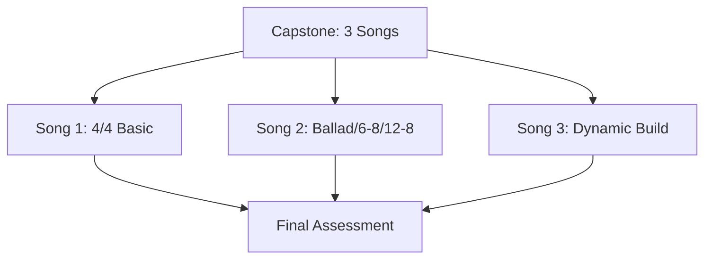
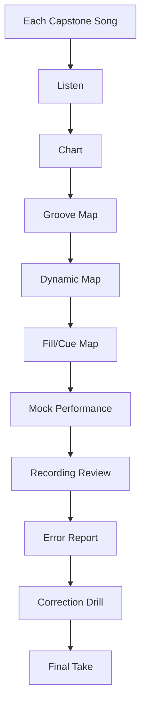
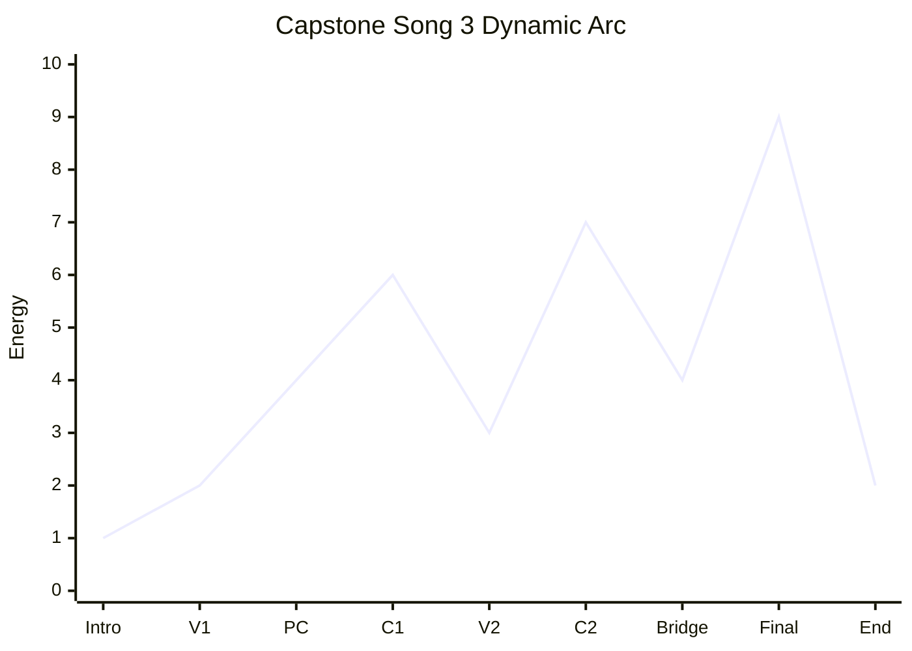
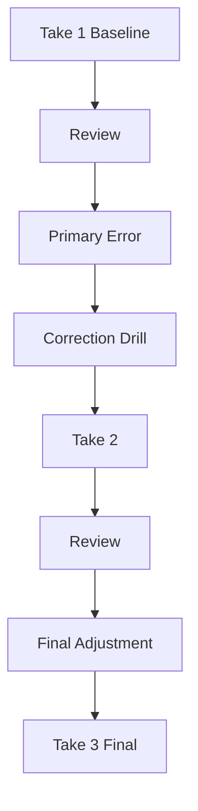

# learn-drum-cajon-part-028.md

# Part 028 — Final 20-Hour Capstone: Mengiringi 3 Lagu

## Status Seri

- Seri: `learn-drum-cajon`
- Part: `028`
- Topik: Final capstone 20 jam — mengiringi 3 lagu
- Target akhir seri: mampu mengiringi penyanyi dengan drum dan/atau cajon secara stabil, musikal, dan sadar konteks
- Status: seri belum selesai
- Part sebelumnya: `learn-drum-cajon-part-027.md`
- Part berikutnya: `learn-drum-cajon-part-029.md`

---

## Tujuan Part Ini

Part ini adalah capstone dari framework 20 jam. Semua skill yang sudah dibangun akan diuji dalam tugas nyata:

> mengiringi 3 lagu dengan drum dan/atau cajon secara utuh, menggunakan chart, dynamics, fill aman, vocal awareness, dan recording review.

Capstone ini bukan ujian untuk menjadi profesional. Capstone ini adalah bukti bahwa kamu sudah melewati fase “tidak bisa mengiringi sama sekali” menuju “cukup reliable untuk lagu sederhana”.

Setelah menyelesaikan part ini, kamu harus mampu:

1. memilih 3 lagu capstone,
2. membuat chart untuk tiap lagu,
3. menentukan genre pack dan instrument,
4. membuat dynamic map,
5. menentukan fill-safe spots,
6. melakukan mock performance,
7. merekam 3 lagu,
8. mengevaluasi dengan scorecard,
9. membuat error report,
10. menentukan roadmap setelah 20 jam.

---

# 1. Definisi Capstone

Capstone adalah proyek akhir yang mengintegrasikan semua skill.

Dalam seri ini, capstone bukan:

- memainkan solo,
- memainkan fill cepat,
- meng-copy drum original 100%,
- membuktikan semua rudiment,
- bermain perfect tanpa salah.

Capstone adalah:

- mengiringi lagu,
- menjaga tempo,
- mendukung vokal,
- tahu form,
- memakai dynamics,
- fill aman,
- recover jika salah,
- membuat chart,
- merekam dan review.



---

# 2. Tiga Lagu Capstone

Pilih 3 lagu dengan fungsi berbeda.

## 2.1 Song 1 — 4/4 Basic Groove

Tujuan:

- membuktikan basic groove stabil.

Kriteria:

- 4/4 straight,
- tempo medium,
- form jelas,
- bisa dimainkan dengan basic pop groove,
- verse/chorus jelas.

Skill yang diuji:

- backbeat 2/4,
- kick/bass 1/3,
- hi-hat/touch control,
- tempo stabil,
- fill sederhana.

## 2.2 Song 2 — Ballad / 6/8 / 12/8

Tujuan:

- membuktikan slow time dan vocal space.

Kriteria:

- ballad 4/4, 6/8, atau 12/8,
- tempo lambat,
- vokal emosional,
- banyak ruang,
- fill minim.

Skill yang diuji:

- patience,
- internal subdivision,
- dynamics halus,
- vocal-first playing,
- no overfill.

## 2.3 Song 3 — Dynamic Build

Tujuan:

- membuktikan arrangement awareness.

Kriteria:

- intro,
- verse,
- pre/chorus,
- bridge/drop/build,
- final chorus,
- ending jelas.

Skill yang diuji:

- song form,
- dynamic arc,
- fill placement,
- cue,
- recovery,
- performance endurance.

---

# 3. Capstone Selection Template

```md
# Capstone Song Selection

## Song 1 — 4/4 Basic
Title:
Artist/Version:
Meter:
Tempo:
Genre pack:
Instrument:
Why chosen:
Main risk:

## Song 2 — Ballad / 6-8 / 12-8
Title:
Artist/Version:
Meter:
Tempo:
Genre pack:
Instrument:
Why chosen:
Main risk:

## Song 3 — Dynamic Build
Title:
Artist/Version:
Meter:
Tempo:
Genre pack:
Instrument:
Why chosen:
Main risk:
```

---

# 4. Capstone Requirements

Untuk setiap lagu, kamu harus membuat:

1. listening notes,
2. chart,
3. groove map,
4. dynamic map,
5. fill map,
6. cue/ending notes,
7. mock performance recording,
8. scorecard,
9. error report,
10. correction drill.



---

# 5. Song 1 Blueprint — 4/4 Basic

## 5.1 Listening Checklist

```md
Meter: 4/4
Tempo:
Backbeat:
Kick/bass:
Verse:
Chorus:
Fill points:
Ending:
```

## 5.2 Drum Version

Verse:

```text
Count : 1 & 2 & 3 & 4 &
Hat   : x   x   x   x
Kick  : K       K
Snare :     s       s
```

Chorus:

```text
Count : 1 & 2 & 3 & 4 &
Hat   : x x x x x x x x
Kick  : K       K
Snare :     S       S
```

## 5.3 Cajon Version

Verse:

```text
Count : 1 & 2 & 3 & 4 &
Bass  : B       B
Slap  :     s       s
Touch :   t       t
```

Chorus:

```text
Count : 1 & 2 & 3 & 4 &
Touch : t t t t t t t t
Bass  : B       B
Slap  :     S       S
```

## 5.4 Success Criteria

| Area | Target |
|---|---|
| Time | stable full song |
| Groove | simple but reliable |
| Dynamics | verse smaller than chorus |
| Fill | max 1 beat |
| Vocal | clear |
| Form | no missed section |
| Ending | clear |

---

# 6. Song 2 Blueprint — Ballad / 6/8 / 12/8

## 6.1 Listening Checklist

```md
Meter:
- 4/4 slow / 6/8 / 12/8

Subdivision:
- 8th / triplet / six-count

Vocal:
- softest moment:
- emotional peak:
- no-fill zones:

Dynamic:
- intro:
- verse:
- chorus:
- bridge/final:
```

## 6.2 4/4 Ballad Version

Drum:

```text
Hat/Rim: very soft
Kick   : sparse
Snare  : soft 2/4 or beat 3 half-time
```

Cajon:

```text
Bass  : soft
Slap  : very soft
Touch : sparse
```

## 6.3 6/8 Version

```text
Count : 1 2 3 4 5 6
Bass/Kick : 1
Slap/Snare: 4
Touch/Hat : all six, soft
```

## 6.4 12/8 Version

```text
Count : 1 la li 2 la li 3 la li 4 la li
Bass/Kick : 1 and 3
Slap/Snare: 2 and 4
Touch/Hat : triplet texture
```

## 6.5 Success Criteria

| Area | Target |
|---|---|
| Slow time | no rushing |
| Vocal space | high |
| Fill | minimal |
| Dynamics | emotional arc |
| Sound | soft but clear |
| Form | safe |
| Ending | follows vocal |

---

# 7. Song 3 Blueprint — Dynamic Build

## 7.1 Listening Checklist

```md
Intro:
V1:
PC:
C1:
V2:
C2:
Bridge:
Final:
Ending:

Energy map:
1-10 per section

Build/drop:
Where:
How:
```

## 7.2 Groove Strategy

Verse:

```text
sparse
```

Pre:

```text
build
```

Chorus:

```text
basic/stronger
```

Bridge:

```text
drop or half-time
```

Final:

```text
biggest controlled
```

## 7.3 Dynamic Arc



## 7.4 Success Criteria

| Area | Target |
|---|---|
| Section contrast | clear |
| Build | gradual |
| Drop | intentional |
| Final chorus | biggest |
| Tempo | stable across dynamics |
| Fill | only functional |
| Recovery | no panic |

---

# 8. Capstone Chart Template

Buat chart untuk tiap lagu.

```md
# Capstone Chart

Song:
Version:
Tempo:
Meter:
Instrument:
Genre pack:
Mood:

| Section | Bars | Groove | Dyn | Fill | Cue | Notes |
|---|---:|---|---:|---|---|---|
| Intro | | | | | | |
| V1 | | | | | | |
| PC | | | | | | |
| C1 | | | | | | |
| V2 | | | | | | |
| C2 | | | | | | |
| Bridge | | | | | | |
| Final | | | | | | |
| End | | | | | | |

## No-Fill Zones
- 

## Fill-Safe Spots
- 

## Risk Areas
- 

## Backup Plan
- 
```

---

# 9. Capstone Dynamic Map Template

```md
# Dynamic Map

Song:

| Section | Energy 1-10 | Volume | Density | Texture | Notes |
|---|---:|---|---|---|---|
| Intro | | | | | |
| Verse 1 | | | | | |
| Pre | | | | | |
| Chorus 1 | | | | | |
| Verse 2 | | | | | |
| Chorus 2 | | | | | |
| Bridge | | | | | |
| Final | | | | | |
| Ending | | | | | |
```

---

# 10. Capstone Fill Map Template

```md
# Fill Map

Song:

## Allowed Fills
- F0:
- F1:
- F2:
- F3:

## Section Fill Plan
Intro:
Verse:
Pre:
Chorus:
Bridge:
Final:
Ending:

## No-Fill Zones
- lyric:
- vocal high note:
- rubato:
- intimate verse:

## Fill-Safe Spots
- after phrase:
- before chorus:
- before final:
```

Rule:

> Jika fill tidak punya fungsi, jangan masukkan ke capstone.

---

# 11. Capstone Recording Plan

Untuk setiap lagu, lakukan minimal 3 take.

## Take 1 — Baseline

Tujuan:

- tahu error utama.

Aturan:

- main versi aman,
- jangan berhenti,
- rekam.

## Take 2 — Correction Take

Setelah mendengar Take 1, pilih primary error dan latih 10–15 menit.

Lalu rekam Take 2.

## Take 3 — Final Take

Gunakan chart revisi dan correction.

Rekam final.



---

# 12. Capstone Scorecard

Gunakan scorecard 1–5.

```md
# Capstone Scorecard

Song:
Take:

| Area | Score 1-5 | Notes |
|---|---:|---|
| Time Stability | | |
| Groove Suitability | | |
| Sound Balance | | |
| Dynamics | | |
| Song Form | | |
| Fill Safety | | |
| Vocal Support | | |
| Cue/Ending | | |
| Recovery | | |
| Overall Musicality | | |

Primary error:
Correction:
Ready status:
- Not ready / practice-ready / rehearsal-ready / performance-ready
```

## 12.1 Readiness Threshold

Performance-ready sederhana jika:

| Area | Minimum |
|---|---:|
| Time Stability | 4 |
| Vocal Support | 4 |
| Song Form | 4 |
| Cue/Ending | 4 |
| Fill Safety | 3 |
| Dynamics | 3 |
| Sound Balance | 3 |
| Recovery | 3 |

Jika time, vocal, form, atau ending belum 4, jangan naik complexity.

---

# 13. Capstone Error Report

```md
# Capstone Error Report

Song:
Take:
Main symptom:
Category:
Root cause hypothesis:
Evidence:
Correction drill:
Retest result:
Next focus:
```

Contoh:

```md
Main symptom:
- Chorus rushes after fill.

Category:
- timing/fill/dynamics

Root cause:
- fill too many notes + adrenaline.

Correction:
- replace with silence fill or 1-beat fill.
- practice lift without speeding at 65 BPM.

Retest:
- Take 2 improved; chorus still slightly rushes.
```

---

# 14. Capstone Practice Schedule

## Option A — 3 Hari

| Hari | Fokus |
|---|---|
| Day 1 | Song 1 chart + recording |
| Day 2 | Song 2 chart + recording |
| Day 3 | Song 3 chart + mock performance |

## Option B — 1 Minggu

| Hari | Fokus |
|---|---|
| Day 1 | Song 1 listening/chart |
| Day 2 | Song 1 record/review |
| Day 3 | Song 2 listening/chart |
| Day 4 | Song 2 record/review |
| Day 5 | Song 3 listening/chart |
| Day 6 | Song 3 record/review |
| Day 7 | 3-song mock performance |

## Option C — Intensive 2 Jam

Jika ingin sekali jalan:

```text
20 min Song 1 chart/review
20 min Song 1 record
20 min Song 2 chart/review
20 min Song 2 record
20 min Song 3 chart/review
20 min Song 3 record
```

Tetapi lebih baik dibagi agar feedback lebih matang.

---

# 15. Mock Performance Protocol

Mock performance adalah simulasi tampil.

## 15.1 Aturan

1. gunakan chart,
2. main 3 lagu berurutan,
3. jangan berhenti saat salah,
4. jangan ulang dari awal,
5. rekam audio/video,
6. review setelah selesai,
7. catat recovery.

## 15.2 Tujuan

Mock performance menguji:

- endurance,
- nerves,
- chart readability,
- transitions,
- recovery,
- consistency,
- dynamic arc,
- focus.

## 15.3 Jangan Sempurnakan Take

Capstone bukan mencari take editan terbaik. Capstone mengukur kemampuan live-like.

---

# 16. Capstone Setup

## 16.1 Jika Pakai Cajon

Setup:

- cajon stabil,
- HP di depan,
- backing/vocal track terdengar,
- chart terlihat,
- tangan tidak sakit,
- volume tidak over.

## 16.2 Jika Pakai Drum Kit

Setup:

- volume aman,
- hi-hat tidak mendominasi,
- chart terlihat,
- kick/snare balance,
- ear protection,
- recording cukup jauh.

## 16.3 Jika Pakai Substitute

Tidak masalah.

Substitute:

- meja/pad = hi-hat/touch,
- paha = snare/slap,
- kaki = kick/bass,
- kotak = cajon substitute.

Yang diuji tetap:

- time,
- coordination,
- dynamics,
- form,
- vocal support.

---

# 17. Capstone: Vocal Support Audit

Karena targetnya mengiringi penyanyi, audit vokal wajib.

Untuk setiap lagu:

| Pertanyaan | Ya/Tidak |
|---|---|
| Lirik terdengar jelas? | |
| Verse punya ruang? | |
| Fill tidak menabrak kata penting? | |
| Chorus naik tanpa menutup hook? | |
| Bridge mendukung emosi? | |
| Ending mengikuti vocal cue? | |
| Jika penyanyi bernapas, ruang terasa ada? | |

Jika banyak “Tidak”, kurangi density/volume/fill.

---

# 18. Capstone: Time Audit

Untuk setiap lagu:

| Pertanyaan | Ya/Tidak |
|---|---|
| tempo stabil dari awal? | |
| fill tidak rush? | |
| chorus tidak otomatis lebih cepat? | |
| slow section tidak drag? | |
| silence masuk lagi tepat? | |
| ending tidak panik? | |

Jika time belum stabil, jangan menambah fill.

---

# 19. Capstone: Form Audit

Untuk setiap lagu:

| Pertanyaan | Ya/Tidak |
|---|---|
| entry tepat? | |
| verse/chorus tidak tertukar? | |
| bridge masuk tepat? | |
| fill di akhir phrase? | |
| final chorus jelas? | |
| ending sesuai chart? | |
| jika tersesat, bisa recover? | |

Jika form bermasalah, perbaiki chart, bukan pattern.

---

# 20. Capstone: Dynamics Audit

Untuk setiap lagu:

| Pertanyaan | Ya/Tidak |
|---|---|
| intro/verse lebih kecil? | |
| chorus naik? | |
| pre-chorus build? | |
| bridge punya fungsi? | |
| final chorus paling besar? | |
| drop tidak dragging? | |
| lift tidak rushing? | |

Jika dynamics datar, gunakan level 1–5.

---

# 21. Capstone: Fill Audit

Untuk setiap lagu:

| Pertanyaan | Ya/Tidak |
|---|---|
| fill punya fungsi? | |
| fill tidak terlalu sering? | |
| fill tidak terlalu panjang? | |
| fill kembali ke beat 1? | |
| fill tidak menabrak vokal? | |
| silence fill dipakai jika cocok? | |

Jika fill mengganggu, hapus fill. No fill lebih baik daripada bad fill.

---

# 22. Capstone: Sound Audit

Drum:

| Pertanyaan | Ya/Tidak |
|---|---|
| kick jelas? | |
| snare tidak terlalu keras? | |
| hi-hat tidak menusuk? | |
| crash tidak berlebihan? | |
| ride tidak menutup vokal? | |

Cajon:

| Pertanyaan | Ya/Tidak |
|---|---|
| bass jelas? | |
| slap tidak terlalu tajam? | |
| touch ringan? | |
| bass/slap berbeda? | |
| tangan tidak sakit? | |

---

# 23. Capstone Readiness Labels

Gunakan label ini.

## 23.1 Not Ready

- tempo collapse,
- vokal tertutup,
- form hilang,
- ending tidak tahu.

## 23.2 Practice-Ready

- bisa latihan dengan chart,
- masih banyak error,
- belum aman live.

## 23.3 Rehearsal-Ready

- cukup stabil untuk latihan bersama penyanyi/band,
- masih butuh feedback,
- bisa recover.

## 23.4 Performance-Ready for Simple Setting

- time stabil,
- vocal clear,
- form aman,
- ending jelas,
- fill aman,
- volume terkendali.

Target akhir 20 jam:

> rehearsal-ready atau performance-ready untuk setting sederhana.

---

# 24. Common Capstone Mistakes

## 24.1 Memilih Lagu Terlalu Sulit

Correction:

- pilih versi acoustic/simplified,
- ganti lagu,
- turunkan complexity.

## 24.2 Terlalu Banyak Fill di Final Take

Correction:

- fill map,
- max 1–2 fill per section,
- no fill if unsure.

## 24.3 Tidak Pakai Chart

Correction:

- chart wajib,
- terutama ending.

## 24.4 Mengulang Take Terlalu Banyak

Correction:

- maksimal 3–5 take,
- fokus learning, bukan perfection.

## 24.5 Menilai Diri Terlalu Keras

Correction:

- scorecard,
- primary error,
- next drill.

---

# 25. Debugging Guide

| Gejala | Penyebab | Correction |
|---|---|---|
| Song 1 goyah | basic time belum stabil | metronome 4/4 |
| Song 2 rush | slow time lemah | internal subdivision |
| Song 3 datar | dynamic map kurang | level 1–5 |
| vokal tertutup | volume/density | reduce touch/hat/slap |
| fill gagal | terlalu sulit | 1-beat/silence |
| ending kacau | chart kurang | define ending |
| bridge bingung | role tidak jelas | drop/build decision |
| mock performance panik | no recovery practice | emergency skeleton |

---

# 26. Final Capstone Workbook

Gunakan workbook ini.

```md
# Final 20-Hour Capstone Workbook

## Overview
Date:
Total hours practiced:
Mode: balanced / cajon-first / drum-first
Instrument(s):
Recording setup:

## Song 1 — 4/4 Basic
Title:
Genre pack:
Chart:
Take 1:
Take 2:
Final take:
Score:
Primary error:
Ready status:

## Song 2 — Ballad / 6-8 / 12-8
Title:
Genre pack:
Chart:
Take 1:
Take 2:
Final take:
Score:
Primary error:
Ready status:

## Song 3 — Dynamic Build
Title:
Genre pack:
Chart:
Take 1:
Take 2:
Final take:
Score:
Primary error:
Ready status:

## Overall Assessment
Strongest skill:
Weakest skill:
Most reliable groove:
Safest fill:
Worst recurring error:
Best recording:
Next 10-hour focus:
```

---

# 27. Final Performance Reflection

Setelah capstone, tulis refleksi.

```md
# Final Reflection

## What I can do now
- 

## What still breaks
- 

## What surprised me
- 

## What I hear better now
- 

## What singers need from me
- 

## What groove is most reliable
- 

## What fill should I avoid
- 

## What to practice next
- 
```

Refleksi ini penting karena target bukan hanya skill motorik, tetapi taste dan self-awareness.

---

# 28. Capstone Acceptance Criteria

Capstone dianggap selesai jika:

1. kamu memilih 3 lagu,
2. tiap lagu punya chart,
3. tiap lagu punya dynamic map,
4. tiap lagu punya fill map,
5. tiap lagu direkam minimal 1 kali,
6. minimal 1 lagu direkam 2–3 take dengan correction,
7. kamu mengisi scorecard,
8. kamu membuat error report,
9. kamu menentukan readiness label,
10. kamu menulis next practice focus.

Capstone dianggap kuat jika:

- time minimal 4 di 2 dari 3 lagu,
- vocal support minimal 4 di 2 dari 3 lagu,
- form minimal 4 di 2 dari 3 lagu,
- tidak ada lagu yang ending-nya total kacau,
- fill tidak merusak lagu,
- kamu bisa menjelaskan keputusan musikalmu.

---

# 29. What Success Looks Like

Sukses bukan berarti:

- semua take sempurna,
- semua fill keren,
- semua genre dikuasai,
- bisa main seperti drummer profesional.

Sukses berarti:

- kamu bisa mengiringi lagu sederhana,
- kamu tahu kapan main dan kapan diam,
- kamu bisa menjaga time,
- kamu bisa membaca form,
- kamu bisa menjaga vokal,
- kamu bisa membuat chart,
- kamu bisa merekam dan mengevaluasi,
- kamu tahu error utama,
- kamu punya roadmap berikutnya.

Ini adalah hasil yang sangat berarti untuk 20 jam latihan terstruktur.

---

# 30. If Capstone Fails

Jika capstone terasa gagal, jangan anggap seri gagal.

Gunakan diagnosis.

## 30.1 Jika Semua Lagu Timing Goyah

Kembali ke:

- metronome,
- basic groove,
- no fill,
- slow tempo.

## 30.2 Jika Vokal Tertutup

Kembali ke:

- dynamics,
- sound balance,
- sparse groove,
- vocal-first recording.

## 30.3 Jika Form Kacau

Kembali ke:

- chart,
- section counting,
- lyric anchor,
- ending.

## 30.4 Jika Fill Merusak

Kembali ke:

- no fill,
- silence fill,
- 1-beat fill,
- return-to-groove.

## 30.5 Jika Gugup

Kembali ke:

- mock performance,
- emergency skeleton,
- no-stop takes,
- live readiness.

Failure is data.

---

# 31. Final 20-Hour Assessment Table

```md
# Final Assessment

| Skill | Score 1-5 | Evidence | Next Step |
|---|---:|---|---|
| Pulse | | | |
| Metronome | | | |
| Drum basic groove | | | |
| Cajon basic groove | | | |
| 4/4 groove | | | |
| 6/8/12/8 | | | |
| Dynamics | | | |
| Song form | | | |
| Fill | | | |
| Listening | | | |
| Vocal support | | | |
| Ensemble awareness | | | |
| Recording review | | | |
| Live readiness | | | |
```

---

# 32. Next 10-Hour Plan After Capstone

Setelah capstone, jangan langsung belajar semuanya. Pilih satu weakness.

Contoh:

## If Timing Weak

```text
10 hours metronome + slow tempo + fill return
```

## If Sound Weak

```text
10 hours sound production + dynamics + recording
```

## If Form Weak

```text
10 hours charting + repertoire + mock performance
```

## If Cajon Weak

```text
10 hours cajon bass/slap/touch + grooves
```

## If Drum Weak

```text
10 hours drum independence + groove library
```

## If Vocal Support Weak

```text
10 hours vocal-first accompaniment + sparse playing
```

---

# 33. Mini Capstone Checklist

```md
# Mini Capstone Checklist

## Before Recording
- [ ] 3 songs selected
- [ ] chart done
- [ ] dynamic map done
- [ ] fill map done
- [ ] ending defined
- [ ] backup plan written

## During Recording
- [ ] no stopping
- [ ] use chart
- [ ] keep vocal first
- [ ] no fill if unsure
- [ ] recover with skeleton

## After Recording
- [ ] scorecard filled
- [ ] primary error chosen
- [ ] correction drill written
- [ ] readiness label assigned
- [ ] next plan written
```

---

# 34. Ringkasan

Final capstone mengubah latihan menjadi bukti performa.

Tugas:

1. pilih 3 lagu,
2. chart tiap lagu,
3. tentukan genre pack,
4. tentukan instrument,
5. buat dynamic/fill map,
6. rekam,
7. review,
8. koreksi,
9. rekam ulang,
10. nilai readiness.

Target akhirnya:

> kamu bukan hanya tahu pattern, tetapi bisa mengiringi lagu nyata dengan keputusan musikal yang masuk akal.

Rule paling penting:

> Capstone bukan tentang bermain sempurna. Capstone tentang membuktikan bahwa kamu bisa menjaga lagu tetap hidup, aman, dan mendukung penyanyi.

---

# 35. Latihan untuk Part Berikutnya

Sebelum lanjut ke Part 029, lakukan atau minimal siapkan:

1. pilih 3 lagu capstone,
2. isi capstone selection template,
3. buat chart untuk Song 1,
4. rekam Song 1 minimal 1 take,
5. isi scorecard,
6. tulis primary error,
7. buat correction drill.

Part berikutnya adalah bagian terakhir seri:

> roadmap setelah 20 jam: dari bisa mengiringi ke menjadi musikal, reliable, dan berkembang jangka panjang sebagai drummer/cajon player.
