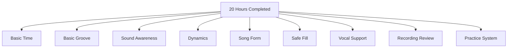
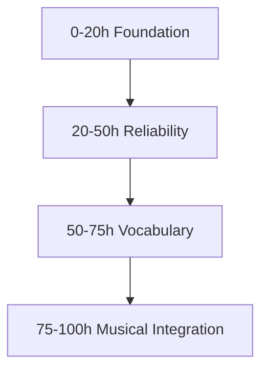
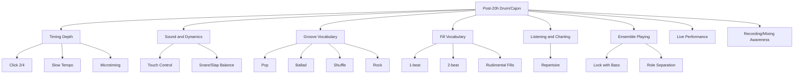
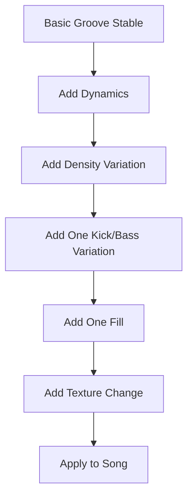
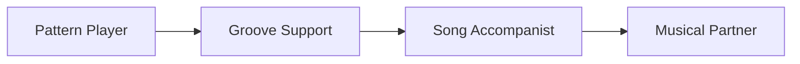

# learn-drum-cajon-part-029.md

# Part 029 — Roadmap Setelah 20 Jam: Dari Bisa Mengiringi ke Musikal

## Status Seri

- Seri: `learn-drum-cajon`
- Part: `029`
- Topik: Roadmap lanjutan setelah 20 jam pertama
- Target akhir seri: mampu mengiringi penyanyi dengan drum dan/atau cajon secara stabil, musikal, dan sadar konteks
- Status: **bagian terakhir seri**
- Part sebelumnya: `learn-drum-cajon-part-028.md`
- Part berikutnya: tidak ada — seri selesai

---

## Tujuan Part Ini

Part ini menutup seri `learn-drum-cajon`. Setelah 20 jam pertama, targetmu bukan lagi “dari nol ke bisa”. Target berikutnya adalah:

> dari bisa mengiringi lagu sederhana menjadi pemain yang lebih musikal, reliable, peka terhadap penyanyi, punya vocabulary lebih luas, dan bisa terus berkembang tanpa kehilangan fokus.

Setelah menyelesaikan part ini, kamu harus mampu:

1. mengevaluasi hasil 20 jam pertama,
2. memahami perbedaan beginner, functional accompanist, reliable accompanist, dan musical player,
3. menentukan prioritas latihan berikutnya,
4. memilih roadmap 10 jam, 30 jam, dan 100 jam berikutnya,
5. memperluas groove tanpa overplaying,
6. memperbaiki timing secara lebih dalam,
7. memperbaiki sound dan dynamics,
8. meningkatkan listening dan repertoire,
9. mulai bermain dengan orang lain secara aman,
10. membangun sistem belajar jangka panjang.

---

# 1. Apa yang Seharusnya Kamu Dapat Setelah 20 Jam?

Jika kamu mengikuti seri ini dengan cukup serius, setelah 20 jam kamu seharusnya tidak menjadi drummer/cajon player profesional. Itu bukan target realistis.

Tetapi kamu seharusnya sudah memiliki:

- pemahaman pulse,
- basic 4/4 groove,
- basic 6/8 atau ballad feel,
- dasar drum kit sound,
- dasar cajon sound,
- kemampuan verse/chorus dynamics,
- fill pendek yang aman,
- song form awareness,
- vocal-first mindset,
- recording habit,
- chart sederhana,
- error model,
- capstone 3 lagu,
- roadmap latihan berikutnya.



Jika semua ini belum kuat, tidak apa-apa. Roadmap lanjutan akan membantu memprioritaskan.

---

# 2. Empat Level Perkembangan

Untuk melihat posisi sekarang, gunakan empat level.

## 2.1 Level 1 — Beginner

Ciri:

- masih sering kehilangan tempo,
- pattern collapse,
- fill rush,
- belum tahu form,
- volume sering terlalu keras,
- belum peka vokal,
- belum bisa recover.

Fokus:

- pulse,
- basic groove,
- sound separation,
- no-fill discipline,
- metronome,
- recording.

## 2.2 Level 2 — Functional Accompanist

Ciri:

- bisa mengiringi lagu sederhana,
- groove cukup stabil,
- verse/chorus beda,
- fill pendek aman,
- tahu chart,
- vokal cukup jelas,
- masih terbatas vocabulary.

Fokus:

- repertoire,
- dynamics,
- form,
- listening,
- ensemble practice.

## 2.3 Level 3 — Reliable Accompanist

Ciri:

- bisa diandalkan saat rehearsal,
- cepat membaca kebutuhan lagu,
- bisa menyesuaikan volume,
- bisa recover,
- bisa main dengan penyanyi/gitar/piano/bass,
- fill tidak mengganggu,
- punya beberapa genre pack.

Fokus:

- locking,
- song interpretation,
- deeper timing,
- advanced dynamics,
- live consistency.

## 2.4 Level 4 — Musical Player

Ciri:

- keputusan musikal terasa matang,
- tahu kapan diam,
- groove terasa hidup,
- dynamics punya arc,
- bisa membuat penyanyi nyaman,
- bisa beradaptasi dengan versi lagu,
- vocabulary luas tetapi tidak berlebihan.

Fokus:

- taste,
- nuance,
- microtiming,
- repertoire luas,
- ensemble communication,
- stylistic depth.


Target setelah seri ini:

> minimal masuk Level 2 untuk lagu sederhana, lalu perlahan menuju Level 3.

---

# 3. Evaluasi Diri Setelah 20 Jam

Isi assessment ini.

```md
# 20-Hour Post-Assessment

Total practice hours:
Main instrument: drum / cajon / balanced
Capstone songs:
1.
2.
3.

## Scores 1-5
Pulse:
Metronome:
Basic 4/4:
6/8 / Ballad:
Cajon sound:
Drum sound:
Dynamics:
Fill:
Song form:
Listening:
Vocal support:
Recording habit:
Live readiness:
Ensemble awareness:

## Evidence
Best recording:
Worst recurring error:
Most reliable groove:
Safest fill:
Most difficult song:
Most improved skill:

## Current Level
- Beginner / Functional Accompanist / Reliable Accompanist / Musical Player

## Next Priority
- 
```

Jangan menilai berdasarkan perasaan saja. Pakai evidence dari rekaman.

---

# 4. Jika Hasil 20 Jam Masih Belum Stabil

Ini normal. 20 jam pertama sering membuka mata bahwa rhythm itu dalam.

Jika hasilmu belum stabil, jangan lompat ke materi advanced. Gunakan diagnosis.

## 4.1 Jika Timing Lemah

Prioritas:

- metronome,
- slow tempo,
- click 2 dan 4,
- fill return,
- no-fill groove.

## 4.2 Jika Sound Lemah

Prioritas:

- cajon bass/slap separation,
- drum hi-hat/snare/kick balance,
- recording from listener position,
- dynamic levels.

## 4.3 Jika Form Lemah

Prioritas:

- charting,
- bar counting,
- lyric anchor,
- section-only practice.

## 4.4 Jika Vokal Tertutup

Prioritas:

- sparse playing,
- volume control,
- no-fill zones,
- vocal-first recording.

## 4.5 Jika Fill Selalu Rusak

Prioritas:

- silence fill,
- 1-beat fill,
- return-to-groove,
- no fill until stable.

Rule:

> Jangan memperluas vocabulary sebelum core error paling merusak diperbaiki.

---

# 5. Roadmap 10 Jam Berikutnya

Roadmap 10 jam adalah sprint kecil. Pilih satu tema utama, bukan semuanya.

## 5.1 Opsi A — Timing Sprint

Untuk kamu yang masih rush/drag.

| Jam | Fokus |
|---:|---|
| 1 | metronome every beat |
| 2 | click 2 dan 4 |
| 3 | slow tempo 60 BPM |
| 4 | basic groove 3 menit |
| 5 | silence entry |
| 6 | fill return |
| 7 | verse/chorus without rushing |
| 8 | 6/8 slow time |
| 9 | song recording |
| 10 | mock performance |

Output:

- 2 rekaman before/after,
- satu groove stabil 3–5 menit,
- fill 1 beat tidak rush.

## 5.2 Opsi B — Cajon Sprint

Untuk kamu yang ingin acoustic accompaniment.

| Jam | Fokus |
|---:|---|
| 1 | bass tone |
| 2 | slap tone |
| 3 | touch control |
| 4 | bass/slap skeleton |
| 5 | basic pop cajon |
| 6 | sparse verse |
| 7 | chorus lift |
| 8 | 6/8 cajon |
| 9 | cajon fill |
| 10 | song recording |

Output:

- bass/slap jelas,
- touch tidak terlalu keras,
- 2 lagu cajon usable.

## 5.3 Opsi C — Drum Kit Sprint

Untuk kamu yang ingin full band accompaniment.

| Jam | Fokus |
|---:|---|
| 1 | kick control |
| 2 | snare backbeat |
| 3 | hi-hat soft control |
| 4 | basic groove |
| 5 | kick variations |
| 6 | sparse verse |
| 7 | chorus groove |
| 8 | fill return |
| 9 | dynamics |
| 10 | song recording |

Output:

- basic drum groove stabil,
- hi-hat tidak mendominasi,
- fill pendek aman.

## 5.4 Opsi D — Vocal Accompaniment Sprint

Untuk kamu yang ingin mengiringi penyanyi nyata.

| Jam | Fokus |
|---:|---|
| 1 | vocal-first listening |
| 2 | lyric/no-fill marking |
| 3 | sparse groove |
| 4 | breath cue awareness |
| 5 | verse soft |
| 6 | chorus lift |
| 7 | rubato entry |
| 8 | ending/follow singer |
| 9 | rehearsal simulation |
| 10 | mock performance |

Output:

- satu lagu vocal-safe,
- chart dengan no-fill zones,
- recording dari posisi pendengar.

---

# 6. Roadmap 30 Jam Berikutnya

Setelah 20 jam pertama, 30 jam berikutnya bisa membuatmu jauh lebih reliable.

Total: 50 jam.

## 6.1 Fase 21–30 Jam — Stabilization

Fokus:

- timing,
- sound,
- dynamics,
- 3 lagu capstone diperbaiki.

Output:

- 3 lagu capstone lebih stabil,
- error utama turun,
- groove 4/4 dan 6/8 lebih natural.

## 6.2 Fase 31–40 Jam — Repertoire Expansion

Fokus:

- 10 lagu repertoire,
- genre pack,
- charting,
- listening.

Output:

- 10 chart sederhana,
- minimal 5 rekaman lagu/section,
- genre pack dasar bisa dipilih.

## 6.3 Fase 41–50 Jam — Ensemble Readiness

Fokus:

- bermain dengan penyanyi/gitar/piano/bass,
- rehearsal communication,
- live readiness,
- mock set.

Output:

- siap rehearsal dengan orang lain,
- bisa menyesuaikan volume,
- bisa recover,
- bisa membaca cue.

```mermaid
gantt
    title Roadmap 30 Jam Setelah 20 Jam Pertama
    dateFormat  X
    axisFormat %s

    section 21-30
    Stabilization: 0, 10

    section 31-40
    Repertoire Expansion: 10, 20

    section 41-50
    Ensemble Readiness: 20, 30
```



---

# 7. Roadmap 100 Jam

100 jam bukan lagi sekadar “bisa mengiringi”. Di sini kamu mulai membangun musikalitas lebih serius.

## 7.1 Jam 0–20

Foundation:

- pulse,
- groove dasar,
- cajon/drum sound,
- basic accompaniment.

## 7.2 Jam 20–50

Reliability:

- timing lebih stabil,
- repertoire 10 lagu,
- charting,
- recording,
- live readiness.

## 7.3 Jam 50–75

Vocabulary:

- more grooves,
- ghost notes,
- syncopation,
- style depth,
- shuffle,
- funk-lite,
- worship builds,
- pop rock,
- ballad nuance.

## 7.4 Jam 75–100

Musical Integration:

- ensemble rehearsal,
- live sets,
- interpreting songs,
- dynamics nuance,
- arrangement choices,
- recording polish,
- feedback from singers/musicians.



Target 100 jam:

> mampu mengiringi beberapa konteks umum dengan confidence, taste, dan kemampuan recover yang baik.

---

# 8. Skill Tree Lanjutan

Setelah 20 jam, skill tree terbuka.



Jangan membuka semua cabang sekaligus. Pilih berdasarkan kebutuhan performa.

---

# 9. Prioritas Lanjutan Berdasarkan Goal

## 9.1 Jika Goal Kamu Mengiringi Penyanyi Acoustic

Prioritas:

1. cajon dynamics,
2. vocal space,
3. sparse playing,
4. 4/4 acoustic,
5. 6/8 ballad,
6. charting,
7. fill restraint,
8. live volume control.

Tunda:

- drum solo,
- rock fills,
- fast rudiments.

## 9.2 Jika Goal Kamu Full Band

Prioritas:

1. drum kit time,
2. kick-snare-hat coordination,
3. lock with bass,
4. pop/rock grooves,
5. dynamics,
6. fills,
7. live monitoring,
8. repertoire.

Tunda:

- cajon nuance jika tidak dipakai,
- advanced hand percussion.

## 9.3 Jika Goal Kamu Worship/Church Band

Prioritas:

1. dynamic build,
2. leader cue,
3. repeated chorus/tag,
4. four-on-floor,
5. 6/8,
6. bridge build,
7. no overplay,
8. click/backing track readiness.

Tunda:

- flashy fills,
- full-power playing too early.

## 9.4 Jika Goal Kamu Cafe/Small Gig

Prioritas:

1. cajon/light drum,
2. volume control,
3. acoustic repertoire,
4. vocal-first,
5. no-fill discipline,
6. charting,
7. setlist endurance.

Tunda:

- loud drum kit approach,
- complex fills.

---

# 10. Memperluas Groove Tanpa Overplaying

Setelah bisa basic groove, kamu mungkin ingin menambah variasi. Hati-hati: vocabulary baru sering membuat pemain overplay.

## 10.1 Urutan Aman Menambah Vocabulary



Jangan langsung:

- ghost notes banyak,
- fill tiap bar,
- syncopation rumit,
- hi-hat pattern kompleks.

## 10.2 Add One Variable

Contoh:

Basic:

```text
B t S t B t S t
```

Tambah kick/bass variation:

```text
B t S t B B S t
```

Atau tambah dynamics:

```text
same pattern, verse level 2, chorus level 4
```

Atau tambah texture:

```text
verse sparse touch, chorus full touch
```

Satu perubahan cukup.

---

# 11. Timing Depth Lanjutan

Timing tidak selesai di 20 jam.

## 11.1 Click 2 dan 4

Metronome hanya di backbeat:

```text
1 2 3 4
  click   click
```

Ini membangun internal pulse.

## 11.2 Click Beat 1 Only

Metronome hanya beat 1 tiap bar.

Jika kamu drift, akan terdengar.

## 11.3 Gap Click

Metronome berbunyi beberapa bar lalu diam beberapa bar.

Tujuan:

- internal clock,
- recovery.

## 11.4 Slow Tempo Mastery

Tempo lambat sulit karena ruang antar beat besar.

Latihan:

- 50–60 BPM,
- count subdivision,
- main minimal.

## 11.5 Time Feel with Vocal

Main dengan penyanyi/backing vocal. Jaga pulse tanpa memaksa phrasing vokal terlalu kaku.

---

# 12. Dynamics Depth Lanjutan

Dynamics lanjutan bukan hanya level 1–5.

## 12.1 Micro-Dynamics

Contoh:

- snare 2 sedikit lebih kuat dari 4,
- hi-hat accent di quarter,
- cajon touch sangat kecil,
- chorus naik bukan hanya volume tetapi density.

## 12.2 Section-Level Dynamics

Lagu punya arc:

```text
V1 < PC < C1
V2 slightly bigger than V1
Bridge drop/build
Final biggest
```

## 12.3 Phrase-Level Dynamics

Dalam 8 bar chorus, energi bisa naik di bar 7–8 menuju next section.

## 12.4 Word-Level Sensitivity

Turun sedikit pada lyric penting. Respons setelah phrase, bukan saat phrase.

---

# 13. Sound Depth Lanjutan

## 13.1 Drum Sound

Pelajari:

- snare center vs rim,
- ghost note,
- hi-hat closed/open,
- ride vs hat,
- kick control,
- cymbal restraint,
- brush/rod options.

## 13.2 Cajon Sound

Pelajari:

- bass sweet spot,
- slap variations,
- muted slap,
- finger touch,
- ghost note,
- roll,
- brush on cajon jika ada,
- shaker integration.

## 13.3 Recording-Based Sound

Rekam:

- dekat,
- jauh,
- dengan vokal,
- dengan gitar/piano.

Sound yang terasa bagus di posisi pemain belum tentu bagus di posisi pendengar.

---

# 14. Fill Depth Lanjutan

Fill lanjutan bukan berarti fill lebih panjang. Fill lanjutan berarti fill lebih tepat.

## 14.1 Kategori Fill Lanjutan

| Fill Type | Fungsi |
|---|---|
| setup fill | menuju section |
| response fill | setelah frase vokal |
| build fill | menaikkan energi |
| reset fill | menurunkan energi |
| stop fill | menciptakan silence |
| texture fill | memberi warna |
| ending fill | closure |

## 14.2 Rudimental Expansion

Setelah basic:

- single stroke variations,
- double stroke control,
- paradiddle accents,
- flam accents,
- drag/tap texture.

Tetap gunakan rule:

> Rudiment yang tidak bisa kembali ke groove belum siap.

## 14.3 Fill Restraint

Semakin musikal kamu, semakin banyak fill yang kamu pilih untuk tidak dimainkan.

---

# 15. Listening Depth Lanjutan

Listening berikutnya lebih dalam.

## 15.1 Transcribe Simplified Grooves

Untuk tiap lagu:

- tulis kick/snare/hat atau bass/slap/touch,
- tidak perlu detail penuh,
- fokus fungsi.

## 15.2 Compare Versions

Dengarkan:

- studio version,
- acoustic version,
- live version,
- cover version.

Catat:

- drum/cajon berubah bagaimana?
- dynamics berubah?
- ending berubah?
- fill berkurang/bertambah?
- vokal lebih jelas di versi mana?

## 15.3 Build Reference Map

```md
# Reference Map

4/4 pop:
Acoustic:
6/8:
12/8:
Worship build:
Rock light:
Sparse vocal:
Half-time:
```

---

# 16. Ensemble Roadmap

Setelah 20 jam, bermain dengan orang lain sangat penting.

## 16.1 Rehearsal dengan Penyanyi

Mulai dengan:

- 1 lagu,
- cajon atau soft drum,
- chart,
- no fill berlebihan,
- minta feedback volume.

Pertanyaan ke penyanyi:

```text
Apakah volume aman?
Apakah fill mengganggu?
Apakah tempo nyaman?
Bagian mana kamu ingin lebih kosong?
```

## 16.2 Rehearsal dengan Gitar/Piano

Fokus:

- lock with strumming/comping,
- role separation,
- tidak menabrak fill.

## 16.3 Rehearsal dengan Bass

Fokus:

- kick-bass lock,
- low-end clarity,
- groove foundation.

## 16.4 Small Set

Setelah 3–5 rehearsal, coba 3 lagu berurutan.

Tujuan:

- endurance,
- chart usage,
- cue,
- recovery.

---

# 17. Live Roadmap

## 17.1 First Live Goal

Bukan gig besar. Target:

- rehearsal open,
- small gathering,
- acoustic session,
- worship practice,
- recording for friend,
- jam dengan penyanyi.

## 17.2 Live Set Minimum

3 lagu:

1. 4/4 medium,
2. ballad,
3. dynamic build.

## 17.3 Live Rules

- bawa chart,
- confirm ending,
- main lebih sederhana,
- no fill if unsure,
- dengar vokal,
- record jika memungkinkan,
- review setelahnya.

---

# 18. Repertoire Roadmap

Setelah 20 jam, targetkan 10 lagu performance-ready.

## 18.1 10 Lagu Pertama

Gunakan slot:

1. 4/4 basic,
2. acoustic sparse,
3. chorus lift,
4. slow ballad,
5. 6/8,
6. 12/8,
7. four-on-floor,
8. half-time,
9. dense guitar/piano,
10. full dynamic capstone.

## 18.2 Untuk Tiap Lagu

Buat:

- chart,
- groove map,
- dynamic map,
- fill map,
- recording,
- error report,
- readiness label.

## 18.3 Maintenance

Lagu yang sudah bisa tetap perlu dipelihara:

- main ulang mingguan,
- rekam ulang bulanan,
- coba versi acoustic/full,
- coba drum/cajon version.

---

# 19. Practice System Jangka Panjang

## 19.1 Weekly Structure

Contoh:

| Hari | Fokus |
|---|---|
| Senin | time/metronome |
| Selasa | sound/technique |
| Rabu | groove vocabulary |
| Kamis | song/repertoire |
| Jumat | fill/dynamics |
| Sabtu | ensemble/mock performance |
| Minggu | review/listening |

## 19.2 Monthly Focus

Pilih satu tema per bulan:

- bulan 1: timing,
- bulan 2: cajon sound,
- bulan 3: drum kit groove,
- bulan 4: 6/8/ballad,
- bulan 5: repertoire,
- bulan 6: live readiness.

## 19.3 Quarterly Capstone

Setiap 3 bulan:

- rekam 3 lagu,
- bandingkan dengan capstone sebelumnya,
- update roadmap.

---

# 20. Advanced Topics yang Bisa Dipelajari Nanti

Setelah foundation kuat, kamu bisa masuk ke topik lanjutan.

## 20.1 Drum Kit

- ghost notes,
- advanced hi-hat patterns,
- syncopated kick,
- linear fills,
- shuffle,
- brush technique,
- ride patterns,
- tom orchestration,
- funk basics,
- rock fills,
- worship click/backing track.

## 20.2 Cajon

- advanced slap variations,
- flamenco-inspired patterns,
- brush cajon,
- foot tambourine,
- shaker independence,
- finger rolls,
- dynamic muting,
- cajon with pedal,
- hand percussion integration.

## 20.3 Musicianship

- reading charts,
- ear training rhythm,
- arranging for acoustic set,
- leading count-in,
- rehearsal communication,
- stage monitoring,
- recording/mic basics.

## 20.4 Production Awareness

- how drum/cajon sits in mix,
- frequency masking vocal,
- mic placement basics,
- room sound,
- click track,
- recording to improve timing.

---

# 21. Apa yang Sebaiknya Tidak Dikejar Terlalu Cepat?

Tunda jika core accompaniment belum stabil:

- fast chops,
- complicated solos,
- odd meters,
- advanced polyrhythm,
- complex Latin grooves,
- double pedal,
- semua rudiments sekaligus,
- overproduced fills,
- genre deep dive tanpa repertoire,
- gear obsession.

Rule:

> Skill advanced yang dibangun di atas time lemah akan terdengar seperti noise.

---

# 22. Gear Roadmap

Jangan jadikan gear sebagai pengganti latihan. Tetapi gear yang tepat bisa membantu.

## 22.1 Cajon Gear

Prioritas:

1. cajon yang nyaman,
2. permukaan responsif,
3. bass/slap jelas,
4. shaker kecil,
5. mat agar tidak geser,
6. mic jika performance.

## 22.2 Drum Gear

Prioritas:

1. stick nyaman,
2. practice pad,
3. metronome/headphones,
4. ear protection,
5. low-volume tools jika perlu,
6. drum throne nyaman.

## 22.3 Recording Gear

Mulai:

- HP.

Lanjut jika perlu:

- simple USB mic,
- audio interface,
- overhead mic,
- cajon mic,
- DAW basic.

Rule:

> Upgrade gear hanya jika gear lama benar-benar membatasi feedback atau performance, bukan karena ingin merasa lebih siap.

---

# 23. Mental Model: From Pattern Player to Song Servant

Pemula bertanya:

```text
Pattern apa yang harus saya mainkan?
```

Pemain yang lebih musikal bertanya:

```text
Apa yang lagu ini butuhkan?
Apa yang vokal butuhkan?
Apa yang section ini butuhkan?
Apa yang harus saya kurangi?
Apa yang harus saya jaga?
```

Perubahan besar setelah 20 jam adalah perubahan identitas:

```text
Saya bukan hanya pemain pattern.
Saya adalah penjaga time, energi, ruang, dan transisi lagu.
```



---

# 24. Taste: Skill yang Tidak Terlihat

Taste adalah kemampuan memilih.

Taste terlihat saat kamu:

- tidak fill walau bisa,
- main lebih pelan,
- menahan chorus pertama,
- memberi ruang lyric,
- memilih cajon daripada drum,
- memilih no percussion di intro,
- memakai silence fill,
- membuat final chorus terasa besar karena sebelumnya ditahan.

Taste berkembang dari:

- listening,
- recording,
- feedback,
- playing with others,
- restraint,
- repertoire.

Taste tidak berkembang dari teknik saja.

---

# 25. Cara Mendapat Feedback dari Penyanyi

Penyanyi adalah stakeholder utama.

Tanya:

```text
Apakah kamu merasa nyaman bernyanyi di atas groove ini?
Apakah aku terlalu keras?
Apakah fill-ku mengganggu phrasing?
Apakah tempo terasa nyaman?
Apakah chorus butuh lebih naik?
Apakah verse butuh lebih kosong?
Ending tadi enak atau membingungkan?
```

Jangan defensif. Dengarkan sebagai data.

Jika penyanyi bilang:

```text
Terlalu rame.
```

Terjemahkan ke kemungkinan:

- volume terlalu keras,
- density terlalu tinggi,
- fill terlalu banyak,
- high-frequency slap/hat menutup,
- terlalu sedikit ruang.

---

# 26. Cara Bermain dengan Musisi yang Lebih Mahir

Jika bermain dengan musisi lebih mahir:

- main sederhana,
- dengarkan,
- jangan pamer,
- tanyakan feedback spesifik,
- ikuti form,
- jangan overfill,
- lock dengan bass/gitar/piano,
- catat setelah rehearsal.

Kalimat berguna:

```text
Aku masih membangun accompaniment. Kalau aku terlalu ramai atau terlalu keras, kasih tahu.
```

Musisi yang baik biasanya menghargai pemain yang bisa mendengar dan menyesuaikan.

---

# 27. Cara Bermain dengan Musisi Pemula

Jika bermain dengan musisi pemula:

- jangan memaksa terlalu kompleks,
- bantu menjaga time,
- beri count-in jelas,
- buat chart sederhana,
- sepakati ending,
- jangan menyalahkan,
- gunakan groove paling aman.

Pemain rhythm sering menjadi stabilizer ensemble. Tetapi stabilizer bukan diktator.

---

# 28. Common Post-20-Hour Mistakes

## 28.1 Langsung Mengejar Advanced Fill

Correction:

- perkuat time, dynamics, repertoire.

## 28.2 Berhenti Merekam

Correction:

- recording mingguan wajib.

## 28.3 Main Terlalu Banyak Karena Sudah Bisa

Correction:

- vocal-first mindset.

## 28.4 Tidak Bermain dengan Orang Lain

Correction:

- cari rehearsal kecil.

## 28.5 Tidak Memperluas Repertoire

Correction:

- 10-song roadmap.

## 28.6 Gear Obsession

Correction:

- upgrade hanya jika ada bottleneck nyata.

## 28.7 Tidak Punya Next Focus

Correction:

- pilih sprint 10 jam.

---

# 29. Post-20 Debugging Guide

| Gejala | Makna | Next Focus |
|---|---|---|
| bisa pattern tapi lagu kacau | form/listening lemah | chart/repertoire |
| groove stabil sendiri tapi gagal ensemble | locking lemah | play with guitar/bass |
| vokal sering tertutup | dynamics/sound lemah | vocal-first sprint |
| fill masih rush | fill/time lemah | fill return sprint |
| cajon monoton | dynamics/texture lemah | cajon sprint |
| drum terlalu keras | sound control lemah | low-volume drum |
| 6/8 selalu kaku | compound feel lemah | 6/8 sprint |
| nervous live | mock performance kurang | live readiness |

---

# 30. 10-Hour Sprint Template

Gunakan template ini untuk setiap sprint lanjutan.

```md
# 10-Hour Sprint

Theme:
Why:
Current evidence:
Target outcome:

## Hour Plan
1.
2.
3.
4.
5.
6.
7.
8.
9.
10.

## Metrics
Before recording:
After recording:
Score target:

## Main constraints
- 

## What I will not practice
- 

## Final test
- 
```

Contoh:

```md
Theme: Vocal-safe cajon
Target:
- mengiringi 2 lagu acoustic tanpa menutup vokal

What I will not practice:
- fast fills
- advanced rolls
```

---

# 31. 30-Day Plan Setelah Seri

## Week 1 — Stabilize

- review capstone,
- fix primary error,
- timing/sound.

## Week 2 — Expand

- tambah 2 lagu repertoire,
- chart,
- record.

## Week 3 — Ensemble

- latihan dengan penyanyi/gitar/piano,
- feedback,
- volume control.

## Week 4 — Mock Set

- 3–5 lagu,
- chart,
- recording,
- performance readiness.

```md
# 30-Day Plan

Week 1 focus:
Week 2 focus:
Week 3 focus:
Week 4 focus:

End-of-month capstone:
Songs:
Recording:
Review:
Next month:
```

---

# 32. Personal Practice Operating System

Buat sistem permanen:

## 32.1 Folder

```text
drum-cajon/
  charts/
  recordings/
  practice-logs/
  repertoire/
  capstones/
```

## 32.2 Naming

```text
learn-drum-cajon-chart-song-title-v1.md
2026-06-25_cajon_song_take01.mp3
practice-log-2026-06-25.md
```

## 32.3 Weekly Routine

- 3 latihan teknik/groove,
- 1 listening/chart,
- 1 song recording,
- 1 review,
- 1 rest/light practice.

## 32.4 Review Ritual

Setiap minggu:

```md
Best take:
Worst error:
Next drill:
Song progress:
```

---

# 33. Final Series Checklist

Gunakan checklist penutup seri.

```md
# learn-drum-cajon Final Checklist

## Foundation
- [ ] Saya bisa menghitung 4/4.
- [ ] Saya bisa menghitung 6/8 dasar.
- [ ] Saya bisa menjaga pulse sederhana.
- [ ] Saya bisa main basic groove 4/4.
- [ ] Saya bisa main satu ballad/6/8 groove.

## Sound
- [ ] Drum: kick/snare/hat cukup terkontrol.
- [ ] Cajon: bass/slap/touch berbeda.
- [ ] Saya bisa main pelan.
- [ ] Saya tahu elemen mana yang menutup vokal.

## Musicality
- [ ] Saya bisa membuat verse lebih kecil dari chorus.
- [ ] Saya bisa memakai silence.
- [ ] Saya bisa membuat fill pendek.
- [ ] Saya tahu kapan tidak fill.

## Song
- [ ] Saya bisa membuat chart sederhana.
- [ ] Saya tahu entry.
- [ ] Saya tahu ending.
- [ ] Saya bisa membaca form.

## Feedback
- [ ] Saya merekam diri.
- [ ] Saya bisa review timing/sound/dynamics/vocal.
- [ ] Saya punya error tracker.
- [ ] Saya tahu next correction drill.

## Performance
- [ ] Saya bisa mock performance tanpa berhenti.
- [ ] Saya punya backup plan.
- [ ] Saya bisa recover dengan skeleton.
- [ ] Saya bisa menjaga vokal sebagai pusat.
```

---

# 34. Final Reflection Template

```md
# Final Reflection — learn-drum-cajon

## Before this series, I thought:
- 

## Now I understand:
- 

## My strongest skill:
- 

## My weakest skill:
- 

## My most reliable groove:
- 

## My safest fill:
- 

## My biggest recurring error:
- 

## What singers need from me:
- 

## What I should stop doing:
- 

## What I should practice next:
- 

## My next 10-hour sprint:
- 
```

---

# 35. Rekomendasi Jalur Lanjutan

Setelah seri ini, ada beberapa seri lanjutan yang masuk akal.

## 35.1 Drum Kit Fundamentals for Accompaniment

Fokus:

- kick/snare/hat independence,
- ghost note,
- hi-hat nuance,
- ride,
- fill vocabulary,
- pop/rock/worship grooves,
- click/backing track.

## 35.2 Cajon for Acoustic Accompaniment

Fokus:

- bass/slap/touch depth,
- acoustic genres,
- brush cajon,
- shaker/tambourine,
- vocal accompaniment,
- cafe/worship acoustic set.

## 35.3 Rhythm and Groove Deep Dive

Fokus:

- subdivision,
- swing,
- shuffle,
- syncopation,
- microtiming,
- time feel,
- groove analysis.

## 35.4 Live Band Accompaniment

Fokus:

- rehearsal,
- setlist,
- cue,
- soundcheck,
- monitoring,
- playing with bass/guitar/piano,
- live recovery.

## 35.5 Music Production for Drums/Cajon

Fokus:

- recording,
- mic placement,
- arrangement,
- drum/cajon in mix,
- frequency masking,
- editing timing without killing feel.

---

# 36. Penutup: Apa Inti Seluruh Seri Ini?

Seri ini bukan tentang menjadi pemain drum/cajon yang terlihat keren dalam 20 jam.

Seri ini tentang membangun kemampuan minimum yang benar-benar berguna:

- mendengar pulse,
- menjaga groove,
- mengontrol sound,
- memberi ruang vokal,
- membaca form,
- memakai dynamics,
- memakai fill secukupnya,
- memilih drum/cajon sesuai konteks,
- merekam dan memperbaiki diri,
- tampil dengan aman.

Jika diringkas menjadi satu kalimat:

> Tugas drummer/cajon player pengiring adalah membuat penyanyi dan lagu terasa lebih kuat, bukan membuat dirinya terlihat paling sibuk.

---

# 37. Final Acceptance Criteria Seri

Seri `learn-drum-cajon` dianggap selesai jika kamu bisa:

1. memainkan basic 4/4 groove dengan drum atau cajon,
2. memainkan satu groove 6/8 atau ballad,
3. membuat verse lebih kecil dari chorus,
4. memainkan fill 1 beat dan kembali ke beat 1,
5. membuat chart sederhana,
6. mengiringi minimal satu lagu penuh tanpa berhenti,
7. merekam diri dan menulis primary error,
8. menjaga vokal tetap jelas,
9. menjelaskan kapan memakai drum kit vs cajon,
10. membuat next 10-hour sprint.

Jika kamu bisa 7 dari 10, kamu sudah punya fondasi yang layak untuk terus berkembang.

---

# 38. Seri Selesai

Ini adalah bagian terakhir seri:

```text
learn-drum-cajon-part-029.md
```

Seri `learn-drum-cajon` selesai secara materi utama.

Langkah paling logis setelah ini:

1. kumpulkan semua part menjadi bundle,
2. pilih 3 lagu capstone,
3. jalankan 20-hour practice plan,
4. rekam final capstone,
5. pilih sprint 10 jam berikutnya berdasarkan error utama.

Selamat. Kamu sekarang punya bukan hanya kumpulan pattern, tetapi sistem belajar, sistem diagnosis, dan roadmap untuk menjadi pengiring drum/cajon yang lebih musikal.
