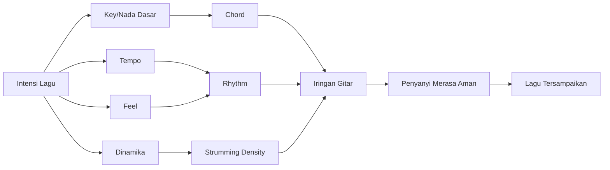
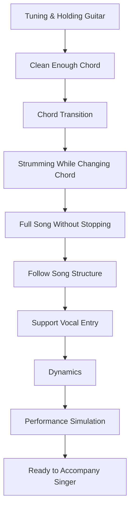
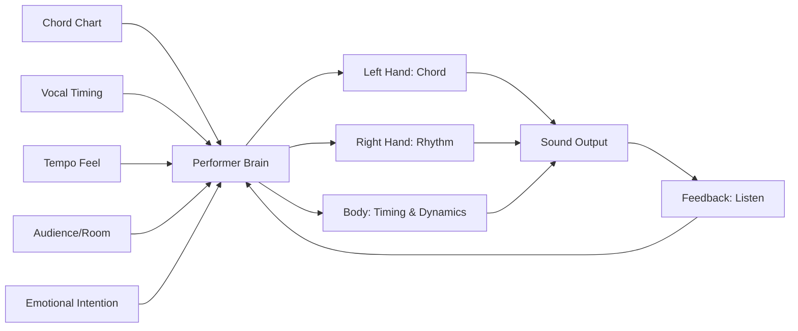
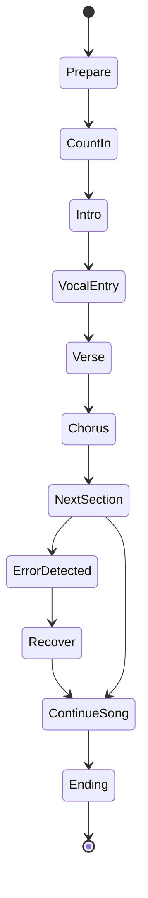

# learn-guitar-accompaniment-part-001.md

# Part 001 — Deconstructing Skill: Apa Sebenarnya Skill Mengiringi Penyanyi?

## Status Seri

- **Seri:** `learn-guitar-accompaniment`
- **Part:** `001`
- **Topik:** Deconstructing skill: memecah skill gitar pengiring menjadi sub-skill yang bisa dilatih
- **Basis pendekatan:** *The First 20 Hours* — Josh Kaufman
- **Tujuan praktis:** membangun mental model yang benar sebelum masuk ke chord, strumming, dan lagu
- **Bagian sebelumnya:** `learn-guitar-accompaniment-part-000.md`
- **Bagian berikutnya:** `learn-guitar-accompaniment-part-002.md`
- **Status:** seri belum selesai

---

## Daftar Isi

1. Kenapa Part Ini Penting
2. Skill yang Sebenarnya Ingin Dipelajari
3. Prinsip Kaufman: Deconstruct the Skill
4. Kesalahan Framing: “Belajar Gitar” Terlalu Luas
5. Gitar Pengiring sebagai Sistem
6. Perbedaan Gitar Solo, Rhythm Guitar, dan Gitar Pengiring Vokal
7. Sub-skill Utama Gitar Pengiring
8. Dependency Graph: Skill Mana Harus Didahulukan
9. Minimum Viable Accompanist
10. Model 80/20 untuk 20 Jam Pertama
11. Mengapa Hafal Banyak Chord Tidak Cukup
12. Gitar Pengiring sebagai Real-Time System
13. Constraint Utama Saat Mengiringi Penyanyi
14. Failure Mode Umum Pemula
15. Cara Berpikir untuk Software Engineer
16. Latihan Praktis Part 001
17. Output yang Harus Anda Punya Setelah Part Ini
18. Checklist Pemahaman
19. Ringkasan

---

# 1. Kenapa Part Ini Penting

Sebelum menyentuh chord, strumming pattern, atau lagu tertentu, kita perlu menjawab pertanyaan paling mendasar:

> Skill apa yang sebenarnya sedang dipelajari?

Banyak pemula menjawab:

> “Saya mau belajar gitar.”

Jawaban itu terlalu luas.

“Belajar gitar” bisa berarti:

- bermain melodi;
- membaca notasi balok;
- bermain fingerstyle;
- mengiringi lagu gereja;
- memainkan lagu pop akustik;
- bermain jazz chord melody;
- bermain rock rhythm;
- membuat solo blues;
- bermain flamenco;
- recording gitar di studio;
- menjadi session player;
- mengiringi penyanyi.

Semua itu memakai alat yang sama, tetapi skill-nya berbeda.

Untuk target Anda, skill yang kita incar adalah:

> **mengiringi penyanyi dengan gitar secara stabil, musikal, dan cukup adaptif untuk tampil.**

Ini bukan target “menjadi gitaris hebat”. Ini target “menjadi pengiring yang fungsional”.

Dalam kerangka Josh Kaufman, ini penting karena rapid skill acquisition dimulai dari **deconstruction**: memecah skill besar menjadi sub-skill kecil, lalu memilih sub-skill yang paling berdampak untuk performa awal.

Kalau skill tidak didekonstruksi, latihan akan kacau. Anda bisa menghabiskan 20 jam menonton video chord, belajar intro lagu yang terlalu sulit, atau menghafal teori musik yang belum dibutuhkan, tetapi tetap belum bisa mengiringi penyanyi dari awal sampai akhir lagu.

Masalahnya bukan kurang effort. Masalahnya effort diarahkan ke komponen yang salah.

---

# 2. Skill yang Sebenarnya Ingin Dipelajari

Target kita bukan:

```text
Belajar gitar secara umum
```

Target kita adalah:

```text
Mampu mengiringi penyanyi dengan gitar untuk beberapa lagu sederhana dalam konteks latihan/performa nyata.
```

Kalimat ini punya beberapa implikasi penting.

## 2.1 “Mengiringi” berarti mendukung, bukan mendominasi

Gitar bukan pusat perhatian utama. Penyanyi adalah pusat narasi.

Tugas gitar:

- memberi fondasi harmoni;
- menjaga pulse/tempo;
- memberi rasa ritmis;
- membantu penyanyi tahu kapan masuk;
- membangun dinamika lagu;
- tidak mengganggu lirik;
- menutup error kecil agar lagu tetap berjalan.

Gitar pengiring yang baik sering kali tidak terasa “sibuk”, tetapi membuat lagu terasa aman.

## 2.2 “Penyanyi” berarti ada manusia lain dengan napas, range, dan timing

Mengiringi penyanyi berbeda dari bermain mengikuti backing track.

Backing track stabil. Penyanyi manusia tidak selalu stabil.

Penyanyi bisa:

- masuk sedikit lebih lambat;
- menarik tempo saat emosi naik;
- butuh nada dasar lebih rendah;
- lupa bagian lagu;
- meminta intro lebih panjang;
- meminta chorus diulang;
- berhenti sejenak untuk mengambil napas;
- mengubah phrasing.

Maka gitar pengiring tidak cukup hanya “benar secara chord”. Ia harus responsif.

## 2.3 “Tampil” berarti harus recoverable, bukan perfect

Di kamar, Anda bisa berhenti ketika salah.

Saat tampil, berhenti adalah error yang lebih besar daripada chord salah sesaat.

Maka target performa bukan:

> “Saya tidak boleh salah.”

Target yang lebih benar:

> “Jika salah, lagu tetap berjalan dan penyanyi tetap merasa aman.”

Ini mengubah prioritas latihan.

Anda tidak hanya melatih chord. Anda melatih **continuity**.

---

# 3. Prinsip Kaufman: Deconstruct the Skill

Dalam *The First 20 Hours*, Kaufman menekankan bahwa skill besar harus dipecah menjadi bagian-bagian kecil agar kita bisa menemukan bagian mana yang paling penting untuk dilatih dulu.

Untuk gitar pengiring, skill besar ini bisa dipecah seperti berikut:

```mermaid
flowchart TD
    A[Mengiringi Penyanyi dengan Gitar] --> B[Instrument Handling]
    A --> C[Chord & Harmony]
    A --> D[Rhythm & Timing]
    A --> E[Song Structure]
    A --> F[Vocal Awareness]
    A --> G[Dynamics & Arrangement]
    A --> H[Performance Recovery]

    B --> B1[Tuning]
    B --> B2[Posture]
    B --> B3[Pick/Finger Control]

    C --> C1[Open Chords]
    C --> C2[Chord Transition]
    C --> C3[Capo/Transpose]

    D --> D1[Beat]
    D --> D2[Strumming]
    D --> D3[Tempo Stability]

    E --> E1[Intro]
    E --> E2[Verse/Chorus]
    E --> E3[Ending]

    F --> F1[Napas Vokal]
    F --> F2[Cue Masuk]
    F --> F3[Range Penyanyi]

    G --> G1[Verse Soft]
    G --> G2[Chorus Open]
    G --> G3[Build/Drop]

    H --> H1[Chord Salah]
    H --> H2[Tempo Lari]
    H --> H3[Lupa Struktur]
```



Dari diagram ini terlihat bahwa “bisa gitar” bukan satu skill. Ia adalah gabungan beberapa skill kecil.

Untuk 20 jam pertama, kita tidak akan memperlakukan semua sub-skill sebagai sama penting.

Sub-skill yang langsung memengaruhi kemampuan tampil akan didahulukan.

---

# 4. Kesalahan Framing: “Belajar Gitar” Terlalu Luas

Salah satu kegagalan terbesar pemula adalah memakai framing yang terlalu luas.

## 4.1 Framing yang buruk

```text
Saya mau belajar gitar.
```

Masalah:

- tidak jelas targetnya;
- tidak jelas kapan dianggap cukup;
- terlalu banyak sumber belajar;
- mudah terjebak tutorial hell;
- mudah membandingkan diri dengan gitaris profesional;
- tidak ada acceptance criteria.

## 4.2 Framing yang lebih baik

```text
Dalam 20 jam latihan aktif, saya ingin bisa mengiringi penyanyi untuk 3 lagu sederhana dengan chord dasar, tempo stabil, intro/outro jelas, dan recovery saat salah.
```

Framing ini lebih baik karena punya:

- batas waktu;
- konteks performa;
- jumlah lagu;
- batas kompleksitas;
- indikator kualitas;
- ruang untuk error;
- definisi selesai.

Sebagai software engineer, bayangkan perbedaannya seperti:

```text
Buruk:
Build a platform.

Lebih baik:
Build an MVP that allows one user type to complete one critical workflow end-to-end with observable success/failure states.
```

Kita tidak sedang membangun seluruh “platform gitar”. Kita sedang membangun **MVP pengiring vokal**.

---

# 5. Gitar Pengiring sebagai Sistem

Gitar pengiring bisa dipahami sebagai sistem yang mengubah niat musikal menjadi dukungan untuk vokal.



Output sistem bukan “suara gitar yang keren”.

Output sistem adalah:

> penyanyi bisa menyampaikan lagu dengan nyaman dan pendengar bisa mengikuti emosi lagu.

Ini penting. Kalau gitar terdengar rumit tetapi membuat penyanyi kesulitan masuk, sistem gagal.

Kalau gitar sederhana tetapi tempo stabil, chord cukup bersih, dan penyanyi nyaman, sistem berhasil.

---

# 6. Perbedaan Gitar Solo, Rhythm Guitar, dan Gitar Pengiring Vokal

## 6.1 Gitar solo

Fokus:

- melodi;
- improvisasi;
- phrasing lead;
- teknik tangan kiri/kanan;
- ekspresi individual;
- scale;
- bending;
- vibrato;
- speed;
- articulation.

Gitar solo sering menjadi pusat perhatian.

## 6.2 Rhythm guitar dalam band

Fokus:

- groove;
- sinkron dengan drum dan bass;
- chord voicing;
- peran dalam aransemen band;
- locking dengan rhythm section.

Rhythm guitar dalam band berbagi tanggung jawab dengan instrumen lain.

Bass menjaga low-end. Drum menjaga pulse. Keyboard/pad bisa mengisi harmoni.

## 6.3 Gitar pengiring vokal solo/akustik

Fokus:

- chord sebagai fondasi harmoni;
- strumming/picking sebagai groove;
- intro/outro sebagai cue;
- dinamika sebagai aransemen;
- respons terhadap napas penyanyi;
- menjaga lagu tetap utuh tanpa band.

Dalam format gitar + vokal, gitar sering harus menjalankan beberapa peran sekaligus:

```text
Gitar = harmony + rhythm + arrangement cue + emotional support
```

Karena itu, prioritasnya berbeda.

Anda tidak harus jago solo. Anda harus bisa membuat lagu berdiri.

---

# 7. Sub-skill Utama Gitar Pengiring

Berikut sub-skill inti yang akan kita latih sepanjang seri.

## 7.1 Instrument readiness

Ini adalah kemampuan membuat gitar siap digunakan.

Meliputi:

- tuning;
- posisi duduk/berdiri;
- memegang pick;
- menekan senar tanpa sakit berlebihan;
- menghindari buzz/muted string;
- memahami basic fret/string.

Tanpa ini, semua skill lain terganggu.

Gitar yang tidak tuning akan membuat chord benar terdengar salah.

## 7.2 Chord vocabulary

Ini adalah kumpulan chord yang cukup untuk memainkan banyak lagu sederhana.

Untuk 20 jam pertama, targetnya bukan ratusan chord.

Target awal:

- G;
- C;
- D;
- Em;
- Am;
- A;
- E;
- Dm;
- F versi sederhana;
- beberapa variasi mudah seperti Cadd9, Em7, Dsus4.

Chord vocabulary penting, tetapi bukan satu-satunya skill.

## 7.3 Chord transition

Ini sering lebih penting daripada jumlah chord.

Lebih baik tahu 6 chord dan bisa berpindah dengan cukup lancar daripada tahu 30 chord tetapi berhenti setiap pergantian.

Contoh transisi bernilai tinggi:

- G → D;
- G → C;
- C → Am;
- Em → C;
- C → G;
- D → Em;
- Am → F;
- C → F;
- G → Em.

Transisi adalah bottleneck awal hampir semua pemula.

## 7.4 Rhythm and timing

Rhythm adalah tulang punggung iringan.

Chord salah sesaat kadang bisa lewat. Tempo kacau langsung terasa.

Komponen rhythm:

- beat;
- bar;
- tempo;
- downstroke;
- upstroke;
- accent;
- ghost strum;
- mute;
- pattern;
- feel.

Untuk pengiring vokal, rhythm harus stabil tetapi tidak kaku.

## 7.5 Song structure

Anda harus tahu lagu sedang berada di bagian mana.

Struktur umum:

- intro;
- verse;
- pre-chorus;
- chorus;
- interlude;
- bridge;
- final chorus;
- outro.

Pemula sering berlatih chord progression, tetapi tidak melatih navigasi struktur.

Akibatnya, saat tampil mereka tersesat.

## 7.6 Vocal awareness

Ini skill yang membedakan “orang yang bisa genjreng” dengan “pengiring”.

Vocal awareness berarti:

- tahu kapan penyanyi masuk;
- mendengar napas;
- tidak bermain terlalu ramai di atas lirik penting;
- menyesuaikan dinamika;
- membantu penyanyi jika lupa timing;
- tidak memaksa tempo mekanis saat penyanyi butuh sedikit ruang.

## 7.7 Dynamics and arrangement

Dinamika membuat lagu hidup.

Tanpa dinamika, semua bagian terasa sama.

Contoh:

- verse dimainkan lembut;
- pre-chorus mulai dibangun;
- chorus dibuka lebih penuh;
- bridge dibuat lebih sepi;
- final chorus lebih besar;
- outro ditutup sederhana.

Dinamika bukan aksesori. Dinamika adalah cara gitar membantu narasi lagu.

## 7.8 Performance recovery

Error pasti terjadi.

Skill penting:

- tetap bermain saat chord salah;
- kembali ke downbeat;
- menyederhanakan pattern saat panik;
- melihat penyanyi untuk cue;
- mengulang chorus jika dibutuhkan;
- mengakhiri lagu dengan yakin walau ada error kecil.

Musisi pemula sering mengejar zero error. Pengiring yang lebih matang mengejar **recoverability**.

---

# 8. Dependency Graph: Skill Mana Harus Didahulukan

Tidak semua skill bisa dilatih secara acak.

Ada dependency.



Urutan ini bukan hukum absolut, tetapi sangat membantu.

Misalnya, belajar dinamika terlalu awal sulit jika chord transition masih berhenti total.

Belajar fingerpicking indah juga belum berguna jika Anda belum bisa menjaga pulse dasar.

## 8.1 Prioritas 20 jam pertama

Prioritas pertama:

1. tuning;
2. chord dasar;
3. transisi chord;
4. rhythm dasar;
5. memainkan satu lagu penuh tanpa berhenti.

Prioritas kedua:

6. struktur lagu;
7. intro/outro;
8. dinamika sederhana;
9. capo/transpose;
10. latihan dengan penyanyi.

Prioritas ketiga:

11. voicing cantik;
12. fingerpicking;
13. slash chord;
14. bass run;
15. ornament.

Untuk 20 jam pertama, jangan membalik prioritas.

---

# 9. Minimum Viable Accompanist

Kita akan memakai konsep **Minimum Viable Accompanist**.

Artinya:

> level kemampuan minimum yang membuat Anda bisa mengiringi penyanyi secara layak dalam konteks lagu sederhana.

## 9.1 MVA bukan berarti asal-asalan

Minimum bukan berarti buruk.

Minimum berarti hanya mengambil komponen yang benar-benar dibutuhkan untuk fungsi utama.

Fungsi utama:

```text
Membuat penyanyi bisa menyanyikan lagu dari awal sampai akhir dengan dukungan harmoni dan rhythm yang cukup stabil.
```

## 9.2 Kemampuan minimum

Seorang Minimum Viable Accompanist harus bisa:

- tuning gitar sendiri;
- membaca chord chart sederhana;
- memainkan 6–8 chord dasar;
- berpindah chord tanpa berhenti terlalu lama;
- memainkan 2–3 strumming pattern dasar;
- menjaga tempo cukup stabil;
- tahu struktur lagu;
- memberi intro sederhana;
- mengakhiri lagu dengan jelas;
- menurunkan kompleksitas saat panik;
- mengikuti penyanyi jika ada sedikit variasi timing.

## 9.3 Yang belum wajib

Belum wajib:

- barre chord bersih semua posisi;
- solo;
- improvisasi;
- fingerstyle kompleks;
- membaca notasi balok;
- teori mode;
- chord jazz;
- peralatan recording;
- perdebatan tonewood;
- scale panjang;
- teknik speed.

Ini bukan karena hal-hal itu tidak penting. Hanya belum penting untuk target 20 jam.

---

# 10. Model 80/20 untuk 20 Jam Pertama

Untuk tujuan mengiringi penyanyi, kira-kira 80% hasil awal berasal dari beberapa komponen berikut:

| Prioritas | Sub-skill | Dampak terhadap performa |
|---:|---|---|
| 1 | Tempo stabil | Membuat penyanyi merasa aman |
| 2 | Chord dasar | Memberi fondasi harmoni |
| 3 | Transisi chord | Menjaga lagu tidak patah |
| 4 | Struktur lagu | Mencegah tersesat |
| 5 | Dinamika sederhana | Membuat lagu terasa hidup |
| 6 | Recovery | Menyelamatkan performa saat error |
| 7 | Capo/transpose | Menyesuaikan range penyanyi |

Yang sering menghabiskan waktu tetapi dampak awalnya rendah:

| Aktivitas | Kenapa belum prioritas |
|---|---|
| Menghafal semua chord | Banyak chord tidak berarti bisa mengiringi lagu |
| Belajar solo | Tidak langsung membantu vokal |
| Menonton banyak tutorial | Bisa menjadi procrastination |
| Membeli gear mahal | Setup minimum sudah cukup |
| Teori musik terlalu dalam | Belum terhubung ke performa awal |
| Belajar lagu terlalu sulit | Menurunkan feedback loop |

Prinsipnya:

> Jangan belajar komponen karena menarik. Belajar komponen karena mengurangi bottleneck performa.

---

# 11. Mengapa Hafal Banyak Chord Tidak Cukup

Banyak pemula mengira gitar adalah soal hafal chord.

Padahal, dalam konteks pengiring, chord hanya satu layer.

Contoh:

```text
Anda tahu chord G, C, D, Em.
Tapi setiap pindah chord berhenti 2 detik.
```

Hasilnya lagu patah.

Atau:

```text
Anda bisa strumming cepat.
Tapi tidak tahu penyanyi masuk di bar ke berapa.
```

Hasilnya penyanyi bingung.

Atau:

```text
Anda memainkan pattern penuh sepanjang lagu.
Tapi verse seharusnya lembut.
```

Hasilnya lagu kehilangan ruang.

Atau:

```text
Anda memainkan chord benar.
Tapi tempo naik terus.
```

Hasilnya penyanyi tertekan.

Chord penting, tetapi iringan adalah kombinasi:

```text
Chord + timing + transition + structure + dynamics + vocal awareness + recovery
```

Kalau satu layer lemah, performa bisa runtuh.

---

# 12. Gitar Pengiring sebagai Real-Time System

Sebagai software engineer, Anda bisa membayangkan gitar pengiring sebagai real-time system.

Input:

- chord chart;
- tempo;
- suara penyanyi;
- struktur lagu;
- emosi lagu;
- kondisi panggung.

Processing:

- memilih chord;
- memilih pattern;
- menjaga tempo;
- menyesuaikan dinamika;
- membaca cue;
- memperbaiki error.

Output:

- suara gitar yang mendukung penyanyi.

Feedback:

- apakah penyanyi nyaman;
- apakah tempo stabil;
- apakah chord terdengar cocok;
- apakah pendengar mengikuti lagu;
- apakah Anda masih sinkron.



Yang membuat ini sulit:

- feedback terjadi real-time;
- error tidak bisa di-rollback;
- clock tidak boleh berhenti;
- ada manusia lain yaitu penyanyi;
- emosi memengaruhi timing;
- kondisi fisik memengaruhi teknik.

Maka latihan harus melatih sistem secara end-to-end, bukan hanya komponen terisolasi.

---

# 13. Constraint Utama Saat Mengiringi Penyanyi

## 13.1 Constraint 1: lagu harus terus berjalan

Ini constraint paling penting.

Saat tampil, jangan berhenti hanya karena chord salah.

Lebih baik:

- mainkan chord yang mendekati;
- mute sebentar tetapi rhythm lanjut;
- kembali di downbeat berikutnya;
- sederhanakan pattern;
- ikuti penyanyi.

Daripada:

- berhenti total;
- mengulang dari awal;
- meminta maaf di tengah lagu;
- panik dan mempercepat tempo.

## 13.2 Constraint 2: penyanyi harus merasa aman

Penyanyi butuh:

- nada dasar cocok;
- intro jelas;
- tempo stabil;
- ruang bernapas;
- cue masuk;
- ending jelas.

Kalau gitar terlalu sibuk, penyanyi bisa kehilangan ruang.

Kalau gitar tidak stabil, penyanyi bisa kehilangan confidence.

## 13.3 Constraint 3: rhythm lebih menentukan daripada detail chord

Dalam banyak kasus pemula, rhythm yang stabil lebih penting daripada chord yang sempurna.

Chord yang sedikit kotor tetapi tepat waktu masih bisa diterima.

Tempo yang hancur akan membuat lagu terasa runtuh.

## 13.4 Constraint 4: sederhana lebih aman daripada kompleks tapi rapuh

Aransemen sederhana yang stabil lebih baik daripada aransemen keren yang sering gagal.

Prinsip awal:

> Kalau pattern membuat Anda kehilangan tempo atau chord transition, pattern itu terlalu kompleks untuk sekarang.

## 13.5 Constraint 5: range penyanyi lebih penting daripada key asli lagu

Pemula sering ingin memainkan lagu sesuai chord asli.

Namun penyanyi mungkin tidak nyaman di key asli.

Karena itu, capo dan transpose menjadi skill penting.

Tujuan bukan setia pada chord asli. Tujuan adalah membuat lagu bisa dinyanyikan dengan baik.

---

# 14. Failure Mode Umum Pemula

## 14.1 Chord-first failure

Gejala:

- hafal banyak chord;
- tidak bisa memainkan lagu full;
- berhenti saat transisi;
- terlalu fokus tangan kiri;
- tangan kanan tidak stabil.

Akar masalah:

- menganggap chord vocabulary sebagai skill utama.

Perbaikan:

- latih transisi;
- latih strumming tanpa chord;
- latih lagu penuh dengan chord yang disederhanakan.

## 14.2 Pattern-first failure

Gejala:

- tahu pattern dari YouTube;
- pattern terdengar ramai;
- tempo tidak stabil;
- tidak bisa bernyanyi/bermain bersama;
- pattern tidak cocok dengan lagu.

Akar masalah:

- menganggap strumming pattern sebagai resep tetap.

Perbaikan:

- pahami beat;
- mulai dari downstroke sederhana;
- tambahkan upstroke setelah pulse stabil;
- sesuaikan pattern dengan vokal.

## 14.3 Tutorial hell

Gejala:

- banyak menonton video;
- sedikit latihan aktif;
- selalu mencari tutorial baru;
- merasa belum siap mulai;
- bingung karena banyak versi.

Akar masalah:

- konsumsi informasi dipakai sebagai pengganti praktik.

Perbaikan:

- batasi sumber;
- gunakan timer;
- pilih 3 lagu;
- rekam latihan;
- evaluasi dari hasil nyata.

## 14.4 Perfection trap

Gejala:

- mengulang satu bar terus;
- tidak pernah memainkan lagu penuh;
- takut salah;
- tidak punya stamina performa;
- berhenti setiap error.

Akar masalah:

- menganggap performa harus zero defect.

Perbaikan:

- lakukan no-stop run;
- latih recovery;
- definisikan error minor vs fatal;
- latih dari awal sampai akhir lagu.

## 14.5 Over-analysis trap

Gejala:

- terlalu banyak bertanya chord mana paling benar;
- mencari pattern paling ideal;
- membandingkan teori;
- tidak membangun muscle memory;
- latihan terlalu sedikit.

Akar masalah:

- pendekatan deterministic dipakai berlebihan.

Perbaikan:

- treat practice as experiment;
- ukur hasil dengan recording;
- iterasi berdasarkan feedback;
- gunakan teori sebagai debugging, bukan syarat memulai.

---

# 15. Cara Berpikir untuk Software Engineer

Anda bisa memakai cara pikir engineering, tetapi harus diarahkan dengan benar.

## 15.1 Gunakan engineering untuk struktur latihan

Cocok digunakan untuk:

- memecah skill;
- membuat dependency graph;
- membuat checklist;
- membuat rubrik;
- mengukur progress;
- melakukan post-mortem;
- mengurangi ambiguity.

Contoh:

```text
Bug: chorus terasa terlambat masuk.
Possible causes:
1. Tidak tahu jumlah bar intro.
2. Strumming terlalu penuh sehingga cue vokal hilang.
3. Tidak ada count-in.
4. Penyanyi masuk berdasarkan feeling, bukan hitungan.
Fix:
- Tetapkan intro 4 bar.
- Bar terakhir intro dibuat lebih ringan.
- Eye contact sebelum masuk.
```

## 15.2 Jangan gunakan engineering untuk mencari kepastian absolut

Musik bukan compiler.

Dalam musik:

- timing bisa sedikit fleksibel;
- dinamika bergantung konteks;
- chord bisa punya beberapa voicing valid;
- penyanyi bisa mengubah phrasing;
- rasa lagu tidak selalu bisa dijelaskan penuh dengan aturan.

Jangan mencari satu jawaban benar untuk semua kasus.

Lebih baik berpikir:

```text
Apa versi paling stabil, musikal, dan cukup sederhana untuk konteks ini?
```

## 15.3 Treat performance as resilient workflow

Workflow utama:



Perhatikan bahwa sistem punya state `ErrorDetected` dan `Recover`.

Ini penting.

Performa nyata tidak mengasumsikan tidak ada error. Performa nyata mengasumsikan error bisa terjadi dan harus ditangani.

---

# 16. Latihan Praktis Part 001

Part ini belum menuntut Anda menguasai chord. Fokusnya membangun peta skill dan baseline.

## Latihan 1 — Tulis target performa dalam satu kalimat

Tulis dengan format:

```text
Dalam 20 jam latihan aktif, saya ingin bisa mengiringi [jenis penyanyi/konteks] untuk [jumlah lagu] dengan [batas kompleksitas] dan [kriteria sukses].
```

Contoh:

```text
Dalam 20 jam latihan aktif, saya ingin bisa mengiringi satu penyanyi untuk 3 lagu pop akustik sederhana dengan chord dasar, tempo stabil, intro/outro jelas, dan bisa lanjut walau ada chord salah kecil.
```

## Latihan 2 — Pilih 3 lagu kandidat

Pilih 3 lagu kandidat.

Kriteria awal:

- tempo tidak terlalu cepat;
- chord tidak terlalu banyak;
- range vokal cocok;
- struktur tidak terlalu rumit;
- lagu cukup Anda kenal;
- penyanyi juga nyaman.

Buat tabel:

| Lagu | Penyanyi asli | Key asli | Chord sulit? | Tempo | Cocok untuk 20 jam? |
|---|---|---:|---|---:|---|
| Lagu 1 | ... | ... | ... | ... | Ya/Tidak |
| Lagu 2 | ... | ... | ... | ... | Ya/Tidak |
| Lagu 3 | ... | ... | ... | ... | Ya/Tidak |

Jika belum tahu key/chord, isi sementara dengan “unknown”. Nanti akan diproses di part berikutnya.

## Latihan 3 — Self-assessment awal

Beri skor 0–3.

| Sub-skill | Skor 0 | Skor 1 | Skor 2 | Skor 3 | Skor Anda |
|---|---|---|---|---|---:|
| Tuning | Tidak bisa | Bisa dengan bantuan | Bisa pakai tuner | Bisa cepat dan konsisten |  |
| Chord dasar | Tidak tahu | Tahu bentuk | Bisa bunyi sebagian | Cukup bersih |  |
| Transisi | Tidak bisa | Sangat lambat | Kadang lancar | Cukup stabil |  |
| Rhythm | Tidak bisa hitung | Bisa downstroke | Bisa pattern sederhana | Stabil dengan metronome |  |
| Struktur lagu | Tersesat | Tahu verse/chorus | Bisa follow chart | Bisa memberi cue |  |
| Vokal awareness | Tidak sadar vokal | Kadang dengar | Bisa beri ruang | Bisa adaptasi |  |
| Recovery | Selalu berhenti | Bisa lanjut kadang | Bisa lanjut dengan pattern sederhana | Bisa recover tenang |  |

Tujuan skor ini bukan menghakimi. Tujuannya menemukan bottleneck.

## Latihan 4 — Rekam baseline 60 detik

Jika sudah punya gitar, lakukan ini:

1. tuning sebisanya;
2. pilih 2 chord yang Anda tahu;
3. mainkan selama 60 detik;
4. jangan berhenti walau salah;
5. rekam audio/video;
6. simpan sebagai baseline.

Catat:

```text
Tanggal:
Durasi:
Chord:
Masalah utama:
Apakah berhenti di tengah:
Apakah tempo terasa stabil:
Catatan:
```

Baseline penting karena progress musik sering tidak terasa dari dalam. Rekaman memberi bukti objektif.

---

# 17. Output yang Harus Anda Punya Setelah Part Ini

Setelah menyelesaikan part ini, Anda harus punya:

1. satu kalimat target performa;
2. daftar 3 lagu kandidat;
3. self-assessment sub-skill;
4. rekaman baseline 60 detik jika gitar sudah tersedia;
5. pemahaman bahwa skill utama bukan “hafal chord”, tetapi “mendukung penyanyi dari awal sampai akhir lagu”.

Template output:

```md
# Target 20 Jam

Dalam 20 jam latihan aktif, saya ingin bisa mengiringi ...

# Lagu Kandidat

| Prioritas | Lagu | Alasan Dipilih | Risiko |
|---:|---|---|---|
| 1 | ... | ... | ... |
| 2 | ... | ... | ... |
| 3 | ... | ... | ... |

# Bottleneck Awal

1. ...
2. ...
3. ...

# Baseline Recording

- Tanggal:
- Durasi:
- Chord:
- Masalah utama:
```

---

# 18. Checklist Pemahaman

Anda dianggap memahami part ini jika bisa menjawab:

- Apa beda “belajar gitar” dengan “belajar mengiringi penyanyi dengan gitar”?
- Kenapa chord bukan satu-satunya skill penting?
- Kenapa tempo stabil sangat penting?
- Apa itu Minimum Viable Accompanist?
- Skill mana yang harus dilatih lebih dulu dalam 20 jam pertama?
- Kenapa recovery lebih penting daripada zero error?
- Apa risiko terbesar dari tutorial hell?
- Bagaimana cara pikir software engineer bisa membantu dan menghambat belajar musik?

Jika belum bisa menjawab, ulangi bagian 5 sampai 15.

---

# 19. Ringkasan

Skill yang sedang kita bangun adalah **gitar pengiring vokal**, bukan gitar umum.

Dalam 20 jam pertama, kita mengejar kemampuan fungsional:

```text
tuning + chord dasar + transisi + rhythm + struktur lagu + awareness vokal + recovery
```

Kita tidak mengejar kesempurnaan.

Kita mengejar iringan yang:

- cukup stabil;
- cukup bersih;
- cukup sederhana;
- cukup adaptif;
- bisa menyelesaikan lagu;
- membuat penyanyi nyaman.

Prinsip paling penting part ini:

> Gitar pengiring yang baik bukan gitar yang paling rumit, melainkan gitar yang membuat lagu dan penyanyi terdengar lebih baik.

Bagian berikutnya akan mendefinisikan secara operasional apa arti **siap tampil**, lengkap dengan rubrik, acceptance criteria, error taxonomy, dan performance backlog.

---

# Akhir Part 001

**Status:** seri belum selesai.  
**Lanjut ke:** `learn-guitar-accompaniment-part-002.md` — Target Performance Level: Definisi “Siap Tampil” Secara Operasional.
