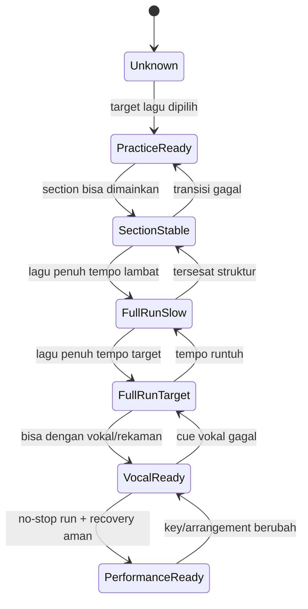

# learn-guitar-accompaniment-part-002.md

# Part 002 — Target Performance Level: Definisi “Siap Tampil” Secara Operasional

## Status Seri

- **Seri:** `learn-guitar-accompaniment`
- **Part:** `002`
- **Topik:** mendefinisikan target performa dan rubrik “siap tampil”
- **Basis pendekatan:** *The First 20 Hours* — Josh Kaufman
- **Tujuan praktis:** mengubah tujuan “bisa mengiringi penyanyi” menjadi acceptance criteria yang bisa diuji
- **Bagian sebelumnya:** `learn-guitar-accompaniment-part-001.md`
- **Bagian berikutnya:** `learn-guitar-accompaniment-part-003.md`
- **Status:** seri belum selesai

---

## Daftar Isi

1. Kenapa Harus Mendefinisikan “Siap Tampil”
2. Prinsip Kaufman: Target yang Spesifik dan Realistis
3. Definisi Operasional “Siap Tampil”
4. Perbedaan Practice-Ready, Rehearsal-Ready, dan Performance-Ready
5. Rubrik Kemampuan Gitar Pengiring
6. Acceptance Criteria untuk 20 Jam Pertama
7. Error Taxonomy: Error Aman vs Error Fatal
8. Definition of Done per Lagu
9. Cara Memilih 3 Lagu Target
10. Performance Backlog
11. Test Protocol: Cara Menguji Kesiapan
12. Metrics yang Berguna
13. Metrics yang Menipu
14. State Machine Kesiapan Tampil
15. Contoh Evaluasi Lagu
16. Latihan Praktis Part 002
17. Checklist Siap Lanjut ke Part 003
18. Ringkasan

---

# 1. Kenapa Harus Mendefinisikan “Siap Tampil”

Pertanyaan “apakah saya sudah bisa gitar?” terlalu kabur.

Pertanyaan yang lebih berguna:

> Apakah saya bisa mengiringi penyanyi untuk lagu tertentu, pada tempo tertentu, dengan chord tertentu, dari awal sampai akhir, tanpa berhenti, dan dengan error yang masih aman?

Dalam konteks belajar cepat, definisi target sangat penting. Tanpa target operasional, Anda akan terus merasa belum siap, karena selalu ada hal baru yang belum dikuasai:

- belum bisa barre chord;
- belum bisa fingerstyle;
- belum tahu semua scale;
- belum bisa improvisasi;
- belum punya gitar mahal;
- belum hafal semua lagu;
- belum paham teori lengkap.

Kalau targetnya “menguasai gitar”, memang tidak akan selesai.

Tapi target 20 jam bukan menguasai gitar.

Targetnya adalah:

> cukup kompeten untuk melakukan satu fungsi nyata: mengiringi penyanyi.

Maka kita perlu mendefinisikan level cukup itu.

---

# 2. Prinsip Kaufman: Target yang Spesifik dan Realistis

Dalam pendekatan *The First 20 Hours*, 20 jam bukan janji menjadi ahli. 20 jam adalah komitmen untuk melewati fase awal yang paling tidak nyaman dan mencapai level “reasonably good” pada target yang sempit.

Agar 20 jam masuk akal, target harus:

1. **spesifik** — skill apa, konteks apa, lagu apa;
2. **terbatas** — bukan semua genre, bukan semua teknik;
3. **terukur** — bisa diuji lewat rekaman atau simulasi;
4. **relevan** — langsung mendukung tujuan tampil;
5. **realistis** — cocok untuk pemula;
6. **berbasis output** — bukan hanya jumlah materi yang dibaca.

Target buruk:

```text
Saya ingin jago gitar.
```

Target lebih baik:

```text
Saya ingin bisa mengiringi penyanyi untuk 3 lagu pop akustik sederhana dengan chord dasar, tempo cukup stabil, intro/outro jelas, dan mampu lanjut walau ada error kecil.
```

Target terbaik untuk program ini:

```text
Setelah 20 jam latihan aktif, saya mampu memainkan 3 lagu target dari awal sampai akhir bersama penyanyi atau rekaman vokal, dengan tempo tidak runtuh, chord mayoritas bersih, transisi tidak menghentikan lagu, dinamika dasar antar-section, dan recovery saat error minor.
```

---

# 3. Definisi Operasional “Siap Tampil”

Untuk seri ini, “siap tampil” tidak berarti sempurna.

“Siap tampil” berarti:

> Anda bisa menyelesaikan lagu bersama penyanyi secara utuh, stabil, dan dapat diprediksi cukup baik sehingga penyanyi tidak kehilangan rasa aman.

## 3.1 Kriteria minimum

Anda dianggap cukup siap tampil jika untuk setiap lagu target Anda bisa:

- tuning gitar sebelum mulai;
- tahu key/nada dasar yang dipakai;
- tahu apakah perlu capo;
- tahu chord progression setiap section;
- memainkan intro yang jelas;
- memberi cue masuk vokal;
- memainkan verse dan chorus dengan dinamika berbeda;
- menjaga tempo cukup stabil;
- berpindah chord tanpa menghentikan lagu;
- mengikuti struktur lagu;
- melakukan ending yang jelas;
- recover dari error kecil;
- memainkan lagu full minimal 2 kali berturut-turut tanpa berhenti total.

## 3.2 Bukan syarat siap tampil

Tidak wajib:

- semua chord 100% bersih;
- semua strumming identik dengan rekaman asli;
- bisa solo;
- bisa fingerstyle kompleks;
- bisa membaca notasi balok;
- tahu teori lengkap;
- memainkan key asli;
- memakai chord asli yang sulit jika bisa disederhanakan.

Fokusnya bukan autentik 100% terhadap rekaman.

Fokusnya adalah versi akustik yang dapat dinyanyikan.

---

# 4. Perbedaan Practice-Ready, Rehearsal-Ready, dan Performance-Ready

Kesiapan bukan biner. Ada level.

## 4.1 Practice-ready

Anda practice-ready ketika:

- tahu chord yang akan dilatih;
- tahu tempo target;
- punya chord sheet;
- bisa memainkan bagian kecil walau lambat;
- masih sering berhenti;
- belum tentu bisa full song.

Practice-ready berarti materi siap dilatih, bukan siap dibawakan.

## 4.2 Rehearsal-ready

Anda rehearsal-ready ketika:

- bisa memainkan lagu dari awal sampai akhir sendiri;
- masih ada error kecil;
- struktur lagu sudah cukup hafal;
- bisa mengikuti metronome atau rekaman;
- tahu bagian yang rawan;
- siap dicoba bersama penyanyi.

Rehearsal-ready berarti siap diuji dengan manusia lain.

## 4.3 Performance-ready

Anda performance-ready ketika:

- bisa memainkan lagu full tanpa berhenti;
- bisa mengikuti penyanyi;
- tahu intro/outro;
- tahu cue;
- tahu dinamika;
- error kecil tidak menghentikan lagu;
- sudah pernah melakukan simulasi no-stop;
- sudah pernah merekam dan mengevaluasi.

Performance-ready berarti cukup aman untuk dibawakan dalam konteks rendah-risiko: latihan terbuka, acara kecil, rekaman demo, atau tampil informal.

Untuk panggung besar/profesional, standar tentu lebih tinggi. Seri ini membangun fondasi awal.

---

# 5. Rubrik Kemampuan Gitar Pengiring

Gunakan rubrik ini untuk mengevaluasi diri.

Skala:

- **0** = belum bisa;
- **1** = bisa secara terpisah, belum stabil;
- **2** = cukup bisa dalam konteks lambat/latihan;
- **3** = cukup stabil untuk rehearsal;
- **4** = cukup siap untuk performance sederhana.

## 5.1 Rubrik utama

| Area | 0 | 1 | 2 | 3 | 4 |
|---|---|---|---|---|---|
| Tuning | Tidak bisa tuning | Bisa dengan bantuan orang | Bisa pakai tuner tapi lambat | Bisa tuning sendiri | Bisa tuning cepat dan cek ulang sebelum tampil |
| Chord | Tidak tahu bentuk chord | Tahu bentuk tapi banyak mati | Beberapa chord cukup bunyi | Mayoritas chord bersih | Chord cukup bersih dalam lagu |
| Transisi | Berhenti total | Pindah sangat lambat | Bisa pindah di tempo lambat | Bisa pindah sambil rhythm sederhana | Transisi tidak mengganggu penyanyi |
| Rhythm | Tidak bisa menjaga beat | Bisa downstroke acak | Bisa hitung 4/4 lambat | Pattern sederhana stabil | Tempo cukup stabil full song |
| Struktur | Tidak tahu bagian lagu | Tahu verse/chorus | Bisa follow chord sheet | Bisa navigasi full song | Bisa memberi cue section |
| Dinamika | Semua sama | Kadang pelan/keras | Verse/chorus mulai beda | Dinamika cukup konsisten | Dinamika mendukung emosi vokal |
| Vokal awareness | Tidak mendengar penyanyi | Kadang sadar vokal | Bisa memberi ruang sederhana | Bisa mengikuti entry vokal | Bisa adaptasi saat penyanyi berubah sedikit |
| Recovery | Selalu berhenti | Panik saat salah | Kadang bisa lanjut | Bisa simplify dan lanjut | Error minor hampir tidak merusak lagu |

## 5.2 Target skor setelah 20 jam

Target realistis setelah 20 jam:

| Area | Target minimal |
|---|---:|
| Tuning | 3 |
| Chord | 3 |
| Transisi | 3 |
| Rhythm | 3 |
| Struktur | 3 |
| Dinamika | 2–3 |
| Vokal awareness | 2–3 |
| Recovery | 3 |

Tidak semua harus 4.

Untuk tampil sederhana, skor 3 di area inti lebih penting daripada skor 4 di satu area tetapi skor 1 di area lain.

## 5.3 Area inti yang tidak boleh terlalu lemah

Tiga area paling kritis:

1. rhythm;
2. transisi;
3. struktur lagu.

Jika salah satu dari tiga ini masih level 1, kemungkinan besar Anda belum performance-ready.

---

# 6. Acceptance Criteria untuk 20 Jam Pertama

Kita definisikan acceptance criteria seperti engineering deliverable.

## 6.1 Acceptance criteria umum

Setelah 20 jam latihan aktif, Anda harus bisa:

```text
AC-01: Menyetem gitar sendiri menggunakan tuner.
AC-02: Memainkan minimal 8 chord dasar dalam konteks lagu.
AC-03: Melakukan transisi antar-chord utama tanpa berhenti total.
AC-04: Menjaga strumming pattern dasar dalam 4/4.
AC-05: Memainkan minimal 3 lagu target dari awal sampai akhir.
AC-06: Memberikan intro sederhana untuk setiap lagu.
AC-07: Mengakhiri lagu dengan ending yang jelas.
AC-08: Membedakan dinamika verse dan chorus.
AC-09: Menyesuaikan key sederhana memakai capo jika dibutuhkan.
AC-10: Melanjutkan lagu setelah error minor tanpa berhenti total.
```

## 6.2 Acceptance criteria per lagu

Untuk setiap lagu target:

```text
Song AC-01: Chord chart tersedia dan sudah ditandai section-nya.
Song AC-02: Key/capo sudah ditentukan.
Song AC-03: Intro sudah ditentukan jumlah bar-nya.
Song AC-04: Strumming/picking pattern utama sudah dipilih.
Song AC-05: Verse dan chorus punya perbedaan dinamika.
Song AC-06: Ending sudah ditentukan.
Song AC-07: Bisa dimainkan full tanpa berhenti total.
Song AC-08: Bisa dimainkan bersama penyanyi/rekaman vokal minimal 2 kali.
Song AC-09: Error minor tidak menyebabkan restart.
Song AC-10: Rekaman latihan sudah direview minimal sekali.
```

## 6.3 Acceptance criteria performa

Saat simulasi tampil:

```text
Perf AC-01: Tuning dilakukan sebelum lagu.
Perf AC-02: Capo dipasang di fret benar jika digunakan.
Perf AC-03: Count-in atau intro jelas.
Perf AC-04: Penyanyi tahu kapan masuk.
Perf AC-05: Tempo tidak berubah ekstrem.
Perf AC-06: Lagu tidak berhenti di tengah.
Perf AC-07: Ending tidak menggantung membingungkan.
Perf AC-08: Setelah selesai, penyanyi merasa bisa mengikuti iringan.
```

Ini lebih berguna daripada pertanyaan abstrak “apakah saya sudah jago?”

---

# 7. Error Taxonomy: Error Aman vs Error Fatal

Tidak semua error sama.

Dalam performa, kita perlu membedakan:

- error kosmetik;
- error minor;
- error mayor;
- error fatal.

## 7.1 Error kosmetik

Error yang hampir tidak dirasakan pendengar.

Contoh:

- satu senar tidak bunyi sesaat;
- strum sedikit terlalu keras;
- variasi pattern tidak sengaja tetapi masih masuk beat;
- chord kurang bersih sedikit;
- pick attack tidak konsisten.

Tindakan:

- abaikan;
- lanjut;
- jangan ekspresi panik.

## 7.2 Error minor

Error terasa, tetapi lagu tetap aman.

Contoh:

- chord telat setengah beat;
- salah chord satu kali tetapi langsung balik;
- lupa accent;
- verse terlalu keras sebentar;
- upstroke hilang tetapi downbeat tetap ada.

Tindakan:

- kembali ke downbeat;
- sederhanakan pattern;
- fokus ke chord berikutnya;
- jangan berhenti.

## 7.3 Error mayor

Error yang mengganggu penyanyi, tetapi masih bisa diselamatkan.

Contoh:

- masuk chorus terlalu cepat;
- lupa satu bar;
- tempo naik banyak;
- salah pasang capo tetapi baru sadar saat mulai;
- penyanyi masuk lebih awal dan gitar tidak siap;
- lupa ending.

Tindakan:

- ikuti penyanyi jika memungkinkan;
- ulang section secara sadar;
- pakai chord root sederhana;
- eye contact;
- berikan cue verbal ringan jika latihan/informal.

## 7.4 Error fatal

Error yang menghentikan lagu atau membuat penyanyi kehilangan total.

Contoh:

- berhenti total karena chord salah;
- tidak tahu bagian lagu berikutnya;
- tempo runtuh sampai penyanyi tidak bisa masuk;
- gitar sangat fals;
- capo salah dan key tidak bisa dinyanyikan;
- intro tidak jelas sehingga penyanyi gagal masuk berkali-kali.

Tindakan pencegahan:

- tuning wajib;
- chord sheet jelas;
- intro dihitung;
- ending ditentukan;
- no-stop run;
- rehearsal dengan penyanyi;
- recovery drill.

## 7.5 Prinsip error handling

```text
Error kosmetik: ignore.
Error minor: recover silently.
Error mayor: simplify and communicate.
Error fatal: prevent through preparation.
```

Tujuan latihan bukan menghilangkan semua error, melainkan menurunkan probabilitas error fatal.

---

# 8. Definition of Done per Lagu

Setiap lagu target harus punya Definition of Done.

Template:

```md
# Definition of Done — [Judul Lagu]

## Metadata

- Judul:
- Penyanyi asli:
- Penyanyi yang akan diiringi:
- Key asli:
- Key performa:
- Capo:
- Tempo target:
- Feel:

## Struktur

- Intro:
- Verse 1:
- Pre-chorus:
- Chorus:
- Verse 2:
- Bridge:
- Final chorus:
- Outro:

## Chord

- Chord utama:
- Chord sulit:
- Chord pengganti/simplifikasi:

## Pattern

- Verse:
- Chorus:
- Bridge:
- Outro:

## Cue

- Cue masuk vokal:
- Cue chorus:
- Cue ending:

## Acceptance Criteria

- [ ] Bisa tuning sebelum lagu
- [ ] Capo benar
- [ ] Intro jelas
- [ ] Verse stabil
- [ ] Chorus lebih terbuka
- [ ] Tidak berhenti saat error minor
- [ ] Ending jelas
- [ ] Bisa full run 2x berturut-turut
- [ ] Sudah direkam dan direview
```

Definition of Done mencegah latihan yang terasa banyak tetapi tidak menuju performa.

---

# 9. Cara Memilih 3 Lagu Target

Pemilihan lagu sangat menentukan keberhasilan 20 jam.

Lagu yang salah akan membuat latihan terasa mustahil.

## 9.1 Kriteria lagu yang baik untuk 20 jam pertama

Pilih lagu yang:

- Anda sudah familiar secara melodi;
- penyanyi nyaman menyanyikannya;
- chord tidak terlalu banyak;
- tempo sedang atau lambat;
- struktur cukup jelas;
- tidak terlalu banyak modulasi;
- tidak membutuhkan barre chord berat;
- bisa dimainkan dengan open chord/capo;
- punya emosi yang bisa dibawakan sederhana.

## 9.2 Hindari dulu lagu yang terlalu kompleks

Hindari lagu dengan:

- tempo sangat cepat;
- banyak chord passing;
- modulasi key;
- syncopation sulit;
- fingerstyle ikonik yang wajib;
- intro gitar terkenal yang sulit;
- banyak slash chord cepat;
- struktur tidak reguler;
- perubahan birama.

Bukan berarti lagu itu buruk. Hanya tidak cocok untuk 20 jam pertama.

## 9.3 Tiga kategori lagu

Pilih 3 lagu dengan kategori berikut.

### Lagu 1 — Safe Song

Tujuan: lagu paling aman.

Ciri:

- chord mudah;
- tempo nyaman;
- struktur jelas;
- bisa dimainkan sangat sederhana.

Fungsi:

- membangun confidence;
- menjadi fallback performance song.

### Lagu 2 — Growth Song

Tujuan: lagu yang sedikit menantang.

Ciri:

- ada chord baru;
- ada dinamika lebih jelas;
- mungkin butuh capo;
- mungkin butuh pattern berbeda.

Fungsi:

- memperluas skill tanpa terlalu berat.

### Lagu 3 — Performance Song

Tujuan: lagu yang ingin benar-benar dibawakan.

Ciri:

- relevan dengan penyanyi/audience;
- emosional;
- masih bisa disederhanakan;
- punya struktur yang bisa dipetakan.

Fungsi:

- target akhir program.

---

# 10. Performance Backlog

Gunakan backlog seperti project kecil.

## 10.1 Template backlog

| ID | Item | Lagu | Prioritas | Status | Catatan |
|---|---|---|---|---|---|
| P-001 | Tentukan key | Semua | High | Todo | Sesuaikan penyanyi |
| P-002 | Buat chord sheet | Lagu 1 | High | Todo | Section jelas |
| P-003 | Latih intro | Lagu 1 | High | Todo | 4 bar |
| P-004 | Latih transisi sulit | Lagu 1 | High | Todo | C ke F |
| P-005 | Tentukan ending | Lagu 1 | Medium | Todo | Ritard atau stop |
| P-006 | Rekam full run | Lagu 1 | High | Todo | No-stop |
| P-007 | Rehearsal dengan penyanyi | Lagu 1 | High | Todo | Validasi key |

## 10.2 Status sederhana

Gunakan status:

- `Todo`
- `Doing`
- `Blocked`
- `Review`
- `Done`

Contoh blocked:

```text
P-004 blocked karena chord F belum bisa. Mitigasi: pakai Fmaj7/simple F sementara.
```

## 10.3 Jangan buat backlog terlalu besar

Backlog bukan tempat menumpuk semua hal yang menarik.

Backlog hanya untuk hal yang mendekatkan Anda ke performa.

Jika item tidak mendukung lagu target, masukkan ke backlog lanjutan, bukan backlog 20 jam.

---

# 11. Test Protocol: Cara Menguji Kesiapan

Kesiapan tidak bisa hanya dirasakan. Harus diuji.

## 11.1 Test 1 — Section test

Mainkan satu section saja.

Contoh:

- verse 1;
- chorus;
- bridge;
- intro + vocal entry.

Lulus jika:

- chord benar mayoritas;
- tempo tidak berhenti;
- transisi cukup lancar;
- bisa diulang 3 kali.

## 11.2 Test 2 — Slow full run

Mainkan lagu penuh dengan tempo lebih lambat.

Lulus jika:

- tidak berhenti total;
- struktur tidak tersesat;
- ending jelas.

## 11.3 Test 3 — Target tempo full run

Mainkan lagu penuh di tempo target.

Lulus jika:

- tempo cukup stabil;
- transisi tidak menghentikan lagu;
- error minor bisa dilewati.

## 11.4 Test 4 — Vocal simulation

Mainkan sambil:

- mendengar rekaman vokal;
- bernyanyi pelan sendiri;
- atau meminta orang lain bernyanyi.

Lulus jika:

- gitar tidak menabrak vokal;
- cue masuk jelas;
- verse dan chorus mendukung vokal.

## 11.5 Test 5 — No-stop performance run

Aturan:

- tuning dulu;
- mulai seperti tampil sungguhan;
- jangan berhenti;
- jangan restart;
- lanjut walau salah;
- rekam;
- evaluasi setelah selesai.

Lulus jika:

- lagu selesai;
- error fatal tidak terjadi;
- penyanyi/rekaman masih bisa diikuti;
- ending jelas.

---

# 12. Metrics yang Berguna

Metrics berguna jika membantu keputusan latihan.

## 12.1 Chord changes per minute

Ukur berapa kali Anda bisa pindah antara dua chord dalam 1 menit.

Contoh:

```text
G ↔ D = 32 changes/minute
C ↔ G = 24 changes/minute
C ↔ F = 12 changes/minute
```

Interpretasi:

- angka rendah menunjukkan bottleneck;
- transisi paling lambat harus diprioritaskan;
- tidak perlu semua transisi sama cepat.

## 12.2 No-stop duration

Berapa lama Anda bisa bermain tanpa berhenti total?

Target awal:

- 30 detik;
- 60 detik;
- 1 verse;
- 1 lagu penuh;
- 2 lagu berturut-turut.

## 12.3 Tempo stability

Ukur dengan metronome atau rekaman.

Pertanyaan evaluasi:

- apakah tempo naik saat chorus?
- apakah tempo turun saat chord sulit?
- apakah strumming berhenti saat transisi?
- apakah downbeat masih terasa?

## 12.4 Recovery count

Saat full run, catat:

- jumlah error minor;
- jumlah error mayor;
- apakah ada restart;
- berapa lama recovery.

Target:

```text
Tidak harus nol error, tetapi nol restart.
```

## 12.5 Singer comfort score

Jika latihan dengan penyanyi, tanyakan:

| Pertanyaan | Skor 1–5 |
|---|---:|
| Apakah key nyaman? |  |
| Apakah intro jelas? |  |
| Apakah tempo nyaman? |  |
| Apakah gitar terlalu ramai? |  |
| Apakah ending jelas? |  |
| Apakah penyanyi merasa aman? |  |

Ini metric yang sangat penting karena tujuan Anda adalah mengiringi penyanyi, bukan memuaskan ego gitaris.

---

# 13. Metrics yang Menipu

Tidak semua metric berguna.

## 13.1 Jumlah chord yang dihafal

Bisa menipu karena:

- tidak menunjukkan transisi;
- tidak menunjukkan rhythm;
- tidak menunjukkan performa;
- tidak menunjukkan awareness vokal.

Lebih baik tahu sedikit chord tetapi bisa memainkan lagu.

## 13.2 Jumlah tutorial yang ditonton

Menonton bukan latihan aktif.

Tutorial berguna hanya jika segera diterapkan.

Batas sehat:

```text
Untuk setiap 10 menit menonton, minimal 30 menit praktik.
```

## 13.3 Bisa memainkan intro sulit

Intro keren tidak cukup jika lagu runtuh setelah vokal masuk.

Untuk pengiring, full song lebih penting daripada bagian viral.

## 13.4 Speed

Cepat tidak selalu baik.

Pengiring yang terlalu cepat bisa merusak napas penyanyi.

Tempo stabil lebih penting daripada tempo cepat.

## 13.5 Gear quality

Gitar yang nyaman penting. Tetapi gear mahal tidak menggantikan:

- tuning;
- rhythm;
- transisi;
- dinamika;
- rehearsal.

---

# 14. State Machine Kesiapan Tampil

Kesiapan bisa divisualisasikan seperti state machine.



State ini membantu Anda tidak menipu diri.

Jangan mengklaim performance-ready jika belum pernah vocal-ready.

Jangan mengklaim vocal-ready jika full run sendiri masih sering berhenti.

---

# 15. Contoh Evaluasi Lagu

Misalnya Anda memilih lagu sederhana dengan chord:

```text
G - D - Em - C
```

## 15.1 Evaluasi awal

| Area | Kondisi | Status |
|---|---|---|
| Chord G | cukup bersih | OK |
| Chord D | kadang string 1 mati | Minor |
| Chord Em | bersih | OK |
| Chord C | lambat pindah | Risk |
| Transisi Em → C | lambat | Bottleneck |
| Rhythm | downstroke stabil | OK |
| Pattern | D-D-U-U-D-U belum stabil | Risk |
| Struktur | verse/chorus belum ditandai | Blocker |
| Intro | belum ditentukan | Blocker |
| Ending | belum ditentukan | Blocker |

## 15.2 Keputusan latihan

Jangan langsung belajar pattern rumit.

Prioritas:

1. tandai struktur lagu;
2. tentukan intro 4 bar;
3. latih Em → C;
4. pakai downstroke dulu;
5. full run lambat;
6. baru tambah strumming pattern.

## 15.3 Definition of Done sederhana

```text
Lagu dianggap rehearsal-ready jika:
- chord progression hafal atau chord sheet jelas;
- intro 4 bar bisa konsisten;
- downstroke full song tidak berhenti;
- Em → C tidak memutus lagu;
- bisa selesai dari awal sampai akhir.
```

---

# 16. Latihan Praktis Part 002

## Latihan 1 — Tulis acceptance criteria pribadi

Isi template:

```md
# Acceptance Criteria Pribadi 20 Jam

Setelah 20 jam, saya ingin bisa:

- [ ] Mengiringi ... lagu
- [ ] Memakai chord utama: ...
- [ ] Memakai strumming utama: ...
- [ ] Menyesuaikan key dengan capo jika perlu
- [ ] Memberi intro jelas
- [ ] Memberi ending jelas
- [ ] Bermain full song tanpa restart
- [ ] Recovery dari error minor
- [ ] Rehearsal minimal ... kali dengan penyanyi/rekaman
```

## Latihan 2 — Buat rubrik skor awal

Beri skor 0–4:

| Area | Skor Saat Ini | Target 20 Jam | Gap |
|---|---:|---:|---:|
| Tuning |  | 3 |  |
| Chord |  | 3 |  |
| Transisi |  | 3 |  |
| Rhythm |  | 3 |  |
| Struktur |  | 3 |  |
| Dinamika |  | 2–3 |  |
| Vokal awareness |  | 2–3 |  |
| Recovery |  | 3 |  |

Area dengan gap terbesar menjadi prioritas latihan.

## Latihan 3 — Pilih lagu safe/growth/performance

Isi:

| Kategori | Judul Lagu | Alasan | Risiko | Mitigasi |
|---|---|---|---|---|
| Safe Song |  |  |  |  |
| Growth Song |  |  |  |  |
| Performance Song |  |  |  |  |

## Latihan 4 — Buat Definition of Done untuk satu lagu

Ambil satu lagu paling mudah.

Isi template DoD:

```md
# Definition of Done — Lagu 1

## Metadata
- Judul:
- Penyanyi:
- Key performa:
- Capo:
- Tempo:

## Struktur
- Intro:
- Verse:
- Chorus:
- Bridge/Interlude:
- Outro:

## Chord
- Chord utama:
- Chord sulit:
- Simplifikasi:

## Pattern
- Pattern awal:
- Pattern chorus:

## Acceptance
- [ ] Intro jelas
- [ ] Bisa verse
- [ ] Bisa chorus
- [ ] Bisa full run lambat
- [ ] Bisa full run target tempo
- [ ] Bisa dengan vokal/rekaman
- [ ] Bisa no-stop run
```

## Latihan 5 — Tentukan error fatal yang harus dicegah

Untuk lagu pilihan, tulis 3 error fatal paling mungkin.

Contoh:

```text
1. Lupa masuk chorus.
2. Transisi C ke F berhenti total.
3. Intro tidak jelas sehingga penyanyi bingung masuk.
```

Lalu tulis mitigasi:

```text
1. Tandai chord sheet dengan warna.
2. Pakai Fmaj7 sementara.
3. Intro 4 bar dan eye contact di bar ke-4.
```

---

# 17. Checklist Siap Lanjut ke Part 003

Sebelum lanjut, Anda sebaiknya sudah punya:

- [ ] definisi pribadi “siap tampil”;
- [ ] acceptance criteria 20 jam;
- [ ] rubrik skor awal;
- [ ] 3 lagu kandidat;
- [ ] satu lagu prioritas;
- [ ] Definition of Done untuk lagu pertama;
- [ ] daftar 3 error fatal yang harus dicegah;
- [ ] pemahaman bahwa siap tampil bukan berarti sempurna.

Jika belum lengkap, tidak apa-apa. Tetapi minimal pilih satu lagu prioritas sebelum masuk ke setup teknis, karena setup teknis akan lebih bermakna jika langsung dikaitkan ke lagu nyata.

---

# 18. Ringkasan

Part ini mengubah tujuan abstrak menjadi target operasional.

“Siap tampil” dalam seri ini berarti:

```text
Bisa mengiringi penyanyi dari awal sampai akhir lagu secara stabil, dengan chord cukup bersih, tempo cukup aman, struktur jelas, dinamika dasar, dan recovery saat error minor.
```

Kita tidak mengejar sempurna.

Kita mengejar:

- lagu selesai;
- penyanyi nyaman;
- error fatal dicegah;
- error minor bisa dilewati;
- performa cukup stabil untuk konteks sederhana.

Prinsip paling penting:

> Jangan mengukur kesiapan dari jumlah chord yang diketahui. Ukur dari kemampuan menyelesaikan lagu bersama penyanyi tanpa membuat lagu runtuh.

Bagian berikutnya akan masuk ke setup gitar: alat, posisi, tuning, capo, tuner, pick, dan cara menghilangkan hambatan latihan agar 20 jam benar-benar terjadi.

---

# Akhir Part 002

**Status:** seri belum selesai.  
**Lanjut ke:** `learn-guitar-accompaniment-part-003.md` — Setup Gitar: Alat, Posisi, Tuning, dan Hambatan Latihan.
