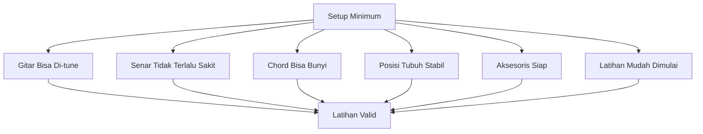
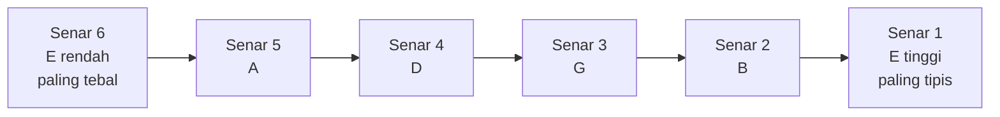
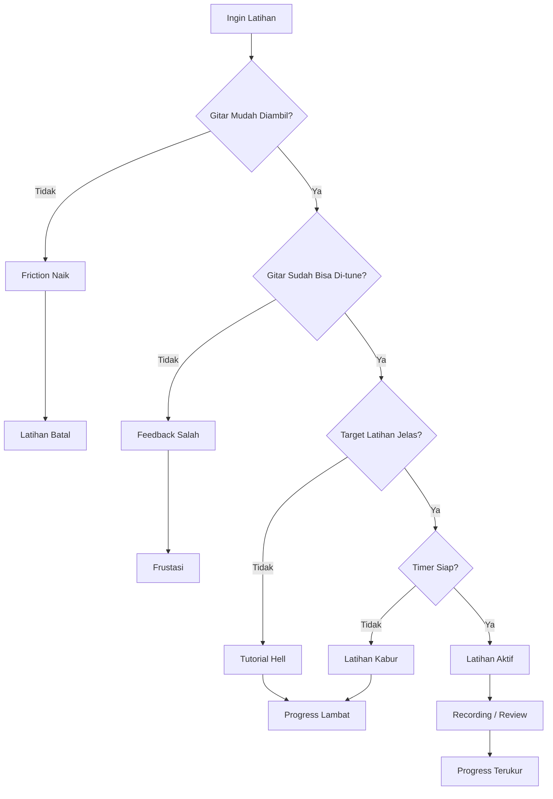
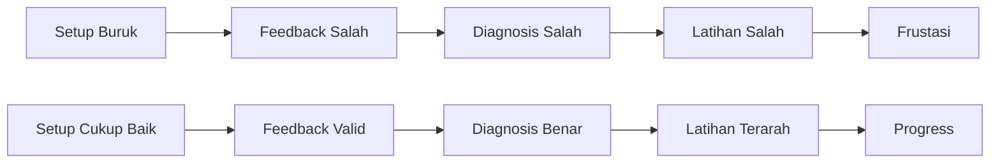

# learn-guitar-accompaniment-part-003.md

# Part 003 — Setup Gitar: Alat, Posisi, Tuning, dan Hambatan Latihan

## Status Seri

Seri: **Belajar Guitar Accompaniment Berdasarkan The First 20 Hours**  
Bagian: **003 dari 035**  
Fokus: membuat environment latihan gitar menjadi cukup benar, cukup nyaman, dan cukup mudah diulang sehingga 20 jam latihan tidak bocor karena hambatan teknis.

Bagian ini belum membahas lagu secara dalam. Ini adalah bagian “infrastruktur”. Sama seperti sistem software: sebelum bicara business logic, kita perlu runtime, konfigurasi, dependency, dan observability minimum yang tidak merusak proses eksekusi.

---

## Tujuan Pembelajaran Part Ini

Setelah menyelesaikan part ini, Anda harus bisa:

1. memilih atau menilai gitar yang cukup layak untuk latihan pengiring vokal;
2. memahami perbedaan acoustic, classical, dan electric dari sudut pandang accompaniment;
3. menyiapkan aksesoris minimum: tuner, capo, pick, strap, dan chord sheet;
4. menyetem gitar standard tuning `E A D G B E`;
5. duduk atau berdiri dengan posisi yang tidak cepat membuat tangan sakit;
6. memegang pick secara stabil;
7. melakukan pre-flight check sebelum latihan atau tampil;
8. menghilangkan friction latihan agar gitar mudah diambil setiap hari;
9. memahami kenapa gitar fals, action terlalu tinggi, dan setup buruk bisa membuat progress 20 jam terasa gagal.

---

## Prinsip Kaufman yang Dipakai di Part Ini

Dalam pendekatan *The First 20 Hours*, salah satu prinsip penting adalah **remove barriers to practice**.

Untuk gitar, hambatan latihan sering bukan karena orang tidak mampu belajar, tetapi karena:

- gitar sulit ditekan;
- gitar sering fals;
- tidak punya tuner;
- capo tidak tersedia saat butuh transpose;
- pick hilang;
- chord sheet berantakan;
- posisi duduk membuat bahu dan pergelangan tegang;
- gitar disimpan terlalu jauh sehingga malas diambil;
- latihan dimulai dengan “mencari tutorial dulu”;
- lagu terlalu sulit sejak awal;
- tidak ada setup ritual yang konsisten.

Untuk software engineer, ini seperti pipeline lokal yang rusak: setiap mau coding harus memperbaiki dependency, env var, database, dan port conflict. Akhirnya energi habis sebelum problem utama disentuh.

Dalam latihan gitar, setup yang buruk membuat “jam latihan” berubah menjadi “jam frustasi”.

---

# 1. Definisi Setup Minimum

Setup minimum bukan setup ideal. Setup minimum adalah kondisi di mana gitar cukup nyaman dan cukup benar untuk membuat latihan Anda valid.



Jika salah satu komponen utama rusak, feedback yang Anda terima saat latihan menjadi tidak akurat.

Contoh:

- Anda merasa “saya tidak berbakat”, padahal action gitar terlalu tinggi.
- Anda merasa “chord saya selalu jelek”, padahal gitar fals.
- Anda merasa “jari saya lemah”, padahal senar terlalu berat untuk pemula.
- Anda merasa “rhythm saya kacau”, padahal posisi pick tidak stabil.
- Anda merasa “saya malas latihan”, padahal gitar disimpan di tempat yang sulit dijangkau.

---

# 2. Jenis Gitar untuk Mengiringi Penyanyi

## 2.1 Acoustic Steel-String Guitar

Ini biasanya pilihan paling praktis untuk mengiringi penyanyi dalam konteks pop, folk, worship, ballad, indie, dan akustik umum.

Karakter:

- suara terang;
- sustain cukup panjang;
- cocok untuk strumming;
- cocok untuk fingerpicking;
- mudah dipakai solo tanpa amplifier;
- lazim digunakan untuk accompaniment.

Kelebihan:

- langsung terdengar cukup penuh;
- cocok untuk banyak lagu populer;
- chord open terdengar natural;
- mudah dipakai dengan capo;
- cocok untuk panggung kecil.

Kekurangan:

- senar baja lebih sakit untuk pemula;
- action buruk bisa sangat menyiksa;
- suara bisa terlalu keras jika strumming tidak dikontrol;
- butuh adaptasi tekanan jari.

Rekomendasi untuk target seri ini:

> Jika Anda belum punya gitar dan ingin mengiringi penyanyi, acoustic steel-string adalah default paling masuk akal.

---

## 2.2 Classical / Nylon-String Guitar

Gitar nylon sering dipakai pemula karena senarnya lebih lembut. Ini bukan pilihan buruk, tetapi karakter suaranya berbeda.

Karakter:

- senar lebih lembut;
- neck biasanya lebih lebar;
- suara lebih warm dan bulat;
- cocok untuk lagu lembut, latin, klasik, pop melankolis;
- strumming pop modern bisa terdengar kurang crisp dibanding steel-string.

Kelebihan:

- lebih ramah jari;
- cocok untuk latihan chord dasar;
- nyaman untuk fingerstyle;
- tidak terlalu agresif menabrak vokal.

Kekurangan:

- neck lebar bisa menyulitkan tangan kecil;
- strumming pop bisa kurang tajam;
- sustain dan attack berbeda;
- kurang cocok jika target sound adalah acoustic pop modern.

Rekomendasi:

> Kalau hanya ada gitar nylon, tetap bisa dipakai. Jangan menunda belajar hanya karena belum punya steel-string. Tetapi pahami bahwa sound dan feel-nya berbeda.

---

## 2.3 Electric Guitar

Electric guitar bisa dipakai untuk accompaniment, tetapi bukan pilihan paling sederhana untuk 20 jam pertama jika targetnya mengiringi penyanyi secara mandiri.

Karakter:

- butuh amplifier atau audio interface;
- volume bisa dikontrol;
- senar biasanya lebih ringan;
- sustain panjang;
- tone sangat bergantung pada amp/effect.

Kelebihan:

- senar lebih mudah ditekan;
- cocok untuk worship band, pop band, R&B, rock;
- bisa memainkan voicing halus;
- tidak terlalu melelahkan untuk tangan kiri.

Kekurangan:

- setup lebih kompleks;
- tone bisa jelek jika amp/effect tidak tepat;
- noise lebih jelas;
- tidak sepraktis acoustic untuk latihan spontan;
- pengiring solo tanpa amp kurang natural.

Rekomendasi:

> Untuk target “mengiringi penyanyi dengan gitar tunggal”, electric bukan prioritas pertama. Untuk target bermain dalam band, electric bisa menjadi cabang lanjutan.

---

# 3. Kriteria Gitar Layak Latihan

Anda tidak butuh gitar mahal. Anda butuh gitar yang tidak membohongi feedback latihan.

## 3.1 Gitar Harus Bisa Di-tune dan Stabil

Cek:

- tuning machine tidak longgar parah;
- setelah di-tune, gitar tidak langsung turun nada dalam 1–2 menit;
- senar tidak berkarat parah;
- bridge tidak terangkat;
- neck tidak melengkung ekstrem.

Jika gitar tidak stabil tuning-nya, latihan chord dan ear training menjadi kacau.

---

## 3.2 Action Tidak Terlalu Tinggi

**Action** adalah jarak senar dari fretboard.

Jika action terlalu tinggi:

- jari cepat sakit;
- chord sulit bersih;
- tekanan harus besar;
- intonasi bisa ikut berubah saat ditekan;
- transisi chord terasa mustahil.

Rule of thumb sederhana:

- saat menekan chord dasar, jari sakit itu normal di awal;
- tetapi jika Anda harus menekan seperti “menjepit besi keras” dan chord tetap buzzing/mati, kemungkinan setup gitar bermasalah;
- jika jarak senar ke fret di fret 12 terlihat sangat tinggi, minta teknisi gitar mengecek.

Untuk pemula, setup gitar oleh teknisi bisa lebih bernilai daripada membeli gitar baru.

---

## 3.3 Senar Tidak Terlalu Berat

Untuk acoustic steel-string, pemula biasanya lebih nyaman dengan senar light gauge.

Contoh umum:

- `0.010` atau `0.011` untuk acoustic yang lebih ramah pemula;
- `0.012` masih umum, tetapi bisa terasa lebih berat.

Prinsipnya:

> Senar yang terlalu berat memperbesar biaya latihan tanpa memberi manfaat besar untuk 20 jam pertama.

---

## 3.4 Fret Tidak Tajam

Cek sisi neck. Jika ujung fret tajam dan melukai jari, latihan akan tidak nyaman.

---

## 3.5 Ukuran Body Cocok

Gitar dreadnought besar bisa terdengar penuh, tetapi tidak selalu nyaman. Untuk pemula:

- ukuran concert / grand auditorium sering lebih nyaman;
- body terlalu besar membuat bahu kanan tegang;
- gitar terlalu kecil bisa kurang resonansi, tetapi tetap bisa dipakai.

Kriteria utama: Anda bisa memegang gitar 30–45 menit tanpa tubuh terasa melawan.

---

# 4. Aksesoris Minimum

## 4.1 Tuner

Ini wajib.

Bentuk tuner:

- clip-on tuner;
- aplikasi tuner di HP;
- pedal tuner;
- tuner bawaan gitar.

Untuk latihan awal, aplikasi tuner cukup. Tetapi clip-on tuner lebih praktis karena bisa dipakai di ruangan berisik.

Tanpa tuner, Anda berisiko melatih telinga terhadap suara yang salah.

---

## 4.2 Capo

Capo adalah alat kecil yang menjepit fret untuk menaikkan nada dasar tanpa mengubah chord shape.

Untuk pengiring penyanyi, capo sangat penting karena penyanyi sering butuh key yang berbeda.

Contoh:

- Anda memainkan chord shape G, C, D, Em.
- Capo di fret 2.
- Suara aktual naik 1 whole step.
- Shape G terdengar sebagai A.

Capo bukan “cheat”. Capo adalah alat arrangement.

---

## 4.3 Pick

Pick berguna untuk strumming yang konsisten.

Untuk pemula:

- pick terlalu tipis mudah “flappy” tetapi nyaman;
- pick terlalu tebal bisa nyangkut;
- medium sekitar `0.60–0.73 mm` sering nyaman untuk strumming awal.

Idealnya punya beberapa pick karena pick mudah hilang.

---

## 4.4 Strap

Jika target Anda tampil, Anda perlu bisa bermain sambil berdiri atau setidaknya punya opsi stabil.

Strap membantu:

- posisi gitar konsisten;
- tangan kiri tidak perlu menahan neck;
- transisi chord lebih stabil;
- simulasi panggung lebih realistis.

---

## 4.5 Chord Sheet / Lyric Sheet

Chord sheet adalah “runtime script” saat latihan lagu.

Format minimum chord sheet:

```text
Title:
Key:
Capo:
Tempo:
Time Signature:
Structure:
Intro:
Verse:
Chorus:
Bridge:
Outro:
Notes:
```

Nanti di part berikutnya akan dibuat template lebih lengkap.

---

## 4.6 Metronome

Metronome bisa berupa aplikasi HP.

Fungsi:

- mengukur tempo;
- mendeteksi apakah Anda mempercepat saat gugup;
- melatih strumming stabil;
- melatih transisi chord tanpa berhenti.

Banyak pemula membenci metronome karena metronome menunjukkan kebenaran. Justru itu gunanya.

---

## 4.7 Recording Device

HP cukup.

Gunanya:

- mendengar apakah chord bersih;
- mendengar tempo lari;
- mendengar apakah strumming menabrak vokal;
- membandingkan progress mingguan.

Jangan mengandalkan rasa saat bermain. Saat bermain, otak sibuk. Recording adalah observability.

---

# 5. Standard Tuning: E A D G B E

Gitar standard tuning dari senar paling tebal ke paling tipis:

```text
6th string: E  - paling tebal, paling rendah
5th string: A
4th string: D
3rd string: G
2nd string: B
1st string: E  - paling tipis, paling tinggi
```

Mnemonic Inggris yang umum:

```text
Eddie Ate Dynamite Good Bye Eddie
```

Mnemonic Indonesia bebas:

```text
Eko Ambil Daging Goreng Buat Egi
```

Yang penting bukan mnemonic-nya, tetapi urutan fisiknya.



Catatan penting:

- Senar 6 dan senar 1 sama-sama E, tetapi oktafnya berbeda.
- Senar 6 adalah E rendah.
- Senar 1 adalah E tinggi.
- Saat chord diagram menyebut string 1, itu senar paling tipis.
- Saat pemain gitar menyebut “low E”, itu senar paling tebal.

---

# 6. Cara Menyetem Gitar

## 6.1 Dengan Clip-On Tuner atau Aplikasi

Langkah:

1. Duduk tenang.
2. Petik satu senar saja.
3. Lihat huruf yang muncul.
4. Putar tuning peg perlahan.
5. Targetkan jarum/indikator berada di tengah.
6. Ulangi untuk semua senar.
7. Setelah selesai, ulangi sekali lagi dari senar 6 ke 1.

Kenapa harus ulangi? Karena perubahan tension satu senar bisa sedikit memengaruhi stabilitas keseluruhan gitar.

---

## 6.2 Urutan Tuning

Urutan standard:

```text
6: E
5: A
4: D
3: G
2: B
1: E
```

Saat tuning, jangan petik terlalu keras. Petik normal seperti saat bermain.

---

## 6.3 Kesalahan Umum Saat Tuning

### Salah Oktaf

Ini berbahaya. Jika Anda mengencangkan senar terlalu jauh untuk mengejar huruf yang benar tapi oktaf salah, senar bisa putus.

Solusi:

- jika senar terasa sangat tegang, berhenti;
- bandingkan dengan suara referensi;
- gunakan tuner chromatic yang jelas;
- putar perlahan.

### Membaca Senar Terbalik

Banyak pemula bingung antara senar 1 dan senar 6.

Solusi:

- ingat: senar 1 = paling tipis;
- senar 6 = paling tebal.

### Tuning di Lingkungan Terlalu Berisik

Jika memakai aplikasi HP, suara sekitar bisa mengganggu.

Solusi:

- gunakan clip-on tuner;
- dekatkan HP ke soundhole;
- tune di tempat lebih sepi.

### Tidak Muting Senar Lain

Saat tuning satu senar, senar lain bisa ikut bergetar.

Solusi:

- tahan ringan senar lain;
- petik satu senar saja.

---

# 7. Pre-Flight Check Sebelum Latihan

Sebelum sesi latihan, lakukan ritual 3–5 menit.

```text
[ ] Gitar sudah di-tune
[ ] Pick tersedia
[ ] Capo tersedia
[ ] Metronome siap
[ ] Chord sheet siap
[ ] Timer latihan siap
[ ] HP siap untuk recording
[ ] Duduk/berdiri nyaman
[ ] Target latihan hari ini jelas
```

Ini terlihat sepele, tetapi sangat penting. Latihan tanpa target mudah berubah menjadi browsing tutorial.

---

# 8. Posisi Tubuh Saat Bermain

## 8.1 Prinsip Umum

Posisi yang baik bukan posisi yang terlihat keren. Posisi yang baik adalah posisi yang:

- stabil;
- tidak membuat bahu naik;
- tidak membuat pergelangan terlalu patah;
- memungkinkan tangan kiri bergerak;
- memungkinkan tangan kanan strumming bebas;
- bisa dipertahankan 30–45 menit.

---

## 8.2 Posisi Duduk

Langkah:

1. Duduk di kursi stabil.
2. Jangan bersandar terlalu malas.
3. Letakkan gitar di paha kanan jika right-handed.
4. Soundhole kira-kira berada di depan dada/perut kanan.
5. Neck sedikit naik, bukan turun.
6. Bahu rileks.
7. Siku kanan bertumpu ringan di body gitar.
8. Tangan kiri tidak menahan seluruh berat neck.

Kesalahan umum:

- gitar terlalu rebah;
- neck turun;
- bahu kanan naik;
- punggung membungkuk ekstrem;
- tangan kiri dipakai menahan gitar;
- badan terlalu tegang.

---

## 8.3 Posisi Berdiri

Jika target Anda tampil, latihan berdiri penting.

Langkah:

1. Pasang strap.
2. Atur tinggi gitar mendekati posisi duduk.
3. Jangan menggantung gitar terlalu rendah.
4. Pastikan tangan kiri tetap bisa mencapai chord.
5. Pastikan tangan kanan bisa strumming tanpa bahu tegang.

Pemula sering ingin terlihat seperti gitaris panggung dengan gitar rendah. Itu buruk untuk fase 20 jam pertama.

Prinsip:

> Posisi panggung harus mendukung reliability, bukan ego visual.

---

# 9. Posisi Tangan Kiri

Tangan kiri bertugas menekan chord.

## 9.1 Gunakan Ujung Jari

Tekan senar dengan ujung jari, bukan bantalan jari yang terlalu rebah.

Tujuannya:

- senar lain tidak ikut ketutup;
- chord lebih bersih;
- tekanan lebih efisien.

---

## 9.2 Tekan Dekat Fret

Tekan senar dekat fret logam di sisi kanan fret, bukan di tengah ruang fret.

Misal jari berada di fret 2:

- jangan terlalu dekat fret 1;
- jangan tepat di atas logam fret;
- tekan sedikit sebelum logam fret 2.

Jika terlalu jauh dari fret, suara buzzing lebih mudah terjadi.

---

## 9.3 Thumb di Belakang Neck

Untuk banyak chord dasar, ibu jari bisa berada di belakang neck sebagai support.

Namun dalam beberapa chord open, ibu jari bisa sedikit naik. Jangan terlalu dogmatis.

Prinsip:

- tangan harus rileks;
- jari bisa melengkung;
- wrist tidak terlalu patah;
- chord bisa berpindah.

---

## 9.4 Jangan Menekan Terlalu Keras

Pemula sering overpressure.

Cara cek:

1. Bentuk chord.
2. Petik senar.
3. Kurangi tekanan sedikit demi sedikit.
4. Cari tekanan minimum yang masih menghasilkan suara bersih.

Tekanan efisien membuat transisi lebih cepat dan tangan tidak cepat lelah.

---

# 10. Posisi Tangan Kanan

Tangan kanan adalah sumber rhythm. Dalam accompaniment, tangan kanan sering lebih penting daripada tangan kiri.

## 10.1 Area Strumming

Area umum:

- sekitar soundhole untuk acoustic;
- sedikit ke arah bridge untuk suara lebih bright;
- sedikit ke arah neck untuk suara lebih warm.

Untuk awal, strum di sekitar soundhole.

---

## 10.2 Gerakan dari Pergelangan, Bukan Siku Saja

Gerakan strumming sebaiknya longgar.

- Siku memberi ayunan besar.
- Pergelangan memberi fleksibilitas.
- Jari/pick tidak kaku.

Jika tangan kanan terlalu kaku, rhythm terdengar mekanis dan kasar.

---

## 10.3 Pick Angle

Pick tidak harus tegak lurus 90 derajat terhadap senar.

Sedikit miring membantu pick melewati senar lebih halus.

Jika pick sering nyangkut:

- grip mungkin terlalu kaku;
- angle terlalu tegak;
- pick terlalu tebal;
- strumming terlalu dalam;
- tangan terlalu tegang.

---

# 11. Cara Memegang Pick

## 11.1 Grip Dasar

1. Letakkan pick di sisi jari telunjuk.
2. Jepit dengan ibu jari.
3. Sisakan ujung pick secukupnya.
4. Jangan terlalu banyak pick keluar.
5. Jangan menggenggam terlalu kaku.

Pick harus cukup stabil, tetapi masih fleksibel.

---

## 11.2 Kesalahan Grip

### Terlalu Longgar

Akibat:

- pick jatuh;
- attack tidak konsisten;
- strumming tidak stabil.

### Terlalu Kaku

Akibat:

- suara terlalu kasar;
- pick nyangkut;
- tangan cepat lelah;
- rhythm tidak flowing.

### Pick Terlalu Banyak Keluar

Akibat:

- pick tersangkut senar;
- kontrol buruk.

---

# 12. Pain vs Injury

Belajar gitar hampir pasti membuat ujung jari tangan kiri sakit di awal. Itu normal.

Yang normal:

- ujung jari terasa perih;
- kulit mulai menebal;
- rasa tidak nyaman setelah latihan chord;
- lelah ringan di tangan.

Yang tidak normal:

- nyeri tajam di pergelangan;
- mati rasa;
- kesemutan terus-menerus;
- nyeri siku/bahu kuat;
- sakit yang memburuk walau istirahat;
- memaksa latihan saat tubuh memberi sinyal cedera.

Prinsip:

> Callus boleh dibangun. Cedera jangan dibangun.

Untuk 20 jam pertama, konsistensi lebih penting daripada latihan brutal.

---

# 13. Environment Latihan

## 13.1 Gitar Harus Mudah Diambil

Jangan simpan gitar terlalu jauh.

Ideal:

- gitar di stand;
- tuner dekat gitar;
- pick ditempel/diletakkan dekat gitar;
- capo dekat gitar;
- chord sheet siap;
- tempat latihan tetap.

Jika setiap latihan butuh 10 menit mengambil dan menyiapkan alat, Anda akan kalah oleh friction.

---

## 13.2 Latihan Harus Punya Timer

Gunakan timer 25–45 menit.

Tanpa timer, latihan cenderung kabur:

- 5 menit tuning;
- 10 menit scroll;
- 15 menit mencoba lagu random;
- 5 menit merasa gagal;
- selesai.

Dengan timer, latihan menjadi deliberate.

---

## 13.3 Satu Sesi, Satu Target Utama

Contoh target buruk:

> Hari ini belajar gitar.

Contoh target baik:

> Hari ini latihan transisi G–C selama 10 menit, lalu main lagu A dengan strumming quarter note sampai selesai tanpa berhenti.

Target harus observable.

---

# 14. Practice Barrier Map



---

# 15. Setup Checklist untuk 20 Jam Pertama

## Wajib

```text
[ ] Gitar layak tekan
[ ] Tuner
[ ] Pick
[ ] Chord sheet
[ ] Metronome app
[ ] Timer
[ ] Recording device
```

## Sangat Disarankan

```text
[ ] Capo
[ ] Strap
[ ] Stand gitar
[ ] Senar cadangan
[ ] Pick cadangan
```

## Opsional

```text
[ ] Footstool
[ ] Guitar humidifier
[ ] DI box
[ ] Audio interface
[ ] Microphone
[ ] Pedal tuner
```

Untuk 20 jam pertama, jangan over-invest di gear. Gear membantu hanya jika hambatan utama memang gear.

---

# 16. Latihan Setup 30 Menit

Sebelum masuk part berikutnya, lakukan latihan setup berikut.

## Block 1 — Tuning Awareness, 10 Menit

1. Tune semua senar.
2. Petik tiap senar satu-satu.
3. Sebutkan namanya:
   - E;
   - A;
   - D;
   - G;
   - B;
   - E.
4. Ulangi 5 kali.
5. Coba tune ulang.

Target:

> Anda tidak lagi bingung urutan senar.

---

## Block 2 — Holding Position, 10 Menit

1. Duduk dengan gitar.
2. Cek bahu.
3. Cek wrist.
4. Cek apakah tangan kiri menahan neck.
5. Strum senar terbuka pelan.
6. Berdiri dengan strap jika ada.
7. Bandingkan posisi duduk dan berdiri.

Target:

> Anda menemukan posisi yang bisa dipertahankan tanpa tegang berlebihan.

---

## Block 3 — Pick Control, 10 Menit

1. Pegang pick.
2. Strum semua senar terbuka ke bawah.
3. Jangan pikirkan chord.
4. Fokus agar pick tidak jatuh.
5. Coba down-up perlahan.
6. Kurangi ketegangan tangan.
7. Rekam 30 detik.

Target:

> Suara strumming mulai konsisten dan pick tidak sering tersangkut.

---

# 17. Acceptance Criteria Part 003

Anda boleh lanjut ke part berikutnya jika:

```text
[ ] Bisa menyebut urutan senar E A D G B E dari senar 6 ke 1
[ ] Bisa tune gitar dengan tuner
[ ] Bisa memegang gitar duduk dengan stabil
[ ] Bisa memegang pick tanpa jatuh selama strumming 1 menit
[ ] Bisa melakukan downstroke pada senar terbuka dengan tempo pelan
[ ] Punya tempat latihan yang mudah diakses
[ ] Punya timer dan metronome app
[ ] Punya minimal satu chord sheet kosong/template
```

Jika belum semua terpenuhi, tetap boleh lanjut membaca, tetapi jangan anggap latihan chord valid jika gitar belum bisa di-tune.

---

# 18. Kesalahan Engineer-Minded di Fase Setup

## 18.1 Over-Optimizing Gear

Gejala:

- mencari gitar terbaik;
- membandingkan terlalu banyak review;
- menunda latihan sampai punya gear ideal;
- membeli aksesori yang belum dibutuhkan.

Solusi:

> Gunakan gear cukup baik. Mulai latihan. Perbaiki gear hanya jika terbukti menjadi bottleneck.

---

## 18.2 Underestimating Physical Friction

Sebagai engineer, Anda mungkin terbiasa berpikir bahwa problem ada di “knowledge”. Pada gitar, problem sering ada di tubuh:

- jari belum kuat;
- callus belum terbentuk;
- tangan kanan kaku;
- duduk salah;
- gitar terlalu tinggi action-nya.

Solusi:

> Jangan semua masalah dianggap kurang teori. Banyak masalah adalah ergonomics dan motor learning.

---

## 18.3 Tidak Mau Pakai Metronome

Metronome terasa mengganggu karena ia objektif. Tapi accompaniment membutuhkan clock.

Solusi:

> Perlakukan metronome seperti test suite. Ia tidak membuat Anda musikal, tetapi ia menunjukkan timing bug.

---

## 18.4 Tidak Recording

Rasa saat bermain sering menipu.

Solusi:

> Recording adalah log. Tanpa log, debugging performance hanya berdasarkan asumsi.

---

# 19. Ringkasan Mental Model

Setup gitar bukan urusan kosmetik. Setup adalah prasyarat feedback yang valid.



Dalam 20 jam pertama, Anda tidak butuh semua alat. Anda butuh lingkungan yang membuat latihan:

- mudah dimulai;
- bisa diulang;
- bisa diukur;
- tidak menyakiti tubuh secara bodoh;
- menghasilkan feedback yang bisa dipercaya.

---

# 20. Output Part Ini

Output konkret dari part ini:

1. gitar bisa di-tune;
2. urutan senar dipahami;
3. posisi duduk/berdiri cukup nyaman;
4. pick bisa dipegang;
5. aksesoris minimum tersedia;
6. tempat latihan siap;
7. ritual pre-flight check dibuat.

Jika semua ini selesai, Anda sudah punya “runtime environment” untuk skill gitar.

Part berikutnya akan membahas:

> **Mental Model Fretboard: Jangan Hafalkan Semua, Pahami Peta Minimum.**

