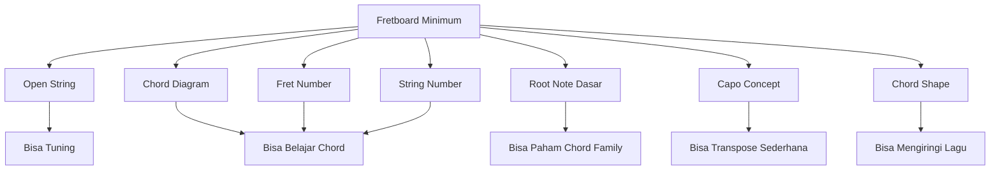
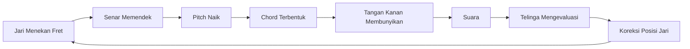
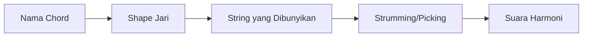
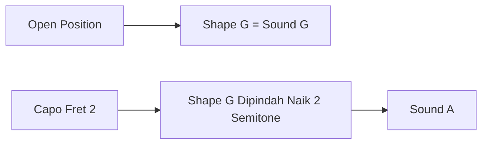
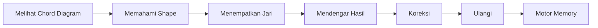
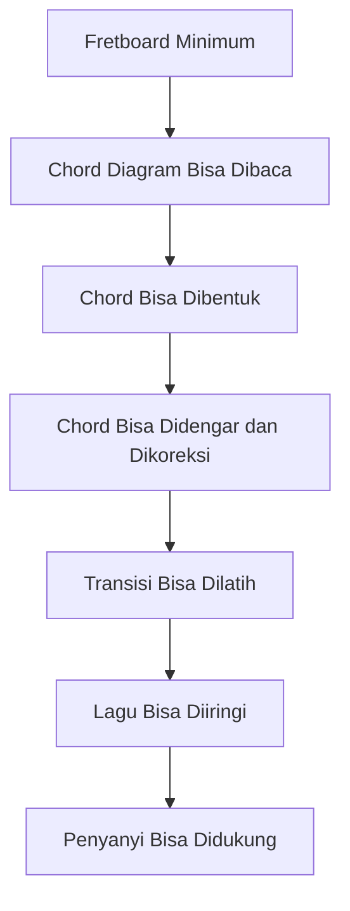

# learn-guitar-accompaniment-part-004.md

# Part 004 — Mental Model Fretboard: Jangan Hafalkan Semua, Pahami Peta Minimum

## Status Seri

Seri: **Belajar Guitar Accompaniment Berdasarkan The First 20 Hours**  
Bagian: **004 dari 035**  
Fokus: memahami fretboard gitar secukupnya agar chord diagram, chord chart, capo, root note, dan perpindahan chord tidak terasa seperti simbol acak.

Bagian ini tidak bertujuan membuat Anda hafal seluruh not di fretboard. Untuk target 20 jam pertama, itu bukan bottleneck utama.

---

## Tujuan Pembelajaran Part Ini

Setelah menyelesaikan part ini, Anda harus bisa:

1. memahami apa itu string, fret, note, pitch, dan interval secara praktis;
2. membaca chord diagram dasar;
3. memahami mengapa chord adalah “shape + string yang dibunyikan”;
4. mengenali area fretboard yang paling sering dipakai pemula;
5. memahami open string `E A D G B E`;
6. memahami root note minimum untuk chord dasar;
7. memahami hubungan fret dengan naik-turun nada;
8. membaca simbol `X`, `O`, angka jari, dan nomor fret;
9. memahami kenapa tidak perlu menghafal semua note di awal;
10. menghubungkan fretboard dengan kebutuhan accompaniment.

---

## Prinsip Kaufman yang Dipakai di Part Ini

Dalam kerangka Kaufman, setelah skill didekonstruksi, kita perlu **learn enough to self-correct**.

Artinya:

- belajar teori secukupnya agar bisa memperbaiki kesalahan;
- bukan belajar semua teori sebelum praktik;
- bukan menghafal seluruh sistem musik;
- bukan menunda chord dan lagu sampai paham fretboard lengkap.

Untuk gitar pengiring penyanyi, fretboard knowledge yang dibutuhkan di awal adalah:



Yang tidak wajib dikuasai pada fase 20 jam pertama:

- semua note di seluruh fret;
- semua scale pattern;
- semua mode;
- triad inversion di seluruh neck;
- CAGED system lengkap;
- sight reading not balok;
- improvisasi lead guitar.

Semua itu berguna nanti, tetapi bukan prasyarat tampil sederhana.

---

# 1. Fretboard sebagai Interface

Fretboard adalah area panjang di neck gitar tempat Anda menekan senar.

Dalam mental model software:

- string = channel/sumber suara;
- fret = posisi diskrit yang mengubah pitch;
- jari = input actuator;
- chord shape = konfigurasi;
- strumming/picking = trigger;
- suara keluar = output;
- telinga = feedback loop.



Fretboard bukan sesuatu yang harus langsung “dihafal semua”. Fretboard adalah interface yang dipakai bertahap.

---

# 2. String: Enam Sumber Suara

Gitar standard punya enam senar.

Dari paling tebal ke paling tipis:

```text
6th string = E rendah
5th string = A
4th string = D
3rd string = G
2nd string = B
1st string = E tinggi
```

Visual sederhana jika gitar dipangku dan Anda melihat ke bawah:

```text
Paling dekat wajah/dada
┌──────────────────────────┐
│ 6  E  paling tebal        │
│ 5  A                     │
│ 4  D                     │
│ 3  G                     │
│ 2  B                     │
│ 1  E  paling tipis        │
└──────────────────────────┘
Paling dekat lantai
```

Dalam chord diagram, biasanya orientasinya berbeda: senar paling kiri sering merepresentasikan senar 6, dan senar paling kanan senar 1.

---

# 3. Fret: Posisi Diskrit untuk Mengubah Nada

Fret adalah logam kecil melintang pada neck gitar.

Saat Anda menekan senar di fret tertentu, panjang senar yang bergetar menjadi lebih pendek. Semakin pendek senar, semakin tinggi pitch.

Prinsip minimum:

```text
Fret lebih tinggi = pitch lebih tinggi
Fret 0/open = senar dibunyikan tanpa ditekan
Fret 1 = naik 1 semitone dari open string
Fret 2 = naik 2 semitone dari open string
Fret 12 = satu oktaf di atas open string
```

Contoh pada senar 6, yaitu E rendah:

```text
Open / fret 0 = E
Fret 1        = F
Fret 2        = F# / Gb
Fret 3        = G
Fret 4        = G# / Ab
Fret 5        = A
Fret 12       = E satu oktaf lebih tinggi
```

Untuk 20 jam pertama, Anda tidak harus menghafal semua ini. Tapi Anda perlu paham bahwa fret adalah langkah naik nada.

---

# 4. Note dan Pitch

## 4.1 Pitch

Pitch adalah tinggi-rendah suara.

Contoh:

- suara pria baritone cenderung lebih rendah;
- suara anak-anak cenderung lebih tinggi;
- senar 6 gitar lebih rendah dari senar 1;
- fret lebih tinggi menghasilkan pitch lebih tinggi.

## 4.2 Note

Note adalah nama untuk pitch tertentu.

Dalam musik Barat, nama note dasar:

```text
A B C D E F G
```

Di antara beberapa note ada sharp/flat:

```text
A A#/Bb B C C#/Db D D#/Eb E F F#/Gb G G#/Ab
```

Urutan 12 semitone:

```text
A → A#/Bb → B → C → C#/Db → D → D#/Eb → E → F → F#/Gb → G → G#/Ab → A
```

Catatan penting:

- `A#` dan `Bb` bisa menunjuk pitch yang sama dalam konteks praktis.
- Nama yang dipakai tergantung key dan teori harmoni.
- Untuk pemula accompaniment, jangan tenggelam dulu dalam enharmonic spelling.

---

# 5. Kenapa Antara B–C dan E–F Tidak Ada Sharp Natural

Dalam sistem 12 semitone, pola note natural tidak semuanya berjarak sama.

Urutannya:

```text
A - B - C - D - E - F - G - A
```

Tetapi jarak semitone:

```text
A ke B = 2 semitone
B ke C = 1 semitone
C ke D = 2 semitone
D ke E = 2 semitone
E ke F = 1 semitone
F ke G = 2 semitone
G ke A = 2 semitone
```

Itu sebabnya:

- tidak ada B# sebagai tombol/nada umum terpisah antara B dan C;
- tidak ada E# sebagai tombol/nada umum terpisah antara E dan F;
- dalam konteks teori lanjut B# dan E# bisa muncul secara penamaan, tetapi tidak perlu dibahas dulu.

Untuk gitar:

- dari B ke C cukup naik 1 fret;
- dari E ke F cukup naik 1 fret;
- dari A ke B naik 2 fret.

---

# 6. Open String sebagai Anchor

Open string adalah senar yang dibunyikan tanpa ditekan.

Standard tuning:

```text
E A D G B E
```

Open string sangat penting karena:

1. menjadi dasar tuning;
2. menjadi bagian dari banyak open chord;
3. memberi resonansi khas gitar acoustic;
4. membuat chord pemula terdengar penuh;
5. menjadi referensi root dan bass note.

Open chord seperti G, C, D, Em, Am, E, A memakai kombinasi senar ditekan dan senar open.

Inilah alasan chord pemula banyak berada di fret 0–3.

---

# 7. Area Fretboard yang Paling Penting untuk 20 Jam Pertama

Untuk accompaniment awal, area paling penting:

```text
Fret 0
Fret 1
Fret 2
Fret 3
Kadang fret 4
```

Visual:

```text
Nut     F1      F2      F3      F4
|-------|-------|-------|-------|
```

Kenapa?

- mayoritas open chord dasar berada di area ini;
- transisi chord lebih mudah;
- open string memberi suara penuh;
- cocok untuk strumming;
- cocok dengan capo;
- tidak membutuhkan kekuatan tangan seperti barre chord.

Jangan salah paham: gitaris mahir memakai seluruh fretboard. Tapi target 20 jam pertama adalah functional accompaniment, bukan eksplorasi seluruh neck.

---

# 8. Cara Membaca Chord Diagram

Chord diagram biasanya terlihat seperti ini:

```text
C major

x32010
```

Atau dalam bentuk grid:

```text
C

e|---0---
B|---1---
G|---0---
D|---2---
A|---3---
E|---x---
```

Maknanya:

```text
Senar 6 E rendah: x = jangan dibunyikan
Senar 5 A: fret 3
Senar 4 D: fret 2
Senar 3 G: open
Senar 2 B: fret 1
Senar 1 E tinggi: open
```

Urutan `x32010` dibaca dari senar 6 ke senar 1:

```text
6 5 4 3 2 1
x 3 2 0 1 0
```

Simbol penting:

```text
x = jangan dibunyikan / mute
0 = open string / dibunyikan tanpa ditekan
1 = fret 1
2 = fret 2
3 = fret 3
```

---

# 9. Chord Diagram Grid

Banyak diagram chord ditulis seperti ini:

```text
C Major

   x 3 2 0 1 0
E|---|---|---|
B|-1-|---|---|
G|---|---|---|
D|---|-2-|---|
A|---|---|-3-|
E|---|---|---| x
```

Namun format diagram bisa berbeda-beda. Yang penting Anda tahu:

- garis vertikal = senar;
- garis horizontal = fret;
- titik = posisi jari;
- angka dalam titik = jari yang dipakai;
- `O` = open string;
- `X` = jangan dibunyikan;
- garis tebal di atas = nut;
- angka fret di samping = posisi mulai fret jika diagram bukan dari fret 1.

---

# 10. Nomor Jari Tangan Kiri

Umumnya:

```text
1 = telunjuk
2 = tengah
3 = manis
4 = kelingking
T = thumb / ibu jari
```

Visual:

```text
Telunjuk  = 1
Tengah    = 2
Manis     = 3
Kelingking= 4
```

Contoh C major umum:

```text
A string fret 3 = jari 3
D string fret 2 = jari 2
B string fret 1 = jari 1
```

Dalam bentuk:

```text
C = x32010
```

Fingering:

```text
x 3 2 0 1 0
  3 2   1
```

Artinya:

- senar 5 fret 3 pakai jari manis;
- senar 4 fret 2 pakai jari tengah;
- senar 2 fret 1 pakai jari telunjuk.

---

# 11. Chord sebagai Shape, Bukan Hanya Nama

Pemula sering berpikir chord adalah nama: C, G, D, Em.

Untuk gitaris, chord juga adalah bentuk fisik.

Contoh:

```text
G = 320003 atau 320033
C = x32010
D = xx0232
Em = 022000
Am = x02210
```

Chord shape adalah konfigurasi fret dan string.

Mental model:



Nama chord membantu komunikasi. Shape membantu eksekusi.

Untuk 20 jam pertama, Anda akan banyak mengandalkan shape memory. Ini normal.

---

# 12. Root Note: Titik Pusat Chord

Root note adalah note dasar dari chord.

Contoh:

- chord C punya root C;
- chord G punya root G;
- chord D punya root D;
- chord Em punya root E;
- chord Am punya root A.

Root sering menjadi bass note utama.

Untuk open chord dasar, root biasanya berada di senar rendah:

```text
C  root di A string fret 3
G  root di E string fret 3
D  root di D string open
Em root di E string open
Am root di A string open
A  root di A string open
E  root di E string open
```

Kenapa root penting?

- membantu Anda tahu senar mana yang mulai dibunyikan;
- membantu bass note sederhana;
- membantu memahami chord family;
- membantu slash chord nanti;
- membantu capo/transpose secara konseptual.

---

# 13. Root Note pada Chord Dasar

## 13.1 C Major

```text
C = x32010
Root utama: senar 5 fret 3
```

Jangan bunyikan senar 6.

Jika senar 6 ikut berbunyi keras, chord C terdengar muddy karena bass E rendah tidak selalu diinginkan untuk C dasar.

---

## 13.2 G Major

```text
G = 320003 atau 320033
Root utama: senar 6 fret 3
```

G adalah chord yang memakai semua senar.

---

## 13.3 D Major

```text
D = xx0232
Root utama: senar 4 open
```

Jangan bunyikan senar 6 dan 5 secara kuat. D terdengar lebih bersih jika mulai dari senar 4.

---

## 13.4 E Minor

```text
Em = 022000
Root utama: senar 6 open
```

Em mudah dan penuh. Semua senar bisa dibunyikan.

---

## 13.5 A Minor

```text
Am = x02210
Root utama: senar 5 open
```

Jangan bunyikan senar 6 secara kuat.

---

# 14. String yang Tidak Dibunyikan Sama Pentingnya dengan yang Dibunyikan

Dalam accompaniment, chord bersih bukan hanya soal menekan jari yang benar. Chord bersih juga soal tidak membunyikan senar yang salah.

Contoh:

```text
D = xx0232
```

Dua `x` berarti:

- senar 6 jangan dibunyikan;
- senar 5 jangan dibunyikan.

Jika Anda memainkan semua senar dari senar 6, chord D bisa terdengar berat dan kotor.

Tapi dalam praktik pemula, jangan terlalu panik jika sesekali menyentuh senar salah. Target awal:

1. tahu string target;
2. mulai strum dari area yang benar;
3. perlahan tingkatkan akurasi.

---

# 15. Mute: Mematikan Senar yang Tidak Diinginkan

Mute berarti mencegah senar berbunyi.

Ada dua jenis utama:

## 15.1 Left-Hand Muting

Jari tangan kiri menyentuh ringan senar yang tidak ingin dibunyikan.

Contoh:

- saat memainkan C, ujung jari manis bisa sedikit menyentuh senar 6 agar tidak berbunyi keras.

## 15.2 Right-Hand Muting

Tangan kanan mengontrol area strum agar tidak mengenai semua senar.

Untuk 20 jam pertama, fokus pada right-hand accuracy dulu:

- G dan Em: boleh strum semua senar;
- C dan Am: mulai dari senar 5;
- D: mulai dari senar 4.

---

# 16. Membaca Chord Chart Lagu

Chord chart biasanya menaruh chord di atas lirik:

```text
     G
When I find myself in times of trouble
     D
Mother Mary comes to me
```

Maknanya:

- saat lirik berada di bawah chord G, mainkan G;
- saat mencapai posisi chord D, ganti ke D;
- chord change sering mengikuti beat/bar tertentu;
- placement chord di internet tidak selalu presisi.

Untuk pemula, chord chart perlu diuji dengan mendengar lagu.

---

# 17. Chord Chart Bukan Source of Truth Sempurna

Chord dari internet sering punya masalah:

- key tidak cocok;
- chord terlalu kompleks;
- chord placement tidak presisi;
- versi lagu berbeda;
- ada chord yang disederhanakan;
- capo information salah;
- transpose otomatis membuat chord aneh.

Prinsip:

> Chord chart adalah hint, bukan kebenaran absolut.

Dalam 20 jam pertama, gunakan chord chart untuk membantu, tetapi telinga dan rekaman tetap perlu dipakai.

---

# 18. Hubungan Chord Shape dan Capo

Capo memindahkan nut sementara.

Jika capo dipasang di fret 2, maka shape yang Anda mainkan naik 2 semitone.

Contoh:

```text
Tanpa capo:
G shape = G sound

Capo fret 2:
G shape = A sound
```

Mental model:



Untuk sekarang cukup pahami:

- shape adalah bentuk jari;
- sound adalah chord aktual yang terdengar;
- capo menggeser sound;
- ini berguna untuk menyesuaikan key penyanyi tanpa belajar chord baru.

Detail capo dan transpose akan dibahas di part khusus.

---

# 19. Kenapa Fretboard Gitar Terasa Tidak Linear

Piano terlihat linear: kiri rendah, kanan tinggi.

Gitar lebih kompleks karena pitch bisa ditemukan di beberapa posisi berbeda.

Contoh note E ada di banyak tempat:

- senar 6 open;
- senar 4 fret 2;
- senar 2 fret 5;
- senar 1 open;
- dan lain-lain.

Ini membuat gitar fleksibel tetapi membingungkan.

Untuk 20 jam pertama, jangan coba menyelesaikan seluruh kompleksitas ini. Gunakan pendekatan progressive disclosure:

1. open string;
2. chord shape dasar;
3. root note chord dasar;
4. capo;
5. bass note;
6. slash chord;
7. voicing;
8. fretboard lebih luas.

---

# 20. Chord Shape yang Akan Menjadi Prioritas

Part berikutnya akan membahas chord dasar. Tapi di sini kita lihat dulu peta shape yang akan sering muncul.

```text
G     = 320003 / 320033
C     = x32010
D     = xx0232
Em    = 022000
Am    = x02210
A     = x02220
E     = 022100
Dm    = xx0231
F simp= xx3211 atau x33210 tergantung pendekatan
```

Area fret yang dipakai:

```text
Fret 0: open strings
Fret 1: C, Am, E, Dm, F
Fret 2: D, Em, A, E
Fret 3: G, C
```

Mayoritas ada di fret 0–3.

---

# 21. Jangan Mulai dari Barre Chord

Barre chord adalah chord di mana satu jari menekan beberapa senar sekaligus, misalnya F major penuh:

```text
F = 133211
```

Ini sulit untuk pemula karena:

- butuh kekuatan jari;
- butuh posisi wrist yang baik;
- butuh tekanan rata;
- mudah buzzing;
- cepat membuat frustasi.

Dalam 20 jam pertama, gunakan F simplified jika perlu.

Contoh:

```text
Fmaj7 simplified = x33210
F small shape    = xx3211
```

Tujuannya bukan menghindari F selamanya. Tujuannya menjaga latihan tetap produktif.

---

# 22. Diagram Fretboard Minimum

Berikut peta note natural pada fret 0–3 untuk membantu orientasi. Tidak wajib hafal penuh, tetapi berguna sebagai referensi.

```text
Senar 6 E:  0 E | 1 F | 2 F# | 3 G
Senar 5 A:  0 A | 1 A#| 2 B  | 3 C
Senar 4 D:  0 D | 1 D#| 2 E  | 3 F
Senar 3 G:  0 G | 1 G#| 2 A  | 3 A#
Senar 2 B:  0 B | 1 C | 2 C# | 3 D
Senar 1 E:  0 E | 1 F | 2 F# | 3 G
```

Root yang penting untuk chord awal:

```text
G  = senar 6 fret 3
C  = senar 5 fret 3
D  = senar 4 open
E  = senar 6 open
A  = senar 5 open
```

Ini saja sudah cukup banyak untuk fase awal.

---

# 23. Fretboard sebagai Constraint, Bukan Hafalan Kosong

Cara berpikir yang lebih berguna:

Bukan:

> Saya harus hafal semua note.

Tapi:

> Untuk chord yang saya mainkan, root-nya di mana, senar mana yang harus dibunyikan, dan shape-nya seperti apa?

Contoh untuk C:

```text
Chord: C
Shape: x32010
Root: senar 5 fret 3
Do not play: senar 6
Common problem: jari telunjuk mematikan senar 1
Debug: lengkungkan jari telunjuk
```

Contoh untuk D:

```text
Chord: D
Shape: xx0232
Root: senar 4 open
Do not play: senar 6 dan 5
Common problem: strum terlalu banyak senar
Debug: mulai strum dari senar 4
```

Ini lebih actionable daripada hafalan teoretis.

---

# 24. Cara Membaca Tablature Singkat

Walau seri ini bukan fokus lead guitar, Anda perlu tahu tablature dasar.

Tab ditulis seperti ini:

```text
e|----------------|
B|----------------|
G|----------------|
D|----------------|
A|----------------|
E|----------------|
```

Urutan visual tab:

- baris atas = senar 1 / E tinggi;
- baris bawah = senar 6 / E rendah.

Contoh:

```text
e|---0---|
B|---1---|
G|---0---|
D|---2---|
A|---3---|
E|-------|
```

Itu mirip chord C.

Angka menunjukkan fret yang ditekan.

```text
0 = open string
1 = fret 1
2 = fret 2
3 = fret 3
```

Tab berguna untuk:

- intro sederhana;
- picking pattern;
- bass run;
- melodic cue.

Namun untuk accompaniment awal, chord chart lebih sering dipakai daripada tab penuh.

---

# 25. Visualisasi Chord sebagai Data Structure

Untuk cara pikir engineer, chord bisa dimodelkan seperti struktur data.

Contoh:

```json
{
  "name": "C",
  "strings": {
    "6": "mute",
    "5": 3,
    "4": 2,
    "3": 0,
    "2": 1,
    "1": 0
  },
  "root": {
    "string": 5,
    "fret": 3,
    "note": "C"
  }
}
```

Untuk D:

```json
{
  "name": "D",
  "strings": {
    "6": "mute",
    "5": "mute",
    "4": 0,
    "3": 2,
    "2": 3,
    "1": 2
  },
  "root": {
    "string": 4,
    "fret": 0,
    "note": "D"
  }
}
```

Tapi saat bermain, Anda tidak boleh terus berpikir dalam JSON. Ini hanya model awal. Tujuan akhirnya adalah motor memory.

---

# 26. Motor Memory vs Intellectual Memory

Ada dua jenis “tahu”:

## 26.1 Intellectual Memory

Anda tahu bahwa:

```text
C = x32010
```

Ini berguna untuk belajar.

## 26.2 Motor Memory

Tangan Anda bisa langsung membentuk C tanpa berpikir panjang.

Ini yang dibutuhkan saat mengiringi penyanyi.

Saat tampil, Anda tidak punya waktu untuk compile chord shape dari teori. Anda butuh chord shape sudah cached di tubuh.

Latihan chord adalah proses memindahkan pengetahuan dari kepala ke tangan.



---

# 27. Latihan Membaca Fretboard Minimum

## Latihan 1 — Open String Recall, 5 Menit

Petik senar satu per satu dari 6 ke 1.

Sebutkan:

```text
6 E
5 A
4 D
3 G
2 B
1 E
```

Lalu dari 1 ke 6:

```text
1 E
2 B
3 G
4 D
5 A
6 E
```

Target:

> Tidak bingung lagi antara senar 1 dan senar 6.

---

## Latihan 2 — Fret Number Awareness, 5 Menit

Pilih senar 6.

Petik:

```text
Open
Fret 1
Fret 2
Fret 3
```

Dengarkan pitch naik.

Lakukan di senar 5.

Target:

> Tubuh memahami bahwa fret lebih tinggi berarti pitch lebih tinggi.

---

## Latihan 3 — Decode Chord Shape, 10 Menit

Ambil 5 chord berikut:

```text
G  = 320003
C  = x32010
D  = xx0232
Em = 022000
Am = x02210
```

Untuk tiap chord, jawab:

```text
Senar 6 dimainkan atau tidak?
Senar 5 dimainkan atau tidak?
Fret mana yang ditekan?
Senar mana yang open?
Root ada di mana?
```

Target:

> Chord tidak lagi terlihat seperti kode acak.

---

## Latihan 4 — Chord Diagram ke Jari, 10 Menit

Ambil chord C.

1. Baca `x32010`.
2. Tempatkan jari satu per satu.
3. Petik senar satu-satu.
4. Dengar mana yang mati/buzzing.
5. Koreksi.
6. Lepas tangan.
7. Ulangi 10 kali.

Lakukan untuk G dan D.

Target:

> Mulai terbentuk koneksi diagram → shape → suara.

---

# 28. Debugging Chord dari Fretboard

Saat chord tidak berbunyi bersih, diagnosisnya jangan abstrak.

Gunakan checklist:

```text
[ ] Apakah gitar sudah tune?
[ ] Apakah jari menekan fret yang benar?
[ ] Apakah jari terlalu jauh dari fret?
[ ] Apakah jari menyentuh senar lain?
[ ] Apakah tekanan terlalu lemah?
[ ] Apakah tekanan terlalu kuat sampai tangan tegang?
[ ] Apakah senar yang harus di-mute malah berbunyi?
[ ] Apakah strumming mulai dari senar yang benar?
```

Contoh bug:

```text
Symptom:
Chord C terdengar tidak bersih.

Possible causes:
- senar 1 mati karena jari telunjuk terlalu rebah;
- senar 4 buzzing karena jari tengah terlalu jauh dari fret;
- senar 6 ikut berbunyi terlalu keras;
- gitar belum tune.

Fix:
- lengkungkan jari telunjuk;
- geser jari tengah mendekati fret 2;
- mulai strum dari senar 5;
- tune ulang.
```

---

# 29. Kesalahan Umum dalam Membaca Fretboard

## 29.1 Mengira Senar 1 adalah Senar Paling Atas Secara Fisik

Dalam pengalaman memegang gitar, senar paling atas secara fisik adalah senar 6. Tetapi dalam tab, baris paling atas adalah senar 1.

Ini membingungkan. Biasakan konteks:

```text
Fisik gitar:
atas/dekat wajah = senar 6

Tab:
baris atas = senar 1
```

---

## 29.2 Mengabaikan X dan O

Pemula sering hanya melihat angka fret dan mengabaikan `x` dan `0`.

Padahal:

- `x` memberi tahu senar yang tidak boleh dibunyikan;
- `0` memberi tahu open string yang harus ikut berbunyi.

Open string adalah bagian penting dari warna chord.

---

## 29.3 Menghafal Shape Tanpa Tahu Root

Boleh saja di awal, tetapi akan membatasi saat belajar capo, transpose, bass note, dan slash chord.

Minimal tahu root chord dasar.

---

## 29.4 Terlalu Cepat Belajar Semua Note

Ini jebakan overlearning.

Untuk target accompaniment 20 jam, lebih penting:

- chord bersih;
- transisi cepat;
- rhythm stabil;
- tahu struktur lagu.

Fretboard luas bisa dikejar setelah fondasi performa terbentuk.

---

# 30. Hubungan Fretboard dengan Mengiringi Penyanyi

Fretboard knowledge membantu pengiring dalam beberapa hal:

## 30.1 Memilih Chord Shape yang Nyaman

Jika key asli lagu sulit, Anda bisa pakai capo dan shape mudah.

## 30.2 Menghindari Bass Note Salah

Anda tahu kapan harus mulai dari senar 6, 5, atau 4.

## 30.3 Memberi Ruang untuk Vokal

Anda bisa memilih voicing lebih ringan.

## 30.4 Membuat Intro Sederhana

Anda bisa mengambil root note atau petikan chord.

## 30.5 Recovery Saat Salah

Jika lupa chord penuh, Anda bisa minimal memainkan root/bass note dan kembali ke rhythm.

---

# 31. Acceptance Criteria Part 004

Anda boleh lanjut jika:

```text
[ ] Bisa menyebut senar 6 sampai 1: E A D G B E
[ ] Paham fret 0 berarti open string
[ ] Paham fret lebih tinggi berarti pitch lebih tinggi
[ ] Bisa membaca simbol x, 0, 1, 2, 3 pada chord diagram
[ ] Bisa menjelaskan C = x32010
[ ] Bisa menjelaskan D = xx0232
[ ] Tahu root dasar C, G, D, Em, Am
[ ] Tahu bahwa tidak semua senar harus dibunyikan pada setiap chord
[ ] Tahu bahwa fretboard tidak perlu dihafal penuh di awal
```

Jika Anda belum hafal semua note, itu tidak masalah. Itu memang bukan target part ini.

---

# 32. Mini Project Part Ini

Buat kartu referensi kecil:

```text
Standard Tuning:
6 E
5 A
4 D
3 G
2 B
1 E

Chord:
G  = 320003
C  = x32010
D  = xx0232
Em = 022000
Am = x02210

Root:
G  = 6th string fret 3
C  = 5th string fret 3
D  = 4th string open
Em = 6th string open
Am = 5th string open
```

Letakkan kartu ini dekat tempat latihan.

---

# 33. Ringkasan Mental Model

Fretboard bukan hafalan besar yang harus diselesaikan sebelum bermain. Fretboard adalah interface yang perlu dipahami secukupnya agar Anda bisa:

- membaca chord;
- menaruh jari;
- tahu senar mana yang dibunyikan;
- tahu root chord;
- memakai capo nanti;
- memperbaiki chord yang tidak bersih.

Untuk 20 jam pertama:

> Kuasai area fret 0–3, open chord, root note dasar, dan cara membaca chord diagram. Itu cukup untuk mulai mengiringi lagu nyata.



---

# 34. Output Part Ini

Output konkret:

1. Anda bisa membaca chord diagram dasar.
2. Anda memahami string dan fret.
3. Anda tahu open string.
4. Anda tahu root chord dasar.
5. Anda tidak lagi melihat chord seperti simbol acak.
6. Anda siap masuk ke part chord dasar.

Part berikutnya akan membahas:

> **Chord Dasar Paling Bernilai untuk Mengiringi Penyanyi.**

