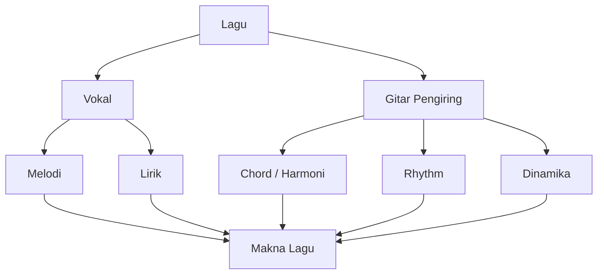
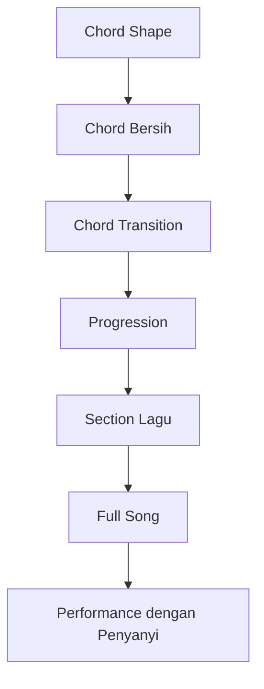
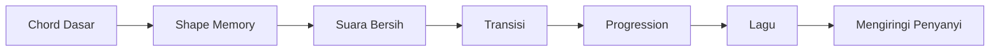

# learn-guitar-accompaniment-part-005.md

# Part 005 — Chord Dasar Paling Bernilai untuk Mengiringi Penyanyi

## Status Seri

Seri: **Belajar Guitar Accompaniment Berdasarkan The First 20 Hours**  
Bagian: **005 dari 035**  
Fokus: menguasai chord dasar paling bernilai untuk mulai mengiringi penyanyi, dengan pendekatan praktis, bertahap, dan bisa di-debug.

Bagian ini adalah salah satu fondasi utama seri. Jika bagian ini lemah, bagian rhythm, lagu, capo, dan performance akan ikut rapuh.

---

## Tujuan Pembelajaran Part Ini

Setelah menyelesaikan part ini, Anda harus bisa:

1. memahami chord sebagai kombinasi beberapa nada yang membentuk warna harmoni;
2. memahami kenapa chord dasar tertentu jauh lebih bernilai daripada chord lain untuk 20 jam pertama;
3. memainkan chord prioritas:
   - G;
   - C;
   - D;
   - Em;
   - Am;
   - A;
   - E;
   - Dm;
   - F simplified;
4. membedakan chord major dan minor secara rasa;
5. memahami open chord dan kenapa open chord penting untuk pengiring;
6. membaca shape chord dalam format ringkas seperti `x32010`;
7. menekan chord dengan posisi jari yang efisien;
8. melakukan debugging chord yang buzzing, muted, atau fals;
9. memahami chord bersih vs chord cukup aman untuk tampil;
10. membangun latihan chord harian yang terukur.

---

## Prinsip Kaufman yang Dipakai di Part Ini

Dalam *The First 20 Hours*, kita tidak mengejar kelengkapan pengetahuan. Kita mengejar **sub-skill paling berdampak**.

Untuk gitar pengiring, chord dasar adalah sub-skill bernilai tinggi karena:

- chord memberi kerangka harmoni untuk penyanyi;
- chord memungkinkan Anda mengiringi lagu nyata dengan cepat;
- banyak lagu populer bisa dimainkan dengan sedikit chord;
- chord dasar menjadi basis untuk capo dan transpose;
- chord dasar menjadi basis untuk rhythm, strumming, picking, dan arrangement.

Namun, jebakannya adalah pemula sering ingin menghafal terlalu banyak chord.

Target kita bukan:

> Hafal 100 chord.

Target kita:

> Bisa memainkan 8–9 chord yang paling sering dipakai, cukup bersih, cukup cepat berpindah, dan cukup stabil untuk mengiringi lagu nyata.

---

# 1. Apa Itu Chord?

Chord adalah beberapa nada yang dibunyikan bersama dan terdengar sebagai satu unit harmoni.

Dalam konteks pengiring penyanyi:

- penyanyi membawa melodi dan lirik;
- gitar membawa harmoni dan rhythm;
- chord memberi “lantai emosional” tempat melodi berdiri.



Jika chord salah, penyanyi bisa tetap bernyanyi, tetapi rasa lagu akan jatuh. Jika chord benar tetapi rhythm kacau, penyanyi juga bisa terganggu. Jadi chord bukan satu-satunya skill, tetapi chord adalah fondasi.

---

# 2. Major dan Minor: Rasa Dasar

Untuk fase awal, cukup pahami secara rasa.

## 2.1 Major

Chord major biasanya terasa:

- terang;
- terbuka;
- stabil;
- “happy” atau tegas;
- cocok untuk bagian optimis atau resolved.

Contoh chord major:

```text
G
C
D
A
E
```

## 2.2 Minor

Chord minor biasanya terasa:

- gelap;
- sedih;
- lembut;
- introspektif;
- belum selesai;
- cocok untuk bagian melankolis atau emosional.

Contoh chord minor:

```text
Em
Am
Dm
```

Penting: major tidak selalu berarti bahagia, minor tidak selalu berarti sedih. Konteks lirik, tempo, rhythm, dan dinamika tetap menentukan. Tetapi sebagai mental model awal, ini cukup.

---

# 3. Kenapa Tidak Belajar Semua Chord Dulu?

Karena gitar punya ribuan kemungkinan chord, voicing, inversion, dan posisi. Mencoba menguasai semuanya di awal adalah tutorial hell.

Untuk 20 jam pertama, chord harus dipilih berdasarkan **coverage terhadap lagu nyata** dan **kemudahan eksekusi**.

Kriteria chord prioritas:

1. sering muncul di lagu populer;
2. berada di open position;
3. mudah digabung dengan capo;
4. memungkinkan banyak progression umum;
5. relatif mudah dimainkan pemula;
6. mendukung lagu pop, ballad, folk, worship, dan akustik;
7. bisa dipakai untuk mengiringi penyanyi tanpa arrangement kompleks.

---

# 4. Chord Prioritas 20 Jam Pertama

Chord inti:

```text
G
C
D
Em
Am
```

Chord tambahan bernilai tinggi:

```text
A
E
Dm
F simplified
```

Dengan chord ini, Anda sudah bisa memainkan banyak progression umum.

Contoh:

```text
G - D - Em - C
C - G - Am - F
D - A - Bm - G   (dengan simplifikasi / capo nanti)
Am - F - C - G
E - A - B        (B nanti bisa dihindari dengan capo)
```

Pada fase ini, kita akan fokus pada shape yang paling praktis.

---

# 5. Open Chord

Open chord adalah chord yang memakai satu atau lebih open string.

Contoh:

```text
G  = 320003
C  = x32010
D  = xx0232
Em = 022000
Am = x02210
```

Kenapa open chord penting?

- terdengar penuh;
- resonan;
- cocok untuk acoustic accompaniment;
- mudah dimainkan dengan capo;
- lebih ringan daripada barre chord;
- sangat umum di lagu pop akustik.

Open chord memberi suara “gitar akustik” yang natural.

---

# 6. Cara Membaca Shape Ringkas

Format seperti ini:

```text
C = x32010
```

Dibaca dari senar 6 ke senar 1:

```text
Senar 6 = x  jangan dimainkan
Senar 5 = 3  tekan fret 3
Senar 4 = 2  tekan fret 2
Senar 3 = 0  open
Senar 2 = 1  tekan fret 1
Senar 1 = 0  open
```

Simbol:

```text
x = mute / jangan dibunyikan
0 = open string
1 = fret 1
2 = fret 2
3 = fret 3
```

Nomor jari:

```text
1 = telunjuk
2 = tengah
3 = manis
4 = kelingking
```

---

# 7. Prinsip Fisik Saat Menekan Chord

Sebelum chord per chord, pahami prinsip umum.

## 7.1 Tekan Dekat Fret

Tekan senar dekat fret logam, bukan di tengah-tengah ruang fret.

Jika terlalu jauh dari fret:

- suara buzzing;
- butuh tekanan lebih besar;
- jari cepat lelah.

## 7.2 Gunakan Ujung Jari

Jari harus cukup melengkung agar tidak mematikan senar lain.

Jika jari terlalu rebah:

- senar sebelah bisa ikut tertutup;
- open string tidak berbunyi;
- chord terdengar mati.

## 7.3 Tekanan Minimum Efektif

Jangan menekan sekuat mungkin. Tekan secukupnya sampai suara bersih.

Terlalu keras menyebabkan:

- tangan cepat lelah;
- transisi lambat;
- wrist tegang;
- intonasi bisa terdorong sedikit sharp.

## 7.4 Tangan Kiri Tidak Menahan Gitar

Gitar harus stabil oleh tubuh/strap, bukan oleh tangan kiri. Tangan kiri bertugas membentuk chord, bukan menopang gitar.

## 7.5 Petik Satu-Satu untuk Debugging

Jangan hanya strum semua senar. Untuk mengecek chord, petik senar satu-satu dari bass ke treble.

---

# 8. Chord G Major

## 8.1 Shape Umum

Versi dasar:

```text
G = 320003
```

Artinya:

```text
Senar 6: fret 3
Senar 5: fret 2
Senar 4: open
Senar 3: open
Senar 2: open
Senar 1: fret 3
```

Fingering umum:

```text
Senar 6 fret 3 = jari 2 atau 3
Senar 5 fret 2 = jari 1 atau 2
Senar 1 fret 3 = jari 3 atau 4
```

Ada beberapa variasi fingering.

Versi populer untuk transisi ke Cadd9/Dsus:

```text
G = 320033
```

Dengan:

```text
Senar 6 fret 3
Senar 5 fret 2
Senar 2 fret 3
Senar 1 fret 3
```

## 8.2 Untuk Pemula, Pilih Versi Mana?

Untuk seri ini, gunakan dua versi secara sadar:

### G dasar

```text
G = 320003
```

Bagus untuk memahami bentuk tradisional.

### G modern/acoustic

```text
G = 320033
```

Bagus untuk lagu pop akustik karena transisi ke Cadd9 dan Dsus sering lebih enak.

Namun jangan terlalu cepat pindah ke warna chord jika chord dasar belum stabil.

## 8.3 Root

Root G ada di:

```text
Senar 6 fret 3
```

G boleh strum semua senar.

## 8.4 Kesalahan Umum

- senar 5 mati karena jari terlalu rebah;
- senar 1 tidak jelas karena jari terlalu jauh dari fret;
- wrist terlalu patah;
- bentuk jari berubah setiap ulang;
- terlalu lama mencari posisi jari.

## 8.5 Debugging G

Checklist:

```text
[ ] Apakah senar 6 fret 3 bunyi bersih?
[ ] Apakah senar 5 fret 2 bunyi bersih?
[ ] Apakah senar 4, 3, 2 open tetap berbunyi?
[ ] Apakah senar 1 fret 3 bunyi bersih?
[ ] Apakah semua senar boleh di-strum? Ya.
```

---

# 9. Chord C Major

## 9.1 Shape

```text
C = x32010
```

Artinya:

```text
Senar 6: jangan dimainkan
Senar 5: fret 3
Senar 4: fret 2
Senar 3: open
Senar 2: fret 1
Senar 1: open
```

Fingering umum:

```text
Senar 5 fret 3 = jari 3
Senar 4 fret 2 = jari 2
Senar 2 fret 1 = jari 1
```

## 9.2 Root

Root C ada di:

```text
Senar 5 fret 3
```

Mulai strum dari senar 5.

## 9.3 Kenapa C Penting?

C adalah chord pusat di banyak lagu. C juga membentuk family penting:

```text
C - G - Am - F
C - F - G
Am - F - C - G
```

Walau F masih sulit, C tetap wajib.

## 9.4 Kesalahan Umum

- senar 1 mati karena jari telunjuk terlalu rebah;
- senar 3 mati karena jari tengah atau telunjuk menyentuhnya;
- senar 6 ikut berbunyi terlalu keras;
- jari manis terlalu jauh dari fret 3;
- tangan terlalu tegang.

## 9.5 Debugging C

Petik satu-satu:

```text
Senar 5 fret 3: harus bunyi C
Senar 4 fret 2: harus bunyi E
Senar 3 open: harus bunyi G
Senar 2 fret 1: harus bunyi C
Senar 1 open: harus bunyi E
```

Jika senar 1 mati, lengkungkan telunjuk.

Jika senar 3 mati, cek apakah jari lain menyentuhnya.

---

# 10. Chord D Major

## 10.1 Shape

```text
D = xx0232
```

Artinya:

```text
Senar 6: jangan dimainkan
Senar 5: jangan dimainkan
Senar 4: open
Senar 3: fret 2
Senar 2: fret 3
Senar 1: fret 2
```

Fingering umum:

```text
Senar 3 fret 2 = jari 1
Senar 2 fret 3 = jari 3
Senar 1 fret 2 = jari 2
```

## 10.2 Root

Root D ada di:

```text
Senar 4 open
```

Mulai strum dari senar 4.

## 10.3 Kenapa D Penting?

D muncul sangat sering dalam key G dan A.

Common progression:

```text
G - D - Em - C
D - A - Bm - G
G - C - D
```

## 10.4 Kesalahan Umum

- strum dari senar 6 sehingga chord terdengar kotor;
- senar 1 mati karena jari terlalu rebah;
- senar 2 buzzing karena jari manis terlalu jauh dari fret;
- bentuk segitiga jari terlalu sempit;
- jari saling menabrak.

## 10.5 Debugging D

Checklist:

```text
[ ] Senar 4 open berbunyi?
[ ] Senar 3 fret 2 bersih?
[ ] Senar 2 fret 3 bersih?
[ ] Senar 1 fret 2 bersih?
[ ] Senar 6 dan 5 tidak dominan?
```

Untuk pemula, jika sesekali senar 5 tersentuh pelan, tidak fatal. Tapi target akhirnya D mulai dari senar 4.

---

# 11. Chord E Minor

## 11.1 Shape

```text
Em = 022000
```

Artinya:

```text
Senar 6: open
Senar 5: fret 2
Senar 4: fret 2
Senar 3: open
Senar 2: open
Senar 1: open
```

Fingering umum:

```text
Senar 5 fret 2 = jari 2
Senar 4 fret 2 = jari 3
```

Atau:

```text
Senar 5 fret 2 = jari 1
Senar 4 fret 2 = jari 2
```

Untuk transisi tertentu, fingering bisa berubah.

## 11.2 Root

Root E ada di:

```text
Senar 6 open
```

Semua senar boleh dimainkan.

## 11.3 Kenapa Em Penting?

Em adalah chord minor paling mudah dan sangat sering muncul.

Common progression:

```text
G - D - Em - C
Em - C - G - D
C - G - D - Em
```

Em sering memberi rasa melankolis, introspektif, atau emotional lift.

## 11.4 Kesalahan Umum

- jari terlalu rebah mematikan senar 3;
- tekanan tidak rata;
- chord terdengar muddy karena strumming terlalu keras di senar bass;
- pindah dari/ke C terlalu lambat.

## 11.5 Debugging Em

Karena Em sederhana, gunakan untuk melatih suara bersih.

Petik semua senar:

```text
6 open
5 fret 2
4 fret 2
3 open
2 open
1 open
```

Semua harus berbunyi.

---

# 12. Chord A Minor

## 12.1 Shape

```text
Am = x02210
```

Artinya:

```text
Senar 6: jangan dimainkan
Senar 5: open
Senar 4: fret 2
Senar 3: fret 2
Senar 2: fret 1
Senar 1: open
```

Fingering umum:

```text
Senar 4 fret 2 = jari 2
Senar 3 fret 2 = jari 3
Senar 2 fret 1 = jari 1
```

## 12.2 Root

Root A ada di:

```text
Senar 5 open
```

Mulai strum dari senar 5.

## 12.3 Kenapa Am Penting?

Am sangat sering muncul di key C dan banyak lagu minor.

Common progression:

```text
C - G - Am - F
Am - F - C - G
Am - G - F - E
```

## 12.4 Kesalahan Umum

- senar 1 mati karena telunjuk terlalu rebah;
- senar 6 ikut berbunyi dominan;
- jari 2 dan 3 terlalu jauh dari fret;
- bentuk terlalu mirip E tapi string start salah.

## 12.5 Debugging Am

Petik dari senar 5:

```text
5 open
4 fret 2
3 fret 2
2 fret 1
1 open
```

Jika senar 1 mati, lengkungkan telunjuk.

---

# 13. Chord A Major

## 13.1 Shape

```text
A = x02220
```

Artinya:

```text
Senar 6: jangan dimainkan
Senar 5: open
Senar 4: fret 2
Senar 3: fret 2
Senar 2: fret 2
Senar 1: open
```

Fingering umum bisa beberapa versi:

### Versi 1-2-3

```text
Senar 4 fret 2 = jari 1
Senar 3 fret 2 = jari 2
Senar 2 fret 2 = jari 3
```

### Versi 2-3-4

```text
Senar 4 fret 2 = jari 2
Senar 3 fret 2 = jari 3
Senar 2 fret 2 = jari 4
```

### Mini barre

Telunjuk menekan beberapa senar di fret 2, tetapi ini bisa mematikan senar 1 open jika belum terampil.

## 13.2 Root

Root A ada di:

```text
Senar 5 open
```

## 13.3 Kenapa A Penting?

A muncul di banyak lagu dengan key D, A, E, atau saat capo digunakan.

Common progression:

```text
D - A - G
A - E - F#m - D
E - A - B
```

Beberapa chord seperti F#m dan B akan disederhanakan atau dihindari dulu lewat capo.

## 13.4 Kesalahan Umum

- tiga jari sulit muat dalam fret 2;
- senar 1 mati;
- senar 2 tidak bersih;
- jari terlalu jauh dari fret;
- wrist terlalu kaku.

## 13.5 Debugging A

Jika tiga jari sulit muat:

- geser jari sedikit diagonal;
- jangan semua jari harus sejajar sempurna;
- cari posisi yang membuat senar 2 paling bersih;
- gunakan fingering 2-1-3 jika lebih nyaman.

---

# 14. Chord E Major

## 14.1 Shape

```text
E = 022100
```

Artinya:

```text
Senar 6: open
Senar 5: fret 2
Senar 4: fret 2
Senar 3: fret 1
Senar 2: open
Senar 1: open
```

Fingering umum:

```text
Senar 5 fret 2 = jari 2
Senar 4 fret 2 = jari 3
Senar 3 fret 1 = jari 1
```

## 14.2 Root

Root E ada di:

```text
Senar 6 open
```

Semua senar boleh dimainkan.

## 14.3 Kenapa E Penting?

E adalah chord besar dan penuh. Banyak lagu rock, folk, blues, dan pop memakai E.

Common progression:

```text
E - A - B
E - B - C#m - A
Am - G - F - E
```

Walau B dan C#m belum prioritas awal, E tetap penting.

## 14.4 Kesalahan Umum

- senar 2 atau 1 mati karena jari terlalu rebah;
- jari 1 di fret 1 tidak bersih;
- bentuk E dan Em tertukar;
- strumming terlalu keras di bass sehingga vokal tertutup.

## 14.5 Debugging E

Bandingkan E dan Em:

```text
Em = 022000
E  = 022100
```

Perbedaannya hanya senar 3 fret 1.

Latihan:

```text
Em → E → Em → E
```

Dengarkan perubahan rasa minor ke major.

---

# 15. Chord D Minor

## 15.1 Shape

```text
Dm = xx0231
```

Artinya:

```text
Senar 6: jangan dimainkan
Senar 5: jangan dimainkan
Senar 4: open
Senar 3: fret 2
Senar 2: fret 3
Senar 1: fret 1
```

Fingering umum:

```text
Senar 3 fret 2 = jari 2
Senar 2 fret 3 = jari 3
Senar 1 fret 1 = jari 1
```

## 15.2 Root

Root D ada di:

```text
Senar 4 open
```

## 15.3 Kenapa Dm Penting?

Dm muncul di key C, F, Am, dan banyak lagu ballad.

Common progression:

```text
Dm - G - C
Am - Dm - G - C
F - G - Em - Am - Dm - G - C
```

## 15.4 Kesalahan Umum

- tertukar dengan D major;
- senar 1 fret 1 mati;
- jari 3 terlalu jauh dari fret;
- strum terlalu banyak senar bass.

## 15.5 Debugging Dm

Bandingkan D dan Dm:

```text
D  = xx0232
Dm = xx0231
```

Perbedaan utama:

```text
Senar 1 fret 2 pada D
Senar 1 fret 1 pada Dm
```

Dengarkan perubahan major ke minor.

---

# 16. F Simplified

F adalah chord yang sering membuat pemula frustasi.

Versi penuh:

```text
F = 133211
```

Ini barre chord dan tidak cocok menjadi bottleneck 20 jam pertama.

Kita gunakan versi simplified.

## 16.1 Fmaj7 Simplified

```text
Fmaj7 = x33210
```

Artinya:

```text
Senar 6: jangan dimainkan
Senar 5: fret 3
Senar 4: fret 3
Senar 3: fret 2
Senar 2: fret 1
Senar 1: open
```

Fingering:

```text
Senar 5 fret 3 = jari 3
Senar 4 fret 3 = jari 4
Senar 3 fret 2 = jari 2
Senar 2 fret 1 = jari 1
```

Ini terdengar lebih lembut dan cocok untuk banyak lagu pop.

## 16.2 F Small Shape

```text
F = xx3211
```

Artinya:

```text
Senar 6: jangan dimainkan
Senar 5: jangan dimainkan
Senar 4: fret 3
Senar 3: fret 2
Senar 2: fret 1
Senar 1: fret 1
```

Fingering bisa:

```text
Senar 4 fret 3 = jari 3
Senar 3 fret 2 = jari 2
Senar 2 fret 1 = jari 1
Senar 1 fret 1 = jari 1 mini-barre
```

Lebih sulit karena telunjuk harus menekan dua senar tipis.

## 16.3 Pilihan untuk 20 Jam Pertama

Default gunakan:

```text
Fmaj7 = x33210
```

Alasannya:

- lebih mudah;
- terdengar indah;
- cocok untuk ballad/pop;
- tidak memaksa barre penuh;
- cukup untuk banyak lagu dengan progression C-G-Am-F.

Namun ingat: Fmaj7 bukan selalu pengganti sempurna F major. Dalam banyak lagu pop, ia cukup aman. Dalam konteks tertentu, warnanya bisa terlalu lembut. Untuk fase ini, itu acceptable.

---

# 17. Chord Bersih vs Chord Cukup Aman untuk Tampil

Pemula sering menunggu semua chord 100% bersih sebelum memainkan lagu. Itu tidak efisien.

Kita bedakan:

## 17.1 Chord Ideal

Ciri:

- semua string target berbunyi;
- string `x` tidak berbunyi;
- tidak ada buzzing;
- tidak ada muted string tidak sengaja;
- suara stabil;
- bisa dimainkan dalam tempo.

## 17.2 Chord Latihan Valid

Ciri:

- mayoritas string penting berbunyi;
- root/bass jelas;
- tidak terlalu fals;
- masalah bisa diidentifikasi;
- tangan tidak sakit abnormal.

## 17.3 Chord Aman untuk Performance Sederhana

Ciri:

- root jelas;
- chord quality major/minor terdengar;
- rhythm tidak berhenti;
- buzzing kecil tidak mengganggu;
- open string penting tidak mati total;
- transisi tetap jalan.

Prinsip:

> Dalam accompaniment, chord yang sedikit tidak sempurna tetapi rhythm tetap hidup sering lebih aman daripada chord sempurna yang membuat Anda berhenti dua detik.

Namun jangan jadikan ini alasan untuk malas memperbaiki chord. Ini hanya prioritas performance.

---

# 18. Chord Family Minimum

Chord lebih mudah dipelajari sebagai keluarga.

## 18.1 Key G Family

Chord umum:

```text
G
C
D
Em
Am
```

Progression umum:

```text
G - D - Em - C
G - C - D
Em - C - G - D
C - G - D - Em
```

Key G sangat ramah gitar.

---

## 18.2 Key C Family

Chord umum:

```text
C
G
Am
F
Dm
Em
```

Progression umum:

```text
C - G - Am - F
Am - F - C - G
Dm - G - C
F - G - Em - Am
```

Key C sering muncul, tetapi F bisa menjadi bottleneck. Gunakan F simplified.

---

## 18.3 Key D Family

Chord umum:

```text
D
G
A
Bm
Em
```

Bm adalah barre chord, jadi untuk fase awal sering dihindari atau pakai capo/versi simplified nanti.

Progression umum:

```text
D - A - Bm - G
D - G - A
G - D - A
```

---

## 18.4 Key E Family

Chord umum:

```text
E
A
B
C#m
F#m
```

B, C#m, F#m cukup sulit untuk pemula. Key E sering lebih cocok nanti atau dengan capo/transpose.

---

# 19. Urutan Belajar Chord yang Disarankan

Jangan belajar semua sekaligus.

Urutan:

```text
Stage 1:
Em, G

Stage 2:
C, D

Stage 3:
Am

Stage 4:
A, E

Stage 5:
Dm, F simplified
```

Kenapa?

- Em mudah dan memberi rasa minor.
- G penting dan penuh.
- C dan D membentuk banyak lagu.
- Am sering muncul di progression pop.
- A dan E memperluas key.
- Dm dan F membuka banyak lagu key C/Am.

---

# 20. Latihan Chord Dasar

## 20.1 Latihan Shape Freeze

Tujuan: membangun bentuk chord di tangan.

Langkah:

1. Pilih satu chord, misalnya C.
2. Bentuk chord perlahan.
3. Tahan 5 detik.
4. Lepas tangan sepenuhnya.
5. Ulangi 10 kali.
6. Jangan strum dulu jika bentuk belum stabil.

Target:

> Tangan mulai mengingat bentuk chord.

---

## 20.2 Latihan Petik Satu-Satu

Tujuan: chord bersih.

Langkah:

1. Bentuk chord.
2. Petik senar dari bass ke treble.
3. Tandai senar yang mati/buzzing.
4. Koreksi jari.
5. Ulangi.

Contoh untuk C:

```text
Petik: 5 - 4 - 3 - 2 - 1
```

Jangan petik senar 6.

---

## 20.3 Latihan Strum Lambat

Tujuan: menggabungkan chord dan tangan kanan.

Langkah:

1. Bentuk chord.
2. Strum sekali ke bawah.
3. Dengarkan.
4. Diam.
5. Strum lagi.
6. Ulangi 10 kali.

Jangan buru-buru rhythm dulu.

---

## 20.4 Latihan Chord Recall

Tujuan: mengingat chord tanpa melihat diagram.

Langkah:

1. Lihat nama chord.
2. Jangan lihat diagram.
3. Bentuk chord.
4. Cek dengan diagram.
5. Koreksi.
6. Ulangi.

Ini seperti flashcard motorik.

---

# 21. Debugging Chord Umum

## 21.1 Buzzing

Gejala:

- suara bergetar kasar;
- tidak clear.

Penyebab umum:

- jari terlalu jauh dari fret;
- tekanan kurang;
- action gitar tinggi;
- senar tua;
- fret bermasalah;
- angle jari buruk.

Fix:

```text
[ ] Geser jari mendekati fret
[ ] Tambah tekanan sedikit
[ ] Lengkungkan jari
[ ] Cek setup gitar
```

---

## 21.2 Muted String Tidak Sengaja

Gejala:

- senar tidak berbunyi;
- suara “thud”;
- chord terdengar kosong.

Penyebab umum:

- jari menyentuh senar sebelah;
- jari terlalu rebah;
- telapak terlalu dekat fretboard;
- wrist kurang memberi ruang.

Fix:

```text
[ ] Gunakan ujung jari
[ ] Lengkungkan jari
[ ] Putar wrist sedikit
[ ] Petik satu-satu untuk identifikasi
```

---

## 21.3 Chord Terdengar Kotor

Gejala:

- chord tidak jelas;
- bass terlalu berat;
- terdengar muddy.

Penyebab umum:

- senar `x` ikut berbunyi;
- strumming terlalu keras di bass;
- gitar belum tune;
- chord salah;
- terlalu banyak open string tidak terkendali.

Fix:

```text
[ ] Cek tuning
[ ] Cek string start
[ ] Mulai strum dari root
[ ] Kurangi tenaga tangan kanan
```

---

## 21.4 Tangan Cepat Lelah

Penyebab umum:

- menekan terlalu keras;
- wrist terlalu patah;
- bahu tegang;
- gitar tidak stabil;
- action tinggi;
- latihan terlalu lama tanpa jeda.

Fix:

```text
[ ] Cari tekanan minimum efektif
[ ] Rilekskan bahu
[ ] Gunakan strap/posisi stabil
[ ] Latihan pendek tapi sering
[ ] Cek setup gitar jika ekstrem
```

---

# 22. Chord sebagai Dependency untuk Lagu

Chord bukan unit akhir. Chord adalah dependency untuk progression.



Jadi jangan terlalu lama berhenti di chord individual. Begitu chord cukup valid, segera latih transisi dan lagu.

---

# 23. Mini Progression Pertama

Gunakan progression ini sebagai latihan awal.

## 23.1 Em - C - G - D

```text
Em - C - G - D
```

Kenapa bagus?

- sangat umum;
- emotional;
- cocok untuk banyak lagu pop;
- melatih transisi mudah dan sedang.

## 23.2 G - D - Em - C

```text
G - D - Em - C
```

Ini salah satu progression pop paling umum.

## 23.3 C - G - Am - Fmaj7

```text
C - G - Am - Fmaj7
```

Ini membuka banyak lagu key C.

## 23.4 Am - Fmaj7 - C - G

```text
Am - Fmaj7 - C - G
```

Cocok untuk ballad minor-ish.

---

# 24. Latihan 45 Menit untuk Part Ini

## Block 1 — Warm-up Tuning dan Open String, 5 Menit

- Tune gitar.
- Petik senar 6 sampai 1.
- Sebutkan nama senar.

## Block 2 — Chord Shape, 10 Menit

Latih:

```text
Em
G
C
D
Am
```

Masing-masing:

- bentuk;
- tahan;
- lepas;
- ulangi.

## Block 3 — Petik Satu-Satu, 10 Menit

Pilih chord C, D, Am.

Petik string target satu-satu. Debug sampai cukup bersih.

## Block 4 — Strum Tunggal, 10 Menit

Strum satu kali per chord:

```text
G
C
D
Em
Am
```

Fokus suara.

## Block 5 — Mini Progression, 10 Menit

Mainkan:

```text
G - D - Em - C
```

Satu strum per chord. Tidak perlu tempo cepat.

---

# 25. Latihan Harian 15 Menit

Jika hanya punya 15 menit:

```text
2 menit  tuning
3 menit  chord recall
5 menit  petik satu-satu chord sulit
5 menit  mini progression satu strum per chord
```

Jangan habiskan 15 menit untuk menonton video.

---

# 26. Metrics untuk Chord

Gunakan metrik yang membantu, bukan yang membuat overthinking.

## 26.1 Chord Clean Rate

Ambil satu chord. Petik semua string target.

Contoh C punya 5 string target.

Jika 4 dari 5 berbunyi bersih:

```text
Clean rate = 80%
```

Target awal:

```text
70–80% cukup untuk lanjut transisi
90%+ bagus
```

## 26.2 Chord Recall Time

Waktu dari melihat nama chord sampai bentuk siap.

Target awal:

```text
< 5 detik
```

Target berikutnya:

```text
< 2 detik
```

Performance target:

```text
hampir otomatis
```

## 26.3 Pain Level

Skala 1–10.

```text
1–3 = normal
4–5 = perlu jeda dan cek teknik
6+  = hentikan, evaluasi
```

Jangan menganggap semua sakit adalah progress.

---

# 27. Anti-Pattern Belajar Chord

## 27.1 Menghafal Terlalu Banyak Chord

Lebih baik 5 chord bisa dipakai dalam lagu daripada 30 chord hanya tahu diagram.

## 27.2 Tidak Pernah Petik Satu-Satu

Strum semua senar bisa menyembunyikan bug. Petik satu-satu adalah unit test.

## 27.3 Menunggu Chord Sempurna Sebelum Transisi

Chord harus cukup benar, tetapi transisi juga harus dilatih sejak awal.

## 27.4 Menekan Terlalu Keras

Kekuatan bukan solusi utama. Efisiensi posisi lebih penting.

## 27.5 Mengabaikan Tangan Kanan

Chord benar tetapi strumming salah tetap tidak enak untuk penyanyi.

---

# 28. Acceptance Criteria Part 005

Anda boleh lanjut ke part 006 jika:

```text
[ ] Bisa memainkan Em = 022000 dengan semua senar berbunyi
[ ] Bisa memainkan G = 320003 atau 320033
[ ] Bisa memainkan C = x32010 dengan senar 1 open berbunyi
[ ] Bisa memainkan D = xx0232 dan tahu mulai dari senar 4
[ ] Bisa memainkan Am = x02210
[ ] Tahu A = x02220
[ ] Tahu E = 022100
[ ] Tahu Dm = xx0231
[ ] Tahu minimal satu bentuk F simplified
[ ] Bisa menjelaskan x, 0, dan angka fret
[ ] Bisa petik satu-satu untuk debugging chord
[ ] Bisa memainkan progression G-D-Em-C dengan satu strum per chord, walau lambat
```

Tidak harus sempurna. Tetapi harus cukup paham untuk mulai melatih transisi.

---

# 29. Ringkasan Mental Model

Chord dasar adalah vocabulary minimum untuk berbicara dalam bahasa lagu.

Namun, vocabulary saja tidak cukup. Anda harus bisa mengucapkannya dalam waktu yang benar.



Untuk 20 jam pertama, chord yang paling bernilai:

```text
G
C
D
Em
Am
A
E
Dm
F simplified
```

Kuasai chord ini bukan sebagai hafalan diagram, tetapi sebagai shape, suara, root, dan fungsi dalam lagu.

---

# 30. Output Part Ini

Output konkret:

1. Anda tahu chord prioritas.
2. Anda bisa membaca shape chord.
3. Anda bisa membentuk chord dasar.
4. Anda bisa debug chord buzzing/muted.
5. Anda tahu chord mana yang boleh strum semua senar dan mana yang tidak.
6. Anda bisa memainkan progression sederhana dengan satu strum per chord.

Part berikutnya:

> **Chord Transition: Skill Paling Penting yang Sering Diremehkan.**

