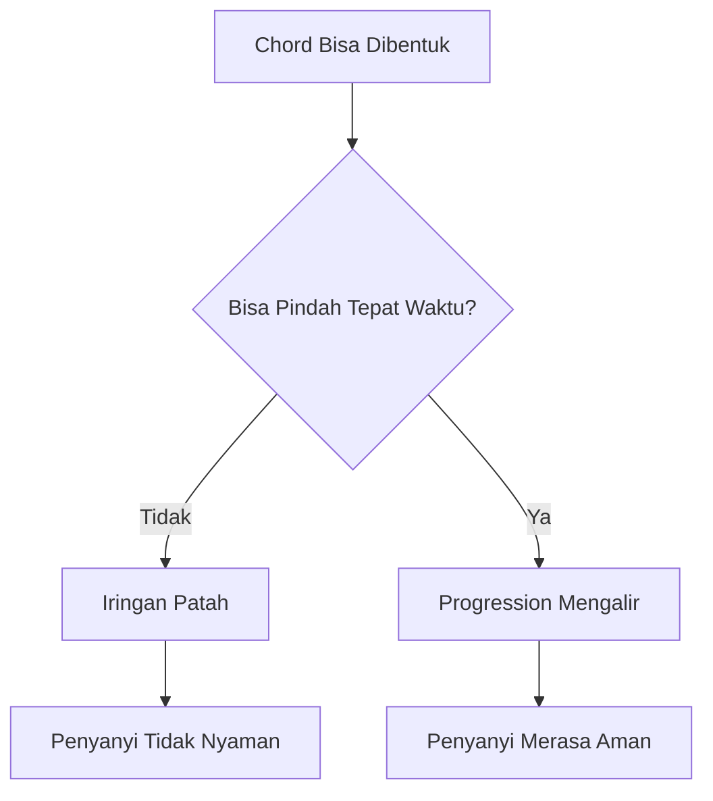
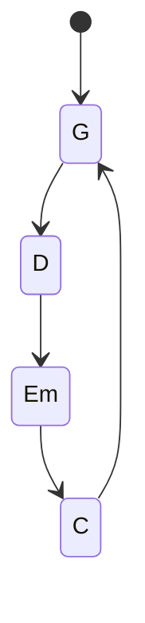
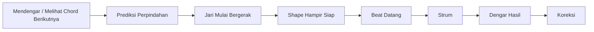
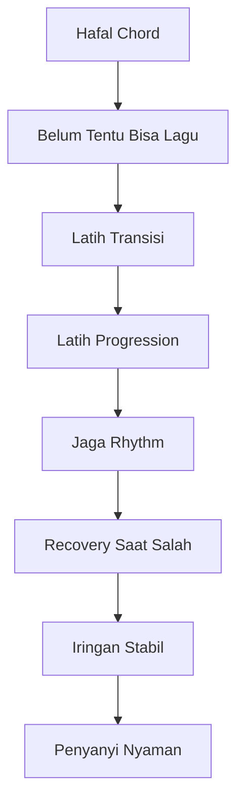

# learn-guitar-accompaniment-part-006.md

# Part 006 — Chord Transition: Skill Paling Penting yang Sering Diremehkan

## Status Seri

Seri: **Belajar Guitar Accompaniment Berdasarkan The First 20 Hours**  
Bagian: **006 dari 035**  
Fokus: melatih perpindahan chord agar iringan tidak berhenti, tidak patah, dan cukup stabil untuk mendukung penyanyi.

Jika chord adalah vocabulary, maka chord transition adalah kemampuan berbicara tanpa gagap.

---

## Tujuan Pembelajaran Part Ini

Setelah menyelesaikan part ini, Anda harus bisa:

1. memahami kenapa transisi chord sering lebih penting daripada jumlah chord yang dihafal;
2. memahami perbedaan chord individual dan chord progression;
3. melatih perpindahan chord dengan metode yang terukur;
4. memakai prinsip minimal movement;
5. memakai anchor finger saat memungkinkan;
6. memakai common finger saat memungkinkan;
7. melakukan transisi dasar:
   - G ↔ D;
   - G ↔ C;
   - C ↔ Am;
   - Em ↔ C;
   - D ↔ A;
   - Am ↔ F simplified;
   - C ↔ G ↔ Am ↔ F;
   - G ↔ D ↔ Em ↔ C;
8. mengukur chord changes per minute;
9. tetap menjaga rhythm walau chord belum sempurna;
10. melakukan recovery jika chord terlambat.

---

## Prinsip Kaufman yang Dipakai di Part Ini

Dalam rapid skill acquisition, latihan harus diarahkan ke sub-skill yang paling menentukan performa.

Untuk mengiringi penyanyi, salah satu bottleneck terbesar adalah:

> Bisa pindah chord tepat waktu tanpa menghentikan aliran lagu.

Banyak pemula bisa membentuk chord jika diberi waktu 5–10 detik. Tetapi lagu tidak memberi waktu sebanyak itu. Lagu terus berjalan.

Maka target kita:

```text
Bukan hanya:
Saya bisa memainkan C.

Tetapi:
Saya bisa pindah dari G ke C dalam tempo lagu tanpa menghentikan rhythm.
```

Inilah perubahan dari kemampuan statis ke kemampuan performatif.

---

# 1. Kenapa Chord Transition Sangat Penting?

Penyanyi membutuhkan lantai rhythm dan harmoni yang stabil. Jika gitar berhenti setiap pindah chord, penyanyi kehilangan support.

Masalah umum pemula:

```text
G... berhenti... cari C... strum...
C... berhenti... cari D... strum...
D... berhenti... cari G... strum...
```

Dari sudut pandang pemain, ini terasa seperti “sedikit jeda”. Dari sudut pandang penyanyi, ini terasa seperti lantai musik hilang.



---

# 2. Transisi adalah Skill Terpisah

Chord individual dan chord transition adalah dua skill berbeda.

## 2.1 Chord Individual

Pertanyaan:

```text
Bisakah saya membentuk chord C dengan bersih?
```

## 2.2 Chord Transition

Pertanyaan:

```text
Bisakah saya pindah dari G ke C tepat sebelum beat berikutnya?
```

Ini membutuhkan:

- memori bentuk chord;
- koordinasi jari;
- timing;
- prediksi chord berikutnya;
- tangan kanan yang tidak berhenti total;
- kemampuan menyederhanakan saat terlambat.

Transisi bukan efek samping otomatis dari hafal chord. Transisi harus dilatih langsung.

---

# 3. Model State Machine untuk Chord Progression

Chord progression bisa dilihat seperti state machine.

Contoh:

```text
G → D → Em → C → G
```



Setiap edge adalah transisi.

Pemula sering melatih node, bukan edge.

```text
Node = chord
Edge = perpindahan chord
```

Dalam performance, edge sama pentingnya dengan node.

---

# 4. Prinsip Minimal Movement

Transisi chord yang baik bukan memindahkan semua jari secara panik. Transisi yang baik mencari gerakan minimum.

Prinsip:

> Jari hanya bergerak sejauh yang diperlukan.

Contoh:

- dari C ke Am, banyak jari tetap di area yang sama;
- dari Em ke C, beberapa jari bisa mempertahankan relasi bentuk;
- dari G ke D, tangan berpindah tetapi ada pola target yang bisa dilatih;
- dari Am ke Fmaj7, bentuknya relatif dekat.

Minimal movement mengurangi:

- waktu transisi;
- ketegangan;
- error;
- rasa panik.

---

# 5. Anchor Finger

Anchor finger adalah jari yang tetap menempel atau menjadi referensi saat pindah chord.

Tidak semua transisi punya anchor jelas. Tetapi jika ada, gunakan.

Contoh sederhana:

## 5.1 C ke Am

```text
C  = x32010
Am = x02210
```

C dan Am sama-sama punya:

```text
Senar 2 fret 1 = jari 1
```

Telunjuk bisa tetap menjadi anchor.

Perubahan utama:

- jari 3 dari senar 5 fret 3 pindah/lepas;
- jari 2/jari 3 membentuk fret 2 pada senar 4 dan 3.

## 5.2 E ke Am

```text
E  = 022100
Am = x02210
```

Shape-nya mirip bergeser satu string lebih tinggi.

Ini disebut shape relationship. Tidak harus dipahami teoretis dalam, cukup rasakan bentuknya.

---

# 6. Common Finger dan Guide Finger

Ada beberapa konsep berguna:

## 6.1 Common Finger

Jari yang tetap menekan fret/string yang sama antara dua chord.

Contoh: C ke Am, jari telunjuk di senar 2 fret 1.

## 6.2 Guide Finger

Jari yang mungkin tidak tetap menekan string yang sama, tetapi bergerak sebagai referensi.

Contoh: jari tertentu meluncur atau menjadi “pemimpin” menuju shape berikutnya.

## 6.3 Air Change

Semua jari terangkat dan berpindah di udara.

Ini kadang perlu, tetapi jika semua transisi dilakukan sebagai air change tanpa strategi, perpindahan menjadi lambat.

---

# 7. Jangan Mengangkat Jari Terlalu Tinggi

Pemula sering mengangkat jari jauh dari fretboard saat pindah chord.

Akibat:

- jarak tempuh lebih jauh;
- waktu transisi lebih lama;
- akurasi turun;
- tangan terlihat panik.

Latihan:

1. Bentuk G.
2. Lepas jari hanya 1–2 cm dari senar.
3. Bentuk D.
4. Ulangi perlahan.

Prinsip:

> Jari bergerak rendah, santai, dan menuju target.

---

# 8. Chord Change per Minute

Metric sederhana:

```text
Berapa kali Anda bisa pindah antara dua chord dalam 60 detik?
```

Contoh:

```text
G → C → G → C ...
```

Satu change dihitung setiap chord baru berhasil dibentuk dan dibunyikan.

Target awal:

```text
20 changes/minute = mulai terkoneksi
30 changes/minute = cukup baik untuk lagu lambat
40 changes/minute = mulai aman
60 changes/minute = sangat nyaman untuk pemula
```

Namun jangan hanya mengejar angka. Cleanliness tetap perlu.

Gunakan metrik ini untuk melihat progress, bukan untuk menghukum diri.

---

# 9. Metronome vs Timer

Ada dua alat berbeda:

## 9.1 Timer

Untuk membatasi durasi latihan.

Contoh:

```text
Latihan G-C selama 3 menit.
```

## 9.2 Metronome

Untuk menjaga tempo.

Contoh:

```text
Pindah chord setiap 4 beat pada 60 BPM.
```

Gunakan keduanya:

```text
Timer 5 menit
Metronome 60 BPM
Fokus transisi C-G
```

---

# 10. Latihan 1 Menit Per Pasangan Chord

Ini latihan paling penting di part ini.

Format:

```text
Pasangan: G ↔ C
Durasi: 1 menit
Aturan:
- bentuk G
- strum sekali
- pindah ke C
- strum sekali
- ulangi
- hitung perubahan chord yang berhasil
```

Catat hasil:

```text
Tanggal:
Pair:
Changes per minute:
Catatan bug:
```

Contoh log:

```text
2026-06-25
G-C
24 changes/minute
Bug: C sering mati di senar 1, G lambat karena jari 3 terlambat.
```

Ini adalah observability.

---

# 11. Pair Prioritas

Jangan melatih semua kombinasi chord. Latih pair yang sering muncul di lagu.

## 11.1 G ↔ D

Dipakai dalam banyak lagu key G.

```text
G = 320003 / 320033
D = xx0232
```

Bug umum:

- dari G ke D, jari panik;
- D tidak bersih;
- strum D terlalu banyak senar;
- senar 1 D mati.

Latihan:

```text
G  - D
D  - G
```

Target awal:

```text
30 changes/minute
```

---

## 11.2 G ↔ C

```text
G = 320003 / 320033
C = x32010
```

Bug umum:

- C lambat karena butuh tiga jari;
- senar 1 C mati;
- senar 6 ikut berbunyi pada C;
- G dan C memakai fingering yang tidak konsisten.

Alternatif acoustic modern:

```text
G     = 320033
Cadd9 = x32033
```

Ini lebih mudah, tetapi untuk foundation tetap latih C major dasar juga.

---

## 11.3 C ↔ Am

```text
C  = x32010
Am = x02210
```

Ini transisi sangat penting dan relatif ramah karena telunjuk bisa menjadi anchor.

Bug umum:

- telunjuk ikut terangkat padahal bisa tetap;
- Am senar 1 mati;
- jari 2 dan 3 bingung posisi.

Latihan fokus:

> Pertahankan jari 1 di senar 2 fret 1.

---

## 11.4 Em ↔ C

```text
Em = 022000
C  = x32010
```

Bug umum:

- C lambat;
- jari dari Em terangkat terlalu tinggi;
- senar 1 C mati;
- bass C tidak jelas.

Latihan:

```text
Em - C - Em - C
```

Ini sangat sering muncul dalam progression pop.

---

## 11.5 D ↔ A

```text
D = xx0232
A = x02220
```

Dipakai dalam key D/A.

Bug umum:

- A sulit karena tiga jari di fret 2;
- D ke A membuat jari terlalu jauh;
- D strum dari senar 6;
- A senar 1 mati.

Target:

> Bukan cepat dulu. Pastikan shape A cukup stabil.

---

## 11.6 Am ↔ Fmaj7

```text
Am    = x02210
Fmaj7 = x33210
```

Ini penting untuk progression:

```text
Am - F - C - G
C - G - Am - F
```

Bug umum:

- Fmaj7 sulit karena jari 3 dan 4;
- senar 1 open mati;
- tangan terlalu tegang;
- transisi dari Fmaj7 ke C lambat.

Latihan:

```text
Am - Fmaj7 - Am - Fmaj7
```

---

# 12. Progression Transition

Setelah pair, latih progression.

## 12.1 G - D - Em - C

Ini progression wajib.

```text
G | D | Em | C
```

Latihan level 1:

```text
Satu strum per chord
Tanpa metronome
Fokus urutan
```

Latihan level 2:

```text
Satu strum per chord
Metronome 60 BPM
Ganti chord setiap 4 beat
```

Latihan level 3:

```text
Downstroke setiap beat
Ganti chord setiap 4 beat
```

Latihan level 4:

```text
Strumming pattern sederhana
```

Jangan langsung level 4.

---

## 12.2 C - G - Am - Fmaj7

```text
C | G | Am | Fmaj7
```

Ini progression penting untuk banyak lagu pop.

Bug umum:

- C ke G lambat;
- G ke Am panik;
- Fmaj7 lambat;
- terlalu banyak berhenti sebelum F.

Solusi:

- latih pair C-G;
- latih pair G-Am;
- latih pair Am-Fmaj7;
- baru gabungkan.

---

## 12.3 Em - C - G - D

```text
Em | C | G | D
```

Ini cocok untuk lagu emosional/ballad.

Latihan:

- satu strum per chord;
- rasakan perubahan minor ke major;
- jaga agar D tidak terlalu kotor.

---

# 13. Transisi Tanpa Menghentikan Rhythm

Ini prinsip penting:

> Tangan kanan harus menjadi clock.

Saat chord belum sempurna, pemula cenderung menghentikan tangan kanan. Akibatnya lagu patah.

Lebih baik:

- chord sedikit telat;
- tangan kanan tetap bergerak;
- rhythm tetap terasa.

Latihan:

1. Pilih progression G-D-Em-C.
2. Gunakan downstroke setiap beat.
3. Jika chord belum siap di beat 1, tetap gerakkan tangan kanan.
4. Masuk chord begitu siap.
5. Jangan berhenti total.

Ini melatih recovery.

---

# 14. Ghost Movement

Saat strumming nanti, tangan kanan sering tetap bergerak walau tidak selalu mengenai senar.

Ini disebut ghost strum atau ghost movement.

Untuk transisi chord, ghost movement membantu:

- menjaga clock internal;
- mengurangi panic pause;
- membuat rhythm tetap hidup;
- memberi waktu tangan kiri berpindah.

Latihan awal:

```text
Hitung: 1 2 3 4
Strum hanya di 1
Tangan tetap bergerak di 2 3 4
Ganti chord sebelum 1 berikutnya
```

---

# 15. Slow is Smooth, Smooth is Fast

Jangan melatih transisi dalam mode panik.

Jika transisi cepat tapi kacau, Anda sedang melatih kekacauan.

Gunakan prinsip:

1. pelan;
2. bersih;
3. konsisten;
4. baru percepat.

Dalam konteks motor learning, tubuh perlu jalur gerak yang benar. Jika Anda mengulang gerakan salah 100 kali, Anda memperkuat bug.

---

# 16. Micro-Transition Practice

Alih-alih memainkan seluruh chord, latih gerakan jari yang sulit.

Contoh: C ke G.

Masalah mungkin bukan seluruh chord, tetapi jari manis dan tengah yang lambat menuju G.

Latihan:

1. Bentuk C.
2. Pindahkan hanya jari menuju G tanpa strum.
3. Kembali ke C.
4. Ulangi 20 kali pelan.
5. Baru strum.

Contoh lain: Am ke Fmaj7.

1. Bentuk Am.
2. Pertahankan telunjuk jika memungkinkan.
3. Pindahkan jari 3 dan 4 ke fret 3.
4. Ulangi perlahan.

---

# 17. Chord Transition sebagai Pipeline



Pemula sering mulai bergerak setelah beat datang. Itu terlambat.

Pemain pengiring mulai mempersiapkan chord berikutnya sebelum waktunya.

---

# 18. Anticipation: Berpindah Sebelum Terlambat

Dalam lagu, Anda biasanya tahu chord berikutnya.

Contoh:

```text
G | D | Em | C
```

Saat sedang memainkan G, Anda sudah tahu D akan datang. Jadi mental Anda harus mempersiapkan D.

Latihan:

- hitung 1 2 3 4;
- di beat 4, pikiran sudah menyiapkan chord berikutnya;
- setelah strum terakhir, tangan kiri mulai pindah;
- beat 1 berikutnya chord baru siap.

---

# 19. Last-Moment Simplification

Jika chord belum siap, jangan freeze.

Strategi:

## 19.1 Mainkan Bass Note Dulu

Jika chord C belum lengkap, minimal dapatkan root C di senar 5 fret 3.

## 19.2 Mainkan Partial Chord

Jika D belum lengkap, mainkan 2–3 senar atas yang sudah siap.

## 19.3 Mute Strum

Jika benar-benar telat, lakukan muted strum sambil pindah, lalu masuk chord.

## 19.4 Jangan Berhenti Total

Berhenti total lebih terdengar daripada chord partial.

Prinsip:

> Recovery yang musikal lebih penting daripada panik mencari kesempurnaan.

---

# 20. Latihan dengan Metronome

## Level 1 — Ganti Setiap 4 Beat

Metronome 60 BPM.

```text
G:  1 2 3 4
D:  1 2 3 4
Em: 1 2 3 4
C:  1 2 3 4
```

Strum hanya di beat 1.

Tujuan:

- chord siap di beat 1;
- transisi punya 3 beat waktu kosong.

## Level 2 — Strum Setiap Beat

```text
G:  down down down down
D:  down down down down
```

Tujuan:

- tangan kanan menjaga clock;
- tangan kiri pindah tanpa menghentikan tangan kanan.

## Level 3 — Ganti Setiap 2 Beat

```text
G:  1 2
D:  3 4
Em: 1 2
C:  3 4
```

Ini lebih sulit. Jangan buru-buru.

---

# 21. Latihan Tanpa Metronome

Metronome penting, tetapi jangan hanya bisa bermain dengan metronome.

Latihan tanpa metronome:

1. hitung keras dengan suara;
2. mainkan progression;
3. rekam;
4. dengarkan apakah tempo lari;
5. bandingkan dengan metronome setelahnya.

Banyak orang merasa stabil saat bermain, tetapi recording membuktikan sebaliknya.

---

# 22. Recording untuk Transition Debugging

Rekam 1 menit progression.

Dengarkan:

```text
[ ] Apakah ada pause sebelum chord baru?
[ ] Apakah beat 1 hilang?
[ ] Apakah strumming berubah saat chord sulit?
[ ] Apakah chord F membuat tempo turun?
[ ] Apakah D terdengar kotor?
[ ] Apakah tangan kanan berhenti?
```

Jangan menilai “bagus/jelek” secara emosional. Cari bug spesifik.

---

# 23. Common Transition Bugs

## 23.1 Pause Sebelum Chord Sulit

Gejala:

```text
G... D... Em... pause... C
```

Penyebab:

- chord berikutnya belum otomatis;
- jari terlalu tinggi;
- tidak ada anticipation;
- takut salah.

Fix:

- latihan pair chord;
- gunakan metronome lambat;
- tetap gerakkan tangan kanan;
- gunakan partial chord jika telat.

---

## 23.2 Chord Baru Masuk Setelah Beat 1

Gejala:

- beat 1 kosong;
- chord baru baru terdengar di beat 2.

Fix:

- mulai pindah setelah beat 4 chord sebelumnya;
- jangan menunggu sampai beat 1;
- latih slow tempo.

---

## 23.3 Tangan Kanan Ikut Panik

Gejala:

- strumming berubah saat chord sulit;
- tempo turun;
- volume berubah drastis;
- pick nyangkut.

Fix:

- latihan mute strum tanpa chord;
- tangan kanan terus bergerak;
- kurangi kompleksitas strumming.

---

## 23.4 Semua Jari Terangkat Tinggi

Fix:

- latihan low-lift;
- pindah chord tanpa strum;
- lihat tangan kiri di cermin/video.

---

## 23.5 Fingering Tidak Konsisten

Hari ini G pakai jari A, besok pakai jari B, lalu transisi kacau.

Fix:

- pilih fingering default;
- ubah hanya jika ada alasan transisi;
- catat fingering pada chord sheet latihan.

---

# 24. One-Minute Change Drill Detail

Gunakan format berikut untuk setiap pair.

```text
Pair:
Date:
Attempt:
Duration: 60 seconds
Count:
Cleanliness:
Bug:
Next focus:
```

Contoh:

```text
Pair: C-Am
Date: 2026-06-25
Attempt: 1
Duration: 60 seconds
Count: 36
Cleanliness: 75%
Bug: Am senar 1 sering mati
Next focus: jari telunjuk lebih melengkung
```

Setelah 3 hari, Anda akan melihat pair mana yang bottleneck.

---

# 25. Recommended Pair Drill Schedule

## Hari A

```text
G-D
G-C
C-Am
```

## Hari B

```text
Em-C
D-A
Am-Fmaj7
```

## Hari C

```text
G-D-Em-C
C-G-Am-Fmaj7
Em-C-G-D
```

Ulang siklus.

Durasi minimum:

```text
1 menit per pair
3 menit per progression
```

Jangan remehkan latihan pendek. Konsistensi lebih penting.

---

# 26. Transition Difficulty Ranking

Perkiraan untuk pemula:

## Mudah

```text
Em ↔ E
C ↔ Am
Em ↔ G
```

## Sedang

```text
G ↔ D
Em ↔ C
Am ↔ Dm
D ↔ A
```

## Lebih Sulit

```text
G ↔ C
C ↔ Fmaj7
Am ↔ Fmaj7
D ↔ Fmaj7
```

## Hindari dulu sebagai bottleneck utama

```text
F barre
Bm barre
B barre
F#m barre
C#m barre
```

Bukan berarti tidak akan dipelajari. Hanya bukan prioritas 20 jam pertama.

---

# 27. Transisi dengan Capo

Capo tidak mengubah shape yang Anda latih. Jadi transisi tetap berguna.

Contoh:

```text
Tanpa capo:
G - D - Em - C

Capo fret 2:
Shape tetap G - D - Em - C
Sound menjadi A - E - F#m - D
```

Artinya, dengan menguasai satu set shape dan transisi, Anda bisa mengiringi lebih banyak key.

Ini alasan chord dasar dan transisinya sangat bernilai.

---

# 28. Latihan 45 Menit untuk Part Ini

## Block 1 — Tuning dan Warm-up, 5 Menit

- Tune gitar.
- Mainkan Em, G, C, D, Am satu kali.
- Jangan buru-buru.

## Block 2 — Pair Drill, 12 Menit

Latih 6 pair, masing-masing 2 menit:

```text
G-D
G-C
C-Am
Em-C
D-A
Am-Fmaj7
```

Format:

- 1 menit counting changes;
- 1 menit slow clean correction.

## Block 3 — Progression Drill, 12 Menit

Latih:

```text
G-D-Em-C
C-G-Am-Fmaj7
Em-C-G-D
```

Masing-masing 4 menit.

Gunakan satu strum per chord.

## Block 4 — Metronome Drill, 8 Menit

Metronome 60 BPM.

```text
G  1 2 3 4
D  1 2 3 4
Em 1 2 3 4
C  1 2 3 4
```

Strum di beat 1.

## Block 5 — Recording dan Review, 8 Menit

Rekam 1 progression selama 1 menit.

Dengarkan dan catat:

```text
Bug terbesar:
Pair paling lambat:
Chord paling kotor:
Apakah rhythm berhenti?
Next practice focus:
```

---

# 29. Latihan 15 Menit Jika Waktu Pendek

```text
2 menit  tuning
5 menit  one-minute changes: G-D, G-C, C-Am, Em-C, Am-F
5 menit  progression G-D-Em-C
3 menit  recording + catatan bug
```

Jika hanya punya 5 menit:

```text
1 menit tuning
1 menit G-D
1 menit G-C
1 menit C-Am
1 menit G-D-Em-C satu strum
```

Lebih baik 5 menit aktif daripada 30 menit menonton tutorial.

---

# 30. Chord Transition dan Penyanyi

Saat mengiringi penyanyi, transisi chord tidak berdiri sendiri. Ia harus mendukung phrasing vokal.

Masalah jika transisi buruk:

- penyanyi ragu masuk;
- napas vokal terganggu;
- chorus kehilangan energi;
- ending terasa tidak yakin;
- lagu terasa amatir.

Transisi yang baik memberi rasa:

- aman;
- mengalir;
- predictable;
- bernapas;
- musikal.

Penyanyi tidak butuh Anda memainkan chord paling rumit. Penyanyi butuh Anda tidak membuat lantai musik hilang.

---

# 31. Cara Mengetahui Transisi Sudah Cukup untuk Lagu

Transisi cukup jika:

```text
[ ] Anda tidak berhenti total saat pindah chord
[ ] Chord baru masuk dekat beat yang benar
[ ] Root chord terdengar
[ ] Rhythm tangan kanan tetap terasa
[ ] Kesalahan kecil tidak membuat Anda panik
[ ] Anda bisa menyelesaikan progression 1 menit tanpa stop
```

Tidak harus sempurna.

---

# 32. Performance Threshold

Untuk lagu lambat, target minimal:

```text
30–40 changes/minute pada pair utama
```

Untuk lagu sedang:

```text
40–60 changes/minute
```

Namun ini hanya indikator. Lagu nyata bergantung pada:

- tempo;
- berapa beat per chord;
- strumming pattern;
- chord difficulty;
- struktur lagu;
- tekanan panggung.

Jika progression lagu mengganti chord setiap 1 bar dalam tempo lambat, 30 changes/minute mungkin cukup. Jika chord berubah cepat, butuh lebih.

---

# 33. Jangan Menjadikan Metric sebagai Berhala

Chord changes per minute berguna, tetapi bukan tujuan akhir.

Tujuan akhir:

> Mengiringi penyanyi secara stabil dan musikal.

Metrik bisa menipu jika:

- change cepat tapi chord kotor;
- tangan kanan berhenti;
- tempo tidak stabil;
- Anda hanya jago satu pair tapi tidak bisa lagu;
- Anda tegang berlebihan.

Gunakan metrik sebagai dashboard, bukan sebagai definisi musik.

---

# 34. Anti-Pattern Transisi Chord

## 34.1 Berhenti untuk Membentuk Chord Sempurna

Ini merusak lagu. Latih recovery dan partial chord.

## 34.2 Mengulang Lagu dari Awal Setiap Salah

Ini membuat Anda jago intro tetapi lemah recovery.

Solusi:

- lanjutkan sampai akhir;
- catat bug;
- ulang bagian bermasalah.

## 34.3 Terlalu Cepat Pakai Strumming Pattern Kompleks

Jika transisi belum stabil, pattern kompleks memperbesar error.

Solusi:

- satu strum per chord;
- downstroke per beat;
- baru pattern.

## 34.4 Tidak Menghitung Beat

Tanpa hitungan, transisi tidak punya deadline.

Solusi:

- hitung keras;
- pakai metronome;
- rekam.

## 34.5 Mengabaikan Fingering

Fingering yang berubah-ubah membuat motor memory lambat.

Solusi:

- pilih default;
- catat pengecualian;
- latih konsisten.

---

# 35. Debugging Matrix

| Symptom | Kemungkinan Penyebab | Fix |
|---|---|---|
| Pause sebelum chord | chord belum otomatis, takut salah | pair drill, tempo lambat, partial chord |
| Chord baru telat | pindah dimulai terlalu lambat | mulai persiapan di beat 4 |
| D terdengar kotor | strum dari senar 6/5 | mulai dari senar 4 |
| C senar 1 mati | telunjuk rebah | lengkungkan jari |
| Fmaj7 selalu lambat | jari 3/4 belum terbiasa | micro-transition Am-Fmaj7 |
| Tempo turun di chord sulit | tangan kanan ikut panik | mute strum, metronome |
| Pick nyangkut saat pindah | tangan kanan tegang | kurangi grip, angle pick |
| Semua chord kacau | gitar belum tune / tubuh lelah | tune ulang, istirahat |

---

# 36. Mini Project Part Ini

Pilih satu progression:

```text
G - D - Em - C
```

Target mini project:

1. mainkan satu strum per chord;
2. ganti chord setiap 4 beat;
3. gunakan metronome 60 BPM;
4. rekam 1 menit;
5. jangan berhenti walau salah;
6. catat bug terbesar.

Format catatan:

```text
Date:
Tempo:
Progression:
Stop count:
Worst transition:
Chord cleanliness:
Right hand stability:
Next fix:
```

Contoh:

```text
Date: 2026-06-25
Tempo: 60 BPM
Progression: G-D-Em-C
Stop count: 2
Worst transition: Em-C
Chord cleanliness: C senar 1 sering mati
Right hand stability: berhenti sebelum C
Next fix: pair drill Em-C 5 menit
```

---

# 37. Acceptance Criteria Part 006

Anda boleh lanjut ke part 007 jika:

```text
[ ] Bisa menjelaskan kenapa transisi chord adalah skill terpisah
[ ] Bisa melakukan one-minute change drill
[ ] Punya catatan changes/minute untuk minimal 3 pair chord
[ ] Bisa memainkan G-D-Em-C satu strum per chord tanpa berhenti total
[ ] Bisa memainkan C-G-Am-Fmaj7 secara lambat
[ ] Bisa menggunakan metronome 60 BPM untuk ganti chord setiap 4 beat
[ ] Bisa menjaga tangan kanan tetap bergerak walau chord kiri telat
[ ] Tahu strategi partial chord / bass note / mute strum saat terlambat
[ ] Tahu pair chord yang paling lemah untuk latihan berikutnya
```

Jika transisi masih lambat, itu normal. Yang penting Anda sudah tahu cara melatih dan mengukurnya.

---

# 38. Ringkasan Mental Model

Chord adalah state. Transisi adalah edge. Lagu hidup di edge.



Untuk pengiring, transisi yang cukup baik memiliki karakter:

- tepat waktu;
- tidak panik;
- tidak menghentikan rhythm;
- root chord tetap terdengar;
- bisa recover saat salah;
- cukup konsisten dalam lagu.

---

# 39. Output Part Ini

Output konkret:

1. Anda tahu pair chord prioritas.
2. Anda bisa melatih transisi dengan timer.
3. Anda bisa mengukur changes per minute.
4. Anda bisa memainkan progression utama secara lambat.
5. Anda mulai menjaga tangan kanan sebagai clock.
6. Anda memahami recovery saat chord terlambat.

Part berikutnya akan masuk ke inti waktu dan groove:

> **Rhythm sebagai Clock: Gitar Pengiring adalah Mesin Waktu Emosional.**

