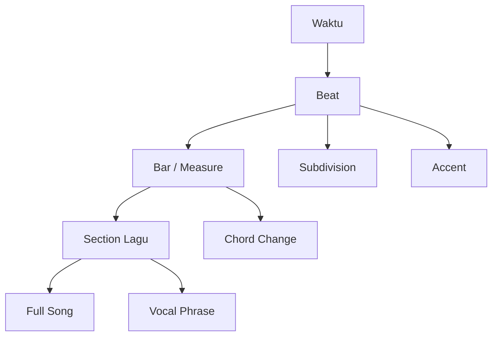
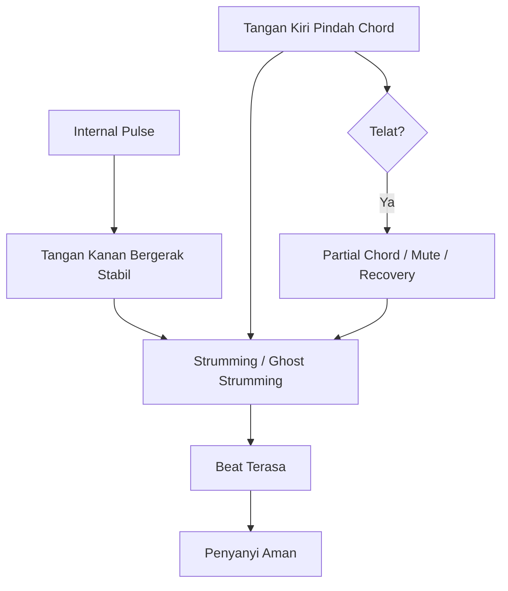
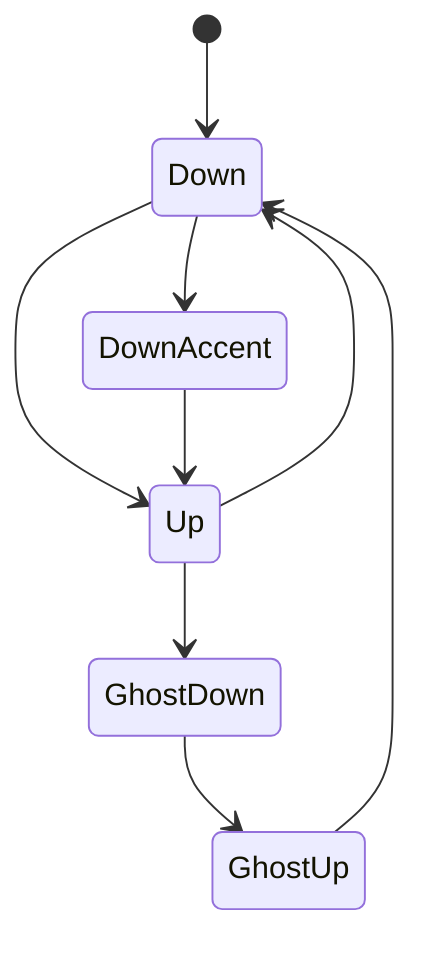
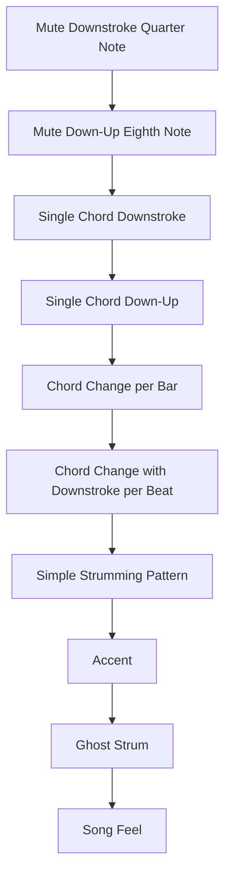
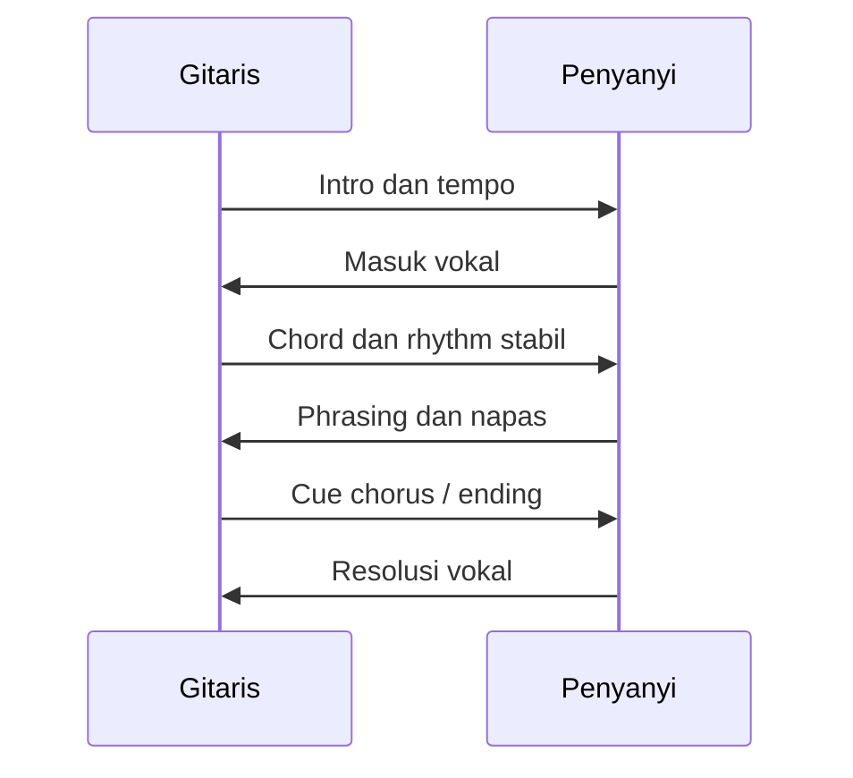
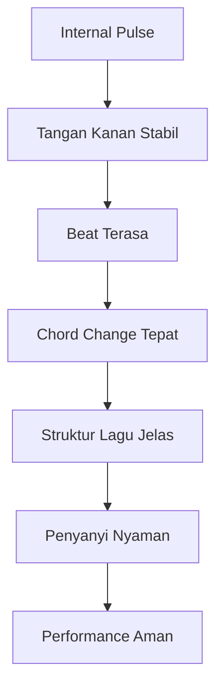

# learn-guitar-accompaniment-part-007.md

# Part 007 — Rhythm sebagai Clock: Gitar Pengiring adalah Mesin Waktu Emosional

## Status Seri

Seri: **Belajar Guitar Accompaniment Berdasarkan The First 20 Hours**  
Bagian: **007 dari 035**  
Fokus: memahami rhythm sebagai fondasi waktu, stabilitas, dan rasa aman bagi penyanyi.

Di part sebelumnya, kita membahas chord dan transisi chord. Sekarang kita masuk ke aspek yang sering lebih menentukan apakah iringan terasa “enak” atau “berantakan”: **rhythm**.

---

## Tujuan Pembelajaran Part Ini

Setelah menyelesaikan part ini, Anda harus bisa:

1. memahami beat, bar, tempo, meter, downbeat, backbeat, dan subdivision;
2. memahami kenapa rhythm lebih penting daripada chord yang 100% sempurna;
3. menjaga pulse sederhana dalam 4/4;
4. menghitung `1 2 3 4` dan `1 & 2 & 3 & 4 &`;
5. memahami tangan kanan sebagai clock;
6. melatih strumming tanpa chord terlebih dahulu;
7. memakai metronome tanpa merasa “dihakimi”;
8. mengenali tempo drift;
9. menjaga rhythm walau tangan kiri terlambat;
10. menghubungkan rhythm dengan kenyamanan penyanyi.

---

## Prinsip Kaufman yang Dipakai di Part Ini

Dalam pendekatan Kaufman, kita perlu memecah skill menjadi bagian kecil dan melatih bagian yang paling berdampak.

Untuk gitar pengiring, rhythm adalah sub-skill berimpact sangat tinggi karena:

- penyanyi bergantung pada timing;
- audience merasakan groove sebelum mereka menganalisis chord;
- chord yang sedikit kotor masih bisa diterima jika rhythm stabil;
- rhythm yang patah langsung terasa mengganggu;
- transisi chord lebih mudah jika tangan kanan punya clock stabil;
- struktur lagu lebih mudah diikuti jika bar dan beat terasa jelas.

Target 20 jam bukan menjadi drummer atau ahli teori rhythm. Targetnya:

> Bisa menjaga waktu cukup stabil sehingga penyanyi merasa aman bernyanyi di atas iringan gitar.

---

# 1. Rhythm adalah Sistem Waktu

Dalam lagu, waktu tidak berjalan sebagai durasi kosong. Waktu diorganisasi menjadi beat, bar, dan pattern.



Gitar pengiring tidak hanya menghasilkan chord. Gitar pengiring membantu mendefinisikan:

- di mana beat utama;
- kapan chord berubah;
- kapan penyanyi masuk;
- kapan section naik;
- kapan chorus terasa lebih besar;
- kapan lagu harus tenang.

---

# 2. Beat

Beat adalah denyut dasar musik.

Saat Anda mengetuk kaki mengikuti lagu, biasanya Anda sedang merasakan beat.

Contoh hitungan sederhana:

```text
1 2 3 4
1 2 3 4
1 2 3 4
```

Setiap angka adalah beat.

Dalam accompaniment, beat adalah “clock tick”.

Jika beat Anda tidak stabil, penyanyi akan merasa seperti berdiri di lantai yang bergerak.

---

# 3. Tempo

Tempo adalah kecepatan beat.

Biasanya diukur dalam BPM: beats per minute.

Contoh:

```text
60 BPM  = 60 beat per menit, kira-kira 1 beat per detik
80 BPM  = ballad / medium slow
100 BPM = pop medium
120 BPM = pop lebih cepat
```

Untuk latihan awal, gunakan tempo lambat:

```text
50–70 BPM
```

Kenapa lambat?

- memberi waktu tangan kiri pindah chord;
- membuat bug terdengar jelas;
- mengurangi panik;
- membangun kontrol.

Jangan salah: bermain lambat dengan stabil itu sulit. Lambat bukan berarti mudah.

---

# 4. Bar / Measure

Bar adalah kelompok beat.

Dalam 4/4, satu bar berisi 4 beat:

```text
| 1 2 3 4 | 1 2 3 4 | 1 2 3 4 |
```

Chord sering berganti per bar.

Contoh:

```text
| G       | D       | Em      | C       |
| 1 2 3 4 | 1 2 3 4 | 1 2 3 4 | 1 2 3 4 |
```

Artinya:

- mainkan G selama 4 beat;
- lalu D selama 4 beat;
- lalu Em selama 4 beat;
- lalu C selama 4 beat.

Ini adalah unit sangat penting untuk mengiringi lagu.

---

# 5. Meter / Time Signature

Meter menunjukkan bagaimana beat dikelompokkan.

Yang paling umum di lagu pop:

```text
4/4
```

Makna praktis:

- hitung 1 2 3 4;
- mayoritas chord change jatuh di beat 1;
- strumming pattern sering berbasis 8th note;
- verse/chorus sering terdiri dari 4, 8, atau 16 bar.

Meter lain seperti 3/4 dan 6/8 akan dibahas di part khusus. Untuk sekarang, fokus 4/4.

---

# 6. Downbeat

Downbeat adalah beat pertama dalam bar.

Dalam 4/4:

```text
1 2 3 4
^
downbeat
```

Beat 1 sangat penting karena:

- chord sering berubah di beat 1;
- penyanyi sering masuk di sekitar beat 1;
- section baru sering dimulai di beat 1;
- intro dan ending sering ditandai oleh beat 1.

Jika Anda kehilangan beat 1, lagu terasa kehilangan lantai.

---

# 7. Backbeat

Dalam banyak musik pop, beat 2 dan 4 terasa penting.

```text
1 2 3 4
  ^   ^
  backbeat
```

Drum snare sering jatuh di 2 dan 4.

Sebagai gitaris pengiring, Anda tidak harus selalu menonjolkan 2 dan 4, tetapi memahami backbeat membantu membuat strumming lebih hidup.

Contoh accent sederhana:

```text
1 2 3 4
D D D D
  >   >
```

`>` berarti lebih ditekan.

---

# 8. Subdivision

Subdivision adalah pembagian beat menjadi bagian lebih kecil.

## 8.1 Quarter Note Feel

Hitungan:

```text
1 2 3 4
```

Strumming:

```text
D D D D
```

Satu downstroke per beat.

## 8.2 Eighth Note Feel

Hitungan:

```text
1 & 2 & 3 & 4 &
```

Setiap beat dibagi dua.

Strumming dasar:

```text
D U D U D U D U
```

Downstroke di angka, upstroke di `&`.

```text
1 & 2 & 3 & 4 &
D U D U D U D U
```

Ini fondasi banyak strumming pop.

---

# 9. Tangan Kanan sebagai Clock

Dalam rhythm guitar, tangan kanan harus menjadi clock.

Tangan kiri memilih chord. Tangan kanan menjaga waktu.

Jika tangan kiri telat, tangan kanan idealnya tetap bergerak.



Ini salah satu perbedaan besar antara “orang yang memainkan chord” dan “pengiring”.

---

# 10. Kenapa Rhythm Lebih Penting dari Chord Sempurna?

Bayangkan progression:

```text
G - D - Em - C
```

Skenario A:

- chord 95% bersih;
- tetapi setiap pindah chord berhenti 1 detik;
- tempo naik turun;
- beat 1 sering hilang.

Skenario B:

- chord 80% bersih;
- root jelas;
- rhythm stabil;
- chord berubah dekat beat yang benar;
- tidak berhenti total.

Untuk mengiringi penyanyi, skenario B sering lebih usable.

Bukan berarti chord boleh asal. Tetapi dalam performance, waktu tidak bisa berhenti. Musik hidup di aliran waktu.

---

# 11. Strumming sebagai State Machine

Strumming bukan gerakan random. Ia bisa dilihat sebagai state machine sederhana.



Pada awal, jangan pikirkan banyak state. Mulai dari:

```text
Down stroke on beat
```

Lalu tambah:

```text
Down-up subdivision
```

Lalu tambah:

```text
Accent
Ghost strum
Skip
```

Progressive disclosure.

---

# 12. Latihan Mute Strum Tanpa Chord

Sebelum chord dan pattern kompleks, latih tangan kanan tanpa chord.

Caranya:

1. Letakkan tangan kiri ringan di atas senar sehingga senar muted.
2. Jangan tekan fret.
3. Strum downstroke.
4. Suara yang keluar harus `chuck/chak`, bukan chord.
5. Hitung 1 2 3 4.
6. Strum down di setiap beat.

Latihan:

```text
1 2 3 4
D D D D
```

Tujuan:

- tangan kanan stabil;
- tidak terganggu chord;
- fokus timing;
- membangun clock.

Ini seperti menjalankan test terhadap tangan kanan saja.

---

# 13. Latihan Quarter Note Downstroke

Gunakan metronome 60 BPM.

```text
Hitung: 1 2 3 4
Gerak : D D D D
```

Langkah:

1. Metronome 60 BPM.
2. Mute senar dengan tangan kiri.
3. Strum down di setiap click.
4. Lakukan 1 menit.
5. Rekam.
6. Dengarkan apakah setiap strum sejajar dengan click.

Target:

```text
1 menit tanpa kehilangan beat
```

Jika bosan, berarti latihan bekerja. Rhythm dasar sering terasa membosankan sebelum terasa kuat.

---

# 14. Latihan Eighth Note Down-Up

Gunakan metronome 60 BPM.

Metronome click di angka:

```text
Click: 1   2   3   4
Count: 1 & 2 & 3 & 4 &
Move : D U D U D U D U
```

Downstroke jatuh di angka. Upstroke jatuh di `&`.

Latihan:

1. Hitung keras: `1 & 2 & 3 & 4 &`.
2. Down di angka.
3. Up di `&`.
4. Jangan ubah tempo.
5. Lakukan dengan muted strings.

Ini adalah dasar hampir semua pattern berikutnya.

---

# 15. Ghost Strum

Ghost strum adalah gerakan tangan kanan yang tetap terjadi tetapi tidak membunyikan senar secara penuh.

Contoh pattern nanti:

```text
1 & 2 & 3 & 4 &
D   D U   U D U
```

Ada tempat di mana tangan bergerak tetapi tidak mengenai senar.

Jika Anda menghentikan tangan, clock terganggu. Jika tangan tetap bergerak, pattern terasa natural.

Visual:

```text
Count : 1 & 2 & 3 & 4 &
Motion: D U D U D U D U
Sound : D   D U   U D U
```

Motion tetap lengkap. Sound dipilih.

---

# 16. Accent

Accent adalah penekanan pada beat tertentu.

Contoh:

```text
1 2 3 4
D D D D
>   >
```

Atau dalam 8th note:

```text
1 & 2 & 3 & 4 &
D U D U D U D U
>     >   
```

Accent membuat rhythm tidak datar.

Tanpa accent, strumming terdengar seperti mesin. Dengan accent yang terlalu keras, strumming bisa mengganggu vokal.

Untuk pengiring penyanyi:

> Accent harus membantu groove, bukan merebut perhatian.

---

# 17. Dynamics dalam Rhythm

Rhythm bukan hanya kapan strum terjadi. Rhythm juga tentang seberapa kuat strum terjadi.

Variabel tangan kanan:

- keras/pelan;
- penuh/sebagian senar;
- bass-heavy/treble-light;
- muted/open;
- attack tajam/lembut;
- pick angle;
- strum length;
- accent position.

Contoh verse:

```text
Strum pelan, sedikit senar, accent ringan.
```

Contoh chorus:

```text
Strum lebih penuh, accent lebih jelas, volume naik.
```

Ini akan dibahas lebih dalam di part dinamika, tetapi sejak awal jangan berpikir rhythm hanya binary: bunyi/tidak bunyi.

---

# 18. Internal Pulse

Metronome adalah alat bantu. Tetapi tujuan akhirnya adalah internal pulse.

Internal pulse berarti tubuh Anda merasakan beat bahkan saat metronome tidak berbunyi.

Cara melatih:

- hitung keras;
- ketuk kaki;
- gerakkan tangan kanan stabil;
- main dengan metronome;
- lalu matikan metronome dan rekam;
- cek apakah tempo drift.

Internal pulse sangat penting saat mengiringi penyanyi, karena penyanyi bisa sedikit rubato. Anda harus bisa menyesuaikan tanpa kehilangan pusat waktu.

---

# 19. Tempo Drift

Tempo drift adalah perubahan tempo tidak disengaja.

Jenis umum:

## 19.1 Speeding Up

Tempo makin cepat.

Biasanya terjadi karena:

- gugup;
- chorus terasa emosional;
- strumming makin keras;
- tangan kanan tegang;
- ingin cepat melewati bagian sulit.

## 19.2 Slowing Down

Tempo makin lambat.

Biasanya terjadi karena:

- chord sulit;
- transisi lambat;
- membaca chord sheet;
- ragu masuk section;
- penyanyi masuk tidak pasti.

## 19.3 Micro-Pause

Tidak terasa sebagai tempo berubah, tetapi ada jeda kecil sebelum chord sulit.

Contoh:

```text
G - D - Em - ... C
```

C terlambat sedikit. Ini sangat umum.

---

# 20. Debugging Tempo Drift

Gunakan recording.

Checklist:

```text
[ ] Apakah tempo naik saat chorus?
[ ] Apakah tempo turun sebelum F?
[ ] Apakah ada pause sebelum D?
[ ] Apakah tangan kanan berhenti saat pindah chord?
[ ] Apakah volume naik membuat tempo ikut naik?
[ ] Apakah saya berhenti menghitung?
```

Fix:

- turunkan tempo metronome;
- simplify strumming;
- latih pair chord sulit;
- hitung keras;
- strum muted dulu;
- rekam ulang.

---

# 21. Counting Out Loud

Banyak pemula malu menghitung keras. Padahal ini sangat efektif.

Latihan:

```text
1 2 3 4
1 2 3 4
```

Lalu:

```text
1 & 2 & 3 & 4 &
```

Gunakan suara. Jangan hanya dalam kepala.

Kenapa?

- memaksa otak sadar posisi beat;
- mendeteksi saat Anda bingung;
- membantu koordinasi tangan kanan;
- membantu memetakan chord change.

Dalam rehearsal, Anda tidak selalu menghitung keras, tetapi saat latihan, hitung keras.

---

# 22. Foot Tapping

Ketuk kaki di beat utama.

```text
Kaki: 1 2 3 4
Tangan: D U D U D U D U
```

Namun hati-hati: jika ketukan kaki juga tidak stabil, ia tidak otomatis benar.

Gunakan metronome untuk kalibrasi.

---

# 23. Rhythm dan Chord Change

Chord change biasanya jatuh di beat 1.

Contoh:

```text
| G       | D       | Em      | C       |
| 1 2 3 4 | 1 2 3 4 | 1 2 3 4 | 1 2 3 4 |
```

Latihan:

1. Strum G di beat 1.
2. Biarkan 2 3 4 kosong atau ghost.
3. Pindah ke D.
4. Strum D di beat 1 berikutnya.

Ini membangun sense bar.

---

# 24. Chord Change Setiap 2 Beat

Beberapa lagu mengganti chord lebih cepat:

```text
| G   D   | Em  C   |
| 1 2 3 4 | 1 2 3 4 |
```

Artinya:

- G di beat 1;
- D di beat 3;
- Em di beat 1 bar berikutnya;
- C di beat 3.

Ini lebih sulit karena waktu transisi lebih pendek.

Untuk 20 jam pertama, mulai dengan 1 chord per bar, lalu naik ke 2 chord per bar.

---

# 25. Rhythm dan Penyanyi

Penyanyi tidak hanya butuh chord. Penyanyi butuh waktu untuk:

- bernapas;
- masuk lirik;
- menahan nada;
- menyelesaikan frasa;
- masuk chorus;
- berhenti di ending.

Gitar yang terlalu tidak stabil membuat penyanyi harus “menyelamatkan” lagu.

Gitar pengiring yang baik memberi rasa:

```text
Saya tahu kapan masuk.
Saya tahu di mana beat-nya.
Saya tahu kapan chorus datang.
Saya bisa bernapas.
Saya tidak perlu melawan gitar.
```

Ini tujuan rhythm.

---

# 26. Rubato: Kapan Waktu Boleh Fleksibel?

Rubato adalah kelenturan tempo secara ekspresif.

Dalam ballad, intro atau ending bisa sedikit melambat. Penyanyi bisa menarik frasa. Tetapi ini bukan alasan untuk tempo kacau.

Bedakan:

## 26.1 Rubato Musikal

- disengaja;
- disepakati;
- mengikuti emosi vokal;
- tetap punya pusat pulse;
- biasanya di intro, bridge, ending, atau momen tertentu.

## 26.2 Tempo Tidak Stabil

- tidak disengaja;
- terjadi karena chord sulit;
- penyanyi bingung;
- gitaris panik;
- tidak bisa diulang konsisten.

Untuk 20 jam pertama:

> Stabil dulu. Fleksibel nanti.

---

# 27. Rhythm Ladder

Urutan latihan rhythm:



Jangan lompat ke pattern sulit jika ladder bawah belum stabil.

---

# 28. Latihan Rhythm 45 Menit

## Block 1 — Calibration, 5 Menit

- Tune gitar.
- Set metronome 60 BPM.
- Ketuk kaki mengikuti click.
- Hitung `1 2 3 4`.

## Block 2 — Muted Quarter Note, 8 Menit

```text
1 2 3 4
D D D D
```

- Senar muted.
- Strum down di setiap click.
- Rekam 1 menit.

## Block 3 — Muted Eighth Note, 8 Menit

```text
1 & 2 & 3 & 4 &
D U D U D U D U
```

- Down di angka.
- Up di `&`.
- Jangan terburu-buru.

## Block 4 — Single Chord Rhythm, 8 Menit

Pilih Em.

```text
Em
1 2 3 4
D D D D
```

Lalu:

```text
1 & 2 & 3 & 4 &
D U D U D U D U
```

## Block 5 — Chord Change per Bar, 8 Menit

```text
| G       | D       | Em      | C       |
| 1 2 3 4 | 1 2 3 4 | 1 2 3 4 | 1 2 3 4 |
```

Strum di beat 1 saja.

## Block 6 — Review, 8 Menit

Rekam 1 menit.

Dengarkan:

```text
[ ] Apakah beat stabil?
[ ] Apakah chord masuk di beat 1?
[ ] Apakah ada pause?
[ ] Apakah tangan kanan berhenti?
[ ] Apakah tempo naik/turun?
```

---

# 29. Latihan 15 Menit

Jika waktu pendek:

```text
2 menit  tuning
3 menit  mute downstroke 1 2 3 4
3 menit  mute down-up 1&2&3&4&
4 menit  G-D-Em-C satu strum per bar
3 menit  recording dan catatan bug
```

Jika hanya 5 menit:

```text
1 menit  metronome 60 BPM + hitung
2 menit  muted downstroke
2 menit  G-D-Em-C beat 1 only
```

---

# 30. Rhythm Metrics

Gunakan metrik sederhana.

## 30.1 Stop Count

Berapa kali tangan kanan berhenti total dalam 1 menit?

Target:

```text
0–1 stop per minute
```

## 30.2 Beat Alignment

Apakah strum jatuh dekat click metronome?

Skala:

```text
1 = sering meleset
2 = kadang tepat
3 = cukup stabil
4 = stabil
5 = sangat stabil
```

## 30.3 Tempo Drift

Rekam tanpa metronome selama 1 menit, lalu cek dengan metronome.

Pertanyaan:

```text
Apakah akhir rekaman terasa lebih cepat atau lebih lambat dari awal?
```

## 30.4 Chord-on-Downbeat Rate

Dalam progression 4 bar, berapa chord yang masuk tepat di beat 1?

Contoh:

```text
G tepat
D tepat
Em telat
C tepat

Rate = 3/4 = 75%
```

Target awal:

```text
75%+
```

Target performance:

```text
90%+
```

---

# 31. Error Handling Rhythm

Jika rhythm kacau, jangan langsung menyalahkan semua hal. Diagnosis.

## 31.1 Jika Tempo Naik

Kemungkinan:

- strumming terlalu keras;
- gugup;
- tidak menghitung;
- pattern terlalu kompleks.

Fix:

- kembali ke downstroke;
- metronome lebih lambat;
- kurangi volume;
- hitung keras.

## 31.2 Jika Tempo Turun

Kemungkinan:

- chord change sulit;
- membaca chord sheet;
- tangan kiri telat.

Fix:

- pair drill;
- chord per bar dulu;
- partial chord;
- simplify pattern.

## 31.3 Jika Beat Hilang

Kemungkinan:

- belum memahami bar;
- tidak merasakan downbeat;
- tangan kanan berhenti.

Fix:

- strum hanya di beat 1;
- hitung bar;
- gunakan metronome;
- mute strum.

---

# 32. Jangan Langsung Mengejar Pattern

Banyak pemula mencari “strumming pattern lagu X” terlalu cepat.

Masalahnya:

- pattern tanpa pulse akan tetap kacau;
- pattern tanpa chord transition akan patah;
- pattern tanpa accent akan datar;
- pattern kompleks bisa menutupi rhythm bug.

Urutan benar:

```text
Pulse → Downstroke → Down-Up → Accent → Ghost → Pattern → Song Feel
```

Pattern adalah hasil dari rhythm yang stabil, bukan pengganti rhythm.

---

# 33. Rhythm sebagai Contract dengan Penyanyi

Dalam duet gitar-vokal, ada contract implisit:

Gitaris menyediakan:

- tempo;
- chord;
- cue;
- dynamics;
- ending.

Penyanyi menyediakan:

- melodi;
- lirik;
- phrasing;
- emosi;
- interpretasi.

Jika gitaris tidak menjaga tempo, contract rusak.



---

# 34. Latihan dengan Penyanyi Imajiner

Sebelum ada penyanyi sungguhan, latih dengan rekaman vokal atau nyanyikan sendiri pelan.

Caranya:

1. Pilih progression sederhana.
2. Mainkan rhythm stabil.
3. Nyanyikan melodi sederhana atau hitung lirik.
4. Pastikan gitar tidak berhenti saat “vokal” masuk.
5. Rekam.

Bahkan jika Anda bukan penyanyi, ini membantu memahami phrasing.

---

# 35. Kesalahan Engineer-Minded dalam Rhythm

## 35.1 Mengira Rhythm Bisa Dipahami Secara Teori Saja

Rhythm harus masuk tubuh. Membaca konsep beat tidak sama dengan menjaga beat.

## 35.2 Terlalu Cepat Mencari Pattern Optimal

Tidak ada pattern optimal universal. Ada pattern yang cocok untuk konteks.

## 35.3 Menganggap Metronome sebagai Musuh

Metronome bukan musuh. Metronome adalah unit test waktu.

## 35.4 Mengabaikan Feel

Setelah stabil, rhythm harus terasa hidup. Tetapi feel dibangun di atas timing, bukan menggantikan timing.

---

# 36. Acceptance Criteria Part 007

Anda boleh lanjut ke part 008 jika:

```text
[ ] Bisa menjelaskan beat, bar, tempo, dan 4/4 secara praktis
[ ] Bisa menghitung 1 2 3 4 sambil strumming downstroke
[ ] Bisa menghitung 1 & 2 & 3 & 4 & sambil down-up muted strum
[ ] Bisa menjaga muted downstroke 1 menit dengan metronome 60 BPM
[ ] Bisa memainkan G-D-Em-C satu chord per bar pada 60 BPM
[ ] Bisa menjaga tangan kanan tetap bergerak walau chord kiri belum sempurna
[ ] Bisa mengenali tempo drift dari recording
[ ] Bisa menyebut kenapa rhythm penting untuk penyanyi
```

Jika belum bisa stabil, jangan panik. Rhythm butuh waktu. Tetapi jangan lanjut ke pattern kompleks tanpa fondasi ini.

---

# 37. Ringkasan Mental Model

Rhythm adalah clock emosional.

Chord memberi warna. Rhythm memberi waktu. Penyanyi butuh keduanya, tetapi waktu yang stabil adalah lantai tempat semua berdiri.



Untuk 20 jam pertama:

> Jangan buru-buru menjadi rumit. Jadilah stabil dulu.

---

# 38. Output Part Ini

Output konkret:

1. Anda memahami beat, bar, tempo, dan subdivision.
2. Anda bisa melakukan muted downstroke.
3. Anda bisa melakukan muted down-up.
4. Anda bisa memainkan chord change per bar.
5. Anda mulai menjadikan tangan kanan sebagai clock.
6. Anda bisa menggunakan metronome dan recording untuk debugging.

Part berikutnya:

> **Strumming Pattern Minimum untuk 80% Lagu Pop.**

