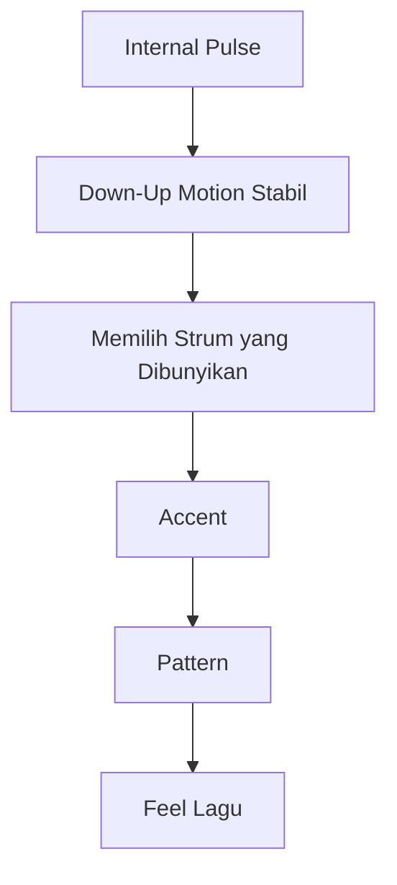
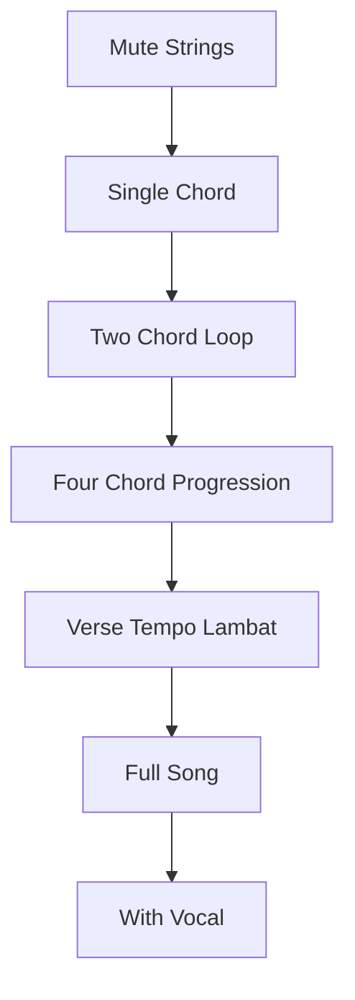
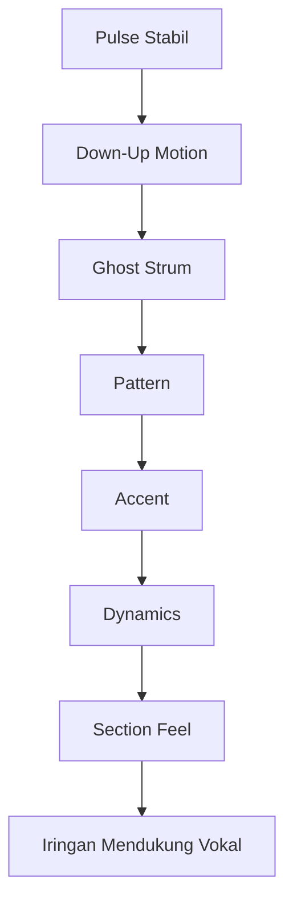

# learn-guitar-accompaniment-part-008.md

# Part 008 — Strumming Pattern Minimum untuk 80% Lagu Pop

## Status Seri

Seri: **Belajar Guitar Accompaniment Berdasarkan The First 20 Hours**  
Bagian: **008 dari 035**  
Fokus: membangun kosakata strumming minimum yang cukup untuk mengiringi banyak lagu pop, ballad, folk, worship, dan acoustic performance sederhana.

Part sebelumnya membahas rhythm sebagai clock. Part ini menerapkan clock itu menjadi pattern yang terdengar seperti iringan lagu.

---

## Tujuan Pembelajaran Part Ini

Setelah menyelesaikan part ini, Anda harus bisa:

1. memahami bahwa strumming pattern adalah variasi dari gerakan down-up yang stabil;
2. memainkan beberapa pattern dasar:
   - quarter note downstroke;
   - eighth note down-up;
   - down-down-up-up-down-up;
   - ballad 8th feel;
   - driving pop pattern;
   - sparse verse pattern;
   - fuller chorus pattern;
3. memahami ghost strum;
4. memahami accent;
5. memahami palm muting dasar;
6. memilih pattern berdasarkan lagu, bukan berdasarkan hafalan;
7. menyederhanakan pattern jika chord transition belum stabil;
8. membuat verse dan chorus terasa berbeda;
9. menghindari strumming yang menabrak vokal;
10. menggabungkan strumming dengan progression G-D-Em-C dan C-G-Am-F.

---

## Prinsip Kaufman yang Dipakai di Part Ini

Dalam 20 jam pertama, kita tidak butuh semua strumming pattern. Kita butuh beberapa pattern bernilai tinggi yang:

- mudah dipelajari;
- sering dipakai;
- fleksibel;
- bisa disederhanakan;
- mendukung vokal;
- bisa dipakai di banyak tempo;
- bisa dikembangkan menjadi variasi.

Targetnya bukan:

> Saya hafal 50 strumming pattern.

Targetnya:

> Saya punya 4–6 pattern dasar yang bisa saya pilih, sederhanakan, dan variasikan untuk mengiringi penyanyi.

---

# 1. Strumming Pattern Bukan Mantra

Banyak pemula memperlakukan strumming pattern seperti kode rahasia:

```text
D D U U D U
```

Lalu mereka menghafal gerakan tanpa memahami pulse.

Masalahnya:

- tangan berhenti di tempat kosong;
- upstroke tidak jatuh di `&`;
- chord change patah;
- pattern tidak cocok dengan lagu;
- semua lagu dimainkan dengan pattern yang sama.

Pattern harus dibangun di atas clock.



Jadi strumming pattern bukan gerakan acak. Ia adalah subset dari gerakan tangan kanan yang terus berjalan.

---

# 2. Notasi Strumming

Kita gunakan simbol:

```text
D = downstroke
U = upstroke
- = tangan bergerak tetapi tidak membunyikan senar / ghost
> = accent
x = muted strum
```

Hitungan dasar 8th note:

```text
1 & 2 & 3 & 4 &
```

Gerakan tangan kanan default:

```text
D U D U D U D U
```

Pattern berarti memilih bagian mana yang benar-benar berbunyi.

---

# 3. Motion vs Sound

Ini konsep sangat penting.

Contoh pattern:

```text
D   D U   U D U
```

Hitungan lengkap:

```text
Count : 1 & 2 & 3 & 4 &
Motion: D U D U D U D U
Sound : D - D U - U D U
```

Tangan tetap bergerak di semua subdivision. Tetapi tidak semua gerakan membunyikan senar.

Jika tangan berhenti, pattern akan terasa kaku.

---

# 4. Pattern 1 — Quarter Note Downstroke

## 4.1 Bentuk

```text
Count : 1 2 3 4
Strum : D D D D
```

Atau dalam 8th grid:

```text
Count : 1 & 2 & 3 & 4 &
Motion: D U D U D U D U
Sound : D - D - D - D -
```

## 4.2 Kapan Dipakai?

- latihan awal;
- lagu sangat sederhana;
- bagian verse yang tenang;
- saat chord transition belum stabil;
- saat mengiringi penyanyi yang butuh ruang;
- saat ingin membuat chorus nanti terasa lebih besar.

## 4.3 Cara Memainkan

- downstroke di setiap beat;
- tangan rileks;
- jangan terlalu keras;
- hitung keras;
- mulai dari chord mudah seperti Em atau G.

## 4.4 Latihan

```text
| G       | D       | Em      | C       |
| D D D D | D D D D | D D D D | D D D D |
```

Metronome:

```text
60 BPM
```

Target:

> 1 menit tanpa berhenti dan tanpa tempo naik.

---

# 5. Pattern 2 — Eighth Note Down-Up

## 5.1 Bentuk

```text
Count : 1 & 2 & 3 & 4 &
Strum : D U D U D U D U
```

## 5.2 Kapan Dipakai?

- lagu pop medium;
- latihan tangan kanan;
- membangun subdivision;
- lagu yang butuh gerakan lebih penuh;
- bagian chorus sederhana.

## 5.3 Risiko

Jika dimainkan semua sama keras, pattern ini bisa terdengar datar dan terlalu ramai.

Solusi:

- beri accent ringan di beat 1 dan 3 atau 2 dan 4;
- kurangi volume;
- strum tidak selalu semua senar;
- gunakan untuk latihan, bukan selalu performance.

## 5.4 Latihan

```text
| G               | D               |
| D U D U D U D U | D U D U D U D U |
```

Hitung keras:

```text
1 & 2 & 3 & 4 &
```

---

# 6. Pattern 3 — Down-Down-Up-Up-Down-Up

Ini salah satu pattern paling umum untuk pop acoustic.

## 6.1 Bentuk Ringkas

```text
D D U U D U
```

Namun bentuk ini bisa menipu jika tidak ditempatkan dalam grid.

## 6.2 Bentuk Grid

```text
Count : 1 & 2 & 3 & 4 &
Motion: D U D U D U D U
Sound : D - D U - U D U
```

Dibaca:

```text
1     = D
& 1   = ghost
2     = D
& 2   = U
3     = ghost down
& 3   = U
4     = D
& 4   = U
```

Jadi:

```text
1 & 2 & 3 & 4 &
D - D U - U D U
```

## 6.3 Kenapa Pattern Ini Berguna?

- cukup penuh;
- cocok untuk banyak lagu pop;
- punya ruang di antara strum;
- tidak seramai full down-up;
- mudah diberi accent;
- bisa dipakai verse atau chorus tergantung dinamika.

## 6.4 Kapan Dipakai?

- pop acoustic medium;
- lagu worship sederhana;
- folk pop;
- chorus yang ingin terbuka;
- verse jika dimainkan lembut.

## 6.5 Kesalahan Umum

- tangan berhenti di ghost;
- upstroke di `&3` terlambat;
- terlalu keras semua;
- chord change gagal karena pattern terlalu sibuk;
- lupa hitungan dan hanya menghafal bunyi.

## 6.6 Latihan Bertahap

### Level 1 — Mute Strings

```text
1 & 2 & 3 & 4 &
D - D U - U D U
```

### Level 2 — Satu Chord

Gunakan Em:

```text
Em
D - D U - U D U
```

### Level 3 — Dua Chord

```text
| G               | D               |
| D - D U - U D U | D - D U - U D U |
```

### Level 4 — Progression

```text
| G | D | Em | C |
```

Satu pattern per bar.

---

# 7. Pattern 4 — Ballad 8th Feel

Untuk lagu lambat, strumming sering perlu lebih lembut dan bernapas.

## 7.1 Bentuk Dasar

```text
Count : 1 & 2 & 3 & 4 &
Sound : D - D U D - D U
```

Atau:

```text
D - D U D - D U
```

Rasanya lebih stabil dan sedikit lebih tenang daripada pattern pop umum.

## 7.2 Alternatif Lebih Sparse

```text
Count : 1 & 2 & 3 & 4 &
Sound : D - - U D - - U
```

Ini cocok untuk verse ballad.

## 7.3 Kapan Dipakai?

- slow ballad;
- lagu mellow;
- verse emosional;
- mengiringi vokal lembut;
- bagian awal lagu.

## 7.4 Cara Memainkan

- strum lebih kecil;
- jangan semua senar terlalu keras;
- bass di beat 1 bisa sedikit lebih jelas;
- treble ringan di upstroke;
- biarkan chord bernapas.

## 7.5 Kesalahan Umum

- terlalu penuh sehingga vokal tertutup;
- strumming terlalu cepat untuk tempo lambat;
- tidak memberi ruang napas;
- semua beat sama keras.

---

# 8. Pattern 5 — Driving Pop

Untuk lagu yang lebih bergerak, gunakan pattern lebih stabil dan energik.

## 8.1 Bentuk

```text
Count : 1 & 2 & 3 & 4 &
Sound : D U D U D U D U
Accent: >     >   
```

Atau accent di 2 dan 4:

```text
Count : 1 & 2 & 3 & 4 &
Sound : D U D U D U D U
Accent:     >     >
```

## 8.2 Kapan Dipakai?

- chorus;
- lagu pop medium-up;
- bagian build-up;
- saat butuh energi;
- saat penyanyi masuk bagian besar.

## 8.3 Risiko

Pattern ini bisa terlalu ramai jika:

- tempo cepat;
- vokal padat;
- chord change sulit;
- gitar terlalu keras;
- Anda belum stabil.

Solusi:

- gunakan hanya di chorus;
- verse lebih sparse;
- kurangi volume;
- strum sebagian senar.

---

# 9. Pattern 6 — Sparse Verse, Fuller Chorus

Ini bukan satu pattern, tetapi strategi arrangement.

## 9.1 Verse Sparse

Contoh:

```text
Count : 1 & 2 & 3 & 4 &
Sound : D - - - D - - -
```

Atau:

```text
Sound : D - - U D - - U
```

Tujuan:

- memberi ruang lirik;
- membuat lagu intimate;
- menghindari monoton;
- menyimpan energi untuk chorus.

## 9.2 Chorus Fuller

Contoh:

```text
Sound : D - D U - U D U
```

Atau:

```text
Sound : D U D U D U D U
```

Tujuan:

- chorus terasa naik;
- energi meningkat;
- audience merasakan perubahan section.

## 9.3 Mental Model


Ini adalah awal dari arrangement thinking.

---

# 10. Accent Dasar

Accent membuat pattern hidup.

Contoh pattern umum:

```text
Count : 1 & 2 & 3 & 4 &
Sound : D - D U - U D U
Accent: >   >       >
```

Namun jangan overdo. Untuk singer accompaniment, accent harus mengikuti lagu dan vokal.

## 10.1 Accent di Beat 1

Memberi rasa downbeat kuat.

Cocok untuk:

- awal bar;
- chord change;
- section masuk.

## 10.2 Accent di Beat 2 dan 4

Memberi rasa pop/backbeat.

Cocok untuk:

- lagu pop;
- chorus;
- groove lebih bergerak.

## 10.3 Accent Ringan di Upstroke

Memberi shimmer/angkat.

Cocok untuk:

- acoustic pop;
- folk;
- strumming ringan.

---

# 11. Dynamics dengan Strumming

Satu pattern bisa terdengar sangat berbeda tergantung dynamics.

Contoh pattern:

```text
D - D U - U D U
```

Versi verse:

- pelan;
- strum kecil;
- accent ringan;
- bass tidak terlalu keras.

Versi chorus:

- lebih keras;
- strum lebih penuh;
- accent jelas;
- tangan kanan lebih terbuka.

Jadi jangan menganggap satu pattern punya satu rasa tetap.

---

# 12. Palm Muting Dasar

Palm muting adalah teknik menempelkan sisi telapak tangan kanan dekat bridge untuk meredam sustain senar.

## 12.1 Fungsi

- membuat suara lebih pendek;
- memberi feel rhythmic;
- cocok untuk verse;
- mengurangi volume;
- membuat build-up lebih terkendali.

## 12.2 Cara Dasar

1. Letakkan sisi telapak kanan dekat bridge.
2. Jangan terlalu jauh ke tengah senar.
3. Strum pelan.
4. Cari posisi di mana senar masih punya pitch tetapi sustain pendek.
5. Gunakan downstroke sederhana.

## 12.3 Kapan Dipakai?

- verse yang intimate;
- bagian sebelum chorus;
- lagu pop dengan groove ringan;
- saat gitar terlalu ramai;
- saat ingin meniru feel drum/bass ringan.

## 12.4 Kesalahan Umum

- menekan terlalu keras sampai pitch mati total;
- posisi terlalu jauh dari bridge;
- tangan kanan jadi kaku;
- muting semua bagian sehingga lagu tidak berkembang.

---

# 13. Bass-Treble Strum

Untuk variasi, Anda bisa membedakan bass dan treble.

Contoh pada chord G:

```text
Beat 1: petik/strum bass rendah
Beat 2: strum treble
Beat 3: bass
Beat 4: treble
```

Pattern sederhana:

```text
Bass - Down - Bass - Down
```

Atau dalam hitungan:

```text
1 2 3 4
B D B D
```

Ini membuat iringan lebih bergerak tanpa strumming terlalu ramai.

Cocok untuk:

- ballad;
- folk;
- lagu yang butuh pulse lembut;
- mengiringi vokal sendirian.

Akan dibahas lebih dalam di part fingerpicking/bass note, tetapi konsep dasarnya berguna di sini.

---

# 14. Memilih Pattern Berdasarkan Lagu

Jangan bertanya:

> Pattern apa yang benar?

Tanya:

> Lagu ini butuh energi seperti apa, vokalnya sepadat apa, dan section ini perlu ruang atau dorongan?

## 14.1 Parameter Pemilihan

```text
Tempo:
- lambat
- sedang
- cepat

Mood:
- intimate
- sedih
- optimis
- megah
- santai

Vocal Density:
- lirik rapat
- lirik renggang
- nada panjang
- banyak napas

Section:
- intro
- verse
- pre-chorus
- chorus
- bridge
- outro

Skill Constraint:
- chord mudah
- chord sulit
- transisi cepat
- penyanyi butuh rubato
```

## 14.2 Mapping Awal

| Kondisi | Pattern Awal |
|---|---|
| Lagu baru dipelajari | Quarter downstroke |
| Verse lembut | Sparse verse |
| Chorus pop | D-D-U-U-D-U |
| Ballad lambat | Ballad 8th feel |
| Lagu energik | Driving pop |
| Chord sulit | Sederhanakan pattern |
| Vokal sangat padat | Kurangi strum |
| Penyanyi butuh ruang | Sparse / fingerpick |

---

# 15. Pattern Harus Mengikuti Chord Transition

Jika chord transition belum stabil, pattern harus disederhanakan.

Contoh:

Anda ingin memakai:

```text
D - D U - U D U
```

Tapi C ke G masih lambat.

Maka turunkan ke:

```text
D - - - D - - -
```

Atau:

```text
D D D D
```

Prinsip:

> Pattern yang lebih sederhana tapi stabil lebih baik daripada pattern keren yang membuat lagu patah.

---

# 16. Strumming dan Vokal

Strumming yang baik memberi ruang untuk vokal.

Kesalahan umum:

- strumming terlalu keras saat vokal mulai;
- accent menabrak kata penting;
- pattern terlalu ramai di verse;
- upstroke tajam mengganggu lirik;
- gitar tidak turun saat penyanyi menyampaikan frasa lembut.

Saat mengiringi, dengarkan:

```text
Apakah vokal masih jelas?
Apakah gitar mendukung emosi lirik?
Apakah strumming memberi napas?
Apakah chorus terasa naik?
Apakah verse terlalu penuh?
```

Gitar bukan pusat. Penyanyi adalah pusat.

---

# 17. Strumming untuk Intro

Intro harus memberi penyanyi:

- tempo;
- key;
- mood;
- cue kapan masuk.

Untuk 20 jam pertama, intro sederhana cukup.

Contoh:

```text
Progression: G - D - Em - C
Mainkan 1 atau 2 putaran
Gunakan pattern yang sama atau lebih sparse dari verse
Berikan cue sebelum vokal masuk
```

Intro terlalu rumit bisa membuat penyanyi bingung.

---

# 18. Strumming untuk Ending

Ending harus terasa yakin.

Pilihan ending sederhana:

## 18.1 Stop di Chord Terakhir

```text
C ... final strum
```

Biarkan sustain.

## 18.2 Slow Down Sedikit

Untuk ballad:

```text
bar terakhir sedikit ritardando
final chord ditahan
```

## 18.3 Repeat Last Line

Mainkan progression akhir dua kali lalu stop.

Prinsip:

> Ending sederhana tapi yakin lebih baik daripada ending rumit tapi ragu.

---

# 19. Practice Ladder untuk Pattern

Jangan langsung pattern + chord sulit + lagu penuh.

Urutan:



Untuk setiap pattern, naik ladder ini.

---

# 20. Pattern Drill 1 — D-D-U-U-D-U

## Step 1 — Clap / Speak

Ucapkan:

```text
Down ... Down Up ... Up Down Up
```

Hitung:

```text
1 & 2 & 3 & 4 &
D - D U - U D U
```

## Step 2 — Muted Strings

Mute senar.

Mainkan 2 menit.

## Step 3 — Em Only

Gunakan Em karena mudah.

Mainkan 2 menit.

## Step 4 — G-D

```text
| G | D |
```

Satu pattern per bar.

## Step 5 — G-D-Em-C

```text
| G | D | Em | C |
```

Satu pattern per bar.

## Step 6 — Record

Rekam 1 menit. Dengarkan:

```text
[ ] Apakah pattern konsisten?
[ ] Apakah tangan berhenti di ghost?
[ ] Apakah chord masuk tepat?
[ ] Apakah tempo naik?
```

---

# 21. Pattern Drill 2 — Ballad 8th Feel

Gunakan:

```text
D - D U D - D U
```

Latihan:

```text
| C | G | Am | Fmaj7 |
```

Tempo:

```text
60–75 BPM
```

Fokus:

- lembut;
- jangan terlalu keras;
- biarkan vokal imajiner bernapas;
- gunakan accent kecil di beat 1.

---

# 22. Pattern Drill 3 — Sparse Verse ke Chorus

Verse:

```text
D - - U D - - U
```

Chorus:

```text
D - D U - U D U
```

Progression:

```text
G - D - Em - C
```

Latihan:

1. mainkan 2 putaran verse sparse;
2. mainkan 2 putaran chorus fuller;
3. rekam;
4. dengarkan apakah chorus benar-benar terasa naik.

Tujuan:

> Belajar membangun perbedaan section tanpa menambah chord.

---

# 23. Pattern Drill 4 — Driving Pop

Gunakan:

```text
D U D U D U D U
```

Accent:

```text
1 & 2 & 3 & 4 &
D U D U D U D U
    >       >
```

Artinya accent di beat 2 dan 4.

Gunakan muted strings dulu. Setelah stabil, gunakan progression:

```text
G - D - Em - C
```

Jangan gunakan terlalu keras. Ini untuk energi, bukan perang volume.

---

# 24. Cara Menyederhanakan Pattern

Jika bermasalah, turunkan kompleksitas.

## Level 0

```text
D - - - - - - -
```

Satu strum di beat 1.

## Level 1

```text
D - D - D - D -
```

Downstroke quarter.

## Level 2

```text
D - D U D - D U
```

Ballad sederhana.

## Level 3

```text
D - D U - U D U
```

Pop umum.

## Level 4

```text
D U D U D U D U
```

Full 8th with accent.

Gunakan level sesuai kemampuan chord transition dan kebutuhan lagu.

---

# 25. Strumming Intensity Map

Untuk setiap section lagu, buat peta intensitas.

Contoh:

```text
Intro      : Level 1
Verse 1    : Level 1–2
Pre-Chorus : Level 2–3
Chorus     : Level 3–4
Verse 2    : Level 2
Bridge     : Level 1 atau 3 tergantung lagu
Final Chorus: Level 4
Outro      : turun ke Level 1
```

Mermaid:


Ini membuat iringan lebih musikal walau chord sama.

---

# 26. Common Strumming Bugs

## 26.1 Tangan Berhenti di Ghost

Gejala:

- pattern terasa patah;
- upstroke terlambat;
- tempo tidak stabil.

Fix:

- latih motion penuh D-U-D-U;
- sound dipilih, motion tetap.

## 26.2 Semua Strum Sama Keras

Gejala:

- robotic;
- melelahkan didengar;
- vokal tertutup.

Fix:

- beri accent;
- kurangi strum di verse;
- variasikan bass/treble.

## 26.3 Strumming Terlalu Dalam

Gejala:

- pick nyangkut;
- suara kasar;
- tempo terganggu.

Fix:

- strum permukaan senar;
- pick angle sedikit miring;
- grip tidak terlalu kaku.

## 26.4 Pattern Terlalu Kompleks untuk Chord

Gejala:

- chord telat;
- rhythm berhenti;
- tangan kiri panik.

Fix:

- sederhanakan pattern;
- latih transisi;
- naik level bertahap.

## 26.5 Tidak Sesuai Lagu

Gejala:

- ballad terdengar seperti lagu ceria;
- verse terlalu ramai;
- chorus tidak naik.

Fix:

- dengarkan mood;
- atur dynamics;
- pilih pattern berdasarkan section.

---

# 27. Debugging Matrix

| Symptom | Penyebab Mungkin | Fix |
|---|---|---|
| Pattern patah | tangan berhenti di ghost | jaga motion down-up |
| Tempo naik | strum terlalu keras / gugup | metronome, kurangi volume |
| Vokal tertutup | pattern terlalu penuh | sparse strum, dynamics turun |
| Chord telat | pattern terlalu kompleks | simplify ke downstroke |
| Pick nyangkut | grip kaku / strum terlalu dalam | angle pick, rileks |
| Semua lagu sama | pattern sama terus | dynamic map per section |
| Chorus tidak naik | verse terlalu penuh | verse dibuat lebih sparse |
| Ballad terasa kasar | attack terlalu keras | strum kecil, palm mute ringan |

---

# 28. Latihan 45 Menit untuk Part Ini

## Block 1 — Tuning dan Pulse, 5 Menit

- Tune gitar.
- Metronome 60 BPM.
- Hitung `1 & 2 & 3 & 4 &`.

## Block 2 — Pattern 1 dan 2, 8 Menit

Muted strings:

```text
D - D - D - D -
D U D U D U D U
```

## Block 3 — Pattern Pop Umum, 10 Menit

```text
D - D U - U D U
```

Urutan:

- muted;
- Em;
- G-D;
- G-D-Em-C.

## Block 4 — Ballad Pattern, 8 Menit

```text
D - D U D - D U
```

Gunakan:

```text
C-G-Am-Fmaj7
```

## Block 5 — Sparse vs Full, 8 Menit

Verse:

```text
D - - U D - - U
```

Chorus:

```text
D - D U - U D U
```

Progression:

```text
G-D-Em-C
```

## Block 6 — Recording Review, 6 Menit

Rekam 1 menit.

Checklist:

```text
[ ] Pattern konsisten?
[ ] Tempo stabil?
[ ] Ghost tidak menghentikan tangan?
[ ] Chord masuk tepat?
[ ] Dynamics terasa berbeda?
```

---

# 29. Latihan 15 Menit

```text
2 menit  tuning
3 menit  muted D-U motion
4 menit  D-D-U-U-D-U pada Em
4 menit  G-D-Em-C dengan pattern
2 menit  recording dan catatan bug
```

Jika hanya 5 menit:

```text
1 menit  tuning
2 menit  mute D-D-U-U-D-U
2 menit  G-D-Em-C satu pattern per bar
```

---

# 30. Mini Project Part Ini

Buat arrangement sederhana untuk progression:

```text
G - D - Em - C
```

Dengan struktur:

```text
Intro  : quarter downstroke, 1 putaran
Verse  : sparse pattern, 2 putaran
Chorus : D-D-U-U-D-U, 2 putaran
Outro  : single final strum di G
```

Tuliskan:

```text
Tempo:
Pattern intro:
Pattern verse:
Pattern chorus:
Chord progression:
Bug terbesar:
```

Rekam versi 2 menit.

Target:

> Section terdengar berbeda walau chord sama.

---

# 31. Strumming untuk 3 Lagu Target

Saat nanti memilih lagu target, lakukan mapping:

```text
Song:
Tempo:
Mood:
Verse pattern:
Chorus pattern:
Bridge pattern:
Intro:
Ending:
Chord difficulty:
Simplification:
```

Contoh:

```text
Song: Lagu A
Tempo: 72 BPM
Mood: ballad
Verse: D - - U D - - U
Chorus: D - D U - U D U
Bridge: palm mute downstroke
Ending: final chord sustain
```

Ini membuat strumming menjadi keputusan arrangement, bukan hafalan pattern.

---

# 32. Kapan Harus Berhenti Memakai Pattern Tertentu?

Pattern tidak cocok jika:

```text
[ ] penyanyi terdengar tertutup
[ ] Anda sering telat chord
[ ] tempo berubah
[ ] lagu terasa terlalu ramai
[ ] mood lagu berubah tidak sesuai
[ ] tangan kanan tegang
[ ] pattern membuat Anda tidak mendengar vokal
```

Jika terjadi, sederhanakan.

---

# 33. Strumming dan Emotional Arc

Strumming membantu membentuk perjalanan emosi lagu.

Contoh arc sederhana:

```text
Intro      : memberi suasana
Verse      : cerita dimulai
Pre-Chorus : tension naik
Chorus     : emosi terbuka
Bridge     : kontras/refleksi
Final Chorus: puncak
Outro      : release
```

Gitar bisa mendukung arc ini dengan:

- volume;
- density;
- accent;
- muting;
- register;
- pattern;
- stop/silence.

Jadi strumming bukan sekadar tangan kanan bergerak. Strumming adalah narasi energi.

---

# 34. Kesalahan Engineer-Minded dalam Strumming

## 34.1 Mencari Pattern yang “Benar” Secara Absolut

Pattern benar tergantung konteks. Lagu yang sama bisa punya banyak pattern valid.

## 34.2 Menghafal Pattern Tanpa Feel

Pattern bukan hanya urutan D/U. Pattern punya accent, volume, dan ruang.

## 34.3 Tidak Mendengar Vokal

Gitaris pengiring harus mendengar vokal lebih banyak daripada mendengar dirinya sendiri.

## 34.4 Menjadikan Complexity sebagai Bukti Kemajuan

Kemajuan bukan pattern makin rumit. Kemajuan adalah iringan makin mendukung lagu.

---

# 35. Acceptance Criteria Part 008

Anda boleh lanjut ke part 009 jika:

```text
[ ] Bisa memainkan quarter downstroke pada progression G-D-Em-C
[ ] Bisa memainkan full eighth D-U pada satu chord
[ ] Bisa memainkan pattern D - D U - U D U secara muted
[ ] Bisa memainkan pattern D - D U - U D U pada G-D-Em-C secara lambat
[ ] Bisa memainkan ballad pattern sederhana
[ ] Bisa membuat verse lebih sparse dan chorus lebih full
[ ] Bisa menjelaskan ghost strum
[ ] Bisa menjelaskan accent
[ ] Bisa menyederhanakan pattern saat chord transition gagal
[ ] Bisa merekam dan mengidentifikasi bug strumming
```

Jika pattern masih belum sempurna, itu normal. Yang penting Anda sudah punya ladder latihan.

---

# 36. Ringkasan Mental Model

Strumming pattern adalah hasil dari:

```text
Pulse + Motion + Selected Sound + Accent + Dynamics + Context
```

Bukan sekadar:

```text
D D U U D U
```



Untuk 20 jam pertama, kuasai beberapa pattern minimum:

```text
D - D - D - D -
D U D U D U D U
D - D U - U D U
D - D U D - D U
D - - U D - - U
```

Gunakan pattern untuk mendukung lagu, bukan untuk pamer kompleksitas.

---

# 37. Output Part Ini

Output konkret:

1. Anda punya kosakata strumming minimum.
2. Anda memahami motion vs sound.
3. Anda bisa memakai ghost strum.
4. Anda bisa memberi accent sederhana.
5. Anda bisa membuat verse dan chorus berbeda.
6. Anda bisa memilih atau menyederhanakan pattern berdasarkan kebutuhan lagu.

Part berikutnya akan membahas:

> **Struktur Lagu: Intro, Verse, Pre-Chorus, Chorus, Bridge, Outro.**

