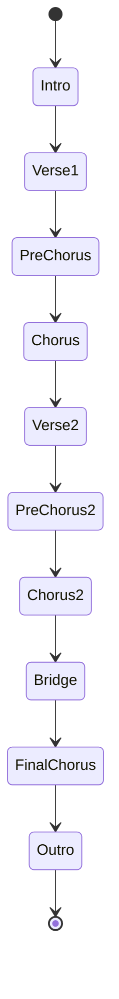
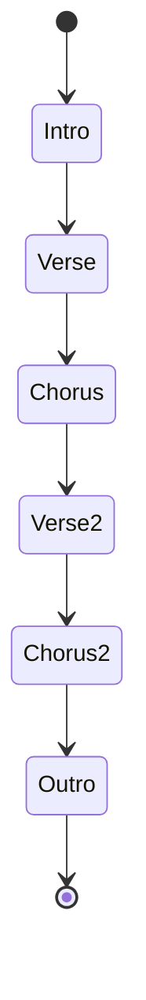
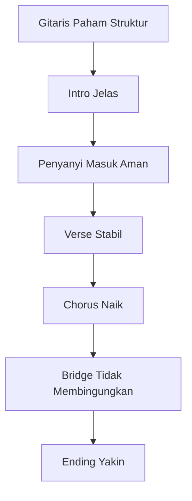
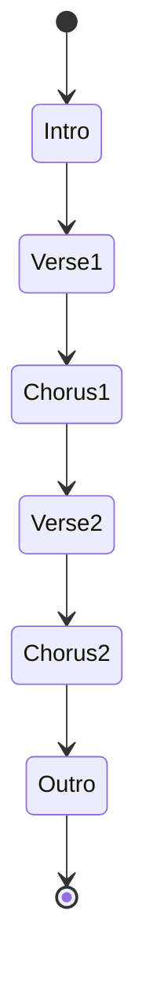
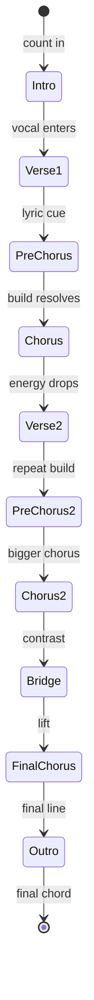
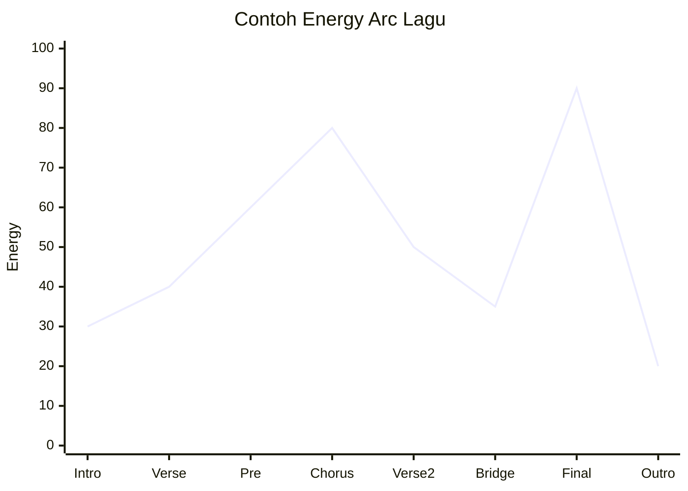
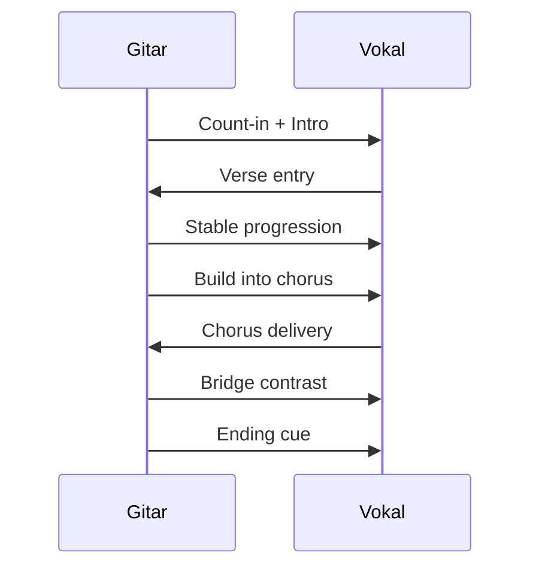
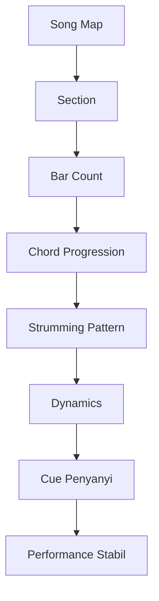

# learn-guitar-accompaniment-part-009.md

# Part 009 — Struktur Lagu: Intro, Verse, Pre-Chorus, Chorus, Bridge, Outro

## Status Seri

Seri: **Belajar Guitar Accompaniment Berdasarkan The First 20 Hours**  
Bagian: **009 dari 035**  
Fokus: memahami lagu sebagai struktur yang dapat dipetakan, diingat, dilatih, dan dipakai untuk memberi cue kepada penyanyi.

Pada part sebelumnya, kita membahas rhythm dan strumming. Sekarang kita naik satu level: bukan hanya memainkan chord dan pattern, tetapi memahami **di bagian mana** chord dan pattern itu dipakai.

---

## Tujuan Pembelajaran Part Ini

Setelah menyelesaikan part ini, Anda harus bisa:

1. memahami lagu sebagai rangkaian section;
2. membedakan intro, verse, pre-chorus, chorus, bridge, interlude, outro;
3. membaca dan membuat song map sederhana;
4. memahami bar count;
5. tahu kapan penyanyi masuk;
6. tahu kapan chord progression berulang;
7. tahu kapan section berubah;
8. memberi cue masuk, naik, turun, dan selesai;
9. membuat intro dan ending sederhana;
10. memainkan lagu dari awal sampai akhir tanpa tersesat.

---

## Prinsip Kaufman yang Dipakai di Part Ini

Dalam framework *The First 20 Hours*, salah satu cara mempercepat skill acquisition adalah **deconstruct the skill**.

Lagu yang terdengar kompleks sebenarnya bisa dipecah menjadi bagian-bagian yang lebih kecil:

```text
Intro
Verse
Pre-Chorus
Chorus
Verse
Chorus
Bridge
Final Chorus
Outro
```

Jika Anda tidak memetakan struktur, Anda akan mengandalkan memori mentah. Itu rapuh saat tampil.

Target kita bukan menghafal lagu secara kabur. Target kita:

> Bisa memahami lagu sebagai state machine sehingga tahu posisi saat ini, chord berikutnya, section berikutnya, dan cue untuk penyanyi.

---

# 1. Lagu sebagai State Machine

Untuk software engineer, struktur lagu bisa dipahami sebagai state machine.

Setiap section adalah state. Perpindahan antar-section adalah transition.



Tidak semua lagu punya semua state. Ada lagu yang sangat sederhana:



Intinya:

> Jika Anda tahu state saat ini, Anda lebih mudah tahu apa yang harus dimainkan berikutnya.

---

# 2. Kenapa Struktur Lagu Penting untuk Pengiring?

Sebagai gitaris pengiring, Anda bukan hanya memainkan chord. Anda membantu penyanyi menavigasi lagu.

Penyanyi butuh:

- tahu kapan masuk;
- tahu berapa lama intro;
- tahu kapan verse selesai;
- tahu kapan chorus datang;
- tahu kapan bridge berubah mood;
- tahu kapan lagu selesai;
- merasa bahwa gitaris tidak tersesat.

Jika gitaris tersesat, penyanyi ikut tidak aman.



---

# 3. Section Utama dalam Lagu

## 3.1 Intro

Intro adalah bagian pembuka sebelum vokal utama masuk.

Fungsi intro:

- memberi key;
- memberi tempo;
- memberi mood;
- memberi cue kapan penyanyi masuk;
- membuat audience masuk ke suasana lagu.

Intro untuk pengiring pemula sebaiknya sederhana.

Contoh intro:

```text
G - D - Em - C
```

Dimainkan 1 putaran atau 2 putaran.

### Kesalahan Intro Umum

- intro terlalu panjang;
- intro tidak jelas kapan selesai;
- tempo belum stabil;
- chord pertama tidak yakin;
- penyanyi tidak tahu kapan masuk;
- gitaris langsung memainkan pattern terlalu ramai.

### Intro yang Baik

Intro yang baik menjawab:

```text
Key apa?
Tempo berapa?
Feel seperti apa?
Penyanyi masuk kapan?
```

---

## 3.2 Verse

Verse adalah bagian cerita. Lirik biasanya berkembang di sini.

Ciri umum:

- dinamika lebih rendah dari chorus;
- strumming lebih sparse;
- vokal lebih naratif;
- chord progression bisa berulang;
- energi belum puncak.

Untuk pengiring:

- jangan terlalu ramai;
- beri ruang lirik;
- jaga tempo;
- jangan menabrak frasa vokal.

Contoh:

```text
Verse:
| G | D | Em | C |
| G | D | C  | C |
```

---

## 3.3 Pre-Chorus

Pre-chorus adalah jembatan menuju chorus.

Tidak semua lagu punya pre-chorus.

Fungsi:

- membangun tension;
- menaikkan energi;
- menyiapkan chorus;
- memberi rasa “sebentar lagi meledak”.

Untuk gitar:

- strumming bisa sedikit lebih penuh;
- volume naik bertahap;
- accent lebih jelas;
- jangan langsung sebesar chorus jika ingin chorus terasa masuk.

Contoh dynamic map:

```text
Verse      : 40%
Pre-Chorus: 65%
Chorus     : 85%
```

---

## 3.4 Chorus

Chorus adalah bagian utama/hook. Biasanya paling mudah diingat.

Ciri umum:

- lirik berulang;
- melodi lebih kuat;
- energi lebih tinggi;
- audience paling mengenali bagian ini;
- chord progression sering stabil dan catchy.

Untuk gitar:

- strumming lebih penuh;
- accent lebih jelas;
- volume naik;
- chord change harus yakin;
- jangan overplay sampai vokal tertutup.

Chorus harus terasa seperti “arrival”.

---

## 3.5 Bridge

Bridge adalah bagian kontras.

Fungsi:

- memberi variasi;
- menghindari monoton;
- membuka perspektif baru;
- menyiapkan final chorus;
- kadang punya chord berbeda.

Untuk gitar:

- bisa lebih tenang;
- bisa lebih intens;
- bisa palm mute;
- bisa stop-strum;
- bisa ubah pattern;
- pastikan penyanyi tahu masuknya.

Bridge sering menjadi tempat pemula tersesat karena chord dan panjang section berbeda.

---

## 3.6 Interlude

Interlude adalah bagian instrumental di antara section.

Contoh:

```text
Chorus → Interlude → Verse 2
```

Fungsi:

- memberi napas;
- mengulang intro;
- memberi transisi;
- memberi ruang emosional.

Untuk 20 jam pertama, interlude cukup memakai progression intro atau chorus.

---

## 3.7 Outro

Outro adalah penutup lagu.

Fungsi:

- menyelesaikan lagu;
- memberi sinyal akhir;
- menjaga ending tidak menggantung;
- membuat penyanyi dan audience tahu lagu selesai.

Ending sederhana:

```text
Final chorus → satu putaran progression → tahan chord terakhir
```

Atau:

```text
Final line → ritardando ringan → final strum
```

---

# 4. Common Song Form

## 4.1 Form Pop Sederhana

```text
Intro
Verse 1
Chorus
Verse 2
Chorus
Outro
```

Diagram:



## 4.2 Form dengan Pre-Chorus

```text
Intro
Verse 1
Pre-Chorus
Chorus
Verse 2
Pre-Chorus
Chorus
Bridge
Final Chorus
Outro
```

## 4.3 Form Singer-Songwriter

```text
Intro
Verse 1
Verse 2
Chorus
Verse 3
Chorus
Bridge
Chorus
Outro
```

## 4.4 Form Ballad

```text
Intro
Verse 1
Verse 2
Chorus
Interlude
Verse 3
Chorus
Bridge
Final Chorus
Outro
```

Ballad sering punya verse panjang dan dinamika gradual.

---

# 5. Bar Count

Bar count adalah jumlah bar dalam sebuah section.

Contoh verse 8 bar:

```text
Verse:
| G | D | Em | C |
| G | D | C  | C |
```

Itu 8 bar.

Jika setiap bar 4 beat, maka verse punya:

```text
8 bar x 4 beat = 32 beat
```

Mengapa bar count penting?

- tahu kapan section selesai;
- tahu kapan penyanyi masuk;
- tahu kapan chorus datang;
- tahu kapan harus build;
- tahu kapan ending.

Pemula sering tersesat bukan karena chord sulit, tetapi karena tidak menghitung bar.

---

# 6. Cara Menghitung Bar Saat Bermain

Gunakan hitungan bertingkat.

## 6.1 Hitung Beat

```text
1 2 3 4
```

## 6.2 Hitung Bar

```text
Bar 1: 1 2 3 4
Bar 2: 1 2 3 4
Bar 3: 1 2 3 4
Bar 4: 1 2 3 4
```

## 6.3 Hitung Progression

Untuk progression 4 bar:

```text
G  = bar 1
D  = bar 2
Em = bar 3
C  = bar 4
```

Jika progression diulang 2 kali, berarti 8 bar.

---

# 7. Song Map

Song map adalah representasi ringkas struktur lagu.

Template:

```text
Title:
Key:
Capo:
Tempo:
Time Signature:

Structure:
Intro:
Verse 1:
Pre-Chorus:
Chorus:
Verse 2:
Bridge:
Final Chorus:
Outro:

Notes:
```

Contoh:

```text
Title: Practice Song A
Key: G
Capo: none
Tempo: 72 BPM
Time Signature: 4/4

Structure:
Intro:      G D Em C x1
Verse 1:    G D Em C x2, sparse strum
Chorus:     G D Em C x2, fuller strum
Verse 2:    G D Em C x2, medium strum
Chorus 2:   G D Em C x2, fuller strum
Bridge:     Em C G D x1, palm mute
Final Chorus: G D Em C x2, full
Outro:      G final strum

Notes:
Cue vocal after intro bar 4.
Final G held.
```

Song map lebih berguna daripada chord sheet mentah.

---

# 8. Chord Sheet vs Song Map

## 8.1 Chord Sheet

Biasanya menampilkan chord di atas lirik.

Kelebihan:

- membantu mengikuti lirik;
- cocok untuk lagu yang belum hafal;
- menunjukkan chord placement.

Kekurangan:

- bisa panjang;
- bisa membuat mata terlalu sibuk;
- kadang chord placement tidak akurat;
- struktur besar sulit terlihat.

## 8.2 Song Map

Menampilkan struktur dan progression.

Kelebihan:

- mudah melihat bentuk lagu;
- cocok untuk rehearsal;
- membantu cue;
- membantu arrangement;
- mengurangi risiko tersesat.

Kekurangan:

- butuh Anda tahu lirik/melodi;
- tidak detail per kata.

Untuk pengiring, idealnya gunakan keduanya:

```text
Chord sheet untuk detail.
Song map untuk navigasi.
```

---

# 9. Struktur sebagai Finite State Machine

Mari buat model lebih formal.



Setiap transition butuh cue.

Cue bisa berupa:

- chord change;
- lyric line;
- strumming change;
- eye contact;
- breath;
- count-in;
- final accent;
- stop.

---

# 10. Cue untuk Penyanyi

Cue adalah sinyal.

Sebagai gitaris, cue membantu penyanyi merasa aman.

## 10.1 Cue Masuk Vokal

Contoh:

- intro 4 bar;
- di bar terakhir, gitaris sedikit menatap penyanyi;
- strum terakhir lebih jelas;
- penyanyi masuk di beat 1 setelahnya.

## 10.2 Cue Chorus

Contoh:

- pre-chorus mulai crescendo;
- strumming makin penuh;
- chord terakhir sebelum chorus diberi accent;
- chorus masuk lebih besar.

## 10.3 Cue Ending

Contoh:

- kontak mata;
- strumming mulai melambat;
- final chord ditahan;
- gitar berhenti jelas.

Cue tidak harus dramatis. Yang penting konsisten.

---

# 11. Count-In

Count-in adalah hitungan sebelum lagu dimulai.

Contoh:

```text
1 2 3 4
```

Atau untuk lagu lambat:

```text
1 2 3 4
```

Dengan gestur/nod.

Fungsi count-in:

- menyamakan tempo;
- memberi penyanyi persiapan;
- mengurangi start yang ragu;
- membuat intro bersih.

Jika tidak nyaman menghitung keras di panggung, gunakan napas dan gerakan tubuh. Tapi saat rehearsal, hitung jelas.

---

# 12. Intro Design untuk Pemula

Intro harus sederhana dan fungsional.

## 12.1 Intro Satu Putaran Progression

Jika lagu memakai progression:

```text
G - D - Em - C
```

Intro:

```text
G - D - Em - C x1
```

Penyanyi masuk setelah C.

## 12.2 Intro Dua Bar

Untuk lagu sederhana:

```text
G - D
```

Lalu vocal masuk.

## 12.3 Intro dengan Final Hold

```text
G - D - Em - C...
```

Tahan C sebentar, lalu masuk verse.

## 12.4 Hindari

- intro improvisasi panjang;
- intro dengan chord berbeda yang membingungkan;
- intro terlalu cepat;
- intro tanpa cue masuk;
- intro yang tidak sesuai tempo verse.

---

# 13. Ending Design untuk Pemula

Ending lebih penting daripada yang terlihat. Lagu yang bagus bisa terasa amatir jika ending ragu.

## 13.1 Final Chord Hold

Mainkan chord terakhir dan tahan.

Contoh:

```text
... G
```

Strum G sekali, biarkan sustain.

## 13.2 Repeat Last Progression

Ulang progression terakhir sekali lalu stop.

```text
G - D - Em - C
G final
```

## 13.3 Ritardando Ringan

Untuk ballad:

```text
bar terakhir sedikit melambat
final chord ditahan
```

Jangan lakukan ritardando jika belum disepakati dengan penyanyi.

## 13.4 Stop-Time Ending

Semua berhenti di titik tertentu.

Contoh:

```text
C ... stop
```

Ini butuh rehearsal.

---

# 14. Dynamic Map per Section

Struktur lagu bukan hanya urutan chord. Setiap section punya energi.

Contoh:

```text
Intro       : 30%
Verse 1     : 40%
Pre-Chorus  : 60%
Chorus      : 80%
Verse 2     : 50%
Bridge      : 35% atau 75%
Final Chorus: 90%
Outro       : 20%
```

Diagram:



Jika renderer Mermaid tidak mendukung `xychart-beta`, gunakan tabel energy map saja.

---

# 15. Pattern Map per Section

Selain chord, tulis pattern.

Contoh:

```text
Intro       : D - - - D - - -
Verse       : D - - U D - - U
Pre-Chorus  : D - D U D - D U
Chorus      : D - D U - U D U
Bridge      : palm mute downstroke
Final Chorus: full D U D U
Outro       : final strum
```

Pattern map membuat lagu terasa intentional.

---

# 16. Song Form dan Memory

Menghafal lagu lebih mudah jika dibagi section.

Buruk:

```text
Saya harus hafal 4 menit lagu.
```

Lebih baik:

```text
Intro: 4 bar
Verse: progression A x2
Chorus: progression B x2
Verse 2: sama dengan verse
Bridge: progression C x1
Final chorus: chorus x2
Outro: final chord
```

Ini seperti chunking dalam memori.

---

# 17. Cara Membaca Chord Chart dengan Struktur

Chord chart dari internet sering berupa chord + lirik panjang.

Langkah:

1. identifikasi intro;
2. beri label verse;
3. beri label chorus;
4. cari bagian yang berulang;
5. tandai bridge;
6. hitung bar;
7. tulis ulang menjadi song map;
8. baru latihan.

Jangan langsung main dari chord chart tanpa memahami bentuk.

---

# 18. Latihan Membuat Song Map

Ambil lagu sederhana. Jangan mulai dari lagu kompleks.

Template latihan:

```text
Title:
Original Key:
Your Key:
Capo:
Tempo:
Time Signature:

Intro:
Verse:
Chorus:
Bridge:
Outro:

Chord Progression:
Strumming:
Cue:
Ending:
```

Isi walau belum sempurna.

Tujuannya bukan membuat dokumen akademik. Tujuannya membuat Anda tidak tersesat.

---

# 19. Song Map untuk Progression Latihan

Gunakan progression:

```text
G - D - Em - C
```

Buat lagu simulasi:

```text
Title: Practice Form 1
Key: G
Tempo: 72 BPM
Time Signature: 4/4

Intro:
G D Em C x1, sparse

Verse:
G D Em C x2, sparse

Chorus:
G D Em C x2, fuller

Bridge:
Em C G D x1, palm mute

Final Chorus:
G D Em C x2, full

Outro:
G final strum
```

Latihan ini cukup untuk memahami struktur tanpa harus bergantung pada lagu terkenal.

---

# 20. Jangan Berhenti Saat Salah Struktur

Jika Anda salah masuk section, jangan langsung berhenti. Latih recovery.

Strategi:

## 20.1 Kembali ke Progression Utama

Jika bingung, kembali ke chord progression yang paling aman.

## 20.2 Dengarkan Penyanyi

Jika penyanyi sudah masuk chorus, ikuti penyanyi.

## 20.3 Gunakan Chord Netral

Jika benar-benar blank, mainkan chord root/key sementara dengan rhythm ringan.

## 20.4 Jangan Tunjukkan Panik

Panic gesture lebih merusak daripada chord yang salah sesaat.

---

# 21. Kesalahan Struktur Umum

## 21.1 Intro Terlalu Panjang atau Pendek

Solusi:

- tentukan jumlah bar;
- latihan count-in;
- beri cue.

## 21.2 Lupa Masuk Chorus

Solusi:

- tandai lyric cue;
- tandai chord sebelum chorus;
- dynamic build.

## 21.3 Bridge Membingungkan

Solusi:

- latih bridge terpisah;
- tulis jumlah bar;
- buat cue keluar dari bridge.

## 21.4 Ending Ragu

Solusi:

- pilih ending sederhana;
- latih 5 kali;
- pastikan penyanyi tahu.

## 21.5 Semua Section Terdengar Sama

Solusi:

- buat dynamic map;
- verse sparse;
- chorus fuller;
- bridge contrast.

---

# 22. Rehearsal Language

Saat latihan dengan penyanyi, gunakan bahasa yang jelas.

Contoh:

```text
Intro satu putaran, kamu masuk setelah C.
Verse pertama aku main pelan.
Chorus aku buka lebih penuh.
Bridge kita turun dulu.
Final chorus dua kali.
Ending tahan di G.
```

Hindari:

```text
Nanti masuk aja ya.
Kayaknya di situ naik.
Pokoknya feel aja.
```

“Feel” penting, tetapi rehearsal butuh agreement.

---

# 23. Struktur dan Chord Repetition

Banyak lagu menggunakan chord yang sama di beberapa section tetapi dengan energi berbeda.

Contoh:

```text
Verse:
G - D - Em - C

Chorus:
G - D - Em - C
```

Jika chord sama, perbedaan harus datang dari:

- pattern;
- volume;
- accent;
- density;
- register;
- muting;
- vocal melody;
- lyrical intensity.

Jangan berpikir chord sama berarti section harus terdengar sama.

---

# 24. Struktur Lagu sebagai API Contract

Dalam duet gitar-vokal, struktur adalah kontrak.

```text
Intro length
Vocal entry
Section order
Chord progression
Dynamic changes
Ending
```

Jika kontrak tidak jelas, runtime performance rentan error.



---

# 25. Latihan 45 Menit untuk Part Ini

## Block 1 — Pilih Progression, 5 Menit

Gunakan:

```text
G - D - Em - C
```

Atau:

```text
C - G - Am - Fmaj7
```

## Block 2 — Buat Song Map, 10 Menit

Tulis:

```text
Intro:
Verse:
Chorus:
Bridge:
Outro:
```

Jangan main dulu. Tulis dulu.

## Block 3 — Mainkan Section Terpisah, 10 Menit

Latih:

- intro 3 kali;
- verse 3 kali;
- chorus 3 kali;
- ending 5 kali.

## Block 4 — Full Run, 10 Menit

Mainkan dari awal sampai akhir tanpa berhenti.

Jika salah, lanjut.

## Block 5 — Recording dan Review, 10 Menit

Rekam full run.

Checklist:

```text
[ ] Intro jelas?
[ ] Vocal entry jelas?
[ ] Verse dan chorus berbeda?
[ ] Bridge tidak membingungkan?
[ ] Ending yakin?
[ ] Ada section yang terlalu panjang/pendek?
```

---

# 26. Latihan 15 Menit

```text
3 menit  tulis song map mini
4 menit  latih intro + vocal entry
4 menit  latih verse ke chorus
2 menit  latih ending
2 menit  full run singkat
```

Jika hanya 5 menit:

```text
1 menit  baca song map
2 menit  intro ke verse
2 menit  chorus ke ending
```

---

# 27. Mini Project Part Ini

Buat song map untuk satu lagu target atau lagu simulasi.

Output:

```text
Title:
Key:
Capo:
Tempo:
Time Signature:
Structure:
Intro:
Verse:
Chorus:
Bridge:
Outro:
Strumming map:
Dynamic map:
Cue vocal:
Ending:
```

Lalu rekam full run instrumental tanpa vokal.

Target:

> Anda bisa memainkan struktur dari awal sampai akhir tanpa tersesat, walau chord/strumming belum sempurna.

---

# 28. Acceptance Criteria Part 009

Anda boleh lanjut ke part 010 jika:

```text
[ ] Bisa menjelaskan fungsi intro, verse, chorus, bridge, outro
[ ] Bisa membuat song map sederhana
[ ] Bisa menghitung bar dasar dalam 4/4
[ ] Bisa menentukan vocal entry setelah intro
[ ] Bisa membuat verse dan chorus berbeda secara strumming/dinamika
[ ] Bisa memilih ending sederhana
[ ] Bisa memainkan song map latihan dari awal sampai akhir
[ ] Bisa menjelaskan struktur lagu sebagai state machine
[ ] Bisa memberi cue sederhana kepada penyanyi
```

---

# 29. Ringkasan Mental Model

Lagu bukan tumpukan chord. Lagu adalah struktur waktu, energi, dan cerita.



Jika Anda memahami struktur, Anda tidak hanya “main gitar”. Anda mengarahkan perjalanan lagu.

---

# 30. Output Part Ini

Output konkret:

1. Anda memahami section lagu.
2. Anda bisa membuat song map.
3. Anda bisa menghitung bar dasar.
4. Anda bisa membuat intro dan ending sederhana.
5. Anda bisa memberi cue masuk vokal.
6. Anda bisa memainkan lagu simulasi dari awal sampai akhir.

Part berikutnya:

> **Harmoni Minimum: Kenapa Chord Bisa Cocok dengan Lagu.**

