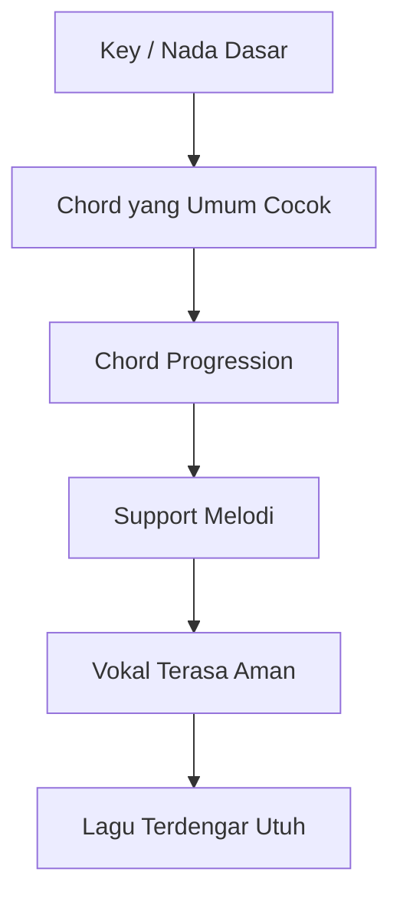
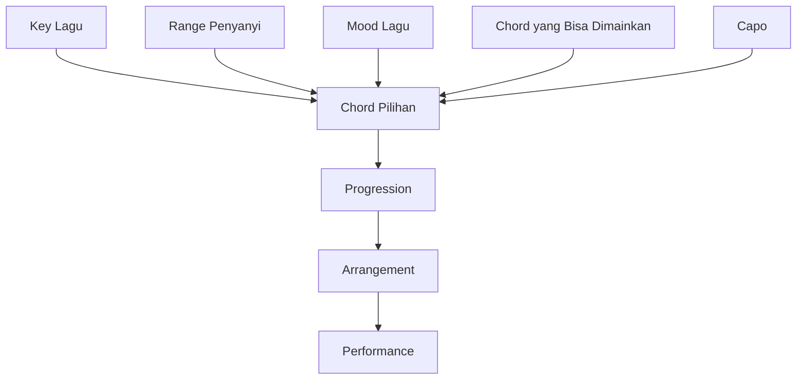
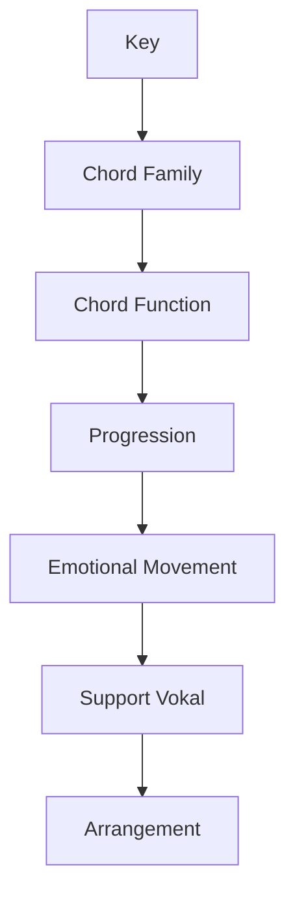

# learn-guitar-accompaniment-part-010.md

# Part 010 — Harmoni Minimum: Kenapa Chord Bisa Cocok dengan Lagu

## Status Seri

Seri: **Belajar Guitar Accompaniment Berdasarkan The First 20 Hours**  
Bagian: **010 dari 035**  
Fokus: memahami harmoni minimum yang dibutuhkan agar chord progression tidak terasa seperti hafalan acak, tetapi seperti sistem yang bisa dipahami, dipindahkan, disederhanakan, dan diterapkan untuk mengiringi penyanyi.

Bagian ini bukan teori musik lengkap. Ini adalah teori minimum untuk self-correction dan arrangement dasar.

---

## Tujuan Pembelajaran Part Ini

Setelah menyelesaikan part ini, Anda harus bisa:

1. memahami apa itu key atau nada dasar secara praktis;
2. memahami hubungan major/minor dengan rasa lagu;
3. memahami chord sebagai fungsi dalam key;
4. memahami roman numeral sederhana;
5. mengenali progression umum seperti I–V–vi–IV;
6. memahami kenapa banyak lagu memakai chord yang mirip;
7. memahami diatonic chord secara praktis;
8. memahami kenapa capo membantu transpose;
9. memahami harmoni sebagai constraint system;
10. memakai teori untuk debugging chord yang terasa tidak cocok.

---

## Prinsip Kaufman yang Dipakai di Part Ini

Dalam pendekatan Kaufman, kita belajar teori **secukupnya untuk bisa mengoreksi diri**.

Artinya:

- tidak perlu mempelajari harmoni klasik penuh;
- tidak perlu menghafal semua scale mode;
- tidak perlu menganalisis jazz substitution;
- tidak perlu membaca notasi balok.

Yang perlu:

> Memahami kenapa chord tertentu sering muncul bersama, bagaimana progression bekerja, dan bagaimana memilih chord yang cukup cocok untuk mengiringi penyanyi.

Teori di sini adalah debugging tool, bukan tujuan akhir.

---

# 1. Harmoni dalam Konteks Pengiring

Dalam lagu, harmoni adalah hubungan antar-chord yang mendukung melodi.

Penyanyi menyanyikan melodi. Gitar memainkan chord. Jika chord mendukung melodi, lagu terasa cocok. Jika chord bertabrakan, lagu terasa fals atau aneh.



Sebagai pengiring, Anda tidak harus menjadi komposer penuh. Tetapi Anda perlu tahu kenapa chord dalam satu lagu biasanya tidak random.

---

# 2. Key / Nada Dasar

Key adalah pusat gravitasi musik.

Jika lagu berada di key G, maka G biasanya terasa seperti “rumah”.

Contoh dalam key G:

```text
G - D - Em - C
```

Saat progression kembali ke G, sering terasa resolved.

Jika lagu berada di key C:

```text
C - G - Am - F
```

Saat kembali ke C, terasa pulang.

Mental model:

> Key adalah home base. Chord lain bergerak menjauh dan kembali ke home base.

---

# 3. Tonic: Rumah Harmoni

Chord utama dalam key disebut tonic.

Jika key G:

```text
Tonic = G
```

Jika key C:

```text
Tonic = C
```

Jika key D:

```text
Tonic = D
```

Tonic biasanya:

- terasa stabil;
- cocok sebagai chord pembuka;
- cocok sebagai chord penutup;
- menjadi pusat rasa lagu;
- sering dipakai di ending.

Tidak semua lagu selalu mulai dari tonic, tetapi banyak lagu sederhana melakukannya.

---

# 4. Major Key dan Minor Key

## 4.1 Major Key

Major key cenderung terasa:

- terang;
- terbuka;
- stabil;
- resolved.

Contoh key:

```text
C major
G major
D major
A major
E major
```

## 4.2 Minor Key

Minor key cenderung terasa:

- gelap;
- sedih;
- tegang;
- introspektif.

Contoh key:

```text
A minor
E minor
D minor
```

Namun lagu minor bisa tetap energik, dan lagu major bisa tetap sedih tergantung tempo, lirik, dan arrangement.

---

# 5. Scale sebagai Bahan Baku Chord

Scale adalah kumpulan nada dalam key.

Contoh C major scale:

```text
C D E F G A B
```

Dari nada-nada ini, kita bisa membentuk chord yang “secara default” cocok dalam key C.

Chord di key C major:

```text
C
Dm
Em
F
G
Am
Bdim
```

Untuk fase awal, kita jarang memakai Bdim. Jadi chord paling penting:

```text
C
Dm
Em
F
G
Am
```

Inilah alasan chord C, G, Am, F, Dm, Em sering muncul bersama.

---

# 6. Diatonic Chord

Diatonic chord adalah chord yang berasal dari scale/key yang sama.

Contoh key C major:

```text
I    = C
ii   = Dm
iii  = Em
IV   = F
V    = G
vi   = Am
vii° = Bdim
```

Roman numeral dipakai agar pola bisa dipindahkan ke key lain.

---

# 7. Roman Numeral

Roman numeral adalah cara memberi nomor pada chord dalam key.

Dalam key C:

```text
C  = I
Dm = ii
Em = iii
F  = IV
G  = V
Am = vi
Bdim = vii°
```

Huruf besar berarti major:

```text
I, IV, V
```

Huruf kecil berarti minor:

```text
ii, iii, vi
```

Untuk 20 jam pertama, fokus pada:

```text
I
IV
V
vi
ii
iii
```

Dan abaikan dulu `vii°` kecuali hanya tahu bahwa ia ada.

---

# 8. Kenapa Roman Numeral Berguna?

Karena progression bisa dipindahkan antar-key.

Contoh progression:

```text
I - V - vi - IV
```

Dalam key C:

```text
C - G - Am - F
```

Dalam key G:

```text
G - D - Em - C
```

Dalam key D:

```text
D - A - Bm - G
```

Pola emosinya mirip, walau chord-nya berbeda.

Ini sangat penting untuk accompaniment karena penyanyi sering butuh key yang berbeda.

---

# 9. Progression I–V–vi–IV

Ini salah satu progression paling umum di musik pop.

## 9.1 Dalam Key C

```text
C - G - Am - F
```

## 9.2 Dalam Key G

```text
G - D - Em - C
```

## 9.3 Rasa Umum

- familiar;
- emotional;
- stabil tetapi bergerak;
- cocok untuk pop, ballad, worship, acoustic;
- mudah dibuat naik dengan dynamics.

## 9.4 Mengapa Berguna?

Dengan dua versi ini saja:

```text
C - G - Am - F
G - D - Em - C
```

Anda sudah punya fondasi banyak lagu.

---

# 10. Progression vi–IV–I–V

Ini variasi dari chord yang sama, tetapi mulai dari minor.

## 10.1 Dalam Key C

```text
Am - F - C - G
```

## 10.2 Dalam Key G

```text
Em - C - G - D
```

## 10.3 Rasa Umum

- lebih melankolis;
- cocok untuk verse emosional;
- cocok untuk lagu minor-ish;
- tetap resolved karena chord berasal dari major key relatif.

Progression ini sangat sering dipakai untuk ballad dan pop emosional.

---

# 11. Progression I–vi–IV–V

Classic progression.

## 11.1 Dalam Key C

```text
C - Am - F - G
```

## 11.2 Dalam Key G

```text
G - Em - C - D
```

Rasa:

- klasik;
- manis;
- familiar;
- cocok untuk lagu sederhana.

---

# 12. Progression I–IV–V

Ini progression paling fundamental.

## 12.1 Dalam Key C

```text
C - F - G
```

## 12.2 Dalam Key G

```text
G - C - D
```

Rasa:

- sangat stabil;
- sederhana;
- folk/country/pop klasik;
- cocok untuk lagu anak, folk, worship sederhana, blues/pop sederhana.

Jika Anda hanya tahu I, IV, V dalam beberapa key, Anda sudah bisa memahami banyak lagu.

---

# 13. Progression ii–V–I Secara Konseptual

ii–V–I sangat penting dalam jazz dan musik tonal, tetapi untuk 20 jam pertama cukup tahu konsepnya.

Dalam key C:

```text
Dm - G - C
```

Rasa:

- bergerak menuju pulang;
- Dm memberi persiapan;
- G memberi tension;
- C memberi resolution.

Dalam pop/ballad, potongan ini sering muncul.

Contoh:

```text
Dm - G - C
```

Jika Anda melihat Dm lalu G lalu C, anggap itu seperti jalan pulang ke C.

---

# 14. Dominant Function: Kenapa V Ingin Pulang ke I

Chord V sering punya rasa ingin kembali ke I.

Dalam key C:

```text
G → C
```

Dalam key G:

```text
D → G
```

Dalam key D:

```text
A → D
```

Ini disebut dominant to tonic.

Sebagai pengiring, Anda tidak perlu menjelaskan teori akustiknya dulu. Cukup rasakan:

> Chord V sering memberi tension yang ingin resolve ke I.

Ini membantu ending.

Jika lagu ingin selesai di key C, chord G sebelum C sering terasa kuat.

---

# 15. Chord Function Minimum

Dalam major key:

```text
I   = rumah / stabil
IV  = terbuka / bergerak
V   = tension / ingin pulang
vi  = minor relatif / emotional
ii  = persiapan / lembut menuju V
iii = warna minor / transisi
```

Contoh key C:

```text
I   C
IV  F
V   G
vi  Am
ii  Dm
iii Em
```

Contoh key G:

```text
I   G
IV  C
V   D
vi  Em
ii  Am
iii Bm
```

Bm masih sulit untuk pemula, jadi sering dihindari atau menggunakan capo/transpose.

---

# 16. Chord Family per Key

## 16.1 Key C

```text
I    C
ii   Dm
iii  Em
IV   F
V    G
vi   Am
```

Chord praktis:

```text
C, Dm, Em, Fmaj7/F simplified, G, Am
```

## 16.2 Key G

```text
I    G
ii   Am
iii  Bm
IV   C
V    D
vi   Em
```

Chord praktis:

```text
G, Am, C, D, Em
```

Bm bisa dihindari awal.

## 16.3 Key D

```text
I    D
ii   Em
iii  F#m
IV   G
V    A
vi   Bm
```

Chord praktis:

```text
D, Em, G, A
```

F#m dan Bm sulit untuk pemula.

## 16.4 Key A

```text
I    A
ii   Bm
iii  C#m
IV   D
V    E
vi   F#m
```

Chord praktis:

```text
A, D, E
```

Banyak chord minor di key A cukup sulit untuk pemula.

---

# 17. Kenapa Key G dan C Ramah Pemula?

Key G:

```text
G, C, D, Em, Am
```

Semua relatif mudah.

Key C:

```text
C, G, Am, F, Dm, Em
```

Cukup mudah kecuali F, yang bisa disederhanakan.

Karena itu, banyak latihan awal memakai:

```text
G - D - Em - C
C - G - Am - Fmaj7
```

Dengan capo, shape ini bisa dipindahkan ke key lain.

---

# 18. Capo sebagai Alat Harmoni

Capo memungkinkan Anda memakai shape mudah untuk menghasilkan key berbeda.

Contoh:

```text
Shape: G - D - Em - C
Tanpa capo: sound G - D - Em - C
Capo 2: sound A - E - F#m - D
Capo 4: sound B - F# - G#m - E
```

Bagi pemula, capo membuat key sulit menjadi playable.

Untuk penyanyi, capo membantu menemukan key nyaman tanpa membuat gitaris harus langsung menguasai barre chord.

Detail capo akan dibahas di part berikutnya.

---

# 19. Harmoni sebagai Constraint System

Pikirkan harmoni seperti constraint system.

Input:

```text
Key
Melody
Vocal range
Mood
Chord vocabulary
Skill level
Capo position
```

Output:

```text
Chord progression yang cocok dan playable
```

Diagram:



Sebagai pengiring awal, Anda tidak mencari semua kemungkinan chord. Anda mencari chord yang:

- cocok dengan melodi;
- mendukung penyanyi;
- bisa dimainkan stabil;
- tidak membuat arrangement terlalu sulit.

---

# 20. Borrowed Chord dan Chord “Aneh”

Kadang lagu memakai chord di luar key.

Contoh dalam key C, tiba-tiba muncul:

```text
E
Bb
Ab
D major
```

Ini bukan selalu salah. Bisa jadi borrowed chord, secondary dominant, modulation, atau warna tertentu.

Untuk 20 jam pertama:

- jangan panik;
- cek chord chart lain;
- dengarkan lagu asli;
- cari versi simplified;
- jika chord terlalu sulit, cari capo/key alternatif;
- fokus lagu target yang tidak terlalu kompleks.

Tidak semua lagu cocok untuk fase 20 jam pertama.

---

# 21. Cara Mengetahui Chord Terasa Tidak Cocok

Chord mungkin tidak cocok jika:

```text
[ ] melodi terasa bertabrakan keras
[ ] penyanyi sulit menemukan nada
[ ] chord terdengar seperti "keluar jalur"
[ ] bass note terdengar salah
[ ] chord chart dari internet berbeda-beda
[ ] Anda menggunakan capo tapi lupa transpose
[ ] chord major/minor tertukar
```

Namun hati-hati: kadang chord yang “aneh” memang intentional. Gunakan telinga dan versi asli.

---

# 22. Debugging Chord yang Terasa Salah

Langkah:

1. Cek tuning.
2. Cek apakah chord shape benar.
3. Cek apakah capo sesuai.
4. Cek apakah chord chart key-nya benar.
5. Cek apakah major/minor tertukar.
6. Cek apakah bass string salah ikut berbunyi.
7. Cek rekaman asli.
8. Cek apakah penyanyi menyanyikan key berbeda.
9. Sederhanakan ke chord family utama.

Contoh:

```text
Lagu terasa salah di bagian C - G - A - F
```

Dalam key C, A major agak keluar. Mungkin seharusnya Am.

Coba:

```text
C - G - Am - F
```

Jika terasa lebih natural, kemungkinan chart salah atau versi berbeda.

---

# 23. Major/Minor Mistake

Kesalahan umum:

```text
Am dimainkan sebagai A
Em dimainkan sebagai E
Dm dimainkan sebagai D
```

Perubahan minor ke major bisa sangat mengubah rasa.

Contoh:

```text
C - G - Am - F
```

Jika Am diganti A:

```text
C - G - A - F
```

Rasanya berbeda drastis. Bisa jadi salah, bisa juga intentional. Untuk lagu sederhana, biasanya minor harus tetap minor.

---

# 24. Bass Note Mistake

Kadang chord benar tetapi bass salah.

Contoh D:

```text
D = xx0232
```

Jika Anda strum dari senar 6, bass E rendah ikut berbunyi. Itu bisa membuat D terdengar kotor.

Contoh C:

```text
C = x32010
```

Jika senar 6 dibunyikan keras, chord bisa terdengar muddy.

Jadi harmoni bukan hanya nama chord. String yang dibunyikan juga memengaruhi harmoni.

---

# 25. Progression Recognition

Latih mengenali progression umum.

## 25.1 I–V–vi–IV

```text
C - G - Am - F
G - D - Em - C
```

## 25.2 vi–IV–I–V

```text
Am - F - C - G
Em - C - G - D
```

## 25.3 I–vi–IV–V

```text
C - Am - F - G
G - Em - C - D
```

## 25.4 I–IV–V

```text
C - F - G
G - C - D
D - G - A
```

## 25.5 ii–V–I

```text
Dm - G - C
Am - D - G
Em - A - D
```

Jika Anda bisa mengenali pola ini, chord chart tidak lagi tampak random.

---

# 26. Table Progression dalam Key Praktis

| Roman | Key C | Key G | Key D |
|---|---|---|---|
| I | C | G | D |
| ii | Dm | Am | Em |
| iii | Em | Bm | F#m |
| IV | F | C | G |
| V | G | D | A |
| vi | Am | Em | Bm |

Untuk 20 jam pertama:

- key C gunakan F simplified;
- key G hindari Bm dulu jika perlu;
- key D hindari Bm/F#m dulu jika perlu atau pakai capo.

---

# 27. Cara Memilih Key untuk Penyanyi

Ini akan dibahas lebih dalam di part capo, tetapi harmoni minimum perlu memahami konsepnya.

Jika penyanyi merasa lagu terlalu tinggi:

- turunkan key;
- atau gunakan capo/shape lain;
- atau pilih chord shape yang menghasilkan key lebih rendah.

Jika penyanyi merasa lagu terlalu rendah:

- naikkan key;
- capo bisa membantu.

Gitaris pengiring harus melayani range penyanyi, bukan memaksa penyanyi mengikuti chord yang nyaman bagi gitar.

---

# 28. Chord Shape vs Sounding Chord

Ini konsep penting.

```text
Shape = bentuk chord yang dimainkan tangan
Sound = chord aktual yang terdengar
```

Tanpa capo:

```text
G shape = G sound
```

Dengan capo fret 2:

```text
G shape = A sound
```

Dengan capo fret 5:

```text
G shape = C sound
```

Jangan bingung saat berkomunikasi dengan musisi lain. Jika mereka bertanya key aktual, jawab sounding key.

---

# 29. Harmoni dan Emotional Arc

Chord progression juga membantu arc emosi.

Contoh:

## 29.1 Mulai dari I

```text
G - D - Em - C
```

Terasa lebih stabil di awal.

## 29.2 Mulai dari vi

```text
Em - C - G - D
```

Terasa lebih melankolis.

## 29.3 Banyak IV

Chord IV sering memberi rasa terbuka, hangat, mengangkat.

## 29.4 V ke I

Memberi rasa pulang dan cocok untuk ending.

---

# 30. Mengubah Rasa Tanpa Mengubah Chord

Chord sama bisa terasa berbeda dengan:

- tempo;
- strumming;
- dynamics;
- vocal phrasing;
- capo position;
- voicing;
- bass note;
- muting;
- section placement.

Contoh progression sama:

```text
G - D - Em - C
```

Bisa jadi:

- ballad sedih;
- pop ceria;
- worship anthem;
- folk acoustic;
- indie mellow.

Jadi harmoni adalah fondasi, bukan seluruh musik.

---

# 31. Latihan Harmoni Minimum

## Latihan 1 — Roman Numeral Mapping, 10 Menit

Tulis key C:

```text
I =
ii =
iii =
IV =
V =
vi =
```

Isi:

```text
I = C
ii = Dm
iii = Em
IV = F
V = G
vi = Am
```

Tulis key G:

```text
I = G
ii = Am
iii = Bm
IV = C
V = D
vi = Em
```

## Latihan 2 — Progression Translation, 10 Menit

Terjemahkan:

```text
I - V - vi - IV
```

Ke key C:

```text
C - G - Am - F
```

Ke key G:

```text
G - D - Em - C
```

Ke key D:

```text
D - A - Bm - G
```

## Latihan 3 — Rasa Major/Minor, 10 Menit

Mainkan:

```text
E → Em
A → Am
D → Dm
```

Dengarkan perbedaan rasa.

## Latihan 4 — Function Feel, 10 Menit

Mainkan:

```text
G - D - G
C - G - C
D - A - D
```

Rasakan V ke I.

---

# 32. Latihan 45 Menit untuk Part Ini

## Block 1 — Chord Family, 10 Menit

Tulis chord family key C dan G.

## Block 2 — Progression Practice, 10 Menit

Mainkan:

```text
C - G - Am - Fmaj7
G - D - Em - C
```

Satu strum per chord.

## Block 3 — Roman Numeral, 10 Menit

Labeli progression:

```text
C - G - Am - F = I - V - vi - IV
G - D - Em - C = I - V - vi - IV
```

## Block 4 — Emotional Comparison, 8 Menit

Bandingkan:

```text
G - D - Em - C
Em - C - G - D
```

Dengarkan perbedaan start dari I vs vi.

## Block 5 — Debugging, 7 Menit

Sengaja mainkan:

```text
C - G - A - F
```

Lalu:

```text
C - G - Am - F
```

Dengarkan perbedaannya.

---

# 33. Latihan 15 Menit

```text
3 menit  tulis key C chord family
3 menit  tulis key G chord family
4 menit  main G-D-Em-C
4 menit  main C-G-Am-Fmaj7
1 menit  catat rasa I-V-vi-IV
```

Jika hanya 5 menit:

```text
2 menit  main G-D-Em-C
2 menit  main Em-C-G-D
1 menit  dengarkan perbedaan rasa
```

---

# 34. Harmoni untuk 3 Lagu Target

Saat memilih lagu target, catat:

```text
Title:
Original Key:
Your Key:
Capo:
Main Progression:
Roman Numeral:
Difficult Chord:
Simplified Chord:
Ending Chord:
```

Contoh:

```text
Title: Practice Song
Original Key: A
Your Shape: G shape capo 2
Sounding Key: A
Main Progression: G-D-Em-C shape
Roman: I-V-vi-IV
Difficult Chord: none in shape
Ending: G shape / A sound
```

Ini membuat Anda paham apa yang dimainkan dan apa yang terdengar.

---

# 35. Kesalahan Engineer-Minded dalam Harmoni

## 35.1 Ingin Teori Lengkap Sebelum Bermain

Teori lengkap tidak diperlukan untuk 20 jam pertama. Teori minimum + lagu nyata lebih efektif.

## 35.2 Menganggap Progression sebagai Formula Kaku

Progression umum adalah pola, bukan hukum mutlak.

## 35.3 Mengabaikan Penyanyi

Key yang benar secara gitar belum tentu nyaman untuk penyanyi.

## 35.4 Terlalu Cepat Masuk Jazz/Advanced Harmony

Extended chord, substitution, secondary dominant, modal interchange, dan lain-lain berguna nanti. Tapi untuk accompaniment awal, chord dasar + rhythm stabil jauh lebih penting.

## 35.5 Menganggap Chord Chart Selalu Benar

Chord chart adalah input, bukan kebenaran final. Gunakan telinga.

---

# 36. Debugging Matrix Harmoni

| Symptom | Kemungkinan Penyebab | Fix |
|---|---|---|
| Lagu terasa fals | gitar belum tune | tune ulang |
| Chord terasa salah | major/minor tertukar | cek Am vs A, Em vs E |
| Bass terdengar kotor | senar x ikut berbunyi | mulai strum dari root |
| Penyanyi sulit masuk | key tidak nyaman | transpose/capo |
| Chord chart membingungkan | versi berbeda | bandingkan rekaman |
| Progression sulit | key tidak ramah gitar | pakai capo |
| Ending tidak selesai | tidak pulang ke tonic | coba akhir di I |
| Chorus kurang naik | dynamics/pattern kurang | buka strumming, bukan tambah chord dulu |

---

# 37. Acceptance Criteria Part 010

Anda boleh lanjut ke part 011 jika:

```text
[ ] Bisa menjelaskan key sebagai home base
[ ] Bisa menjelaskan tonic secara praktis
[ ] Bisa menulis chord family key C sampai vi
[ ] Bisa menulis chord family key G sampai vi
[ ] Bisa menjelaskan I-V-vi-IV
[ ] Bisa memainkan C-G-Am-Fmaj7
[ ] Bisa memainkan G-D-Em-C
[ ] Bisa menjelaskan kenapa dua progression itu punya fungsi sama di key berbeda
[ ] Bisa membedakan major/minor mistake seperti A vs Am
[ ] Bisa menjelaskan kenapa capo membantu penyanyi
[ ] Bisa memakai teori minimum untuk debugging chord yang terasa salah
```

---

# 38. Ringkasan Mental Model

Harmoni minimum memberi Anda peta.

Chord bukan random. Dalam sebuah key, chord punya fungsi:

```text
I  = rumah
V  = tension yang ingin pulang
IV = terbuka / bergerak
vi = minor relatif / emosional
ii = persiapan
iii = warna minor
```

Progression umum seperti:

```text
I - V - vi - IV
vi - IV - I - V
I - IV - V
ii - V - I
```

muncul berulang karena memberi kombinasi stabilitas, gerak, tension, dan resolution.



Untuk 20 jam pertama, teori ini cukup untuk membuat chord tidak terasa seperti hafalan acak.

---

# 39. Output Part Ini

Output konkret:

1. Anda memahami key sebagai pusat.
2. Anda memahami chord family dasar.
3. Anda memahami roman numeral minimum.
4. Anda bisa mengenali progression umum.
5. Anda tahu kenapa chord bisa dipindah antar-key.
6. Anda mulai siap memahami capo dan transpose.

Part berikutnya:

> **Capo dan Transpose: Menyesuaikan Gitar dengan Suara Penyanyi.**

