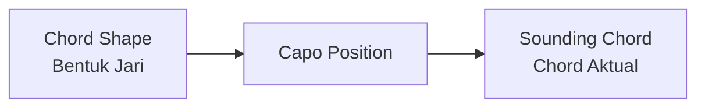
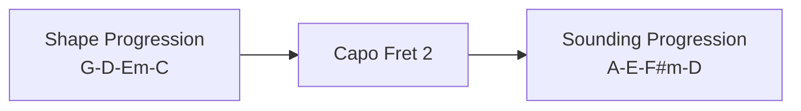
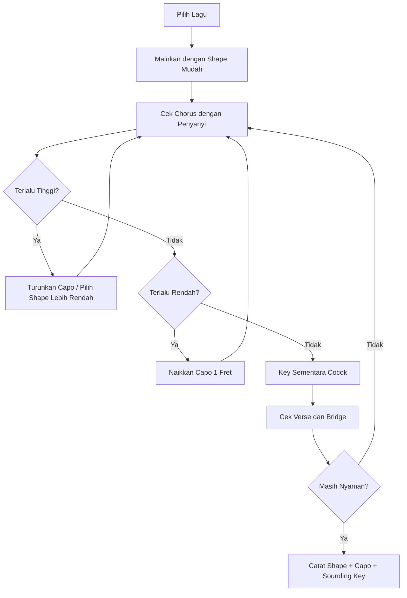
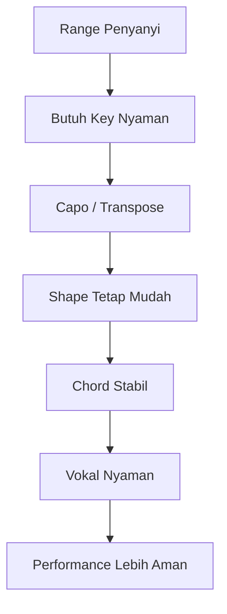

# learn-guitar-accompaniment-part-011.md

# Part 011 — Capo dan Transpose: Menyesuaikan Gitar dengan Suara Penyanyi

## Status Seri

Seri: **Belajar Guitar Accompaniment Berdasarkan The First 20 Hours**  
Bagian: **011 dari 035**  
Fokus: memahami capo dan transpose sebagai alat untuk menyesuaikan iringan gitar dengan range vokal penyanyi, tanpa harus langsung menguasai semua chord sulit.

Pada part sebelumnya, kita membahas harmoni minimum: key, chord family, roman numeral, dan progression umum. Sekarang kita masuk ke salah satu skill paling praktis bagi gitaris pengiring: **mengubah nada dasar lagu agar nyaman untuk penyanyi**.

---

## Tujuan Pembelajaran Part Ini

Setelah menyelesaikan part ini, Anda harus bisa:

1. memahami kenapa penyanyi sering butuh key berbeda dari versi asli;
2. membedakan chord shape dan sounding chord;
3. memahami cara kerja capo secara praktis;
4. memakai capo untuk menaikkan key tanpa mengubah fingering;
5. memahami transpose naik/turun secara sederhana;
6. memakai shape G, C, D, A, dan E sebagai “keluarga bentuk”;
7. mencari key nyaman untuk penyanyi secara praktis;
8. membaca chord chart yang memakai capo;
9. menghindari kesalahan umum saat capo dan transpose;
10. membuat workflow rehearsal sederhana untuk menentukan key.

---

## Prinsip Kaufman yang Dipakai di Part Ini

Dalam *The First 20 Hours*, salah satu prinsip penting adalah menghilangkan hambatan latihan dan fokus pada sub-skill bernilai tinggi.

Capo adalah alat yang sangat bernilai karena:

- mengurangi kebutuhan barre chord di awal;
- memperluas key yang bisa dimainkan;
- membantu menyesuaikan lagu dengan range penyanyi;
- memungkinkan Anda memakai chord shape yang sudah dikuasai;
- mempercepat kemampuan tampil dengan repertoire lebih banyak;
- mengurangi friction saat rehearsal.

Target kita bukan menjadi master transposition dalam semua key. Target 20 jam pertama:

> Bisa memakai capo dan transpose sederhana agar penyanyi nyaman, sambil tetap memainkan chord shape yang stabil.

---

# 1. Kenapa Penyanyi Butuh Transpose?

Setiap penyanyi punya range vokal: wilayah nada yang nyaman dinyanyikan.

Sebuah lagu bisa terasa:

- terlalu tinggi;
- terlalu rendah;
- nyaman di verse tetapi terlalu tinggi di chorus;
- nyaman untuk penyanyi asli tetapi tidak cocok untuk penyanyi Anda;
- cocok saat latihan pelan tetapi berat saat performance penuh.

Gitaris pemula sering berpikir:

> Lagu ini chord-nya G-D-Em-C, jadi penyanyi harus ikut.

Pengiring yang baik berpikir:

> Apakah key ini membuat penyanyi bisa menyampaikan lagu dengan nyaman, stabil, dan emosional?

Gitar melayani vokal. Bukan sebaliknya.

---

# 2. Range, Tessitura, dan Comfort Zone

Untuk 20 jam pertama, tidak perlu teori vokal mendalam. Tapi pahami tiga konsep praktis.

## 2.1 Range

Range adalah jarak nada terendah sampai tertinggi yang bisa dinyanyikan penyanyi.

Namun range maksimum bukan berarti nyaman.

## 2.2 Tessitura

Tessitura adalah area nada yang paling sering dipakai dalam lagu.

Lagu bisa punya satu nada tinggi sebentar, tetapi jika hampir semua chorus berada tinggi, itu lebih melelahkan.

## 2.3 Comfort Zone

Comfort zone adalah area di mana penyanyi bisa bernyanyi:

- stabil;
- tidak teriak;
- tidak kehilangan tone;
- tidak cepat lelah;
- masih bisa menyampaikan emosi;
- bisa mengontrol napas.

Transpose bertujuan mencari comfort zone ini.

---

# 3. Shape vs Sounding Chord

Ini konsep paling penting dalam capo.

## 3.1 Shape

Shape adalah bentuk jari yang Anda mainkan.

Contoh:

```text
G shape = 320003 atau 320033
C shape = x32010
D shape = xx0232
```

## 3.2 Sounding Chord

Sounding chord adalah chord aktual yang terdengar.

Tanpa capo:

```text
G shape terdengar sebagai G
C shape terdengar sebagai C
D shape terdengar sebagai D
```

Dengan capo fret 2:

```text
G shape terdengar sebagai A
C shape terdengar sebagai D
D shape terdengar sebagai E
```

Jadi ketika capo dipakai, nama shape dan nama suara bisa berbeda.



---

# 4. Cara Kerja Capo

Capo menjepit semua senar di fret tertentu. Secara praktis, capo membuat fret itu menjadi “nut baru”.

Tanpa capo:

```text
Nut asli = fret 0
```

Capo fret 2:

```text
Capo menjadi nut baru di fret 2
Semua open chord naik 2 semitone
```

Setiap fret = 1 semitone.

Maka:

```text
Capo fret 1 = naik 1 semitone
Capo fret 2 = naik 2 semitone
Capo fret 3 = naik 3 semitone
Capo fret 4 = naik 4 semitone
```

---

# 5. Semitone dan Whole Step

Dalam musik Barat:

```text
1 fret = 1 semitone
2 fret = 1 whole step
```

Urutan 12 nada:

```text
C → C#/Db → D → D#/Eb → E → F → F#/Gb → G → G#/Ab → A → A#/Bb → B → C
```

Jika Anda naik 2 fret dari G:

```text
G → G# → A
```

Jadi:

```text
G shape + capo fret 2 = A sound
```

---

# 6. Tabel Capo Sederhana untuk G Shape

Jika Anda memainkan shape G:

| Capo | Sounding Key |
|---:|---|
| none | G |
| 1 | G#/Ab |
| 2 | A |
| 3 | A#/Bb |
| 4 | B |
| 5 | C |
| 6 | C#/Db |
| 7 | D |

Contoh:

```text
Shape progression:
G - D - Em - C

Capo 2 sounding:
A - E - F#m - D
```

Anda tidak perlu memainkan F#m sebagai barre chord. Anda cukup memainkan Em shape dengan capo 2.

---

# 7. Tabel Capo untuk C Shape

Jika memainkan shape C:

| Capo | Sounding Key |
|---:|---|
| none | C |
| 1 | C#/Db |
| 2 | D |
| 3 | D#/Eb |
| 4 | E |
| 5 | F |
| 6 | F#/Gb |
| 7 | G |

Contoh:

```text
Shape progression:
C - G - Am - Fmaj7

Capo 2 sounding:
D - A - Bm - Gmaj7-ish
```

Catatan: Fmaj7 shape dengan capo 2 menghasilkan warna yang sejenis maj7 di sounding key. Untuk banyak lagu pop, ini bisa terdengar baik, tetapi jika butuh F major murni dalam shape, perlu pertimbangan voicing.

---

# 8. Tabel Capo untuk D Shape

Jika memainkan shape D:

| Capo | Sounding Key |
|---:|---|
| none | D |
| 1 | D#/Eb |
| 2 | E |
| 3 | F |
| 4 | F#/Gb |
| 5 | G |
| 6 | G#/Ab |
| 7 | A |

D shape sering terdengar bright karena banyak senar tinggi. Cocok untuk lagu tertentu, tetapi bisa terasa terlalu tipis jika dimainkan sendirian tanpa kontrol.

---

# 9. Tabel Capo untuk A Shape

Jika memainkan shape A:

| Capo | Sounding Key |
|---:|---|
| none | A |
| 1 | A#/Bb |
| 2 | B |
| 3 | C |
| 4 | C#/Db |
| 5 | D |
| 6 | D#/Eb |
| 7 | E |

A shape berguna, tetapi beberapa chord family A melibatkan Bm, C#m, F#m yang sulit jika tanpa capo. Untuk pemula, A shape dipakai selektif.

---

# 10. Tabel Capo untuk E Shape

Jika memainkan shape E:

| Capo | Sounding Key |
|---:|---|
| none | E |
| 1 | F |
| 2 | F#/Gb |
| 3 | G |
| 4 | G#/Ab |
| 5 | A |
| 6 | A#/Bb |
| 7 | B |

E shape terdengar penuh dan kuat, tetapi bisa terlalu bass-heavy untuk beberapa vokal jika tidak dikontrol.

---

# 11. Capo sebagai Compiler Flag

Untuk cara pikir software engineer, capo bisa dimodelkan seperti parameter kompilasi.

Source code:

```text
Shape progression: G - D - Em - C
```

Compiler flag:

```text
capo = 2
```

Output runtime:

```text
Sounding progression: A - E - F#m - D
```



Bentuk jari sama. Output pitch berubah.

---

# 12. Transpose Naik dan Turun

Transpose berarti memindahkan semua chord naik atau turun dengan jarak yang sama.

Contoh lagu di G terlalu rendah untuk penyanyi. Naikkan 2 semitone:

```text
G - D - Em - C
```

Naik 2 semitone menjadi:

```text
A - E - F#m - D
```

Alih-alih belajar F#m langsung, gunakan capo 2 dan tetap main:

```text
G - D - Em - C shape
```

---

# 13. Jika Lagu Terlalu Tinggi

Misal penyanyi tidak kuat chorus.

Solusi:

1. turunkan key;
2. coba shape yang lebih rendah;
3. lepas capo jika ada;
4. pindahkan ke shape family lain;
5. jika masih sulit, ubah arrangement atau pilih lagu lain.

Contoh:

```text
Original: A
Shape: G capo 2
Terlalu tinggi
Coba: G tanpa capo
```

Turun 2 semitone.

---

# 14. Jika Lagu Terlalu Rendah

Misal penyanyi merasa verse terlalu rendah.

Solusi:

1. naikkan capo;
2. naikkan 1 fret dulu;
3. cek chorus;
4. jangan hanya cek verse;
5. pastikan lagu penuh masih nyaman.

Contoh:

```text
Shape: G tanpa capo = key G
Terlalu rendah
Coba capo 1 = Ab
Coba capo 2 = A
```

---

# 15. Cara Mencari Key Nyaman untuk Penyanyi

Gunakan workflow praktis.

## Step 1 — Pilih Shape Mudah

Mulai dengan shape G atau C.

Contoh:

```text
G - D - Em - C
```

## Step 2 — Mainkan Chorus

Jangan mulai dari verse saja. Chorus biasanya lebih tinggi dan paling menentukan.

## Step 3 — Tanya Sensasi Penyanyi

Pertanyaan:

```text
Chorus terlalu tinggi, terlalu rendah, atau nyaman?
Bagian mana yang terasa berat?
Apakah harus teriak?
Apakah verse terlalu rendah?
Apakah tone masih enak?
```

## Step 4 — Geser Capo

Jika terlalu rendah:

```text
naikkan capo 1 fret
```

Jika terlalu tinggi:

```text
turunkan capo atau pilih shape lebih rendah
```

## Step 5 — Cek Lagu Penuh

Setelah chorus cocok, cek verse, bridge, dan final chorus.

## Step 6 — Catat

```text
Song:
Chosen shape:
Capo:
Sounding key:
Reason:
```

---

# 16. Jangan Menilai Key dari Satu Bar

Kesalahan umum:

- mencoba satu bar verse;
- merasa nyaman;
- lalu chorus ternyata terlalu tinggi;
- performance gagal.

Selalu cek:

```text
[ ] nada terendah verse
[ ] nada tertinggi chorus
[ ] bagian paling panjang
[ ] final chorus saat energi sudah habis
```

Penyanyi bisa kuat satu nada tinggi sekali, tetapi tidak kuat mengulangnya berkali-kali.

---

# 17. Shape Family untuk Pemula

## 17.1 G Shape Family

Chord umum:

```text
G
C
D
Em
Am
```

Progression:

```text
G - D - Em - C
Em - C - G - D
G - C - D
```

Kelebihan:

- sangat ramah pemula;
- penuh;
- cocok untuk acoustic;
- sangat kompatibel dengan capo.

Kekurangan:

- key tanpa capo = G, mungkin terlalu rendah/tinggi untuk beberapa penyanyi;
- beberapa voicing bisa terlalu bright jika memakai G modern 320033 terus.

## 17.2 C Shape Family

Chord umum:

```text
C
G
Am
Fmaj7
Dm
Em
```

Kelebihan:

- bagus untuk ballad;
- banyak lagu pop;
- mudah memahami teori;
- Fmaj7 memberi warna lembut.

Kekurangan:

- F bisa jadi bottleneck;
- C ke G bisa lambat;
- dengan capo tinggi bisa terasa terlalu bright.

## 17.3 D Shape Family

Chord umum:

```text
D
G
A
Em
```

Kelebihan:

- bright;
- cocok untuk lagu tertentu;
- D-G-A relatif useful.

Kekurangan:

- Bm/F#m sulit;
- D shape butuh akurasi string start.

## 17.4 E Shape Family

Chord umum:

```text
E
A
B
C#m
F#m
```

Untuk pemula, B, C#m, F#m sulit. Jadi E family belum prioritas kecuali lagu sederhana.

---

# 18. Capo Chart untuk I–V–vi–IV dengan G Shape

Shape:

```text
G - D - Em - C
```

| Capo | Sounding Progression |
|---:|---|
| 0 | G - D - Em - C |
| 1 | Ab - Eb - Fm - Db |
| 2 | A - E - F#m - D |
| 3 | Bb - F - Gm - Eb |
| 4 | B - F# - G#m - E |
| 5 | C - G - Am - F |
| 6 | Db - Ab - Bbm - Gb |
| 7 | D - A - Bm - G |

Dengan satu shape progression, Anda bisa menjangkau banyak key.

Namun capo terlalu tinggi bisa membuat gitar terdengar tipis. Biasanya fret 0–5 paling umum untuk acoustic accompaniment awal.

---

# 19. Capo Chart untuk I–V–vi–IV dengan C Shape

Shape:

```text
C - G - Am - F
```

| Capo | Sounding Progression |
|---:|---|
| 0 | C - G - Am - F |
| 1 | Db - Ab - Bbm - Gb |
| 2 | D - A - Bm - G |
| 3 | Eb - Bb - Cm - Ab |
| 4 | E - B - C#m - A |
| 5 | F - C - Dm - Bb |
| 6 | Gb - Db - Ebm - B |
| 7 | G - D - Em - C |

Catatan: jika memakai Fmaj7 simplified, warna chord IV menjadi maj7-ish. Biasanya aman untuk pop/ballad, tetapi tetap dengarkan.

---

# 20. Membaca Chord Chart dengan Capo

Chord chart sering menulis:

```text
Capo 2
G D Em C
```

Artinya:

- pasang capo di fret 2;
- mainkan shape G D Em C;
- suara aktual bukan G D Em C, tetapi A E F#m D.

Untuk bermain sendiri dengan penyanyi, shape cukup. Untuk komunikasi dengan keyboardist/bassist, sounding chord penting.

---

# 21. Komunikasi dengan Musisi Lain

Jika hanya gitar dan vokal:

```text
"Kita pakai capo 2, shape G."
```

Cukup.

Jika ada keyboard/bass/violin:

```text
"Sounding key A. G shape capo 2."
```

Karena keyboard tidak memakai capo. Mereka perlu chord aktual:

```text
A - E - F#m - D
```

Jangan membuat band lain mengikuti shape gitar Anda.

---

# 22. Kesalahan Umum Capo

## 22.1 Capo Dipasang Tidak Rata

Gejala:

- beberapa senar fals;
- buzzing;
- chord terdengar aneh.

Fix:

- pasang capo dekat fret, bukan di tengah ruang fret;
- pastikan semua senar tertekan;
- tune ulang setelah pasang capo jika perlu.

## 22.2 Capo Terlalu Jauh dari Fret

Gejala:

- buzzing;
- butuh tekanan lebih besar.

Fix:

```text
Pasang capo sedikit di belakang fret logam.
```

## 22.3 Capo Terlalu Kuat

Gejala:

- nada menjadi sharp;
- tuning berubah.

Fix:

- gunakan capo dengan tekanan yang sesuai;
- tune ulang setelah pasang.

## 22.4 Lupa Bahwa Sounding Key Berubah

Gejala:

- komunikasi dengan musisi lain kacau;
- penyanyi bingung saat referensi key.

Fix:

- selalu catat shape dan sounding key.

## 22.5 Menaikkan Capo Tanpa Cek Chorus

Gejala:

- verse nyaman;
- chorus terlalu tinggi.

Fix:

- cek bagian tertinggi lagu.

---

# 23. Transpose Manual Sederhana

Jika tidak memakai capo, Anda perlu memindahkan chord satu per satu.

Contoh naik 2 semitone:

```text
C → D
G → A
Am → Bm
F → G
```

Maka:

```text
C - G - Am - F
```

menjadi:

```text
D - A - Bm - G
```

Masalah: Bm sulit untuk pemula. Maka mungkin lebih baik:

```text
C shape capo 2
```

Tetap main:

```text
C - G - Am - F
```

Terdengar:

```text
D - A - Bm - G
```

---

# 24. Circle of Fifths Tidak Wajib Dulu

Circle of fifths berguna untuk teori, key signature, dan relasi antar-key. Tetapi untuk 20 jam pertama, jangan jadikan prasyarat.

Yang lebih penting:

- tahu semitone naik/turun;
- tahu capo menaikkan key;
- tahu shape vs sound;
- tahu key nyaman penyanyi;
- tahu chord family G dan C;
- tahu progression umum.

Circle of fifths bisa dipelajari setelah fungsi praktis ini kuat.

---

# 25. Decision Tree Menentukan Capo



---

# 26. Practical Workflow Rehearsal

Gunakan template ini.

```text
Song:
Original key:
Initial shape:
Initial capo:
Singer feedback:
Tested capo positions:
Chosen capo:
Sounding key:
Hardest vocal section:
Guitar difficulty:
Final decision:
```

Contoh:

```text
Song: Practice Song
Original key: A
Initial shape: G
Initial capo: 2
Singer feedback: chorus sedikit tinggi
Tested capo positions: 2, 1, 0
Chosen capo: 1
Sounding key: Ab
Hardest vocal section: final chorus
Guitar difficulty: easy
Final decision: G shape capo 1
```

---

# 27. Jika Capo Tidak Cukup

Kadang capo tidak menyelesaikan semua.

Masalah:

- lagu terlalu tinggi bahkan tanpa capo;
- lagu terlalu rendah tetapi capo tinggi membuat gitar terlalu tipis;
- shape mudah menghasilkan voicing yang tidak cocok;
- penyanyi butuh key yang membuat chord gitar sulit.

Solusi:

1. coba shape family lain;
2. sederhanakan chord;
3. ubah arrangement;
4. gunakan tuning berbeda nanti, bukan prioritas awal;
5. pilih lagu lain untuk fase 20 jam;
6. belajar barre chord secara bertahap setelah fondasi.

---

# 28. Key vs Mood

Mengubah key bisa memengaruhi mood.

Naik key:

- bisa terasa lebih terang;
- bisa memberi energi lebih;
- bisa membuat vokal lebih tegang/intens.

Turun key:

- bisa terasa lebih warm;
- lebih intimate;
- bisa membuat chorus kurang meledak jika terlalu rendah.

Jadi pilih key bukan hanya berdasarkan “bisa mencapai nada”, tetapi juga:

```text
Apakah emosi lagu masih keluar?
Apakah vokal terdengar natural?
Apakah penyanyi masih bisa artikulasi?
Apakah final chorus masih kuat?
```

---

# 29. Capo dan Tone Gitar

Capo juga mengubah warna gitar.

Semakin tinggi capo:

- scale length efektif lebih pendek;
- suara lebih bright;
- chord terdengar lebih kecil/tinggi;
- bisa cocok untuk shimmer;
- bisa kurang body jika terlalu tinggi.

Capo rendah:

- suara lebih penuh;
- bass lebih kuat;
- cocok untuk solo acoustic;
- bisa terlalu berat jika vokal rendah.

Sebagai aturan praktis:

```text
Capo 0–3: sering aman
Capo 4–5: masih umum, lebih bright
Capo 6+: gunakan jika memang cocok, tapi cek tone
```

---

# 30. Latihan Capo 45 Menit

## Block 1 — Shape vs Sound, 10 Menit

Mainkan:

```text
G - D - Em - C
```

Tanpa capo. Catat:

```text
Sounding key: G
```

Pasang capo 2. Mainkan shape sama. Catat:

```text
Sounding key: A
```

Dengarkan perubahan.

## Block 2 — Capo Ladder, 10 Menit

Mainkan G shape progression dengan capo:

```text
0, 1, 2, 3
```

Dengarkan:

- key naik;
- tone berubah;
- feel berubah.

## Block 3 — Singer Simulation, 10 Menit

Nyanyikan atau hum chorus sederhana.

Coba:

```text
capo 0
capo 1
capo 2
```

Catat mana paling nyaman.

## Block 4 — C Shape Comparison, 10 Menit

Mainkan:

```text
C - G - Am - Fmaj7
```

Tanpa capo dan capo 2.

Bandingkan dengan G shape capo 5 jika ingin sounding key C.

## Block 5 — Documentation, 5 Menit

Isi:

```text
Progression:
Shape:
Capo:
Sounding key:
Comfort:
Tone:
```

---

# 31. Latihan 15 Menit

```text
2 menit  tuning
3 menit  G-D-Em-C tanpa capo
3 menit  G-D-Em-C capo 2
3 menit  C-G-Am-Fmaj7 tanpa capo
3 menit  C-G-Am-Fmaj7 capo 2
1 menit  catat perbedaan rasa
```

Jika hanya 5 menit:

```text
2 menit  G-D-Em-C tanpa capo
2 menit  G-D-Em-C capo 2
1 menit  sebutkan sounding key
```

---

# 32. Mini Project Part Ini

Pilih satu progression:

```text
G - D - Em - C
```

Buat 3 versi:

```text
Version 1: no capo, sounding key G
Version 2: capo 2, sounding key A
Version 3: capo 5, sounding key C
```

Rekam masing-masing 30 detik.

Catat:

```text
Mana yang paling nyaman dinyanyikan?
Mana yang tone gitarnya paling enak?
Mana yang terasa terlalu bright?
Mana yang paling cocok untuk performance?
```

Target:

> Anda mengalami langsung bahwa shape sama bisa menghasilkan key dan warna berbeda.

---

# 33. Capo Sheet Template

Gunakan format ini untuk setiap lagu.

```text
Title:
Singer:
Original key:
Chosen shape:
Capo:
Sounding key:
Progression shape:
Progression sounding:
Highest vocal section:
Lowest vocal section:
Reason for chosen key:
Backup capo option:
Notes:
```

Contoh:

```text
Title: Song A
Singer: X
Original key: A
Chosen shape: G
Capo: 2
Sounding key: A
Progression shape: G-D-Em-C
Progression sounding: A-E-F#m-D
Highest vocal section: final chorus
Lowest vocal section: verse 1
Reason: chorus comfortable, guitar easy
Backup option: capo 1 if singer tired
Notes: chorus strum fuller
```

---

# 34. Kesalahan Engineer-Minded dalam Capo/Transpose

## 34.1 Menganggap Capo sebagai Cheat

Capo bukan cheat. Capo adalah alat arrangement.

## 34.2 Terlalu Fokus pada Chord Aktual

Untuk gitar solo/vokal, shape lebih penting saat eksekusi. Sounding key penting untuk komunikasi.

## 34.3 Mengabaikan Vokal karena Chord Gitar Nyaman

Ini kesalahan besar pengiring. Lagu harus nyaman untuk penyanyi.

## 34.4 Ingin Menguasai Semua Key Tanpa Capo Terlebih Dahulu

Itu bagus untuk jangka panjang, tetapi tidak perlu untuk target 20 jam pertama.

## 34.5 Tidak Mencatat Keputusan

Saat rehearsal, jangan mengandalkan ingatan.

Catat:

```text
Song X = G shape capo 2, sounding A
```

---

# 35. Debugging Matrix Capo/Transpose

| Symptom | Kemungkinan Penyebab | Fix |
|---|---|---|
| Penyanyi teriak di chorus | key terlalu tinggi | turunkan capo/key |
| Verse terlalu rendah | key terlalu rendah | naikkan capo/key |
| Gitar fals setelah capo | capo menarik senar sharp | pasang ulang, tune ulang |
| Chord terdengar buzzing | capo terlalu jauh dari fret | geser dekat fret |
| Band bingung chord | shape vs sound tercampur | sebut sounding key |
| Tone terlalu tipis | capo terlalu tinggi | coba shape lain/capo lebih rendah |
| Chord terlalu sulit | transposition manual menghasilkan barre | pakai capo/shape family lain |
| Final chorus lemah | key terlalu tinggi atau rendah | cek ulang comfort zone |

---

# 36. Acceptance Criteria Part 011

Anda boleh lanjut ke part 012 jika:

```text
[ ] Bisa menjelaskan kenapa penyanyi butuh transpose
[ ] Bisa membedakan chord shape dan sounding chord
[ ] Bisa menjelaskan capo menaikkan pitch per fret
[ ] Bisa memainkan G-D-Em-C tanpa capo dan capo 2
[ ] Tahu G shape capo 2 terdengar sebagai A
[ ] Bisa memakai capo untuk mencari key nyaman
[ ] Bisa mencatat shape, capo, dan sounding key
[ ] Bisa membaca chord chart bertuliskan "Capo 2"
[ ] Bisa menjelaskan kapan capo membantu dan kapan tidak cukup
[ ] Bisa membuat capo sheet sederhana untuk satu lagu
```

---

# 37. Ringkasan Mental Model

Capo adalah alat untuk memindahkan pitch sambil mempertahankan bentuk tangan.



Pengiring yang baik tidak memaksa penyanyi masuk ke key gitar. Pengiring yang baik menyesuaikan gitar agar vokal bisa hidup.

---

# 38. Output Part Ini

Output konkret:

1. Anda memahami capo.
2. Anda tahu shape vs sounding chord.
3. Anda bisa menaikkan key dengan capo.
4. Anda bisa mencari key nyaman untuk penyanyi.
5. Anda bisa mencatat keputusan capo.
6. Anda siap masuk ke topik hubungan gitar dan vokal.

Part berikutnya:

> **Mengiringi Vokal: Gitar Harus Bernapas Bersama Penyanyi.**

