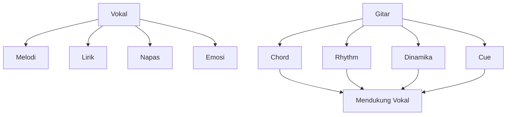
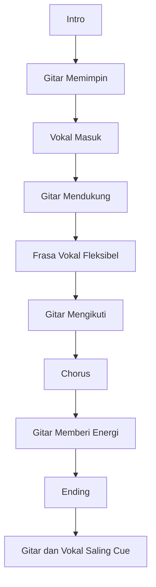
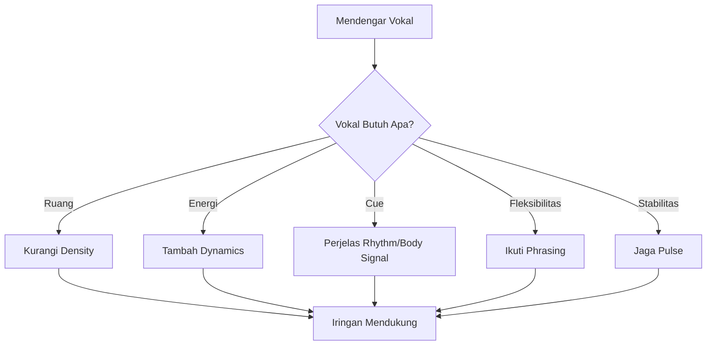
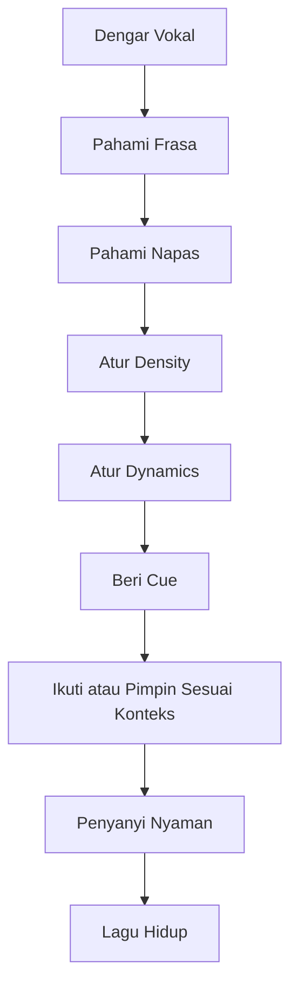

# learn-guitar-accompaniment-part-012.md

# Part 012 — Mengiringi Vokal: Gitar Harus Bernapas Bersama Penyanyi

## Status Seri

Seri: **Belajar Guitar Accompaniment Berdasarkan The First 20 Hours**  
Bagian: **012 dari 035**  
Fokus: memahami bahwa gitar pengiring bukan pusat pertunjukan; gitar harus mendukung napas, frasa, emosi, dan timing penyanyi.

Pada part sebelumnya, kita membahas capo dan transpose agar key sesuai dengan penyanyi. Sekarang kita masuk ke aspek yang lebih musikal: bagaimana gitar berinteraksi dengan vokal secara real-time.

---

## Tujuan Pembelajaran Part Ini

Setelah menyelesaikan part ini, Anda harus bisa:

1. memahami penyanyi sebagai pusat iringan;
2. memahami frasa vokal dan napas;
3. menghindari strumming yang menabrak lirik;
4. memberi ruang untuk kata penting;
5. memahami kapan gitar harus ramai dan kapan harus diam;
6. memberi cue masuk, naik, turun, dan selesai;
7. mengikuti penyanyi tanpa kehilangan tempo;
8. memahami rubato ringan secara praktis;
9. membangun komunikasi rehearsal dengan penyanyi;
10. melakukan recovery ketika penyanyi masuk berbeda dari rencana.

---

## Prinsip Kaufman yang Dipakai di Part Ini

Dalam kerangka *The First 20 Hours*, kita harus mendefinisikan target skill secara spesifik. Target kita bukan “bisa gitar” secara umum. Target kita adalah:

> Bisa mengiringi penyanyi.

Maka skill yang harus dilatih bukan hanya chord, strumming, dan capo. Anda juga harus melatih **awareness terhadap vokal**.

Ini adalah sub-skill yang sering diabaikan pemula. Banyak gitaris pemula sibuk memantau tangan sendiri sampai lupa mendengar penyanyi.

Dalam performance nyata, pengiring yang baik harus mendengar:

- kapan penyanyi bernapas;
- kapan lirik penting muncul;
- kapan penyanyi masuk terlambat;
- kapan penyanyi butuh ruang;
- kapan chorus butuh dorongan;
- kapan ending harus mengikuti vokal.

---

# 1. Prinsip Utama: Penyanyi adalah Pusat

Jika formatnya gitar + vokal, maka pusat perhatian biasanya adalah vokal.

Gitar berfungsi sebagai:

- harmonic support;
- rhythmic floor;
- emotional framing;
- cue provider;
- dynamic partner.

Gitar bukan:

- mesin volume;
- pengisi semua ruang kosong;
- pusat teknik;
- pesaing vokal;
- alat untuk membuktikan kemampuan.



Prinsip praktis:

> Jika gitar membuat penyanyi terdengar lebih buruk, iringan itu gagal walau chord-nya benar.

---

# 2. Frasa Vokal

Frasa vokal adalah unit kalimat musikal.

Seperti kalimat dalam bahasa, frasa vokal punya:

- awal;
- tekanan;
- puncak;
- akhir;
- napas;
- makna.

Contoh sederhana:

```text
Aku ingin pulang
ke tempat yang dulu
menyimpan namamu
```

Penyanyi tidak menyanyikan ini sebagai stream datar. Ada napas dan tekanan.

Sebagai gitaris, Anda perlu mendengar:

```text
Di mana penyanyi mulai?
Di mana ia bernapas?
Kata mana yang penting?
Di mana frasa selesai?
Apakah gitar terlalu ramai di sana?
```

---

# 3. Napas

Penyanyi adalah instrumen yang bernapas. Gitar tidak perlu bernapas secara fisik, tetapi harus memberi ruang napas secara musikal.

Momen napas biasanya terjadi:

- sebelum verse mulai;
- antara dua baris lirik;
- sebelum nada tinggi;
- sebelum chorus;
- sebelum final phrase;
- setelah line emosional.

Jika gitar terus strumming penuh tanpa ruang, penyanyi bisa terasa dikejar.

---

# 4. Gitar Harus Bernapas

“Gitar bernapas” berarti:

- tidak mengisi semua subdivision;
- memberi ruang antar-strum;
- menurunkan volume saat lirik padat;
- mengurangi accent saat kata penting;
- memakai sustain;
- memakai silence;
- mengikuti arc vokal.

Contoh buruk:

```text
Vokal: lirik padat, emosional
Gitar: strumming penuh keras terus-menerus
```

Contoh lebih baik:

```text
Vokal: lirik padat
Gitar: sparse strum, accent ringan, chord sustain
```

---

# 5. Density: Seberapa Padat Iringan?

Density adalah jumlah aktivitas gitar dalam satu waktu.

## 5.1 Low Density

Contoh:

```text
D - - - D - - -
```

Cocok untuk:

- verse lembut;
- lirik padat;
- intro intimate;
- bagian setelah chorus besar;
- penyanyi butuh ruang.

## 5.2 Medium Density

Contoh:

```text
D - D U D - D U
```

Cocok untuk:

- verse kedua;
- pre-chorus;
- ballad mengalir;
- lagu sedang.

## 5.3 High Density

Contoh:

```text
D - D U - U D U
D U D U D U D U
```

Cocok untuk:

- chorus;
- final chorus;
- bagian energetic;
- audience sing-along.

Pengiring yang baik bisa mengatur density.

---

# 6. Jangan Menabrak Lirik

Menabrak lirik berarti gitar terlalu aktif pada momen vokal yang butuh fokus.

Contoh momen rentan:

- kata emosional;
- nada panjang;
- awal kalimat;
- akhir kalimat;
- lirik dengan konsonan penting;
- bagian vokal pelan;
- nada tinggi yang butuh support, bukan gangguan.

Cara menghindari:

```text
[ ] turunkan volume
[ ] kurangi strum
[ ] gunakan sustain
[ ] accent setelah kata, bukan di atas kata
[ ] gunakan bass note ringan
[ ] hindari upstroke tajam saat vokal lembut
```

---

# 7. Vocal Entry: Kapan Penyanyi Masuk

Penyanyi harus tahu kapan masuk.

Sebagai gitaris, Anda memberi informasi lewat:

- count-in;
- intro length;
- chord progression;
- eye contact;
- body movement;
- strum accent;
- final bar sebelum vokal.

## Contoh

Intro:

```text
| G | D | Em | C |
```

Penyanyi masuk setelah C.

Cue:

- di bar C, kurangi gerakan;
- lihat penyanyi;
- berikan nod kecil;
- strum beat 4 sedikit jelas;
- masuk verse di beat 1.

---

# 8. Cue Non-Verbal

Dalam performance, komunikasi sering non-verbal.

Cue umum:

```text
Nod kepala      = masuk / lanjut
Eye contact     = siap-siap
Body lift       = chorus naik
Small slowdown  = ending
Strum stop      = break
Big final strum = selesai
```

Rehearsal harus menyepakati cue.

Jangan berharap penyanyi membaca pikiran Anda.

---

# 9. Call and Response Sederhana

Call and response berarti satu pihak memberi frase, pihak lain merespons.

Dalam gitar-vokal:

- vokal menyanyi line;
- gitar mengisi ruang setelah line;
- vokal masuk lagi.

Contoh:

```text
Vokal: "Aku masih di sini..."
Gitar: strum ringan / bass run kecil
Vokal: "menunggu pagi..."
```

Untuk 20 jam pertama, response gitar harus sangat sederhana:

- satu strum;
- arpeggio pendek;
- bass note;
- sus chord ringan;
- jangan fill terlalu panjang.

Rule:

> Isi ruang hanya jika ruang itu memang kosong.

---

# 10. Kapan Gitar Harus Diam?

Diam adalah bagian dari musik.

Gitar bisa diam atau mengurangi aktivitas saat:

- penyanyi masuk line penting;
- ada kata emosional;
- sebelum chorus;
- setelah lirik berat;
- ending;
- break;
- verse pertama;
- bridge intimate.

Pemula takut diam karena merasa harus “terus memainkan sesuatu”. Padahal silence bisa membuat lagu lebih kuat.

---

# 11. Kapan Gitar Harus Ramai?

Gitar boleh lebih ramai saat:

- chorus;
- final chorus;
- bagian audience sing-along;
- lirik tidak terlalu padat;
- penyanyi butuh dorongan energi;
- arrangement memang butuh lift;
- pre-chorus build.

Tetap ingat:

> Ramai bukan berarti keras terus. Ramai berarti density dan energi meningkat secara terkontrol.

---

# 12. Rubato Ringan

Rubato berarti tempo sedikit fleksibel untuk ekspresi.

Dalam accompaniment vokal, rubato sering terjadi di:

- intro ballad;
- akhir verse;
- sebelum chorus;
- bridge emosional;
- ending;
- final note.

Namun rubato harus dibedakan dari tempo kacau.

## 12.1 Rubato Baik

- disengaja;
- mengikuti vokal;
- bisa diulang;
- penyanyi dan gitaris sama-sama sadar;
- kembali ke pulse setelahnya.

## 12.2 Tempo Kacau

- terjadi karena panik;
- chord sulit;
- tidak menghitung;
- penyanyi bingung;
- tidak bisa diulang.

Untuk 20 jam pertama:

```text
Stabil dulu, rubato sedikit saja.
```

---

# 13. Following vs Leading

Dalam duet gitar-vokal, kadang gitar memimpin, kadang mengikuti.

## 13.1 Gitar Memimpin

Gitar memimpin saat:

- count-in;
- intro;
- menetapkan tempo;
- memberi cue chorus;
- memberi cue ending;
- menjaga struktur.

## 13.2 Gitar Mengikuti

Gitar mengikuti saat:

- penyanyi mengambil napas lebih lama;
- penyanyi menahan nada;
- penyanyi masuk sedikit terlambat;
- ending mengikuti frasa vokal;
- momen emosional butuh fleksibilitas.

Pengiring yang baik bisa berganti mode.



---

# 14. Jangan Mengikuti Penyanyi Sampai Kehilangan Pulse

Mengikuti penyanyi bukan berarti menyerah total pada timing yang tidak stabil.

Jika penyanyi sedikit terlambat secara musikal, ikuti.

Jika penyanyi kehilangan beat, Anda perlu menjaga pulse agar lagu tidak runtuh.

Ini keseimbangan:

```text
Terlalu kaku  = penyanyi terasa dipaksa
Terlalu ikut  = lagu kehilangan tempo
Ideal         = fleksibel tetapi punya pusat pulse
```

Untuk pemula, prioritas:

1. jaga pulse;
2. beri ruang;
3. ikuti momen jelas seperti ending;
4. jangan rubato berlebihan.

---

# 15. Volume Balance

Masalah paling umum pengiring pemula:

> Gitar terlalu keras.

Terutama acoustic steel-string dengan strumming penuh.

Checklist:

```text
[ ] Apakah lirik terdengar jelas?
[ ] Apakah consonant vokal tertutup?
[ ] Apakah penyanyi harus bernyanyi lebih keras karena gitar?
[ ] Apakah verse terlalu penuh?
[ ] Apakah chorus masih punya ruang naik?
```

Jika gitar terlalu keras:

- strum lebih kecil;
- gunakan pick lebih ringan;
- kurangi bass;
- gunakan sparse pattern;
- main dekat neck untuk tone lebih lembut;
- palm mute ringan;
- dengarkan dari rekaman, bukan hanya dari posisi pemain.

---

# 16. Register dan Frekuensi

Gitar dan vokal bisa bertabrakan di range tertentu.

Gitar acoustic memiliki:

- bass dari senar 6/5;
- mid dari chord body;
- treble dari senar 1/2/3.

Vokal juga banyak berada di midrange.

Jika gitar terlalu banyak mid/treble keras, vokal bisa tertutup.

Solusi sederhana:

- saat vokal padat, strum lebih ringan;
- jangan accent upstroke terlalu tajam;
- gunakan bass-light strum;
- biarkan chord sustain;
- saat vokal berhenti, baru isi sedikit.

---

# 17. Strumming Around the Vocal

Jangan hanya strum “di atas” vokal. Strum bisa mengelilingi vokal.

Contoh:

```text
Vokal masuk di beat 1
Gitar jangan menghantam beat 1 terlalu keras
Gitar bisa memberi support ringan di beat 1
Accent lebih terasa di antara frasa
```

Atau:

```text
Vokal menahan nada panjang
Gitar boleh mengisi perlahan di bawahnya
```

Mendengar vokal lebih penting daripada menghafal pattern.

---

# 18. Lirik Padat vs Lirik Renggang

## 18.1 Lirik Padat

Contoh karakter:

```text
banyak suku kata
frasa cepat
kalimat panjang
```

Gitar:

- sparse;
- accent ringan;
- jangan upstroke tajam terus;
- beri ruang.

## 18.2 Lirik Renggang

Contoh:

```text
nada panjang
jeda antar-line
frasa luas
```

Gitar:

- boleh isi lebih banyak;
- boleh arpeggio;
- boleh build;
- boleh response singkat.

---

# 19. Vokal Tinggi

Saat penyanyi masuk nada tinggi:

- jangan tiba-tiba strum terlalu keras;
- beri support harmonic stabil;
- jangan mengubah tempo;
- hindari chord kotor;
- jangan memaksa penyanyi melawan gitar.

Kadang justru gitar sedikit menahan volume agar nada tinggi terasa muncul.

---

# 20. Vokal Pelan / Intimate

Saat penyanyi bernyanyi pelan:

- strum lebih kecil;
- gunakan fingerpicking atau sparse strum;
- kurangi bass;
- hindari pick attack keras;
- beri sustain;
- jangan mengejar tempo terlalu agresif.

Ini sering terjadi di verse pertama, bridge, atau ending.

---

# 21. Rehearsal dengan Penyanyi

Gunakan proses yang jelas.

## Step 1 — Tentukan Key

Gunakan capo/transpose.

## Step 2 — Tentukan Tempo

Coba dengan metronome atau count-in.

## Step 3 — Tentukan Intro

```text
Intro berapa bar?
Penyanyi masuk kapan?
Cue-nya apa?
```

## Step 4 — Tentukan Dynamics

```text
Verse pelan?
Chorus lebih besar?
Bridge turun atau naik?
```

## Step 5 — Tentukan Ending

```text
Stop langsung?
Tahan chord?
Repeat last line?
Ritardando?
```

## Step 6 — Rekam

Dengarkan bersama jika memungkinkan.

---

# 22. Pertanyaan yang Harus Ditanyakan ke Penyanyi

Gunakan pertanyaan konkret:

```text
Key ini terlalu tinggi, rendah, atau nyaman?
Bagian mana paling berat?
Intro satu putaran cukup?
Kamu mau masuk setelah bar ini?
Chorus mau aku buka lebih besar?
Bridge mau turun dulu?
Ending tahan atau stop?
Tempo ini terlalu cepat?
Kamu butuh ruang di line ini?
```

Hindari pertanyaan terlalu abstrak:

```text
Feel-nya gimana?
Enak nggak?
```

Pertanyaan abstrak boleh, tetapi setelah hal konkret jelas.

---

# 23. Jika Penyanyi Masuk Terlambat

Jangan panik.

Strategi:

1. tetap jaga rhythm;
2. kurangi volume sedikit;
3. ikuti vokal jika hanya terlambat sedikit;
4. jika beda satu bar, ulang progression atau tahan chord;
5. kontak mata;
6. lanjutkan.

Jangan langsung berhenti kecuali rehearsal memang berhenti untuk memperbaiki.

---

# 24. Jika Penyanyi Masuk Terlalu Cepat

Strategi:

1. dengarkan apakah masih masuk akal;
2. jika bisa, ikuti ke section vokal;
3. jika chord belum sampai, gunakan chord yang paling cocok sementara;
4. jangan menunjukkan panik;
5. setelah selesai, perbaiki cue.

Masalah ini sering terjadi jika intro tidak jelas.

Solusi jangka panjang:

- count-in jelas;
- intro length disepakati;
- cue sebelum vocal entry.

---

# 25. Jika Penyanyi Mengubah Phrasing

Penyanyi kadang menahan kata lebih lama atau masuk lebih lambat demi ekspresi.

Jika perubahan kecil dan musikal:

- ikuti;
- kurangi strumming;
- beri ruang.

Jika perubahan membuat struktur kacau:

- jaga pulse;
- beri cue;
- diskusikan setelah run.

Saat performance, jangan berdebat dengan gitar. Ikuti sejauh aman.

---

# 26. Jika Penyanyi Lupa Lirik

Gitar harus menjadi safety net.

Strategi:

- terus main progression;
- jangan berhenti;
- turunkan volume sedikit;
- ulang section jika penyanyi memberi sinyal;
- masuk chorus jika memungkinkan;
- gunakan eye contact;
- jangan membuat ekspresi panik.

Dalam rehearsal, latih kemungkinan ini.

---

# 27. Jika Gitaris Salah Chord Saat Vokal Jalan

Strategi:

1. jangan berhenti;
2. kembali ke rhythm;
3. pindah ke chord berikutnya di beat berikutnya;
4. jika chord salah sangat terdengar, turunkan volume sesaat;
5. tetap dengarkan vokal;
6. jangan minta maaf di tengah lagu.

Penyanyi lebih terganggu oleh berhenti total daripada chord salah sesaat.

---

# 28. Jika Tempo Mulai Lari

Jika terlalu cepat:

- kecilkan strumming;
- fokus pada downbeat;
- jangan accent berlebihan;
- tarik napas;
- gunakan tubuh sebagai pulse.

Jika terlalu lambat:

- sederhanakan chord change;
- jangan menunggu chord sempurna;
- tangan kanan tetap bergerak;
- gunakan root/partial chord.

---

# 29. Mengiringi Tanpa Menyanyi Sendiri

Jika Anda tidak bernyanyi, tetap perlu tahu melodi vokal.

Minimal tahu:

```text
vokal masuk kapan
line pertama apa
chorus mulai di kata apa
frasa mana yang tinggi
bagian mana yang butuh ruang
ending mengikuti kata apa
```

Jika Anda tidak tahu vokalnya, Anda mudah menabrak penyanyi.

---

# 30. Latihan dengan Rekaman Vokal

Jika belum ada penyanyi, gunakan rekaman asli atau karaoke vocal.

Latihan:

1. mainkan gitar mengikuti vokal asli;
2. turunkan volume gitar agar bisa mendengar vokal;
3. fokus vocal entry;
4. catat bagian gitar menabrak vokal;
5. ulangi dengan strumming lebih sparse;
6. rekam diri Anda.

Tujuan:

> Belajar mendengar vokal sambil bermain.

---

# 31. Latihan Bernyanyi Pelan Sambil Bermain

Walau Anda bukan penyanyi, nyanyikan/hum pelan.

Ini membantu:

- memahami napas;
- memahami phrasing;
- tahu kapan chord berubah;
- tahu mana bagian sulit;
- melatih koordinasi.

Jangan fokus kualitas vokal. Fokus hubungan gitar-vokal.

---

# 32. Vocal-Aware Strumming Drill

Gunakan progression:

```text
G - D - Em - C
```

Buat vocal phrase imajiner:

```text
Line 1: "Aku berjalan pulang"
Line 2: "mencari sisa terang"
```

Latihan:

- strum sparse saat line berjalan;
- beri sedikit fill setelah line selesai;
- chorus gunakan fuller strum.

Contoh:

```text
Verse:
D - - U D - - U

After vocal line:
D - D U - - - -
```

---

# 33. Cue Drill

Latihan dengan penyanyi atau sendiri:

1. count-in;
2. intro 4 bar;
3. nod sebelum vocal entry;
4. verse 8 bar;
5. build ke chorus;
6. chorus full;
7. ending dengan final chord.

Rekam video, bukan hanya audio.

Cek:

```text
[ ] Cue terlihat?
[ ] Intro jelas?
[ ] Penyanyi tahu masuk?
[ ] Ending yakin?
```

---

# 34. Dynamic Support Map

Buat map seperti ini:

```text
Intro:
Gitar memberi tempo, tidak terlalu penuh.

Verse:
Gitar turun, vokal jelas.

Pre-Chorus:
Gitar mulai build.

Chorus:
Gitar full tapi tidak menutup vokal.

Bridge:
Gitar turun atau ubah texture.

Final Chorus:
Gitar paling penuh.

Outro:
Gitar mengikuti vokal dan menyelesaikan.
```

Ini akan diperdalam pada part dinamika, tetapi mulai gunakan sekarang.

---

# 35. Menghindari Overplaying

Overplaying adalah memainkan terlalu banyak.

Gejala:

- fill setiap jeda;
- strumming terus penuh;
- sus chord berlebihan;
- bass run terlalu sering;
- dynamics tidak turun;
- gitar lebih sibuk dari vokal.

Solusi:

```text
[ ] main lebih sedikit
[ ] dengarkan vokal
[ ] isi hanya setelah frasa selesai
[ ] gunakan silence
[ ] ulang rekaman dan cek apakah vokal lebih baik
```

Rule praktis:

> Jika ragu, main lebih sederhana.

---

# 36. Underplaying

Underplaying juga bisa terjadi.

Gejala:

- gitar terlalu kosong;
- penyanyi merasa tidak didukung;
- chorus tidak naik;
- tempo tidak jelas;
- intro tidak memberi cue;
- audience tidak merasakan groove.

Solusi:

- tambah downbeat jelas;
- tambah accent;
- buka strumming di chorus;
- beri cue lebih jelas;
- gunakan dynamic build.

Tujuannya bukan main sedikit terus. Tujuannya main secukupnya.

---

# 37. Balance: Supportive, Not Passive

Pengiring yang baik bukan pasif. Ia aktif mendukung.

Supportive berarti:

- tahu kapan memimpin;
- tahu kapan mengikuti;
- tahu kapan diam;
- tahu kapan build;
- tahu kapan menyederhanakan;
- tahu kapan memberi cue.



---

# 38. Latihan 45 Menit untuk Part Ini

## Block 1 — Listening, 10 Menit

Pilih satu lagu.

Dengarkan vokalnya saja sebisa mungkin.

Catat:

```text
Vocal entry:
Frasa tertinggi:
Bagian paling padat lirik:
Bagian paling emosional:
Napas sebelum chorus:
Ending phrase:
```

## Block 2 — Sparse Accompaniment, 10 Menit

Mainkan progression dengan sparse strum.

Fokus:

- jangan menabrak vokal;
- biarkan ruang;
- jaga tempo.

## Block 3 — Cue Practice, 10 Menit

Latih:

- count-in;
- intro;
- nod masuk;
- chorus build;
- ending.

## Block 4 — Dynamic Contrast, 10 Menit

Mainkan:

```text
Verse: sparse
Chorus: fuller
Bridge: turun
Final chorus: full
```

## Block 5 — Recording Review, 5 Menit

Dengarkan:

```text
[ ] Vokal imajiner/rekaman masih jelas?
[ ] Gitar terlalu ramai?
[ ] Cue masuk jelas?
[ ] Ending yakin?
```

---

# 39. Latihan 15 Menit

```text
3 menit  dengarkan vokal lagu target
3 menit  main verse sparse
3 menit  main chorus fuller
3 menit  latihan intro + vocal entry
3 menit  recording dan review
```

Jika hanya 5 menit:

```text
2 menit  dengarkan vocal entry
2 menit  main intro + cue masuk
1 menit  catat bug
```

---

# 40. Mini Project Part Ini

Pilih satu lagu target.

Buat vocal-aware map:

```text
Title:
Key/capo:
Vocal entry:
Hardest vocal section:
Verse guitar density:
Chorus guitar density:
Bridge treatment:
Cue into chorus:
Cue ending:
Where guitar must be quiet:
Where guitar can fill:
```

Lalu rekam iringan sambil memutar vokal asli atau menyanyi/hum pelan.

Target:

> Gitar terasa mendukung vokal, bukan hanya memainkan chord.

---

# 41. Acceptance Criteria Part 012

Anda boleh lanjut ke part 013 jika:

```text
[ ] Bisa menjelaskan kenapa penyanyi adalah pusat iringan
[ ] Bisa mengidentifikasi vocal entry dalam satu lagu
[ ] Bisa membuat verse lebih sparse agar vokal jelas
[ ] Bisa membuat chorus lebih penuh tanpa menutup vokal
[ ] Bisa memberi cue masuk setelah intro
[ ] Bisa memilih ending yang jelas untuk penyanyi
[ ] Bisa menjelaskan kapan gitar harus diam
[ ] Bisa menjelaskan kapan gitar boleh lebih ramai
[ ] Bisa melakukan recording review dengan fokus vokal
[ ] Bisa membuat vocal-aware map sederhana
```

---

# 42. Ringkasan Mental Model

Mengiringi vokal berarti mendukung manusia yang bernapas, bukan hanya menjalankan progression.



Gitar harus menjadi lantai yang stabil, ruang yang bernapas, dan partner emosional bagi vokal.

---

# 43. Output Part Ini

Output konkret:

1. Anda memahami peran gitar terhadap vokal.
2. Anda bisa mendengar vocal entry.
3. Anda bisa memberi ruang untuk frasa vokal.
4. Anda bisa mengatur density.
5. Anda bisa memberi cue.
6. Anda mulai siap membahas dinamika secara lebih dalam.

Part berikutnya:

> **Dinamika: Dari Sekadar Genjreng Menjadi Musikal.**

