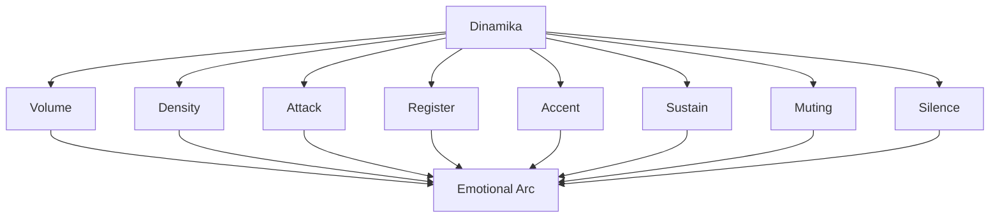
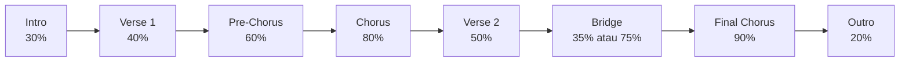
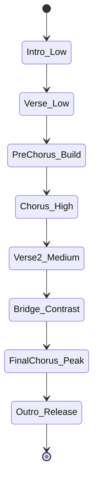
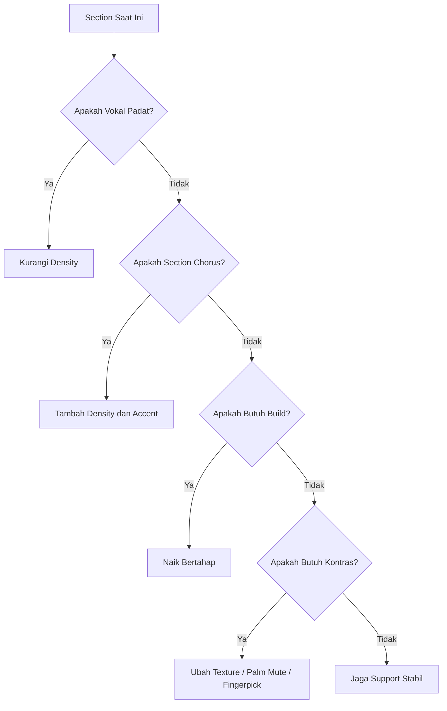
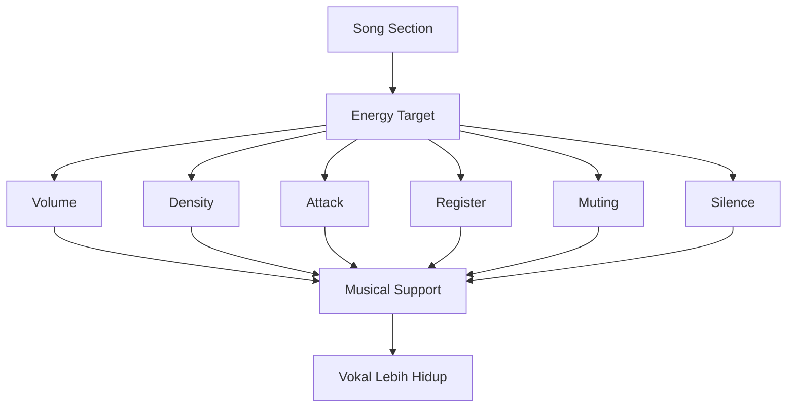

# learn-guitar-accompaniment-part-013.md

# Part 013 — Dinamika: Dari Sekadar Genjreng Menjadi Musikal

## Status Seri

Seri: **Belajar Guitar Accompaniment Berdasarkan The First 20 Hours**  
Bagian: **013 dari 035**  
Fokus: mengubah permainan gitar dari sekadar “memainkan chord dan strumming” menjadi iringan yang punya naik-turun energi, ruang, kontras, dan arah emosional.

Pada part sebelumnya, kita membahas bagaimana gitar harus bernapas bersama vokal. Part ini memperdalam alat utamanya: **dinamika**.

---

## Tujuan Pembelajaran Part Ini

Setelah menyelesaikan part ini, Anda harus bisa:

1. memahami dinamika sebagai lebih dari sekadar keras/pelan;
2. membedakan volume, density, attack, register, sustain, dan accent;
3. membuat verse lebih intim dan chorus lebih terbuka;
4. membangun pre-chorus secara bertahap;
5. membuat bridge kontras;
6. menggunakan palm mute, sparse strum, fuller strum, dan silence;
7. membuat dynamic map untuk satu lagu;
8. menghindari strumming datar dari awal sampai akhir;
9. mendukung vokal tanpa menutupinya;
10. melakukan latihan dinamika secara terukur dan bisa direkam.

---

## Prinsip Kaufman yang Dipakai di Part Ini

Dalam pendekatan *The First 20 Hours*, kita perlu memilih sub-skill yang memberikan dampak besar terhadap performa. Dinamika adalah salah satunya.

Banyak pemula berpikir musik terdengar amatir karena chord kurang banyak atau pattern kurang rumit. Sering kali masalahnya bukan itu. Masalahnya adalah:

```text
Semua bagian lagu dimainkan dengan energi yang sama.
```

Akibatnya:

- verse tidak intim;
- chorus tidak terasa naik;
- bridge tidak kontras;
- final chorus tidak terasa sebagai puncak;
- vokal tertutup;
- lagu terasa datar.

Target kita bukan memainkan teknik sulit. Target kita:

> Bisa mengatur energi gitar agar lagu punya perjalanan emosional.

---

# 1. Apa Itu Dinamika?

Secara sederhana, dinamika sering diartikan sebagai keras dan pelan. Tetapi untuk gitar pengiring, dinamika lebih luas.

Dinamika mencakup:

```text
Volume     = seberapa keras suara
Density    = seberapa padat aktivitas strumming/picking
Attack     = seberapa tajam awal bunyi
Register   = area senar rendah/tinggi yang dominan
Accent     = beat mana yang ditekankan
Sustain    = seberapa lama chord dibiarkan hidup
Muting     = seberapa banyak suara diredam
Silence    = kapan gitar sengaja tidak berbunyi
```



Jika Anda hanya mengatur volume, permainan masih bisa terdengar datar. Dinamika adalah kombinasi semua parameter ini.

---

# 2. Kenapa Dinamika Penting untuk Mengiringi Penyanyi?

Penyanyi punya narasi emosional. Lirik biasanya berkembang dari:

- pembukaan cerita;
- konflik;
- pengakuan;
- puncak;
- resolusi.

Gitar harus membantu perjalanan itu.

Jika gitar bermain penuh dari awal:

- verse kehilangan ruang;
- chorus tidak punya tempat untuk naik;
- penyanyi dipaksa bersaing;
- audience cepat lelah;
- final chorus tidak terasa sebagai puncak.

Jika gitar terlalu pelan terus:

- lagu tidak berkembang;
- penyanyi tidak mendapat dorongan;
- chorus terasa lemah;
- audience tidak merasakan energi.

Pengiring yang baik tahu kapan menahan dan kapan membuka.

---

# 3. Energy Arc Lagu

Banyak lagu populer punya arc seperti ini:

```text
Intro       : rendah
Verse 1     : rendah-sedang
Pre-Chorus  : naik
Chorus      : tinggi
Verse 2     : sedang
Bridge      : kontras
Final Chorus: tertinggi
Outro       : turun / resolve
```

Diagram:



Angka bukan aturan mutlak. Angka hanya membantu Anda berpikir bahwa setiap section punya energi berbeda.

---

# 4. Volume

Volume adalah keras-pelan.

Untuk gitar akustik, volume dikontrol oleh:

- kekuatan strum;
- kedalaman pick mengenai senar;
- area strum;
- pick thickness;
- jumlah senar yang dimainkan;
- palm muting;
- posisi tangan kanan;
- penggunaan kuku/jari/pick;
- jarak ke microphone jika amplified.

## 4.1 Volume Rendah

Cocok untuk:

- intro intim;
- verse pertama;
- lirik padat;
- bagian emosional;
- bridge turun;
- ending lembut.

## 4.2 Volume Sedang

Cocok untuk:

- verse kedua;
- pre-chorus awal;
- interlude;
- chorus kecil.

## 4.3 Volume Tinggi

Cocok untuk:

- chorus;
- final chorus;
- bagian sing-along;
- klimaks.

Namun volume tinggi tidak berarti memukul senar sekeras mungkin. Volume harus tetap musikal.

---

# 5. Density

Density adalah seberapa banyak aktivitas gitar.

Contoh density rendah:

```text
1 & 2 & 3 & 4 &
D - - - D - - -
```

Density sedang:

```text
1 & 2 & 3 & 4 &
D - D U D - D U
```

Density tinggi:

```text
1 & 2 & 3 & 4 &
D - D U - U D U
```

Atau:

```text
D U D U D U D U
```

Density sering lebih efektif daripada volume. Anda bisa membuat chorus terasa naik dengan menambah density, tanpa harus jauh lebih keras.

---

# 6. Attack

Attack adalah karakter awal bunyi.

Attack bisa:

- soft;
- rounded;
- sharp;
- percussive;
- aggressive.

Attack dipengaruhi oleh:

- angle pick;
- kekuatan strum;
- apakah memakai jari atau pick;
- area strum dekat bridge atau soundhole;
- muting;
- kecepatan tangan.

## 6.1 Soft Attack

Cocok untuk:

- ballad;
- verse lembut;
- vokal intim;
- fingerpicking;
- lagu sedih.

## 6.2 Sharp Attack

Cocok untuk:

- chorus energetic;
- pop strumming;
- accent;
- bagian rhythmic.

Namun attack tajam bisa mengganggu vokal jika terlalu sering.

---

# 7. Register

Register adalah area pitch/frekuensi yang dominan.

Pada gitar:

- senar 6/5 = bass/lower register;
- senar 4/3 = mid;
- senar 2/1 = treble/high register.

Anda bisa mengubah dinamika dengan memilih senar.

## 7.1 Bass-Heavy

Cocok untuk:

- memberi fondasi;
- intro kuat;
- folk pattern;
- bagian yang butuh pulse.

Risiko:

- muddy;
- menutupi vokal rendah;
- terdengar berat.

## 7.2 Treble-Light

Cocok untuk:

- shimmer;
- arpeggio;
- verse lembut;
- capo tinggi.

Risiko:

- terlalu tipis;
- terlalu tajam;
- menabrak vokal tinggi.

## 7.3 Balanced Strum

Cocok untuk chorus atau bagian full.

---

# 8. Accent

Accent adalah penekanan beat tertentu.

Contoh accent pada beat 2 dan 4:

```text
1 & 2 & 3 & 4 &
D U D U D U D U
    >       >
```

Accent bisa membuat rhythm hidup tanpa menambah banyak strum.

Untuk accompaniment:

- accent harus mendukung groove;
- jangan menabrak kata penting vokal;
- accent chorus bisa lebih jelas;
- accent verse biasanya lebih ringan.

---

# 9. Sustain

Sustain adalah lamanya chord dibiarkan berbunyi.

Contoh:

```text
Strum chord sekali lalu biarkan berbunyi.
```

Sustain memberi ruang dan emosi.

Cocok untuk:

- intro;
- ending;
- verse lembut;
- setelah lirik penting;
- bridge dramatis;
- final chord.

Pemula sering mengisi setiap ruang kosong. Padahal chord yang dibiarkan sustain bisa lebih kuat.

---

# 10. Muting

Muting mengurangi sustain.

Jenis yang sering dipakai:

## 10.1 Palm Muting

Sisi telapak tangan kanan dekat bridge meredam senar.

Cocok untuk:

- verse;
- build-up;
- rhythm yang lebih percussive;
- mengurangi volume;
- memberi rasa tegang.

## 10.2 Left-Hand Muting

Tangan kiri melepas tekanan tetapi tetap menyentuh senar, menghasilkan suara percussive.

Cocok untuk:

- stop;
- rhythmic accent;
- transition;
- recovery saat chord telat.

## 10.3 Full Stop

Semua senar dimatikan.

Cocok untuk:

- break sebelum chorus;
- ending;
- accent dramatis.

---

# 11. Silence

Silence bukan kekosongan. Silence adalah keputusan musikal.

Silence bisa digunakan untuk:

- memberi ruang vokal;
- membuat kata penting menonjol;
- menciptakan tension;
- menandai stop-time;
- memberi efek dramatis sebelum chorus;
- membuat ending lebih jelas.

Contoh:

```text
Pre-chorus build...
Stop 1 beat
Chorus masuk penuh
```

Namun silence butuh timing. Jika tidak yakin, gunakan sparse strum dulu.

---

# 12. Verse vs Chorus

Perbedaan paling penting bagi pemula:

```text
Verse harus memberi ruang.
Chorus harus terasa lebih terbuka.
```

## 12.1 Verse

Gunakan:

- volume rendah-sedang;
- density rendah;
- attack soft;
- accent ringan;
- lebih banyak sustain;
- palm mute ringan;
- strum sebagian senar.

Contoh pattern:

```text
D - - U D - - U
```

Atau:

```text
D - - - D - - -
```

## 12.2 Chorus

Gunakan:

- volume lebih besar;
- density lebih tinggi;
- strum lebih penuh;
- accent lebih jelas;
- attack lebih terbuka;
- lebih banyak senar.

Contoh:

```text
D - D U - U D U
```

Atau:

```text
D U D U D U D U
```

---

# 13. Pre-Chorus sebagai Build

Pre-chorus sering berfungsi sebagai tanjakan menuju chorus.

Cara membangun:

1. mulai dari density verse;
2. tambah accent;
3. tambah volume sedikit;
4. tambah strum menjelang akhir;
5. jangan langsung full chorus;
6. sisakan ruang agar chorus terasa masuk.

Contoh:

```text
Verse:
D - - U D - - U

Pre-Chorus awal:
D - D U D - - U

Pre-Chorus akhir:
D - D U D - D U

Chorus:
D - D U - U D U
```

---

# 14. Bridge sebagai Kontras

Bridge tidak harus lebih keras. Bridge harus berbeda.

Pilihan bridge:

## 14.1 Bridge Turun

- palm mute;
- sparse strum;
- fingerpicking;
- volume kecil;
- vokal lebih dekat.

Cocok untuk lagu emosional.

## 14.2 Bridge Naik

- strumming makin intens;
- accent kuat;
- tension menuju final chorus.

Cocok untuk anthem/pop besar.

## 14.3 Bridge Berhenti Sebentar

- stop-time;
- final line vocal exposed;
- chorus masuk besar.

Butuh rehearsal.

---

# 15. Final Chorus

Final chorus sering menjadi puncak.

Cara membuat final chorus lebih besar daripada chorus pertama:

- strum lebih penuh;
- accent lebih jelas;
- naikkan density;
- buka palm mute;
- gunakan semua senar;
- tambah sedikit bass;
- jika cocok, naikkan intensitas vokal dan gitar bersama.

Jangan habiskan semua energi di chorus pertama jika lagu punya final chorus.

---

# 16. Outro

Outro bisa:

- turun perlahan;
- stop tegas;
- repeat chorus line;
- final chord sustain;
- ritardando ringan.

Dinamika outro tergantung pesan lagu.

Untuk ballad:

```text
Final chorus full → turun → final chord sustain
```

Untuk pop upbeat:

```text
Final chorus full → stop tegas
```

---

# 17. Dynamic Map

Dynamic map adalah rencana energi per section.

Template:

```text
Title:
Tempo:
Key/Capo:

Intro:
- Energy:
- Pattern:
- Volume:
- Notes:

Verse 1:
- Energy:
- Pattern:
- Vocal support:

Pre-Chorus:
- Energy:
- Build method:

Chorus:
- Energy:
- Pattern:
- Accent:

Bridge:
- Energy:
- Contrast:

Final Chorus:
- Energy:
- Peak strategy:

Outro:
- Ending:
```

Contoh:

```text
Intro: 30%, single strum per bar
Verse: 40%, sparse D---D---
Pre-Chorus: 60%, add D-DU
Chorus: 80%, D-DU-UDU
Bridge: 35%, palm mute
Final Chorus: 90%, full strum
Outro: 20%, final G sustain
```

---

# 18. Dynamic State Machine

Lagu bisa dilihat sebagai state machine energi.



Setiap transition bukan hanya perubahan chord, tetapi perubahan energi.

---

# 19. Mengubah Dinamika Tanpa Mengubah Pattern

Pattern sama bisa berbeda jika:

- strum lebih pelan;
- strum lebih dekat bridge;
- strum sebagian senar;
- accent dikurangi;
- pick angle lebih lembut;
- palm mute ringan.

Contoh pattern:

```text
D - D U - U D U
```

Verse:

```text
pelan, strum kecil, hanya 4 senar atas
```

Chorus:

```text
lebih penuh, semua senar target, accent jelas
```

Jadi Anda tidak selalu butuh pattern baru.

---

# 20. Mengubah Dinamika Tanpa Mengubah Chord

Banyak lagu memakai chord sama untuk verse dan chorus.

Contoh:

```text
G - D - Em - C
```

Verse dan chorus bisa tetap berbeda dengan:

- density;
- volume;
- accent;
- register;
- muting;
- strumming length;
- silence;
- vocal melody.

Ini penting karena pemula sering berpikir “chord-nya sama, berarti bagian ini sama”. Tidak benar.

---

# 21. Dynamics dan Penyanyi

Dinamika harus mengikuti vokal.

Jika penyanyi:

## 21.1 Bernyanyi Pelan

Gitar:

- turun;
- sparse;
- soft attack;
- jangan full strum.

## 21.2 Masuk Nada Tinggi

Gitar:

- stabil;
- support;
- jangan menabrak;
- jangan tiba-tiba terlalu keras.

## 21.3 Chorus Lebih Kuat

Gitar:

- buka;
- tambah density;
- accent lebih jelas.

## 21.4 Mengambil Napas

Gitar:

- boleh sustain;
- jangan isi berlebihan;
- berikan ruang.

## 21.5 Menyampaikan Lirik Penting

Gitar:

- kurangi aktivitas;
- biarkan kata menonjol;
- fill setelah frasa selesai.

---

# 22. Latihan Volume Control

Pilih chord Em.

Mainkan 4 level volume:

```text
Level 1: sangat pelan
Level 2: pelan
Level 3: sedang
Level 4: kuat
```

Latihan:

```text
Em 4 bar level 1
Em 4 bar level 2
Em 4 bar level 3
Em 4 bar level 4
Em 4 bar level 3
Em 4 bar level 2
Em 4 bar level 1
```

Tujuan:

> Mengontrol volume secara bertahap, bukan hanya on/off.

---

# 23. Latihan Density Control

Gunakan progression:

```text
G - D - Em - C
```

Putaran 1:

```text
D - - - D - - -
```

Putaran 2:

```text
D - - U D - - U
```

Putaran 3:

```text
D - D U D - D U
```

Putaran 4:

```text
D - D U - U D U
```

Tujuan:

> Membuat lagu naik dengan density.

---

# 24. Latihan Attack Control

Gunakan chord C.

Mainkan:

1. soft strum dengan pick angle miring;
2. normal strum;
3. sharper accent;
4. kembali soft.

Dengarkan perbedaan.

Checklist:

```text
[ ] Apakah attack soft masih jelas?
[ ] Apakah attack tajam terlalu menusuk?
[ ] Apakah tangan tegang?
[ ] Apakah volume berubah terlalu ekstrem?
```

---

# 25. Latihan Register Control

Gunakan chord G.

Mainkan:

```text
Bass only: senar 6-5
Middle: senar 4-3
Treble: senar 2-1
Full: semua senar
```

Lalu coba pattern:

```text
Beat 1: bass
Beat 2: treble
Beat 3: bass
Beat 4: treble
```

Tujuan:

> Mengerti bahwa strumming tidak harus selalu semua senar.

---

# 26. Latihan Palm Mute Build

Gunakan progression:

```text
Em - C - G - D
```

Putaran 1:

```text
palm mute downstroke
```

Putaran 2:

```text
palm mute + sedikit upstroke
```

Putaran 3:

```text
buka palm mute di chorus
```

Efek:

- verse terasa terkendali;
- chorus terasa terbuka.

---

# 27. Latihan Silence

Gunakan:

```text
G - D - Em - C
```

Di akhir putaran, stop 1 beat sebelum kembali ke G.

Contoh:

```text
C bar:
1 2 3 stop
G masuk di beat 1 berikutnya
```

Tujuan:

- melatih stop;
- melatih cue;
- melatih tension;
- melatih masuk kembali.

Jangan lakukan dalam performance jika belum stabil.

---

# 28. Dynamic Recording Review

Rekam 2 menit:

```text
Intro
Verse
Chorus
Bridge
Final Chorus
Outro
```

Dengarkan dan beri skor:

```text
Verse memberi ruang?        1-5
Chorus terasa naik?         1-5
Bridge kontras?             1-5
Final chorus paling besar?  1-5
Vokal masih punya ruang?    1-5
Ending jelas?               1-5
```

Jika semua section terdengar sama, perbaiki dynamic map.

---

# 29. Kesalahan Umum Dinamika

## 29.1 Full Strum dari Awal

Masalah:

- tidak ada ruang naik;
- vokal tertutup;
- chorus tidak spesial.

Fix:

- verse sparse;
- chorus fuller;
- final chorus fullest.

## 29.2 Terlalu Pelan Terus

Masalah:

- lagu tidak berkembang;
- penyanyi tidak didukung di chorus.

Fix:

- tambah density;
- tambah accent;
- buka strumming.

## 29.3 Menganggap Keras = Emosional

Tidak selalu. Kadang emosi paling kuat justru saat gitar turun.

## 29.4 Tidak Mendengar Penyanyi

Dinamika harus mengikuti vokal. Jangan hanya mengikuti rencana sendiri.

## 29.5 Terlalu Banyak Fill

Fill yang terlalu sering menghancurkan ruang.

---

# 30. Debugging Matrix Dinamika

| Symptom | Kemungkinan Penyebab | Fix |
|---|---|---|
| Lagu terasa datar | semua section sama | buat dynamic map |
| Chorus tidak naik | verse terlalu penuh | turunkan verse, buka chorus |
| Vokal tertutup | volume/density terlalu tinggi | sparse strum, soft attack |
| Bridge membosankan | tidak ada kontras | palm mute/fingerpick/drop |
| Final chorus lemah | energi sudah habis duluan | simpan puncak untuk akhir |
| Gitar terdengar kasar | attack terlalu tajam | angle pick, strum lebih kecil |
| Lagu terlalu kosong | underplaying | tambah downbeat/accent |
| Ending ragu | tidak ada dynamic cue | latih final chord/ritardando |

---

# 31. Dynamic Decision Tree



---

# 32. Latihan 45 Menit untuk Part Ini

## Block 1 — Volume Ladder, 8 Menit

Chord Em.

Mainkan level 1–4 lalu turun lagi.

## Block 2 — Density Ladder, 10 Menit

Progression:

```text
G - D - Em - C
```

Naikkan density tiap putaran.

## Block 3 — Verse vs Chorus, 10 Menit

Verse:

```text
D - - U D - - U
```

Chorus:

```text
D - D U - U D U
```

Rekam.

## Block 4 — Bridge Contrast, 8 Menit

Coba dua versi bridge:

1. palm mute;
2. sparse sustain.

Bandingkan.

## Block 5 — Full Dynamic Map Run, 9 Menit

Mainkan:

```text
Intro → Verse → Chorus → Bridge → Final Chorus → Outro
```

Review.

---

# 33. Latihan 15 Menit

```text
2 menit  tuning
3 menit  volume ladder
4 menit  verse sparse
4 menit  chorus fuller
2 menit  recording review
```

Jika hanya 5 menit:

```text
1 menit  tuning
2 menit  verse sparse
2 menit  chorus fuller
```

---

# 34. Mini Project Part Ini

Buat dynamic map untuk satu lagu target.

Template:

```text
Title:
Key/Capo:
Tempo:

Intro:
Energy:
Pattern:

Verse:
Energy:
Pattern:
Vocal space strategy:

Pre-Chorus:
Energy:
Build strategy:

Chorus:
Energy:
Pattern:

Bridge:
Energy:
Contrast strategy:

Final Chorus:
Energy:
Peak strategy:

Outro:
Ending:
```

Rekam satu full run.

Target:

> Verse dan chorus harus terdengar berbeda walau chord sama.

---

# 35. Acceptance Criteria Part 013

Anda boleh lanjut ke part 014 jika:

```text
[ ] Bisa menjelaskan dinamika lebih dari sekadar volume
[ ] Bisa membedakan volume dan density
[ ] Bisa memainkan verse sparse dan chorus fuller
[ ] Bisa membuat pre-chorus build sederhana
[ ] Bisa membuat bridge kontras
[ ] Bisa menggunakan palm mute ringan
[ ] Bisa membuat dynamic map satu lagu
[ ] Bisa merekam dan menilai apakah chorus terasa naik
[ ] Bisa mengurangi gitar saat vokal padat
[ ] Bisa menjelaskan kenapa silence berguna
```

---

# 36. Ringkasan Mental Model

Dinamika adalah sistem kontrol energi.



Musik yang baik tidak selalu lebih rumit. Sering kali musik menjadi lebih baik karena tahu kapan harus lebih sedikit, kapan harus lebih penuh, dan kapan harus diam.

---

# 37. Output Part Ini

Output konkret:

1. Anda memahami dinamika sebagai multi-parameter.
2. Anda bisa membuat verse dan chorus berbeda.
3. Anda bisa membuat dynamic map.
4. Anda bisa memakai density, volume, attack, muting, dan silence.
5. Anda mulai terdengar seperti pengiring, bukan hanya orang yang menghafal chord.

Part berikutnya:

> **Fingerpicking Minimum untuk Ballad dan Lagu Lembut.**

