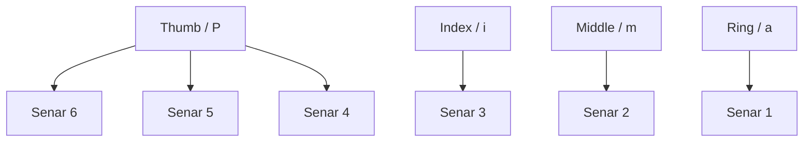
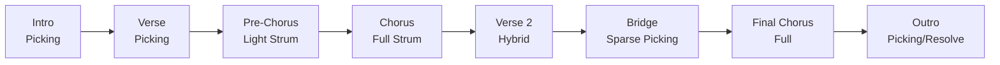
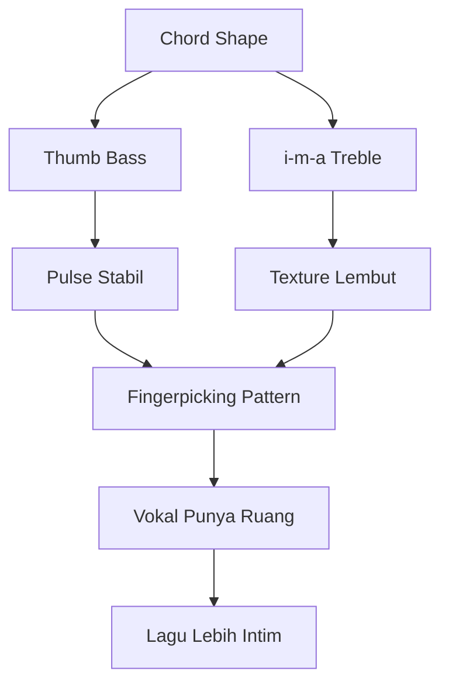

# learn-guitar-accompaniment-part-014.md

# Part 014 — Fingerpicking Minimum untuk Ballad dan Lagu Lembut

## Status Seri

Seri: **Belajar Guitar Accompaniment Berdasarkan The First 20 Hours**  
Bagian: **014 dari 035**  
Fokus: mempelajari fingerpicking dasar yang cukup untuk mengiringi penyanyi dalam lagu ballad, worship, folk, pop lembut, dan bagian intro/verse yang membutuhkan ruang.

Fingerpicking di sini bukan fingerstyle solo kompleks. Ini adalah **picking minimum untuk accompaniment**.

---

## Tujuan Pembelajaran Part Ini

Setelah menyelesaikan part ini, Anda harus bisa:

1. memahami perbedaan fingerpicking accompaniment dan fingerstyle solo;
2. memahami peran ibu jari sebagai bass;
3. memahami peran jari telunjuk, tengah, dan manis sebagai treble;
4. memakai pola dasar P-i-m-a;
5. memakai pola P-i-m-i;
6. memakai pola bass-treble sederhana;
7. memainkan picking dalam 4/4;
8. memahami picking 6/8 secara awal;
9. menjaga tempo saat picking;
10. memilih kapan fingerpicking lebih cocok daripada strumming.

---

## Prinsip Kaufman yang Dipakai di Part Ini

Dalam framework *The First 20 Hours*, kita tidak belajar semua teknik. Kita memilih teknik yang paling berguna untuk target.

Fingerpicking bisa sangat luas dan kompleks. Ada classical guitar, Travis picking, fingerstyle solo, percussive fingerstyle, chord melody, dan sebagainya.

Namun untuk target Anda:

> Tampil mengiringi penyanyi dengan gitar.

Maka fingerpicking minimum cukup jika ia bisa:

- membuat verse lebih lembut;
- memberi intro sederhana;
- memberi ruang untuk vokal;
- membuat ballad lebih intim;
- menjadi alternatif strumming;
- membantu dinamika lagu.

Kita tidak mengejar kompleksitas. Kita mengejar fungsi musikal.

---

# 1. Fingerpicking vs Fingerstyle

Istilah sering bercampur, tetapi kita bedakan secara praktis.

## 1.1 Fingerpicking Accompaniment

Tujuan:

- mengiringi vokal;
- memainkan chord secara terurai;
- menjaga pulse;
- memberi texture lembut;
- tidak mengambil pusat perhatian.

Ciri:

- pattern berulang;
- chord tetap menjadi basis;
- bass note stabil;
- tidak terlalu banyak melodi solo;
- mendukung penyanyi.

## 1.2 Fingerstyle Solo

Tujuan:

- memainkan bass, chord, melodi, dan rhythm sekaligus;
- sering tanpa penyanyi;
- lebih kompleks;
- bisa sangat teknikal.

Ciri:

- ada melodi utama di gitar;
- ada bass berjalan;
- ada inner voice;
- kadang percussive;
- butuh koordinasi tinggi.

Seri ini fokus pada fingerpicking accompaniment.

---

# 2. Kenapa Fingerpicking Penting untuk Pengiring?

Fingerpicking memberi warna yang berbeda dari strumming.

Cocok untuk:

- ballad;
- verse pertama;
- intro lembut;
- lirik emosional;
- lagu dengan tempo lambat;
- penyanyi dengan vokal halus;
- bridge yang butuh kontras;
- ending intimate.

Jika semua lagu dimainkan dengan strumming, Anda kehilangan opsi texture.

Fingerpicking membuat gitar terdengar:

- lebih tenang;
- lebih detail;
- lebih dekat;
- lebih bernapas;
- lebih personal.

---

# 3. Jari Tangan Kanan

Dalam notasi klasik, jari tangan kanan sering disebut:

```text
p = pulgar  = thumb / ibu jari
i = indice  = telunjuk
m = medio   = tengah
a = anular  = manis
```

Kita akan memakai:

```text
P = thumb
i = index
m = middle
a = ring
```

Pembagian umum:

```text
P = senar 6, 5, 4
i = senar 3
m = senar 2
a = senar 1
```

Ini bukan hukum mutlak, tetapi starting point yang baik.



---

# 4. Ibu Jari sebagai Bass

Dalam fingerpicking accompaniment, thumb sering memainkan bass note.

Bass note biasanya root chord.

Contoh:

```text
G  root = senar 6 fret 3
C  root = senar 5 fret 3
D  root = senar 4 open
Em root = senar 6 open
Am root = senar 5 open
```

Thumb memberi fondasi:

```text
Chord identity
Pulse
Downbeat
Stability
```

Jika thumb tidak stabil, picking terasa melayang.

---

# 5. Jari i-m-a sebagai Treble

Jari lain memainkan senar atas:

```text
i = senar 3
m = senar 2
a = senar 1
```

Mereka memberi:

- shimmer;
- arpeggio;
- detail;
- ruang;
- texture.

Untuk awal, jangan terlalu banyak variasi. Gunakan pola tetap.

---

# 6. Posisi Tangan Kanan untuk Fingerpicking

Prinsip:

- tangan rileks;
- wrist tidak terlalu patah;
- thumb bisa bergerak bebas;
- jari tidak menarik senar terlalu jauh;
- suara konsisten;
- tidak terlalu dalam mencabut senar.

## 6.1 Resting Anchor?

Beberapa pemain meletakkan kelingking di body gitar sebagai anchor. Ada yang tidak.

Untuk pemula, boleh memakai anchor ringan jika membantu stabilitas, tetapi jangan menekan keras sampai tangan kaku.

## 6.2 Gerakan Jari

Petik senar dengan gerakan kecil ke arah telapak, bukan menarik jauh keluar.

Jika menarik terlalu jauh:

- tempo lambat;
- suara kasar;
- jari cepat lelah.

---

# 7. Pattern 1 — P-i-m-a

Ini pola paling dasar.

## 7.1 Bentuk

```text
P i m a
```

Jika chord G:

```text
P = senar 6
i = senar 3
m = senar 2
a = senar 1
```

Tab sederhana:

```text
e|-------a---|
B|-----m-----|
G|---i-------|
D|-----------|
A|-----------|
E|-P---------|
```

Dalam hitungan 4/4, bisa dimainkan sebagai 4 nada:

```text
1 2 3 4
P i m a
```

## 7.2 Kapan Dipakai?

- latihan awal;
- intro sederhana;
- verse lembut;
- lagu lambat;
- mengenal koordinasi jari.

## 7.3 Latihan

Pakai Em:

```text
Em = 022000
```

Pattern:

```text
P i m a
```

Ulang 1 menit.

Target:

> suara rata, tempo stabil, jari tidak panik.

---

# 8. Pattern 2 — P-i-m-i

Pola ini lebih berputar dan stabil.

## 8.1 Bentuk

```text
P i m i
```

Contoh:

```text
1 2 3 4
P i m i
```

Untuk chord C:

```text
P = senar 5
i = senar 3
m = senar 2
i = senar 3
```

Tab:

```text
e|-----------|
B|-----m-----|
G|---i---i---|
D|-----------|
A|-P---------|
E|-----------|
```

## 8.2 Rasa

Pola ini terdengar lebih sederhana dan repetitive. Cocok untuk verse yang tidak ingin terlalu berbunga.

## 8.3 Latihan

Gunakan progression:

```text
C - G - Am - Fmaj7
```

Satu pattern per chord dulu.

---

# 9. Pattern 3 — P-i-m-a-m-i

Pola enam nada, cocok untuk feel mengalir.

```text
P i m a m i
```

Dalam 6/8, ini sangat berguna. Tetapi dalam part ini kita kenalkan dulu.

Hitungan:

```text
1 2 3 4 5 6
P i m a m i
```

Cocok untuk:

- ballad 6/8;
- lagu yang terasa mengayun;
- intro lembut;
- worship ballad.

Part 015 akan membahas 6/8 lebih dalam.

---

# 10. Pattern 4 — Bass-Treble-Bass-Treble

Pola sangat praktis untuk accompaniment.

```text
1 2 3 4
B T B T
```

B = bass note dengan thumb  
T = treble group dengan i/m/a

Contoh pada G:

```text
Beat 1: senar 6 dengan P
Beat 2: senar 3-2-1 bersamaan atau berurutan
Beat 3: senar 4 atau 6 dengan P
Beat 4: senar 3-2-1
```

Versi sederhana:

```text
P - i/m/a - P - i/m/a
```

Ini membuat iringan terasa seperti bass + chord.

---

# 11. Pattern 5 — Simple Travis-Inspired Picking

Travis picking asli bisa kompleks. Untuk 20 jam pertama, gunakan versi simplified.

Ide:

```text
Thumb menjaga bass bergantian.
Jari atas mengisi treble.
```

Contoh sangat sederhana dalam 4/4:

```text
1 & 2 & 3 & 4 &
P   i   P   m
```

Atau:

```text
P i P m P i P m
```

Untuk chord G:

```text
P bisa berganti senar 6 dan 4
i/m memainkan senar 3/2
```

Jangan mengejar Travis picking kompleks dulu. Gunakan konsepnya: thumb stabil, treble ringan.

---

# 12. Memilih Bass String per Chord

Ini penting.

Gunakan root/bass yang benar:

| Chord | Bass utama |
|---|---|
| G | senar 6 fret 3 |
| C | senar 5 fret 3 |
| D | senar 4 open |
| Em | senar 6 open |
| Am | senar 5 open |
| A | senar 5 open |
| E | senar 6 open |
| Dm | senar 4 open |
| Fmaj7 | senar 5 fret 3 atau senar 4 fret 3 tergantung voicing |

Jika Anda memainkan bass string salah, chord bisa terdengar kotor.

Contoh:

```text
D = xx0232
```

Thumb sebaiknya mulai dari senar 4, bukan senar 6.

---

# 13. Fingerpicking dan Chord Shape

Fingerpicking menuntut chord lebih bersih karena setiap senar terdengar jelas.

Jika strumming bisa menyembunyikan sedikit bug, picking mengekspos bug.

Maka saat picking:

- chord harus cukup bersih;
- open string harus berbunyi;
- jari tidak boleh mematikan senar target;
- bass string harus benar.

Gunakan picking sebagai unit test chord.

---

# 14. Picking dalam 4/4

Pola sederhana:

```text
1 2 3 4
P i m a
```

Atau 8th note:

```text
1 & 2 & 3 & 4 &
P i m i P i m i
```

Contoh progression:

```text
| G       | D       | Em      | C       |
| P i m i | P i m i | P i m i | P i m i |
```

Satu bar per chord.

---

# 15. Picking dalam 6/8 Secara Awal

6/8 dihitung:

```text
1 2 3 4 5 6
```

Atau:

```text
1 la li 2 la li
```

Pattern:

```text
P i m a m i
```

Untuk sementara, cukup tahu bahwa banyak ballad terasa seperti 6/8 dan cocok dengan pola enam nada.

Detail akan dibahas di part 015.

---

# 16. Fingerpicking dan Tempo

Masalah umum:

- thumb tidak stabil;
- jari treble terburu-buru;
- chord change terlambat;
- pattern berhenti saat pindah chord;
- tempo melambat di chord sulit.

Solusi:

1. gunakan metronome lambat;
2. latih satu chord dulu;
3. latih dua chord loop;
4. jangan langsung lagu penuh;
5. pertahankan thumb sebagai pulse;
6. sederhanakan pattern saat chord sulit.

---

# 17. Fingerpicking vs Strumming: Kapan Memilih?

## 17.1 Pilih Fingerpicking Jika

```text
[ ] lagu lembut
[ ] verse butuh ruang
[ ] vokal halus
[ ] lirik emosional
[ ] intro ingin intimate
[ ] bridge perlu kontras
[ ] strumming terasa terlalu ramai
```

## 17.2 Pilih Strumming Jika

```text
[ ] chorus butuh energi
[ ] audience perlu groove
[ ] lagu medium-up
[ ] vokal butuh dorongan
[ ] section perlu naik
[ ] fingerpicking membuat tempo goyah
```

## 17.3 Kombinasi

Sangat umum:

```text
Intro: fingerpicking
Verse: fingerpicking
Pre-Chorus: light strum
Chorus: fuller strum
Bridge: fingerpicking lagi
Final Chorus: full strum
```

---

# 18. Texture Map

Fingerpicking adalah alat texture.

Contoh map:

```text
Intro       : P-i-m-a picking
Verse 1     : P-i-m-i picking
Pre-Chorus  : light strum
Chorus      : D-D-U-U-D-U
Verse 2     : picking + light strum
Bridge      : sparse picking
Final Chorus: full strum
Outro       : picking / final chord
```

Diagram:



---

# 19. Hybrid: Picking ke Strumming

Transisi dari picking ke strumming harus halus.

Cara:

1. picking di verse;
2. tambah bass sedikit lebih kuat;
3. tambah light brush di akhir bar;
4. pre-chorus mulai strumming ringan;
5. chorus buka strumming penuh.

Contoh:

```text
Verse:
P i m i

Pre-chorus:
P i brush up

Chorus:
D - D U - U D U
```

Ini membuat lagu berkembang natural.

---

# 20. Hybrid: Strumming ke Picking

Setelah chorus besar, verse 2 atau bridge bisa turun.

Cara:

1. akhir chorus tahan chord;
2. kurangi volume;
3. masuk picking di chord berikut;
4. beri ruang vokal.

Ini membuat kontras.

---

# 21. Fingerpicking dan Vokal

Fingerpicking sering lebih aman untuk vokal karena lebih sparse. Tetapi tetap bisa mengganggu jika terlalu aktif.

Perhatikan:

- jangan membuat pattern terlalu sibuk saat lirik padat;
- jangan terlalu banyak fill;
- jaga bass stabil;
- treble jangan terlalu tajam;
- biarkan kata penting menonjol.

Picking yang baik seperti cahaya lembut di bawah vokal.

---

# 22. Fingerpicking sebagai Intro

Intro picking sederhana:

```text
G - D - Em - C
```

Pattern:

```text
P i m i
```

Satu bar per chord.

Penyanyi masuk setelah satu putaran.

Cue:

- di bar terakhir, picking sedikit lebih jelas;
- kontak mata;
- tahan chord atau strum ringan sebelum vokal masuk.

Intro picking harus memberi tempo jelas. Jangan terlalu bebas jika penyanyi butuh kepastian.

---

# 23. Fingerpicking sebagai Verse

Verse picking:

```text
C - G - Am - Fmaj7
```

Pattern:

```text
P i m i
```

Atau:

```text
P i m a
```

Fokus:

- volume rendah;
- tempo stabil;
- vokal jelas;
- bass tidak terlalu keras.

Jika penyanyi mulai chorus, beralih ke strumming.

---

# 24. Fingerpicking sebagai Bridge

Bridge bisa turun dengan picking.

Contoh:

```text
Bridge:
Em - C - G - D
```

Pattern:

```text
P - i - m - i
```

Lebih sparse daripada verse.

Tujuannya:

- membuat kontras;
- memberi ruang lirik;
- menyiapkan final chorus.

---

# 25. Fingerpicking sebagai Ending

Ending bisa memakai:

```text
P i m a
```

Lalu final chord strum.

Contoh:

```text
C: P i m a
G: final strum
```

Atau:

```text
final chord dipetik satu-satu dari bass ke treble
```

Ini memberi ending lembut dan jelas.

---

# 26. Common Picking Bugs

## 26.1 Thumb Tidak Stabil

Gejala:

- bass tidak konsisten;
- tempo melayang;
- chord tidak punya fondasi.

Fix:

- latih thumb only;
- main bass di beat 1 dan 3;
- gunakan metronome.

## 26.2 Jari Treble Terlalu Keras

Gejala:

- suara tajam;
- vokal terganggu;
- pattern terdengar kasar.

Fix:

- petik lebih lembut;
- kurangi tarikan;
- gunakan flesh/nail balance jika relevan.

## 26.3 Chord Change Lambat

Gejala:

- pattern berhenti sebelum chord baru.

Fix:

- satu pattern per chord dulu;
- simplify;
- pindah chord lebih awal;
- gunakan bass note dulu.

## 26.4 Bass String Salah

Gejala:

- chord terdengar kotor.

Fix:

- hafal bass utama tiap chord;
- latih thumb per chord.

## 26.5 Terlalu Banyak Variasi

Gejala:

- kehilangan tempo;
- vokal terganggu;
- pattern tidak konsisten.

Fix:

- gunakan satu pattern tetap;
- variasi hanya di akhir frasa.

---

# 27. Thumb-Only Drill

Latih bass dulu.

Progression:

```text
G - D - Em - C
```

Bass:

```text
G  = senar 6
D  = senar 4
Em = senar 6
C  = senar 5
```

Mainkan:

```text
1 2 3 4
P - P -
```

Atau:

```text
Beat 1 dan 3
```

Target:

> Thumb tahu bass string setiap chord tanpa panik.

---

# 28. Treble-Only Drill

Mute bass atau abaikan thumb.

Latih:

```text
i m a m
```

Pada senar:

```text
3 2 1 2
```

Gunakan chord Em.

Tujuan:

- jari treble konsisten;
- suara rata;
- tidak menarik terlalu keras.

---

# 29. Combine Drill

Gabungkan:

```text
P i m i
```

Gunakan Em.

Lalu G.

Lalu C.

Lalu progression:

```text
G - D - Em - C
```

Satu bar per chord.

---

# 30. Pattern Drill Detail

## Pattern A — P-i-m-a

```text
Count: 1 2 3 4
Pick : P i m a
```

Use:

- intro;
- slow verse;
- latihan koordinasi.

## Pattern B — P-i-m-i

```text
Count: 1 2 3 4
Pick : P i m i
```

Use:

- verse;
- steady accompaniment;
- pattern paling aman.

## Pattern C — P-i-m-a-m-i

```text
Count: 1 2 3 4 5 6
Pick : P i m a m i
```

Use:

- 6/8 ballad;
- flowing texture;
- intro lembut.

## Pattern D — Bass-Treble

```text
Count: 1 2 3 4
Pick : P T P T
```

Use:

- folk;
- simple ballad;
- saat butuh pulse jelas.

---

# 31. Latihan 45 Menit untuk Part Ini

## Block 1 — Tuning dan Hand Setup, 5 Menit

- Tune gitar.
- Posisikan tangan kanan rileks.
- Tentukan P-i-m-a.

## Block 2 — Thumb Only, 8 Menit

Progression:

```text
G - D - Em - C
```

Main bass di beat 1 dan 3.

## Block 3 — P-i-m-a, 8 Menit

Satu chord Em.

Lalu G.

Lalu C.

## Block 4 — P-i-m-i Progression, 10 Menit

```text
G - D - Em - C
```

Metronome 60 BPM.

## Block 5 — Picking to Strumming, 8 Menit

Verse:

```text
P i m i
```

Chorus:

```text
D - D U - U D U
```

## Block 6 — Recording Review, 6 Menit

Checklist:

```text
[ ] Bass stabil?
[ ] Pattern tidak berhenti?
[ ] Chord change tepat?
[ ] Vokal punya ruang?
[ ] Picking terlalu keras?
```

---

# 32. Latihan 15 Menit

```text
2 menit  tuning
3 menit  thumb only G-D-Em-C
4 menit  P-i-m-i pada Em
4 menit  P-i-m-i pada G-D-Em-C
2 menit  recording review
```

Jika hanya 5 menit:

```text
1 menit  tuning
2 menit  thumb only
2 menit  P-i-m-i pada satu chord
```

---

# 33. Mini Project Part Ini

Buat arrangement kecil:

```text
Progression: G - D - Em - C
Tempo: 70 BPM

Intro:
P-i-m-i x1 progression

Verse:
P-i-m-i x2 progression

Chorus:
D - D U - U D U x2 progression

Outro:
P-i-m-a on G, final strum
```

Rekam 2 menit.

Target:

> Lagu simulasi terasa punya texture lembut di verse dan lebih terbuka di chorus.

---

# 34. Fingerpicking Metrics

Gunakan metrik sederhana.

## 34.1 Bass Accuracy

Berapa chord yang bass string-nya benar?

Target awal:

```text
75%+
```

Target lebih baik:

```text
90%+
```

## 34.2 Pattern Continuity

Apakah pattern berhenti saat chord change?

Skor:

```text
1 = sering berhenti
3 = kadang berhenti
5 = stabil
```

## 34.3 Volume Balance

Apakah treble terlalu keras dibanding bass?

Skor 1–5.

## 34.4 Vocal Space

Apakah picking memberi ruang untuk vokal?

Skor 1–5.

---

# 35. Debugging Matrix Fingerpicking

| Symptom | Kemungkinan Penyebab | Fix |
|---|---|---|
| Tempo goyah | thumb tidak stabil | thumb-only drill |
| Chord kotor | bass string salah / chord tidak bersih | cek root, petik satu-satu |
| Picking tajam | jari menarik terlalu keras | gerakan kecil, soft attack |
| Pattern berhenti | chord transition lambat | simplify, satu pattern per bar |
| Vokal terganggu | treble terlalu ramai | kurangi variasi, lower density |
| Bass terlalu keras | thumb berlebihan | kontrol volume thumb |
| Susah pindah ke strum | tidak ada transition plan | light brush sebelum chorus |
| Tangan kaku | posisi buruk | rileks, latihan lambat |

---

# 36. Kesalahan Engineer-Minded dalam Fingerpicking

## 36.1 Ingin Pattern Kompleks Terlalu Cepat

Fingerpicking kompleks terlihat menarik, tetapi bukan prioritas. Satu pattern sederhana yang stabil lebih berguna untuk penyanyi.

## 36.2 Mengabaikan Bass

Thumb adalah fondasi. Jangan hanya fokus jari treble.

## 36.3 Mengejar Keindahan Sendiri

Fingerpicking indah tetapi terlalu ramai bisa mengganggu vokal.

## 36.4 Tidak Menggunakan Metronome

Picking sering terasa stabil padahal tempo melayang. Rekam dan cek.

## 36.5 Tidak Menyiapkan Transisi ke Strumming

Jika chorus butuh strumming, transisi dari picking harus dilatih.

---

# 37. Acceptance Criteria Part 014

Anda boleh lanjut ke part 015 jika:

```text
[ ] Bisa menjelaskan fingerpicking accompaniment vs fingerstyle solo
[ ] Bisa menyebut fungsi P-i-m-a
[ ] Bisa memainkan P-i-m-a pada satu chord
[ ] Bisa memainkan P-i-m-i pada satu chord
[ ] Bisa memainkan P-i-m-i pada G-D-Em-C secara lambat
[ ] Bisa memilih bass string untuk G, C, D, Em, Am
[ ] Bisa melakukan thumb-only drill
[ ] Bisa berpindah dari picking verse ke strumming chorus
[ ] Bisa menjelaskan kapan picking lebih cocok daripada strumming
[ ] Bisa merekam dan mengevaluasi bass stability
```

---

# 38. Ringkasan Mental Model

Fingerpicking untuk pengiring bukan tujuan teknis tersendiri. Ia adalah texture untuk mendukung vokal.



Kuasai sedikit pattern, tetapi buat stabil, lembut, dan berguna.

---

# 39. Output Part Ini

Output konkret:

1. Anda memahami peran fingerpicking untuk accompaniment.
2. Anda bisa memakai P-i-m-a dan P-i-m-i.
3. Anda tahu bass string tiap chord dasar.
4. Anda bisa membuat verse lebih lembut.
5. Anda bisa berpindah dari picking ke strumming.
6. Anda siap memahami 6/8 dan feel lagu non-4/4.

Part berikutnya:

> **6/8, Waltz, dan Feel Lagu yang Tidak 4/4.**

