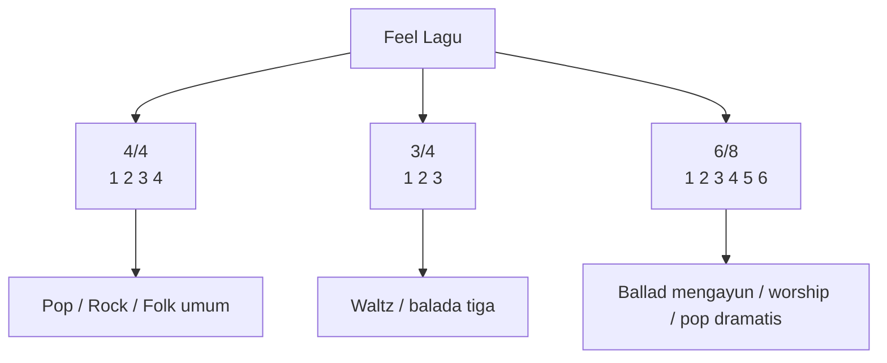
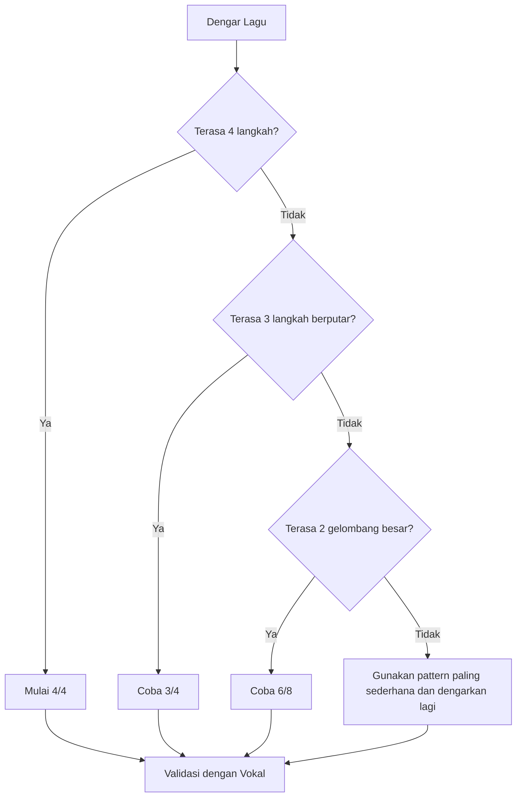
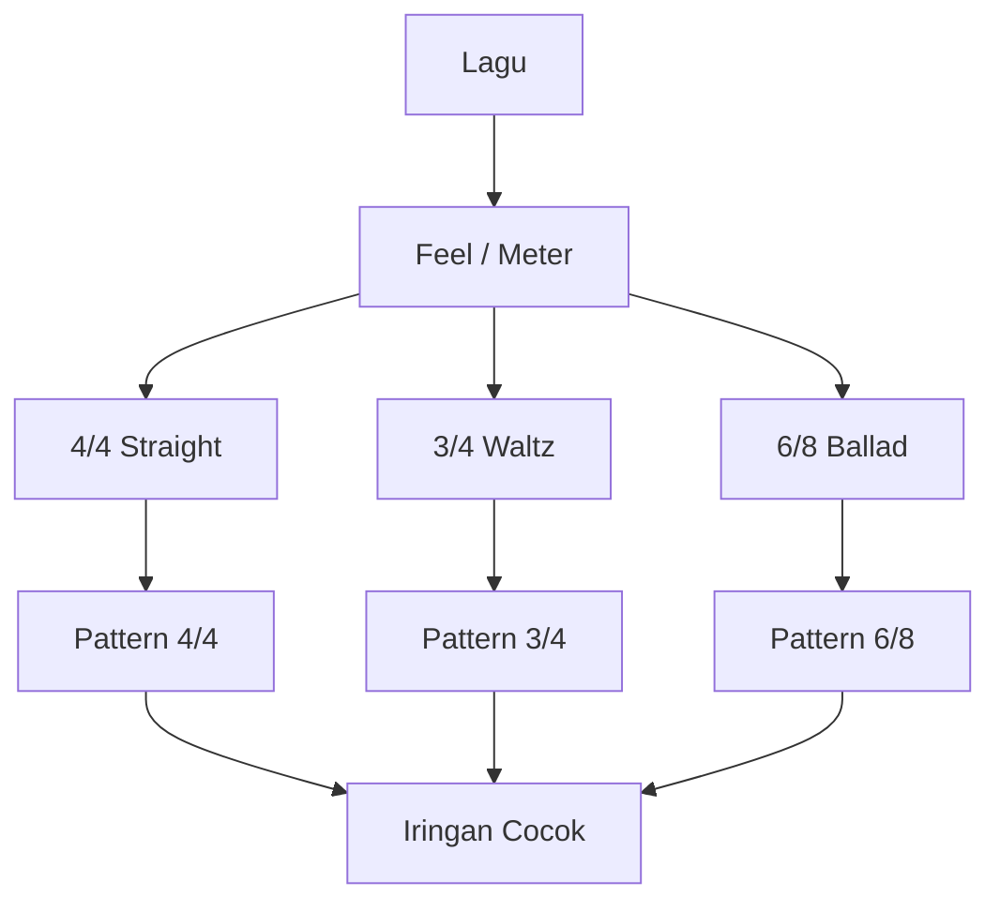

# learn-guitar-accompaniment-part-015.md

# Part 015 — 6/8, Waltz, dan Feel Lagu yang Tidak 4/4

## Status Seri

Seri: **Belajar Guitar Accompaniment Berdasarkan The First 20 Hours**  
Bagian: **015 dari 035**  
Fokus: memahami feel lagu yang tidak selalu 4/4, terutama 3/4 dan 6/8, agar Anda tidak memaksa semua lagu menjadi strumming pop 4/4.

Pada part sebelumnya, kita membahas fingerpicking minimum. Part ini melengkapi rhythm dengan satu kenyataan penting: banyak lagu ballad, folk, worship, pop Melayu, lagu lama, dan lagu teatrikal tidak terasa dalam 4/4 biasa.

---

## Tujuan Pembelajaran Part Ini

Setelah menyelesaikan part ini, Anda harus bisa:

1. membedakan feel 4/4, 3/4, dan 6/8 secara praktis;
2. menghitung 3/4 sebagai `1 2 3`;
3. menghitung 6/8 sebagai `1 2 3 4 5 6` atau `1-la-li 2-la-li`;
4. memahami kenapa 6/8 sering terasa seperti dua denyut besar;
5. memilih strumming untuk 3/4;
6. memilih strumming untuk 6/8;
7. memakai fingerpicking sederhana untuk 6/8;
8. mengenali lagu yang “mengayun”;
9. menghindari kesalahan memaksa lagu 6/8 menjadi 4/4;
10. menyesuaikan iringan dengan phrasing vokal dalam meter non-4/4.

---

## Prinsip Kaufman yang Dipakai di Part Ini

Dalam *The First 20 Hours*, kita tidak perlu mempelajari seluruh teori rhythm. Kita perlu mempelajari cukup banyak agar bisa menghindari kesalahan besar.

Untuk gitar pengiring, kesalahan besar yang sering terjadi:

> Semua lagu dianggap 4/4, lalu dipaksa memakai pattern `D-D-U-U-D-U`.

Akibatnya:

- ballad terasa kaku;
- lagu 6/8 kehilangan ayunan;
- waltz terasa salah;
- penyanyi merasa phrasing-nya ditabrak;
- chord change terasa tidak alami;
- lagu yang harusnya mengalir jadi seperti kotak-kotak.

Target part ini:

> Bisa mengenali feel dasar 3/4 dan 6/8, lalu memilih pattern yang cocok tanpa harus menjadi ahli teori rhythm.

---

# 1. Review Singkat: 4/4

4/4 adalah meter paling umum dalam pop.

Hitungan:

```text
1 2 3 4
```

Subdivision 8th:

```text
1 & 2 & 3 & 4 &
```

Pattern umum:

```text
D - D U - U D U
```

Dalam 4/4, satu bar punya 4 beat utama.

Contoh:

```text
| G       | D       | Em      | C       |
| 1 2 3 4 | 1 2 3 4 | 1 2 3 4 | 1 2 3 4 |
```

Ini sudah kita gunakan di part sebelumnya.

---

# 2. Kenapa Tidak Semua Lagu 4/4?

Banyak lagu terasa berbeda karena beat dikelompokkan berbeda.

Beberapa lagu terasa:

- seperti berjalan empat langkah: 4/4;
- seperti berputar tiga langkah: 3/4;
- seperti mengayun dua gelombang besar, masing-masing berisi tiga subdivisi: 6/8.

Secara praktis, Anda tidak harus langsung membaca time signature dari notasi. Anda perlu bisa merasakan pola aksen.



---

# 3. 3/4: Waltz Feel

3/4 berarti satu bar punya 3 beat.

Hitungan:

```text
1 2 3
1 2 3
1 2 3
```

Accent umum di beat 1:

```text
1 2 3
>    
```

Rasanya seperti:

```text
besar-kecil-kecil
besar-kecil-kecil
```

Atau:

```text
DOWN light light
DOWN light light
```

---

# 4. Strumming Dasar 3/4

## Pattern 3/4 — Level 1

```text
Count: 1 2 3
Strum: D D D
Accent: >    
```

Artinya:

- beat 1 lebih kuat;
- beat 2 dan 3 lebih ringan.

## Pattern 3/4 — Level 2

```text
Count: 1 2 3
Strum: B D D
```

B = bass note  
D = strum ringan

Contoh chord G:

```text
1: bass senar 6
2: strum ringan
3: strum ringan
```

Ini sangat berguna untuk waltz sederhana.

## Pattern 3/4 — Level 3

```text
Count : 1 & 2 & 3 &
Strum : D - D U D U
```

Atau:

```text
D - D U D -
```

Gunakan hanya jika feel sudah stabil.

---

# 5. Fingerpicking 3/4

Pattern sederhana:

```text
1 2 3
P i m
```

Atau:

```text
1 2 3
P m i
```

Atau bass + treble:

```text
1 2 3
P T T
```

Untuk chord C:

```text
1 = bass senar 5
2 = treble senar 3/2
3 = treble senar 2/1
```

Rasa:

```text
bass - chord - chord
```

Ini cocok untuk lagu lembut atau folk.

---

# 6. 6/8: Dua Gelombang Besar

6/8 sering membingungkan karena tertulis 6, tetapi tidak terasa seperti enam beat sama besar. Biasanya terasa sebagai dua denyut besar:

```text
1 2 3 4 5 6
>     >
```

Atau:

```text
1 la li 2 la li
>       >
```

Dua denyut besar:

```text
1     2
1 2 3 4 5 6
```

Rasa 6/8:

- mengayun;
- flowing;
- cocok untuk ballad;
- sering terasa dramatis;
- tidak kotak seperti 4/4;
- memberi ruang untuk vocal phrase panjang.

---

# 7. 6/8 vs 3/4

Keduanya punya enam subdivisi jika dihitung kecil, tetapi feel-nya berbeda.

## 3/4

Tiga beat utama:

```text
1 2 3
> > >
```

Rasa:

```text
ONE two three
ONE two three
```

## 6/8

Dua beat utama, masing-masing terbagi tiga:

```text
1 2 3 4 5 6
>     >
```

Rasa:

```text
ONE-la-li TWO-la-li
```

Perbedaan praktis:

```text
3/4 = tiga langkah
6/8 = dua ayunan
```

---

# 8. Cara Mengenali 6/8

Dengarkan apakah lagu terasa seperti:

```text
DA-da-da DA-da-da
```

Bukan:

```text
DA-da DA-da DA-da DA-da
```

Ciri umum:

- vocal phrase mengalir panjang;
- chord change sering tiap 6 hitungan atau tiap 12 hitungan;
- strumming down besar terasa di 1 dan 4;
- cocok dengan picking `P i m a m i`;
- ballad terasa “swaying”.

Latihan mendengar:

1. putar lagu ballad lambat;
2. coba hitung `1 2 3 4 5 6`;
3. tekan kaki di 1 dan 4;
4. jika terasa natural, kemungkinan 6/8.

---

# 9. Strumming Dasar 6/8

## Pattern 6/8 — Level 1

```text
Count: 1 2 3 4 5 6
Strum: D - - D - -
Accent: >     >
```

Ini memberi dua denyut besar.

## Pattern 6/8 — Level 2

```text
Count: 1 2 3 4 5 6
Strum: D d d D d d
Accent: >     >
```

`D` besar, `d` ringan.

## Pattern 6/8 — Level 3

```text
Count: 1 2 3 4 5 6
Strum: D - U D - U
```

Rasa:

```text
besar - angkat, besar - angkat
```

## Pattern 6/8 — Level 4

```text
Count: 1 2 3 4 5 6
Strum: D U D D U D
Accent: >     >
```

Gunakan jika tangan kanan sudah stabil.

---

# 10. Fingerpicking Dasar 6/8

Pattern paling berguna:

```text
1 2 3 4 5 6
P i m a m i
```

Atau:

```text
P i m P i m
```

Pattern `P i m a m i` terasa mengalir naik-turun.

Untuk chord G:

```text
P = senar 6
i = senar 3
m = senar 2
a = senar 1
m = senar 2
i = senar 3
```

Visual:

```text
e|-------a-------|
B|-----m---m-----|
G|---i-------i---|
D|---------------|
A|---------------|
E|-P-------------|
```

---

# 11. 6/8 dengan Progression

Gunakan:

```text
G - D - Em - C
```

Satu chord per bar 6/8:

```text
| G           | D           | Em          | C           |
| 1 2 3 4 5 6 | 1 2 3 4 5 6 | 1 2 3 4 5 6 | 1 2 3 4 5 6 |
```

Fingerpicking:

```text
P i m a m i
```

Strumming:

```text
D - U D - U
```

---

# 12. 6/8 dan Vokal

6/8 sering memberi ruang untuk vocal phrase yang lebih dramatis.

Hal yang perlu diperhatikan:

- jangan memotong frasa dengan accent terlalu keras;
- jaga ayunan 1 dan 4;
- biarkan nada panjang hidup;
- jangan membuat pattern terlalu ramai di verse;
- chorus bisa dibuka dengan strumming lebih penuh.

Penyanyi biasanya merasakan 6/8 sebagai gelombang. Jika gitar terlalu kotak, vokal terasa tertahan.

---

# 13. Kesalahan Memaksa 6/8 Menjadi 4/4

Misal lagu seharusnya:

```text
1 2 3 4 5 6
```

Tetapi Anda memainkannya sebagai:

```text
1 & 2 & 3 & 4 &
```

Akibat:

- aksen jatuh di tempat salah;
- vocal phrase terasa tidak cocok;
- chord change terasa tergesa atau terlambat;
- lagu kehilangan ayunan;
- penyanyi harus melawan gitar.

Debug:

```text
Jika pattern 4/4 terasa selalu "nyangkut", coba hitung 6/8.
```

---

# 14. 12/8 Secara Praktis

Beberapa lagu terasa seperti 12/8, yaitu empat kelompok triplet:

```text
1 2 3 4 5 6 7 8 9 10 11 12
>     >     >      >
```

Atau:

```text
1-la-li 2-la-li 3-la-li 4-la-li
```

Untuk 20 jam pertama, Anda tidak perlu membedakan 12/8 secara akademik. Cukup pahami:

- ada lagu 4 beat besar;
- setiap beat besar terbagi tiga;
- rasanya triplet/shuffle/rolling.

Jika lagu terasa seperti 4/4 tetapi mengayun triplet, jangan pakai down-up lurus biasa.

---

# 15. Shuffle / Triplet Feel Singkat

Shuffle adalah feel di mana subdivision tidak lurus sama rata seperti:

```text
1 & 2 & 3 & 4 &
```

Melainkan terasa seperti:

```text
1 - a 2 - a 3 - a 4 - a
```

Untuk 20 jam pertama, cukup tahu:

- shuffle tidak sama dengan straight 8th;
- jangan memaksa down-up rata jika lagu mengayun;
- gunakan pattern lebih santai;
- dengarkan rekaman asli.

Detail shuffle bisa dipelajari nanti.

---

# 16. Meter dan Chord Change

Dalam 4/4, chord sering berubah setiap 4 beat.

Dalam 3/4, chord bisa berubah setiap 3 beat.

Dalam 6/8, chord bisa berubah setiap 6 hitungan atau setiap dua denyut besar.

Contoh:

```text
3/4:
| G     | D     |
| 1 2 3 | 1 2 3 |

6/8:
| G           | D           |
| 1 2 3 4 5 6 | 1 2 3 4 5 6 |
```

Jangan hanya lihat chord. Rasakan bar length.

---

# 17. Pattern Adaptation Decision Tree



---

# 18. Latihan Mendengar Meter

Ambil 3 lagu berbeda:

1. lagu pop biasa;
2. lagu waltz/3 rasa;
3. lagu ballad mengayun.

Untuk masing-masing:

```text
Coba hitung 1 2 3 4
Coba hitung 1 2 3
Coba hitung 1 2 3 4 5 6
Pilih yang paling natural
```

Jangan mengandalkan teori dulu. Latih sensasi.

---

# 19. Latihan 3/4 dengan G-C-D

Progression:

```text
G - C - D - G
```

Hitungan:

```text
| G     | C     | D     | G     |
| 1 2 3 | 1 2 3 | 1 2 3 | 1 2 3 |
```

Pattern:

```text
B D D
```

Dengan accent:

```text
1 2 3
>    
```

Latihan:

- metronome lambat;
- satu chord per bar;
- jangan berubah menjadi 4/4.

---

# 20. Latihan 6/8 dengan G-D-Em-C

Progression:

```text
G - D - Em - C
```

Hitungan:

```text
1 2 3 4 5 6
```

Pattern strum:

```text
D - U D - U
```

Pattern picking:

```text
P i m a m i
```

Latihan:

1. muted strum dulu;
2. satu chord Em;
3. progression penuh;
4. rekam.

---

# 21. Latihan Vocal Phrase dalam 6/8

Buat frasa sederhana:

```text
"Aku masih menunggu"
```

Coba ucapkan dalam 6/8:

```text
1 2 3 4 5 6
A-ku ma-sih me-nung-gu
```

Tidak harus presisi. Tujuannya merasakan bahwa lirik bisa mengalir di atas ayunan.

Lalu mainkan:

```text
G - D - Em - C
```

dengan pattern 6/8.

---

# 22. Switching 4/4 ke 6/8

Latihan membedakan feel:

Gunakan progression sama:

```text
G - D - Em - C
```

Versi 4/4:

```text
1 & 2 & 3 & 4 &
D - D U - U D U
```

Versi 6/8:

```text
1 2 3 4 5 6
D - U D - U
```

Dengarkan:

- versi 4/4 lebih straight;
- versi 6/8 lebih mengayun;
- vocal phrase akan terasa berbeda.

---

# 23. Jangan Mengubah Meter Tanpa Alasan

Kadang arrangement bisa mengubah feel lagu, tetapi itu keputusan musikal sadar.

Untuk 20 jam pertama, lebih aman:

- ikuti feel asli lagu;
- sederhanakan pattern;
- jangan mengubah 6/8 menjadi 4/4 hanya karena pattern 4/4 lebih familiar;
- jangan memaksa semua lagu memakai strumming yang sama.

---

# 24. Meter dan Dynamics

3/4 dan 6/8 sering sangat sensitif terhadap dynamics.

Dalam 6/8:

```text
1 2 3 4 5 6
>     >
```

Jika semua subdivision sama keras, lagu bisa terdengar seperti mesin.

Gunakan:

- beat 1 dan 4 lebih kuat;
- lainnya lebih ringan;
- verse lebih soft;
- chorus lebih full;
- final chorus lebih terbuka.

---

# 25. Common Bugs 3/4

## 25.1 Terseret Menjadi 4/4

Gejala:

- setelah beberapa bar, hitungan berubah menjadi 1 2 3 4;
- chord change terlambat;
- penyanyi bingung.

Fix:

- hitung keras `1 2 3`;
- accent beat 1;
- gunakan pattern B-D-D.

## 25.2 Beat 2 dan 3 Terlalu Kuat

Gejala:

- waltz terasa berat;
- vocal phrase tertutup.

Fix:

- beat 1 kuat;
- beat 2/3 ringan.

## 25.3 Bass Salah

Fix:

- gunakan root chord di beat 1.

---

# 26. Common Bugs 6/8

## 26.1 Accent Salah

Gejala:

- lagu kehilangan ayunan.

Fix:

```text
Accent di 1 dan 4.
```

## 26.2 Terlalu Cepat Menghitung Enam Beat

Gejala:

- picking terburu-buru;
- vokal terdesak.

Fix:

- rasakan dua beat besar;
- hitung `1-la-li 2-la-li`.

## 26.3 Pattern Terlalu Ramai

Fix:

- gunakan `D - - D - -`;
- atau picking `P i m a m i` pelan.

## 26.4 Chord Change Terlambat

Fix:

- satu chord per 6 hitungan;
- pindah chord setelah hitungan 6;
- persiapkan chord berikutnya sejak 5-6.

---

# 27. Debugging Matrix Meter

| Symptom | Kemungkinan Penyebab | Fix |
|---|---|---|
| Lagu terasa kaku | meter salah / pattern 4/4 dipaksa | coba 6/8 |
| Waltz terasa berat | beat 2/3 terlalu keras | accent hanya beat 1 |
| Ballad kehilangan ayunan | tidak accent 1 dan 4 | hitung 1-la-li 2-la-li |
| Chord change membingungkan | bar length tidak dipahami | tulis bar count |
| Vokal terasa ditabrak | pattern terlalu padat | sparse strum |
| Tempo lari | subdivision belum stabil | metronome lambat |
| Picking berhenti | chord transition belum siap | simplify pattern |
| Semua lagu terdengar sama | pattern tidak mengikuti feel | pilih meter dulu |

---

# 28. Latihan 45 Menit untuk Part Ini

## Block 1 — Meter Listening, 8 Menit

Dengarkan 2–3 lagu. Coba hitung:

```text
1 2 3 4
1 2 3
1 2 3 4 5 6
```

Catat feel yang paling natural.

## Block 2 — 3/4 Strumming, 8 Menit

Progression:

```text
G - C - D - G
```

Pattern:

```text
B D D
```

## Block 3 — 6/8 Muted Strum, 8 Menit

Muted strings:

```text
1 2 3 4 5 6
D - U D - U
```

## Block 4 — 6/8 Fingerpicking, 10 Menit

Pattern:

```text
P i m a m i
```

Chord:

```text
Em
G
C
D
```

## Block 5 — Progression 6/8, 6 Menit

```text
G - D - Em - C
```

Satu chord per bar.

## Block 6 — Recording Review, 5 Menit

Cek:

```text
[ ] Accent 1 dan 4 terasa?
[ ] Tempo stabil?
[ ] Chord change tidak telat?
[ ] Feel tidak berubah menjadi 4/4?
```

---

# 29. Latihan 15 Menit

```text
3 menit  hitung 3/4 dengan muted strum
4 menit  G-C-D-G dalam 3/4
4 menit  6/8 D-U pattern muted
4 menit  G-D-Em-C dalam 6/8
```

Jika hanya 5 menit:

```text
2 menit  hitung 1-la-li 2-la-li
3 menit  Em dengan P-i-m-a-m-i
```

---

# 30. Mini Project Part Ini

Buat dua versi progression sama:

```text
G - D - Em - C
```

Versi A — 4/4:

```text
D - D U - U D U
```

Versi B — 6/8:

```text
D - U D - U
```

Rekam masing-masing 45 detik.

Catat:

```text
Versi mana terasa lebih pop straight?
Versi mana terasa lebih ballad/mengayun?
Mana yang lebih cocok untuk vokal lembut?
Mana yang lebih sulit menjaga tempo?
```

Target:

> Anda bisa merasakan bahwa meter mengubah karakter lagu walau chord sama.

---

# 31. Meter dalam Song Map

Mulai sekarang, setiap song map harus mencatat:

```text
Time Signature / Feel:
- 4/4 straight
- 3/4 waltz
- 6/8 ballad
- 12/8 / shuffle-ish
```

Template:

```text
Title:
Key:
Capo:
Tempo:
Feel:
Counting:
Pattern:
Chord change:
Notes:
```

Contoh:

```text
Title: Practice Ballad
Key: G
Capo: none
Tempo: 68 BPM
Feel: 6/8 ballad
Counting: 1-la-li 2-la-li
Pattern: P-i-m-a-m-i
Chord change: 1 chord per 6 counts
Notes: accent 1 and 4, soft verse
```

---

# 32. Acceptance Criteria Part 015

Anda boleh lanjut ke part 016 jika:

```text
[ ] Bisa membedakan 4/4, 3/4, dan 6/8 secara praktis
[ ] Bisa menghitung 3/4: 1 2 3
[ ] Bisa menghitung 6/8: 1 2 3 4 5 6
[ ] Bisa merasakan accent 1 dan 4 dalam 6/8
[ ] Bisa memainkan pattern 3/4 B-D-D
[ ] Bisa memainkan strum 6/8 D - U D - U
[ ] Bisa memainkan picking 6/8 P-i-m-a-m-i pada satu chord
[ ] Bisa memainkan G-D-Em-C dalam 6/8 secara lambat
[ ] Bisa menjelaskan kenapa lagu 6/8 tidak boleh dipaksa menjadi 4/4
[ ] Bisa mencatat feel/meter dalam song map
```

---

# 33. Ringkasan Mental Model

Meter adalah cara lagu mengorganisasi waktu.



Jika meter salah, chord benar pun terasa salah. Untuk pengiring, mengenali feel adalah bagian dari mendengarkan penyanyi dan lagu.

---

# 34. Output Part Ini

Output konkret:

1. Anda memahami 3/4 dan 6/8 secara praktis.
2. Anda bisa memainkan pattern dasar non-4/4.
3. Anda bisa mengenali feel mengayun.
4. Anda bisa menghindari memaksa semua lagu menjadi 4/4.
5. Anda siap memilih lagu latihan dengan lebih realistis.

Part berikutnya:

> **Repertoire Engineering: Memilih Lagu yang Tepat untuk 20 Jam Pertama.**

