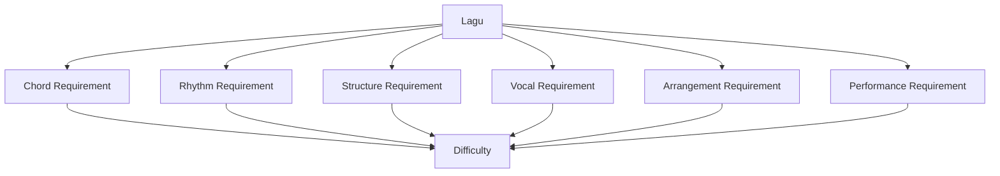
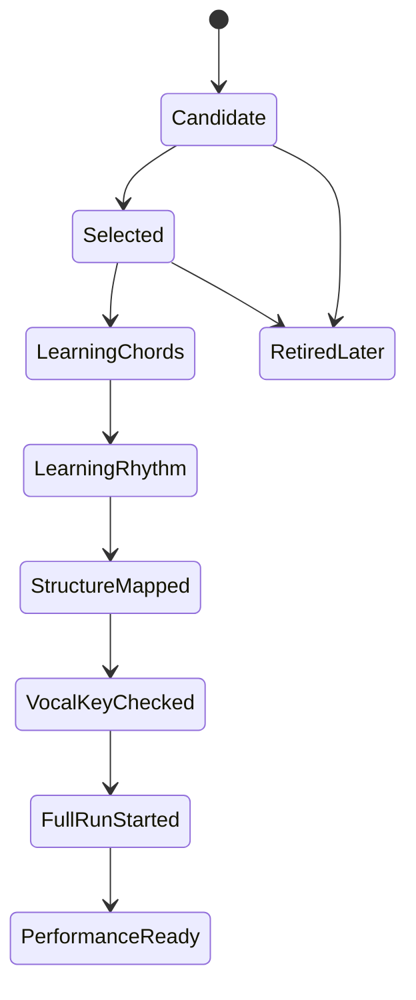
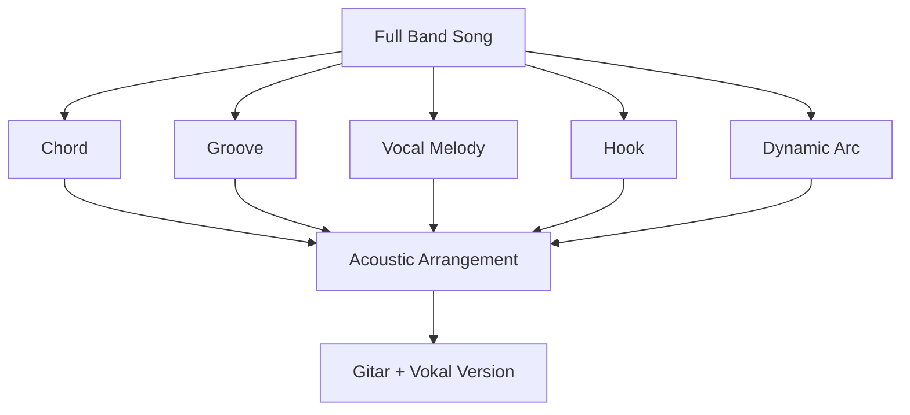
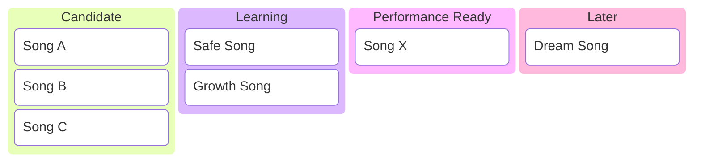
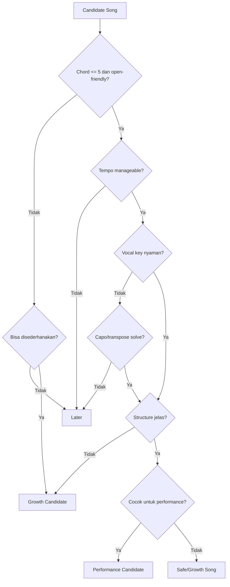
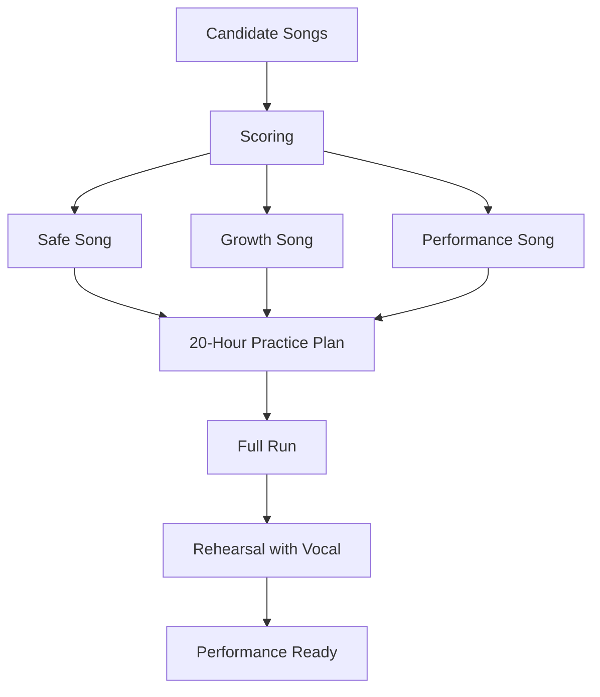

# learn-guitar-accompaniment-part-016.md

# Part 016 — Repertoire Engineering: Memilih Lagu yang Tepat untuk 20 Jam Pertama

## Status Seri

Seri: **Belajar Guitar Accompaniment Berdasarkan The First 20 Hours**  
Bagian: **016 dari 035**  
Fokus: memilih lagu latihan yang tepat agar 20 jam pertama menghasilkan kemampuan tampil, bukan sekadar frustasi karena lagu terlalu sulit.

Part ini sangat penting karena pemilihan lagu adalah keputusan strategis. Lagu yang salah bisa membuat latihan 20 jam terasa gagal, padahal problemnya bukan kemampuan Anda, melainkan scope yang terlalu besar.

---

## Tujuan Pembelajaran Part Ini

Setelah menyelesaikan part ini, Anda harus bisa:

1. memahami kenapa memilih lagu adalah bagian dari desain latihan;
2. membedakan lagu safe, growth, dan performance;
3. memilih lagu berdasarkan chord, tempo, meter, range vokal, struktur, dan kebutuhan performance;
4. menghindari lagu yang terlalu sulit untuk 20 jam pertama;
5. menyederhanakan lagu tanpa merusak esensi;
6. membuat backlog repertoire;
7. memilih 3 lagu target;
8. membuat acceptance criteria per lagu;
9. membuat versi akustik sederhana dari lagu full band;
10. membuat roadmap latihan lagu dari mudah ke tampil.

---

## Prinsip Kaufman yang Dipakai di Part Ini

Dalam *The First 20 Hours*, salah satu langkah penting adalah **deconstruct the skill** dan memilih target performa yang spesifik. Untuk gitar pengiring, target performa tidak bisa dipisahkan dari lagu yang dipilih.

Jika Anda memilih lagu dengan:

- chord terlalu banyak;
- barre chord dominan;
- tempo terlalu cepat;
- syncopation sulit;
- struktur rumit;
- modulasi;
- vocal range ekstrem;
- intro ikonik yang sulit;
- feel yang belum Anda kuasai;

maka 20 jam pertama akan habis untuk bertahan hidup, bukan membangun fondasi.

Target repertoire engineering:

> Memilih lagu yang cukup mudah untuk dimainkan stabil, tetapi cukup nyata untuk dipakai mengiringi penyanyi.

---

# 1. Lagu adalah Scope

Dalam software, scope yang buruk membuat project gagal. Dalam belajar gitar, lagu yang terlalu sulit membuat latihan gagal.

Lagu bukan hanya “judul”. Lagu adalah kumpulan requirement:

```text
Chord
Tempo
Meter
Strumming
Fingerpicking
Key
Range vokal
Structure
Intro
Ending
Dynamics
Cue
Memory
Performance pressure
```



Jika requirement terlalu tinggi, lagu itu tidak cocok untuk fase 20 jam pertama.

---

# 2. Tujuan Repertoire 20 Jam Pertama

Target realistis:

```text
3 lagu siap tampil sederhana
```

Bukan:

```text
30 lagu setengah bisa
```

Kualitas yang dicari:

- bisa dimainkan dari awal sampai akhir;
- chord cukup bersih;
- rhythm stabil;
- key nyaman untuk penyanyi;
- struktur tidak membingungkan;
- intro dan ending jelas;
- bisa recover saat salah;
- iringan mendukung vokal.

Lebih baik punya 3 lagu yang bisa tampil daripada 20 lagu yang selalu berhenti di tengah.

---

# 3. Tiga Kategori Lagu

## 3.1 Safe Song

Safe song adalah lagu yang sangat mudah dan digunakan untuk membangun confidence.

Ciri:

- chord 3–4 saja;
- tempo lambat/sedang;
- struktur sederhana;
- strumming sederhana;
- tidak banyak chord cepat;
- range vokal nyaman;
- tidak ada modulasi;
- tidak ada intro sulit.

Fungsi:

- latihan rhythm;
- latihan performance;
- latihan cue;
- lagu pertama untuk tampil.

## 3.2 Growth Song

Growth song sedikit lebih sulit dan melatih skill baru.

Ciri:

- ada satu chord sulit;
- ada pattern baru;
- ada bridge;
- ada meter 6/8;
- ada capo decision;
- ada dynamics lebih jelas.

Fungsi:

- mendorong skill;
- memperluas repertoire;
- melatih problem solving.

## 3.3 Performance Song

Performance song adalah lagu yang ingin Anda tampilkan.

Ciri:

- cocok untuk penyanyi;
- cocok untuk audience;
- sudah cukup stabil;
- emotional impact bagus;
- arrangement jelas.

Performance song tidak harus paling sulit. Justru sebaiknya cukup aman.

---

# 4. Kriteria Memilih Lagu

Gunakan kriteria berikut.

## 4.1 Chord Complexity

Pertanyaan:

```text
Berapa chord?
Apakah ada barre chord?
Apakah ada slash chord?
Apakah ada chord extended?
Apakah chord berubah cepat?
Apakah progression berulang?
```

Untuk 20 jam pertama, ideal:

```text
3–5 chord utama
Open chord dominan
Barre chord bisa dihindari
Progression berulang
```

## 4.2 Tempo

Tempo terlalu cepat membuat:

- chord transition sulit;
- strumming mudah kacau;
- penyanyi sulit diikuti;
- recovery sulit.

Ideal awal:

```text
60–90 BPM untuk ballad/medium
```

Bukan aturan mutlak, tetapi aman.

## 4.3 Meter / Feel

Untuk awal, pilih:

- 4/4 straight;
- atau 6/8 sederhana jika sudah latihan part 015.

Hindari dulu:

- syncopation kompleks;
- shuffle cepat;
- perubahan meter;
- stop-time rumit.

## 4.4 Struktur

Ideal:

```text
Intro
Verse
Chorus
Verse
Chorus
Bridge optional
Final Chorus
Outro
```

Hindari:

- banyak section berbeda;
- modulasi akhir;
- interlude panjang;
- perubahan tempo;
- ending kompleks.

## 4.5 Range Vokal

Lagu harus nyaman untuk penyanyi.

Cek:

- chorus tertinggi;
- verse terendah;
- final chorus;
- apakah penyanyi harus teriak;
- apakah lirik masih jelas;
- apakah key bisa disesuaikan dengan capo.

## 4.6 Audience / Context

Lagu untuk latihan pribadi berbeda dengan lagu untuk tampil.

Pertimbangkan:

- audience mengenal lagu?
- mood acara?
- apakah lagu terlalu panjang?
- apakah lirik cocok?
- apakah format gitar-vokal cukup?

---

# 5. Scoring Matrix Lagu

Beri skor 1–5.

```text
1 = mudah / aman
5 = sulit / berisiko
```

| Aspek | Skor |
|---|---:|
| Chord difficulty | 1–5 |
| Transition speed | 1–5 |
| Rhythm complexity | 1–5 |
| Structure complexity | 1–5 |
| Vocal range risk | 1–5 |
| Capo/transpose complexity | 1–5 |
| Performance pressure | 1–5 |

Total:

```text
7–12  = safe
13–20 = growth
21+   = hindari dulu / simplify
```

Ini bukan matematika absolut. Ini alat berpikir.

---

# 6. Red Flags Lagu untuk 20 Jam Pertama

Hindari dulu lagu dengan banyak red flags:

```text
[ ] banyak barre chord
[ ] tempo cepat
[ ] chord berubah tiap 2 beat
[ ] intro ikonik sulit
[ ] fingerstyle kompleks
[ ] modulasi naik setengah/whole step
[ ] banyak slash chord wajib
[ ] syncopation kuat
[ ] bridge panjang dengan chord baru
[ ] range vokal ekstrem
[ ] lirik sangat padat
[ ] ending harus sangat presisi
```

Bukan berarti lagu ini buruk. Hanya belum cocok untuk 20 jam pertama.

---

# 7. Green Flags Lagu untuk 20 Jam Pertama

Cari lagu dengan:

```text
[ ] 3–5 chord utama
[ ] chord open
[ ] progression berulang
[ ] tempo lambat/sedang
[ ] struktur jelas
[ ] bisa pakai capo
[ ] vokal nyaman
[ ] intro bisa disederhanakan
[ ] ending bisa dibuat final strum
[ ] verse dan chorus bisa dibedakan dengan dynamics
```

Lagu seperti ini sangat baik untuk membangun skill accompaniment.

---

# 8. Jangan Memilih Lagu Karena Ego

Pemula sering memilih lagu karena:

- lagu favorit;
- ingin terlihat keren;
- intro terkenal;
- chord chart terlihat menantang;
- ingin langsung memainkan versi asli;
- ingin membuktikan bisa.

Itu tidak selalu salah, tetapi untuk 20 jam pertama, tujuan utama adalah **membangun kemampuan tampil stabil**.

Pilih lagu yang membuat Anda belajar dan selesai, bukan lagu yang membuat Anda terjebak.

---

# 9. Lagu Favorit vs Lagu Latihan

Lagu favorit belum tentu lagu latihan yang baik.

Lagu latihan harus:

- sesuai skill saat ini;
- memberi feedback jelas;
- bisa diselesaikan;
- mendukung target tampil;
- tidak terlalu banyak bottleneck sekaligus.

Lagu favorit bisa masuk kategori growth atau long-term repertoire.

Strategi:

```text
Safe song     = mudah, cepat selesai
Growth song   = sedikit menantang
Dream song    = simpan untuk nanti
```

---

# 10. Repertoire Backlog

Buat backlog seperti product backlog.

Kolom:

```text
Title
Artist
Category
Key
Capo
Chord count
Difficult chord
Tempo
Feel
Vocal risk
Status
Next action
```

Contoh:

```text
Title: Song A
Category: Safe
Key: G
Capo: 0
Chord count: 4
Difficult chord: C transition
Tempo: 72
Feel: 4/4
Vocal risk: low
Status: learning
Next action: stabilize chorus
```

---

# 11. Status Lagu

Gunakan status:

```text
Candidate
Selected
Learning Chords
Learning Rhythm
Structure Mapped
Vocal Key Checked
Full Run Started
Performance Ready
Retired / Later
```

Diagram:



Ini membantu Anda tidak lompat-lompat lagu tanpa selesai.

---

# 12. Tiga Lagu Target

Untuk 20 jam pertama, pilih:

## Lagu 1 — Safe Song

Tujuan:

- confidence;
- chord dasar;
- rhythm stabil;
- full run pertama.

Kriteria:

```text
3–4 chord
tempo lambat/sedang
4/4
struktur sederhana
vokal nyaman
```

## Lagu 2 — Growth Song

Tujuan:

- skill tambahan.

Bisa punya:

```text
F simplified
6/8
fingerpicking intro
bridge sederhana
capo decision
```

## Lagu 3 — Performance Song

Tujuan:

- lagu yang benar-benar akan dibawakan.

Kriteria:

```text
cocok untuk penyanyi
cocok untuk audience
masih realistis
punya emotional impact
```

---

# 13. Cara Menyederhanakan Lagu

Sebuah lagu bisa dibuat versi akustik sederhana.

## 13.1 Kurangi Chord Passing

Jika ada chord cepat yang tidak esensial, tahan chord utama.

Contoh:

```text
Original:
G - D/F# - Em - C

Simplified:
G - D - Em - C
```

## 13.2 Ganti Barre Chord

Contoh:

```text
F penuh → Fmaj7 simplified
Bm → Bm7 simplified / pakai capo / ubah key
F#m → pakai capo atau shape lain
```

## 13.3 Sederhanakan Strumming

Original mungkin penuh. Anda bisa mulai:

```text
D - - - D - - -
```

Lalu naik.

## 13.4 Sederhanakan Intro

Intro instrumental sulit bisa diganti:

```text
main chord progression 1 putaran
```

## 13.5 Sederhanakan Ending

Ending rumit bisa diganti:

```text
final chord sustain
```

---

# 14. Apa yang Tidak Boleh Disederhanakan Sembarangan?

Beberapa hal adalah identitas lagu.

Hati-hati menyederhanakan:

- hook utama;
- chord yang mendukung melodi penting;
- key vokal;
- stop/break yang menjadi ciri;
- emotional arc;
- lyric cue;
- ending signature jika sangat dikenal.

Prinsip:

> Sederhanakan teknik, bukan esensi lagu.

---

# 15. Membuat Versi Akustik dari Lagu Full Band

Lagu full band punya:

- drum;
- bass;
- keyboard;
- electric guitar;
- backing vocal;
- synth;
- percussion.

Gitar tunggal tidak bisa meniru semuanya. Pilih elemen paling penting.

Pertahankan:

```text
Chord progression
Groove utama
Vocal cue
Dynamic arc
Hook penting
Ending
```

Buang atau sederhanakan:

```text
drum fill
bass run rumit
lead guitar solo
pad harmony detail
syncopation kecil
ornamen produksi
```

Gitar tunggal harus menjadi skeleton yang kuat.

---

# 16. Acoustic Reduction Model



Pertanyaan utama:

```text
Jika hanya gitar dan vokal, apa yang harus tetap ada agar lagu masih dikenali dan terasa benar?
```

---

# 17. Kriteria Lagu untuk Penyanyi

Karena target Anda mengiringi penyanyi, lagu harus dipilih bersama vokal.

Pertanyaan:

```text
Apakah penyanyi suka lagu ini?
Apakah range nyaman?
Apakah lirik cocok dengan karakter penyanyi?
Apakah penyanyi bisa menyampaikan emosi lagu?
Apakah tempo nyaman?
Apakah key bisa disesuaikan?
Apakah lagu terlalu panjang?
```

Gitaris tidak boleh memilih hanya berdasarkan chord.

---

# 18. Key Test untuk Lagu Candidate

Untuk setiap lagu kandidat:

1. cari chorus;
2. mainkan dengan shape mudah;
3. coba capo beberapa posisi;
4. minta penyanyi menyanyikan chorus;
5. cek verse;
6. catat key nyaman;
7. baru putuskan lagu masuk repertoire.

Jangan belajar arrangement penuh sebelum key vokal jelas.

---

# 19. Tempo Test

Gunakan metronome atau tap tempo.

Pertanyaan:

```text
Apakah saya bisa menjaga tempo ini?
Apakah chord change terlalu cepat?
Apakah penyanyi nyaman?
Apakah tempo asli perlu diperlambat untuk akustik?
```

Tidak apa-apa menurunkan tempo sedikit untuk versi akustik, selama lagu masih terasa natural.

---

# 20. Chord Transition Test

Sebelum memilih lagu, cek transisi paling sulit.

Contoh:

```text
C → G
Am → Fmaj7
D → A
G → D
```

Jika lagu punya satu transisi sulit, itu growth. Jika hampir semua transisi sulit, jangan pilih dulu.

Gunakan one-minute change drill untuk pair tersulit.

---

# 21. Rhythm Test

Cek feel:

```text
4/4 straight?
6/8?
3/4?
syncopated?
shuffle?
```

Jika Anda belum bisa feel-nya, lagu masuk growth atau later.

Jangan memaksa lagu 6/8 menjadi 4/4 hanya agar mudah.

---

# 22. Structure Test

Tulis struktur:

```text
Intro
Verse
Pre-Chorus
Chorus
Verse
Chorus
Bridge
Final Chorus
Outro
```

Jika Anda tidak bisa memetakan struktur dalam 10 menit, lagu mungkin terlalu kompleks untuk fase awal atau Anda perlu chord sheet lebih baik.

---

# 23. Arrangement Test

Bisakah lagu dibuat hanya dengan:

- intro 1 progression;
- verse sparse;
- chorus fuller;
- bridge contrast;
- final chord?

Jika ya, lagu cocok.

Jika lagu sangat bergantung pada:

- riff sulit;
- full band drop;
- syncopated hook;
- bassline ikonik;
- modulation;
- solo;

maka perlu arrangement effort lebih besar.

---

# 24. Performance Risk Test

Tanyakan:

```text
Jika saya salah chord sekali, apakah lagu masih bisa lanjut?
Jika saya lupa bridge, apakah bisa recover?
Jika penyanyi masuk telat, apakah progression mudah diulang?
Jika capo salah, apakah langsung fatal?
Jika tempo naik, apakah masih aman?
```

Lagu yang baik untuk pemula punya recovery path.

---

# 25. Acceptance Criteria per Lagu

Untuk setiap lagu target, buat checklist.

```text
[ ] Key/capo sudah ditentukan
[ ] Chord progression sudah ditulis
[ ] Struktur sudah dipetakan
[ ] Intro sudah jelas
[ ] Vocal entry jelas
[ ] Verse pattern dipilih
[ ] Chorus pattern dipilih
[ ] Bridge/contrast dipilih
[ ] Ending dipilih
[ ] Bisa full run instrumental
[ ] Bisa full run dengan vokal
[ ] Bisa recover dari error kecil
[ ] Rekaman terakhir cukup stabil
```

Lagu belum performance-ready jika ending masih ragu atau key vokal belum cocok.

---

# 26. Repertoire Roadmap 20 Jam

Contoh roadmap:

## Jam 1–5

- pilih 3 lagu kandidat;
- pilih 1 safe song;
- pelajari chord;
- tentukan key/capo.

## Jam 5–10

- safe song full run;
- mulai growth song;
- latih transisi tersulit.

## Jam 10–15

- safe song dengan vokal;
- growth song full structure;
- pilih performance song.

## Jam 15–20

- 3 lagu masuk full run;
- recording review;
- rehearsal cue;
- performance simulation.

---

# 27. Jangan Menambah Lagu Terus

Kesalahan umum:

- belajar intro lagu A;
- pindah ke chorus lagu B;
- lihat tutorial lagu C;
- coba lagu D;
- tidak ada yang selesai.

Untuk 20 jam pertama, batasi:

```text
3 lagu utama
2 lagu cadangan
sisanya backlog
```

Selesaikan dulu.

---

# 28. WIP Limit untuk Repertoire

Gunakan WIP limit seperti Kanban.

```text
Learning aktif: maksimal 3 lagu
Candidate backlog: boleh banyak
Performance ready: target 3 lagu
```

Diagram:



Jika Mermaid renderer tidak mendukung `kanban`, gunakan tabel backlog.

---

# 29. Lagu Safe Tidak Harus Membosankan

Lagu safe bisa tetap musikal jika:

- key cocok;
- dynamics bagus;
- vokal kuat;
- strumming stabil;
- ending jelas;
- emotion tersampaikan.

Kesalahan pemula adalah menganggap “mudah” berarti “tidak keren”. Dalam performance, lagu mudah yang dibawakan baik jauh lebih kuat daripada lagu sulit yang patah-patah.

---

# 30. Lagu Growth Harus Punya Satu Fokus

Growth song sebaiknya hanya menambah satu atau dua tantangan.

Contoh growth bagus:

```text
Lagu dengan chord dasar tetapi feel 6/8.
```

Atau:

```text
Lagu 4/4 tetapi ada Fmaj7 dan bridge.
```

Growth buruk:

```text
Lagu cepat, banyak barre chord, 6/8, modulasi, intro fingerstyle sulit, range vokal tinggi.
```

Itu terlalu banyak variabel.

---

# 31. Lagu Performance Harus Aman

Performance song sebaiknya bukan lagu paling sulit.

Kriteria:

```text
[ ] penyanyi nyaman
[ ] gitaris cukup stabil
[ ] intro aman
[ ] ending aman
[ ] audience cocok
[ ] emotional impact jelas
[ ] jika gugup masih bisa dimainkan
```

Saat tampil, difficulty naik karena pressure. Pilih lagu dengan margin.

---

# 32. Repertoire Selection Template

Gunakan ini untuk setiap kandidat.

```text
Title:
Artist:
Category: Safe / Growth / Performance / Later
Original key:
Target key:
Capo:
Feel:
Tempo:
Chord progression:
Difficult chord:
Difficult transition:
Structure:
Vocal risk:
Guitar risk:
Simplification plan:
Why this song:
Decision:
Next action:
```

Contoh:

```text
Title: Practice Song A
Category: Safe
Original key: G
Target key: G
Capo: none
Feel: 4/4
Tempo: 72 BPM
Chord progression: G-D-Em-C
Difficult chord: C
Difficult transition: Em-C
Structure: Intro-Verse-Chorus-Verse-Chorus-Outro
Vocal risk: low
Guitar risk: low-medium
Simplification: verse sparse, chorus fuller
Decision: selected
Next action: full run with metronome
```

---

# 33. Repertoire Backlog Table

Template:

| Title | Category | Key/Capo | Feel | Chords | Risk | Status | Next Action |
|---|---|---|---|---|---|---|---|
| Song A | Safe | G / none | 4/4 | G D Em C | Low | Learning | Full run |
| Song B | Growth | G capo 2 | 6/8 | G D Em C | Medium | Candidate | Test vocal |
| Song C | Performance | C capo 2 | 4/4 | C G Am F | Medium | Selected | Map structure |

---

# 34. Practical Simplification Examples

## 34.1 F Problem

Original:

```text
C - G - Am - F
```

Simplified:

```text
C - G - Am - Fmaj7
```

## 34.2 Bm Problem

Original key D:

```text
D - A - Bm - G
```

Option:

```text
G shape capo 7
G - D - Em - C shape
```

But capo 7 may sound high.

Alternative:

```text
C shape capo 2
C - G - Am - F shape
```

Sounding:

```text
D - A - Bm - G
```

## 34.3 Fast Chord Passing

Original:

```text
G - D/F# - Em - Em/D - C
```

Simplified:

```text
G - D - Em - C
```

## 34.4 Difficult Intro

Original: fingerstyle riff.

Simplified:

```text
play chord progression once with picking
```

## 34.5 Complex Ending

Original: band stop + vocal ad lib.

Simplified:

```text
final chorus, repeat last line, final chord sustain
```

---

# 35. Song Selection Decision Tree



---

# 36. Latihan 45 Menit untuk Part Ini

## Block 1 — Candidate List, 10 Menit

Tulis 10 lagu yang mungkin ingin dimainkan.

Jangan nilai dulu.

## Block 2 — Quick Scoring, 10 Menit

Skor tiap lagu:

```text
Chord
Tempo
Rhythm
Structure
Vocal
Performance risk
```

## Block 3 — Pilih 3 Lagu, 10 Menit

Pilih:

```text
1 safe
1 growth
1 performance
```

## Block 4 — Buat Song Template, 10 Menit

Untuk masing-masing lagu:

```text
Key/capo
Chord
Feel
Structure
Risk
Next action
```

## Block 5 — Reality Check, 5 Menit

Tanya:

```text
Apakah 3 lagu ini realistis untuk 20 jam?
Apakah penyanyi nyaman?
Apakah ada lagu yang terlalu ego-driven?
```

---

# 37. Latihan 15 Menit

```text
5 menit  tulis 5 kandidat lagu
5 menit  skor difficulty
5 menit  pilih 1 safe song
```

Jika hanya 5 menit:

```text
Tulis 3 kandidat dan tandai mana yang paling aman.
```

---

# 38. Mini Project Part Ini

Buat repertoire backlog awal.

Minimal 5 lagu:

```text
2 safe candidates
2 growth candidates
1 performance candidate
```

Untuk 3 lagu utama, isi:

```text
Title:
Category:
Key/capo:
Chord:
Feel:
Structure:
Risk:
Simplification:
Next action:
```

Target:

> Anda punya scope latihan yang jelas untuk 20 jam, bukan daftar lagu random.

---

# 39. Kesalahan Engineer-Minded dalam Repertoire

## 39.1 Over-Engineering Backlog

Backlog berguna, tetapi jangan habiskan semua waktu menganalisis. Setelah memilih, mainkan.

## 39.2 Memilih Lagu Berdasarkan Kompleksitas

Kompleksitas bukan nilai utama. Performance impact lebih penting.

## 39.3 Tidak Memperhitungkan Penyanyi

Chord mudah untuk gitar bisa tetap gagal jika key vokal tidak nyaman.

## 39.4 Scope Creep

Setiap melihat lagu baru, ingin belajar. Batasi WIP.

## 39.5 Tidak Membuat Definition of Done

Tanpa checklist, lagu terasa “sedang dipelajari” selamanya.

---

# 40. Definition of Done untuk Lagu Siap Tampil

Lagu siap tampil sederhana jika:

```text
[ ] Bisa dimainkan dari awal sampai akhir tanpa berhenti
[ ] Key nyaman untuk penyanyi
[ ] Intro jelas
[ ] Vocal entry jelas
[ ] Verse dan chorus berbeda
[ ] Ending yakin
[ ] Tempo cukup stabil
[ ] Chord error kecil tidak menghancurkan lagu
[ ] Bisa recover jika salah
[ ] Pernah direkam dan didengar ulang
[ ] Pernah simulasi dengan penyanyi atau vokal rekaman
```

Jika belum memenuhi ini, lagu belum siap.

---

# 41. Acceptance Criteria Part 016

Anda boleh lanjut ke part 017 jika:

```text
[ ] Bisa menjelaskan kenapa pemilihan lagu adalah bagian dari desain latihan
[ ] Bisa membedakan safe, growth, dan performance song
[ ] Bisa membuat scoring sederhana untuk kandidat lagu
[ ] Bisa mengidentifikasi red flags lagu terlalu sulit
[ ] Bisa memilih 3 lagu target awal
[ ] Bisa membuat repertoire backlog
[ ] Bisa membuat simplification plan untuk lagu
[ ] Bisa membuat acceptance criteria per lagu
[ ] Bisa menjelaskan kenapa lagu mudah bisa tetap musikal
[ ] Bisa menetapkan WIP limit repertoire
```

---

# 42. Ringkasan Mental Model

Repertoire adalah scope. Scope menentukan apakah 20 jam pertama menghasilkan kemampuan tampil atau hanya frustasi.



Pilih lagu yang cukup sederhana untuk selesai, cukup nyata untuk berguna, dan cukup musikal untuk membuat penyanyi terdengar baik.

---

# 43. Output Part Ini

Output konkret:

1. Anda tahu cara memilih lagu.
2. Anda punya kategori safe/growth/performance.
3. Anda bisa membuat backlog repertoire.
4. Anda bisa menilai difficulty lagu.
5. Anda bisa menyederhanakan lagu.
6. Anda siap membuat sistem latihan 20 jam yang terukur.

Part berikutnya:

> **Practice System: Latihan 20 Jam yang Benar-benar Terukur.**

