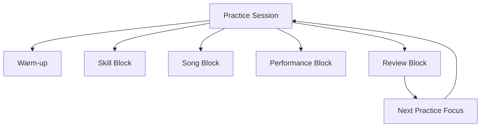
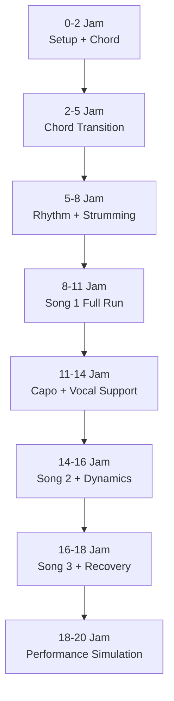
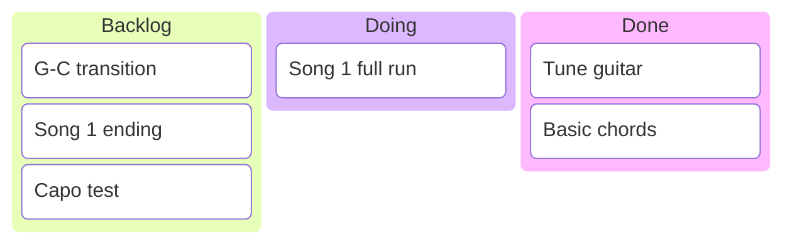
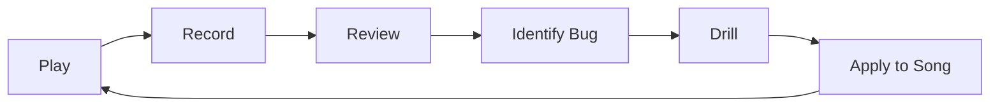
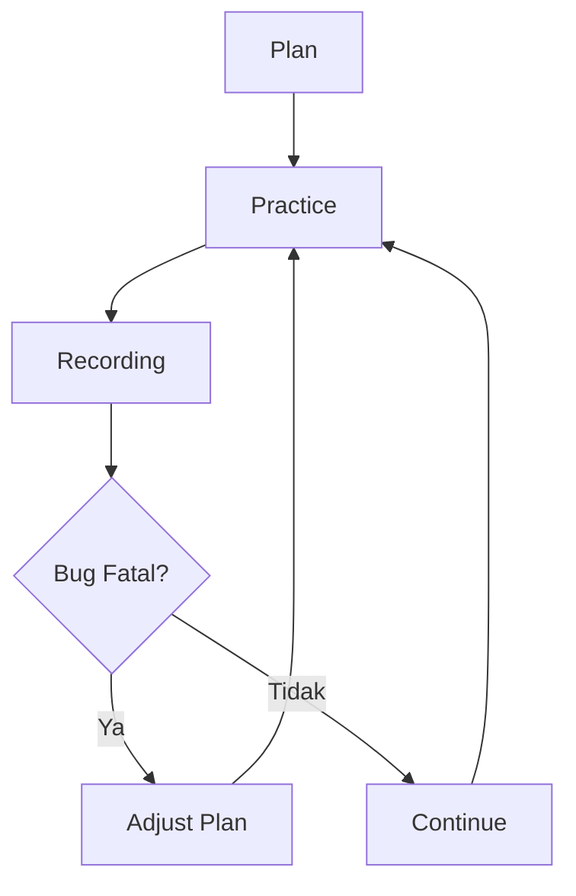
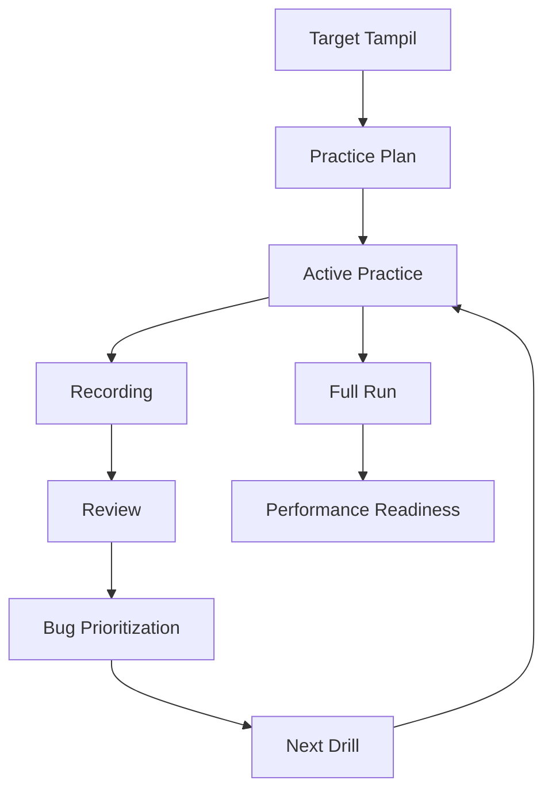

# learn-guitar-accompaniment-part-017.md

# Part 017 — Practice System: Latihan 20 Jam yang Benar-benar Terukur

## Status Seri

Seri: **Belajar Guitar Accompaniment Berdasarkan The First 20 Hours**  
Bagian: **017 dari 035**  
Fokus: membangun sistem latihan 20 jam yang konkret, terukur, dan langsung mengarah ke kemampuan tampil mengiringi penyanyi.

Part ini adalah “execution engine” dari seluruh seri. Setelah memahami setup, chord, rhythm, strumming, struktur, capo, vokal, dinamika, fingerpicking, meter, dan pemilihan lagu, sekarang kita perlu menjawab:

> Bagaimana tepatnya 20 jam itu dijalankan agar tidak berubah menjadi 20 jam bermain random?

---

## Tujuan Pembelajaran Part Ini

Setelah menyelesaikan part ini, Anda harus bisa:

1. membedakan latihan aktif dan latihan pasif;
2. membuat jadwal latihan 20 jam;
3. membagi sesi latihan menjadi warm-up, skill block, song block, performance block, dan review block;
4. menggunakan timer, metronome, recording, dan checklist;
5. membuat practice log;
6. menentukan metric yang berguna;
7. menghindari tutorial hell;
8. menjalankan latihan harian 15, 30, atau 45 menit;
9. mengevaluasi progress setiap 5 jam;
10. memastikan latihan selalu bergerak menuju target tampil.

---

## Prinsip Kaufman yang Dipakai di Part Ini

Dalam *The First 20 Hours*, Kaufman menekankan bahwa rapid skill acquisition membutuhkan:

1. skill yang didekonstruksi;
2. pengetahuan minimum untuk self-correction;
3. hambatan latihan yang dihilangkan;
4. latihan aktif minimal 20 jam.

Kata kuncinya adalah **latihan aktif**.

Menonton tutorial gitar selama 2 jam bukan berarti Anda sudah latihan gitar 2 jam. Membaca chord chart selama 30 menit bukan berarti tangan Anda bisa pindah chord. Membeli capo bukan berarti Anda bisa transpose.

Target part ini:

> Membuat 20 jam latihan benar-benar menjadi 20 jam praktik aktif yang menghasilkan kemampuan performatif.

---

# 1. Definisi Latihan Aktif

Latihan aktif adalah waktu ketika Anda benar-benar melakukan tindakan yang membangun skill.

Termasuk:

```text
[ ] tuning dan setup singkat
[ ] membentuk chord
[ ] melatih transisi chord
[ ] strumming dengan metronome
[ ] fingerpicking dengan tempo
[ ] memainkan progression
[ ] memainkan full song run
[ ] rehearsal dengan penyanyi
[ ] recording dan review singkat
[ ] memperbaiki bug spesifik
```

Tidak termasuk atau hanya dihitung sebagian kecil:

```text
[ ] menonton tutorial tanpa gitar
[ ] membaca teori terlalu lama
[ ] scrolling chord chart
[ ] mencari gear
[ ] membandingkan gitar
[ ] menonton cover orang lain
[ ] ngobrol tentang musik tanpa praktik
```

Observasi dan teori boleh, tetapi harus langsung diikat ke praktik.

---

# 2. Latihan Pasif vs Latihan Aktif

| Aktivitas | Jenis | Nilai untuk 20 Jam |
|---|---|---|
| Menonton video chord G | Pasif | rendah jika tidak langsung dimainkan |
| Membentuk chord G 30 kali | Aktif | tinggi |
| Membaca artikel strumming | Pasif | rendah-sedang |
| Mute strum dengan metronome 5 menit | Aktif | tinggi |
| Mendengar lagu target | Semi-aktif | berguna jika ada catatan |
| Membuat song map | Aktif kognitif | tinggi jika dipakai latihan |
| Full run dan recording | Aktif performatif | sangat tinggi |
| Menganalisis recording | Aktif review | tinggi jika menghasilkan next fix |

Prinsip:

> Input tanpa output tidak cukup. Setiap belajar harus menghasilkan tindakan, rekaman, catatan, atau perbaikan.

---

# 3. Komponen Practice System

Practice system terdiri dari beberapa blok.



## 3.1 Warm-up

Tujuan:

- tuning;
- mempersiapkan tangan;
- mengaktifkan rhythm;
- memastikan setup benar.

## 3.2 Skill Block

Tujuan:

- melatih sub-skill spesifik;
- chord transition;
- strumming;
- fingerpicking;
- capo;
- dynamics;
- error recovery.

## 3.3 Song Block

Tujuan:

- menerapkan skill ke lagu target;
- section practice;
- verse/chorus;
- intro/ending.

## 3.4 Performance Block

Tujuan:

- memainkan full run tanpa berhenti;
- simulasi tekanan;
- latihan recovery.

## 3.5 Review Block

Tujuan:

- mendengar recording;
- menemukan bug;
- menentukan fokus berikutnya.

---

# 4. Mengapa Harus Ada Review Block?

Tanpa review, latihan mudah berubah menjadi pengulangan kesalahan.

Review block adalah observability.

Dalam software:

```text
No logs, no metrics, no tracing = debugging by feeling.
```

Dalam gitar:

```text
No recording, no metronome, no practice log = progress by illusion.
```

Rasa saat bermain sering tidak akurat karena otak sibuk:

- membaca chord;
- memindahkan jari;
- menjaga tempo;
- mendengar vokal;
- mengingat struktur;
- mengelola gugup.

Recording memberi perspektif eksternal.

---

# 5. Tool Minimum Latihan

Anda butuh:

```text
[ ] gitar
[ ] tuner
[ ] capo
[ ] pick
[ ] metronome app
[ ] timer
[ ] HP untuk recording
[ ] practice log
[ ] chord/song map
```

Opsional:

```text
[ ] stand gitar
[ ] strap
[ ] speaker untuk backing/vokal
[ ] notebook fisik
[ ] spreadsheet tracking
```

Jangan membuat tracking terlalu kompleks. Tracking harus membantu latihan, bukan menggantikan latihan.

---

# 6. Practice Log

Format sederhana:

```text
Date:
Session duration:
Total accumulated hours:
Focus:
Songs:
Metronome tempo:
Main drills:
Recording made: yes/no
Biggest bug:
Fix for next session:
Confidence score:
```

Contoh:

```text
Date: 2026-06-25
Session duration: 45 min
Total accumulated hours: 3h 45m
Focus: G-D-Em-C transition and downstroke rhythm
Songs: Practice Song A
Metronome tempo: 60 BPM
Main drills: G-D one-minute change, G-D-Em-C full run
Recording made: yes
Biggest bug: C chord telat dan senar 1 mati
Fix for next session: Em-C pair drill + C chord clean test
Confidence score: 2/5
```

---

# 7. Metric yang Berguna

## 7.1 Chord Clean Rate

Berapa persen string target berbunyi bersih.

Contoh C punya 5 string target. Jika 4 bersih:

```text
80%
```

## 7.2 Chord Changes per Minute

Untuk pair chord:

```text
G ↔ C = 28 changes/minute
```

## 7.3 Stop Count

Berapa kali berhenti total dalam 1 menit atau full run.

Target:

```text
Semakin sedikit.
```

## 7.4 Chord-on-Downbeat Rate

Berapa chord masuk tepat di beat 1.

## 7.5 Full Run Completion

Apakah lagu dimainkan dari awal sampai akhir tanpa restart?

## 7.6 Vocal Support Score

Dari recording:

```text
1 = gitar menabrak vokal
3 = cukup mendukung
5 = vokal terasa aman dan jelas
```

## 7.7 Recovery Score

Saat salah, apakah bisa lanjut?

```text
1 = berhenti total
3 = sempat goyah tapi lanjut
5 = recover hampir tidak terasa
```

---

# 8. Metric yang Bisa Menipu

Jangan terlalu fokus pada:

```text
jumlah chord yang dihafal
jumlah tutorial ditonton
kecepatan strumming maksimal
jumlah lagu yang "pernah dicoba"
jumlah gear yang dimiliki
teori yang sudah dibaca
```

Metrik utama untuk target Anda:

> Bisakah Anda mengiringi penyanyi secara stabil dari awal sampai akhir lagu?

---

# 9. Format Sesi 45 Menit

Ini format default paling ideal.

```text
00:00–05:00  Warm-up
05:00–15:00  Skill block
15:00–30:00  Song block
30:00–40:00  Performance block
40:00–45:00  Review block
```

## 9.1 Warm-up, 5 Menit

```text
[ ] tuning
[ ] open string
[ ] 2 chord mudah
[ ] muted downstroke 1 menit
```

## 9.2 Skill Block, 10 Menit

Pilih satu fokus:

```text
G-C transition
D-D-U-U-D-U pattern
P-i-m-i fingerpicking
6/8 feel
Fmaj7 chord
capo test
```

Jangan terlalu banyak.

## 9.3 Song Block, 15 Menit

Latih section:

```text
intro
verse
chorus
bridge
ending
```

Fokus pada lagu target.

## 9.4 Performance Block, 10 Menit

Full run tanpa berhenti.

Aturan:

```text
Jika salah, lanjut.
Jangan restart.
Catat bug nanti.
```

## 9.5 Review Block, 5 Menit

Dengar rekaman singkat.

Catat:

```text
Bug terbesar:
Next fix:
```

---

# 10. Format Sesi 30 Menit

Jika waktu terbatas:

```text
00:00–03:00  tuning + warm-up
03:00–10:00  skill drill
10:00–22:00  song section
22:00–28:00  full run
28:00–30:00  review note
```

Aturan:

- satu skill utama;
- satu lagu utama;
- tetap recording minimal 1 kali.

---

# 11. Format Sesi 15 Menit

Sesi pendek harus sangat fokus.

```text
00:00–02:00  tuning
02:00–06:00  drill spesifik
06:00–12:00  lagu/section
12:00–15:00  recording + note
```

Contoh:

```text
Focus: Em-C transition
Song: Song A verse
Drill: one-minute change Em-C x2
Run: verse 2 kali
Review: C telat atau tidak?
```

Sesi 15 menit yang fokus jauh lebih baik daripada 45 menit random.

---

# 12. Format Sesi 5 Menit

Jika sangat sibuk, tetap bisa menjaga momentum.

```text
1 menit  tuning cepat
2 menit  one-minute change pair tersulit
2 menit  progression target
```

Contoh:

```text
G-C 1 menit
Em-C 1 menit
G-D-Em-C 2 menit
```

Jangan meremehkan sesi 5 menit. Konsistensi menjaga motor memory.

---

# 13. Breakdown 20 Jam

Berikut rencana besar 20 jam.



Detail berikutnya bukan hukum kaku, tetapi roadmap.

---

# 14. Jam 0–2: Setup dan Chord Dasar

Fokus:

```text
tuning
posisi tubuh
pick grip
open string
Em, G, C, D, Am
```

Output:

```text
[ ] bisa tune
[ ] bisa membentuk 5 chord dasar
[ ] bisa petik satu-satu untuk debug
[ ] bisa memainkan G-D-Em-C satu strum per chord
```

Latihan:

- chord clean test;
- chord recall;
- strum tunggal;
- petik string target.

Jangan buru-buru lagu penuh.

---

# 15. Jam 2–5: Chord Transition

Fokus:

```text
G-D
G-C
C-Am
Em-C
Am-Fmaj7
G-D-Em-C
C-G-Am-Fmaj7
```

Output:

```text
[ ] minimal 3 pair punya changes/minute tercatat
[ ] G-D-Em-C bisa dimainkan lambat tanpa berhenti total
[ ] tahu pair paling lemah
```

Latihan:

- one-minute change drill;
- metronome 60 BPM;
- chord per bar;
- recording 1 menit.

---

# 16. Jam 5–8: Rhythm dan Strumming

Fokus:

```text
downstroke
down-up
D-D-U-U-D-U
verse sparse
chorus fuller
```

Output:

```text
[ ] bisa strum muted dengan metronome
[ ] bisa G-D-Em-C dengan pattern sederhana
[ ] tangan kanan tidak berhenti total saat chord telat
[ ] bisa membedakan verse/chorus secara density
```

Latihan:

- muted strum;
- metronome;
- progression loop;
- verse/chorus contrast.

---

# 17. Jam 8–11: Song 1 Full Run

Fokus:

```text
safe song
song map
intro
verse
chorus
ending
```

Output:

```text
[ ] song map selesai
[ ] intro jelas
[ ] ending jelas
[ ] bisa full run instrumental
[ ] recording pertama selesai
```

Latihan:

- section practice;
- full run no stop;
- recording review;
- fix top 1 bug.

---

# 18. Jam 11–14: Capo dan Vokal

Fokus:

```text
key nyaman penyanyi
capo test
vocal entry
gitar memberi ruang
```

Output:

```text
[ ] key/capo untuk song 1 ditentukan
[ ] vocal-aware map dibuat
[ ] verse tidak menutup vokal
[ ] chorus mendukung vokal
```

Latihan:

- chorus key test;
- intro cue;
- play with recording/vocal;
- dynamics adjustment.

---

# 19. Jam 14–16: Song 2 dan Dinamika

Fokus:

```text
growth song
dynamic map
bridge/contrast
fingerpicking atau 6/8 jika relevan
```

Output:

```text
[ ] song 2 structure mapped
[ ] verse/chorus/bridge punya treatment berbeda
[ ] full run awal song 2
```

Latihan:

- dynamic ladder;
- section contrast;
- picking-to-strum jika perlu.

---

# 20. Jam 16–18: Song 3 dan Recovery

Fokus:

```text
performance song
error handling
recovery
cue
ending
```

Output:

```text
[ ] song 3 selected and mapped
[ ] full run minimal 1 kali
[ ] recovery drill dilakukan
[ ] ending dilatih
```

Latihan:

- forced mistake drill;
- no-stop run;
- vocal cue;
- performance checklist.

---

# 21. Jam 18–20: Performance Simulation

Fokus:

```text
3 lagu
tanpa restart
setup lengkap
capo/tuning/pick
intro/ending
recovery
```

Output:

```text
[ ] 3 lagu dimainkan berurutan
[ ] recording final simulation
[ ] daftar bug final
[ ] readiness score
```

Latihan:

- setlist run;
- no-stop rule;
- review;
- final fixes.

---

# 22. Checkpoint Setiap 5 Jam

## Checkpoint 5 Jam

Pertanyaan:

```text
[ ] Bisa tune tanpa bingung?
[ ] Bisa chord dasar?
[ ] Bisa transisi G-D-Em-C lambat?
[ ] Tahu pair tersulit?
```

Jika tidak, jangan tambah lagu baru. Perkuat chord/transisi.

## Checkpoint 10 Jam

Pertanyaan:

```text
[ ] Bisa strumming pattern sederhana?
[ ] Bisa song 1 dari awal sampai akhir?
[ ] Intro dan ending jelas?
[ ] Recording sudah ada?
```

Jika belum, fokus song 1.

## Checkpoint 15 Jam

Pertanyaan:

```text
[ ] Key/capo sudah ditentukan?
[ ] Pernah latihan dengan vokal/rekaman?
[ ] Song 2 sudah mulai?
[ ] Dynamics mulai terdengar?
```

Jika vokal belum pernah diuji, segera uji.

## Checkpoint 20 Jam

Pertanyaan:

```text
[ ] Bisa memainkan 3 lagu?
[ ] Bisa recovery saat salah?
[ ] Tempo cukup stabil?
[ ] Penyanyi nyaman?
[ ] Siap tampil sederhana?
```

Jika belum, bukan gagal. Anda punya diagnosis untuk 20 jam berikutnya.

---

# 23. Weekly Practice Plan

Jika latihan 5 hari per minggu, 45 menit per hari:

```text
Minggu 1: 3 jam 45 menit
Minggu 2: 7 jam 30 menit
Minggu 3: 11 jam 15 menit
Minggu 4: 15 jam
Minggu 5: 18 jam 45 menit
+ 1 sesi tambahan = 20 jam
```

Jika latihan 30 menit per hari:

```text
40 sesi = 20 jam
```

Jika 45 menit per hari:

```text
27 sesi ≈ 20 jam
```

Jangan terlalu fokus kalender. Fokus akumulasi jam aktif.

---

# 24. Practice Board

Gunakan board sederhana.

```text
Backlog:
- G-C transition
- D-D-U-U-D-U
- Song 1 ending
- Capo test song 1
- Song 2 bridge

Doing:
- Song 1 full run

Done:
- Tune guitar
- Em/G/C/D/Am basic shapes
```

Mermaid:



Jika Mermaid `kanban` tidak didukung, gunakan tabel biasa.

---

# 25. WIP Limit Latihan

Jangan melatih terlalu banyak sekaligus.

WIP limit:

```text
Skill focus aktif: 1–2
Song aktif: maksimal 3
Pattern aktif: maksimal 2
Chord pair aktif: maksimal 3
```

Jika semua dilatih sekaligus, tidak ada yang matang.

---

# 26. Tutorial Hell

Tutorial hell terjadi saat Anda merasa belajar karena terus mengonsumsi materi, tetapi skill tidak tumbuh.

Gejala:

```text
[ ] menonton banyak video chord
[ ] mengganti metode setiap hari
[ ] mencari pattern baru terus
[ ] tidak punya recording
[ ] tidak punya full run
[ ] lagu tidak pernah selesai
[ ] merasa butuh teori lagi sebelum main
```

Solusi:

```text
1 tutorial maksimal → langsung praktik 20 menit
1 konsep → 1 drill
1 lagu → full run
1 bug → next fix
```

---

# 27. Deliberate Practice Loop

Gunakan loop:



Contoh:

```text
Play: G-D-Em-C
Record: 1 menit
Review: C telat
Bug: Em-C transition
Drill: one-minute Em-C
Apply: full progression lagi
```

Ini jauh lebih efektif daripada “main terus sampai bisa” tanpa diagnosis.

---

# 28. Bug Prioritization

Jangan memperbaiki semua bug sekaligus.

Prioritas:

## P0 — Fatal

```text
gitar fals
tidak bisa tune
berhenti total di tengah lagu
tidak tahu struktur
key vokal tidak cocok
ending tidak jelas
```

## P1 — High

```text
tempo drift besar
chord transition sering telat
strumming menutup vokal
intro membingungkan
```

## P2 — Medium

```text
beberapa chord buzzing
dynamics kurang jelas
pattern kurang halus
```

## P3 — Low

```text
ornamen kurang indah
voicing belum variatif
fill belum bagus
```

Perbaiki P0/P1 dulu.

---

# 29. Practice Log Review Mingguan

Setiap minggu, baca log.

Pertanyaan:

```text
Apa bug yang terus muncul?
Apakah saya benar-benar full run?
Apakah saya terlalu banyak menambah lagu?
Apakah tempo meningkat stabil?
Apakah recording membaik?
Apakah penyanyi sudah diuji?
Apa fokus minggu depan?
```

Tanpa review, Anda bisa mengulang pola latihan yang tidak efektif.

---

# 30. Recording Protocol

Jangan merekam hanya saat sudah bagus. Rekam untuk belajar.

Protocol:

```text
[ ] rekam 1 menit drill
[ ] rekam section
[ ] rekam full run
[ ] dengarkan sekali
[ ] catat 1–3 bug
[ ] jangan over-analyze
```

Jangan dengarkan 20 kali dan membenci diri. Review harus actionable.

---

# 31. Self-Review Checklist

Setelah recording, jawab:

```text
Timing:
[ ] tempo stabil?
[ ] ada pause?

Chord:
[ ] chord utama bersih?
[ ] root jelas?
[ ] chord telat?

Rhythm:
[ ] tangan kanan berhenti?
[ ] pattern konsisten?

Vocal support:
[ ] gitar terlalu ramai?
[ ] verse cukup ruang?
[ ] chorus naik?

Structure:
[ ] intro jelas?
[ ] ending yakin?
[ ] section tidak tersesat?

Recovery:
[ ] jika salah, lanjut?
```

---

# 32. Practice Session Template

Copy template ini.

```text
# Guitar Practice Log

Date:
Session duration:
Total hours:

Primary focus:
Secondary focus:

Warm-up:
Skill drill:
Song work:
Performance run:
Recording:

Metrics:
- Chord pair:
- Changes/min:
- Tempo:
- Stop count:
- Full run: yes/no

Biggest bug:
Root cause:
Next fix:

Confidence:
Energy level:
Notes:
```

---

# 33. Contoh Practice Log 1

```text
Date: 2026-06-25
Session duration: 45 min
Total hours: 6h 30m

Primary focus: strumming stability
Secondary focus: G-D-Em-C

Warm-up: tuning, muted downstroke
Skill drill: D-D-U-U-D-U muted at 60 BPM
Song work: Song A verse + chorus
Performance run: full song instrumental
Recording: yes

Metrics:
- Chord pair: Em-C
- Changes/min: 31
- Tempo: 60 BPM
- Stop count: 3
- Full run: yes

Biggest bug: pause before C
Root cause: C shape not ready, hand lifts too high
Next fix: Em-C low-lift drill

Confidence: 2/5
Energy level: medium
Notes: chorus dynamics better than yesterday
```

---

# 34. Contoh Practice Log 2

```text
Date: 2026-06-26
Session duration: 30 min
Total hours: 7h

Primary focus: vocal support
Secondary focus: capo test

Warm-up: tuning, G-D-Em-C
Skill drill: verse sparse vs chorus fuller
Song work: Song A with vocal recording
Performance run: verse+chorus
Recording: yes

Metrics:
- Tempo: 68 BPM
- Stop count: 1
- Vocal support score: 3/5
- Full run: partial

Biggest bug: guitar too loud in verse
Root cause: strumming all strings too hard
Next fix: reduce density, strum 4 strings only in verse

Confidence: 3/5
Energy level: low
Notes: capo 2 too high for singer, try capo 1
```

---

# 35. Latihan 20 Jam Tidak Harus Linear Sempurna

Roadmap adalah guide, bukan hukum.

Jika pada jam 8 transisi masih lemah, kembali ke transisi.

Jika pada jam 12 key vokal belum cocok, jangan lanjut arrangement rumit.

Jika pada jam 16 song 3 terlalu sulit, ganti dengan safe song lain.

Skill acquisition harus adaptif.



---

# 36. Motivasi dan Friction

Motivasi naik turun. Sistem harus mengurangi ketergantungan pada motivasi.

Praktik:

```text
[ ] gitar mudah dijangkau
[ ] chord sheet siap
[ ] target sesi ditulis sebelum mulai
[ ] timer dipakai
[ ] sesi pendek tetap valid
[ ] lagu tidak terlalu banyak
```

Jangan menunggu mood sempurna. Mulai dari 5 menit.

---

# 37. Latihan Saat Jari Sakit

Jari sakit ringan normal. Tetapi jangan memaksa cedera.

Jika ujung jari lelah:

- latihan rhythm muted;
- latihan song map;
- latihan counting;
- latihan listening vokal;
- latihan cue;
- review recording;
- latihan tangan kanan tanpa chord.

Jadi latihan tidak harus selalu menekan chord keras.

---

# 38. Latihan Saat Tidak Bisa Berisik

Jika tidak bisa bersuara keras:

- latihan chord silent changes;
- muted strum pelan;
- finger movement;
- song map;
- metronome counting;
- listening;
- mental rehearsal.

Tetapi tetap butuh latihan suara nyata secara berkala.

---

# 39. Mental Rehearsal

Mental rehearsal bukan pengganti latihan fisik, tetapi membantu struktur.

Latihan:

1. lihat song map;
2. bayangkan intro;
3. bayangkan vocal entry;
4. sebut chord setiap section;
5. bayangkan ending;
6. cek bagian yang lupa.

Ini berguna sebelum tidur atau saat tidak memegang gitar.

---

# 40. Practice with Singer

Jika penyanyi tersedia, gunakan rehearsal efektif.

Format 45 menit:

```text
5 menit   key/capo check
5 menit   intro + vocal entry
10 menit  verse/chorus
10 menit  full run
5 menit   ending
5 menit   recording review
5 menit   fix biggest issue
```

Jangan rehearsal hanya mengulang lagu dari awal terus.

---

# 41. Practice with Recording

Jika penyanyi belum ada:

- main bersama rekaman asli;
- main bersama karaoke/vocal track;
- nyanyikan/hum sendiri;
- rekam gitar Anda.

Fokus:

```text
Apakah gitar menabrak vokal?
Apakah chord change sesuai?
Apakah tempo stabil?
Apakah dynamic arc masuk?
```

---

# 42. No-Stop Rule

Dalam performance block:

```text
Jika salah, lanjut.
```

Kenapa?

Karena performance tidak punya tombol restart.

No-stop run melatih:

- recovery;
- mental stability;
- struktur;
- stamina;
- ending;
- acceptance terhadap error kecil.

Setelah run selesai, baru perbaiki.

---

# 43. Slow Practice Rule

Jika bug terus muncul, turunkan tempo.

Aturan:

```text
Jika gagal 3 kali berturut-turut pada tempo X, turunkan 10–15 BPM.
```

Jangan melatih panik.

---

# 44. Satu Bug Terbesar

Setiap sesi harus berakhir dengan:

```text
Bug terbesar berikutnya adalah ...
```

Contoh:

```text
Bug terbesar: C chord telat di chorus.
Next fix: G-C pair drill at 60 BPM.
```

Ini membuat sesi berikutnya jelas.

---

# 45. Acceptance Criteria Part 017

Anda boleh lanjut ke part 018 jika:

```text
[ ] Bisa membedakan latihan aktif dan pasif
[ ] Punya format practice log
[ ] Bisa membuat sesi 45 menit
[ ] Bisa membuat sesi 15 menit
[ ] Bisa menjelaskan roadmap 20 jam
[ ] Bisa menentukan checkpoint 5/10/15/20 jam
[ ] Bisa memakai recording untuk review
[ ] Bisa memilih satu bug terbesar per sesi
[ ] Bisa menjalankan no-stop run
[ ] Bisa membatasi lagu aktif maksimal 3
```

---

# 46. Ringkasan Mental Model

Latihan 20 jam bukan sekadar akumulasi waktu. Latihan 20 jam adalah loop terarah.



Waktu tanpa feedback menghasilkan kebiasaan. Waktu dengan feedback menghasilkan skill.

---

# 47. Output Part Ini

Output konkret:

1. Anda punya sistem latihan 20 jam.
2. Anda tahu struktur sesi latihan.
3. Anda punya practice log.
4. Anda tahu metric yang berguna.
5. Anda tahu cara review recording.
6. Anda siap melatih error handling saat lagu berjalan.

Part berikutnya:

> **Error Handling: Apa yang Dilakukan Saat Salah di Tengah Lagu.**

