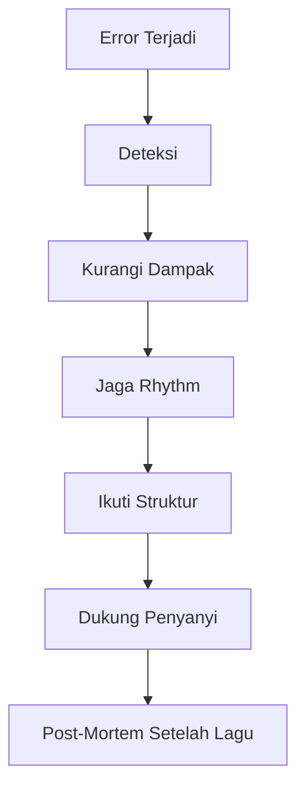
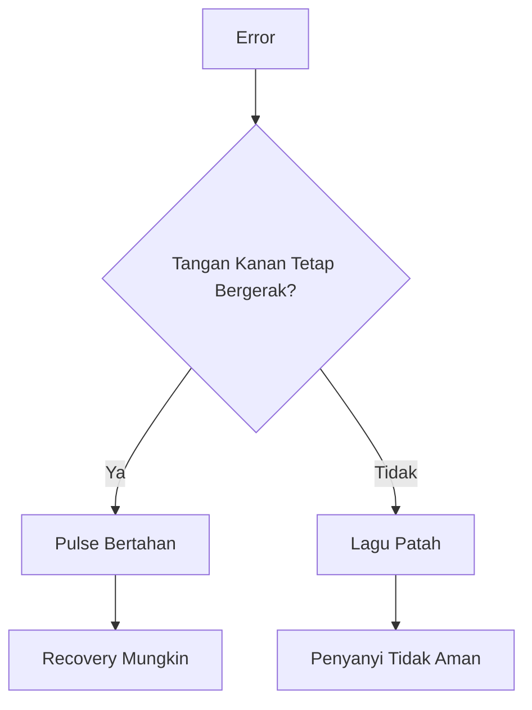
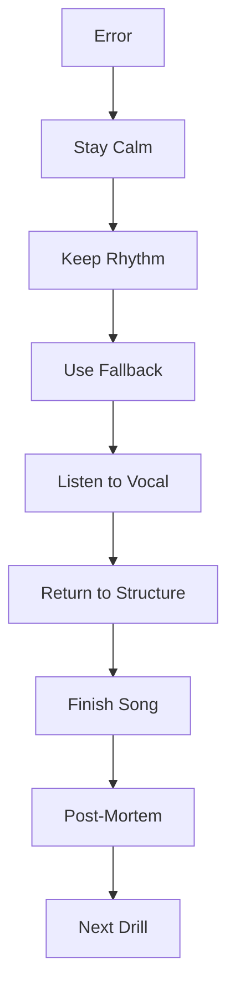

# learn-guitar-accompaniment-part-018.md

# Part 018 — Error Handling: Apa yang Dilakukan Saat Salah di Tengah Lagu

## Status Seri

Seri: **Belajar Guitar Accompaniment Berdasarkan The First 20 Hours**  
Bagian: **018 dari 035**  
Fokus: membangun kemampuan recovery saat terjadi kesalahan di tengah lagu, sehingga iringan tidak berhenti total dan penyanyi tetap merasa aman.

Part ini sangat penting karena performance nyata tidak menuntut nol kesalahan. Performance nyata menuntut kemampuan untuk tetap berjalan ketika kesalahan terjadi.

---

## Tujuan Pembelajaran Part Ini

Setelah menyelesaikan part ini, Anda harus bisa:

1. memahami bahwa error adalah bagian normal dari performance;
2. membedakan error fatal dan non-fatal;
3. mengetahui apa yang harus dilakukan saat chord salah;
4. mengetahui apa yang harus dilakukan saat tempo lari;
5. mengetahui apa yang harus dilakukan saat lupa struktur;
6. mengetahui apa yang harus dilakukan saat penyanyi masuk berbeda;
7. menggunakan partial chord, root note, muted strum, dan sustain sebagai recovery;
8. tidak berhenti total saat salah;
9. membuat post-mortem setelah latihan;
10. melatih error handling secara sengaja.

---

## Prinsip Kaufman yang Dipakai di Part Ini

Dalam *The First 20 Hours*, target rapid skill acquisition bukan kesempurnaan. Targetnya adalah mencapai level performa yang cukup berguna dengan latihan terarah.

Untuk gitar pengiring, level berguna bukan berarti:

```text
Tidak pernah salah.
```

Level berguna berarti:

```text
Bisa terus mengiringi walau terjadi kesalahan kecil.
```

Banyak pemula gagal bukan karena salah chord, tetapi karena setelah salah chord mereka:

- berhenti;
- panik;
- mengulang dari awal;
- kehilangan tempo;
- membuat wajah kaget;
- membuat penyanyi ikut ragu.

Maka error handling adalah skill inti.

---

# 1. Error Pasti Terjadi

Dalam performance nyata, kesalahan bisa datang dari banyak sumber:

```text
[ ] chord salah
[ ] chord telat
[ ] strumming patah
[ ] tempo naik
[ ] tempo turun
[ ] lupa struktur
[ ] lupa ending
[ ] capo salah
[ ] gitar fals
[ ] pick jatuh
[ ] senar buzzing
[ ] penyanyi masuk telat
[ ] penyanyi masuk terlalu cepat
[ ] penyanyi lupa lirik
[ ] audience mengganggu
[ ] sound system bermasalah
```

Tujuan bukan menghilangkan semua error. Tujuan adalah membuat sistem iringan **resilient**.

---

# 2. Reliability Mindset

Dalam software, sistem reliable bukan sistem yang tidak pernah mengalami fault. Sistem reliable adalah sistem yang bisa:

- mendeteksi fault;
- membatasi dampak;
- recover;
- tetap melayani fungsi utama;
- melakukan post-mortem;
- memperbaiki root cause.

Dalam gitar pengiring:

```text
Fault = kesalahan bermain
Service = mendukung penyanyi
Recovery = tetap menjaga lagu
Post-mortem = latihan setelahnya
```



---

# 3. Error Fatal vs Non-Fatal

Tidak semua error sama.

## 3.1 Non-Fatal Error

Contoh:

```text
[ ] satu chord buzzing
[ ] telat sedikit pindah chord
[ ] salah satu strum
[ ] senar x ikut berbunyi pelan
[ ] pattern berubah sedikit
[ ] fill gagal kecil
```

Jika rhythm dan struktur tetap jalan, error ini sering tidak terlalu terasa.

## 3.2 Fatal Error

Contoh:

```text
[ ] berhenti total
[ ] kehilangan tempo sepenuhnya
[ ] tidak tahu section berikutnya
[ ] salah key/capo
[ ] ending kacau
[ ] penyanyi tidak tahu masuk
[ ] chord progression keluar jauh dan tidak kembali
```

Prioritas latihan adalah mengurangi fatal error.

---

# 4. Prinsip Recovery Utama

Jika terjadi error:

```text
1. Jangan berhenti.
2. Jaga tangan kanan bergerak.
3. Cari downbeat berikutnya.
4. Mainkan root atau partial chord jika chord penuh belum siap.
5. Dengarkan penyanyi.
6. Kembali ke struktur.
7. Jangan menunjukkan panik.
8. Evaluasi setelah lagu selesai.
```

Mantra:

> Rhythm first, chord second, ego last.

---

# 5. Saat Chord Salah

Misal harusnya C, tetapi Anda memainkan G.

## 5.1 Jangan Berhenti

Jika Anda berhenti, error menjadi jelas.

## 5.2 Kembali di Beat Berikutnya

Jika tahu chord benar, pindah di beat berikutnya atau bar berikutnya.

## 5.3 Kurangi Volume Sesaat

Jika chord salah sangat terdengar, strum lebih pelan sambil recover.

## 5.4 Gunakan Root Note

Jika tidak sempat bentuk chord penuh, mainkan root.

Contoh harus C:

```text
mainkan senar 5 fret 3
```

Lalu bentuk C penuh.

## 5.5 Jangan Minta Maaf di Tengah Lagu

Minta maaf membuat penyanyi dan audience sadar error.

---

# 6. Saat Chord Telat

Chord telat lebih umum daripada chord salah.

Strategi:

```text
[ ] tangan kanan tetap bergerak
[ ] gunakan muted strum jika chord belum siap
[ ] masuk chord begitu siap
[ ] jangan mengejar dengan panik
[ ] latih pair chord setelahnya
```

Contoh:

```text
G - D - Em - C
```

Jika C belum siap di beat 1:

- lakukan muted/light strum;
- masuk C di beat 2;
- lanjut;
- catat Em-C sebagai bug.

Lebih baik telat sedikit daripada berhenti total.

---

# 7. Saat Strumming Pattern Kacau

Jika pattern `D-D-U-U-D-U` hilang, jangan panik.

Turunkan ke pattern lebih sederhana:

## Level Recovery 1

```text
D D D D
```

Downstroke per beat.

## Level Recovery 2

```text
D - D - D - D -
```

Quarter downstroke.

## Level Recovery 3

```text
D - - - D - - -
```

Beat 1 dan 3 saja.

Prinsip:

> Jika pattern runtuh, kembali ke pulse paling sederhana.

---

# 8. Saat Tempo Naik

Tempo naik biasanya karena:

- gugup;
- chorus terlalu semangat;
- strumming terlalu keras;
- tangan kanan tegang;
- ingin cepat melewati bagian sulit.

Recovery:

```text
[ ] kecilkan gerakan tangan kanan
[ ] kurangi volume
[ ] fokus beat 1
[ ] tarik napas
[ ] dengarkan penyanyi
[ ] jangan tiba-tiba rem drastis
```

Jika terlalu cepat, turunkan perlahan selama beberapa bar. Jangan membuat perubahan mendadak yang mengagetkan penyanyi.

---

# 9. Saat Tempo Turun

Tempo turun biasanya karena:

- chord sulit;
- membaca chord sheet;
- lupa struktur;
- fingerpicking terlalu sulit;
- tangan kiri telat.

Recovery:

```text
[ ] simplify chord
[ ] simplify strumming
[ ] gunakan root/partial chord
[ ] jaga downbeat
[ ] jangan tunggu chord sempurna
```

Setelah lagu selesai, cari chord/section penyebab.

---

# 10. Saat Lupa Struktur

Ini fatal jika tidak ditangani.

Misal Anda lupa setelah chorus harus bridge atau verse.

Strategi:

## 10.1 Dengarkan Penyanyi

Jika penyanyi mulai verse, ikuti verse. Jika mulai bridge, ikuti bridge.

## 10.2 Kembali ke Progression Aman

Jika bingung dan belum ada vokal, ulang progression terakhir satu putaran.

## 10.3 Gunakan Eye Contact

Cari sinyal dari penyanyi.

## 10.4 Jangan Stop

Lebih baik mengulang satu progression daripada berhenti.

## 10.5 Buat Cue Lebih Jelas di Rehearsal Berikutnya

Jika struktur sering lupa, song map belum cukup matang.

---

# 11. Saat Lupa Chord Berikutnya

Strategi:

1. lihat chord sheet jika ada;
2. jika tidak ada, mainkan chord tonic/key sementara;
3. gunakan rhythm ringan;
4. dengarkan melodi penyanyi;
5. kembali saat tahu chord berikutnya.

Jika key G, tonic G sering menjadi tempat aman sementara, tetapi tidak selalu cocok. Gunakan dengan hati-hati.

Lebih aman jika Anda tahu progression umum.

---

# 12. Saat Lupa Lirik Penyanyi atau Cue

Jika Anda tidak menyanyi, tetap perlu tahu lyric cue.

Jika lupa cue:

- jangan memulai chorus terlalu dini;
- ikuti penyanyi;
- ulang progression jika perlu;
- berikan cue lebih hati-hati.

Setelah rehearsal, tandai lyric cue pada song map.

---

# 13. Saat Penyanyi Masuk Terlambat

Jika penyanyi terlambat masuk setelah intro:

## Opsi 1 — Ulang Bar/Progression

Jika penyanyi belum masuk:

```text
ulang intro progression
```

## Opsi 2 — Tahan Chord

Jika ballad:

```text
tahan chord terakhir
```

## Opsi 3 — Beri Cue

Eye contact/nod.

## Opsi 4 — Lanjutkan Jika Penyanyi Masuk Sedikit Telat

Jika telat hanya setengah beat atau satu beat, ikuti secara musikal.

Jangan langsung berhenti.

---

# 14. Saat Penyanyi Masuk Terlalu Cepat

Jika penyanyi masuk sebelum intro selesai:

## Jika Masih Masuk Akal

Ikuti penyanyi dan potong intro.

## Jika Chord Belum Cocok

Gunakan chord yang paling mendukung vocal entry.

## Jika Sangat Kacau Saat Rehearsal

Berhenti dan sepakati ulang intro.

## Jika Saat Performance

Ikuti penyanyi sebisa mungkin. Audience lebih mengikuti vokal daripada intro gitar.

---

# 15. Saat Penyanyi Lupa Lirik

Strategi:

```text
[ ] terus main progression
[ ] jangan panik
[ ] turunkan volume sedikit
[ ] ulang section jika penyanyi memberi sinyal
[ ] masuk chorus jika memungkinkan
[ ] gunakan eye contact
```

Jangan membuat wajah “kamu salah”. Tugas pengiring adalah menjadi safety net.

---

# 16. Saat Penyanyi Mengubah Phrasing

Jika penyanyi menahan nada lebih lama:

- kurangi strumming;
- tahan chord;
- ikuti jika musikal;
- masuk kembali ke pulse saat frasa selesai.

Jika penyanyi mempercepat frasa:

- jangan ikut terburu-buru secara liar;
- jaga pulse;
- adjust sedikit jika perlu.

Keseimbangan:

```text
Ikuti ekspresi, jaga struktur.
```

---

# 17. Saat Pick Jatuh

Ini nyata dan sering terjadi.

Recovery:

## Jika Bisa Finger Strum

Lanjut dengan jari.

## Jika Ada Pick Cadangan

Ambil saat ada ruang, bukan saat vocal line penting.

## Jika Harus Berhenti Sebentar

Gunakan senyum kecil, tetap tenang, lanjut.

Prevention:

```text
[ ] pick cadangan di saku
[ ] pick holder
[ ] grip tidak terlalu longgar
[ ] latihan strum dengan jari sebagai backup
```

---

# 18. Saat Senar Buzzing

Jika satu chord buzzing:

- lanjut;
- tekan lebih dekat fret pada pengulangan berikutnya;
- jangan berhenti.

Jika buzzing parah terus:

- mungkin setup gitar bermasalah;
- mungkin jari lelah;
- simplify chord;
- setelah lagu, cek.

Buzzing kecil biasanya bukan fatal jika rhythm stabil.

---

# 19. Saat Gitar Fals

Jika baru sadar di tengah lagu:

## Sedikit Fals

- lanjut sampai selesai;
- jangan tune di tengah kecuali sangat mengganggu.

## Sangat Fals

- jika performance informal, berhenti dengan tenang dan tune;
- jika rehearsal, tune ulang;
- jika panggung, lihat konteks.

Prevention:

```text
[ ] tune sebelum lagu
[ ] cek setelah pasang capo
[ ] cek setelah perubahan suhu
[ ] senar tidak terlalu tua
```

---

# 20. Saat Capo Salah

Capo salah bisa fatal karena key salah.

Jika sebelum vokal masuk sadar:

- stop;
- perbaiki;
- mulai ulang.

Jika vokal sudah masuk dan key salah:

- jika penyanyi bisa adaptasi dan tidak fatal, lanjut;
- jika terlalu tinggi/rendah, lebih baik berhenti dengan tenang saat rehearsal;
- untuk performance, keputusan tergantung konteks.

Prevention:

```text
Song A = capo 2
Song B = capo 0
Song C = capo 4
```

Tulis besar di setlist.

---

# 21. Saat Salah Lagu atau Salah Intro

Jika Anda memainkan intro lagu lain atau wrong progression:

- jika penyanyi belum masuk, stop ringan dan mulai ulang;
- jika sudah masuk, ikuti penyanyi;
- jika rehearsal, perbaiki cue;
- jika performance informal, senyum dan lanjut.

Prevention:

- setlist jelas;
- chord sheet urut;
- capo position ditulis;
- intro dilatih.

---

# 22. Saat Sound System Bermasalah

Jika amplified:

Masalah:

```text
feedback
gitar terlalu kecil
gitar terlalu besar
monitor tidak terdengar
mic vokal terlalu kecil
```

Recovery:

- main lebih sederhana;
- jangan panik;
- jika feedback, kurangi volume/ubah posisi;
- beri sinyal ke sound engineer jika ada;
- dengarkan vokal akustik jika bisa.

Sebagai pemula, jangan terlalu bergantung pada monitoring sempurna.

---

# 23. Saat Audience Mengganggu

Jika ada suara, obrolan, atau distraksi:

- tetap fokus pada penyanyi;
- jaga tempo;
- jangan mempercepat karena gugup;
- gunakan eye contact dengan penyanyi;
- kembali ke song map.

Performance tidak terjadi di ruang steril.

---

# 24. Saat Tangan Kaku karena Gugup

Gejala:

- strumming keras;
- pick nyangkut;
- chord telat;
- tempo naik;
- napas pendek.

Recovery:

```text
[ ] kecilkan gerakan
[ ] kembali ke downstroke sederhana
[ ] tarik napas
[ ] fokus beat 1
[ ] lihat penyanyi
[ ] jangan mengejar kesempurnaan
```

Prevention:

- simulasi performance;
- no-stop run;
- latihan berdiri;
- rekam video;
- latihan dengan orang menonton.

---

# 25. Recovery Toolkit

Anda perlu toolkit.

## 25.1 Root Note

Mainkan root jika chord penuh belum siap.

## 25.2 Partial Chord

Mainkan sebagian chord yang sudah siap.

Contoh D:

```text
senar 3-2-1 saja
```

## 25.3 Muted Strum

Jika chord belum siap, mute rhythm.

## 25.4 Sustain

Tahan chord sebelumnya sebentar.

## 25.5 Simplified Pattern

Turunkan pattern ke downstroke.

## 25.6 Repeat Progression

Jika penyanyi belum masuk atau struktur bingung.

## 25.7 Eye Contact

Komunikasi non-verbal.

## 25.8 Final Chord

Jika ending kacau, cari tonic/final chord yang aman.

---

# 26. Partial Chord Examples

## 26.1 C Major

Full:

```text
x32010
```

Jika belum siap:

- minimal root C di senar 5 fret 3;
- tambah senar 4 fret 2;
- tambah senar 2 fret 1 jika bisa.

## 26.2 G Major

Full:

```text
320003
```

Jika belum siap:

- root G senar 6 fret 3;
- open G/D string masih membantu;
- G sering cukup forgiving.

## 26.3 D Major

Full:

```text
xx0232
```

Partial:

```text
senar 3 fret 2
senar 2 fret 3
senar 1 fret 2
```

D memang hanya tiga senar atas plus open D. Jika telat, mainkan bagian atas yang siap.

## 26.4 Fmaj7

Full simplified:

```text
x33210
```

Partial:

```text
xx3210
```

Atau bahkan:

```text
xx321x
```

Jika masih terlalu sulit, gunakan C/F-like movement sesuai konteks, tetapi ini harus diuji.

---

# 27. Root Note Table untuk Recovery

| Chord | Root recovery |
|---|---|
| G | senar 6 fret 3 |
| C | senar 5 fret 3 |
| D | senar 4 open |
| Em | senar 6 open |
| Am | senar 5 open |
| A | senar 5 open |
| E | senar 6 open |
| Dm | senar 4 open |
| F/Fmaj7 | senar 4 fret 3 atau senar 5 fret 3 tergantung voicing |

Latih root note. Ini seperti fallback mode.

---

# 28. Forced Mistake Drill

Latih error secara sengaja.

Progression:

```text
G - D - Em - C
```

Aturan:

1. mainkan progression;
2. sengaja telat di C;
3. gunakan muted strum;
4. masuk C di beat 2;
5. lanjut;
6. jangan berhenti.

Tujuan:

> Tubuh belajar bahwa error tidak harus berarti stop.

---

# 29. Wrong Chord Recovery Drill

Progression:

```text
G - D - Em - C
```

Sengaja mainkan chord salah satu kali, misalnya Am di tempat Em.

Lalu:

- jangan berhenti;
- kembali ke C berikutnya;
- jaga rhythm.

Ini melatih mental stability.

---

# 30. Structure Recovery Drill

Song map:

```text
Intro
Verse
Chorus
Verse
Chorus
Bridge
Final Chorus
Outro
```

Latihan:

- minta teman menyebut section random berikutnya;
- atau tulis kartu section;
- coba pindah tanpa berhenti.

Jika sendiri:

- mainkan song map;
- sengaja ulang chorus sekali;
- kembali ke bridge;
- latih tidak panik.

---

# 31. Pick Drop Drill

Latihan backup:

1. mainkan progression dengan pick;
2. letakkan pick;
3. lanjut strum dengan jari;
4. lanjut 30 detik.

Tujuan:

> Jika pick jatuh, Anda tidak langsung mati.

---

# 32. Vocal Late Entry Drill

Latihan dengan intro:

```text
G - D - Em - C
```

Simulasi:

- penyanyi tidak masuk setelah intro;
- ulang progression sekali;
- beri cue lagi.

Latih agar tidak panik.

---

# 33. Vocal Early Entry Drill

Simulasi:

- penyanyi masuk setelah 2 bar, bukan 4 bar;
- Anda potong intro dan masuk verse support.

Ini melatih fleksibilitas.

---

# 34. Tempo Recovery Drill

Metronome 70 BPM.

Mainkan progression.

Sengaja hampir mempercepat di chorus, lalu kendalikan:

- kecilkan strum;
- fokus beat 1;
- kembali stabil.

Tujuan:

> Sadar saat tempo mulai naik.

---

# 35. No-Stop Full Run

Aturan:

```text
Mainkan lagu dari awal sampai akhir.
Tidak restart.
Tidak berhenti.
Tidak mengulang section kecuali memang arrangement.
Catat error setelah selesai.
```

Ini harus menjadi bagian rutin latihan.

No-stop full run lebih mendekati performance daripada latihan potongan.

---

# 36. Post-Mortem Setelah Lagu

Setelah run, jangan hanya bilang “jelek”. Buat post-mortem.

Template:

```text
Song:
Run number:
What happened:
Impact:
Root cause:
Recovery:
Prevention:
Next drill:
```

Contoh:

```text
Song: Practice Song A
Run number: 3
What happened: telat masuk C di chorus
Impact: rhythm sempat kosong
Root cause: Em-C transition belum otomatis
Recovery: muted strum lalu masuk C beat 2
Prevention: Em-C one-minute drill
Next drill: Em-C 5 menit at 60 BPM
```

---

# 37. Blameless Post-Mortem

Jangan gunakan post-mortem untuk menyalahkan diri.

Buruk:

```text
Saya bodoh, selalu salah C.
```

Baik:

```text
C telat karena jari telunjuk terlalu rebah dan transisi Em-C belum otomatis.
Next drill: low-lift Em-C.
```

Error adalah data.

---

# 38. Error Log

Buat log error berulang.

| Date | Song | Error | Severity | Recovery | Next Drill |
|---|---|---|---|---|---|
| Jun 25 | Song A | C telat | P1 | muted strum | Em-C pair |
| Jun 26 | Song A | tempo naik chorus | P1 | reduced strum | metronome chorus |
| Jun 27 | Song B | forgot bridge | P0 | repeated chorus | song map drill |

Setelah beberapa sesi, pattern terlihat.

---

# 39. Error Severity

Gunakan severity.

## P0 — Fatal

```text
berhenti total
lupa struktur
key/capo salah
penyanyi tidak bisa masuk
ending gagal total
```

## P1 — High

```text
tempo drift besar
chord telat sering
strumming patah
gitar menutup vokal
```

## P2 — Medium

```text
chord buzzing
pattern kurang konsisten
cue kurang jelas
```

## P3 — Low

```text
ornamen kurang halus
fill gagal kecil
voicing kurang indah
```

Latih P0 dan P1 dulu.

---

# 40. Error Handling Saat Rehearsal vs Performance

## 40.1 Saat Rehearsal

Boleh berhenti jika:

- error berulang;
- perlu menyepakati cue;
- key salah;
- struktur tidak jelas;
- penyanyi tidak nyaman.

Tetapi jangan selalu berhenti di setiap error kecil. Tetap latih no-stop run.

## 40.2 Saat Performance

Hampir selalu:

```text
lanjut
recover
jaga vokal
selesaikan lagu
```

Kecuali error teknis fatal seperti capo salah total atau gitar tidak bersuara.

---

# 41. Communication Recovery dengan Penyanyi

Sebelum tampil, sepakati:

```text
Jika intro kelewat, ulang progression.
Jika ending ragu, lihat saya.
Jika lupa lirik, kita lanjut ke chorus.
Jika tempo terasa cepat, beri gesture.
Jika saya salah chord, kamu tetap nyanyi.
```

Ini membuat error lebih aman.

---

# 42. Rehearsal Agreement Template

```text
Song:
Intro length:
Vocal entry cue:
If vocal late:
If vocal early:
If lyric forgotten:
Bridge cue:
Ending cue:
Emergency fallback:
```

Contoh:

```text
Song: Practice Song
Intro length: G-D-Em-C x1
Vocal entry cue: nod at C bar
If vocal late: repeat intro
If vocal early: cut intro and follow vocal
If lyric forgotten: continue progression, enter chorus
Bridge cue: eye contact after chorus 2
Ending cue: final line, hold G
Emergency fallback: repeat chorus progression
```

---

# 43. Recovery dan Wajah

Ekspresi wajah penting.

Jika Anda salah lalu wajah panik, penyanyi dan audience ikut sadar.

Latih:

- tetap netral;
- senyum kecil jika perlu;
- mata ke penyanyi;
- tubuh tetap pulse;
- jangan menggeleng kecewa.

Performance adalah komunikasi, bukan hanya suara.

---

# 44. Recovery dan Tangan Kanan

Tangan kanan adalah lifeline.

Jika tangan kanan berhenti, lagu terasa berhenti.

Latihan:

- mute strum saat chord kiri kacau;
- downstroke per beat sebagai fallback;
- tangan kanan tetap bergerak;
- jangan menunggu chord sempurna.



---

# 45. Recovery dan Downbeat

Jika tersesat, cari beat 1 berikutnya.

Downbeat adalah anchor.

Strategi:

```text
[ ] dengarkan pulse
[ ] hitung sampai 4 atau 6
[ ] masuk chord berikut di beat 1
[ ] jangan masuk sembarang tempat jika bisa menunggu setengah bar
```

Dalam 6/8, anchor besar ada di 1 dan 4.

---

# 46. Latihan 45 Menit untuk Part Ini

## Block 1 — Recovery Toolkit, 8 Menit

Latih:

```text
root note G, C, D, Em, Am
partial chord
muted strum
```

## Block 2 — Chord Telat Drill, 8 Menit

Progression:

```text
G-D-Em-C
```

Sengaja telat C, recover.

## Block 3 — Wrong Chord Drill, 8 Menit

Sengaja salah satu chord, lanjut.

## Block 4 — Structure Recovery, 8 Menit

Latih song map:

```text
Intro-Verse-Chorus-Bridge-Outro
```

Sengaja ulang section, kembali.

## Block 5 — No-Stop Full Run, 8 Menit

Mainkan satu lagu penuh tanpa berhenti.

## Block 6 — Post-Mortem, 5 Menit

Isi:

```text
Error:
Impact:
Recovery:
Next drill:
```

---

# 47. Latihan 15 Menit

```text
2 menit  tuning
3 menit  root note recovery
4 menit  chord telat drill
4 menit  no-stop section run
2 menit  post-mortem
```

Jika hanya 5 menit:

```text
1 menit  root G/C/D/Em
2 menit  muted strum recovery
2 menit  G-D-Em-C no-stop
```

---

# 48. Mini Project Part Ini

Pilih satu lagu target.

Lakukan 3 no-stop runs.

Setiap run harus sengaja punya satu error:

```text
Run 1: chord telat
Run 2: pattern hilang
Run 3: vocal entry terlambat simulasi
```

Untuk setiap run, isi post-mortem.

Target:

> Anda belajar bahwa error bisa dikelola tanpa menghentikan lagu.

---

# 49. Acceptance Criteria Part 018

Anda boleh lanjut ke part 019 jika:

```text
[ ] Bisa menjelaskan error fatal vs non-fatal
[ ] Bisa menjelaskan prinsip "jangan berhenti"
[ ] Bisa melakukan muted strum saat chord telat
[ ] Bisa memakai root note sebagai fallback
[ ] Bisa memainkan partial chord sederhana
[ ] Bisa recover dari chord salah tanpa restart
[ ] Bisa melakukan no-stop full run
[ ] Bisa membuat post-mortem setelah run
[ ] Bisa membuat rehearsal agreement dengan penyanyi
[ ] Bisa menjaga ekspresi/tangan kanan saat error
```

---

# 50. Ringkasan Mental Model

Performance bukan tentang tidak pernah salah. Performance adalah sistem recovery.



Pengiring yang baik bukan yang steril dari error, tetapi yang membuat penyanyi tetap aman ketika error terjadi.

---

# 51. Output Part Ini

Output konkret:

1. Anda punya recovery toolkit.
2. Anda bisa membedakan error fatal/non-fatal.
3. Anda bisa menggunakan root, partial chord, muted strum, dan simplified pattern.
4. Anda bisa menjalankan no-stop run.
5. Anda bisa membuat post-mortem.
6. Anda siap masuk ke ear training minimum.

Part berikutnya:

> **Ear Training Minimum: Mendengar Chord, Tempo, dan Fals.**

