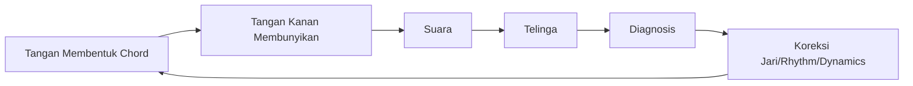
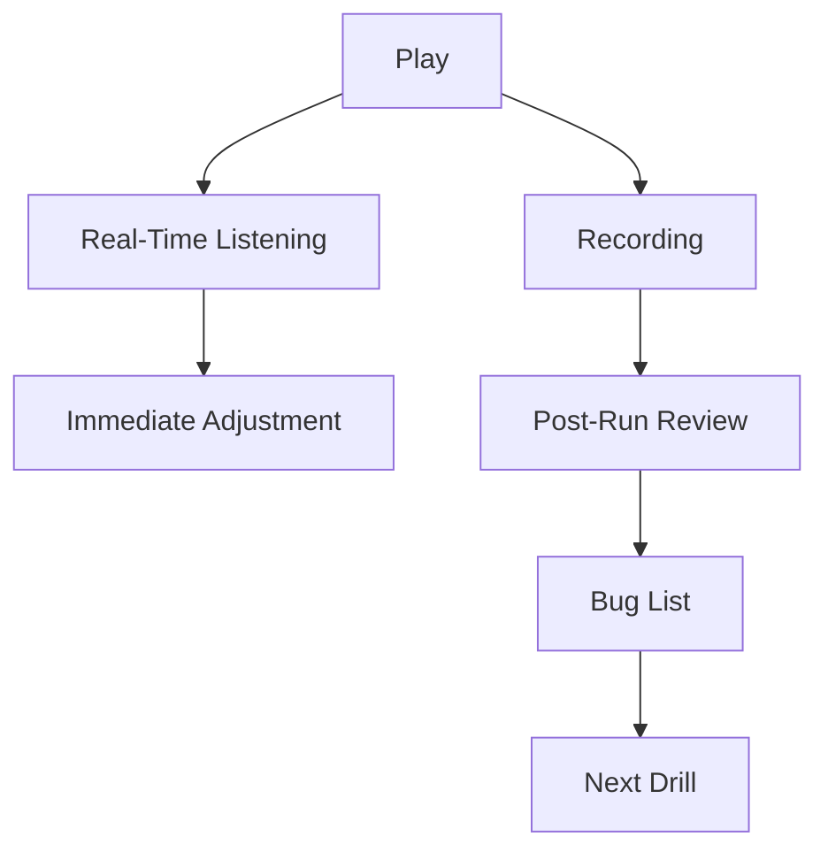
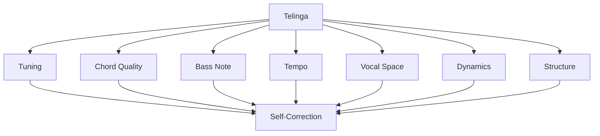

# learn-guitar-accompaniment-part-019.md

# Part 019 — Ear Training Minimum: Mendengar Chord, Tempo, dan Fals

## Status Seri

Seri: **Belajar Guitar Accompaniment Berdasarkan The First 20 Hours**  
Bagian: **019 dari 035**  
Fokus: melatih pendengaran minimum yang dibutuhkan gitaris pengiring agar bisa menyadari gitar fals, chord salah, tempo drift, dan kebutuhan vokal tanpa harus menjadi musisi dengan absolute pitch.

Part ini bukan ear training akademik. Ini adalah ear training fungsional untuk mengiringi penyanyi.

---

## Tujuan Pembelajaran Part Ini

Setelah menyelesaikan part ini, Anda harus bisa:

1. memahami bahwa telinga adalah feedback loop utama dalam musik;
2. membedakan major dan minor secara rasa;
3. mendengar gitar yang out of tune secara praktis;
4. mendengar chord yang kotor atau salah;
5. mendengar tempo yang naik/turun;
6. mendengar kapan vokal butuh ruang;
7. mengenali chord change dasar;
8. memakai rekaman untuk self-correction;
9. melakukan latihan call-response sederhana;
10. memahami batas realistis ear training dalam 20 jam pertama.

---

## Prinsip Kaufman yang Dipakai di Part Ini

Dalam *The First 20 Hours*, salah satu prinsip penting adalah **learn enough to self-correct**.

Untuk gitar pengiring, self-correction sangat bergantung pada pendengaran. Jika Anda tidak mendengar masalah, Anda tidak bisa memperbaikinya.

Namun, bukan berarti Anda harus langsung bisa:

- menebak semua chord hanya dari mendengar;
- punya absolute pitch;
- transcribe solo;
- mengenali semua interval;
- mendengar chord extension kompleks.

Target 20 jam pertama lebih sederhana:

> Bisa mendengar masalah paling penting yang mengganggu iringan vokal.

Masalah penting itu:

```text
gitar fals
chord salah
chord kotor
tempo lari
strumming terlalu ramai
vokal tertutup
section terasa tidak naik
ending tidak yakin
```

---

# 1. Telinga sebagai Feedback Loop

Gitar adalah sistem motorik + auditori. Tangan menghasilkan suara, telinga mengevaluasi, otak mengoreksi, lalu tangan memperbaiki.



Jika telinga tidak dilatih, Anda hanya mengandalkan visual:

```text
Jari saya kelihatannya benar.
```

Padahal musik dinilai dari suara, bukan dari bentuk jari.

---

# 2. Absolute Pitch Tidak Diperlukan

Absolute pitch adalah kemampuan mengenali nama nada tanpa referensi. Ini tidak diperlukan untuk target Anda.

Yang lebih berguna:

## 2.1 Relative Listening

Mendengar hubungan antar-suara:

```text
chord ini lebih tinggi/rendah
chord ini major/minor
progression ini pulang/tidak pulang
tempo ini naik/turun
vokal ini tertutup/tidak
```

## 2.2 Practical Detection

Mendeteksi:

```text
ada yang fals
ada string mati
ada chord salah
ada beat hilang
```

Target kita adalah practical ear, bukan superpower.

---

# 3. Mendengar Gitar Fals

Gitar fals adalah masalah P0. Semua latihan harmoni menjadi tidak valid jika gitar tidak tune.

## 3.1 Gejala Gitar Fals

- chord terdengar “bergelombang” aneh;
- open chord tidak menyatu;
- penyanyi sulit menemukan nada;
- chord benar terasa salah;
- strumming terdengar kasar walau jari benar;
- capo membuat nada terasa sharp;
- satu senar terdengar menonjol salah.

## 3.2 Latihan Mendengar Fals

1. Tune gitar dengan tuner.
2. Mainkan chord G.
3. Dengarkan suara yang bersih.
4. Turunkan sedikit tuning senar 2.
5. Mainkan G lagi.
6. Dengarkan rasa tidak nyaman.
7. Tune ulang.

Lakukan dengan hati-hati. Jangan terlalu banyak mengubah tuning. Tujuannya mengenali perbedaan.

## 3.3 Jangan Mengandalkan Perasaan Saja

Gunakan tuner tetap. Ear training tidak menggantikan tuner di fase awal.

Prinsip:

```text
Tuner = source of truth setup.
Telinga = detector saat bermain.
```

---

# 4. Mendengar Chord Bersih vs Kotor

Chord bersih:

- root jelas;
- string target berbunyi;
- tidak ada buzzing dominan;
- tidak ada string mati yang penting;
- tidak ada bass yang salah terlalu keras.

Chord kotor:

- ada buzzing;
- ada string mati;
- ada string yang seharusnya mute tetapi berbunyi;
- chord terdengar muddy;
- chord tidak menyatu.

## Latihan

Pilih C:

```text
C = x32010
```

Mainkan versi benar, lalu sengaja buat bug:

1. telunjuk terlalu rebah sehingga senar 1 mati;
2. strum dari senar 6 sehingga bass E ikut keras;
3. jari tengah jauh dari fret sehingga buzzing.

Dengarkan masing-masing bug.

Tujuan:

> Bukan hanya tahu chord salah, tetapi tahu jenis salahnya.

---

# 5. Mendengar Major vs Minor

Major dan minor adalah perbedaan rasa paling penting di awal.

Latihan pasangan:

```text
E  → Em
A  → Am
D  → Dm
```

Dengarkan:

- major terasa lebih terang/stabil;
- minor terasa lebih gelap/sedih/introspektif.

## Latihan 1 — Major/Minor Toggle

Mainkan:

```text
E  = 022100
Em = 022000
```

Ulang:

```text
E - Em - E - Em
```

Perhatikan bahwa hanya satu nada berubah, tetapi rasa berubah besar.

## Latihan 2 — A/Am

```text
A  = x02220
Am = x02210
```

## Latihan 3 — D/Dm

```text
D  = xx0232
Dm = xx0231
```

Target:

> Anda bisa mendengar jika Am tidak sengaja dimainkan sebagai A, atau Em sebagai E.

---

# 6. Major/Minor Error dalam Lagu

Progression:

```text
C - G - Am - F
```

Jika Am dimainkan sebagai A:

```text
C - G - A - F
```

Rasanya berubah drastis.

Latihan:

1. mainkan progression benar;
2. mainkan versi salah;
3. dengarkan perbedaannya;
4. catat rasa “keluar jalur”.

Ini melatih deteksi chord quality.

---

# 7. Mendengar Root dan Bass

Bass note sering menentukan identitas chord.

Contoh:

```text
D = xx0232
```

Jika Anda strum dari senar 6, bass E rendah ikut berbunyi. Chord D menjadi kotor.

Latihan:

1. mainkan D mulai dari senar 4;
2. mainkan D mulai dari senar 6;
3. dengarkan perbedaannya.

Lakukan juga untuk C:

1. C mulai dari senar 5;
2. C dengan senar 6 ikut keras.

Target:

> Anda bisa mendengar bass note salah walau shape chord atas benar.

---

# 8. Mendengar Chord Change

Chord change adalah momen harmoni bergerak.

Latihan progression:

```text
G - D - Em - C
```

Mainkan satu strum per chord.

Dengarkan:

- G ke D terasa bergerak/tegang;
- D ke Em turun ke minor;
- Em ke C terasa hangat;
- C ke G terasa pulang.

Tidak perlu nama teorinya sempurna. Yang penting telinga mulai mengenali arah.

## Latihan Call-Out

Rekam diri memainkan:

```text
G - D - Em - C
```

Lalu dengarkan tanpa gitar di tangan dan ucapkan chord saat berubah.

Target awal:

```text
tahu kapan chord berubah
```

Bukan langsung menebak chord dari lagu baru.

---

# 9. Mendengar Tonic / Home

Dalam key G, chord G sering terasa seperti rumah.

Latihan:

```text
G - D - Em - C - G
```

Dengarkan saat kembali ke G.

Pertanyaan:

```text
Apakah terasa pulang?
Apakah progression terasa selesai?
```

Dalam key C:

```text
C - G - Am - F - C
```

Dengarkan C terakhir.

Ini membantu ending dan struktur.

---

# 10. Mendengar V ke I

Dalam key G:

```text
D → G
```

Dalam key C:

```text
G → C
```

Dalam key D:

```text
A → D
```

Latihan:

```text
D - G
D - G
D - G
```

Lalu:

```text
G - C
G - C
```

Dengarkan rasa tension ke release.

Ini berguna untuk mengetahui ending yang terasa selesai.

---

# 11. Mendengar Tempo Drift

Tempo drift sering tidak terasa saat bermain. Recording sangat penting.

## 11.1 Latihan dengan Metronome

1. Set metronome 70 BPM.
2. Mainkan G-D-Em-C selama 1 menit.
3. Rekam.
4. Dengarkan apakah strum sejajar dengan click.

## 11.2 Latihan Tanpa Metronome

1. Mainkan 1 menit tanpa metronome.
2. Setelah selesai, nyalakan metronome 70 BPM.
3. Bandingkan apakah tempo akhir Anda lebih cepat/lambat.

## 11.3 Tanda Tempo Naik

- strumming makin keras;
- chorus terasa terburu;
- vocal phrase terasa dikejar;
- tangan kanan makin kecil tapi cepat;
- ending datang terlalu cepat.

## 11.4 Tanda Tempo Turun

- chord sulit membuat pause;
- verse terasa berat;
- vocal line kehilangan momentum;
- bar terasa memanjang.

---

# 12. Mendengar Beat Hilang

Beat hilang biasanya terjadi saat:

- pindah ke chord sulit;
- membaca chord sheet;
- masuk bridge;
- lupa lirik/cue;
- fingerpicking pattern runtuh.

Latihan:

1. rekam progression;
2. dengarkan tanpa melihat tangan;
3. tepuk beat sambil mendengar;
4. tandai bagian tepukan terasa terganggu.

Jika tepukan Anda bingung, rhythm Anda mungkin tidak stabil.

---

# 13. Mendengar Strumming Terlalu Ramai

Strumming terlalu ramai jika:

- lirik tidak jelas;
- vocal consonant tertutup;
- verse terasa seperti chorus;
- penyanyi harus bernyanyi lebih keras;
- tidak ada ruang napas;
- semua section sama padat.

Latihan:

Mainkan verse dengan dua versi.

Versi A:

```text
D - D U - U D U
```

Versi B:

```text
D - - U D - - U
```

Putar vocal recording. Dengarkan mana yang memberi ruang.

Target:

> Telinga belajar memilih density berdasarkan vokal.

---

# 14. Mendengar Chorus Tidak Naik

Chorus harus terasa naik dari verse.

Jika tidak naik, kemungkinan:

- verse terlalu penuh;
- chorus tidak cukup berbeda;
- volume sama;
- density sama;
- strumming tidak berubah;
- vokal tidak didukung;
- chord transition di chorus ragu.

Latihan:

Rekam:

```text
Verse sparse
Chorus fuller
```

Lalu rekam:

```text
Verse full
Chorus full
```

Bandingkan. Dengarkan bahwa versi kedua lebih datar.

---

# 15. Mendengar Vokal Butuh Ruang

Tanda vokal butuh ruang:

- lirik padat;
- penyanyi mengambil napas besar;
- nada tinggi;
- kata emosional;
- verse pertama;
- bridge intimate;
- ending lembut.

Saat mendengar ini, gitar bisa:

- mengurangi density;
- menurunkan volume;
- memakai sustain;
- memakai picking;
- menghindari accent keras.

Ear training untuk pengiring bukan hanya mendengar chord. Ini juga mendengar manusia.

---

# 16. Mendengar Balance Gitar-Vokal

Latihan dengan rekaman:

1. rekam gitar + vokal/hum;
2. dengarkan dengan volume kecil;
3. tanyakan: apakah lirik masih jelas?
4. dengarkan dengan headphone;
5. tanyakan: apakah gitar terlalu tajam?

Checklist:

```text
[ ] vokal jelas
[ ] gitar tidak menutup kata
[ ] bass tidak muddy
[ ] chorus mendukung
[ ] verse memberi ruang
```

---

# 17. Ear Training dengan Tuner

Gunakan tuner untuk kalibrasi.

Latihan:

1. tune senar 6 ke E;
2. petik dan dengarkan;
3. sengaja turunkan sedikit;
4. lihat tuner menunjukkan flat;
5. dengarkan flat;
6. naikkan sedikit;
7. lihat tuner sharp;
8. dengarkan sharp;
9. kembali ke tengah.

Tujuannya menghubungkan visual tuner dengan sensasi telinga.

---

# 18. Ear Training dengan Metronome

Metronome melatih telinga terhadap waktu.

Latihan:

## 18.1 Click Alignment

Strum tepat bersama click.

## 18.2 Click Gap

Set metronome lebih lambat, misalnya 40 BPM, dan anggap click sebagai beat 1 saja.

Ini sulit, bisa nanti. Untuk 20 jam pertama, cukup alignment biasa.

## 18.3 Accent Listening

Accent beat 2 dan 4 sambil click berjalan.

Dengarkan apakah accent Anda konsisten.

---

# 19. Ear Training dengan Drone / Tonic

Jika ada aplikasi drone, bisa dipakai. Tetapi tidak wajib.

Latihan sederhana:

- mainkan chord G;
- biarkan sustain;
- hum nada yang terasa “rumah”;
- mainkan D lalu kembali G;
- dengarkan pulang.

Ini membantu sense key.

---

# 20. Call and Response Sederhana

Call-response melatih telinga dan tangan.

## 20.1 Rhythm Call-Response

Tepuk:

```text
D - D U
```

Lalu mainkan di gitar muted.

Atau:

```text
1 2 3 4
clap clap - clap
```

Lalu strum pattern itu.

## 20.2 Chord Call-Response

Mainkan G. Diam. Mainkan D. Dengarkan perbedaan.

Minta teman memainkan G atau Em, Anda tebak major/minor. Jika tidak ada teman, rekam beberapa chord acak dan dengarkan ulang.

---

# 21. Mencari Chord dari Lagu Sederhana

Ini skill lanjutan, tetapi bisa dimulai ringan.

Langkah:

1. pilih lagu sangat sederhana;
2. cari key dari chord chart dulu;
3. dengarkan bass note;
4. coba chord I, IV, V, vi;
5. jangan langsung menebak semua;
6. validasi dengan chord chart.

Untuk 20 jam pertama, targetnya bukan transcribe penuh. Targetnya memahami bahwa banyak lagu memakai chord family.

---

# 22. Ear Training untuk Common Progression

Latih mendengar progression yang sudah dikenal.

## I–V–vi–IV

```text
G - D - Em - C
C - G - Am - F
```

## vi–IV–I–V

```text
Em - C - G - D
Am - F - C - G
```

## I–IV–V

```text
G - C - D
C - F - G
```

Mainkan dan dengarkan rasa masing-masing.

---

# 23. Mendengar Section Change

Section change sering terdengar dari:

- dynamics naik/turun;
- melodi berubah;
- chord progression berubah;
- drum/groove masuk;
- lyric hook;
- pre-chorus build;
- chorus lebih lebar.

Latihan:

Dengarkan lagu target dan tandai:

```text
Intro:
Verse:
Pre-Chorus:
Chorus:
Bridge:
Outro:
```

Ear training ini membantu Anda tidak tersesat dalam struktur.

---

# 24. Mendengar Ending yang Yakin

Ending yang yakin biasanya:

- kembali ke tonic;
- rhythm berhenti jelas;
- final chord sustain;
- vocal phrase selesai;
- tidak ada strum ragu setelahnya.

Latihan:

Mainkan:

```text
G - D - Em - C - G
```

Tahan G.

Lalu mainkan:

```text
G - D - Em - C
```

Berhenti di C.

Dengarkan mana yang terasa selesai. Tidak selalu harus tonic, tetapi untuk pemula, tonic ending sering aman.

---

# 25. Mendengar Capo dan Key

Latihan:

1. mainkan G-D-Em-C tanpa capo;
2. pasang capo 2;
3. mainkan shape sama;
4. dengarkan pitch naik;
5. nyanyikan/hum melodi sederhana;
6. rasakan apakah lebih tinggi.

Tujuan:

> Telinga menghubungkan capo dengan perubahan key, bukan hanya posisi alat.

---

# 26. Ear Training dan Recording Review

Setiap recording review harus punya fokus telinga.

Jangan hanya:

```text
bagus / jelek
```

Gunakan kategori:

```text
Tuning:
Chord:
Tempo:
Rhythm:
Vocal space:
Dynamics:
Structure:
Ending:
```

Contoh review:

```text
Tuning: ok
Chord: C senar 1 sering mati
Tempo: naik di chorus
Rhythm: pattern stabil
Vocal space: verse terlalu ramai
Dynamics: chorus naik sedikit
Structure: bridge lupa
Ending: cukup jelas
```

---

# 27. Latihan Ear Training 45 Menit

## Block 1 — Tuning Awareness, 8 Menit

- tune gitar;
- dengarkan chord G;
- detune sedikit satu senar;
- dengarkan;
- tune ulang.

## Block 2 — Major/Minor, 8 Menit

Mainkan:

```text
E-Em
A-Am
D-Dm
```

Dengarkan rasa.

## Block 3 — Bass Note, 8 Menit

Mainkan C dan D dengan bass benar/salah.

Dengarkan perbedaan.

## Block 4 — Tempo Listening, 8 Menit

Mainkan G-D-Em-C dengan metronome.

Rekam dan dengarkan alignment.

## Block 5 — Vocal Space, 8 Menit

Mainkan verse sparse vs full sambil vocal recording/hum.

Dengarkan mana lebih mendukung.

## Block 6 — Review Notes, 5 Menit

Catat 3 hal yang telinga Anda mulai bisa deteksi.

---

# 28. Latihan Ear Training 15 Menit

```text
3 menit  tune dan dengarkan open strings
3 menit  E vs Em, A vs Am
3 menit  C bass benar vs salah
3 menit  metronome + G-D-Em-C
3 menit  recording review singkat
```

Jika hanya 5 menit:

```text
2 menit  E vs Em
2 menit  G-D-Em-C dengarkan chord change
1 menit  catat apa yang terdengar
```

---

# 29. Mini Project Part Ini

Pilih satu lagu target.

Buat listening map:

```text
Title:
Key/capo:
Feel:
Tuning issues:
Chord that often sounds dirty:
Tempo drift section:
Where vocal needs space:
Where chorus should lift:
Where ending resolves:
Top 3 listening bugs:
```

Lalu rekam satu full run dan isi map.

Target:

> Anda mulai mendengar masalah spesifik, bukan hanya merasa “belum bagus”.

---

# 30. Batas Realistis Ear Training 20 Jam

Dalam 20 jam pertama, realistis untuk bisa:

```text
[ ] mendengar gitar sangat fals
[ ] mendengar major vs minor dasar
[ ] mendengar tempo naik/turun besar
[ ] mendengar chord kotor jelas
[ ] mendengar vokal tertutup
[ ] mendengar section tidak naik
[ ] mengenali chord change dalam lagu yang sudah dipelajari
```

Belum realistis untuk berharap:

```text
[ ] menebak semua chord lagu baru langsung
[ ] mengenali semua interval
[ ] transcribe melodi kompleks
[ ] mendengar chord extension detail
[ ] punya pitch sempurna
```

Jangan salah target.

---

# 31. Kesalahan Engineer-Minded dalam Ear Training

## 31.1 Ingin Jawaban Biner

Musik sering bukan benar/salah biner. Ada “lebih cocok”, “kurang stabil”, “terlalu ramai”, “cukup aman”.

## 31.2 Mengandalkan Visual

Chord diagram benar belum tentu suara benar.

## 31.3 Menolak Recording karena Tidak Nyaman

Recording sering membuat kita sadar kesalahan. Itu memang fungsinya.

## 31.4 Ingin Ear Training Akademik Terlalu Cepat

Interval, solfege, dictation berguna, tetapi jangan sampai menghambat latihan lagu nyata.

## 31.5 Tidak Mendengar Vokal

Pengiring harus melatih telinga terhadap vokal, bukan hanya gitar.

---

# 32. Debugging Matrix Ear Training

| Symptom yang Didengar | Kemungkinan Penyebab | Fix |
|---|---|---|
| Chord terasa salah semua | gitar fals | tune ulang |
| Satu chord terasa keluar | major/minor salah | cek chord quality |
| Bass muddy | senar rendah salah ikut | mulai dari root |
| Tempo chorus terburu | strumming terlalu keras/gugup | kurangi density, metronome |
| Verse menutup vokal | gitar terlalu ramai | sparse pattern |
| Ending menggantung | tidak resolve / cue lemah | final tonic, ending rehearse |
| Picking tidak stabil | thumb tidak steady | thumb-only drill |
| Section datar | dynamics sama | dynamic map |

---

# 33. Ear Training sebagai Observability

Telinga adalah observability real-time. Recording adalah observability post-run.



Keduanya dibutuhkan. Saat bermain, telinga membantu adjust. Setelah bermain, recording membantu diagnosis lebih objektif.

---

# 34. Acceptance Criteria Part 019

Anda boleh lanjut ke part 020 jika:

```text
[ ] Bisa menjelaskan kenapa telinga adalah feedback loop utama
[ ] Bisa membedakan E vs Em secara rasa
[ ] Bisa membedakan A vs Am secara rasa
[ ] Bisa mendengar C/D dengan bass salah terasa lebih kotor
[ ] Bisa mendengar tempo naik/turun besar dari recording
[ ] Bisa mendengar verse terlalu ramai untuk vokal
[ ] Bisa mengenali chord change dalam G-D-Em-C
[ ] Bisa menggunakan tuner sebagai kalibrasi
[ ] Bisa membuat listening map untuk satu lagu
[ ] Bisa mereview recording dengan kategori spesifik
```

---

# 35. Ringkasan Mental Model

Ear training untuk pengiring bukan soal menjadi jenius pendengaran. Ear training adalah kemampuan mendeteksi hal yang mengganggu fungsi iringan.



Semakin baik telinga Anda, semakin cepat Anda memperbaiki permainan.

---

# 36. Output Part Ini

Output konkret:

1. Anda tahu target realistis ear training.
2. Anda bisa mendengar major/minor dasar.
3. Anda bisa mendengar chord kotor dan bass salah.
4. Anda bisa mendengar tempo drift besar.
5. Anda bisa mendengar apakah gitar menutup vokal.
6. Anda siap merapikan teori musik minimum secara lebih sistematis.

Part berikutnya:

> **Teori Musik Minimum untuk Gitar Pengiring.**

