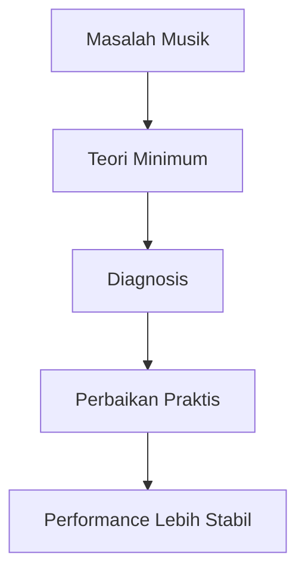
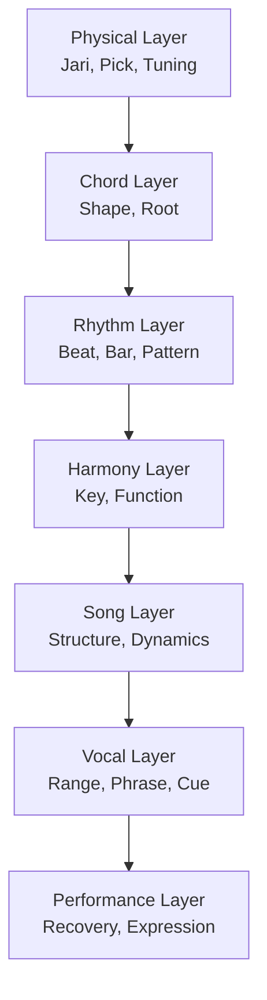
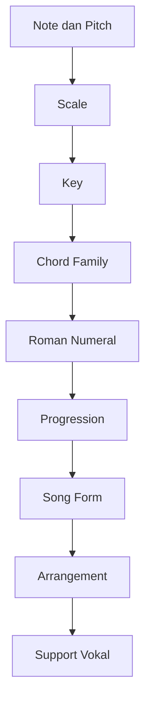

# learn-guitar-accompaniment-part-020.md

# Part 020 — Teori Musik Minimum untuk Gitar Pengiring

## Status Seri

Seri: **Belajar Guitar Accompaniment Berdasarkan The First 20 Hours**  
Bagian: **020 dari 035**  
Fokus: merapikan teori musik minimum yang dibutuhkan gitaris pengiring agar chord, key, capo, progression, rhythm, dan arrangement tidak terasa seperti hafalan terpisah.

Part ini bukan teori musik lengkap. Ini adalah teori yang cukup untuk memahami, mengembangkan, dan memperbaiki iringan gitar-vokal.

---

## Tujuan Pembelajaran Part Ini

Setelah menyelesaikan part ini, Anda harus bisa:

1. memahami note, pitch, semitone, whole step;
2. memahami scale secara praktis;
3. memahami key dan tonic;
4. memahami interval dasar;
5. memahami triad major/minor;
6. memahami chord dan chord quality;
7. memahami diatonic chord;
8. memahami roman numeral;
9. memahami progression umum;
10. memahami time signature dan subdivision;
11. memahami teori sebagai alat debugging, bukan beban akademik.

---

## Prinsip Kaufman yang Dipakai di Part Ini

Dalam *The First 20 Hours*, teori dipelajari secukupnya untuk mempercepat praktik dan self-correction. Teori yang baik membantu Anda:

- memahami pola;
- menghindari hafalan acak;
- memperbaiki error;
- menyederhanakan lagu;
- transpose;
- berkomunikasi dengan musisi lain;
- membuat keputusan arrangement.

Teori yang buruk untuk fase awal adalah teori yang membuat Anda berhenti bermain.

Target part ini:

> Membangun peta teori minimum yang langsung terhubung ke praktik mengiringi penyanyi.

---

# 1. Teori sebagai Debugging Tool

Teori bukan tujuan akhir. Teori adalah alat untuk menjawab pertanyaan seperti:

```text
Kenapa chord ini cocok?
Kenapa chord ini terasa salah?
Kenapa penyanyi merasa terlalu tinggi?
Kenapa capo 2 membuat G shape terdengar A?
Kenapa chorus terasa tidak pulang?
Kenapa D harus mulai dari senar 4?
Kenapa Am tidak boleh diganti A sembarangan?
Kenapa lagu ini terasa 6/8, bukan 4/4?
```



Jika teori tidak membantu tindakan, simpan untuk nanti.

---

# 2. Pitch dan Note

## 2.1 Pitch

Pitch adalah tinggi-rendah suara.

Contoh:

- senar 6 gitar lebih rendah dari senar 1;
- fret lebih tinggi menghasilkan pitch lebih tinggi;
- capo menaikkan pitch;
- suara penyanyi bisa terlalu tinggi/rendah untuk lagu tertentu.

## 2.2 Note

Note adalah nama untuk pitch.

Nama note dasar:

```text
A B C D E F G
```

Dengan sharp/flat:

```text
A A#/Bb B C C#/Db D D#/Eb E F F#/Gb G G#/Ab
```

Urutan 12 semitone:

```text
C → C#/Db → D → D#/Eb → E → F → F#/Gb → G → G#/Ab → A → A#/Bb → B → C
```

---

# 3. Semitone dan Whole Step

```text
1 semitone = jarak 1 fret
1 whole step = jarak 2 fret
```

Contoh:

```text
G naik 1 semitone = G#/Ab
G naik 2 semitone = A
```

Capo fret 2 berarti semua open chord naik 2 semitone.

Contoh:

```text
G shape + capo 2 = A sound
C shape + capo 2 = D sound
D shape + capo 2 = E sound
```

---

# 4. Enharmonic

Beberapa nada punya dua nama.

Contoh:

```text
C# = Db
D# = Eb
F# = Gb
G# = Ab
A# = Bb
```

Untuk pemula, cukup pahami bahwa itu pitch yang sama dalam konteks praktis. Nama teoritis tergantung key.

Jangan tenggelam di sini dulu.

---

# 5. Scale

Scale adalah kumpulan nada dalam pola tertentu.

Major scale punya pola:

```text
Whole - Whole - Half - Whole - Whole - Whole - Half
```

Atau:

```text
W W H W W W H
```

Contoh C major:

```text
C D E F G A B C
```

C major mudah karena tidak ada sharp/flat.

Contoh G major:

```text
G A B C D E F# G
```

G major punya F#.

---

# 6. Key

Key adalah pusat tonal lagu.

Jika lagu di key C:

- C terasa sebagai rumah;
- chord C sering menjadi tonic;
- chord family berasal dari C major scale;
- ending di C sering terasa selesai.

Jika lagu di key G:

- G terasa sebagai rumah;
- G sering menjadi chord final;
- chord family G, C, D, Em, Am sering muncul.

Key membantu Anda memahami chord bukan sebagai daftar acak.

---

# 7. Tonic

Tonic adalah chord/nada pusat.

Dalam key C:

```text
Tonic = C
```

Dalam key G:

```text
Tonic = G
```

Tonic sering:

- menjadi chord awal;
- menjadi chord akhir;
- terasa stabil;
- menjadi tempat pulang.

Sebagai pengiring, tonic berguna untuk:

- ending;
- recovery;
- memahami progression;
- mencari key.

---

# 8. Interval

Interval adalah jarak antara dua nada.

Untuk 20 jam pertama, interval yang penting:

```text
Root
Major third
Minor third
Perfect fifth
Octave
```

Mengapa?

Karena chord dasar dibangun dari root, third, dan fifth.

---

# 9. Triad

Triad adalah chord tiga nada.

## 9.1 Major Triad

Formula:

```text
root + major third + perfect fifth
```

Contoh C major:

```text
C E G
```

Rasa:

- terang;
- stabil;
- major.

## 9.2 Minor Triad

Formula:

```text
root + minor third + perfect fifth
```

Contoh A minor:

```text
A C E
```

Rasa:

- gelap;
- minor;
- introspektif.

Perbedaan major/minor terutama ada pada third.

---

# 10. Chord Quality

Chord quality adalah jenis chord.

Contoh:

```text
C   = C major
Cm  = C minor
C7  = C dominant seventh
Cmaj7 = C major seventh
Csus4 = C suspended fourth
Cadd9 = C add nine
```

Untuk 20 jam pertama, fokus:

```text
major
minor
sus2/sus4 secukupnya nanti
add9 secukupnya nanti
maj7 simplified seperti Fmaj7
```

Jangan terlalu cepat mengejar chord extension.

---

# 11. Open Chord

Open chord memakai open string.

Contoh:

```text
G  = 320003
C  = x32010
D  = xx0232
Em = 022000
Am = x02210
```

Open chord penting karena:

- mudah untuk pemula;
- resonan;
- cocok untuk acoustic;
- bagus dengan capo;
- umum di lagu pop.

---

# 12. Barre Chord

Barre chord memakai satu jari untuk menekan banyak senar.

Contoh F full:

```text
F = 133211
```

Barre chord berguna tetapi sulit untuk 20 jam pertama.

Strategi:

- gunakan simplified F;
- gunakan capo;
- gunakan shape family;
- belajar barre chord setelah fondasi rhythm dan transisi lebih stabil.

---

# 13. Diatonic Chord

Diatonic chord adalah chord yang berasal dari scale key.

Dalam C major:

```text
C D E F G A B
```

Chord diatonic:

```text
I    C
ii   Dm
iii  Em
IV   F
V    G
vi   Am
vii° Bdim
```

Untuk pemula:

```text
C, Dm, Em, F, G, Am
```

Bdim jarang dipakai di lagu awal.

---

# 14. Roman Numeral

Roman numeral memetakan chord berdasarkan fungsi dalam key.

Dalam key C:

```text
I   = C
ii  = Dm
iii = Em
IV  = F
V   = G
vi  = Am
```

Dalam key G:

```text
I   = G
ii  = Am
iii = Bm
IV  = C
V   = D
vi  = Em
```

Dengan roman numeral, progression bisa dipindah.

---

# 15. Progression

Progression adalah urutan chord.

Contoh:

```text
G - D - Em - C
```

Dalam key G:

```text
I - V - vi - IV
```

Progression memberi gerakan harmoni.

---

# 16. Progression Umum

## 16.1 I–V–vi–IV

Key C:

```text
C - G - Am - F
```

Key G:

```text
G - D - Em - C
```

Rasa:

- familiar;
- pop;
- emotional;
- stabil.

## 16.2 vi–IV–I–V

Key C:

```text
Am - F - C - G
```

Key G:

```text
Em - C - G - D
```

Rasa:

- lebih minor;
- ballad;
- emotional.

## 16.3 I–IV–V

Key C:

```text
C - F - G
```

Key G:

```text
G - C - D
```

Rasa:

- sederhana;
- folk;
- classic.

## 16.4 ii–V–I

Key C:

```text
Dm - G - C
```

Rasa:

- bergerak pulang;
- banyak muncul dalam potongan lagu.

---

# 17. Chord Function

Fungsi minimum:

```text
I   = rumah / stabil
IV  = terbuka / bergerak
V   = tension / ingin pulang
vi  = minor relatif / emosional
ii  = persiapan menuju V
iii = warna minor / transisi
```

Ini membantu memahami kenapa progression terasa berjalan.

---

# 18. Major Relative Minor

Dalam key C, relative minor adalah Am.

```text
C major ↔ A minor
```

Mereka memakai kumpulan nada yang sama:

```text
C D E F G A B
A B C D E F G
```

Dalam key G, relative minor adalah Em.

```text
G major ↔ E minor
```

Ini menjelaskan kenapa:

```text
G - D - Em - C
```

punya rasa major tetapi juga emosional karena ada Em.

---

# 19. Capo dan Transpose

Transpose berarti memindahkan key.

Capo memungkinkan shape tetap, sound naik.

Contoh:

```text
Shape: G-D-Em-C
Capo: 2
Sound: A-E-F#m-D
```

Rumus:

```text
sound = shape naik sejumlah fret capo
```

Untuk pengiring:

- pilih key nyaman untuk penyanyi;
- gunakan shape mudah;
- catat sounding key jika bermain dengan musisi lain.

---

# 20. Slash Chord Secara Minimum

Slash chord ditulis:

```text
G/B
D/F#
C/E
```

Artinya:

```text
Chord utama / bass note
```

Contoh:

```text
G/B = chord G dengan bass B
```

Fungsi:

- membuat bass line halus;
- menghubungkan chord;
- memberi warna.

Untuk 20 jam pertama, slash chord boleh disederhanakan jika terlalu sulit.

Contoh:

```text
G/B → G
D/F# → D
C/E → C
```

Namun nanti part 022 akan membahas bass note dan slash chord lebih praktis.

---

# 21. Sus Chord Secara Minimum

Sus berarti suspended.

Contoh:

```text
Dsus4
Dsus2
Gsus4
```

Fungsi:

- memberi tension ringan;
- mempercantik transisi;
- umum di acoustic guitar.

Contoh:

```text
D → Dsus4 → D
```

Untuk pemula, sus chord jangan menjadi prioritas sebelum chord dasar dan rhythm stabil.

Part voicing akan membahas ini lebih detail.

---

# 22. Add9 dan Maj7 Secara Minimum

## 22.1 Add9

Contoh:

```text
Cadd9
Gadd9
```

Memberi warna terbuka dan modern.

## 22.2 Maj7

Contoh:

```text
Fmaj7 = x33210
```

Warna:

- lembut;
- dreamy;
- cocok untuk ballad/pop.

Dalam seri ini, Fmaj7 sering dipakai sebagai F simplified. Namun pahami bahwa warnanya tidak sama persis dengan F major biasa.

---

# 23. Rhythm Theory Minimum

Teori pitch saja tidak cukup. Pengiring butuh teori rhythm.

## 23.1 Beat

Denyut dasar.

```text
1 2 3 4
```

## 23.2 Bar

Kelompok beat.

```text
| 1 2 3 4 |
```

## 23.3 Tempo

Kecepatan beat dalam BPM.

## 23.4 Time Signature

Cara beat dikelompokkan.

Contoh:

```text
4/4
3/4
6/8
```

## 23.5 Subdivision

Pembagian beat:

```text
1 & 2 & 3 & 4 &
```

Atau 6/8:

```text
1 2 3 4 5 6
```

---

# 24. 4/4, 3/4, 6/8

## 24.1 4/4

```text
1 2 3 4
```

Pop umum.

## 24.2 3/4

```text
1 2 3
```

Waltz feel.

## 24.3 6/8

```text
1 2 3 4 5 6
```

Dua gelombang besar:

```text
1     4
```

Ballad mengayun.

---

# 25. Dynamics Theory Minimum

Dinamika bukan hanya volume.

Parameter:

```text
volume
density
attack
register
accent
sustain
muting
silence
```

Teori dinamika membantu Anda menjawab:

```text
Kenapa chorus tidak naik?
Kenapa verse terlalu ramai?
Kenapa vokal tertutup?
Kenapa bridge tidak kontras?
```

---

# 26. Arrangement Theory Minimum

Arrangement adalah keputusan bagaimana lagu dimainkan dalam format tertentu.

Untuk gitar-vokal:

```text
Full band song → acoustic reduction
```

Pertahankan:

- chord;
- groove;
- vocal cue;
- hook penting;
- emotional arc.

Sederhanakan:

- drum fill;
- bass run rumit;
- synth layer;
- solo;
- ornament.

---

# 27. Song Form Theory Minimum

Section umum:

```text
Intro
Verse
Pre-Chorus
Chorus
Bridge
Interlude
Outro
```

Fungsi:

- intro memberi key/tempo/cue;
- verse bercerita;
- pre-chorus membangun;
- chorus menjadi hook;
- bridge memberi kontras;
- outro menyelesaikan.

Teori form membantu Anda tidak tersesat.

---

# 28. Voice-Leading Secara Minimum

Voice-leading adalah bagaimana nada bergerak antar-chord.

Untuk 20 jam pertama, cukup pahami:

- chord yang dekat secara jari sering terdengar smooth;
- slash chord bisa membuat bass bergerak halus;
- open string bisa mengikat chord;
- Cadd9/G modern shape bisa membuat transisi lebih halus.

Contoh:

```text
G = 320033
Cadd9 = x32033
```

Dua jari atas tetap, sehingga suara lebih smooth.

Detail nanti di part voicing.

---

# 29. Teori dan Fretboard

Fretboard menerapkan teori secara fisik.

```text
1 fret = 1 semitone
fret 12 = oktaf
open string = E A D G B E
root chord menentukan bass
shape + capo = sounding chord
```

Anda tidak perlu hafal seluruh fretboard, tetapi teori membantu orientasi.

---

# 30. Teori untuk Debugging Chord Chart

Jika chord chart terasa salah, gunakan teori.

Contoh:

```text
Key C:
C - G - A - F
```

A major terasa aneh karena dalam key C biasanya vi = Am.

Kemungkinan:

- chart salah;
- intentional secondary dominant;
- versi berbeda;
- Anda salah baca.

Coba:

```text
C - G - Am - F
```

Jika lebih cocok, kemungkinan Am.

---

# 31. Teori untuk Simplification

Jika chord sulit:

```text
D/F# → D
G/B → G
F → Fmaj7
Bm → coba capo/shape lain
F#m → coba transpose/capo
Cadd9 → C atau sebaliknya tergantung konteks
```

Simplification harus mempertahankan:

- chord function;
- vocal support;
- bass penting jika sangat terdengar.

---

# 32. Teori untuk Capo Decision

Jika penyanyi butuh naik 2 semitone:

```text
G shape capo 2
```

Jika penyanyi butuh turun dari A ke G:

```text
lepas capo 2 dari G shape
```

Jika chord aktual sulit:

```text
gunakan shape family lain
```

Teori membantu memilih bukan menebak.

---

# 33. Teori untuk Ending

Ending aman sering di tonic.

Key G:

```text
akhir di G
```

Key C:

```text
akhir di C
```

Jika ingin ending lebih dramatic:

```text
V → I
D → G
G → C
A → D
```

Untuk awal, ending tonic sustain cukup aman.

---

# 34. Teori untuk Vocal Support

Jika key terlalu tinggi:

- transpose turun;
- gunakan capo lebih rendah;
- pilih shape lain.

Jika verse terlalu rendah tapi chorus pas:

- pertimbangkan apakah lagu cocok;
- jangan hanya naikkan key jika chorus jadi terlalu tinggi.

Teori membantu, tetapi keputusan akhir dari suara penyanyi.

---

# 35. Apa yang Tidak Perlu Dipelajari Dulu

Untuk 20 jam pertama, tidak wajib:

```text
mode lengkap
jazz substitution
secondary dominant mendalam
negative harmony
polychord
advanced counterpoint
reading notation fluently
all scale positions
CAGED lengkap
sweep picking
complex fingerstyle arrangement
```

Semua bisa berguna nanti. Tetapi tidak untuk target awal.

---

# 36. Learning Order Teori

Urutan yang disarankan:

```text
1. note dan fret
2. chord dasar
3. key dan tonic
4. major/minor
5. roman numeral
6. progression umum
7. capo/transpose
8. rhythm/meter
9. dynamics/form
10. voicing/slash chord
```

Jangan mulai dari teori yang jauh dari lagu.

---

# 37. Teori sebagai Layer



Teori berguna jika membantu layer di atasnya berjalan.

---

# 38. Cheat Sheet Teori Minimum

## Note

```text
A B C D E F G
```

## Chromatic

```text
C C# D D# E F F# G G# A A# B C
```

## Capo

```text
1 fret = naik 1 semitone
```

## Major Key Chord Formula

```text
I ii iii IV V vi vii°
```

## Key C

```text
C Dm Em F G Am Bdim
```

## Key G

```text
G Am Bm C D Em F#dim
```

## Progression Umum

```text
I-V-vi-IV
vi-IV-I-V
I-IV-V
ii-V-I
```

## 4/4

```text
1 2 3 4
1 & 2 & 3 & 4 &
```

## 6/8

```text
1 2 3 4 5 6
accent 1 and 4
```

---

# 39. Latihan Teori 45 Menit

## Block 1 — Chromatic and Capo, 8 Menit

Tulis:

```text
G naik 1, 2, 3 semitone
C naik 1, 2, 3 semitone
```

Mainkan G shape dengan capo 0, 1, 2.

## Block 2 — Key C dan G, 10 Menit

Tulis chord family:

```text
Key C:
I ii iii IV V vi

Key G:
I ii iii IV V vi
```

## Block 3 — Progression Translation, 10 Menit

Terjemahkan:

```text
I-V-vi-IV
vi-IV-I-V
I-IV-V
```

ke key C dan G.

## Block 4 — Play and Label, 10 Menit

Mainkan:

```text
G-D-Em-C
C-G-Am-Fmaj7
```

Sebut fungsi chord.

## Block 5 — Debugging, 7 Menit

Ambil chord chart lagu target.

Tandai:

```text
key
tonic
progression utama
difficult chord
simplification option
```

---

# 40. Latihan Teori 15 Menit

```text
3 menit  tulis chromatic scale
4 menit  tulis key C chord family
4 menit  tulis key G chord family
4 menit  main I-V-vi-IV dalam C dan G
```

Jika hanya 5 menit:

```text
Tulis dan mainkan:
G-D-Em-C = I-V-vi-IV in G
```

---

# 41. Mini Project Part Ini

Pilih satu lagu target.

Isi teori minimum:

```text
Title:
Sounding key:
Shape/capo:
Tonic:
Main progression:
Roman numeral:
Difficult chord:
Simplification:
Time signature/feel:
Verse dynamic:
Chorus dynamic:
Ending chord:
Why ending works:
```

Target:

> Anda bisa menjelaskan lagu secara sederhana, bukan hanya mengikuti chord chart.

---

# 42. Kesalahan Engineer-Minded dalam Teori Musik

## 42.1 Menganggap Teori sebagai Spesifikasi Lengkap

Musik bukan hanya aturan. Teori menjelaskan pola, bukan menggantikan pendengaran.

## 42.2 Mencari Jawaban Tunggal

Satu lagu bisa punya banyak arrangement valid.

## 42.3 Over-Abstraction

Jika teori tidak kembali ke gitar dan vokal, Anda sedang menjauh dari target.

## 42.4 Under-Practice

Mengerti roman numeral tidak membuat tangan bisa pindah chord. Teori harus dipraktikkan.

## 42.5 Takut Salah Teori

Untuk 20 jam pertama, teori yang cukup benar dan actionable lebih berguna daripada teori sempurna tapi tidak dimainkan.

---

# 43. Debugging Matrix Teori

| Masalah | Teori yang Membantu | Tindakan |
|---|---|---|
| Chord terasa random | key + roman numeral | label progression |
| Chord terlalu sulit | capo + shape family | transpose/simplify |
| Penyanyi tidak nyaman | key + range | ubah capo/key |
| Ending menggantung | tonic + V-I | akhir di I |
| Verse/chorus datar | form + dynamics | dynamic map |
| Lagu terasa salah feel | meter | coba 6/8 atau 3/4 |
| Chord chart salah | diatonic chord | cek major/minor |
| Bass muddy | root/bass theory | strum dari root |

---

# 44. Acceptance Criteria Part 020

Anda boleh lanjut ke part 021 jika:

```text
[ ] Bisa menjelaskan semitone dan whole step
[ ] Bisa menulis chromatic scale dari C
[ ] Bisa menjelaskan key dan tonic
[ ] Bisa menjelaskan triad major/minor secara sederhana
[ ] Bisa menulis chord family key C
[ ] Bisa menulis chord family key G
[ ] Bisa menjelaskan roman numeral I-V-vi-IV
[ ] Bisa menjelaskan capo menaikkan sounding key
[ ] Bisa menjelaskan 4/4 vs 6/8 secara praktis
[ ] Bisa memakai teori untuk simplification satu lagu
```

---

# 45. Ringkasan Mental Model

Teori musik minimum adalah peta operasional.



Teori yang baik membuat Anda lebih cepat bermain, lebih cepat memperbaiki, dan lebih sadar saat membuat keputusan.

---

# 46. Output Part Ini

Output konkret:

1. Anda memahami teori minimum yang relevan.
2. Anda bisa melihat chord sebagai fungsi.
3. Anda bisa memahami progression umum.
4. Anda bisa menghubungkan capo, key, dan penyanyi.
5. Anda bisa memakai teori untuk debugging dan simplification.
6. Anda siap masuk ke voicing dan warna chord.

Part berikutnya:

> **Voicing dan Warna Chord: Membuat Iringan Tidak Monoton.**

