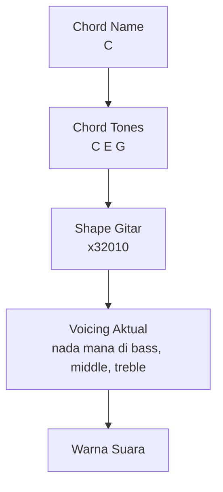
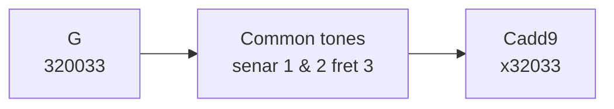
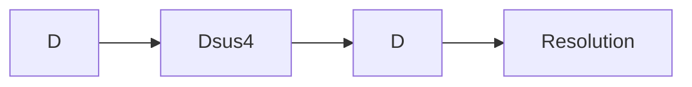
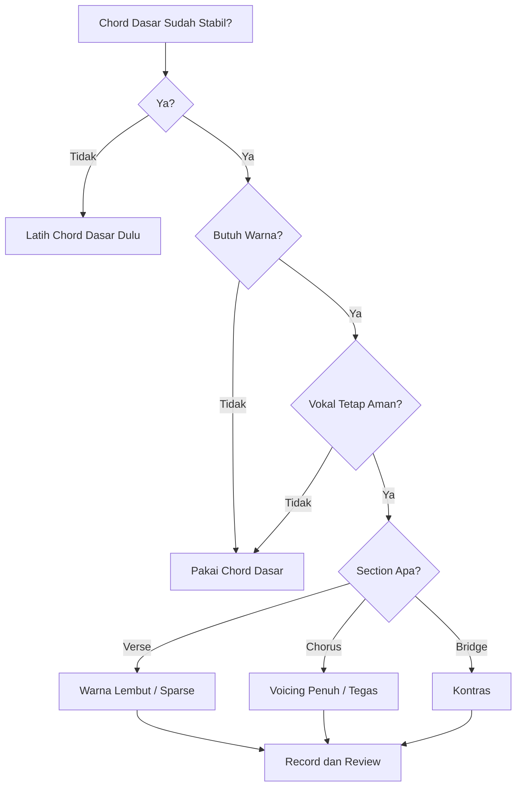
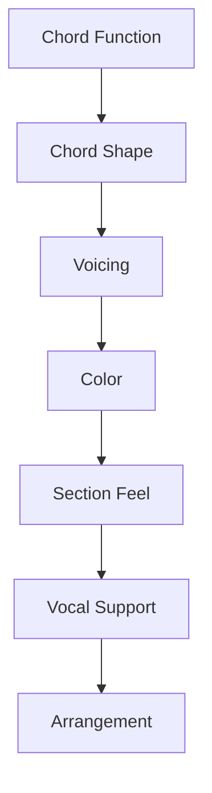

# learn-guitar-accompaniment-part-021.md

# Part 021 — Voicing dan Warna Chord: Membuat Iringan Tidak Monoton

## Status Seri

Seri: **Belajar Guitar Accompaniment Berdasarkan The First 20 Hours**  
Bagian: **021 dari 035**  
Fokus: memahami voicing dan warna chord secara praktis agar iringan gitar tidak terdengar datar, tetapi tetap aman untuk mengiringi penyanyi.

Bagian ini adalah jembatan dari “bisa memainkan chord dasar” menuju “bisa membuat chord dasar terdengar lebih musikal”. Namun kita tetap menjaga prinsip 20 jam: warna chord digunakan jika mendukung lagu, bukan untuk pamer kompleksitas.

---

## Tujuan Pembelajaran Part Ini

Setelah menyelesaikan part ini, Anda harus bisa:

1. memahami apa itu voicing secara praktis;
2. membedakan chord name, chord shape, dan chord voicing;
3. memahami kenapa chord yang sama bisa punya rasa berbeda;
4. memakai variasi chord aman seperti G, Gsus, Cadd9, Dsus4, Asus4, Em7, Am7, Fmaj7;
5. memahami kapan warna chord membantu dan kapan mengganggu;
6. menggunakan common tone untuk transisi yang halus;
7. membuat verse lebih lembut dan chorus lebih terbuka dengan voicing;
8. menghindari over-coloring;
9. memilih voicing yang mendukung vokal;
10. membuat voicing map sederhana untuk lagu target.

---

## Prinsip Kaufman yang Dipakai di Part Ini

Dalam kerangka *The First 20 Hours*, setelah fondasi terbentuk, kita menambahkan variasi yang paling berdampak dengan biaya belajar rendah.

Voicing dan warna chord bisa sangat luas. Ada inversion, drop voicing, close/open voicing, jazz extensions, altered chord, dan lain-lain. Itu bukan target part ini.

Target kita:

> Menggunakan sedikit warna chord yang mudah dimainkan untuk membuat iringan lebih hidup, tanpa mengorbankan rhythm, vokal, dan stabilitas.

Prinsip:

```text
Chord dasar dulu.
Warna chord kemudian.
Vokal selalu prioritas.
```

---

# 1. Apa Itu Voicing?

Chord adalah kumpulan nada. Voicing adalah cara nada-nada itu disusun dan dimainkan.

Contoh sederhana:

```text
C major = C E G
```

Pada gitar, C major bisa dimainkan sebagai:

```text
x32010
```

Tetapi C major juga bisa dimainkan di posisi lain, dengan urutan nada yang berbeda, atau dengan open string yang berbeda.

Jadi:

```text
Chord name = identitas harmoni
Shape      = bentuk fisik jari
Voicing    = susunan nada aktual yang terdengar
```



---

# 2. Kenapa Voicing Penting untuk Pengiring?

Voicing memengaruhi:

- seberapa penuh chord terdengar;
- seberapa lembut chord terasa;
- apakah gitar menabrak vokal;
- apakah transisi chord halus;
- apakah verse dan chorus berbeda;
- apakah lagu terdengar monoton;
- apakah gitar terlalu muddy;
- apakah chord terasa modern, folk, ballad, worship, atau pop.

Chord sama bisa terasa berbeda hanya karena voicing.

Contoh:

```text
G = 320003
G = 320033
```

Keduanya sering dianggap G, tetapi rasa dan transisinya berbeda.

---

# 3. Chord Dasar vs Chord Warna

## 3.1 Chord Dasar

Chord dasar memberi fungsi utama.

Contoh:

```text
G
C
D
Em
Am
```

## 3.2 Chord Warna

Chord warna menambahkan rasa tanpa selalu mengubah fungsi utama.

Contoh:

```text
Cadd9
Dsus4
Em7
Am7
Fmaj7
Gsus4
Asus4
```

Chord warna bisa membuat iringan:

- lebih lembut;
- lebih modern;
- lebih terbuka;
- lebih emotional;
- lebih connected.

Namun chord warna juga bisa membuat lagu:

- terlalu manis;
- kurang tegas;
- bertabrakan dengan melodi;
- tidak sesuai genre;
- membingungkan penyanyi jika fungsi chord berubah.

---

# 4. Jangan Mengganti Semua Chord dengan Warna

Kesalahan umum pemula setelah belajar voicing:

```text
Semua C diganti Cadd9.
Semua D diganti Dsus4.
Semua Em diganti Em7.
Semua F diganti Fmaj7.
```

Hasilnya bisa terlalu “berkabut” dan tidak resolved.

Prinsip:

> Warna chord adalah bumbu. Bukan makanan utama.

Gunakan warna chord untuk:

- transisi;
- section tertentu;
- verse lembut;
- chorus modern;
- ending;
- emotional highlight.

---

# 5. Common Tone

Common tone adalah nada yang tetap sama antar-chord.

Dalam gitar acoustic modern, common tone sering membuat transisi terasa halus.

Contoh:

```text
G     = 320033
Cadd9 = x32033
```

Pada dua chord ini, senar 1 dan 2 di fret 3 tetap berbunyi.

Hasil:

- transisi lebih halus;
- jari lebih stabil;
- suara lebih connected;
- cocok untuk pop acoustic.



---

# 6. Chord Warna Prioritas untuk 20 Jam Pertama

Kita fokus pada chord warna yang:

- mudah dimainkan;
- sering dipakai;
- kompatibel dengan chord dasar;
- berguna untuk accompaniment;
- tidak terlalu membebani transisi.

Daftar prioritas:

```text
G       = 320003 / 320033
Cadd9   = x32033
Dsus4   = xx0233
D/F#    = 2x0232 atau simplified nanti
Em7     = 022033 atau 020000 tergantung konteks
Am7     = x02010
Fmaj7   = x33210
Asus4   = x02230
A7      = x02020
E7      = 020100
```

Tidak semua harus dikuasai sekaligus. Gunakan bertahap.

---

# 7. G Variations

## 7.1 G Dasar

```text
G = 320003
```

Rasa:

- jelas;
- tradisional;
- stabil;
- cocok untuk banyak konteks.

## 7.2 G Acoustic / Modern

```text
G = 320033
```

Rasa:

- lebih penuh di atas;
- modern acoustic;
- cocok untuk transisi ke Cadd9;
- sering dipakai di pop/worship.

## 7.3 Kapan Memakai G 320003?

- lagu folk/traditional;
- jika butuh suara G lebih bersih;
- jika melodi vokal bertabrakan dengan nada D tinggi;
- jika transisi lebih nyaman.

## 7.4 Kapan Memakai G 320033?

- pop acoustic;
- worship;
- ballad modern;
- progression G-D-Em-C dengan common tones;
- saat ingin suara lebih besar.

---

# 8. C vs Cadd9

## 8.1 C Major

```text
C = x32010
```

Rasa:

- jelas;
- klasik;
- stabil;
- chord C murni.

## 8.2 Cadd9

```text
Cadd9 = x32033
```

Rasa:

- terbuka;
- modern;
- shimmering;
- halus dari G 320033.

## 8.3 Perbandingan

Progression dengan C:

```text
G - D - Em - C
```

Progression dengan Cadd9:

```text
G - D - Em7 - Cadd9
```

Versi Cadd9 sering terasa lebih modern dan smooth, tetapi kadang kurang tegas.

## 8.4 Kapan Memakai Cadd9?

- verse/chorus pop acoustic;
- transisi dari G modern;
- saat ingin suara terbuka;
- saat C major terasa terlalu kaku.

## 8.5 Kapan Tetap Memakai C?

- jika lagu butuh C yang jelas;
- jika melodi vokal membutuhkan E tinggi/open string;
- jika Cadd9 terasa terlalu manis;
- jika chord chart/genre lebih tradisional.

---

# 9. D, Dsus2, dan Dsus4

## 9.1 D Major

```text
D = xx0232
```

## 9.2 Dsus4

```text
Dsus4 = xx0233
```

Hanya senar 1 berubah dari fret 2 ke fret 3.

Rasa:

- tension ringan;
- ingin resolve ke D;
- sangat umum di acoustic.

Contoh:

```text
D - Dsus4 - D
```

## 9.3 Dsus2

```text
Dsus2 = xx0230
```

Rasa:

- terbuka;
- lembut;
- sedikit unresolved.

## 9.4 Penggunaan Aman

```text
D → Dsus4 → D
D → Dsus2 → D
```

Gunakan sebagai ornament, bukan mengganti semua D.

## 9.5 Risiko

Jika melodi vokal sedang pada nada tertentu, Dsus4 bisa bertabrakan. Dengarkan vokal.

---

# 10. Em vs Em7

## 10.1 Em Dasar

```text
Em = 022000
```

Rasa:

- minor jelas;
- sederhana;
- gelap;
- stabil.

## 10.2 Em7 Acoustic

```text
Em7 = 022033
```

Rasa:

- lebih terbuka;
- cocok dengan G 320033 dan Cadd9;
- modern acoustic.

## 10.3 Em7 Simple

```text
Em7 = 020000
```

Ini warna lain yang lebih ringan.

## 10.4 Kapan Memakai Em7?

- progression G-D-Em-C versi acoustic modern;
- verse lembut;
- worship/pop;
- jika ingin minor tidak terlalu gelap.

## 10.5 Kapan Tetap Em?

- jika lagu butuh minor yang jelas;
- jika Em7 terasa terlalu ringan;
- jika melodi bertabrakan;
- jika transisi Em dasar lebih stabil.

---

# 11. Am vs Am7

## 11.1 Am Dasar

```text
Am = x02210
```

Rasa:

- minor jelas;
- emosional;
- stabil.

## 11.2 Am7

```text
Am7 = x02010
```

Rasa:

- lebih lembut;
- jazzy ringan;
- folk/pop ballad;
- kurang tegang dari Am.

## 11.3 Kapan Memakai Am7?

- verse lembut;
- progression C-G-Am-F;
- bridge intimate;
- jika Am terasa terlalu berat.

## 11.4 Risiko

Am7 bisa terlalu soft jika lagu butuh minor kuat. Jangan selalu mengganti Am.

---

# 12. F vs Fmaj7

## 12.1 F Full

```text
F = 133211
```

Sulit untuk pemula.

## 12.2 Fmaj7

```text
Fmaj7 = x33210
```

Rasa:

- lembut;
- dreamy;
- ballad;
- pop acoustic;
- sangat berguna sebagai simplified F.

## 12.3 Kapan Fmaj7 Aman?

- banyak lagu pop/ballad;
- progression C-G-Am-F;
- verse/chorus lembut;
- jika penyanyi cocok dengan warna maj7.

## 12.4 Kapan Fmaj7 Kurang Cocok?

- lagu yang butuh F tegas;
- genre rock/folk tegas;
- melodi vokal bertabrakan dengan E open;
- ending yang butuh resolusi kuat.

## 12.5 Alternatif F Small Shape

```text
F = xx3211
```

Lebih dekat ke F major, tetapi lebih sulit daripada Fmaj7.

---

# 13. A, Asus4, A7

## 13.1 A Major

```text
A = x02220
```

## 13.2 Asus4

```text
Asus4 = x02230
```

Rasa:

- tension ringan;
- ingin kembali ke A;
- umum di acoustic.

Contoh:

```text
A - Asus4 - A
```

## 13.3 A7

```text
A7 = x02020
```

Rasa:

- dominant;
- ingin resolve ke D;
- blues/folk/classic.

Contoh:

```text
A7 → D
```

Gunakan A7 jika progression menuju D dan genre cocok.

---

# 14. E dan E7

## 14.1 E Major

```text
E = 022100
```

## 14.2 E7

```text
E7 = 020100
```

Rasa:

- dominant;
- ingin resolve ke A atau Am;
- sering muncul dalam lagu minor/folk/blues.

Contoh:

```text
Am - G - F - E7
```

E7 memberi tension yang kuat menuju Am.

---

# 15. Sus Chord sebagai Gerakan, Bukan Tujuan

Sus chord sering paling efektif sebagai gerakan sementara.

Contoh:

```text
D → Dsus4 → D
A → Asus4 → A
```

Jangan terlalu lama berhenti di sus chord kecuali memang cocok.

Mental model:

```text
sus = tension kecil
resolve = kembali ke chord utama
```



---

# 16. Add9 sebagai Warna Terbuka

Add9 menambahkan nada ke-9 tanpa menghilangkan third.

Contoh praktis:

```text
Cadd9 = x32033
```

Rasa:

- modern;
- terbuka;
- sweet;
- acoustic.

Cadd9 sangat cocok dengan G 320033 karena common tones.

Namun, jika semua C menjadi Cadd9, lagu bisa kehilangan ketegasan.

---

# 17. Maj7 sebagai Warna Lembut

Maj7 memberi rasa:

- dreamy;
- lembut;
- sedikit wistful;
- sophisticated;
- ballad.

Contoh:

```text
Fmaj7 = x33210
```

Maj7 sangat indah, tetapi tidak selalu cocok untuk lagu yang butuh chord tegas.

---

# 18. Dominant 7 sebagai Tension

Chord dominant 7 seperti:

```text
A7
E7
D7
G7
```

sering ingin resolve ke chord tertentu.

Contoh:

```text
A7 → D
E7 → Am atau A
D7 → G
G7 → C
```

Untuk 20 jam pertama, cukup tahu bahwa dominant 7 memberi rasa “ingin pulang”.

---

# 19. Voicing untuk Verse dan Chorus

## 19.1 Verse

Gunakan warna yang lebih lembut:

```text
Cadd9
Em7
Am7
Fmaj7
Dsus2
```

Dengan density rendah.

## 19.2 Chorus

Gunakan chord lebih tegas atau lebih penuh:

```text
G 320033
D
Em7/Em
Cadd9/C
```

Dengan strumming lebih terbuka.

Namun tergantung lagu, chorus kadang butuh chord dasar yang lebih direct.

---

# 20. Voicing untuk Bridge

Bridge bisa memakai voicing berbeda untuk kontras.

Contoh:

Jika verse/chorus memakai strumming chord dasar, bridge bisa:

- fingerpicking;
- Am7;
- Fmaj7;
- Dsus2;
- partial voicing;
- palm mute.

Tujuan:

> Bridge terasa seperti ruang baru.

---

# 21. Voicing dan Vokal

Chord warna harus mendukung melodi vokal.

Kadang chord warna yang indah sendirian justru bertabrakan dengan vokal.

Checklist:

```text
[ ] Apakah vokal tetap jelas?
[ ] Apakah warna chord membuat lirik lebih kuat?
[ ] Apakah chord terasa terlalu manis?
[ ] Apakah sus chord resolve di waktu yang tepat?
[ ] Apakah add9/maj7 bertabrakan dengan melodi?
```

Gunakan telinga, bukan hanya chord shape.

---

# 22. Voicing dan Capo

Capo mengubah brightness voicing.

Contoh:

```text
Cadd9 capo 5
```

bisa terdengar sangat bright.

Fmaj7 dengan capo tinggi juga bisa terdengar sangat shimmering.

Aturan praktis:

- capo rendah: voicing lebih warm/full;
- capo tinggi: voicing lebih bright/thin;
- jika terlalu tipis, coba shape lain atau strum lebih banyak bass.

---

# 23. Voicing dan Register

Voicing tinggi bisa memberi shimmer tetapi bisa menabrak vokal tinggi.

Voicing rendah bisa memberi body tetapi bisa muddy.

Sebagai pengiring:

- verse vokal rendah: hati-hati bass muddy;
- vokal tinggi: hati-hati treble tajam;
- chorus full: balanced strum;
- bridge intimate: partial voicing.

---

# 24. Smooth Acoustic Progression

Progression populer:

```text
G - D - Em - C
```

Versi basic:

```text
G     = 320003
D     = xx0232
Em    = 022000
C     = x32010
```

Versi modern acoustic:

```text
G     = 320033
D     = xx0232 atau Dsus4 ornament
Em7   = 022033
Cadd9 = x32033
```

Rasa:

- lebih connected;
- lebih open;
- cocok untuk pop/worship;
- transisi lebih halus.

Latihan:

```text
G - D - Em7 - Cadd9
```

Jangan gunakan jika lagu butuh chord lebih tegas.

---

# 25. Soft Ballad Progression

Progression:

```text
C - G - Am - F
```

Versi lembut:

```text
C     = x32010
G     = 320003
Am7   = x02010
Fmaj7 = x33210
```

Atau:

```text
Cadd9 - G - Am7 - Fmaj7
```

Hati-hati Cadd9 tergantung melodi.

---

# 26. Sus Ornament Drill

Gunakan D:

```text
D - Dsus4 - D - Dsus2 - D
```

Hitungan:

```text
1 & 2 & 3 & 4 &
D   Dsus4 D   Dsus2 D
```

Jangan terlalu cepat. Dengarkan tension dan release.

Gunakan A:

```text
A - Asus4 - A
```

Tujuan:

> Memahami sus chord sebagai movement.

---

# 27. Color Swap Drill

Ambil progression:

```text
G - D - Em - C
```

Mainkan 3 versi:

## Versi 1 — Basic

```text
G - D - Em - C
```

## Versi 2 — Modern

```text
G(320033) - D - Em7 - Cadd9
```

## Versi 3 — Mixed

```text
G - Dsus4-D - Em - Cadd9-C
```

Rekam dan bandingkan.

Pertanyaan:

```text
Versi mana paling jelas?
Versi mana paling lembut?
Versi mana paling cocok untuk vokal?
Versi mana terlalu manis?
```

---

# 28. Voicing Map

Untuk lagu target, buat voicing map.

Template:

```text
Title:
Key/Capo:
Base chords:
Voicing options:
Verse voicing:
Chorus voicing:
Bridge voicing:
Ornaments:
Do-not-use:
Reason:
```

Contoh:

```text
Title: Song A
Key/Capo: G capo 2
Base chords: G D Em C
Verse voicing: G 320033, D, Em7, Cadd9 with sparse strum
Chorus voicing: G 320033, D, Em, Cadd9 full strum
Bridge voicing: Em7, Cadd9 fingerpicking
Ornaments: Dsus4 before chorus
Do-not-use: too much Dsus4 in verse
Reason: vocal melody needs clarity
```

---

# 29. Over-Coloring

Over-coloring terjadi saat terlalu banyak warna chord.

Gejala:

- lagu kehilangan arah;
- chord terasa selalu menggantung;
- vokal bingung;
- resolution tidak jelas;
- semua bagian terdengar “sweet” tapi tidak kuat;
- sus chord tidak resolve;
- maj7/add9 muncul berlebihan.

Fix:

```text
[ ] kembali ke chord dasar
[ ] gunakan warna hanya di section tertentu
[ ] resolve sus chord
[ ] dengarkan vokal
[ ] pakai warna untuk tujuan spesifik
```

---

# 30. Under-Coloring

Under-coloring terjadi saat semua chord sangat basic dan datar padahal lagu butuh texture.

Gejala:

- verse dan chorus terlalu mirip;
- ballad terasa kaku;
- bridge tidak kontras;
- acoustic version terdengar kosong;
- transisi chord terlalu kasar.

Fix:

```text
[ ] tambahkan Cadd9/Em7 di acoustic progression
[ ] gunakan Dsus4 ornament
[ ] gunakan Am7/Fmaj7 untuk verse lembut
[ ] variasikan register/dynamics
```

---

# 31. Voicing Decision Tree



---

# 32. Latihan 45 Menit untuk Part Ini

## Block 1 — Basic vs Color, 10 Menit

Mainkan:

```text
G - D - Em - C
```

Basic dan modern acoustic.

## Block 2 — Sus Movement, 8 Menit

Latih:

```text
D - Dsus4 - D
A - Asus4 - A
```

## Block 3 — Soft Voicing, 8 Menit

Mainkan:

```text
C - G - Am7 - Fmaj7
```

Dengan strumming lembut.

## Block 4 — Voicing with Vocal, 10 Menit

Gunakan lagu target atau hum melodi.

Coba basic vs colored. Dengarkan vokal.

## Block 5 — Voicing Map, 5 Menit

Tulis map untuk satu lagu.

## Block 6 — Recording Review, 4 Menit

Catat:

```text
Warna membantu atau mengganggu?
Chord mana terlalu manis?
Chord mana lebih baik basic?
```

---

# 33. Latihan 15 Menit

```text
3 menit  G basic vs G 320033
3 menit  C vs Cadd9
3 menit  Em vs Em7
3 menit  D-Dsus4-D
3 menit  rekam G-D-Em-C basic vs colored
```

Jika hanya 5 menit:

```text
2 menit  C vs Cadd9
2 menit  D vs Dsus4
1 menit  catat mana cocok untuk lagu target
```

---

# 34. Mini Project Part Ini

Ambil satu lagu target dengan progression:

```text
G - D - Em - C
```

Buat dua arrangement:

## Arrangement A — Basic

```text
G - D - Em - C
```

## Arrangement B — Colored

```text
G(320033) - Dsus4/D - Em7 - Cadd9
```

Rekam keduanya.

Evaluasi:

```text
Mana lebih cocok untuk verse?
Mana lebih cocok untuk chorus?
Mana lebih jelas untuk vokal?
Mana terlalu ramai?
Mana lebih mudah dimainkan stabil?
```

Target:

> Anda bisa memilih voicing berdasarkan fungsi, bukan hanya karena terdengar keren sendirian.

---

# 35. Kesalahan Engineer-Minded dalam Voicing

## 35.1 Menganggap Chord Name Sama Berarti Suara Sama

Shape dan voicing mengubah warna.

## 35.2 Menggunakan Semua Opsi Sekaligus

Jangan jadikan setiap chord “fancy”. Pilih tujuan.

## 35.3 Tidak Mendengar Vokal

Voicing indah sendirian bisa buruk bersama vokal.

## 35.4 Terlalu Cepat Masuk Chord Kompleks

Add9, sus, maj7 cukup dulu. Jangan buru-buru ke extended jazz harmony.

## 35.5 Mengabaikan Rhythm

Voicing bagus dengan rhythm buruk tetap tidak mendukung penyanyi.

---

# 36. Debugging Matrix Voicing

| Symptom | Kemungkinan Penyebab | Fix |
|---|---|---|
| Lagu terlalu datar | semua chord basic dan dynamics sama | tambah voicing/dynamics |
| Lagu terlalu manis | terlalu banyak add9/maj7 | kembali ke chord dasar |
| Vokal terasa bertabrakan | voicing tidak cocok melodi | pakai chord dasar |
| Sus chord menggantung | tidak resolve | Dsus4 → D |
| Chorus kurang tegas | voicing terlalu lembut | gunakan chord dasar/penuh |
| Verse terlalu ramai | voicing + strumming terlalu penuh | sparse, soft voicing |
| Capo tinggi terlalu tipis | voicing high register | coba shape lain |
| Transisi kasar | tidak ada common tone | coba G 320033/Cadd9 |

---

# 37. Acceptance Criteria Part 021

Anda boleh lanjut ke part 022 jika:

```text
[ ] Bisa menjelaskan chord name, shape, dan voicing
[ ] Bisa memainkan G 320003 dan G 320033
[ ] Bisa memainkan C dan Cadd9
[ ] Bisa memainkan D dan Dsus4
[ ] Bisa memainkan Em dan Em7
[ ] Bisa memainkan Am dan Am7
[ ] Bisa memainkan Fmaj7
[ ] Bisa menjelaskan common tone
[ ] Bisa membuat voicing map sederhana
[ ] Bisa menjelaskan kapan chord warna membantu dan kapan mengganggu
```

---

# 38. Ringkasan Mental Model

Voicing adalah cara chord “berbicara”.



Chord warna bukan pengganti fondasi. Ia adalah alat untuk membuat fondasi terdengar lebih hidup.

---

# 39. Output Part Ini

Output konkret:

1. Anda memahami voicing.
2. Anda punya beberapa chord warna aman.
3. Anda bisa memakai common tone.
4. Anda bisa membedakan basic dan colored arrangement.
5. Anda bisa memilih voicing berdasarkan vokal dan section.
6. Anda siap memahami bass note dan slash chord.

Part berikutnya:

> **Bass Note dan Slash Chord untuk Iringan Lebih Stabil.**

