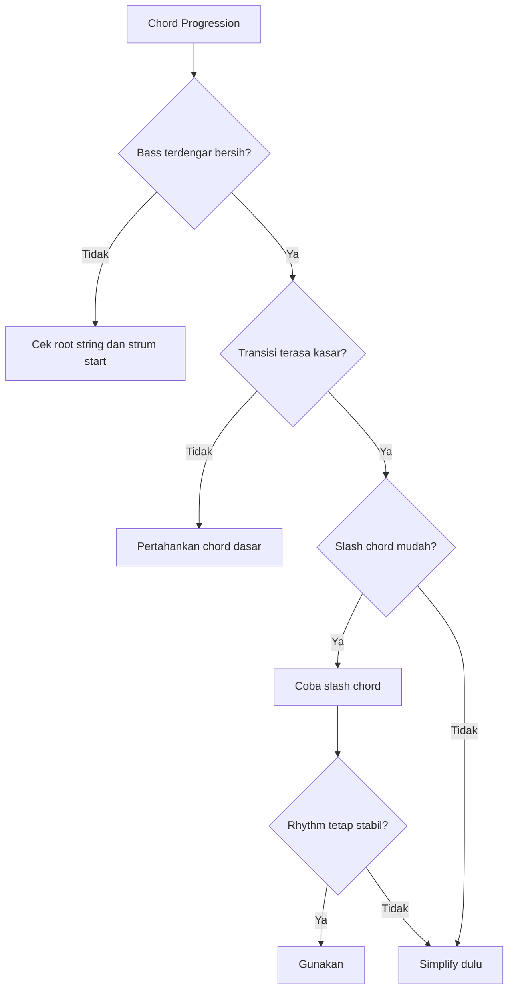
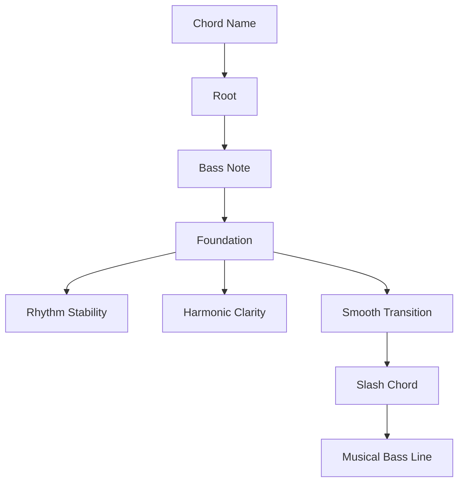

# learn-guitar-accompaniment-part-022.md

# Part 022 — Bass Note dan Slash Chord untuk Iringan Lebih Stabil

## Status Seri

Seri: **Belajar Guitar Accompaniment Berdasarkan The First 20 Hours**  
Bagian: **022 dari 035**  
Fokus: memahami peran bass note dan slash chord dalam iringan gitar agar chord terdengar lebih stabil, transisi lebih halus, dan progression lebih musikal tanpa harus menjadi rumit.

Bagian ini sangat praktis. Banyak pemula fokus pada bentuk chord di senar atas, tetapi mengabaikan bass. Padahal dalam iringan, bass note sering menentukan apakah chord terdengar bersih, kuat, atau muddy.

---

## Tujuan Pembelajaran Part Ini

Setelah menyelesaikan part ini, Anda harus bisa:

1. memahami bass note sebagai fondasi chord;
2. tahu root/bass string untuk chord dasar;
3. memahami slash chord seperti G/B, D/F#, C/E;
4. memahami kapan slash chord penting dan kapan bisa disederhanakan;
5. memainkan beberapa slash chord mudah/simplified;
6. membuat bass line sederhana antar-chord;
7. menghindari bass note yang salah;
8. memakai bass note untuk fingerpicking dan strumming;
9. membuat progression lebih smooth;
10. melakukan recovery dengan root/bass note saat chord penuh terlambat.

---

## Prinsip Kaufman yang Dipakai di Part Ini

Dalam pendekatan *The First 20 Hours*, kita belajar elemen yang paling meningkatkan performa dengan biaya relatif rendah.

Bass note adalah elemen bernilai tinggi karena:

- membantu chord terdengar jelas;
- membantu penyanyi merasakan harmoni;
- membantu rhythm terasa punya lantai;
- membantu recovery saat chord telat;
- membantu fingerpicking;
- membantu transisi antar-chord;
- membuat arrangement sederhana terasa lebih matang.

Targetnya bukan menjadi bassist. Targetnya:

> Tahu bass note yang benar dan memakai beberapa bass movement sederhana untuk mendukung lagu.

---

# 1. Apa Itu Bass Note?

Bass note adalah nada terendah yang terdengar pada suatu chord/voicing.

Dalam gitar, bass note biasanya berasal dari senar 6, 5, atau 4.

Contoh:

```text
G = 320003
```

Bass note-nya biasanya G di senar 6 fret 3.

```text
C = x32010
```

Bass note-nya C di senar 5 fret 3.

```text
D = xx0232
```

Bass note-nya D di senar 4 open.

Bass note memberi fondasi harmoni.

---

# 2. Root vs Bass Note

Root adalah nama dasar chord.

Bass note adalah nada terendah yang dibunyikan.

Dalam chord biasa, root dan bass note sering sama.

Contoh:

```text
C chord, bass C
G chord, bass G
D chord, bass D
```

Tetapi dalam slash chord, bass note berbeda dari root.

Contoh:

```text
G/B
```

Artinya:

```text
Chord = G
Bass note = B
```

Root chord tetap G, tetapi bass yang terdengar paling bawah adalah B.

---

# 3. Kenapa Bass Note Penting?

Bass note memengaruhi:

- kejernihan chord;
- rasa gerak;
- stabilitas rhythm;
- arah progression;
- hubungan dengan vokal;
- kualitas recording/performance;
- apakah chord terdengar muddy atau bersih.

Jika bass salah, chord atas benar pun bisa terasa salah.

Contoh:

```text
D = xx0232
```

Jika Anda strum dari senar 6, nada E rendah ikut berbunyi. Chord D jadi kotor.

---

# 4. Root/Bass String Chord Dasar

Hafalkan tabel ini.

| Chord | Shape | Bass utama | Mulai strum dari |
|---|---|---|---|
| G | 320003 / 320033 | senar 6 fret 3 | senar 6 |
| C | x32010 | senar 5 fret 3 | senar 5 |
| D | xx0232 | senar 4 open | senar 4 |
| Em | 022000 | senar 6 open | senar 6 |
| Am | x02210 | senar 5 open | senar 5 |
| A | x02220 | senar 5 open | senar 5 |
| E | 022100 | senar 6 open | senar 6 |
| Dm | xx0231 | senar 4 open | senar 4 |
| Fmaj7 | x33210 | senar 5 fret 3 atau senar 4 fret 3 | senar 5/4 |

Ini wajib untuk strumming dan fingerpicking.

---

# 5. Bass Note dan Strumming

Saat strumming, Anda tidak harus selalu mengenai semua senar.

Contoh:

## G

```text
G = 320003
```

Semua senar boleh dimainkan.

## C

```text
C = x32010
```

Mulai dari senar 5. Senar 6 sebaiknya tidak dominan.

## D

```text
D = xx0232
```

Mulai dari senar 4. Jangan strum semua senar keras.

Kesalahan umum:

```text
Semua chord distrum dari senar 6.
```

Ini membuat C dan D terdengar muddy.

---

# 6. Bass Note dan Fingerpicking

Dalam fingerpicking, thumb biasanya memainkan bass note.

Pattern:

```text
P i m i
```

P harus memilih bass sesuai chord.

Contoh:

```text
G  : P di senar 6
C  : P di senar 5
D  : P di senar 4
Em : P di senar 6
Am : P di senar 5
```

Jika thumb salah string, picking terdengar salah walau jari i/m benar.

---

# 7. Bass Note sebagai Recovery

Jika chord penuh terlambat, bass note bisa menjadi fallback.

Contoh:

Anda harus pindah ke C, tetapi jari belum siap.

Recovery:

```text
mainkan bass C dulu: senar 5 fret 3
lalu bentuk chord C penuh
```

Ini lebih baik daripada berhenti total.

Root/bass note adalah “minimal viable chord”.

---

# 8. Slash Chord

Slash chord ditulis:

```text
Chord/Bass
```

Contoh:

```text
G/B
D/F#
C/E
Am/G
F/A
```

Makna:

```text
Chord utama berada sebelum slash.
Bass note berada setelah slash.
```

Contoh:

```text
G/B = G chord dengan bass B
D/F# = D chord dengan bass F#
C/E = C chord dengan bass E
```

Slash chord sering dipakai untuk membuat bass line halus.

---

# 9. Kenapa Slash Chord Dipakai?

Fungsi utama:

1. membuat bass bergerak stepwise;
2. menghubungkan chord;
3. memberi warna inversion;
4. membuat progression lebih smooth;
5. mendukung melodi;
6. menciptakan tension/arah.

Contoh:

```text
G - D/F# - Em
```

Bass bergerak:

```text
G → F# → E
```

Turun halus.

Tanpa D/F#:

```text
G - D - Em
```

Masih bisa, tetapi bass lompat lebih besar.

---

# 10. Inversion Secara Minimum

Slash chord sering merupakan inversion.

Contoh G major berisi nada:

```text
G B D
```

Jika bass-nya G:

```text
G
```

Jika bass-nya B:

```text
G/B
```

Jika bass-nya D:

```text
G/D
```

Anda tidak perlu teori inversion lengkap dulu. Cukup tahu:

> Slash chord = chord biasa dengan bass note tertentu.

---

# 11. Slash Chord yang Paling Berguna

Untuk 20 jam pertama, fokus pada:

```text
G/B
D/F#
C/E
Am/G
F/A
```

Namun tidak semua harus dikuasai segera.

Prioritas praktis:

```text
G/B
D/F#
C/E
```

Karena sering muncul dalam acoustic progression.

---

# 12. G/B

## 12.1 Makna

```text
G/B = chord G dengan bass B
```

## 12.2 Shape Sederhana

Salah satu bentuk:

```text
x20033
```

Artinya:

```text
senar 6: mute
senar 5: fret 2 = B
senar 4: open = D
senar 3: open = G
senar 2: fret 3 = D
senar 1: fret 3 = G
```

## 12.3 Fungsi

Menghubungkan:

```text
C - G/B - Am
```

Bass:

```text
C → B → A
```

Atau:

```text
G - G/B - C
```

Bass:

```text
G → B → C
```

## 12.4 Kapan Disederhanakan?

Jika G/B sulit, mainkan G biasa dulu.

Namun jika progression butuh bass turun/naik halus, G/B memberi rasa lebih matang.

---

# 13. D/F#

## 13.1 Makna

```text
D/F# = chord D dengan bass F#
```

## 13.2 Shape Umum

```text
2x0232
```

Artinya:

```text
senar 6 fret 2 = F#
senar 5 mute
senar 4 open
senar 3 fret 2
senar 2 fret 3
senar 1 fret 2
```

Ini bisa sulit karena thumb atau jari harus menjangkau senar 6 fret 2.

## 13.3 Shape Simplified

Jika sulit:

```text
xx0232
```

Artinya mainkan D biasa.

Atau jika bisa pakai thumb ringan:

```text
2x0232
```

## 13.4 Fungsi

Sangat umum:

```text
G - D/F# - Em
```

Bass:

```text
G → F# → E
```

Ini membuat progression turun halus.

---

# 14. C/E

## 14.1 Makna

```text
C/E = chord C dengan bass E
```

## 14.2 Shape

Salah satu bentuk:

```text
032010
```

Artinya:

```text
senar 6 open = E
senar 5 fret 3 = C
senar 4 fret 2 = E
senar 3 open = G
senar 2 fret 1 = C
senar 1 open = E
```

Namun hati-hati: senar 6 E bisa membuat suara lebih tebal/muddy jika terlalu keras.

## 14.3 Fungsi

Menghubungkan:

```text
F - C/E - Dm
```

Bass:

```text
F → E → D
```

Atau:

```text
C - C/E - F
```

Bass:

```text
C → E → F
```

## 14.4 Untuk Pemula

C/E bisa dimainkan jika Anda sadar bass E. Jangan strum terlalu keras di senar 6 jika vokal butuh clarity.

---

# 15. Am/G

## 15.1 Makna

```text
Am/G = chord Am dengan bass G
```

## 15.2 Shape

Salah satu bentuk:

```text
302210
```

atau variasi lain tergantung voicing.

Namun ini bisa agak sulit dan tidak prioritas 20 jam pertama.

## 15.3 Fungsi

Membuat bass turun:

```text
Am - Am/G - F
```

Bass:

```text
A → G → F
```

Sangat umum dalam ballad.

## 15.4 Simplification

Jika sulit:

```text
Am - Fmaj7
```

atau tahan Am lalu pindah ke F.

---

# 16. F/A

## 16.1 Makna

```text
F/A = chord F dengan bass A
```

## 16.2 Fungsi

Menghubungkan bass:

```text
G - F/A - C
```

atau dalam konteks tertentu memberi F tanpa bass F rendah.

Untuk pemula, F/A bukan prioritas kecuali muncul di lagu target.

---

# 17. Bass Line Halus

Slash chord sering membuat bass line halus.

Contoh turun:

```text
G - D/F# - Em
```

Bass:

```text
G - F# - E
```

Contoh turun lain:

```text
C - G/B - Am
```

Bass:

```text
C - B - A
```

Contoh naik:

```text
C - C/E - F
```

Bass:

```text
C - E - F
```

Ini membuat chord progression terasa lebih connected.

---

# 18. Bass Movement sebagai Melodi Bawah

Melodi tidak hanya di vokal. Bass juga bisa bergerak seperti garis.

Dalam acoustic solo accompaniment, bass movement membantu mengisi ruang tanpa terlalu ramai.

Namun hati-hati:

- jangan membuat bass terlalu aktif saat vokal padat;
- jangan mengorbankan tempo;
- jangan memakai slash chord jika membuat chord transition kacau;
- jangan membuat arrangement lebih sulit dari kemampuan saat ini.

---

# 19. Kapan Slash Chord Wajib?

Slash chord relatif penting jika:

```text
[ ] bass movement sangat terdengar dalam lagu asli
[ ] melodi vokal bergantung pada harmoni itu
[ ] chord chart menunjukkan slash chord di momen kuat
[ ] tanpa slash chord progression terasa loncat/kasar
[ ] arrangement acoustic butuh bass line
```

Slash chord bisa disederhanakan jika:

```text
[ ] terlalu sulit untuk tempo lagu
[ ] tidak terlalu terdengar dalam versi gitar-vokal
[ ] mengganggu rhythm
[ ] penyanyi lebih butuh stabilitas
[ ] lagu masih terdengar baik tanpa itu
```

---

# 20. Simplification Rules untuk Slash Chord

Aturan praktis:

```text
G/B  → G
D/F# → D
C/E  → C
Am/G → Am
F/A  → F atau Fmaj7
```

Tetapi cek dengan telinga.

Jika simplification membuat bass line hilang tetapi lagu tetap baik, aman.

Jika simplification membuat melodi terasa aneh, slash chord mungkin perlu dipertahankan.

---

# 21. Bass Note dan Dynamics

Bass bisa mengatur energy.

## 21.1 Bass Kuat

Cocok untuk:

- downbeat;
- chorus;
- intro tegas;
- folk pattern;
- memberi foundation.

## 21.2 Bass Ringan

Cocok untuk:

- verse;
- vokal rendah;
- intimate section;
- bridge lembut.

## 21.3 Bass Terlalu Kuat

Masalah:

- muddy;
- vokal tertutup;
- chord terasa berat;
- tempo terasa dragging.

Kontrol thumb/strum.

---

# 22. Bass Note dan Meter

Dalam 4/4:

```text
Bass sering di beat 1 dan 3
```

Dalam 3/4:

```text
Bass sering di beat 1
```

Dalam 6/8:

```text
Bass sering di hitungan 1 dan 4
```

Contoh 6/8:

```text
1 2 3 4 5 6
P i m P i m
```

Bass di 1 dan 4 memberi dua gelombang besar.

---

# 23. Bass-Strum Pattern

Pattern sederhana 4/4:

```text
1 2 3 4
B D B D
```

B = bass  
D = strum ringan

Contoh G:

```text
1: senar 6
2: strum treble
3: senar 4 atau 6
4: strum treble
```

Untuk C:

```text
1: senar 5
2: strum
3: senar 4
4: strum
```

Ini membuat iringan lebih seperti gitar folk/acoustic.

---

# 24. Alternating Bass

Alternating bass berarti bass berganti antar-string dalam chord.

Contoh G:

```text
Beat 1: senar 6
Beat 3: senar 4
```

C:

```text
Beat 1: senar 5
Beat 3: senar 4
```

D:

```text
Beat 1: senar 4
Beat 3: senar 3 atau 4, tergantung pattern
```

Untuk 20 jam pertama, alternating bass tidak wajib. Tetapi bass-strum dasar sangat berguna.

---

# 25. Fingerpicking dengan Bass Awareness

Pattern:

```text
P i m i
```

Untuk tiap chord, P berbeda.

```text
G  : 6-3-2-3
C  : 5-3-2-3
D  : 4-3-2-3
Em : 6-3-2-3
Am : 5-3-2-3
```

Latihan:

```text
G - D - Em - C
```

Jangan biarkan thumb otomatis selalu senar 6.

---

# 26. Bass Walkdown G-D/F#-Em

Progression:

```text
G - D/F# - Em
```

Bass:

```text
G - F# - E
```

Cara latihan:

1. mainkan G;
2. mainkan bass F# di senar 6 fret 2 sambil bentuk D jika bisa;
3. mainkan Em;
4. ulang perlahan.

Simplified:

```text
G - D - Em
```

Jika D/F# membuat berhenti, gunakan D dulu.

---

# 27. Bass Walkdown C-G/B-Am

Progression:

```text
C - G/B - Am
```

Bass:

```text
C - B - A
```

Shape:

```text
C    = x32010
G/B  = x20033 atau x20003 tergantung voicing
Am   = x02210
```

Latihan:

- petik bass saja: senar 5 fret 3 → senar 5 fret 2 → senar 5 open;
- lalu tambahkan chord.

Ini sangat berguna untuk ballad.

---

# 28. Bass Walkup C-C/E-F

Progression:

```text
C - C/E - Fmaj7
```

Bass:

```text
C - E - F
```

Shape:

```text
C    = x32010
C/E  = 032010
Fmaj7= x33210
```

Latihan bass:

```text
C: senar 5 fret 3
E: senar 6 open atau senar 4 fret 2
F: senar 4 fret 3 / senar 6 fret 1 jika bisa
```

Untuk pemula, gunakan voicing yang paling bersih.

---

# 29. Slash Chord dalam Song Map

Jika lagu punya slash chord, catat:

```text
Chord:
Function:
Keep or simplify:
Reason:
```

Contoh:

```text
D/F#
Function: bass walkdown G-F#-Em
Keep or simplify: simplify to D for now
Reason: D/F# membuat rhythm berhenti
Later: learn D/F# after song stable
```

Ini menjaga keputusan sadar.

---

# 30. Jangan Mengorbankan Rhythm Demi Slash Chord

Jika slash chord membuat Anda berhenti, itu buruk untuk pengiring.

Urutan prioritas:

```text
1. rhythm stabil
2. chord function benar
3. bass note bagus
4. slash chord detail
```

Jika detail membuat foundation runtuh, sederhanakan.

---

# 31. Bass Note dan Penyanyi

Bass yang baik membantu penyanyi merasakan harmoni.

Namun bass yang terlalu kuat bisa:

- membuat vokal rendah tertutup;
- membuat lagu muddy;
- membuat verse terlalu berat;
- menarik fokus dari lirik.

Saat vokal padat:

- bass lebih ringan;
- strum lebih sedikit senar;
- fingerpicking lembut.

Saat chorus:

- bass bisa lebih kuat;
- foundation lebih jelas.

---

# 32. Latihan Bass Awareness 45 Menit

## Block 1 — Root Table, 8 Menit

Mainkan bass note tiap chord:

```text
G C D Em Am A E Dm
```

Sebut string-nya.

## Block 2 — Strum from Correct Bass, 8 Menit

Mainkan chord:

```text
G
C
D
Am
```

Mulai strum dari bass yang benar.

## Block 3 — Fingerpicking Bass, 8 Menit

Pattern:

```text
P i m i
```

Progression:

```text
G-D-Em-C
```

## Block 4 — Slash Chord Drill, 10 Menit

Latih:

```text
G-D/F#-Em
C-G/B-Am
```

Sangat perlahan.

## Block 5 — Simplify vs Keep, 6 Menit

Mainkan:

```text
G-D/F#-Em
G-D-Em
```

Bandingkan.

## Block 6 — Review, 5 Menit

Catat:

```text
Slash chord mana berguna?
Mana masih membuat rhythm rusak?
```

---

# 33. Latihan 15 Menit

```text
3 menit  bass note G/C/D/Em/Am
3 menit  strum C dan D dari string benar
4 menit  P-i-m-i G-D-Em-C
3 menit  C-G/B-Am bass only
2 menit  catat bug
```

Jika hanya 5 menit:

```text
2 menit  root bass table
3 menit  G-D-Em-C dengan thumb bass benar
```

---

# 34. Mini Project Part Ini

Pilih satu progression:

```text
C - G/B - Am - Fmaj7
```

Buat dua versi:

## Version A — Simplified

```text
C - G - Am - Fmaj7
```

## Version B — Bass Walkdown

```text
C - G/B - Am - Fmaj7
```

Rekam keduanya dengan strumming ringan atau fingerpicking.

Evaluasi:

```text
Apakah bass walkdown membuat progression lebih halus?
Apakah G/B membuat rhythm terganggu?
Apakah versi simplified lebih stabil?
Mana lebih cocok untuk penyanyi?
```

Target:

> Anda bisa memilih antara detail bass dan stabilitas performance.

---

# 35. Kesalahan Engineer-Minded dalam Bass/Slash Chord

## 35.1 Menganggap Slash Chord Wajib Selalu

Chord chart bukan hukum. Jika slash chord merusak rhythm, simplify dulu.

## 35.2 Mengabaikan Bass karena Fokus Shape Atas

Bass note salah bisa merusak chord.

## 35.3 Terlalu Cepat Membuat Bass Line Rumit

Bass line sederhana lebih baik daripada line rumit yang kacau.

## 35.4 Tidak Mendengar Muddy Low End

Gitar acoustic bisa terlalu penuh di bawah. Dengarkan rekaman.

## 35.5 Tidak Mencatat Simplification

Jika menyederhanakan, tulis. Jangan improvisasi random saat tampil.

---

# 36. Debugging Matrix Bass/Slash

| Symptom | Kemungkinan Penyebab | Fix |
|---|---|---|
| Chord D muddy | strum dari senar 6/5 | mulai dari senar 4 |
| Chord C berat | senar 6 ikut dominan | mulai dari senar 5 |
| Picking terdengar salah | thumb bass salah | latih root table |
| Progression kasar | bass lompat | coba slash chord |
| Rhythm berhenti di slash | slash terlalu sulit | simplify |
| Vokal tertutup | bass terlalu kuat | kurangi thumb/strum |
| Chorus kurang foundation | bass terlalu ringan | accent bass beat 1 |
| Capo tinggi terlalu tipis | bass kurang body | strum lower strings lebih sadar |

---

# 37. Bass Decision Tree



---

# 38. Acceptance Criteria Part 022

Anda boleh lanjut ke part 023 jika:

```text
[ ] Bisa menjelaskan root vs bass note
[ ] Bisa menjelaskan slash chord
[ ] Bisa menyebut bass utama G, C, D, Em, Am
[ ] Bisa mulai strum C dari senar 5
[ ] Bisa mulai strum D dari senar 4
[ ] Bisa memainkan P-i-m-i dengan bass benar pada G-D-Em-C
[ ] Bisa menjelaskan G/B, D/F#, C/E
[ ] Bisa memainkan atau menyederhanakan G/B
[ ] Bisa menjelaskan kapan slash chord boleh disederhanakan
[ ] Bisa memakai bass note sebagai recovery saat chord telat
```

---

# 39. Ringkasan Mental Model

Bass note adalah lantai chord.



Pengiring yang baik tidak hanya tahu chord shape, tetapi juga tahu nada bawah apa yang sedang menopang penyanyi.

---

# 40. Output Part Ini

Output konkret:

1. Anda memahami bass note.
2. Anda tahu root string chord dasar.
3. Anda memahami slash chord.
4. Anda bisa memilih keep vs simplify.
5. Anda bisa memakai bass note dalam strumming/fingerpicking.
6. Anda siap masuk ke arrangement thinking.

Part berikutnya:

> **Arrangement Thinking: Mengubah Chord Chart Menjadi Iringan Nyata.**

