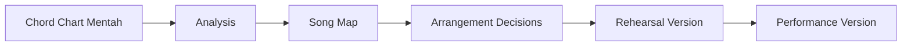
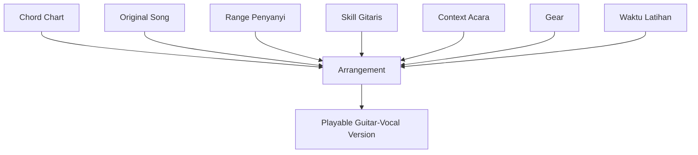
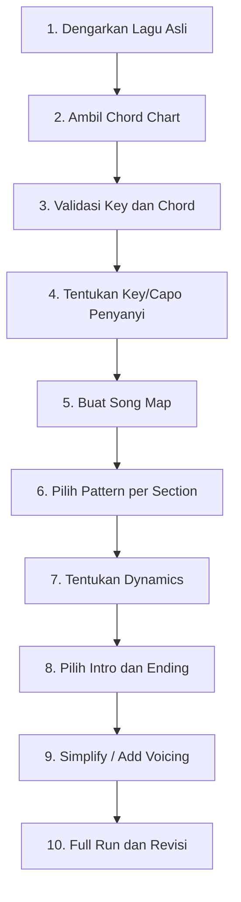
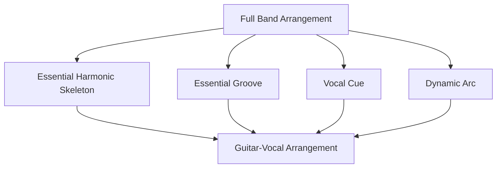
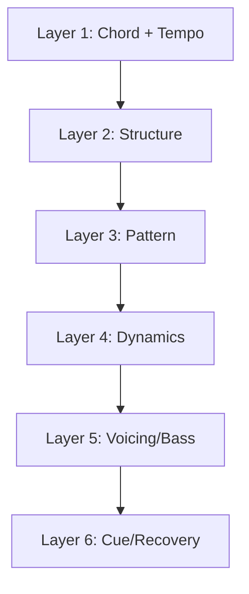
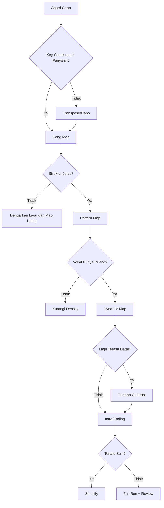
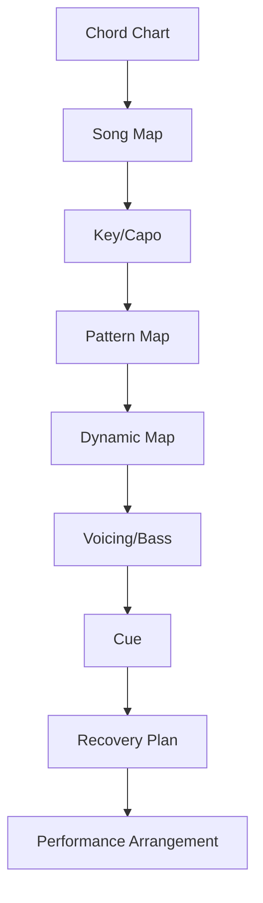

# learn-guitar-accompaniment-part-023.md

# Part 023 — Arrangement Thinking: Mengubah Chord Chart Menjadi Iringan Nyata

## Status Seri

Seri: **Belajar Guitar Accompaniment Berdasarkan The First 20 Hours**  
Bagian: **023 dari 035**  
Fokus: mengubah chord chart mentah menjadi iringan gitar-vokal yang playable, musikal, mendukung penyanyi, dan punya struktur performa yang jelas.

Pada part sebelumnya, kita membahas voicing, bass note, dan slash chord. Sekarang kita naik satu level lagi: bagaimana semua elemen tersebut disusun menjadi **arrangement**.

---

## Tujuan Pembelajaran Part Ini

Setelah menyelesaikan part ini, Anda harus bisa:

1. memahami perbedaan chord chart dan arrangement;
2. mengubah chord chart menjadi song map;
3. menentukan key/capo berdasarkan penyanyi;
4. memilih strumming/fingerpicking per section;
5. membuat intro yang memberi cue;
6. membuat verse, chorus, bridge, dan outro punya fungsi berbeda;
7. menyederhanakan lagu full band menjadi versi gitar-vokal;
8. memilih voicing dan bass movement secukupnya;
9. membuat dynamic arc;
10. menghasilkan arrangement sheet siap rehearsal.

---

## Prinsip Kaufman yang Dipakai di Part Ini

Dalam *The First 20 Hours*, target belajar harus spesifik dan skill harus didekonstruksi. Dalam konteks gitar pengiring, target spesifiknya bukan “bisa chord lagu”, tetapi:

> Bisa membawakan lagu secara utuh bersama penyanyi.

Chord chart hanya memberi bahan baku. Arrangement adalah keputusan tentang bagaimana bahan itu dibawakan.

Jika chord chart adalah data mentah, arrangement adalah program yang berjalan saat performa.



---

# 1. Chord Chart Bukan Arrangement

Chord chart biasanya hanya memberi:

```text
Chord
Lirik
Kadang capo
Kadang struktur
```

Tetapi chord chart sering tidak memberi:

```text
strumming pattern
intro length
vocal entry cue
dynamic map
ending
voicing choices
simplification
bass movement
section contrast
performance recovery plan
```

Jadi jika Anda hanya membaca chord chart, Anda masih belum punya arrangement.

Arrangement menjawab:

```text
Bagaimana lagu ini dimainkan dalam format gitar + vokal?
```

---

# 2. Arrangement sebagai Desain Sistem

Untuk software engineer, arrangement bisa dipahami sebagai desain sistem dengan constraint.

Input:

```text
Chord chart
Lagu asli
Range penyanyi
Skill gitaris
Format performance
Mood acara
Waktu latihan
Gear
```

Output:

```text
Versi gitar-vokal yang bisa dibawakan stabil
```



Arrangement yang baik bukan versi paling kompleks. Arrangement yang baik adalah versi yang paling mendukung lagu dan penyanyi dalam constraint nyata.

---

# 3. Pertanyaan Utama Arrangement

Sebelum memainkan lagu, jawab:

```text
1. Lagu ini untuk siapa?
2. Siapa penyanyinya?
3. Key mana yang nyaman?
4. Mood utamanya apa?
5. Section mana yang harus paling besar?
6. Bagian mana yang harus memberi ruang vokal?
7. Intro bagaimana memberi cue?
8. Ending bagaimana dibuat jelas?
9. Chord mana yang perlu disederhanakan?
10. Bagian mana yang berisiko gagal?
```

Jika pertanyaan ini tidak dijawab, rehearsal akan penuh trial-error acak.

---

# 4. Workflow Arrangement 10 Langkah



Setiap langkah menghasilkan keputusan. Jangan hanya “feeling” tanpa dokumentasi.

---

# 5. Step 1 — Dengarkan Lagu Asli

Dengarkan lagu asli sebelum melihat chord terlalu lama.

Tujuan listening:

```text
[ ] mood utama
[ ] tempo
[ ] feel/meter
[ ] struktur
[ ] kapan vokal masuk
[ ] kapan chorus naik
[ ] apakah ada intro penting
[ ] apakah ada stop/break
[ ] ending seperti apa
[ ] bagian paling emosional
```

Jangan langsung menyalin semua detail produksi. Anda hanya mencari elemen esensial.

---

# 6. Step 2 — Ambil Chord Chart

Chord chart adalah starting point, bukan source of truth sempurna.

Cek:

```text
[ ] apakah chord chart sesuai versi lagu?
[ ] apakah ada capo?
[ ] apakah key cocok?
[ ] apakah struktur lengkap?
[ ] apakah chord placement masuk akal?
[ ] apakah ada chord terlalu sulit?
[ ] apakah ada slash chord?
[ ] apakah ada chord yang terasa salah?
```

Jika chord chart dari internet terasa salah, bandingkan dengan telinga dan sumber lain jika ada. Untuk fase 20 jam, pilih chart yang sederhana dan usable.

---

# 7. Step 3 — Validasi Key dan Chord

Sebelum arrangement detail, pastikan:

```text
gitar tune
chord chart tidak jelas-jelas salah
key tidak terlalu tinggi/rendah untuk penyanyi
```

Validasi cepat:

1. mainkan chorus;
2. minta penyanyi nyanyi;
3. cek bagian tertinggi;
4. cek verse terendah;
5. pilih capo/key sementara.

Jangan menghabiskan waktu membuat intro cantik di key yang nanti diganti.

---

# 8. Step 4 — Tentukan Key/Capo

Catat dua hal:

```text
Shape yang dimainkan gitar
Sounding key aktual
```

Contoh:

```text
Shape: G-D-Em-C
Capo: 2
Sounding progression: A-E-F#m-D
Sounding key: A
```

Jika hanya gitar-vokal, shape cukup untuk eksekusi. Jika ada musisi lain, sounding key wajib jelas.

Template:

```text
Original key:
Singer key:
Guitar shape:
Capo:
Sounding key:
Reason:
Backup key:
```

---

# 9. Step 5 — Buat Song Map

Ubah chord chart panjang menjadi map.

Template:

```text
Title:
Key/Capo:
Tempo:
Feel:

Intro:
Verse 1:
Pre-Chorus:
Chorus:
Verse 2:
Bridge:
Final Chorus:
Outro:
```

Contoh:

```text
Intro: G-D-Em-C x1
Verse: G-D-Em-C x2
Pre-Chorus: C-D-Em-D x1
Chorus: G-D-Em-C x2
Bridge: Em-C-G-D x1
Final Chorus: G-D-Em-C x2
Outro: G final
```

Song map membantu Anda melihat lagu sebagai struktur, bukan halaman chord panjang.

---

# 10. Step 6 — Pilih Pattern per Section

Pattern harus mengikuti fungsi section.

Contoh:

```text
Intro       : fingerpicking P-i-m-i
Verse 1     : sparse strum
Pre-Chorus  : build strum
Chorus      : D-D-U-U-D-U
Verse 2     : medium strum
Bridge      : palm mute / picking
Final Chorus: full strum
Outro       : final chord sustain
```

Pertanyaan:

```text
Apakah verse memberi ruang?
Apakah chorus terasa naik?
Apakah bridge kontras?
Apakah pattern terlalu sulit untuk chord transition?
```

---

# 11. Step 7 — Tentukan Dynamics

Buat energy map:

```text
Intro: 30%
Verse 1: 40%
Pre-Chorus: 60%
Chorus: 80%
Verse 2: 50%
Bridge: 35% atau 70%
Final Chorus: 90%
Outro: 20%
```

Dinamika bisa diatur dengan:

- volume;
- density;
- attack;
- register;
- muting;
- silence;
- voicing;
- fingerpicking vs strumming.

Jangan membuat semua section sama.

---

# 12. Step 8 — Tentukan Intro

Intro harus memberi:

```text
key
tempo
mood
cue vocal entry
```

Pilihan intro sederhana:

## 12.1 Progression Intro

```text
G-D-Em-C x1
```

Penyanyi masuk setelah C.

## 12.2 Half Intro

```text
G-D
```

Cocok jika lagu ingin cepat masuk.

## 12.3 Picking Intro

Gunakan pattern lembut:

```text
P-i-m-i
```

Cocok untuk ballad.

## 12.4 Stop/hold Intro

Tahan chord terakhir sebelum vokal.

Cocok jika penyanyi butuh cue jelas.

---

# 13. Step 9 — Tentukan Ending

Ending harus jelas.

Pilihan:

## 13.1 Final Chord Sustain

```text
akhir di tonic
strum sekali
biarkan sustain
```

## 13.2 Repeat Last Line

Ulang bar terakhir atau line terakhir.

## 13.3 Ritardando Ringan

Melambat sedikit di akhir.

Gunakan hanya jika disepakati.

## 13.4 Stop Ending

Berhenti bersama di beat tertentu.

Butuh rehearsal.

Ending yang baik harus membuat penyanyi tahu kapan berhenti.

---

# 14. Step 10 — Simplify atau Add Detail

Setelah struktur, key, pattern, dan ending jelas, baru putuskan detail.

## Simplify jika:

```text
[ ] chord terlalu sulit
[ ] rhythm patah
[ ] vokal tertutup
[ ] slash chord membuat berhenti
[ ] intro terlalu kompleks
[ ] ending ragu
```

## Add detail jika:

```text
[ ] fondasi sudah stabil
[ ] lagu terlalu datar
[ ] vokal masih punya ruang
[ ] chord transition aman
[ ] detail mendukung emosi
```

Urutan:

```text
stabil dulu, indah kemudian
```

---

# 15. Acoustic Reduction

Jika lagu asli full band, Anda perlu mereduksi.

Elemen full band:

```text
drum
bass
electric guitar
keyboard
synth
backing vocal
strings
percussion
production effect
```

Dalam gitar-vokal, Anda tidak bisa membawa semuanya. Pilih yang esensial:

```text
vocal melody
chord progression
main groove
dynamic arc
hook penting
intro cue
ending
```



---

# 16. Menentukan Elemen yang Wajib Dipertahankan

Tanya:

```text
Jika elemen ini hilang, apakah lagu masih dikenali?
Jika elemen ini hilang, apakah vokal masih nyaman?
Jika elemen ini hilang, apakah emosi lagu masih sampai?
```

Wajib dipertahankan biasanya:

- chord utama;
- hook chorus;
- tempo/feel utama;
- lyric cue;
- final resolution;
- dynamic lift.

Boleh disederhanakan:

- drum fill;
- bass run detail;
- synth layer;
- solo panjang;
- ornament vokal;
- chord passing cepat.

---

# 17. Mengubah Riff Menjadi Chord

Jika lagu punya riff instrumental sulit, Anda bisa ganti dengan chord progression.

Contoh:

```text
Original intro: riff gitar
Simplified intro: chord progression x1
```

Aturan:

- pertahankan mood;
- pertahankan tempo;
- beri cue vocal entry;
- jangan memaksakan riff jika membuat error.

Nanti setelah skill naik, riff bisa dipelajari.

---

# 18. Mengubah Full Drum Groove Menjadi Strumming

Drum groove bisa diterjemahkan menjadi:

```text
downbeat
backbeat
accent
density
muting
```

Jika drum kuat di 2 dan 4, gitar bisa memberi accent ringan di 2 dan 4.

Jika verse drum minimal, gitar sparse.

Jika chorus drum full, gitar buka strumming.

Anda tidak perlu meniru drum secara literal. Ambil energinya.

---

# 19. Mengubah Bassline Menjadi Bass Note Gitar

Jika bassline penting tetapi sulit:

- gunakan root note di beat 1;
- gunakan slash chord penting;
- gunakan bass walkdown sederhana;
- jangan meniru semua nada bass.

Contoh:

```text
G - D/F# - Em
```

Cukup mempertahankan walkdown G-F#-E jika itu terdengar penting.

---

# 20. Mengubah Keyboard Pad Menjadi Voicing

Jika lagu asli punya pad lembut, gitar bisa meniru feel dengan:

- sustained chord;
- fingerpicking;
- Cadd9;
- Em7;
- Fmaj7;
- soft strumming;
- capo untuk shimmer.

Jangan strum terlalu agresif jika lagu aslinya pad-like.

---

# 21. Arrangement Layer

Bangun arrangement berlapis.



Jangan mulai dari layer 5 jika layer 1–3 belum stabil.

---

# 22. Minimum Viable Arrangement

Minimum viable arrangement adalah versi lagu yang:

```text
[ ] key nyaman
[ ] chord cukup benar
[ ] tempo stabil
[ ] struktur jelas
[ ] intro memberi cue
[ ] verse/chorus bisa dibedakan
[ ] ending jelas
[ ] bisa dimainkan full run
```

Belum perlu:

```text
riff asli
ornamen lengkap
bass run kompleks
sus chord banyak
percussive slap
solo instrumental
```

---

# 23. Arrangement Upgrade Path

Setelah minimum viable arrangement stabil, upgrade bertahap.

```text
V0: chord + downstroke
V1: strumming pattern
V2: verse sparse, chorus full
V3: intro/ending jelas
V4: capo/key vocal optimized
V5: voicing color
V6: bass movement/slash chord
V7: fingerpicking/texture
V8: performance polish
```

Jika V0 belum stabil, jangan lompat ke V7.

---

# 24. Example Arrangement: G-D-Em-C Pop Ballad

## Input

```text
Progression: G-D-Em-C
Feel: 4/4
Tempo: 72 BPM
Vocal: intimate verse, bigger chorus
```

## Arrangement

```text
Intro:
G-D-Em-C x1, fingerpicking P-i-m-i

Verse:
G-D-Em-C x2, sparse strum D---D---

Pre-Chorus:
C-D-Em-D x1, build D-DU-D-DU

Chorus:
G-D-Em-C x2, D-D-U-U-D-U

Bridge:
Em-C-G-D x1, palm mute

Final Chorus:
G-D-Em-C x2, fuller strum

Outro:
G final sustain
```

## Notes

```text
Capo: based on singer
Voicing: G 320033, Cadd9 optional
Cue: nod at final C of intro
Ending: final G held
```

---

# 25. Example Arrangement: C-G-Am-F Ballad

## Input

```text
Progression: C-G-Am-F
Feel: 4/4 slow
Vocal: emotional, lirik padat
Problem: F full sulit
```

## Arrangement

```text
Use Fmaj7 = x33210

Intro:
C-G-Am-Fmaj7 x1, picking P-i-m-a

Verse:
C-G-Am7-Fmaj7 x2, picking P-i-m-i

Chorus:
C-G-Am-Fmaj7 x2, light strum D-DU-D-DU

Bridge:
Am7-Fmaj7-C-G, sparse

Final Chorus:
C-G-Am-Fmaj7 x2, fuller strum

Outro:
C final sustain
```

## Notes

```text
Verse pakai Am7 untuk lembut.
Chorus boleh kembali Am untuk lebih tegas.
Fmaj7 dipakai karena F barre belum stabil.
```

---

# 26. Example Arrangement: 6/8 Ballad

## Input

```text
Progression: G-D-Em-C
Feel: 6/8
Vocal: long phrases
```

## Arrangement

```text
Counting:
1 2 3 4 5 6
Accent:
1 and 4

Intro:
G-D-Em-C x1, P-i-m-a-m-i

Verse:
same picking, soft

Chorus:
D - U D - U strum, fuller

Bridge:
Em-C-G-D, sparse picking

Final Chorus:
full 6/8 strum

Outro:
G arpeggio, final sustain
```

## Notes

```text
Jangan pakai pattern 4/4 D-D-U-U-D-U.
Jaga ayunan 1 dan 4.
```

---

# 27. Arrangement Sheet Template

Gunakan template ini.

```text
# Arrangement Sheet

Title:
Singer:
Original key:
Chosen key:
Guitar shape:
Capo:
Tempo:
Feel/meter:

## Song Map
Intro:
Verse 1:
Pre-Chorus:
Chorus:
Verse 2:
Bridge:
Final Chorus:
Outro:

## Pattern Map
Intro:
Verse:
Pre-Chorus:
Chorus:
Bridge:
Final Chorus:
Outro:

## Dynamic Map
Intro:
Verse:
Pre-Chorus:
Chorus:
Bridge:
Final Chorus:
Outro:

## Voicing/Bass
Base chords:
Voicing options:
Slash chords:
Simplifications:

## Vocal Support
Vocal entry:
Hardest vocal section:
Where guitar must be sparse:
Where guitar can build:

## Cues
Count-in:
Vocal entry cue:
Chorus cue:
Bridge cue:
Ending cue:

## Risks
Hardest chord:
Hardest transition:
Hardest section:
Recovery plan:

## Definition of Done
[ ] key checked
[ ] structure mapped
[ ] intro clear
[ ] ending clear
[ ] full run instrumental
[ ] full run with vocal
[ ] recording reviewed
```

---

# 28. Chord Chart Refactoring

Chord chart refactoring berarti menulis ulang chord chart agar lebih performable.

Contoh chord chart mentah:

```text
[Verse]
G D Em C
G D Em C

[Chorus]
G D Em C
G D Em C
```

Refactored arrangement:

```text
Key: G
Capo: none
Tempo: 72
Feel: 4/4

Intro:
G-D-Em-C x1, picking

Verse:
G-D-Em-C x2, sparse strum

Chorus:
G-D-Em-C x2, full strum

Ending:
G final sustain
```

Ini jauh lebih berguna untuk rehearsal.

---

# 29. Arrangement Decision Log

Catat keputusan penting.

```text
Decision:
Reason:
Alternative:
Risk:
Review after:
```

Contoh:

```text
Decision: Use Fmaj7 instead of F.
Reason: F barre not stable, Fmaj7 supports ballad mood.
Alternative: xx3211.
Risk: maj7 color may be too soft.
Review after: vocal rehearsal.
```

Ini membuat arrangement sadar, bukan kebetulan.

---

# 30. Arrangement dan Error Handling

Arrangement yang baik punya recovery path.

Contoh:

```text
If singer late after intro:
repeat intro progression.

If bridge forgotten:
go to chorus.

If Fmaj7 late:
play root/bass or hold Am briefly.

If ending uncertain:
final tonic chord sustain.
```

Tuliskan di arrangement sheet.

Performance-ready arrangement bukan hanya versi ideal. Ia juga punya fallback.

---

# 31. Arrangement dan Penyanyi

Arrangement harus diuji dengan penyanyi.

Checklist:

```text
[ ] key nyaman?
[ ] intro cukup jelas?
[ ] verse memberi ruang?
[ ] chorus mendukung?
[ ] bridge tidak membingungkan?
[ ] ending disepakati?
[ ] tempo nyaman?
[ ] gitar tidak terlalu ramai?
```

Jika penyanyi merasa tidak nyaman, ubah arrangement. Jangan mempertahankan ide gitar hanya karena Anda menyukainya.

---

# 32. Arrangement Review dengan Recording

Rekam full run.

Review:

```text
Structure:
- tersesat atau tidak?

Dynamics:
- verse/chorus berbeda?

Vocal support:
- vokal jelas?

Rhythm:
- tempo stabil?

Harmony:
- chord cocok?

Ending:
- yakin?

Complexity:
- ada bagian terlalu sulit?
```

Pilih 1–3 revisi, bukan 20.

---

# 33. Common Arrangement Bugs

## 33.1 Terlalu Mirip dari Awal sampai Akhir

Fix:

- dynamic map;
- pattern map;
- bridge contrast.

## 33.2 Terlalu Kompleks

Fix:

- kembali ke minimum viable arrangement;
- simplify chord/pattern.

## 33.3 Intro Tidak Memberi Cue

Fix:

- tentukan jumlah bar;
- cue vocal entry;
- ulang intro dalam rehearsal.

## 33.4 Ending Ragu

Fix:

- pilih final chord;
- latih ending 10 kali;
- sepakati dengan penyanyi.

## 33.5 Vokal Tertutup

Fix:

- sparse verse;
- kurangi density;
- soft attack;
- pilih voicing lebih ringan.

---

# 34. Debugging Matrix Arrangement

| Symptom | Kemungkinan Penyebab | Fix |
|---|---|---|
| Lagu datar | pattern/dynamics sama | dynamic map |
| Penyanyi bingung masuk | intro/cue tidak jelas | count-in + intro length |
| Chorus tidak naik | verse terlalu penuh | turunkan verse, buka chorus |
| Bridge kacau | struktur tidak dipetakan | song map + rehearsal |
| Chord sulit merusak rhythm | over-arranged | simplify |
| Vokal tertutup | density/volume tinggi | sparse arrangement |
| Ending ragu | tidak ada ending design | final chord/ritardando agreed |
| Acoustic version kosong | terlalu sedikit texture | tambah picking/voicing secukupnya |

---

# 35. Arrangement Decision Tree



---

# 36. Latihan 45 Menit untuk Part Ini

## Block 1 — Pilih Lagu Target, 5 Menit

Gunakan lagu safe atau growth.

## Block 2 — Dengarkan dan Map, 10 Menit

Tandai:

```text
Intro
Verse
Chorus
Bridge
Outro
```

## Block 3 — Key/Capo dan Chord, 5 Menit

Pastikan key/capo sementara.

## Block 4 — Pattern dan Dynamic Map, 10 Menit

Tentukan:

```text
verse pattern
chorus pattern
bridge treatment
```

## Block 5 — Intro/Ending, 5 Menit

Desain intro dan ending.

## Block 6 — Full Run, 7 Menit

Mainkan versi minimum.

## Block 7 — Review, 3 Menit

Catat revisi utama.

---

# 37. Latihan 15 Menit

```text
3 menit  tulis song map
3 menit  pilih pattern verse/chorus
3 menit  desain intro/ending
4 menit  run singkat
2 menit  catat bug
```

Jika hanya 5 menit:

```text
Tulis arrangement skeleton:
Key, capo, intro, verse, chorus, ending.
```

---

# 38. Mini Project Part Ini

Pilih satu lagu target dan buat arrangement sheet lengkap.

Minimal berisi:

```text
Title
Singer
Key/capo
Feel
Song map
Pattern map
Dynamic map
Intro
Ending
Voicing/simplification
Cues
Risks
Recovery plan
```

Lalu rekam satu full run menggunakan arrangement tersebut.

Target:

> Chord chart berubah menjadi dokumen performa yang bisa dipakai rehearsal.

---

# 39. Kesalahan Engineer-Minded dalam Arrangement

## 39.1 Over-Design Tanpa Playtest

Arrangement harus dimainkan dan direkam. Jangan hanya dirancang.

## 39.2 Meniru Versi Asli Terlalu Literal

Format gitar-vokal butuh adaptasi, bukan copy full band.

## 39.3 Terlalu Banyak Variasi

Arrangement yang terlalu variatif bisa sulit diingat dan mengganggu vokal.

## 39.4 Mengabaikan Penyanyi

Arrangement yang enak untuk gitar belum tentu enak untuk vokal.

## 39.5 Tidak Punya Fallback

Performance butuh recovery plan.

---

# 40. Acceptance Criteria Part 023

Anda boleh lanjut ke part 024 jika:

```text
[ ] Bisa menjelaskan perbedaan chord chart dan arrangement
[ ] Bisa membuat song map dari chord chart
[ ] Bisa menentukan key/capo sebagai bagian arrangement
[ ] Bisa memilih pattern per section
[ ] Bisa membuat dynamic map
[ ] Bisa membuat intro dengan vocal cue
[ ] Bisa membuat ending jelas
[ ] Bisa menyederhanakan chord/pattern jika terlalu sulit
[ ] Bisa membuat arrangement sheet
[ ] Bisa merekam full run dari arrangement minimum
```

---

# 41. Ringkasan Mental Model

Arrangement adalah proses mengubah bahan mentah menjadi performa.



Chord chart menjawab “chord apa”. Arrangement menjawab “bagaimana lagu ini hidup bersama penyanyi”.

---

# 42. Output Part Ini

Output konkret:

1. Anda memahami arrangement thinking.
2. Anda bisa mengubah chord chart menjadi arrangement sheet.
3. Anda bisa membuat pattern map dan dynamic map.
4. Anda bisa mendesain intro dan ending.
5. Anda bisa menyederhanakan lagu full band menjadi gitar-vokal.
6. Anda siap masuk ke rehearsal workflow bersama penyanyi.

Part berikutnya:

> **Rehearsal Workflow: Latihan Bersama Penyanyi secara Efektif.**

