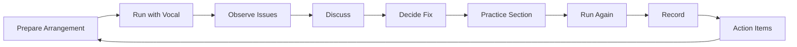
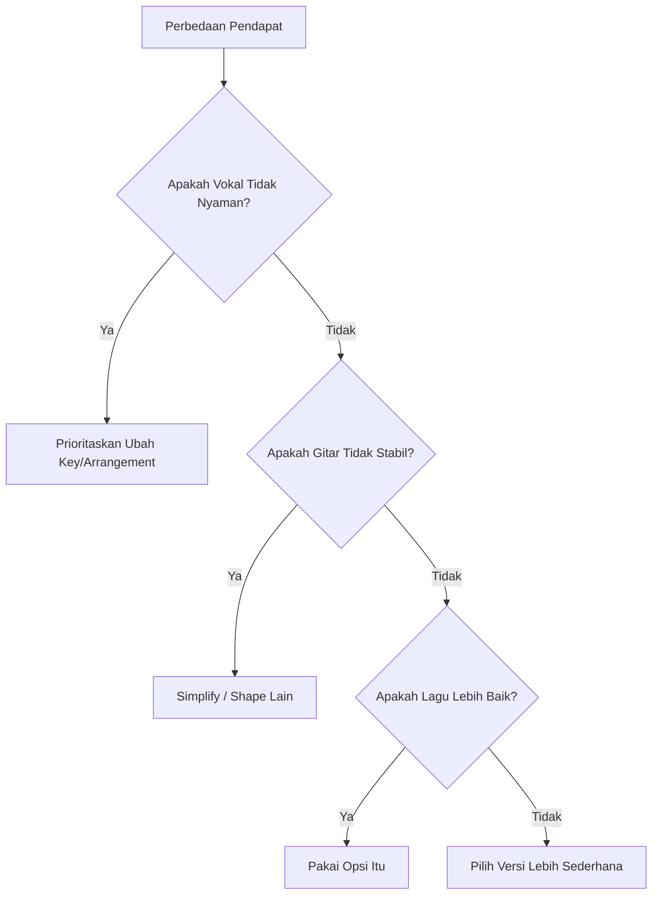
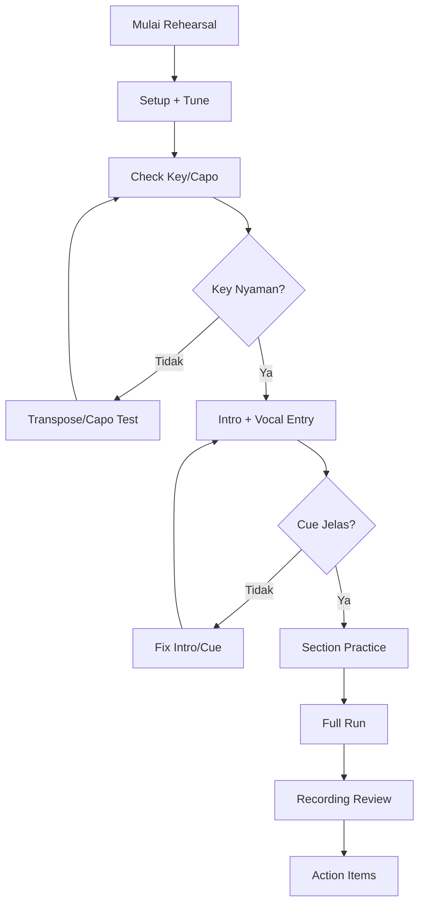
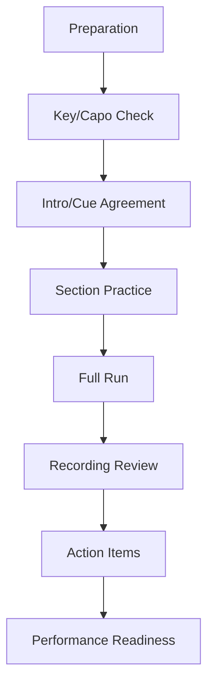

# learn-guitar-accompaniment-part-024.md

# Part 024 — Rehearsal Workflow: Latihan Bersama Penyanyi secara Efektif

## Status Seri

Seri: **Belajar Guitar Accompaniment Berdasarkan The First 20 Hours**  
Bagian: **024 dari 035**  
Fokus: membangun workflow latihan bersama penyanyi agar rehearsal menghasilkan keputusan, perbaikan, dan kesiapan tampil, bukan hanya mengulang lagu berkali-kali tanpa arah.

Part ini menghubungkan semua materi teknis dengan kolaborasi nyata.

---

## Tujuan Pembelajaran Part Ini

Setelah menyelesaikan part ini, Anda harus bisa:

1. memahami tujuan rehearsal gitar-vokal;
2. menyiapkan rehearsal sebelum bertemu penyanyi;
3. menjalankan rehearsal 30/45/60 menit secara efektif;
4. menentukan key/capo bersama penyanyi;
5. menyepakati intro, cue, dynamics, dan ending;
6. memberi dan menerima feedback dengan jelas;
7. merekam rehearsal dan membuat action item;
8. menangani perbedaan preferensi dengan penyanyi;
9. membuat rehearsal agreement;
10. menentukan apakah lagu sudah performance-ready.

---

## Prinsip Kaufman yang Dipakai di Part Ini

Dalam *The First 20 Hours*, latihan harus spesifik, terarah, dan mengurangi hambatan. Rehearsal adalah latihan dengan constraint nyata:

- ada penyanyi;
- ada napas;
- ada lirik;
- ada key comfort;
- ada cue;
- ada komunikasi;
- ada pressure sosial;
- ada kemungkinan salah dari dua pihak.

Rehearsal yang buruk hanya mengulang lagu dari awal sampai akhir berkali-kali.

Rehearsal yang baik:

> Mengidentifikasi masalah, membuat keputusan, melatih bagian kritis, merekam, dan menghasilkan action item.

---

# 1. Tujuan Rehearsal

Rehearsal bukan sekadar “main bareng”.

Tujuan rehearsal:

```text
[ ] cek key/capo
[ ] cek tempo
[ ] cek vocal entry
[ ] cek struktur
[ ] cek dynamics
[ ] cek cue
[ ] cek ending
[ ] cek balance gitar-vokal
[ ] cek bagian sulit
[ ] cek recovery
```

Jika setelah rehearsal tidak ada keputusan yang lebih jelas, rehearsal kurang efektif.

---

# 2. Peran Gitaris dalam Rehearsal

Sebagai gitaris pengiring, tugas Anda:

- datang dengan chord/arrangement siap;
- tune gitar;
- tahu beberapa opsi capo;
- mendengar penyanyi;
- tidak memaksa key yang nyaman bagi gitar saja;
- memberi tempo jelas;
- memberi cue;
- menjaga rhythm;
- menerima feedback;
- mencatat keputusan.

Anda bukan hanya “orang yang main chord”.

---

# 3. Peran Penyanyi dalam Rehearsal

Penyanyi membantu menentukan:

- key nyaman;
- tempo nyaman;
- phrasing;
- napas;
- bagian sulit;
- dynamics;
- cue yang dibutuhkan;
- ending yang natural;
- emosi lagu.

Gitaris harus bertanya dengan jelas, bukan menebak semua.

---

# 4. Rehearsal sebagai Feedback Loop



Loop ini lebih efektif daripada:

```text
Main lagu dari awal.
Salah.
Ulang dari awal.
Salah lagi.
Ulang dari awal.
```

---

# 5. Persiapan Sebelum Rehearsal

Sebelum bertemu penyanyi, siapkan:

```text
[ ] gitar tune dan layak
[ ] capo
[ ] pick cadangan
[ ] chord sheet
[ ] arrangement sheet
[ ] key/capo options
[ ] tempo estimate
[ ] song map
[ ] recording device
[ ] daftar bagian yang perlu diuji
```

Jangan datang kosong lalu baru mencari chord chart saat rehearsal dimulai.

---

# 6. Pre-Rehearsal Checklist

```text
Song:
Original key:
Candidate key/capo:
Chord progression:
Difficult chord:
Difficult transition:
Intro plan:
Ending plan:
Verse pattern:
Chorus pattern:
Bridge plan:
Questions for singer:
```

Contoh pertanyaan untuk penyanyi:

```text
Apakah chorus di key ini terlalu tinggi?
Mau intro satu putaran atau dua?
Ending mau tahan chord atau stop?
Verse mau lebih sepi?
Chorus mau dibuka penuh?
```

---

# 7. Rehearsal 30 Menit

Jika waktu hanya 30 menit:

```text
00:00–05:00  setup + tuning + goal
05:00–10:00  key/capo check
10:00–15:00  intro + vocal entry
15:00–22:00  verse/chorus section work
22:00–27:00  full run
27:00–30:00  notes + action items
```

Fokus:

- satu lagu;
- jangan terlalu banyak eksperimen;
- ambil keputusan.

---

# 8. Rehearsal 45 Menit

Format ideal untuk 1–2 lagu.

```text
00:00–05:00  setup + tuning
05:00–12:00  key/capo and chorus test
12:00–18:00  intro + vocal entry + tempo
18:00–28:00  section practice
28:00–36:00  full run recording
36:00–42:00  fix biggest issue
42:00–45:00  decisions + next action
```

Prinsip:

```text
full run harus ada
recording harus ada
action item harus ada
```

---

# 9. Rehearsal 60 Menit

Untuk 2–3 lagu.

```text
00:00–05:00  setup
05:00–15:00  song 1 key + problem section
15:00–25:00  song 1 full run + notes
25:00–35:00  song 2 key + problem section
35:00–45:00  song 2 full run + notes
45:00–52:00  song 3 quick pass / setlist transition
52:00–57:00  hardest section fixes
57:00–60:00  action items
```

Jika performance dekat, rehearsal 60 menit harus lebih banyak full run dan cue, bukan bongkar teori.

---

# 10. Key/Capo Check dengan Penyanyi

Jangan cek key dari verse saja. Chorus biasanya lebih menentukan.

Workflow:

1. mainkan chorus di key kandidat;
2. penyanyi nyanyi chorus;
3. tanya:
   - terlalu tinggi?
   - terlalu rendah?
   - nyaman?
   - tone masih bagus?
4. cek verse;
5. cek final chorus;
6. pilih key;
7. catat.

Template:

```text
Capo 0:
Capo 1:
Capo 2:
Chosen:
Reason:
Backup:
```

---

# 11. Tempo Check

Tempo harus nyaman untuk vokal dan gitar.

Cek:

```text
[ ] lirik tidak terburu
[ ] napas cukup
[ ] chord transition aman
[ ] mood lagu sesuai
[ ] chorus tidak dragging
[ ] verse tidak terlalu lambat
```

Jika tempo asli terlalu cepat untuk akustik, turunkan sedikit. Jika terlalu lambat, lagu bisa kehilangan energi.

Gunakan metronome sebagai referensi, tetapi jangan membuat rehearsal kaku.

---

# 12. Intro Agreement

Setiap lagu harus punya intro agreement.

Tentukan:

```text
Intro berapa bar?
Progression apa?
Penyanyi masuk setelah chord apa?
Cue-nya apa?
Jika penyanyi belum masuk, ulang atau tahan?
```

Contoh:

```text
Intro: G-D-Em-C x1
Vocal entry: setelah C, beat 1
Cue: eye contact di bar C
If late: repeat intro once
```

Tanpa intro agreement, vocal entry rentan kacau.

---

# 13. Ending Agreement

Ending harus disepakati.

Tentukan:

```text
Ending di chord apa?
Stop atau sustain?
Repeat last line?
Ritardando?
Siapa memberi cue?
Jika ragu, fallback apa?
```

Contoh:

```text
Ending: repeat last chorus line, final G sustain.
Cue: singer looks at guitarist before final line.
Fallback: if uncertain, hold G.
```

Ending ragu membuat seluruh lagu terasa tidak siap.

---

# 14. Dynamics Agreement

Sepakati energy map.

Contoh:

```text
Verse 1: gitar rendah, sparse
Chorus 1: buka sedang
Verse 2: sedikit lebih penuh
Bridge: turun
Final chorus: full
Outro: turun
```

Penyanyi bisa memberi feedback:

```text
Verse terlalu ramai.
Chorus kurang dorong.
Bridge mau lebih sepi.
Final chorus mau lebih besar.
```

Catat keputusan.

---

# 15. Cue Agreement

Cue penting:

```text
count-in
vocal entry
chorus entry
bridge entry
final chorus
ending
emergency recovery
```

Cue bisa berupa:

- eye contact;
- nod;
- body lift;
- strum accent;
- breath;
- count;
- held chord;
- stop.

Jangan mengandalkan “nanti kerasa”.

---

# 16. Rehearsal Language yang Baik

Gunakan kalimat spesifik.

Baik:

```text
Intro satu putaran, kamu masuk setelah C.
Verse aku turunkan strumming.
Chorus aku buka full.
Bridge kita turun dulu.
Ending tahan G empat beat.
```

Kurang baik:

```text
Nanti masuk aja.
Ikutin feel.
Pokoknya di chorus naik.
Ending bebas.
```

Feel penting, tetapi keputusan harus jelas.

---

# 17. Feedback yang Baik

Feedback harus spesifik, observable, dan actionable.

## Feedback Buruk

```text
Kurang enak.
Aneh.
Gitar kamu kurang feel.
Vokalnya kurang masuk.
```

## Feedback Baik

```text
Verse terlalu ramai, lirik jadi kurang jelas.
Chorus kurang naik dibanding verse.
Tempo naik setelah bridge.
Intro kurang jelas kapan saya masuk.
Ending perlu ditahan lebih lama.
```

Format:

```text
Observation:
Impact:
Suggestion:
```

Contoh:

```text
Observation: Strumming verse terlalu penuh.
Impact: Lirik awal kurang terdengar.
Suggestion: Pakai sparse strum sampai pre-chorus.
```

---

# 18. Cara Menerima Feedback

Sebagai gitaris, jangan defensif.

Dengarkan:

```text
Apakah penyanyi merasa key nyaman?
Apakah vokal tertutup?
Apakah cue membingungkan?
Apakah tempo membuat napas sulit?
```

Jawaban yang baik:

```text
Oke, kita coba verse lebih sparse.
Oke, coba capo turun satu.
Oke, chorus aku buka lebih pelan dulu.
Oke, kita ulang ending 3 kali.
```

Jangan debat teori jika penyanyi secara praktis tidak nyaman.

---

# 19. Cara Memberi Feedback ke Penyanyi

Berikan dengan hormat dan spesifik.

Contoh:

```text
Di intro, kamu masuk setengah bar lebih awal. Kita coba masuk setelah C selesai.
Chorus key ini terdengar agak tinggi, mau coba capo turun satu?
Di ending, aku butuh cue apakah kamu mau tahan nada atau langsung stop.
Tempo ini terasa membuat lirik verse agak terburu, coba sedikit lebih lambat?
```

Hindari:

```text
Kamu salah masuk.
Kamu fals.
Kamu nggak ngikutin.
```

Gunakan bahasa kolaboratif.

---

# 20. Section Practice

Jangan selalu ulang dari awal.

Jika masalah ada di bridge, latih bridge.

Format:

```text
2 bar sebelum masalah
bagian masalah
2 bar setelah masalah
```

Contoh:

```text
Chorus last 2 bars → Bridge → Final chorus first 2 bars
```

Ini melatih transisi antar-section.

---

# 21. Looping Problem Section

Jika bagian sulit:

1. mainkan pelan;
2. isolasi 2–4 bar;
3. ulang 3–5 kali;
4. full tempo;
5. masukkan ke song context.

Jangan ulang full song hanya untuk memperbaiki satu bar.

---

# 22. Full Run

Full run tetap wajib.

Aturan:

```text
[ ] dari awal sampai akhir
[ ] no stop
[ ] jika salah, recover
[ ] rekam
[ ] review setelah selesai
```

Full run melatih:

- stamina;
- struktur;
- cue;
- recovery;
- ending;
- pressure.

Section practice tanpa full run membuat lagu tidak siap tampil.

---

# 23. Recording Rehearsal

Rekam rehearsal, minimal full run.

Tidak harus kualitas studio. HP cukup.

Setelah rekam, dengarkan bagian tertentu:

```text
[ ] intro
[ ] verse clarity
[ ] chorus lift
[ ] bridge
[ ] ending
[ ] balance gitar-vokal
```

Jangan habiskan terlalu lama mendengar semua detail. Ambil action item.

---

# 24. Action Items

Setelah rehearsal, tulis:

```text
Song:
Decision:
Problem:
Owner:
Next action:
Due:
```

Contoh:

```text
Song: Song A
Decision: capo 1, G shape
Problem: ending belum kompak
Owner: both
Next action: latih final chorus + ending 5x
Due: next rehearsal
```

Jika tidak ada action item, rehearsal berikutnya akan mengulang masalah sama.

---

# 25. Rehearsal Notes Template

```text
# Rehearsal Notes

Date:
Songs:
Participants:

## Song 1
Key/capo:
Tempo:
Intro:
Verse treatment:
Chorus treatment:
Bridge:
Ending:
Issues:
Decisions:
Action items:

## General Notes
Balance:
Cue:
Dynamics:
Next rehearsal focus:
```

---

# 26. Rehearsal Agreement Template

Untuk setiap lagu:

```text
Title:
Key/capo:
Tempo:
Intro length:
Vocal entry:
Verse guitar:
Chorus guitar:
Bridge:
Ending:
If vocal late:
If vocal early:
If lyric forgotten:
If guitarist error:
Emergency fallback:
```

Contoh:

```text
Title: Practice Song
Key/capo: G shape capo 2
Tempo: 72 BPM
Intro: G-D-Em-C x1
Vocal entry: after C, beat 1
Verse guitar: sparse
Chorus guitar: full strum
Bridge: palm mute
Ending: final G shape sustain
If vocal late: repeat intro
If vocal early: cut intro and follow
If lyric forgotten: keep progression, go chorus
If guitarist error: keep singing, guitarist recovers
Fallback: repeat chorus progression
```

---

# 27. Conflict Resolution

Kadang gitaris dan penyanyi punya preferensi berbeda.

Contoh:

- gitaris ingin capo 2 karena chord nyaman;
- penyanyi ingin turun karena chorus tinggi;
- gitaris ingin strumming penuh;
- penyanyi merasa lirik tertutup;
- penyanyi ingin rubato;
- gitaris ingin tempo stabil.

Prinsip:

```text
Vokal comfort dan lagu lebih penting daripada ego instrument.
```

Namun gitaris juga boleh menyampaikan constraint:

```text
Kalau key ini, chord-nya jadi barre semua dan rhythm saya belum stabil. Bisa kita coba shape lain dengan capo?
```

Cari solusi bersama.

---

# 28. Decision Framework Konflik



Kriteria akhir:

```text
Apakah lagu terdengar lebih baik dan bisa dibawakan stabil?
```

---

# 29. Rubato Agreement

Jika lagu ballad butuh rubato, sepakati:

```text
di mana boleh fleksibel?
siapa yang memimpin?
kapan kembali ke tempo?
apakah ending melambat?
```

Contoh:

```text
Verse tetap tempo.
Before final chorus, singer boleh tahan 1 beat.
Ending ritardando mengikuti vocal.
```

Jangan rubato tanpa kesepakatan jika masih pemula.

---

# 30. Balance Check

Saat rehearsal, gitaris sering merasa suaranya pas dari posisi sendiri, tetapi dari depan mungkin terlalu keras.

Lakukan:

- rekam dari jarak beberapa meter;
- dengarkan balance;
- tanya penyanyi;
- kurangi strumming jika lirik tertutup;
- jangan semua bagian full volume.

Checklist:

```text
[ ] vokal jelas?
[ ] gitar mendukung?
[ ] bass tidak muddy?
[ ] chorus naik tanpa menutup vokal?
[ ] verse punya ruang?
```

---

# 31. Rehearsal dengan Metronome

Metronome berguna untuk kalibrasi, tetapi tidak selalu dipakai sepanjang rehearsal.

Gunakan untuk:

- cek tempo awal;
- memperbaiki tempo drift;
- melatih section sulit;
- menentukan BPM target.

Jangan memaksa penyanyi mengikuti click jika lagu butuh sedikit natural flow, tetapi jangan jadikan “feel” sebagai alasan tempo kacau.

---

# 32. Rehearsal Tanpa Metronome

Setelah tempo dikalibrasi:

- mainkan tanpa metronome;
- rekam;
- cek drift;
- bandingkan dengan target BPM.

Tujuan performance adalah internal pulse, bukan ketergantungan total pada click.

---

# 33. Setlist Rehearsal

Jika ada beberapa lagu, latih transisi antar-lagu.

Pertanyaan:

```text
Capo berubah?
Tuning perlu dicek?
Pick siap?
Key berikutnya?
Mood transisi?
Siapa mulai lagu berikut?
```

Setlist rehearsal penting karena error sering terjadi bukan di lagu, tetapi di antar-lagu.

---

# 34. Capo Management

Jika beberapa lagu memakai capo berbeda:

Setlist:

```text
Song 1: capo 2
Song 2: no capo
Song 3: capo 4
```

Tulis besar.

Latih:

- melepas capo;
- memasang capo;
- tune check singkat;
- count-in.

Jangan sampai lagu dimulai dengan capo salah.

---

# 35. Performance Simulation dengan Penyanyi

Setelah beberapa rehearsal, lakukan simulasi.

Aturan:

```text
[ ] setup seperti tampil
[ ] berdiri jika nanti berdiri
[ ] pakai capo/pick asli
[ ] lagu dimainkan berurutan
[ ] tidak berhenti
[ ] rekam video/audio
[ ] review setelah selesai
```

Simulation mengungkap masalah yang tidak terlihat saat latihan potongan.

---

# 36. Readiness Score

Beri skor 1–5.

```text
Key comfort:
Tempo stability:
Chord stability:
Vocal entry:
Dynamics:
Ending:
Recovery:
Confidence:
```

Performance-ready sederhana jika mayoritas 4 dan tidak ada P0.

P0:

```text
key tidak nyaman
intro tidak jelas
ending tidak jelas
berhenti total
lupa struktur
```

---

# 37. Rehearsal Anti-Patterns

## 37.1 Mengulang dari Awal Terus

Fix:

- section practice;
- problem loop.

## 37.2 Tidak Merekam

Fix:

- rekam minimal full run.

## 37.3 Tidak Mencatat Keputusan

Fix:

- rehearsal notes.

## 37.4 Semua Feedback Abstrak

Fix:

- observation-impact-suggestion.

## 37.5 Menghindari Ending

Fix:

- latih ending 5–10 kali.

## 37.6 Key Tidak Pernah Dicek Serius

Fix:

- chorus key test.

## 37.7 Terlalu Banyak Lagu Sekaligus

Fix:

- WIP limit.

---

# 38. Debugging Matrix Rehearsal

| Symptom | Kemungkinan Penyebab | Fix |
|---|---|---|
| Penyanyi masuk ragu | intro/cue tidak jelas | intro agreement |
| Chorus terasa lemah | dynamics kurang | chorus fuller |
| Verse lirik tertutup | gitar terlalu ramai | sparse strum |
| Ending kacau | tidak disepakati | ending drill |
| Tempo naik | gugup/strum keras | metronome + reduce density |
| Key tidak nyaman | capo salah | key test chorus |
| Bridge tersesat | song map lemah | section loop |
| Masalah sama berulang | tidak ada action item | rehearsal notes |

---

# 39. Rehearsal Decision Tree



---

# 40. Latihan 45 Menit untuk Part Ini

Jika ada penyanyi:

```text
5 menit   setup + tuning
7 menit   key/capo check
7 menit   intro + vocal entry
10 menit  verse/chorus balance
8 menit   full run recording
5 menit   ending drill
3 menit   notes/action items
```

Jika sendiri:

```text
5 menit   setup
5 menit   simulate singer key/capo using vocal recording
10 menit  play with vocal recording
10 menit  full run
5 menit   ending drill
5 menit   review recording
5 menit   notes
```

---

# 41. Latihan 15 Menit

Dengan penyanyi:

```text
3 menit  key check chorus
3 menit  intro/vocal entry
4 menit  verse/chorus
3 menit  ending
2 menit  notes
```

Sendiri:

```text
3 menit  play with vocal recording
4 menit  intro + verse
4 menit  chorus + ending
2 menit  record
2 menit  notes
```

---

# 42. Mini Project Part Ini

Lakukan satu rehearsal nyata atau simulasi dengan vocal recording.

Isi rehearsal notes:

```text
Date:
Song:
Key/capo:
Tempo:
Intro decision:
Ending decision:
Biggest vocal issue:
Biggest guitar issue:
Action items:
Next rehearsal focus:
```

Target:

> Setelah rehearsal, lagu harus lebih jelas daripada sebelumnya.

---

# 43. Definition of Done Rehearsal

Rehearsal dianggap berhasil jika:

```text
[ ] key/capo diputuskan
[ ] intro diputuskan
[ ] vocal entry jelas
[ ] verse/chorus treatment jelas
[ ] ending diputuskan
[ ] minimal satu full run direkam
[ ] ada action item
[ ] masalah terbesar diketahui
```

Rehearsal tidak harus sempurna. Rehearsal harus menghasilkan kejelasan.

---

# 44. Acceptance Criteria Part 024

Anda boleh lanjut ke part 025 jika:

```text
[ ] Bisa menjelaskan tujuan rehearsal
[ ] Bisa menyiapkan pre-rehearsal checklist
[ ] Bisa menjalankan key/capo check dengan penyanyi
[ ] Bisa membuat intro agreement
[ ] Bisa membuat ending agreement
[ ] Bisa memberi feedback spesifik
[ ] Bisa menerima feedback tanpa defensif
[ ] Bisa melakukan section practice
[ ] Bisa merekam full run rehearsal
[ ] Bisa membuat action items setelah rehearsal
```

---

# 45. Ringkasan Mental Model

Rehearsal adalah sistem feedback kolaboratif.



Rehearsal yang baik bukan yang bebas salah, tetapi yang membuat keputusan semakin jelas dan performance semakin aman.

---

# 46. Output Part Ini

Output konkret:

1. Anda punya workflow rehearsal.
2. Anda tahu cara cek key dengan penyanyi.
3. Anda bisa menyepakati intro, cue, dan ending.
4. Anda bisa membuat rehearsal notes.
5. Anda bisa mengubah feedback menjadi action item.
6. Anda siap masuk ke performance readiness.

Part berikutnya:

> **Performance Readiness: Checklist Siap Tampil.**

