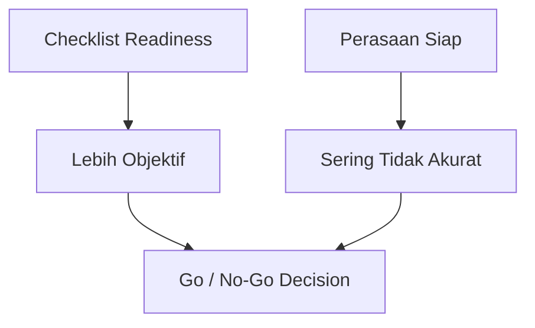
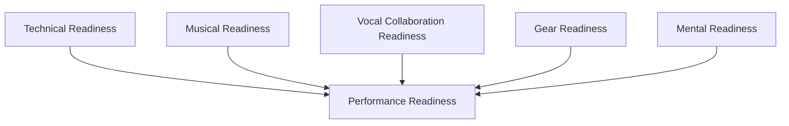
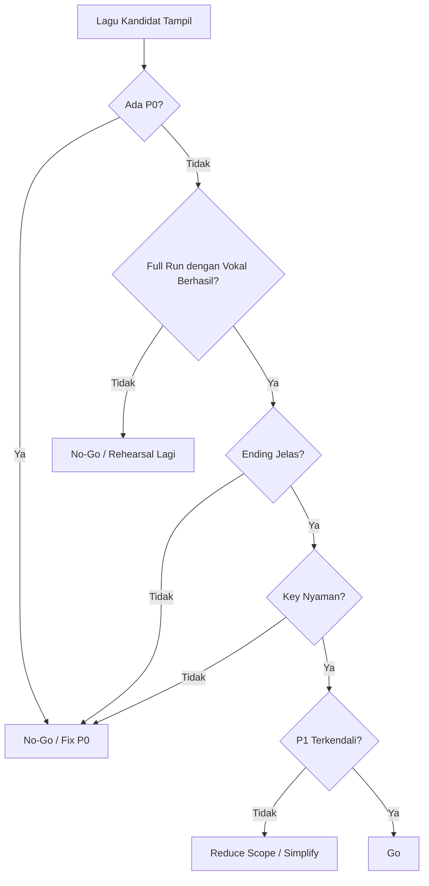
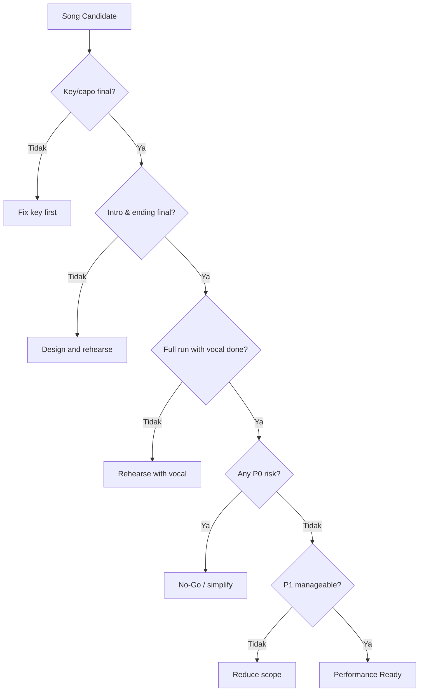
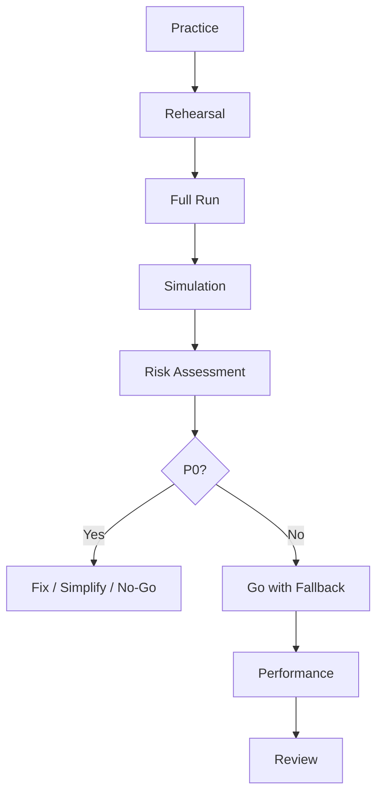

# learn-guitar-accompaniment-part-025.md

# Part 025 — Performance Readiness: Checklist Siap Tampil

## Status Seri

Seri: **Belajar Guitar Accompaniment Berdasarkan The First 20 Hours**  
Bagian: **025 dari 035**  
Fokus: menentukan apakah Anda benar-benar siap tampil mengiringi penyanyi, dengan checklist objektif, simulasi, risk assessment, dan fallback plan.

Setelah mempelajari chord, rhythm, strumming, capo, vokal, dinamika, fingerpicking, arrangement, dan rehearsal, sekarang pertanyaan utamanya adalah:

> Apakah ini sudah cukup aman untuk dibawakan di depan orang?

Part ini membahas readiness, bukan perfeksionisme.

---

## Tujuan Pembelajaran Part Ini

Setelah menyelesaikan part ini, Anda harus bisa:

1. membedakan “bisa dimainkan di kamar” vs “siap tampil”;
2. membuat checklist siap tampil per lagu;
3. membuat checklist siap tampil per setlist;
4. mengidentifikasi risiko P0/P1 sebelum tampil;
5. melakukan performance simulation;
6. menyiapkan fallback plan;
7. mengelola gugup dan error;
8. menyiapkan gear dan dokumen;
9. melakukan final rehearsal;
10. menentukan keputusan go/no-go secara rasional.

---

## Prinsip Kaufman yang Dipakai di Part Ini

Dalam *The First 20 Hours*, targetnya bukan menjadi ahli dunia, tetapi mencapai level performa yang cukup baik untuk tujuan spesifik. Untuk seri ini, tujuan spesifiknya:

> Tampil mengiringi penyanyi dengan gitar secara stabil, aman, dan mendukung vokal.

Artinya readiness bukan berarti:

```text
[ ] tidak pernah salah
[ ] chord 100% bersih
[ ] bisa memainkan versi asli sempurna
[ ] punya gear profesional
[ ] semua ornament indah
```

Readiness berarti:

```text
[ ] lagu bisa selesai
[ ] penyanyi nyaman
[ ] tempo cukup stabil
[ ] intro dan ending jelas
[ ] error kecil bisa di-recover
[ ] key/capo benar
[ ] gear cukup aman
[ ] tidak ada risiko fatal yang belum ditangani
```

---

# 1. Siap Tampil Bukan Sempurna

Pemula sering menunggu rasa “sudah siap” secara emosional. Masalahnya, rasa siap sering datang terlambat atau tidak datang sama sekali.

Maka kita butuh readiness criteria.



Perasaan tetap penting, tetapi keputusan tampil sebaiknya berdasarkan bukti:

- rekaman;
- full run;
- rehearsal;
- checklist;
- error log;
- feedback penyanyi.

---

# 2. Kamar, Rehearsal, dan Performance adalah Environment Berbeda

## 2.1 Bisa di Kamar

Ciri:

- bisa main saat santai;
- bisa ulang jika salah;
- tidak ada tekanan sosial;
- tidak ada penyanyi nyata;
- volume tidak dipersoalkan;
- gear sederhana.

## 2.2 Bisa Saat Rehearsal

Ciri:

- sudah ada penyanyi;
- ada cue;
- ada key/capo;
- ada full run;
- masih boleh berhenti dan diskusi;
- masih bisa memperbaiki.

## 2.3 Siap Performance

Ciri:

- bisa no-stop;
- bisa recover;
- intro/ending jelas;
- gear siap;
- tidak bergantung pada restart;
- penyanyi tahu agreement;
- ada fallback plan.

Jangan menganggap “bisa di kamar” otomatis “siap tampil”.

---

# 3. Definition of Ready vs Definition of Done

## 3.1 Definition of Ready

Lagu siap masuk rehearsal/performance preparation jika:

```text
[ ] chord sudah diketahui
[ ] key/capo kandidat ada
[ ] song map ada
[ ] intro/ending kandidat ada
[ ] pattern verse/chorus kandidat ada
```

## 3.2 Definition of Done

Lagu siap tampil jika:

```text
[ ] key/capo final
[ ] intro final
[ ] vocal entry final
[ ] ending final
[ ] full run instrumental berhasil
[ ] full run dengan vokal berhasil
[ ] recording direview
[ ] error fatal tidak muncul
[ ] fallback plan ada
```

Readiness bukan sekadar lagu “sudah dipelajari”. Lagu harus “sudah diuji”.

---

# 4. Performance Readiness Layer

Readiness punya beberapa layer.



## 4.1 Technical Readiness

- chord;
- transition;
- rhythm;
- structure;
- capo;
- ending.

## 4.2 Musical Readiness

- dynamics;
- vocal space;
- arrangement;
- feel;
- phrasing.

## 4.3 Collaboration Readiness

- intro cue;
- vocal entry;
- key comfort;
- recovery agreement;
- ending cue.

## 4.4 Gear Readiness

- guitar;
- tuner;
- capo;
- pick;
- cable/mic if needed;
- stand/strap;
- backup.

## 4.5 Mental Readiness

- no-stop mindset;
- error recovery;
- breathing;
- confidence based on evidence.

---

# 5. Checklist Siap Tampil per Lagu

Gunakan checklist ini untuk setiap lagu.

```text
## Song Performance Checklist

Title:
Singer:
Key:
Capo:
Tempo:
Feel:

Technical:
[ ] Gitaris bisa memainkan chord dari awal sampai akhir
[ ] Transisi chord utama cukup stabil
[ ] Strumming/fingerpicking tidak berhenti total
[ ] Tempo cukup stabil
[ ] Struktur lagu dihafal atau song map aman
[ ] Intro jelas
[ ] Ending jelas

Vocal:
[ ] Key nyaman untuk penyanyi
[ ] Vocal entry jelas
[ ] Verse memberi ruang
[ ] Chorus mendukung vokal
[ ] Bagian tersulit vokal sudah diuji
[ ] Penyanyi tahu cue

Arrangement:
[ ] Verse/chorus berbeda
[ ] Bridge/contrast jelas
[ ] Dynamics map ada
[ ] Voicing tidak mengganggu vokal
[ ] Simplification disepakati

Recovery:
[ ] Jika penyanyi telat, ada plan
[ ] Jika chord salah, gitaris tahu fallback
[ ] Jika lupa struktur, ada recovery
[ ] Jika ending ragu, ada final fallback

Proof:
[ ] Full run instrumental pernah berhasil
[ ] Full run dengan vokal pernah berhasil
[ ] Recording terakhir direview
[ ] Tidak ada P0 bug tersisa
```

---

# 6. P0/P1 Risk Assessment

Sebelum tampil, klasifikasikan risiko.

## P0 — Tidak Boleh Ada Saat Tampil

```text
[ ] key/capo belum final
[ ] tidak tahu intro
[ ] penyanyi tidak tahu kapan masuk
[ ] ending belum disepakati
[ ] sering berhenti total
[ ] struktur belum jelas
[ ] gitar sering fals
[ ] tidak bisa recover saat salah
```

Jika masih ada P0, lagu belum siap.

## P1 — Harus Dikurangi

```text
[ ] tempo naik di chorus
[ ] chord tertentu sering telat
[ ] verse terlalu ramai
[ ] bridge sering lupa
[ ] transisi capo antar-lagu belum aman
[ ] volume gitar belum seimbang
```

P1 bisa tampil jika ada fallback dan risikonya terkendali.

## P2 — Bisa Diterima

```text
[ ] beberapa buzzing kecil
[ ] ornament belum rapi
[ ] voicing belum variatif
[ ] dynamics belum sempurna
```

P2 bukan alasan otomatis membatalkan tampil.

---

# 7. Go/No-Go Decision

Gunakan decision tree.



Readiness harus bisa dijelaskan.

Contoh:

```text
Go: tidak ada P0, full run 2x berhasil, ending jelas, key nyaman.
No-Go: intro belum jelas dan penyanyi masih sering masuk salah.
```

---

# 8. Full Run Requirement

Sebuah lagu belum siap tampil jika belum pernah full run.

Full run berarti:

```text
[ ] mulai dari count-in/intro
[ ] lanjut sampai ending
[ ] tidak restart
[ ] jika salah, recover
[ ] direkam minimal sekali
```

Untuk performance readiness, target:

```text
Minimal 2 full run berhasil:
1x instrumental
1x dengan vokal
```

Lebih baik:

```text
3x full run dengan vokal, no-stop
```

---

# 9. Performance Simulation

Simulation adalah rehearsal yang meniru kondisi tampil.

Checklist:

```text
[ ] berdiri jika nanti tampil berdiri
[ ] pakai strap jika nanti pakai strap
[ ] pakai capo/pick yang sama
[ ] urutan lagu seperti setlist
[ ] no restart
[ ] gunakan count-in
[ ] rekam video/audio
[ ] lakukan ending seperti performance
[ ] jangan diskusi di tengah lagu
```

Simulation menguji:

- pressure;
- memory;
- transition antar-lagu;
- gear handling;
- capo management;
- stamina;
- error recovery.

---

# 10. Simulation Mode vs Practice Mode

## Practice Mode

Boleh:

- berhenti;
- memperbaiki bar tertentu;
- diskusi;
- mengulang section;
- turunkan tempo.

## Simulation Mode

Tidak boleh:

- restart;
- berhenti karena error kecil;
- diskusi di tengah;
- memperbaiki chord saat lagu jalan;
- mengulang kecuali arrangement.

Keduanya diperlukan. Jangan hanya practice mode.

---

# 11. Setlist Readiness

Jika tampil lebih dari satu lagu, cek setlist.

```text
Song 1:
Key/capo:
Start:
Ending:
Next transition:

Song 2:
Key/capo:
Start:
Ending:
Next transition:
```

Risiko antar-lagu:

```text
[ ] lupa capo
[ ] lupa tune
[ ] pick hilang
[ ] chord sheet salah urut
[ ] tempo lagu berikut terlalu mirip
[ ] mood transisi aneh
```

Setlist performance bukan sekadar kumpulan lagu siap. Urutan dan transisi juga perlu siap.

---

# 12. Setlist Risk Table

| Lagu | Capo | Risiko | Fallback |
|---|---:|---|---|
| Song A | 2 | chorus tempo naik | reduce strum |
| Song B | 0 | intro cue | count-in jelas |
| Song C | 4 | capo salah | tulis besar di sheet |

Jika ada banyak perubahan capo, latih transisi antar-lagu.

---

# 13. Gear Readiness Checklist

Minimal:

```text
[ ] gitar
[ ] tuner
[ ] capo
[ ] pick utama
[ ] pick cadangan
[ ] chord/arrangement sheet
[ ] strap jika berdiri
[ ] baterai pickup/preamp jika ada
[ ] kabel jika amplified
[ ] stand jika perlu
[ ] cloth/lap kecil
```

Jika pakai HP/tablet untuk chord:

```text
[ ] baterai cukup
[ ] brightness cukup
[ ] mode jangan ganggu
[ ] file offline
[ ] urutan lagu benar
```

Jangan biarkan gear kecil menjadi P0.

---

# 14. Capo Readiness

Capo sering menjadi sumber error.

Checklist:

```text
[ ] posisi capo per lagu ditulis besar
[ ] capo mudah dijangkau
[ ] tahu kapan pasang/lepas
[ ] cek tuning setelah capo
[ ] capo tidak membuat buzzing
[ ] capo tidak menarik senar sharp parah
```

Latihan:

```text
Song A capo 2 → Song B no capo → Song C capo 4
```

Lakukan seperti performance.

---

# 15. Tuning Readiness

Tune sebelum tampil.

Jika set panjang:

- tune sebelum set;
- cek setelah pasang capo;
- cek jika gitar terdengar aneh;
- cek setelah perubahan suhu/ruangan;
- cek sebelum lagu penting jika memungkinkan.

Tuning adalah readiness P0.

Gitar yang fals membuat chord benar terdengar salah.

---

# 16. Chord Sheet Readiness

Chord sheet harus membantu, bukan mengganggu.

Checklist:

```text
[ ] font cukup besar
[ ] struktur jelas
[ ] capo/key tertulis
[ ] intro/ending tertulis
[ ] tidak terlalu banyak teks
[ ] halaman tidak harus sering digeser
[ ] section penting ditandai
[ ] cue tertulis
```

Buruk:

```text
Chord sheet panjang dari internet tanpa struktur.
```

Baik:

```text
Arrangement sheet ringkas dengan song map dan cue.
```

---

# 17. Memory vs Sheet

Tidak wajib menghafal semua jika sheet tersedia. Tetapi jangan sepenuhnya bergantung pada sheet sampai kehilangan kontak dengan penyanyi.

Minimal hafal:

```text
[ ] intro
[ ] vocal entry
[ ] progression utama
[ ] chorus
[ ] bridge cue
[ ] ending
```

Sheet adalah backup dan navigasi, bukan pengganti mendengar.

---

# 18. Mental Readiness

Gugup normal. Tujuannya bukan menghilangkan gugup, tetapi tetap bisa bermain saat gugup.

Persiapan:

```text
[ ] simulation no-stop
[ ] latihan dengan orang menonton
[ ] rekam video
[ ] latihan berdiri
[ ] latihan recovery
[ ] napas sebelum mulai
[ ] fokus ke penyanyi, bukan ego
```

Mantra:

```text
Saya tidak harus sempurna.
Saya harus menjaga lagu tetap berjalan.
Saya mendukung penyanyi.
Jika salah, saya recover.
```

---

# 19. Pre-Performance Routine

Buat routine 10–15 menit.

```text
[ ] cek gitar
[ ] tune
[ ] cek capo
[ ] cek pick
[ ] cek chord sheet
[ ] main chord pertama tiap lagu
[ ] cek intro lagu pertama
[ ] tarik napas
[ ] komunikasi singkat dengan penyanyi
[ ] mulai
```

Routine mengurangi panic.

---

# 20. 60-Second Pre-Song Checklist

Sebelum tiap lagu:

```text
1. Capo benar?
2. Gitar tune?
3. Chord pertama?
4. Tempo?
5. Intro berapa bar?
6. Penyanyi siap?
7. Ending ingat?
```

Ini sangat sederhana tetapi menyelamatkan banyak performance.

---

# 21. Start Strong

Awal lagu menentukan rasa aman penyanyi.

Sebelum strum pertama:

- napas;
- pastikan tangan siap;
- tempo terasa;
- cue penyanyi;
- jangan mulai ragu.

Jika perlu count-in:

```text
1 2 3 4
```

Atau nod jelas.

Intro yang ragu membuat penyanyi ragu.

---

# 22. Ending Strong

Ending yang yakin membuat audience merasa lagu selesai dengan baik.

Latih ending lebih banyak daripada yang Anda kira perlu.

Minimum:

```text
[ ] tahu chord akhir
[ ] tahu stop/sustain
[ ] tahu apakah ritardando
[ ] tahu cue penyanyi
[ ] tahu kapan tangan berhenti
```

Latihan:

```text
final chorus last 4 bars → ending
```

Ulang 10 kali.

---

# 23. Handling Mistakes During Performance

Saat tampil:

```text
[ ] jangan berhenti
[ ] jaga rhythm
[ ] kecilkan volume jika perlu
[ ] pakai root/partial chord
[ ] lihat penyanyi
[ ] kembali di downbeat
[ ] jangan ekspresi panik
```

Jika salah kecil, kemungkinan audience tidak sadar. Jika Anda panik, audience sadar.

---

# 24. Jika Penyanyi Salah Saat Tampil

Tugas Anda:

- jangan menyalahkan;
- ikuti jika aman;
- jaga progression;
- beri cue;
- ulang section jika perlu;
- bantu kembali ke chorus/ending.

Penyanyi adalah pusat. Gitar harus menjadi safety net.

---

# 25. Jika Gear Bermasalah Saat Tampil

## Pick jatuh

- lanjut dengan jari;
- ambil pick cadangan jika ada ruang.

## Capo buzzing

- jika minor, lanjut;
- jika parah dan sebelum vokal, stop dan perbaiki;
- prevention: cek sebelum mulai.

## Gitar terlalu keras/kecil

- kontrol tangan kanan;
- adjust pickup jika memungkinkan;
- jangan mengorbankan tempo.

## Senar putus

Untuk pemula, ini bisa fatal. Jika informal, stop dan ganti/ambil gitar lain. Prevention: senar layak dan tidak terlalu tua.

---

# 26. Performance Readiness Score

Beri skor 1–5.

```text
Technical stability:
Tempo:
Chord transition:
Structure:
Vocal support:
Dynamics:
Intro:
Ending:
Recovery:
Gear:
Confidence:
```

Interpretasi:

```text
4–5 = aman
3 = cukup tapi perlu perhatian
1–2 = risiko tinggi
```

No-go jika:

```text
Intro <= 2
Ending <= 2
Key comfort <= 2
Structure <= 2
Recovery <= 2
```

---

# 27. Readiness Dashboard

Contoh:

| Area | Score | Notes |
|---|---:|---|
| Key comfort | 4 | capo 2 nyaman |
| Tempo | 3 | chorus sedikit naik |
| Chords | 4 | C kadang buzz |
| Structure | 4 | bridge aman |
| Intro | 5 | cue jelas |
| Ending | 3 | perlu latihan final hold |
| Recovery | 3 | chord telat bisa lanjut |
| Gear | 4 | pick backup ada |

Action:

```text
Latih ending dan chorus tempo sebelum tampil.
```

---

# 28. Reduce Scope Jika Belum Siap

Jika readiness kurang, jangan selalu membatalkan semuanya. Kurangi scope.

Opsi:

```text
[ ] turunkan tempo
[ ] sederhanakan strumming
[ ] hapus slash chord
[ ] pakai chord dasar
[ ] buat intro lebih pendek
[ ] buat ending final chord
[ ] pilih lagu safe
[ ] ubah key/capo
[ ] kurangi jumlah lagu
```

Scope reduction adalah strategi profesional, bukan kegagalan.

---

# 29. Lagu Sulit Menjadi Lagu Later

Jika lagu belum siap, pindahkan ke later.

Jangan memaksa lagu yang masih P0 hanya karena suka.

Keputusan dewasa:

```text
Lagu ini belum siap untuk performance sekarang.
Saya pilih lagu yang lebih aman agar penyanyi dan lagu tetap baik.
```

---

# 30. Performance Day Checklist

```text
## Before Leaving
[ ] gitar
[ ] capo
[ ] tuner
[ ] pick + backup
[ ] cable
[ ] strap
[ ] chord sheets
[ ] battery if needed
[ ] water
[ ] setlist

## Before Sound/Start
[ ] tune
[ ] capo check
[ ] volume check
[ ] first chord check
[ ] talk with singer
[ ] check sheet order

## Before Each Song
[ ] capo
[ ] chord first
[ ] tempo
[ ] intro cue
[ ] singer ready
```

---

# 31. After Performance Review

Setelah tampil, jangan hanya menilai emosional.

Gunakan post-performance review.

```text
What went well:
What went wrong:
Did we finish songs?
Did singer feel supported?
Tempo issues:
Chord issues:
Cue issues:
Gear issues:
Audience response:
Top 3 fixes:
```

Review ini menjadi bahan 20 jam berikutnya.

---

# 32. Performance Post-Mortem Template

```text
# Performance Review

Date:
Context:
Songs:
Singer:

## Song 1
Key/capo:
What worked:
Issues:
Recovery:
Next fix:

## Song 2
...

## Overall
Best moment:
Worst issue:
Technical readiness:
Musical readiness:
Collaboration:
Gear:
Next practice focus:
```

---

# 33. Common Readiness Bugs

## 33.1 Bisa Main Sendiri tapi Gagal dengan Vokal

Penyebab:

- tidak latihan dengan vocal;
- key belum diuji;
- gitar terlalu ramai;
- cue kurang jelas.

Fix:

- rehearsal dengan vocal recording/penyanyi;
- vocal-aware map.

## 33.2 Intro Selalu Ragu

Penyebab:

- tempo belum internal;
- count-in tidak jelas;
- chord pertama belum siap.

Fix:

- pre-song checklist;
- latih intro 10 kali.

## 33.3 Ending Selalu Berantakan

Penyebab:

- tidak didesain;
- tidak dilatih;
- penyanyi/gitar beda ekspektasi.

Fix:

- ending agreement;
- ending drill.

## 33.4 Tempo Naik Saat Gugup

Fix:

- simulation;
- metronome;
- reduce strumming;
- breathing.

## 33.5 Capo Salah

Fix:

- setlist dengan capo besar;
- pre-song checklist.

---

# 34. Debugging Matrix Readiness

| Symptom | Root Cause | Fix |
|---|---|---|
| Gagal saat tampil padahal bisa latihan | tidak ada simulation | performance simulation |
| Penyanyi bingung masuk | intro/cue belum siap | intro agreement |
| Ending ragu | ending tidak dilatih | ending drill |
| Lagu terasa datar | dynamics tidak siap | dynamic map |
| Gitar terlalu keras | balance tidak dicek | recording dari depan |
| Capo salah | setlist tidak jelas | capo checklist |
| Tempo naik | gugup/strum besar | reduce density, breathe |
| Lupa struktur | song map belum internal | no-stop full run |

---

# 35. Readiness Decision Tree per Lagu



---

# 36. Latihan 45 Menit untuk Part Ini

## Block 1 — Checklist Review, 8 Menit

Pilih satu lagu. Isi checklist readiness.

## Block 2 — P0/P1 Risk, 7 Menit

Tulis:

```text
P0:
P1:
Fallback:
```

## Block 3 — Intro/Ending Drill, 10 Menit

Latih:

```text
intro x5
ending x5
```

## Block 4 — Performance Simulation, 12 Menit

Full run no-stop dengan recording.

## Block 5 — Review, 8 Menit

Isi readiness score dan action items.

---

# 37. Latihan 15 Menit

```text
3 menit  pre-song checklist
4 menit  intro + vocal entry
4 menit  ending
3 menit  no-stop run section
1 menit  readiness note
```

Jika hanya 5 menit:

```text
2 menit  intro
2 menit  ending
1 menit  capo/key check
```

---

# 38. Mini Project Part Ini

Pilih satu lagu target dan buat:

```text
Performance checklist
P0/P1 risk list
Fallback plan
Readiness score
One recording full run
Go/no-go decision
```

Target:

> Anda bisa menjelaskan secara objektif apakah lagu itu siap tampil atau belum.

---

# 39. Kesalahan Engineer-Minded dalam Readiness

## 39.1 Menunggu Kepastian 100%

Performance selalu punya uncertainty. Readiness adalah risk management, bukan kepastian total.

## 39.2 Over-Checklist Tanpa Simulation

Checklist harus diuji dengan full run.

## 39.3 Menganggap Bug Kecil sebagai No-Go

Buzzing kecil bukan P0. Ending kacau adalah P0.

## 39.4 Mengabaikan Perasaan Penyanyi

Jika penyanyi tidak nyaman, readiness rendah walau gitaris merasa siap.

## 39.5 Tidak Melatih Recovery

Performance-ready berarti bisa recover, bukan tidak pernah salah.

---

# 40. Acceptance Criteria Part 025

Anda boleh lanjut ke part 026 jika:

```text
[ ] Bisa membedakan bisa di kamar, rehearsal-ready, dan performance-ready
[ ] Bisa membuat checklist siap tampil per lagu
[ ] Bisa mengidentifikasi P0/P1 risk
[ ] Bisa membuat go/no-go decision
[ ] Bisa melakukan performance simulation
[ ] Bisa membuat fallback plan
[ ] Bisa membuat gear checklist
[ ] Bisa membuat pre-song checklist
[ ] Bisa memberi readiness score
[ ] Bisa melakukan post-performance review
```

---

# 41. Ringkasan Mental Model

Performance readiness adalah risk management untuk musik.



Siap tampil bukan berarti tidak takut. Siap tampil berarti Anda tahu lagu, tahu penyanyi, tahu risiko, dan tahu cara recover.

---

# 42. Output Part Ini

Output konkret:

1. Anda punya checklist siap tampil.
2. Anda bisa menilai readiness secara objektif.
3. Anda bisa mengidentifikasi risiko fatal.
4. Anda bisa melakukan performance simulation.
5. Anda bisa membuat fallback plan.
6. Anda siap memahami sound basics untuk panggung dan amplified setup.

Part berikutnya:

> **Sound Basics: Tone, Volume, Mic, Pickup, dan Setup Panggung.**

