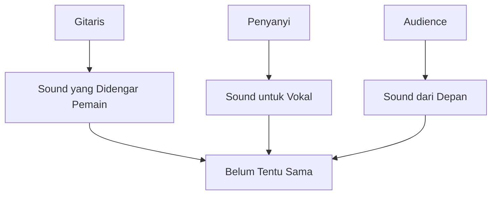
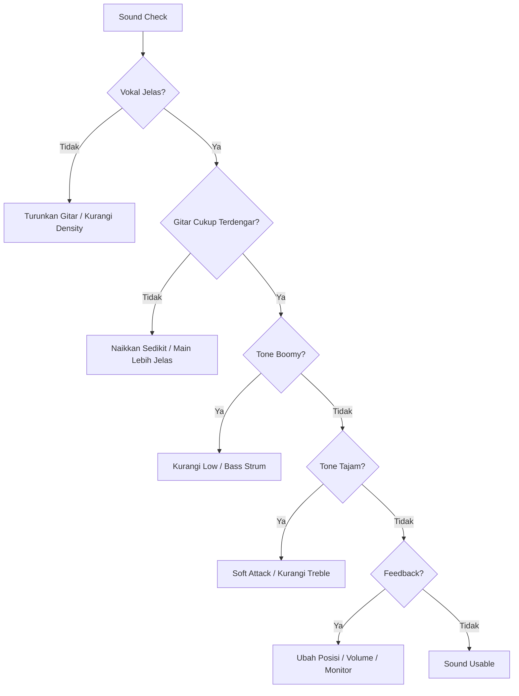
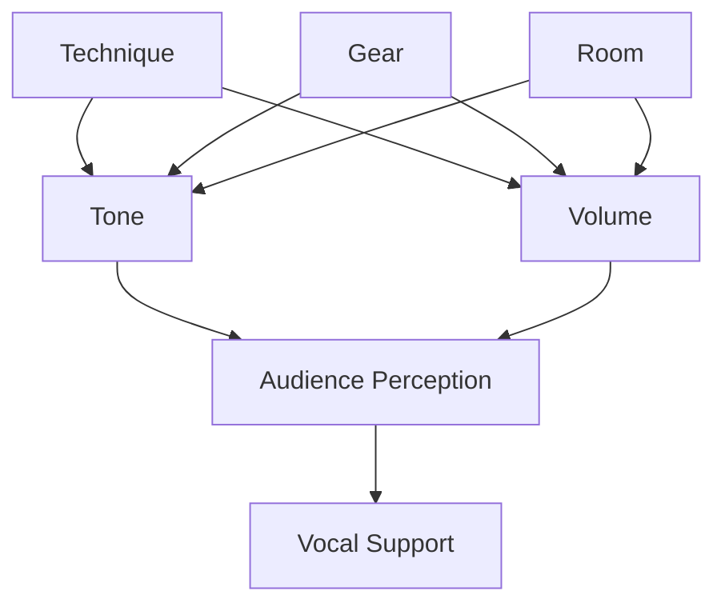

# learn-guitar-accompaniment-part-026.md

# Part 026 — Sound Basics: Tone, Volume, Mic, Pickup, dan Setup Panggung

## Status Seri

Seri: **Belajar Guitar Accompaniment Berdasarkan The First 20 Hours**  
Bagian: **026 dari 035**  
Fokus: memahami dasar sound untuk gitar pengiring vokal: tone, volume, mic, pickup, monitoring, feedback, dan setup panggung sederhana.

Bagian ini bukan audio engineering lengkap. Ini adalah sound basics yang cukup agar iringan gitar tidak merusak vokal saat latihan, rehearsal, atau tampil.

---

## Tujuan Pembelajaran Part Ini

Setelah menyelesaikan part ini, Anda harus bisa:

1. memahami bahwa sound adalah bagian dari performance;
2. mengontrol volume gitar agar tidak menutup vokal;
3. memahami tone dasar gitar akustik;
4. membedakan bermain akustik murni, mic, pickup, dan DI;
5. memahami risiko feedback;
6. menyiapkan setup panggung sederhana;
7. melakukan soundcheck dasar;
8. memahami monitoring;
9. membuat checklist gear sound;
10. menyesuaikan teknik bermain dengan kondisi ruangan.

---

## Prinsip Kaufman yang Dipakai di Part Ini

Dalam *The First 20 Hours*, kita menghilangkan hambatan dan belajar cukup untuk self-correction. Sound adalah area yang sering diabaikan pemula karena dianggap “urusan teknis panggung”.

Padahal, untuk pengiring penyanyi, sound menentukan:

- apakah vokal terdengar;
- apakah gitar terlalu keras;
- apakah chord muddy;
- apakah strumming tajam;
- apakah feedback terjadi;
- apakah penyanyi bisa mendengar gitar;
- apakah audience mendengar balance yang baik.

Target part ini:

> Memahami sound dasar agar gitar mendukung vokal dalam kondisi nyata, bukan hanya terdengar baik dari posisi pemain.

---

# 1. Sound adalah Bagian dari Musik

Tone dan volume bukan detail sekunder. Keduanya memengaruhi emosi lagu.

Gitar yang sama bisa terdengar:

- lembut;
- kasar;
- muddy;
- tipis;
- tajam;
- hangat;
- terlalu keras;
- hilang di mix.

Sebagai pengiring, pertanyaan utama:

```text
Apakah sound gitar membuat vokal lebih baik?
```

Jika tidak, sound perlu diubah.

---

# 2. Tiga Perspektif Sound

Ada tiga perspektif berbeda.

## 2.1 Perspektif Pemain

Apa yang Anda dengar dari posisi memegang gitar.

## 2.2 Perspektif Penyanyi

Apa yang penyanyi dengar saat bernyanyi.

## 2.3 Perspektif Audience

Apa yang audience dengar dari depan.

Masalah:

> Sound dari posisi pemain tidak sama dengan sound dari depan.

Karena itu recording dari depan sangat berguna.



---

# 3. Volume: Masalah Paling Umum

Gitar pengiring sering terlalu keras, terutama saat:

- pemain gugup;
- chorus;
- strumming penuh;
- memakai pick keras;
- ruangan kecil;
- mic/pickup terlalu gain;
- monitor terlalu besar;
- penyanyi bernyanyi lembut.

Checklist:

```text
[ ] Apakah lirik terdengar jelas?
[ ] Apakah penyanyi harus melawan gitar?
[ ] Apakah verse terlalu ramai?
[ ] Apakah chorus masih punya ruang naik?
[ ] Apakah gitar terdengar dominan dari depan?
```

Jika ragu, rekam dari depan.

---

# 4. Mengontrol Volume dengan Teknik

Volume tidak hanya diatur dari knob. Volume terutama dari tangan.

Cara menurunkan volume:

```text
[ ] strum lebih kecil
[ ] kurangi jumlah senar
[ ] kurangi density
[ ] pakai soft attack
[ ] pakai jari bukan pick
[ ] palm mute ringan
[ ] strum lebih dekat neck
[ ] pilih pattern sparse
```

Cara menaikkan volume:

```text
[ ] strum lebih penuh
[ ] tambah density
[ ] accent lebih jelas
[ ] gunakan pick
[ ] strum lebih dekat soundhole
[ ] buka palm mute
```

Jangan hanya mengandalkan sound system.

---

# 5. Tone Dasar Gitar Akustik

Tone dipengaruhi oleh:

- gitar;
- senar;
- pick;
- tangan kanan;
- posisi strum;
- chord voicing;
- capo;
- ruangan;
- mic/pickup;
- EQ.

Untuk pemula, faktor paling mudah dikontrol:

```text
tangan kanan
pick
posisi strum
volume
density
```

---

# 6. Posisi Strum dan Tone

## 6.1 Dekat Soundhole

Biasanya:

- full;
- balanced;
- natural acoustic.

## 6.2 Dekat Bridge

Biasanya:

- lebih bright;
- lebih tajam;
- lebih percussive;
- bisa menusuk jika berlebihan.

## 6.3 Dekat Neck

Biasanya:

- lebih lembut;
- lebih warm;
- attack lebih soft;
- cocok untuk verse lembut.

Latihan:

Mainkan chord G di tiga posisi. Dengarkan perbedaannya.

---

# 7. Pick dan Tone

Pick memengaruhi attack.

## Pick Tipis

Cenderung:

- lebih fleksibel;
- strumming lebih ringan;
- cocok untuk pemula/akustik lembut;
- volume lebih mudah dikontrol.

## Pick Tebal

Cenderung:

- attack lebih kuat;
- cocok untuk picking/lead;
- bisa terlalu keras untuk strumming pemula;
- butuh kontrol lebih baik.

Untuk pengiring awal, pick medium-tipis sering lebih forgiving. Tetapi pilih yang nyaman dan bisa dikontrol.

---

# 8. Bermain dengan Jari vs Pick

## Pick

Kelebihan:

- volume jelas;
- strumming konsisten;
- attack tegas;
- cocok chorus.

Risiko:

- terlalu keras;
- terlalu tajam;
- menutup vokal.

## Jari

Kelebihan:

- lebih lembut;
- cocok verse;
- cocok intimate;
- volume lebih rendah.

Risiko:

- kurang projection;
- tidak cukup kuat di ruangan besar;
- tone kurang konsisten jika belum biasa.

Gunakan sesuai section.

---

# 9. Senar dan Tone

Senar baru biasanya:

- bright;
- jelas;
- sustain baik.

Senar lama biasanya:

- dull;
- kurang sustain;
- tuning kurang stabil;
- terasa kasar.

Namun senar terlalu baru bisa sangat bright dan mudah berubah tuning beberapa saat.

Praktis:

```text
Jangan ganti senar tepat beberapa menit sebelum tampil jika belum stabil.
```

Jika performance penting, ganti beberapa hari sebelumnya dan stretching/tune berkala.

---

# 10. Capo dan Tone

Capo membuat tone lebih tinggi/bright.

Capo tinggi:

- lebih shimmering;
- lebih tipis;
- bisa menonjol di treble;
- bass berkurang.

Jika capo membuat gitar terlalu tajam:

- strum lebih dekat neck;
- kurangi senar treble;
- turunkan attack;
- coba shape lain;
- turunkan volume.

---

# 11. Ruangan dan Sound

Ruangan memengaruhi sound.

## Ruangan Kecil

Risiko:

- gitar terlalu keras;
- bass/mid memantul;
- vokal tertutup;
- strumming terasa kasar.

Solusi:

- main lebih pelan;
- sparse strum;
- jari/pick ringan;
- jangan full chorus terlalu awal.

## Ruangan Besar

Risiko:

- gitar hilang;
- vokal dan gitar tidak seimbang;
- butuh amplification.

Solusi:

- mic/pickup;
- soundcheck;
- monitor;
- dynamics tetap dikontrol.

## Ruangan Bergema

Risiko:

- strumming cepat menjadi blur;
- chord muddy;
- lirik kurang jelas.

Solusi:

- kurangi density;
- strum lebih sparse;
- attack lebih controlled;
- hindari terlalu banyak sustain rendah.

---

# 12. Akustik Murni

Akustik murni berarti tanpa mic/pickup.

Cocok untuk:

- ruangan kecil;
- latihan;
- intimate performance;
- audience dekat.

Kelebihan:

- natural;
- setup sederhana;
- minim feedback.

Kekurangan:

- volume terbatas;
- balance tergantung posisi;
- vokal bisa tertutup jika gitar keras;
- audience jauh mungkin tidak mendengar.

Tips:

- posisikan gitar tidak langsung menutup vokal;
- jangan strum terlalu keras;
- gunakan dynamics alami.

---

# 13. Mic untuk Gitar Akustik

Mic menangkap suara natural gitar.

Kelebihan:

- tone lebih natural;
- cocok recording/live acoustic;
- detail picking bagus.

Kekurangan:

- rentan feedback;
- pemain harus tidak terlalu banyak bergerak;
- placement penting;
- butuh soundcheck.

## Placement Dasar

Hindari mic langsung ke soundhole karena bisa boomy.

Posisi awal yang umum:

```text
arah ke sekitar fret 12
jarak sekitar 15–30 cm
sedikit mengarah ke soundhole
```

Ini bukan aturan mutlak, tetapi starting point yang baik.

---

# 14. Pickup Gitar Akustik

Pickup menangkap sinyal gitar dari dalam/bridge/soundboard.

Kelebihan:

- praktis;
- volume lebih mudah;
- lebih tahan feedback daripada mic;
- cocok panggung.

Kekurangan:

- tone bisa kurang natural;
- piezo bisa terdengar quacky/tajam;
- perlu EQ;
- baterai bisa habis jika aktif.

Jika gitar punya pickup/preamp, cek baterai sebelum tampil.

---

# 15. DI Box Secara Praktis

DI box menghubungkan gitar/pickup ke mixer dengan sinyal yang lebih cocok untuk jarak kabel panjang dan sound system.

Untuk pemula, cukup tahu:

```text
Gitar dengan pickup → kabel → DI / mixer → speaker
```

Jika venue/sound engineer menyediakan DI, ikuti setup mereka.

Jangan terlalu masuk teknis impedance dulu. Fokus pada:

- kabel aman;
- sinyal keluar;
- tidak noise;
- volume cukup;
- tone tidak menusuk.

---

# 16. Mic vs Pickup: Kapan Memilih?

## Pilih Mic Jika

```text
[ ] performance acoustic natural
[ ] ruangan cukup terkendali
[ ] pemain tidak banyak bergerak
[ ] feedback rendah
[ ] ada soundcheck
```

## Pilih Pickup Jika

```text
[ ] panggung lebih ramai
[ ] perlu volume lebih besar
[ ] pemain berdiri/bergerak
[ ] feedback risk tinggi
[ ] setup harus cepat
```

## Kombinasi

Beberapa setup memakai mic + pickup. Ini lebih advanced. Untuk 20 jam pertama, satu sumber suara yang stabil lebih baik.

---

# 17. Feedback

Feedback adalah suara melengking/berdengung yang terjadi ketika suara dari speaker masuk lagi ke mic/pickup dan berputar.

Penyebab:

- volume terlalu tinggi;
- mic terlalu dekat speaker;
- gitar menghadap speaker;
- monitor terlalu keras;
- ruangan resonan;
- EQ frequency tertentu terlalu tinggi;
- soundhole gitar menangkap low feedback.

Prevention:

```text
[ ] jangan menghadap speaker
[ ] volume secukupnya
[ ] posisi mic tepat
[ ] monitor tidak berlebihan
[ ] kurangi low/mid jika boomy
[ ] gunakan pickup jika mic feedback
```

Jika feedback terjadi:

- kurangi volume;
- ubah posisi;
- jauhkan dari speaker;
- mute senar;
- beri sinyal ke sound engineer.

---

# 18. EQ Dasar

EQ mengatur frekuensi.

Untuk pemula, cukup pahami:

## Low

Area bass.

Terlalu banyak:

- boomy;
- muddy;
- menutup vokal.

Terlalu sedikit:

- gitar tipis.

## Mid

Area body dan presence.

Terlalu banyak:

- boxy;
- menabrak vokal.

Terlalu sedikit:

- gitar hilang.

## High/Treble

Area brightness.

Terlalu banyak:

- tajam;
- pick attack menusuk.

Terlalu sedikit:

- dull;
- tidak jelas.

Jika tidak yakin, mulai dari EQ flat dan ubah sedikit.

---

# 19. Common EQ Problems

## 19.1 Gitar Boomy

Gejala:

- bass terlalu besar;
- chord muddy;
- vokal tertutup.

Fix:

- kurangi low;
- jangan mic ke soundhole;
- strum lebih ringan di bass;
- palm mute controlled.

## 19.2 Gitar Tajam

Gejala:

- pick attack menusuk;
- high terlalu kuat;
- capo tinggi terlalu bright.

Fix:

- kurangi treble;
- strum dekat neck;
- pick lebih ringan;
- soft attack.

## 19.3 Gitar Hilang

Gejala:

- tidak terdengar di mix;
- hanya vokal terdengar;
- chord tidak jelas.

Fix:

- naikkan volume sedikit;
- tambah mid/presence;
- strum lebih jelas;
- jangan terlalu sparse jika chorus.

---

# 20. Monitoring

Monitor adalah suara yang didengar performer di panggung.

Penyanyi perlu mendengar:

- dirinya sendiri;
- gitar cukup untuk pitch/rhythm.

Gitaris perlu mendengar:

- vokal;
- gitar sendiri secukupnya;
- tempo/pulse.

Jika monitor buruk:

- jangan panik;
- main lebih sederhana;
- fokus visual cue;
- gunakan internal pulse;
- jangan menaikkan volume gitar berlebihan.

---

# 21. Balance Gitar dan Vokal

Dalam gitar-vokal, vokal biasanya harus berada di depan.

Balance ideal:

```text
Vokal jelas dan utama.
Gitar mendukung, tidak menutup.
Chord dan rhythm terdengar cukup.
```

Jika gitar terlalu depan:

- lirik hilang;
- penyanyi memaksa;
- lagu terasa instrumental.

Jika gitar terlalu belakang:

- penyanyi kehilangan support;
- chord tidak terasa;
- tempo tidak jelas.

Soundcheck harus mencari balance ini.

---

# 22. Soundcheck Dasar

Urutan soundcheck sederhana:

```text
1. Tune gitar.
2. Cek input gitar.
3. Mainkan verse pattern.
4. Mainkan chorus pattern.
5. Penyanyi nyanyi verse.
6. Penyanyi nyanyi chorus.
7. Dengarkan balance.
8. Cek feedback.
9. Cek monitor.
10. Cek ending/stop.
```

Jangan hanya strum keras satu chord. Soundcheck harus mencakup verse dan chorus karena volume berbeda.

---

# 23. Apa yang Dimainkan Saat Soundcheck?

Mainkan bagian nyata dari lagu:

```text
verse sparse
chorus full
fingerpicking jika ada
final strum
```

Jika Anda hanya memainkan chord G keras, sound engineer tidak tahu dynamics sebenarnya.

---

# 24. Komunikasi dengan Sound Engineer

Gunakan bahasa sederhana:

```text
Gitar terlalu keras di monitor saya.
Vokal kurang terdengar di monitor.
Gitar terdengar terlalu tajam.
Gitar terlalu boomy.
Bisa turunkan gitar sedikit di front?
Bisa naikkan vokal di monitor?
```

Jangan memberi instruksi teknis berlebihan jika tidak paham. Jelaskan masalah yang didengar.

---

# 25. Setup Panggung Sederhana

## Format Akustik Tanpa Sound System

```text
Penyanyi di depan/samping gitaris
Gitar tidak menutup arah vokal
Jarak cukup agar balance natural
```

## Format Mic Vokal + Gitar Pickup

```text
Vocal mic → mixer
Guitar pickup → DI/mixer
Mixer → speaker
Monitor optional
```

## Format Mic Vokal + Mic Gitar

```text
Vocal mic
Guitar mic near fret 12
Pemain jangan terlalu banyak bergerak
Speaker tidak mengarah ke mic
```

---

# 26. Posisi Panggung

Hindari:

- gitar langsung menghadap speaker;
- mic gitar terlalu dekat soundhole;
- berdiri terlalu jauh dari mic jika mic gitar;
- kabel berantakan;
- capo/pick tidak terjangkau;
- chord sheet menghalangi komunikasi dengan penyanyi.

Posisi baik:

- penyanyi dan gitaris bisa eye contact;
- gitaris bisa melihat chord sheet tanpa menunduk terus;
- kabel aman;
- monitor/speaker tidak menyebabkan feedback;
- audience melihat interaksi.

---

# 27. Kabel dan Noise

Jika amplified, masalah kabel bisa merusak performance.

Checklist:

```text
[ ] kabel tidak rusak
[ ] jack masuk penuh
[ ] tidak crackle saat bergerak
[ ] kabel tidak tertarik
[ ] ada backup jika memungkinkan
[ ] kabel tidak membuat orang tersandung
```

Jika noise muncul:

- cek kabel;
- cek jack gitar;
- cek battery preamp;
- cek gain;
- cek apakah kabel dekat sumber noise.

---

# 28. Battery Pickup/Preamp

Jika gitar acoustic-electric memakai preamp aktif, biasanya butuh baterai.

Checklist:

```text
[ ] baterai cukup
[ ] bawa baterai cadangan
[ ] cabut kabel setelah selesai agar baterai tidak terkuras
[ ] cek sebelum tampil
```

Baterai habis adalah P0 gear risk.

---

# 29. Gain vs Volume

Secara praktis:

- gain/input terlalu tinggi bisa membuat suara pecah/clip;
- volume/output menentukan seberapa keras keluar.

Jika suara gitar pecah:

- jangan hanya turunkan tangan;
- cek gain/input;
- turunkan preamp jika perlu.

Untuk pemula, minta bantuan sound engineer jika tersedia.

---

# 30. Playing Technique Saat Amplified

Saat gitar diperkuat, permainan kecil terdengar lebih jelas.

Artinya:

- buzzing terdengar;
- pick noise terdengar;
- strumming kasar terdengar;
- muting buruk terdengar;
- dinamika lebih nyata.

Jangan bermain lebih keras hanya karena ada sound system. Justru sering perlu bermain lebih controlled.

---

# 31. Fingerpicking Saat Amplified

Fingerpicking bisa hilang jika volume terlalu kecil atau EQ kurang.

Tips:

- soundcheck fingerpicking;
- jangan hanya soundcheck strumming;
- pastikan bass tidak terlalu besar;
- treble cukup jelas tapi tidak tajam;
- jaga pattern stabil.

Jika fingerpicking terlalu pelan dibanding chorus strumming, perlu control atau sound adjustment.

---

# 32. Strumming Saat Amplified

Strumming penuh bisa sangat keras lewat pickup/mic.

Tips:

- chorus jangan overhit;
- gunakan dynamics tangan;
- kurangi bass jika boomy;
- hati-hati pick attack;
- dengarkan vokal.

Amplified setup memperbesar kesalahan dynamics.

---

# 33. Tone untuk Verse vs Chorus

Sound tidak hanya static. Anda bisa mengatur tone lewat teknik.

## Verse

- strum dekat neck;
- soft attack;
- sparse;
- jari/fingerpicking;
- bass ringan.

## Chorus

- strum dekat soundhole;
- lebih penuh;
- accent jelas;
- density naik;
- tetap tidak menutup vokal.

---

# 34. Recording sebagai Soundcheck Mandiri

Jika tidak ada sound engineer, gunakan HP.

Langkah:

1. taruh HP di depan posisi audience;
2. mainkan verse + chorus;
3. dengarkan;
4. cek balance;
5. ubah posisi/volume/technique;
6. rekam lagi.

Ini sederhana tetapi sangat efektif.

---

# 35. Sound dan Arrangement

Arrangement harus disesuaikan dengan sound.

Jika ruangan kecil:

- arrangement lebih sparse;
- chorus tidak perlu terlalu full;
- fingerpicking bisa cukup terdengar.

Jika ruangan besar:

- strumming perlu lebih jelas;
- pickup/mic perlu;
- dynamics tetap dijaga.

Jika ruangan bergema:

- kurangi density;
- jangan terlalu banyak open sustain rendah.

---

# 36. Sound dan Penyanyi

Selalu tanya penyanyi:

```text
Apakah gitar terlalu keras?
Apakah kamu bisa dengar gitar cukup?
Apakah monitor membantu?
Apakah key terasa jelas?
Apakah strumming mengganggu phrasing?
```

Penyanyi yang tidak bisa mendengar gitar bisa kesulitan pitch/tempo. Penyanyi yang terlalu banyak mendengar gitar bisa terdorong bernyanyi keras.

---

# 37. Minimal Gear Setup untuk 20 Jam Pertama

Untuk latihan dan performance sederhana:

```text
gitar akustik yang layak
tuner
capo
pick beberapa ukuran
strap jika berdiri
HP untuk recording
chord/arrangement sheet
```

Jika amplified:

```text
kabel
pickup atau mic
DI/mixer jika tersedia
battery cadangan jika pickup aktif
```

Jangan gear menjadi alasan tidak latihan. Gear minimal cukup untuk mulai.

---

# 38. Gear Upgrade Priority

Jika ingin upgrade, urutan praktis:

```text
1. gitar playable/setup nyaman
2. tuner yang reliable
3. capo yang tidak membuat tuning kacau
4. pick yang nyaman
5. strap
6. pickup/mic jika sering tampil amplified
7. DI/preamp jika kebutuhan panggung meningkat
```

Jangan beli gear mahal sebelum bisa tune, rhythm stabil, dan mengiringi vokal.

---

# 39. Sound Risk Assessment

Klasifikasikan risiko.

## P0

```text
[ ] pickup tidak berbunyi
[ ] baterai habis
[ ] gitar tidak bisa tune
[ ] capo membuat buzzing parah
[ ] tidak ada cara memperkuat suara di ruangan besar
```

## P1

```text
[ ] feedback mungkin terjadi
[ ] gitar terlalu keras
[ ] monitor tidak pasti
[ ] tone terlalu tajam
[ ] kabel hanya satu
```

## P2

```text
[ ] tone belum ideal
[ ] pick noise sedikit
[ ] EQ belum sempurna
```

P0 harus ditangani sebelum tampil.

---

# 40. Soundcheck Checklist

```text
## Guitar
[ ] tuned
[ ] capo checked
[ ] pickup/mic signal
[ ] verse volume
[ ] chorus volume
[ ] fingerpicking level
[ ] no feedback
[ ] tone not too boomy
[ ] tone not too sharp

## Vocal
[ ] vocal clear
[ ] guitar not covering vocal
[ ] singer hears guitar
[ ] guitarist hears vocal

## Stage
[ ] cables safe
[ ] pick/capo reachable
[ ] sheet visible
[ ] eye contact possible
```

---

# 41. Emergency Sound Fixes

## Gitar terlalu keras

```text
main lebih pelan
kurangi density
turunkan volume
strum lebih dekat neck
```

## Gitar terlalu kecil

```text
main lebih jelas
naikkan volume sedikit
gunakan pick
minta naik di mixer
```

## Gitar boomy

```text
kurangi bass
hindari soundhole mic
strum bass lebih ringan
```

## Gitar tajam

```text
kurangi treble
soft attack
pick lebih ringan
strum dekat neck
```

## Feedback

```text
kurangi volume
ubah posisi
jauh dari speaker
mute senar
minta EQ/monitor adjustment
```

---

# 42. Latihan Sound Awareness 45 Menit

## Block 1 — Tone Position, 8 Menit

Mainkan chord G:

- dekat bridge;
- soundhole;
- dekat neck.

Catat tone.

## Block 2 — Pick vs Finger, 8 Menit

Mainkan verse pattern dengan pick dan jari.

Bandingkan.

## Block 3 — Volume Ladder, 8 Menit

Mainkan level 1–4.

Rekam.

## Block 4 — Verse/Chorus Sound, 10 Menit

Rekam:

- verse sparse;
- chorus full.

Dengarkan balance.

## Block 5 — Front Recording, 8 Menit

Letakkan HP di depan seperti audience.

Mainkan lagu target.

## Block 6 — Notes, 3 Menit

Catat sound fix.

---

# 43. Latihan 15 Menit

```text
3 menit  strum dekat bridge/soundhole/neck
3 menit  pick vs finger
4 menit  verse sparse recording
4 menit  chorus full recording
1 menit  catat balance
```

Jika hanya 5 menit:

```text
2 menit  tone position test
2 menit  volume control
1 menit  note
```

---

# 44. Mini Project Part Ini

Buat sound plan untuk satu lagu target.

```text
Title:
Context:
Acoustic or amplified:
Guitar source: mic/pickup/acoustic
Capo:
Verse tone:
Chorus tone:
Finger/pick:
Volume risk:
Feedback risk:
Gear checklist:
Soundcheck notes:
Emergency fix:
```

Lalu rekam dari posisi audience.

Target:

> Anda tahu apakah sound gitar mendukung vokal dari depan, bukan hanya dari posisi pemain.

---

# 45. Kesalahan Engineer-Minded dalam Sound

## 45.1 Menganggap Sound Hanya Urusan Gear

Tangan kanan, dynamics, dan arrangement sering lebih penting daripada gear.

## 45.2 Mengejar Tone Ideal Sebelum Skill Stabil

Tone bagus tidak menyelamatkan rhythm yang runtuh.

## 45.3 Over-EQ

Jika tidak paham, perubahan kecil lebih aman. Mulai dari flat.

## 45.4 Tidak Mendengar dari Depan

Posisi pemain menipu. Rekam dari audience.

## 45.5 Mengabaikan Vokal

Tone gitar bagus sendirian bisa buruk jika menutup vokal.

---

# 46. Debugging Matrix Sound

| Symptom | Kemungkinan Penyebab | Fix |
|---|---|---|
| Vokal tertutup | gitar terlalu keras/dense | kurangi volume/density |
| Gitar boomy | low terlalu banyak/mic soundhole | kurangi bass/ubah mic |
| Gitar tajam | treble/pick attack/capo tinggi | soft attack/kurangi treble |
| Feedback | volume/position/monitor | ubah posisi, turunkan volume |
| Fingerpicking hilang | level terlalu kecil | soundcheck picking |
| Chorus terlalu keras | strum overhit | kontrol tangan |
| Gitar pecah | gain terlalu tinggi | turunkan input/preamp |
| Penyanyi tidak dengar gitar | monitor/balance kurang | naikkan monitor/gitar sedikit |

---

# 47. Sound Decision Tree



---

# 48. Acceptance Criteria Part 026

Anda boleh lanjut ke part 027 jika:

```text
[ ] Bisa menjelaskan kenapa sound penting untuk pengiring
[ ] Bisa mengontrol volume dengan tangan kanan
[ ] Bisa membedakan tone dekat bridge/soundhole/neck
[ ] Bisa menjelaskan mic vs pickup secara praktis
[ ] Bisa menjelaskan feedback secara sederhana
[ ] Bisa menjalankan soundcheck dasar
[ ] Bisa mengecek balance gitar-vokal
[ ] Bisa membuat gear checklist
[ ] Bisa merekam dari posisi audience
[ ] Bisa membuat sound plan untuk satu lagu
```

---

# 49. Ringkasan Mental Model

Sound adalah interface antara permainan Anda dan telinga penyanyi/audience.



Sound yang baik bukan sound gitar paling indah sendirian. Sound yang baik adalah sound yang membuat lagu dan vokal terdengar lebih baik.

---

# 50. Output Part Ini

Output konkret:

1. Anda memahami volume dan tone dasar.
2. Anda tahu mic vs pickup.
3. Anda tahu risiko feedback.
4. Anda bisa melakukan soundcheck sederhana.
5. Anda bisa membuat gear/sound checklist.
6. Anda siap masuk ke genre companion dan pola iringan per genre.

Part berikutnya:

> **Genre Companion: Pola Iringan Pop, Ballad, Folk, Worship, Rock Acoustic.**

