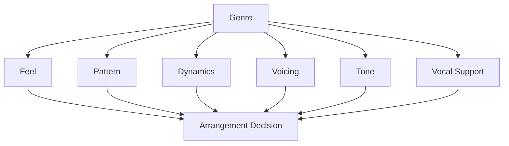
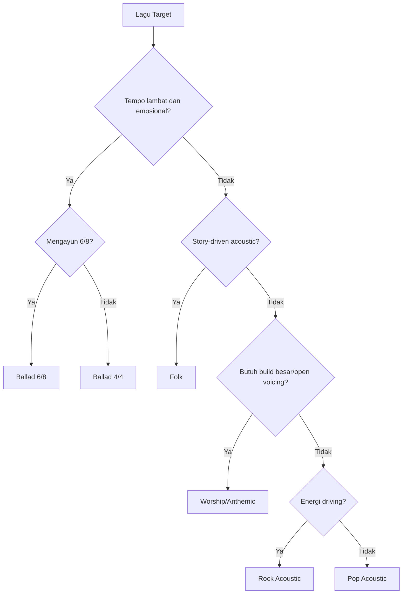
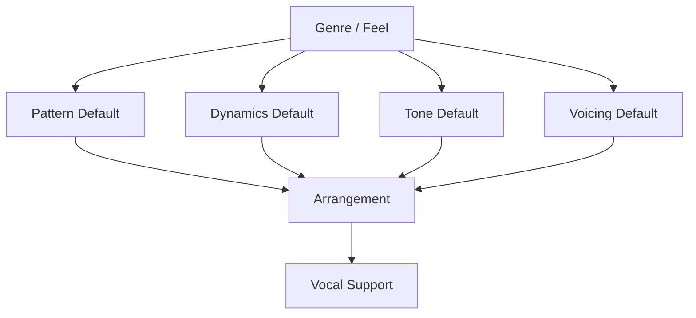

# learn-guitar-accompaniment-part-027.md

# Part 027 — Genre Companion: Pola Iringan Pop, Ballad, Folk, Worship, Rock Acoustic

## Status Seri

Seri: **Belajar Guitar Accompaniment Berdasarkan The First 20 Hours**  
Bagian: **027 dari 035**  
Fokus: memahami pola iringan per genre secara praktis agar gitar pengiring bisa memilih feel, strumming, dynamics, dan texture yang cocok dengan lagu dan penyanyi.

Part sebelumnya membahas sound basics. Sekarang kita masuk ke konteks musikal: genre. Genre bukan kotak kaku, tetapi kumpulan kebiasaan musikal yang membantu Anda membuat keputusan cepat.

---

## Tujuan Pembelajaran Part Ini

Setelah menyelesaikan part ini, Anda harus bisa:

1. memahami genre sebagai kumpulan constraint dan expectation;
2. memilih pattern dasar untuk pop acoustic;
3. memilih pattern dan dynamics untuk ballad;
4. memilih bass-strum/fingerpicking untuk folk;
5. memilih build dan voicing untuk worship/congregational style;
6. memilih strumming yang lebih driving untuk rock acoustic;
7. menyesuaikan iringan dengan vokal, bukan hanya genre;
8. mengenali kapan genre asli perlu disederhanakan;
9. membuat genre map untuk lagu target;
10. menghindari kesalahan “semua lagu dimainkan dengan pattern yang sama”.

---

## Prinsip Kaufman yang Dipakai di Part Ini

Dalam *The First 20 Hours*, kita tidak perlu menguasai semua style secara mendalam. Kita butuh “starter kit” yang cukup untuk performa awal.

Genre companion ini bukan buku genre lengkap. Ini adalah peta praktis untuk menjawab:

```text
Lagu ini terasa seperti apa?
Pattern apa yang aman?
Dinamika bagaimana?
Texture apa yang cocok?
Apa yang harus dihindari?
```

Targetnya:

> Bisa memilih pendekatan iringan yang cukup cocok untuk genre umum, tanpa harus menjadi specialist genre tersebut.

---

# 1. Genre sebagai Constraint System

Genre bukan label dekoratif. Genre memengaruhi:

- tempo;
- feel;
- accent;
- chord vocabulary;
- dynamics;
- density;
- tone;
- vocal phrasing;
- audience expectation;
- intro/ending style;
- performance energy.



Namun genre bukan aturan absolut. Lagu pop bisa dibuat ballad. Lagu rock bisa dibuat acoustic intimate. Lagu worship bisa dibuat folk. Yang penting adalah fungsi musikalnya.

---

# 2. Genre vs Arrangement

Genre asli lagu tidak selalu sama dengan arrangement Anda.

Contoh:

```text
Original: full band pop rock
Arrangement: acoustic ballad
```

Atau:

```text
Original: worship band besar
Arrangement: gitar tunggal + vokal
```

Maka keputusan Anda harus mempertimbangkan:

```text
Original genre
Performance format
Skill level
Singer character
Audience context
Available sound setup
```

Jangan meniru versi asli secara literal jika formatnya berbeda.

---

# 3. Genre Starter Matrix

| Genre / Feel | Rhythm Base | Texture | Dynamics | Risiko Utama |
|---|---|---|---|---|
| Pop Acoustic | 4/4, 8th note | strumming medium | verse lebih ringan, chorus naik | terlalu monoton |
| Ballad | 4/4 lambat atau 6/8 | sparse strum / picking | sangat penting | terlalu ramai |
| Folk | steady pulse | bass-strum / fingerpicking | natural, story-driven | terlalu kaku |
| Worship / Congregational | build gradual | open voicing, strum | arc besar | terlalu penuh dari awal |
| Rock Acoustic | driving 4/4 | strong strum | energy forward | terlalu keras menutup vokal |

Matrix ini hanya starting point.

---

# 4. Pop Acoustic

Pop acoustic adalah area paling umum untuk gitar pengiring.

## 4.1 Ciri Umum

- 4/4;
- tempo medium atau medium-slow;
- chord progression berulang;
- verse lebih ringan;
- chorus lebih penuh;
- strumming 8th-note based;
- vocal hook jelas;
- arrangement harus memberi ruang lirik.

## 4.2 Progression Umum

```text
I - V - vi - IV
vi - IV - I - V
I - vi - IV - V
I - IV - V
```

Contoh shape:

```text
G - D - Em - C
C - G - Am - F
Em - C - G - D
```

## 4.3 Pattern Aman

### Verse Light

```text
1 & 2 & 3 & 4 &
D - - U D - - U
```

### Chorus Pop

```text
1 & 2 & 3 & 4 &
D - D U - U D U
```

### Driving Chorus

```text
1 & 2 & 3 & 4 &
D U D U D U D U
```

dengan accent ringan.

## 4.4 Dynamics

```text
Intro      : 30–40%
Verse      : 40–50%
Pre-Chorus : 60–70%
Chorus     : 75–85%
Bridge     : 40% atau 70%
Final      : 85–90%
```

## 4.5 Voicing

Pop acoustic cocok dengan:

```text
G 320033
Cadd9
Em7
Dsus4 ornament
Fmaj7 untuk F simplified
Am7 untuk verse lembut
```

Namun jangan over-color.

## 4.6 Anti-Pattern

```text
[ ] memakai D-D-U-U-D-U keras dari awal sampai akhir
[ ] chorus tidak naik
[ ] verse terlalu ramai
[ ] tidak ada intro cue
[ ] terlalu banyak Cadd9/Em7 sampai chord kurang tegas
```

---

# 5. Pop Acoustic Arrangement Template

```text
Intro:
Progression utama x1, light strum atau picking.

Verse:
Sparse strum, vocal clear.

Pre-Chorus:
Tambah density dan volume bertahap.

Chorus:
Pattern pop penuh, accent jelas tapi tidak menutup vokal.

Verse 2:
Sedikit lebih penuh dari verse 1.

Bridge:
Turun ke picking/palm mute atau naik sesuai lagu.

Final Chorus:
Fullest, tetapi tetap controlled.

Outro:
Final chord sustain atau repeat last progression.
```

Mermaid:


---

# 6. Ballad

Ballad adalah genre/feel yang sangat menuntut kontrol dinamika dan ruang.

## 6.1 Ciri Umum

- tempo lambat;
- lirik emosional;
- vocal phrase panjang;
- dynamics sangat penting;
- sering 4/4 lambat atau 6/8;
- terlalu banyak strumming bisa merusak;
- chord sustain dan silence penting.

## 6.2 Pattern Ballad 4/4

### Sparse Verse

```text
1 & 2 & 3 & 4 &
D - - U D - - U
```

### Soft Ballad

```text
1 & 2 & 3 & 4 &
D - D U D - D U
```

### Bass-Treble

```text
1 2 3 4
B T B T
```

## 6.3 Pattern Ballad 6/8

```text
1 2 3 4 5 6
D - U D - U
```

atau fingerpicking:

```text
P i m a m i
```

Accent:

```text
1 and 4
```

## 6.4 Texture

Ballad cocok dengan:

- fingerpicking;
- sparse strum;
- chord sustain;
- Fmaj7;
- Am7;
- Cadd9;
- Em7;
- soft attack;
- strum dekat neck;
- palm mute sangat ringan.

## 6.5 Dynamics

Ballad biasanya lebih gradual.

```text
Intro       : sangat lembut
Verse 1     : lembut
Verse 2     : sedikit naik
Pre-Chorus  : build
Chorus      : terbuka
Bridge      : turun atau klimaks emosional
Final Chorus: puncak
Outro       : turun / resolve
```

## 6.6 Anti-Pattern

```text
[ ] strumming terlalu keras
[ ] terlalu banyak upstroke tajam
[ ] tidak memberi ruang napas
[ ] tempo tidak stabil karena terlalu lambat
[ ] fingerpicking terlalu rumit
[ ] terlalu banyak ornament di bawah vokal
```

---

# 7. Ballad Arrangement Template

```text
Intro:
Fingerpicking atau single strum.

Verse 1:
P-i-m-i atau sparse strum.

Verse 2:
Tambah sedikit density.

Pre-Chorus:
Build dengan volume/density.

Chorus:
Strum lebih penuh, tetapi jangan kasar.

Bridge:
Turun drastis atau naik dramatis, tergantung lirik.

Final Chorus:
Puncak emosional.

Outro:
Final chord sustain, mungkin ritardando ringan.
```

Rule:

> Ballad butuh napas. Jangan takut diam.

---

# 8. Folk

Folk sering berpusat pada cerita, rhythm yang stabil, dan acoustic naturalness.

## 8.1 Ciri Umum

- chord sederhana;
- story-driven lyrics;
- steady pulse;
- bass-strum atau fingerpicking;
- vocal clarity penting;
- tidak terlalu polished berlebihan;
- natural dynamics.

## 8.2 Pattern Folk Bass-Strum

```text
1 2 3 4
B D B D
```

B = bass  
D = strum treble/light chord

## 8.3 Pattern Folk Strum

```text
1 & 2 & 3 & 4 &
D - D U D - D U
```

atau:

```text
D - D - D U D U
```

tergantung feel.

## 8.4 Fingerpicking Folk

```text
P i m i
```

atau simplified Travis-inspired:

```text
P i P m P i P m
```

## 8.5 Dynamics

Folk tidak selalu butuh chorus besar. Kadang yang penting adalah:

- cerita jelas;
- groove steady;
- phrasing natural;
- chord tidak menutup lirik;
- ending sederhana.

## 8.6 Tone

Folk cocok dengan tone:

- warm;
- natural;
- tidak terlalu bright;
- bass cukup jelas;
- attack tidak terlalu tajam.

## 8.7 Anti-Pattern

```text
[ ] strumming terlalu pop sehingga cerita hilang
[ ] terlalu banyak sus/add9 modern jika lagu butuh earthy
[ ] tempo terlalu rigid sampai vocal story terasa kaku
[ ] bass terlalu keras dan muddy
```

---

# 9. Folk Arrangement Template

```text
Intro:
Bass-strum progression x1 atau picking.

Verse:
Bass-strum ringan, vocal story clear.

Chorus/Refrain:
Tambah sedikit volume/density.

Verse berikut:
Variasi kecil, bukan perubahan besar.

Bridge:
Jika ada, beri kontras minimal.

Outro:
Repeat last line atau final chord sustain.
```

Folk sering lebih efektif jika sederhana dan jujur.

---

# 10. Worship / Congregational Style

Catatan: istilah “worship” di sini dipakai secara musikal untuk lagu ibadah/pujian modern atau congregational song dalam konteks umum. Fokusnya adalah pola iringan, bukan aspek teologis.

## 10.1 Ciri Umum

- progression berulang;
- build gradual;
- open voicing;
- chorus/refrain mudah dinyanyikan bersama;
- dynamics arc besar;
- sering memakai G shape, Cadd9, Em7, Dsus4;
- bridge bisa repetitif dan membangun;
- key harus nyaman untuk banyak orang jika congregational.

## 10.2 Pattern Umum

### Soft Verse

```text
D - - U D - - U
```

### Medium Build

```text
D - D U D - D U
```

### Full Chorus

```text
D - D U - U D U
```

### Big Build

```text
D U D U D U D U
```

dengan accent controlled.

## 10.3 Voicing

Sering cocok:

```text
G 320033
Cadd9
Em7
Dsus4
Asus4
D/F# jika stabil
```

Open voicing memberi rasa luas.

## 10.4 Dynamics Arc

```text
Intro soft
Verse soft
Chorus medium
Verse 2 medium
Chorus bigger
Bridge build
Final chorus biggest
Outro release
```

## 10.5 Congregational Consideration

Jika orang lain ikut bernyanyi:

- key jangan terlalu tinggi;
- tempo harus stabil;
- intro harus jelas;
- chorus harus mudah diikuti;
- jangan terlalu banyak rubato;
- ending harus jelas.

## 10.6 Anti-Pattern

```text
[ ] mulai terlalu besar dari intro
[ ] build terlalu cepat sehingga final chorus tidak punya ruang
[ ] key terlalu tinggi untuk banyak orang
[ ] terlalu banyak ornament sehingga jemaat/penyanyi bingung
[ ] bridge repetisi tanpa dynamic planning
```

---

# 11. Worship / Congregational Arrangement Template

```text
Intro:
Open voicing, light strum/picking.

Verse:
Sparse, memberi ruang.

Chorus 1:
Medium, jangan full power.

Verse 2:
Sedikit naik.

Chorus 2:
Lebih penuh.

Bridge:
Build bertahap per repetisi.

Final Chorus:
Puncak.

Outro:
Turun atau final sustain.
```

Build harus direncanakan. Jangan full dari awal.

---

# 12. Rock Acoustic

Rock acoustic adalah adaptasi lagu rock atau pop-rock ke gitar akustik.

## 12.1 Ciri Umum

- energy forward;
- strumming lebih kuat;
- accent jelas;
- chord lebih tegas;
- palm mute bisa berguna;
- chorus driving;
- vocal harus tetap tidak tertutup.

## 12.2 Pattern Driving 4/4

```text
1 & 2 & 3 & 4 &
D U D U D U D U
```

Accent:

```text
2 and 4
```

atau downbeat kuat:

```text
1 and 3
```

## 12.3 Pattern Rock Acoustic Controlled

```text
D - D U D U D U
```

atau:

```text
D D U D D U
```

tergantung feel, tetapi selalu jaga pulse.

## 12.4 Palm Mute

Verse rock acoustic sering bagus dengan palm mute:

```text
downstroke muted
```

Lalu chorus dibuka.

## 12.5 Chord

Rock acoustic sering lebih cocok dengan chord tegas:

```text
G
D
Em
C
A
E
power-chord-ish approach nanti
```

Terlalu banyak maj7/add9 bisa mengurangi ketegasan jika lagu butuh drive.

## 12.6 Anti-Pattern

```text
[ ] strumming terlalu keras menutup vokal
[ ] tempo naik karena energi
[ ] chorus overhit sampai sound pecah
[ ] verse tidak punya kontrol
[ ] acoustic version mencoba meniru distorsi dengan memukul senar
```

---

# 13. Rock Acoustic Arrangement Template

```text
Intro:
Chord progression kuat atau muted groove.

Verse:
Palm mute / lower density.

Pre-Chorus:
Build.

Chorus:
Open strum, driving rhythm.

Verse 2:
Medium, tidak kembali terlalu kecil jika lagu sudah naik.

Bridge:
Drop atau build.

Final Chorus:
Full but controlled.

Outro:
Stop ending atau final chord.
```

Rule:

> Energi rock datang dari pulse dan accent, bukan hanya volume keras.

---

# 14. Genre Hybrid

Banyak lagu tidak murni satu genre.

Contoh:

```text
Pop ballad
Folk pop
Worship ballad
Rock ballad
Acoustic pop-rock
Indie folk
```

Cara memilih:

1. tentukan vocal mood;
2. tentukan meter/feel;
3. tentukan energy arc;
4. pilih texture;
5. pilih pattern paling sederhana yang cocok;
6. uji dengan vokal.

Jangan terlalu memikirkan label. Dengarkan kebutuhan lagu.

---

# 15. Genre Decision Tree



---

# 16. Pattern Decision Matrix

| Kondisi Lagu | Pattern Awal |
|---|---|
| Pop medium | D - D U - U D U |
| Pop verse ringan | D - - U D - - U |
| Ballad 4/4 | D - D U D - D U |
| Ballad 6/8 | D - U D - U / P-i-m-a-m-i |
| Folk story | B-D-B-D / P-i-m-i |
| Worship verse | open voicing sparse |
| Worship build | D-DU-D-DU naik bertahap |
| Rock acoustic verse | palm mute downstroke |
| Rock acoustic chorus | D-U-D-U with accent |
| Lirik sangat padat | sparse / sustain |
| Vokal tinggi | support stabil, jangan overhit |

---

# 17. Tone per Genre

## Pop Acoustic

- balanced;
- bright secukupnya;
- strum clean;
- tidak muddy.

## Ballad

- warm;
- soft attack;
- sustain;
- fingerpicking/pick ringan.

## Folk

- natural;
- bass jelas tapi tidak boomy;
- rhythm steady.

## Worship

- open;
- spacious;
- build gradually;
- bright tetapi tidak tajam.

## Rock Acoustic

- percussive;
- controlled attack;
- mid presence;
- tidak pecah.

---

# 18. Dynamics per Genre

| Genre | Dynamics Strategy |
|---|---|
| Pop Acoustic | verse turun, chorus naik jelas |
| Ballad | gradual, banyak ruang |
| Folk | natural, story-first |
| Worship | long build, final peak |
| Rock Acoustic | controlled energy, strong chorus |

Semua genre tetap harus mendukung vokal.

---

# 19. Genre dan Vokal

Genre tidak boleh mengalahkan vokal.

Jika genre rock tetapi penyanyi lembut, jangan memaksa strumming kasar.

Jika genre ballad tetapi penyanyi butuh dorongan, chorus harus cukup support.

Jika worship/congregational tetapi key terlalu tinggi, turunkan.

Jika folk tetapi lirik tidak terdengar, kurangi bass/strum.

Prinsip:

> Genre memberi arah. Vokal memberi keputusan akhir.

---

# 20. Genre dan Skill Constraint

Pilih versi genre yang sesuai kemampuan.

Jika belum bisa fingerpicking kompleks:

```text
ballad pakai sparse strum
```

Jika belum bisa palm mute stabil:

```text
rock acoustic pakai downstroke controlled
```

Jika belum bisa D/F#:

```text
worship progression simplify ke D
```

Jika belum bisa 6/8:

```text
pilih lagu ballad 4/4 dulu atau latihan 6/8 sangat lambat
```

Stabilitas lebih penting daripada authenticity detail.

---

# 21. Genre Simplification

## Pop

Simplify:

```text
pattern lebih sederhana
intro progression
ending final chord
```

## Ballad

Simplify:

```text
single strum per bar
P-i-m-i picking
hindari ornament
```

## Folk

Simplify:

```text
B-D-B-D
```

## Worship

Simplify:

```text
open chords, build sederhana, bridge tidak terlalu banyak variasi
```

## Rock Acoustic

Simplify:

```text
palm mute sederhana, chorus open downstroke
```

---

# 22. Genre-Specific Bugs

## Pop Acoustic Bugs

- semua section sama;
- pattern terlalu generic;
- chorus kurang lift.

## Ballad Bugs

- terlalu ramai;
- tempo goyah;
- tidak memberi napas.

## Folk Bugs

- story tertutup;
- bass terlalu boomy;
- terlalu polished/kaku.

## Worship Bugs

- build terlalu cepat;
- key terlalu tinggi;
- final chorus tidak punya puncak.

## Rock Acoustic Bugs

- terlalu keras;
- tempo naik;
- attack kasar.

---

# 23. Genre Debugging Matrix

| Symptom | Genre Context | Fix |
|---|---|---|
| Verse terlalu ramai | Pop/Ballad | sparse pattern |
| Chorus tidak naik | Pop/Worship | build density |
| Lagu kehilangan ayunan | Ballad 6/8 | accent 1 dan 4 |
| Lirik tidak jelas | Folk/Ballad | kurangi strum/bass |
| Final chorus kurang puncak | Worship/Pop | simpan dynamics |
| Gitar terlalu agresif | Rock Acoustic | control attack |
| Lagu terlalu datar | Semua | pattern/dynamic map |
| Vokal tidak nyaman | Semua | ubah key/arrangement |

---

# 24. Genre Map Template

Gunakan untuk lagu target:

```text
Title:
Original genre:
Your arrangement genre:
Singer character:
Tempo:
Feel/meter:
Energy arc:
Verse texture:
Chorus texture:
Bridge treatment:
Tone:
Voicing:
Main risk:
Simplification:
Reference feel:
```

Contoh:

```text
Title: Song A
Original genre: pop full band
Your arrangement genre: acoustic pop ballad
Singer character: soft vocal
Tempo: 72 BPM
Feel: 4/4
Verse: fingerpicking
Chorus: light strum
Bridge: sparse
Tone: warm
Voicing: Cadd9/Em7 limited
Risk: chorus kurang naik
Simplification: no riff intro
```

---

# 25. Latihan Genre Switching

Gunakan progression sama:

```text
G - D - Em - C
```

Mainkan dalam 5 style.

## Pop Acoustic

```text
Verse: D - - U D - - U
Chorus: D - D U - U D U
```

## Ballad

```text
P-i-m-i picking
atau D - D U D - D U pelan
```

## Folk

```text
B-D-B-D
```

## Worship

```text
Open voicing G-D-Em7-Cadd9
build dari sparse ke full
```

## Rock Acoustic

```text
palm mute verse
open strum chorus
```

Dengarkan bagaimana chord sama bisa menjadi feel berbeda.

---

# 26. Latihan 45 Menit untuk Part Ini

## Block 1 — Pop Acoustic, 8 Menit

Progression:

```text
G-D-Em-C
```

Verse sparse, chorus full.

## Block 2 — Ballad, 8 Menit

Gunakan picking atau 6/8 feel.

## Block 3 — Folk, 8 Menit

Bass-strum B-D-B-D.

## Block 4 — Worship Build, 8 Menit

Open voicing dan build 4 putaran.

## Block 5 — Rock Acoustic, 8 Menit

Palm mute verse, open chorus.

## Block 6 — Review, 5 Menit

Catat style mana paling natural dan mana paling sulit.

---

# 27. Latihan 15 Menit

```text
3 menit  pop acoustic pattern
3 menit  ballad sparse/picking
3 menit  folk bass-strum
3 menit  worship build
3 menit  rock acoustic controlled strum
```

Jika hanya 5 menit:

```text
Mainkan G-D-Em-C:
2 menit pop
2 menit ballad
1 menit catat perbedaan
```

---

# 28. Mini Project Part Ini

Pilih satu lagu target.

Buat dua genre arrangement:

```text
Version A: sesuai genre asli
Version B: acoustic ballad / pop simplified
```

Isi:

```text
Pattern:
Dynamics:
Tone:
Voicing:
Intro:
Ending:
Vocal support:
Risk:
```

Rekam masing-masing 1 menit.

Target:

> Anda bisa memilih genre approach berdasarkan penyanyi dan konteks, bukan hanya versi asli.

---

# 29. Kesalahan Engineer-Minded dalam Genre

## 29.1 Menganggap Genre sebagai Enum Kaku

Genre sering overlap. Jangan terlalu literal.

## 29.2 Mencari Pattern “Benar” Universal

Tidak ada pattern universal. Ada pattern yang cocok untuk konteks.

## 29.3 Mengabaikan Penyanyi

Genre asli tidak boleh memaksa vokal menjadi tidak nyaman.

## 29.4 Terlalu Cepat Mengejar Authenticity

Untuk 20 jam pertama, cukup versi yang usable dan musikal.

## 29.5 Semua Lagu Jadi Pop Acoustic

Ini aman di awal, tetapi lama-lama monoton. Belajar sedikit variasi genre.

---

# 30. Acceptance Criteria Part 027

Anda boleh lanjut ke part 028 jika:

```text
[ ] Bisa menjelaskan genre sebagai constraint, bukan aturan absolut
[ ] Bisa memilih pattern pop acoustic
[ ] Bisa memilih approach ballad 4/4 atau 6/8
[ ] Bisa memainkan bass-strum folk sederhana
[ ] Bisa membuat worship-style build sederhana
[ ] Bisa memainkan rock acoustic controlled strum
[ ] Bisa membuat genre map untuk lagu target
[ ] Bisa menjelaskan anti-pattern tiap genre
[ ] Bisa mengubah progression sama menjadi minimal 3 feel berbeda
[ ] Bisa memilih genre approach berdasarkan vokal dan konteks
```

---

# 31. Ringkasan Mental Model

Genre membantu Anda memilih default.



Tetapi default harus diuji dengan penyanyi. Genre memberi starting point; telinga dan vokal menentukan keputusan akhir.

---

# 32. Output Part Ini

Output konkret:

1. Anda punya peta genre dasar.
2. Anda tahu pattern awal untuk pop, ballad, folk, worship, dan rock acoustic.
3. Anda bisa mengubah feel progression yang sama.
4. Anda bisa membuat genre map.
5. Anda siap masuk ke konteks lagu berbahasa Indonesia.

Part berikutnya:

> **Lagu Bahasa Indonesia: Strategi Mengiringi Pop Indonesia, Ballad, dan Lagu Jemaat/Nasional.**

