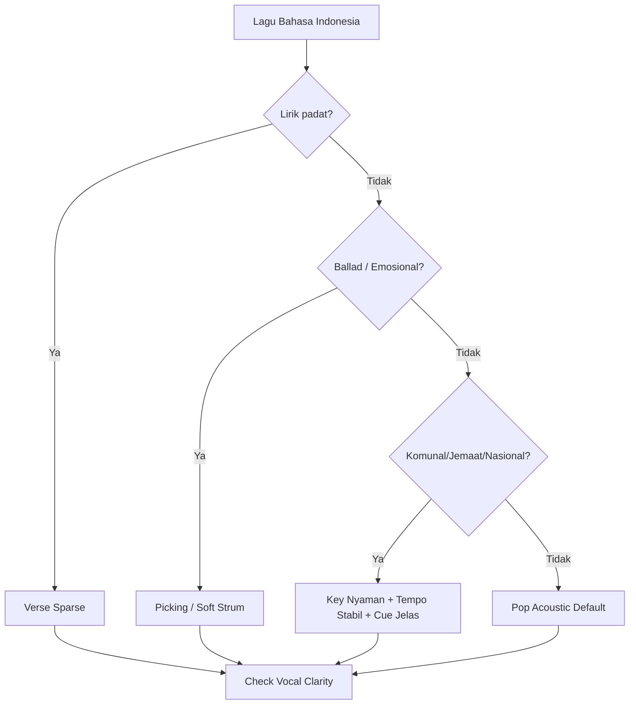
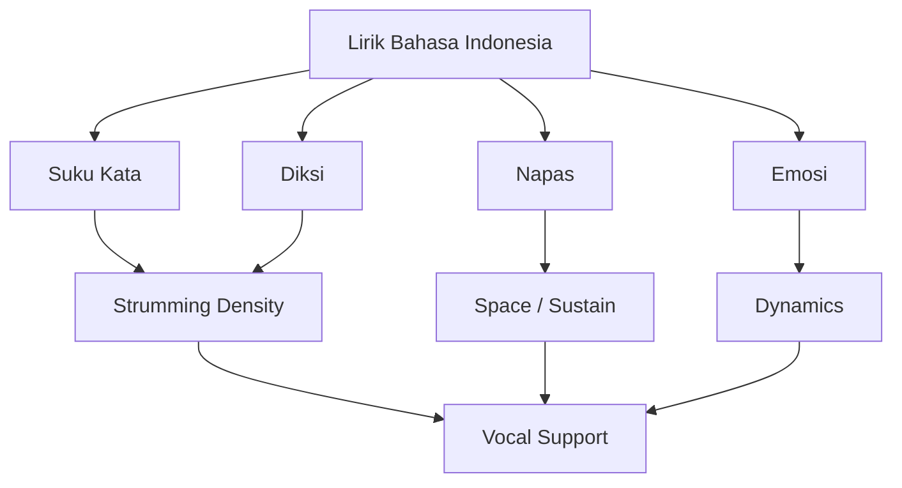

# learn-guitar-accompaniment-part-028.md

# Part 028 — Lagu Bahasa Indonesia: Strategi Mengiringi Pop Indonesia, Ballad, dan Lagu Jemaat/Nasional

## Status Seri

Seri: **Belajar Guitar Accompaniment Berdasarkan The First 20 Hours**  
Bagian: **028 dari 035**  
Fokus: memahami pendekatan praktis mengiringi lagu berbahasa Indonesia, termasuk pop Indonesia, ballad Indonesia, lagu jemaat/ibadah berbahasa Indonesia, dan lagu nasional/komunal sederhana.

Bagian ini penting karena bahasa memengaruhi phrasing, napas, artikulasi, dan cara gitar memberi ruang.

---

## Tujuan Pembelajaran Part Ini

Setelah menyelesaikan part ini, Anda harus bisa:

1. memahami karakter vokal dan lirik dalam lagu berbahasa Indonesia;
2. menyesuaikan strumming dengan kepadatan suku kata;
3. memberi ruang untuk vokal bahasa Indonesia;
4. memilih key/capo berdasarkan penyanyi Indonesia;
5. memahami pendekatan pop Indonesia acoustic;
6. memahami pendekatan ballad Indonesia;
7. memahami pendekatan lagu jemaat/komunal;
8. memahami pendekatan lagu nasional/sederhana;
9. menghindari overplaying yang menutupi lirik;
10. membuat arrangement sheet untuk lagu bahasa Indonesia.

---

## Prinsip Kaufman yang Dipakai di Part Ini

Dalam *The First 20 Hours*, skill harus ditargetkan pada konteks nyata. Jika tujuan Anda adalah tampil mengiringi penyanyi, kemungkinan besar Anda akan mengiringi lagu yang dinyanyikan dalam bahasa yang dekat dengan konteks Anda.

Lagu berbahasa Indonesia punya karakter yang perlu diperhatikan:

- suku kata sering jelas;
- vokal akhir kata sering terbuka;
- lirik sering menjadi pusat emosi;
- artikulasi konsonan perlu ruang;
- phrasing penyanyi bisa sangat ekspresif;
- ballad sering membutuhkan napas panjang;
- lagu komunal butuh key dan tempo yang mudah diikuti.

Target part ini:

> Mengiringi lagu berbahasa Indonesia dengan gitar yang mendukung diksi, napas, dan emosi penyanyi.

---

# 1. Bahasa Memengaruhi Iringan

Gitaris pemula sering hanya melihat chord. Padahal bahasa lirik memengaruhi bagaimana iringan harus dimainkan.

Dalam lagu bahasa Indonesia, hal yang perlu didengar:

```text
[ ] jumlah suku kata per bar
[ ] kata penting dalam lirik
[ ] vokal panjang
[ ] konsonan yang harus terdengar
[ ] napas antar-frasa
[ ] phrasing emosional
[ ] tekanan kata
[ ] bagian lirik yang harus intimate
```

Jika gitar terlalu ramai, lirik kehilangan makna.

---

# 2. Karakter Umum Bahasa Indonesia dalam Lagu

Secara praktis, banyak lirik Indonesia punya:

- artikulasi vokal yang jelas;
- suku kata yang relatif terbuka;
- kata emosional yang mudah tertutup jika gitar terlalu keras;
- frasa yang sering mengikuti kalimat natural;
- konsonan seperti `k`, `t`, `p`, `s`, `m`, `n`, `r` yang bisa hilang jika strumming tajam;
- banyak kata dengan akhiran vokal yang bisa dipanjangkan penyanyi.

Konsekuensi untuk gitar:

> Beri ruang untuk kata. Jangan menutup diksi.

---

# 3. Suku Kata dan Strumming

Jika lirik padat, strumming harus lebih sparse.

Contoh kondisi:

```text
Banyak kata dalam satu bar
Frasa cepat
Kalimat panjang
Diksi penting
```

Gunakan:

```text
D - - U D - - U
```

atau:

```text
D - - - D - - -
```

Jika lirik renggang atau nada panjang, gitar bisa lebih aktif.

```text
D - D U - U D U
```

Prinsip:

```text
Lirik padat = gitar lebih sedikit.
Lirik renggang = gitar boleh mengisi.
```

---

# 4. Vokal Terbuka dan Sustain

Bahasa Indonesia sering punya vokal terbuka yang bisa ditahan penyanyi:

```text
a
i
u
e
o
```

Saat penyanyi menahan vokal panjang:

- gitar jangan menabrak dengan accent keras;
- biarkan chord sustain;
- isi ruang setelah vokal stabil;
- jaga tempo;
- jangan terlalu cepat pindah dynamics.

Gitar harus mendukung sustain vokal, bukan bersaing.

---

# 5. Diksi

Diksi adalah kejelasan pengucapan.

Gitar bisa merusak diksi jika:

- strumming terlalu keras;
- upstroke terlalu tajam;
- pick attack menutup konsonan;
- bass terlalu boomy;
- semua senar dimainkan full saat lirik padat;
- tempo terlalu cepat.

Checklist:

```text
[ ] Apakah kata masih bisa dipahami?
[ ] Apakah lirik emosional terdengar?
[ ] Apakah gitar menutup konsonan?
[ ] Apakah verse terlalu penuh?
```

---

# 6. Pop Indonesia Acoustic

## 6.1 Ciri Umum

Banyak pop Indonesia acoustic cocok dengan:

- 4/4;
- tempo medium-slow;
- chord progression familiar;
- vokal sebagai pusat;
- verse yang relatif lirik-driven;
- chorus yang lebih emosional;
- dynamics gradual.

## 6.2 Pattern Aman

Verse:

```text
1 & 2 & 3 & 4 &
D - - U D - - U
```

Chorus:

```text
1 & 2 & 3 & 4 &
D - D U - U D U
```

Pre-chorus:

```text
D - D U D - D U
```

## 6.3 Chord dan Voicing

Sering cocok:

```text
G-D-Em-C
C-G-Am-Fmaj7
Em-C-G-D
Am-F-C-G
```

Voicing:

```text
Cadd9
Em7
Fmaj7
Am7
Dsus4 ornament
```

Tetapi gunakan secukupnya agar lirik tetap jelas.

## 6.4 Arrangement Pop Indonesia

```text
Intro:
progression x1, light strum/picking

Verse:
sparse, vocal clear

Pre-Chorus:
build

Chorus:
fuller strum

Verse 2:
medium

Bridge:
drop atau build

Final Chorus:
peak

Outro:
final chord sustain
```

---

# 7. Pop Indonesia: Risiko Umum

## 7.1 Terlalu Banyak Strumming di Verse

Karena lirik sering membawa cerita, verse harus jelas.

Fix:

- sparse strum;
- soft attack;
- strum sebagian senar;
- picking.

## 7.2 Chorus Terlalu Tinggi untuk Penyanyi

Banyak lagu pop punya chorus yang naik secara emosional dan pitch.

Fix:

- cek key dari chorus;
- gunakan capo/transpose;
- jangan hanya cek verse.

## 7.3 Semua Section Sama

Fix:

- dynamic map;
- pre-chorus build;
- chorus fuller;
- bridge contrast.

## 7.4 Terlalu Meniru Full Band

Fix:

- acoustic reduction;
- ambil chord, groove, dan arc;
- jangan paksa semua riff/ornament.

---

# 8. Ballad Indonesia

Ballad Indonesia sering menuntut:

- vokal emosional;
- lirik jelas;
- napas panjang;
- dynamics gradual;
- chord sustain;
- ruang;
- ending yang emosional.

## 8.1 Feel

Bisa 4/4 lambat atau 6/8.

Jika terasa mengayun:

```text
1 2 3 4 5 6
```

Gunakan:

```text
P i m a m i
```

atau:

```text
D - U D - U
```

Jika straight 4/4:

```text
D - D U D - D U
```

atau sparse.

## 8.2 Texture

Ballad Indonesia cocok dengan:

- fingerpicking intro;
- sparse verse;
- soft strum;
- Fmaj7/Am7 secukupnya;
- chord sustain;
- ritardando ending jika disepakati.

## 8.3 Dynamics

```text
Intro       : very soft
Verse 1     : soft
Verse 2     : slightly more
Pre-Chorus  : build
Chorus      : open
Bridge      : emotional contrast
Final Chorus: peak
Outro       : release
```

## 8.4 Anti-Pattern

```text
[ ] gitar terlalu ramai di lirik emosional
[ ] tempo terlalu bebas tanpa kesepakatan
[ ] chorus dipukul terlalu keras
[ ] ending tidak mengikuti vokal
[ ] terlalu banyak ornament antar-frasa
```

---

# 9. Ballad Indonesia dan Napas

Penyanyi ballad sering membutuhkan napas sebelum:

- chorus;
- nada tinggi;
- frasa emosional;
- final line;
- bridge.

Gitar harus memberi ruang.

Praktik:

```text
[ ] kurangi strum sebelum phrase tinggi
[ ] tahan chord
[ ] jangan accent keras saat penyanyi inhale
[ ] ikuti sedikit rubato jika disepakati
[ ] kembali ke pulse setelahnya
```

---

# 10. Ballad Indonesia dan Rubato

Rubato bisa sangat efektif, tetapi berbahaya jika tidak disepakati.

Gunakan rubato di:

```text
intro
akhir verse
sebelum chorus
bridge emosional
ending
```

Jangan rubato di:

```text
semua bar
setiap chord sulit
bagian yang harus stabil
chorus komunal
```

Agreement:

```text
Di final line, penyanyi boleh tahan.
Gitar mengikuti dan final chord setelah napas.
```

---

# 11. Lagu Jemaat / Ibadah Berbahasa Indonesia

Catatan: bagian ini membahas aspek musikal lagu jemaat/ibadah secara umum. Fokusnya adalah accompaniment, key, tempo, dan clarity untuk dinyanyikan bersama.

## 11.1 Ciri Umum

- dinyanyikan bersama atau oleh penyanyi utama;
- key harus nyaman untuk banyak orang jika komunal;
- tempo harus stabil;
- lirik harus jelas;
- intro harus memberi cue;
- chorus/refrain harus mudah diikuti;
- dynamics bisa build, tetapi jangan membingungkan.

## 11.2 Key

Jika untuk jemaat/komunal:

- jangan terlalu tinggi;
- jangan terlalu rendah;
- cek bagian chorus/refrain;
- pilih key yang bisa dinyanyikan banyak orang, bukan hanya penyanyi solo.

Jika hanya solo vocalist, key bisa lebih personal.

## 11.3 Pattern

Verse/awal:

```text
D - - U D - - U
```

Chorus/refrain:

```text
D - D U - U D U
```

Build:

```text
D U D U D U D U
```

Dengan kontrol.

## 11.4 Voicing

Cocok:

```text
G 320033
Cadd9
Em7
Dsus4
Fmaj7
```

Namun jika banyak orang bernyanyi, chord harus tetap jelas. Jangan terlalu banyak warna yang membuat arah harmoni kabur.

---

# 12. Lagu Jemaat: Cue dan Intro

Untuk lagu komunal, intro harus sangat jelas.

Intro harus memberi:

```text
tempo
key
melodi/harmoni cukup
jumlah bar
entry point
```

Jika hanya gitar, intro sederhana:

```text
progression chorus/refrain x1
```

atau:

```text
last line progression
```

Penting:

> Orang harus tahu kapan mulai bernyanyi.

---

# 13. Lagu Jemaat: Dynamics

Build boleh, tetapi jangan membingungkan.

Contoh:

```text
Verse 1: sparse
Chorus 1: medium
Verse 2: medium
Chorus 2: fuller
Bridge/Refrain repeat: build
Final: full
Outro: release
```

Jika jemaat ikut bernyanyi, stabilitas tempo lebih penting daripada ornament gitar.

---

# 14. Lagu Nasional / Komunal Sederhana

Lagu nasional atau komunal sering membutuhkan:

- tempo stabil;
- chord jelas;
- key nyaman;
- tidak terlalu banyak reharmonisasi;
- lirik jelas;
- rasa hormat/tegas sesuai konteks;
- ending jelas.

## 14.1 Pattern

Sering aman dengan:

```text
D D D D
```

atau:

```text
B D B D
```

atau strumming sederhana sesuai meter.

Jangan terlalu banyak syncopation jika lagu harus dinyanyikan bersama.

## 14.2 Tone

- jelas;
- tidak terlalu ornamental;
- tidak terlalu dreamy kecuali arrangement memang begitu;
- rhythm stabil;
- final chord tegas.

## 14.3 Anti-Pattern

```text
[ ] terlalu banyak Cadd9/sus sehingga lagu kehilangan ketegasan
[ ] tempo terlalu rubato
[ ] strumming terlalu pop untuk konteks formal
[ ] ending terlalu bebas
[ ] key terlalu tinggi untuk kelompok
```

---

# 15. Lagu Anak / Komunal Ringan

Jika mengiringi lagu sederhana untuk anak/kelompok:

- gunakan chord dasar;
- tempo stabil;
- pattern tidak rumit;
- key nyaman;
- intro pendek;
- ending jelas;
- ulang section jika perlu.

Fokus bukan keindahan chord, tetapi keterikuti.

---

# 16. Bahasa Indonesia dan Tempo

Karena artikulasi lirik penting, tempo harus memberi ruang.

Jika tempo terlalu cepat:

- diksi hilang;
- penyanyi kehabisan napas;
- frasa emosional lewat begitu saja;
- gitar terasa mengejar.

Jika tempo terlalu lambat:

- lagu dragging;
- napas terlalu panjang;
- rhythm goyah;
- emosi bisa terasa berat berlebihan.

Tempo ideal adalah yang membuat lirik bisa “berbicara”.

---

# 17. Bahasa Indonesia dan Accent

Jangan selalu accent tepat di atas kata penting.

Jika kata penting berada di beat kuat, gitar harus mendukung, bukan menabrak.

Strategi:

- accent sedikit sebelum/di bawah kata, bukan menusuk di atasnya;
- kurangi upstroke tajam saat konsonan;
- gunakan sustain saat kata panjang;
- fill setelah frasa selesai.

---

# 18. Bahasa Indonesia dan Fill

Fill gitar di antara frasa bisa indah, tetapi jangan berlebihan.

Gunakan fill jika:

```text
[ ] ada ruang antar-line
[ ] vokal selesai frasa
[ ] lagu butuh respons
[ ] fill sederhana
```

Hindari fill jika:

```text
[ ] lirik padat
[ ] penyanyi mengambil napas
[ ] chord change sulit
[ ] fill membuat tempo goyah
[ ] fill mengganggu kata berikut
```

Untuk 20 jam pertama, fill cukup berupa:

- satu strum ringan;
- sus chord kecil;
- bass note;
- arpeggio pendek.

---

# 19. Key dan Karakter Penyanyi Indonesia

Tidak ada “key Indonesia”. Tetapi dalam praktik, banyak penyanyi punya preferensi range berbeda.

Workflow tetap:

1. cek chorus;
2. cek verse;
3. coba capo;
4. dengarkan tone;
5. pilih key yang membuat lirik dan emosi keluar.

Pertanyaan:

```text
Apakah chorus terasa teriak?
Apakah verse terlalu rendah?
Apakah artikulasi masih jelas?
Apakah penyanyi bisa menyampaikan emosi?
Apakah final chorus masih kuat?
```

---

# 20. Pop Indonesia Acoustic Starter Patterns

## Pattern A — Verse Aman

```text
1 & 2 & 3 & 4 &
D - - U D - - U
```

## Pattern B — Chorus Umum

```text
1 & 2 & 3 & 4 &
D - D U - U D U
```

## Pattern C — Ballad Slow

```text
1 & 2 & 3 & 4 &
D - D U D - D U
```

## Pattern D — 6/8 Ballad

```text
1 2 3 4 5 6
D - U D - U
```

## Pattern E — Picking Verse

```text
P i m i
```

Gunakan sesuai lirik, bukan hanya genre.

---

# 21. Progression yang Sering Berguna

Untuk latihan lagu Indonesia, progression berikut sangat berguna:

```text
G - D - Em - C
C - G - Am - Fmaj7
Em - C - G - D
Am - Fmaj7 - C - G
G - C - D - G
C - Fmaj7 - G - C
```

Latih dalam beberapa capo.

Tujuan bukan mengklaim semua lagu sama, tetapi membangun vocabulary yang sering muncul.

---

# 22. Pendekatan Lagu dengan Banyak Chord

Beberapa lagu Indonesia punya chord passing, slash chord, atau perubahan harmoni yang lebih kaya.

Strategi:

1. identifikasi chord utama;
2. cari chord passing yang bisa disederhanakan;
3. pertahankan chord yang mendukung melodi penting;
4. jangan hilangkan chord yang membuat phrase terasa benar;
5. jika ragu, uji dengan vokal.

Contoh simplification:

```text
G - D/F# - Em - Em/D - C
```

menjadi:

```text
G - D - Em - C
```

Jika masih mendukung vokal.

---

# 23. Pendekatan Lagu dengan Intro Ikonik

Banyak lagu punya intro yang dikenal.

Untuk 20 jam pertama:

- jika intro mudah, pelajari;
- jika intro sulit, ganti dengan chord progression;
- pastikan vocal entry jelas;
- jangan mengorbankan lagu penuh demi intro.

Intro simplified:

```text
mainkan progression chorus atau verse x1
```

Tambahkan picking jika ingin lebih indah.

---

# 24. Pendekatan Lagu dengan Modulasi

Beberapa lagu naik key di akhir untuk efek dramatis.

Untuk pemula, modulasi bisa sangat sulit.

Pilihan:

```text
[ ] abaikan modulasi dan tetap di key sama
[ ] gunakan capo jika ada jeda cukup
[ ] pilih versi simplified
[ ] hindari lagu itu untuk 20 jam pertama
```

Jika modulasi adalah bagian sangat penting lagu, masukkan sebagai growth/later song.

---

# 25. Pendekatan Lagu dengan Nada Tinggi Chorus

Jika chorus terlalu tinggi:

- turunkan key;
- gunakan capo lebih rendah;
- pilih shape lain;
- jangan paksa penyanyi;
- cek final chorus, bukan chorus pertama saja.

Jika verse menjadi terlalu rendah setelah key turun:

- cari compromise;
- ubah arrangement;
- pilih lagu lain jika tidak cocok.

---

# 26. Pendekatan Lagu dengan Lirik Sangat Padat

Gunakan:

```text
sparse strum
palm mute ringan
fingerpicking
downstroke minimal
```

Hindari:

```text
full 8th strumming keras
fill antar kata
upstroke tajam terus
```

Diksi adalah prioritas.

---

# 27. Pendekatan Lagu dengan Lirik Renggang

Jika vokal punya banyak nada panjang, gitar bisa:

- sustain chord;
- memberi arpeggio;
- fill kecil setelah phrase;
- build dynamics;
- gunakan voicing warna.

Tetap jangan overfill.

---

# 28. Arrangement Template Lagu Bahasa Indonesia

```text
Title:
Singer:
Context:
Original key:
Chosen key:
Guitar shape:
Capo:
Tempo:
Feel:

Language/Vocal Notes:
- lirik padat?
- kata penting?
- napas?
- bagian tinggi?
- bagian rendah?

Song Map:
Intro:
Verse:
Pre-Chorus:
Chorus:
Bridge:
Outro:

Pattern Map:
Intro:
Verse:
Pre-Chorus:
Chorus:
Bridge:
Outro:

Diction Strategy:
Where guitar must be sparse:
Where guitar can fill:
Where to sustain:

Dynamics:
Verse:
Chorus:
Bridge:
Final:

Cues:
Vocal entry:
Chorus cue:
Ending cue:

Risks:
Key:
Tempo:
Chord:
Diction:
Ending:
```

---

# 29. Pop Indonesia Arrangement Example

Input:

```text
Feel: 4/4 pop ballad
Progression: G-D-Em-C
Singer: soft vocal
```

Arrangement:

```text
Intro:
G-D-Em-C x1, picking P-i-m-i

Verse:
G-D-Em-C x2, sparse strum
Focus: lirik jelas

Pre-Chorus:
C-D-Em-D, build

Chorus:
G-D-Em-C x2, D-D-U-U-D-U
Focus: support, not overpower

Bridge:
Em-C-G-D, palm mute/picking

Final Chorus:
fuller strum

Outro:
G final sustain
```

Diction strategy:

```text
kurangi upstroke tajam di verse
fill hanya setelah frasa
```

---

# 30. Ballad Indonesia Arrangement Example

Input:

```text
Feel: 6/8
Progression: C-G-Am-Fmaj7
Vocal: emotional, long phrases
```

Arrangement:

```text
Counting:
1 2 3 4 5 6

Intro:
C-G-Am-Fmaj7 x1, P-i-m-a-m-i

Verse:
same picking, soft

Chorus:
D - U D - U, fuller but warm

Bridge:
Am-Fmaj7-C-G, drop to sparse

Final Chorus:
full 6/8 strum

Outro:
C arpeggio, final sustain
```

Vocal strategy:

```text
follow final phrase
no overfill
rubato only at ending
```

---

# 31. Lagu Jemaat Arrangement Example

Input:

```text
Feel: 4/4
Goal: dinyanyikan bersama
Progression: G-C-D-G
```

Arrangement:

```text
Intro:
chorus/refrain progression x1, clear tempo

Verse:
downstroke or sparse strum

Chorus/Refrain:
fuller strum, stable tempo

Repeat:
increase slightly if needed

Ending:
final G, clear sustain
```

Prioritas:

```text
tempo stabil
key nyaman
cue jelas
tidak terlalu banyak ornament
```

---

# 32. Lagu Nasional/Komunal Arrangement Example

Input:

```text
Context: formal/komunal
Goal: lirik jelas, tempo stabil
```

Arrangement strategy:

```text
Intro:
short, clear key

Verse:
simple downstroke or bass-strum

Main section:
steady, not overly syncopated

Ending:
clear final chord
```

Avoid:

```text
terlalu banyak rubato
terlalu banyak chord warna
strumming pop berlebihan
```

---

# 33. Diction-Aware Strumming Drill

Gunakan kalimat dummy bahasa Indonesia tanpa memakai lirik lagu:

```text
"aku berjalan pulang"
"mencari sisa terang"
```

Latihan:

1. mainkan progression G-D-Em-C;
2. ucapkan kalimat di atas;
3. mainkan strumming full;
4. mainkan sparse;
5. dengarkan mana yang membuat kata lebih jelas.

Target:

> Merasakan hubungan strumming dan diksi.

---

# 34. Phrase Space Drill

Buat pola:

```text
Vokal line → gitar diam/sustain
Vokal selesai → gitar fill kecil
Vokal masuk lagi → gitar turun
```

Gunakan chord C-G-Am-Fmaj7.

Fill sederhana:

```text
D-Dsus4-D
```

atau satu arpeggio pendek.

Jangan fill saat vokal bicara.

---

# 35. Indonesian Vocal Cue Drill

Latih vocal entry:

```text
Intro: G-D-Em-C x1
Cue: nod di C
Vokal masuk beat 1 setelah C
```

Simulasi:

- vocal masuk tepat;
- vocal telat;
- vocal masuk lebih cepat.

Recovery:

```text
telat → ulang intro
cepat → cut intro dan follow
```

Ini sangat berguna untuk lagu bahasa Indonesia karena lirik entry sering harus jelas.

---

# 36. Ending Drill untuk Ballad Indonesia

Latih:

```text
final chorus last 4 bars → final chord
```

Opsi:

1. final chord sustain;
2. ritardando ringan;
3. repeat last progression;
4. arpeggio ending.

Pastikan penyanyi tahu.

---

# 37. Latihan 45 Menit untuk Part Ini

## Block 1 — Diction Listening, 8 Menit

Dengarkan lagu bahasa Indonesia target. Catat:

```text
lirik padat
kata penting
napas
bagian tinggi
```

## Block 2 — Verse Sparse, 8 Menit

Mainkan verse dengan sparse pattern.

## Block 3 — Chorus Support, 8 Menit

Mainkan chorus fuller tetapi kontrol volume.

## Block 4 — Key/Capo Check, 8 Menit

Cek chorus dan verse.

## Block 5 — Cue/Ending, 8 Menit

Latih intro entry dan ending.

## Block 6 — Recording Review, 5 Menit

Dengarkan apakah lirik masih jelas.

---

# 38. Latihan 15 Menit

```text
3 menit  dengarkan vocal phrase
3 menit  verse sparse
3 menit  chorus fuller
3 menit  intro cue
3 menit  ending
```

Jika hanya 5 menit:

```text
2 menit  strumming sparse sambil ucapkan kalimat Indonesia
2 menit  chorus full controlled
1 menit  catat diction issue
```

---

# 39. Mini Project Part Ini

Pilih satu lagu bahasa Indonesia.

Buat arrangement sheet dengan fokus diction:

```text
Title:
Key/capo:
Feel:
Verse pattern:
Chorus pattern:
Diction risk:
Where to reduce guitar:
Where to build:
Intro cue:
Ending:
Simplification:
Recording review:
```

Rekam 1 full run dengan vokal asli/rekaman/hum.

Target:

> Lirik harus tetap terasa jelas dan emosional.

---

# 40. Kesalahan Umum Saat Mengiringi Lagu Bahasa Indonesia

## 40.1 Terlalu Banyak Genjreng

Lirik tertutup.

## 40.2 Mengabaikan Suku Kata

Strumming tidak memberi ruang pada frasa.

## 40.3 Key Terlalu Tinggi

Penyanyi terdengar teriak di chorus.

## 40.4 Ballad Terlalu Cepat

Napas dan emosi hilang.

## 40.5 Lagu Komunal Terlalu Ornamented

Orang sulit mengikuti.

## 40.6 Ending Tidak Disepakati

Vokal dan gitar selesai beda waktu.

---

# 41. Debugging Matrix Lagu Bahasa Indonesia

| Symptom | Kemungkinan Penyebab | Fix |
|---|---|---|
| Lirik tidak jelas | strumming terlalu ramai | sparse verse |
| Chorus teriak | key terlalu tinggi | transpose turun |
| Verse terlalu rendah | key terlalu rendah | cari compromise |
| Ballad tidak emosional | terlalu cepat/ramai | slow, sustain, picking |
| Lagu jemaat sulit diikuti | intro/cue tidak jelas | progression intro jelas |
| Lagu nasional terasa terlalu pop | pattern terlalu syncopated | steady downstroke |
| Ending ragu | tidak disepakati | ending agreement |
| Vokal tertutup bass | bass terlalu kuat | kurangi low/strum bass |

---

# 42. Decision Tree Lagu Bahasa Indonesia



---

# 43. Acceptance Criteria Part 028

Anda boleh lanjut ke part 029 jika:

```text
[ ] Bisa menjelaskan kenapa bahasa memengaruhi iringan
[ ] Bisa menyesuaikan strumming dengan kepadatan lirik
[ ] Bisa membuat verse lebih diction-friendly
[ ] Bisa memilih pattern untuk pop Indonesia acoustic
[ ] Bisa memilih approach ballad Indonesia
[ ] Bisa menjelaskan kebutuhan lagu jemaat/komunal
[ ] Bisa menjelaskan pendekatan lagu nasional/komunal sederhana
[ ] Bisa membuat diction-aware arrangement sheet
[ ] Bisa melakukan vocal cue drill
[ ] Bisa merekam dan mengecek apakah lirik terdengar jelas
```

---

# 44. Ringkasan Mental Model

Mengiringi lagu bahasa Indonesia berarti mendukung kata, napas, dan emosi.



Jika lirik tidak terdengar, iringan gagal walau chord benar.

---

# 45. Output Part Ini

Output konkret:

1. Anda memahami hubungan bahasa dan iringan.
2. Anda bisa mengatur density berdasarkan lirik.
3. Anda punya strategi untuk pop Indonesia, ballad, lagu jemaat, dan lagu nasional/komunal.
4. Anda bisa membuat arrangement sheet yang diction-aware.
5. Anda siap masuk ke lagu Barat pop acoustic dan adaptasi bahasa/phrasing berikutnya.

Part berikutnya:

> **Lagu Barat Pop Acoustic: Phrasing, Groove, dan Adaptasi Iringan.**

