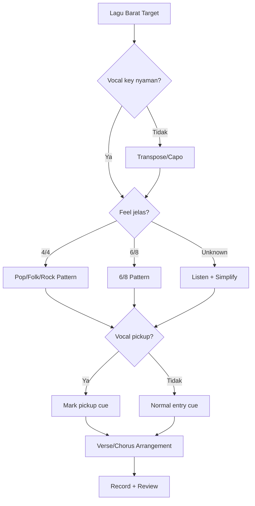
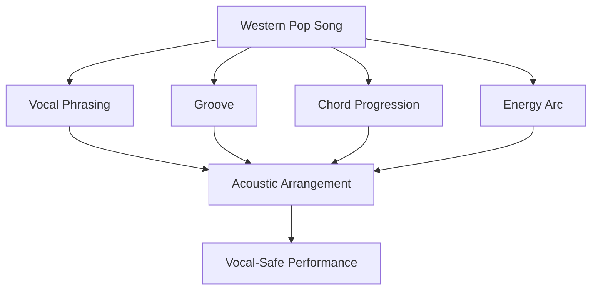

# learn-guitar-accompaniment-part-029.md

# Part 029 — Lagu Barat Pop Acoustic: Phrasing, Groove, dan Adaptasi Iringan

## Status Seri

Seri: **Belajar Guitar Accompaniment Berdasarkan The First 20 Hours**  
Bagian: **029 dari 035**  
Fokus: memahami cara mengiringi lagu Barat pop acoustic dengan memperhatikan phrasing bahasa Inggris, groove, accent, dynamics, dan adaptasi dari versi full band ke gitar-vokal.

Part sebelumnya membahas lagu berbahasa Indonesia. Bagian ini membahas lagu Barat/pop acoustic karena banyak repertoire gitar-vokal pemula diambil dari pop Barat, acoustic cover, singer-songwriter, worship/anthemic English songs, folk-pop, dan ballad Barat.

---

## Tujuan Pembelajaran Part Ini

Setelah menyelesaikan part ini, Anda harus bisa:

1. memahami perbedaan phrasing bahasa Inggris dan bahasa Indonesia dalam iringan;
2. mengenali stress pattern dalam lirik bahasa Inggris;
3. menyesuaikan strumming dengan groove dan word stress;
4. memilih pattern untuk pop acoustic Barat;
5. memilih approach untuk singer-songwriter dan folk-pop;
6. mengadaptasi lagu full band menjadi acoustic version;
7. memahami kapan harus mengikuti groove asli dan kapan menyederhanakan;
8. menghindari accent gitar yang menabrak vocal stress;
9. membuat arrangement sheet untuk lagu Barat pop acoustic;
10. memilih key/capo yang cocok untuk penyanyi tanpa kehilangan feel lagu.

---

## Prinsip Kaufman yang Dipakai di Part Ini

Dalam framework *The First 20 Hours*, kita tidak mengejar penguasaan semua genre Barat. Kita membangun **minimum usable competence** untuk konteks target: mengiringi penyanyi.

Untuk lagu Barat pop acoustic, skill minimum yang bernilai tinggi adalah:

```text
[ ] mendengar groove utama
[ ] memahami vocal phrasing
[ ] memilih pattern sederhana
[ ] menyesuaikan key dengan penyanyi
[ ] menjaga diction/word stress
[ ] membuat verse/chorus berbeda
[ ] menyederhanakan versi full band
[ ] memberi intro dan ending yang jelas
```

Targetnya bukan menjadi session guitarist. Targetnya:

> Bisa membawakan lagu Barat pop acoustic secara stabil, natural, dan mendukung vokal.

---

# 1. Lagu Barat Bukan Hanya Chord Chart Bahasa Inggris

Banyak pemula memperlakukan lagu Barat seperti kumpulan chord:

```text
G - D - Em - C
```

Lalu memainkan pattern pop yang sama untuk semua lagu.

Masalahnya:

- bahasa Inggris punya stress pattern yang berbeda;
- groove sering sangat menentukan feel;
- syncopation bisa lebih terasa;
- vocal entry kadang pickup sebelum beat 1;
- chorus hook sering bergantung pada accent;
- verse bisa sangat conversational;
- acoustic cover sering mengubah feel dari versi asli.

Jadi, selain chord, Anda perlu memperhatikan:

```text
phrasing
stress
groove
space
accent
vocal pickup
```

---

# 2. Phrasing Bahasa Inggris

Bahasa Inggris cenderung stress-timed. Artinya, kata-kata tertentu mendapat tekanan kuat, dan suku kata tidak selalu terasa rata.

Contoh sederhana:

```text
I don't wanna be alone tonight
```

Tekanan tidak jatuh sama rata pada setiap suku kata. Biasanya kata penting seperti:

```text
don't
wanna
alone
night
```

lebih menonjol.

Konsekuensi untuk gitar:

> Jangan membuat semua strum sama rata dan keras jika vocal phrasing membutuhkan stress tertentu.

---

# 3. Bahasa Indonesia vs Bahasa Inggris dalam Iringan

Secara praktis:

| Aspek | Bahasa Indonesia | Bahasa Inggris |
|---|---|---|
| Suku kata | sering lebih jelas per suku kata | stress lebih tidak rata |
| Diksi | vokal terbuka penting | consonant dan stress penting |
| Phrasing | sering dekat kalimat natural | sering syncopated/pickup |
| Risiko gitar | menutup diksi dan vokal | menabrak stress/pickup |
| Strategi | beri ruang kata | dengarkan stress dan groove |

Ini bukan aturan linguistik lengkap, tetapi cukup sebagai mental model pengiring.

---

# 4. Word Stress

Word stress adalah tekanan dalam kata atau frasa.

Contoh:

```text
beautiful
```

Tidak semua syllable sama kuat.

Dalam lagu, stress bisa mengikuti atau melawan beat. Jika gitar memberi accent di tempat yang salah, vokal terasa tidak natural.

Latihan:

1. dengarkan verse lagu Barat;
2. jangan main gitar dulu;
3. tepuk beat;
4. ucapkan lirik;
5. rasakan kata mana yang ditekankan;
6. baru pilih strumming.

---

# 5. Vocal Pickup

Banyak lagu Barat memulai frasa vokal sebelum beat 1. Ini disebut pickup/anacrusis secara praktis.

Contoh konsep:

```text
... and I
[beat 1] will always...
```

Jika gitar hanya memberi cue di beat 1 tanpa memahami pickup, penyanyi bisa merasa telat atau tidak didukung.

Praktis untuk gitaris:

```text
[ ] tahu apakah vocal masuk tepat di beat 1
[ ] tahu apakah vocal masuk sebelum beat 1
[ ] jangan menabrak pickup dengan strum keras
[ ] berikan intro/cue yang cukup
```

---

# 6. Groove Lebih Penting dari Pattern

Pattern adalah notasi tangan kanan. Groove adalah rasa waktu, accent, dan flow.

Dua gitaris bisa memainkan pattern sama:

```text
D - D U - U D U
```

Tetapi groove terdengar berbeda karena:

- accent;
- swing/straight feel;
- attack;
- muting;
- volume;
- timing mikro;
- hubungan dengan vokal.

Untuk 20 jam pertama, target groove sederhana:

```text
stable
not stiff
not rushing
supporting vocal stress
```

---

# 7. Straight vs Slightly Laid-Back Feel

Lagu pop acoustic Barat sering tidak harus super kaku di depan beat. Beberapa terasa sedikit laid-back.

Sebagai pemula, jangan memaksakan mikro timing advanced. Tetapi pahami:

```text
terlalu rushing = terasa gugup
terlalu dragging = terasa berat
stabil dan rileks = lebih natural
```

Cara latihan:

- metronome dulu;
- rekam;
- pastikan tidak rushing;
- strum lebih kecil;
- rilekskan tangan kanan.

---

# 8. Pop Acoustic Barat

## 8.1 Ciri Umum

- chord progression berulang;
- 4/4 dominan;
- verse bisa conversational;
- chorus hook kuat;
- strumming medium;
- dynamics jelas;
- key sering perlu capo;
- acoustic cover sering memakai open voicing.

## 8.2 Progression Umum

```text
G - D - Em - C
C - G - Am - F
Em - C - G - D
Am - F - C - G
D - A - Bm - G
```

Dengan capo/shape, banyak key bisa dimainkan.

## 8.3 Pattern Aman

Verse:

```text
D - - U D - - U
```

Chorus:

```text
D - D U - U D U
```

Driving:

```text
D U D U D U D U
```

Dengan accent dikontrol.

---

# 9. Singer-Songwriter Style

Singer-songwriter style sering fokus pada cerita dan intimacy.

Ciri:

- lirik sangat penting;
- chord bisa sederhana;
- fingerpicking atau bass-strum umum;
- dynamics lebih natural;
- tempo tidak terlalu dipoles;
- vocal phrasing sering conversational.

Approach:

```text
verse = sparse / fingerpicking
chorus = sedikit lebih terbuka
bridge = contrast
ending = intimate
```

Pattern:

```text
P-i-m-i
B-D-B-D
D - - U D - - U
```

Hindari:

```text
strumming terlalu pop penuh dari awal
terlalu banyak voicing manis
fill berlebihan di bawah lirik
```

---

# 10. Folk-Pop Barat

Folk-pop sering menggunakan acoustic guitar sebagai motor rhythm.

Ciri:

- bass-strum;
- steady pulse;
- story-driven;
- chord open;
- sometimes capo;
- vocal harmonies jika ada;
- natural tone.

Pattern:

```text
B D B D
```

atau:

```text
D - D U D - D U
```

Fingerpicking:

```text
P i m i
P i P m
```

Bass harus stabil.

Folk-pop sering gagal jika gitar terlalu pop-slick atau terlalu keras.

---

# 11. Western Ballad

Ballad Barat sering memakai:

- slow 4/4;
- 6/8;
- piano-like phrasing;
- long vocal phrases;
- emotional build;
- sparse verse;
- big final chorus.

Gitar approach:

```text
Intro: picking/single strum
Verse: sparse
Pre-chorus: build
Chorus: fuller but warm
Bridge: drop or dramatic lift
Final: peak
Outro: sustain
```

6/8 pattern:

```text
1 2 3 4 5 6
D - U D - U
```

Picking:

```text
P i m a m i
```

---

# 12. Pop-Rock Acoustic Barat

Pop-rock acoustic butuh energy tetapi tetap vocal-safe.

Ciri:

- driving rhythm;
- strong chorus;
- palm mute verse;
- open strum chorus;
- accent 2/4 atau downbeat kuat;
- tempo mudah naik jika gugup.

Approach:

```text
verse: palm mute / controlled downstroke
pre: build
chorus: open strum
bridge: drop or intensify
```

Hindari:

```text
memukul senar untuk meniru distorsi
tempo naik
gitar menutup vokal
strum pecah saat amplified
```

---

# 13. English Worship / Anthemic Acoustic

Secara musikal, banyak English worship/anthemic songs memiliki:

- open voicing;
- gradual build;
- repetitive chorus/bridge;
- strong communal singability;
- key harus nyaman;
- dynamics arc panjang;
- bridge builds.

Approach:

```text
G 320033
Cadd9
Em7
Dsus4
D/F# jika stabil
```

Pattern:

```text
verse sparse
chorus medium
bridge build
final chorus full
```

Hindari:

```text
full energy dari awal
key terlalu tinggi
bridge repeat tanpa dynamic plan
terlalu banyak rubato jika komunal
```

---

# 14. Adaptasi dari Versi Full Band

Banyak lagu Barat populer versi asli full band. Gitar-vokal harus memilih elemen utama.

Pertahankan:

```text
vocal hook
chord progression
groove utama
dynamic arc
signature stop jika mudah
ending feel
```

Sederhanakan:

```text
drum fill
bassline rumit
synth hook
electric riff
backing vocal layer
production drop
```

Jangan merasa harus meniru semua layer.

---

# 15. Jika Lagu Punya Riff Ikonik

Beberapa lagu Barat dikenal dari riff.

Pilihan:

1. pelajari riff jika mudah dan tidak mengganggu vokal;
2. ganti dengan chord progression jika riff sulit;
3. gunakan potongan riff sebagai intro saja;
4. jangan korbankan lagu penuh demi riff.

Rule:

> Riff yang patah-patah lebih buruk daripada chord intro yang stabil.

---

# 16. Jika Lagu Punya Syncopation

Syncopation berarti accent tidak selalu jatuh di beat kuat.

Untuk pemula:

- jangan langsung meniru syncopation penuh;
- pahami groove dasar;
- pakai simplified pattern;
- tambahkan accent setelah stabil;
- jangan menabrak vocal stress.

Simplification:

```text
Original syncopated groove → stable acoustic strum
```

Jika lagu kehilangan identitas tanpa syncopation, jadikan growth/later song.

---

# 17. Pronunciation dan Iringan

Jika penyanyi menyanyi bahasa Inggris, pronunciation memengaruhi phrasing.

Gitar harus memberi ruang pada:

- consonant clusters;
- final consonants;
- stressed syllables;
- breath before high notes;
- pickup words.

Contoh risiko:

```text
strum keras tepat saat final consonant penting
```

Akibatnya lirik kurang jelas.

Prinsip:

> Dukung stress kata, jangan menutupnya.

---

# 18. English Lyric Density

Lirik Inggris bisa sangat padat pada verse, terutama pop modern.

Jika lirik padat:

```text
[ ] sparse strum
[ ] palm mute ringan
[ ] bass-strum sederhana
[ ] avoid busy upstroke
[ ] no fill under phrase
```

Jika lirik renggang:

```text
[ ] sustain
[ ] picking
[ ] fill after phrase
[ ] dynamics build
```

---

# 19. Capo dalam Lagu Barat

Banyak acoustic cover menggunakan capo.

Alasan:

- menyesuaikan key vokal;
- memakai open chord;
- mendapatkan shimmer;
- menghindari barre chord;
- meniru acoustic cover feel.

Catat:

```text
Original key:
Cover key:
Singer key:
Shape:
Capo:
Sounding key:
```

Jika bermain dengan musisi lain, sounding key wajib jelas.

---

# 20. Key untuk Lagu Barat

Banyak lagu Barat asli berada di key yang sesuai penyanyi asli. Penyanyi Anda mungkin berbeda.

Workflow:

1. cek chorus;
2. cek highest note;
3. cek verse lowest phrase;
4. coba capo;
5. cek tone;
6. pilih key yang membuat penyanyi natural.

Jangan hanya mengikuti chord chart pertama yang ditemukan.

---

# 21. Accent dan Backbeat

Banyak lagu Barat pop/rock terasa kuat di backbeat 2 dan 4.

Dalam gitar akustik, Anda bisa memberi accent ringan:

```text
1 & 2 & 3 & 4 &
    >       >
```

Namun jangan terlalu keras jika vokal lembut.

Latihan:

- muted strum;
- accent 2 dan 4;
- lalu chord progression;
- lalu dengan vocal recording.

---

# 22. Palm Muting untuk Pop-Rock Barat

Palm mute bisa memberi groove tanpa terlalu ramai.

Verse:

```text
muted downstroke
```

Pre-chorus:

```text
buka sedikit
```

Chorus:

```text
open strum
```

Ini sangat efektif untuk acoustic pop-rock.

---

# 23. Fingerpicking untuk Singer-Songwriter Barat

Fingerpicking pattern:

```text
P i m i
```

atau:

```text
P i m a
```

atau:

```text
P i m a m i
```

Gunakan untuk:

- intro;
- verse;
- bridge;
- ending.

Hindari:

- pattern terlalu rumit;
- bass tidak stabil;
- treble terlalu tajam;
- fill melodi berlebihan.

---

# 24. Dynamic Map untuk Lagu Barat Pop Acoustic

Template:

```text
Intro: 30%
Verse 1: 40%
Pre: 60%
Chorus 1: 75%
Verse 2: 50%
Chorus 2: 80%
Bridge: 35% or 70%
Final Chorus: 90%
Outro: 20%
```

Untuk lagu Barat, dynamic arc sering sangat jelas. Jangan habiskan energi di awal.

---

# 25. Acoustic Cover Decision

Saat membuat acoustic cover:

Tanya:

```text
Apakah ini faithful cover?
Apakah ini stripped-down cover?
Apakah ini singer-focused version?
Apakah ini campfire version?
Apakah ini performance-safe version?
```

Untuk 20 jam pertama, pilih:

```text
singer-focused, performance-safe acoustic version
```

Bukan versi paling flashy.

---

# 26. Campfire Version vs Performance Version

## Campfire Version

- chord cukup;
- strum sederhana;
- semua orang ikut;
- tidak perlu dynamics detail.

## Performance Version

- intro jelas;
- key vokal optimal;
- dynamics;
- arrangement;
- ending;
- cue;
- sound balance.

Keduanya valid, tetapi target seri ini lebih dekat ke performance-safe accompaniment.

---

# 27. Western Pop Acoustic Arrangement Template

```text
Title:
Artist:
Original key:
Singer key:
Shape:
Capo:
Tempo:
Feel:
Vocal entry:
Pickup? yes/no

Song Map:
Intro:
Verse:
Pre-Chorus:
Chorus:
Verse 2:
Bridge:
Final Chorus:
Outro:

Pattern Map:
Intro:
Verse:
Pre:
Chorus:
Bridge:
Final:

Vocal Notes:
Word stress:
Dense lyric section:
High note section:
Breath section:

Dynamics:
Verse:
Chorus:
Bridge:
Final:

Simplification:
Riff:
Slash chord:
Syncopation:
Ending:
```

---

# 28. Example: Generic Pop Acoustic

Input:

```text
Progression: G-D-Em-C
Feel: 4/4
Vocal: conversational verse, hook chorus
```

Arrangement:

```text
Intro:
G-D-Em-C x1, light strum

Verse:
sparse D---D---, avoid covering words

Pre:
D-DU-D-DU, build

Chorus:
D-DU-UDU, full but controlled

Bridge:
Em-C-G-D, palm mute or picking

Final:
fuller chorus

Outro:
G sustain
```

Notes:

```text
Check if vocal pickup enters before beat 1.
Do not accent over first word of chorus if pickup.
```

---

# 29. Example: Generic Singer-Songwriter

Input:

```text
Progression: C-G-Am-Fmaj7
Feel: 4/4 slow
Vocal: story-driven
```

Arrangement:

```text
Intro:
P-i-m-i x1 progression

Verse:
P-i-m-i, soft

Chorus:
light strum, not too full

Verse 2:
picking + occasional brush

Bridge:
drop to single strum

Final:
medium strum

Outro:
C arpeggio
```

Notes:

```text
Keep lyrics front.
No busy fills.
```

---

# 30. Example: Generic 6/8 Western Ballad

Input:

```text
Progression: Em-C-G-D
Feel: 6/8
Vocal: long emotional phrases
```

Arrangement:

```text
Intro:
P-i-m-a-m-i

Verse:
same picking, soft

Pre:
build with D - U D - U

Chorus:
full 6/8 strum

Bridge:
drop to picking

Final:
fullest 6/8 strum

Outro:
Em or G final depending key
```

Notes:

```text
Accent 1 and 4.
Do not force 4/4 pop pattern.
```

---

# 31. Listening Checklist for Lagu Barat

Before arranging, listen for:

```text
[ ] Is the feel straight 4/4, 6/8, shuffle, or other?
[ ] Does vocal enter on beat 1 or pickup?
[ ] Is verse lyric dense?
[ ] Where is chorus hook?
[ ] What is the groove source: drums, guitar, piano?
[ ] Is there a signature riff?
[ ] Is the song dependent on bassline?
[ ] Where does energy peak?
[ ] How does it end?
```

---

# 32. Western Pop Acoustic Debugging Matrix

| Symptom | Kemungkinan Penyebab | Fix |
|---|---|---|
| Vocal terasa tidak natural | pickup/stress ditabrak | dengarkan phrasing |
| Groove kaku | pattern benar tapi accent salah | adjust accent |
| Chorus tidak hooky | dynamics kurang | build pre, open chorus |
| Verse tertutup | lyric dense + strum full | sparse verse |
| Lagu kehilangan identitas | riff/groove disederhanakan berlebihan | keep one signature element |
| Tempo rushing | pop strum terlalu tegang | relax, metronome |
| Cover terlalu plain | no dynamics/voicing | add controlled color |
| Penyanyi kesulitan | original key tidak cocok | transpose/capo |

---

# 33. Latihan 45 Menit untuk Part Ini

## Block 1 — Listening, 8 Menit

Pilih satu lagu Barat. Catat:

```text
feel
vocal pickup
verse density
chorus hook
energy peak
```

## Block 2 — Key/Capo, 7 Menit

Coba shape dan capo untuk chorus.

## Block 3 — Groove Simplification, 8 Menit

Mainkan pattern paling sederhana yang menangkap feel.

## Block 4 — Verse/Chorus Contrast, 8 Menit

Verse sparse, chorus fuller.

## Block 5 — Vocal Stress Practice, 7 Menit

Hum/ucapkan lyric phrase dan strum di bawahnya.

## Block 6 — Recording Review, 7 Menit

Dengarkan apakah vocal phrase natural.

---

# 34. Latihan 15 Menit

```text
3 menit  dengarkan vocal entry/pickup
3 menit  main verse sparse
3 menit  main chorus fuller
3 menit  cek accent 2/4 atau downbeat
3 menit  record/review
```

Jika hanya 5 menit:

```text
2 menit  dengarkan verse tanpa gitar
2 menit  strum sparse di atas vocal recording
1 menit  catat stress/pickup
```

---

# 35. Mini Project Part Ini

Pilih satu lagu Barat pop/acoustic.

Buat:

```text
Title:
Original genre:
Your acoustic approach:
Key/capo:
Feel:
Vocal pickup:
Verse density:
Chorus pattern:
Bridge treatment:
Signature element to keep:
Element to simplify:
Ending:
Risk:
```

Rekam 1 menit verse + chorus.

Target:

> Vokal terasa natural, groove stabil, dan arrangement tidak sekadar chord chart.

---

# 36. Kesalahan Engineer-Minded dalam Lagu Barat

## 36.1 Menganggap Lirik Inggris Sama Seperti Grid

Word stress tidak selalu rata. Dengarkan phrasing.

## 36.2 Menyalin Pattern dari Tutorial Tanpa Mendengar Vokal

Pattern benar secara tutorial bisa salah untuk penyanyi Anda.

## 36.3 Terlalu Terikat Versi Asli

Format gitar-vokal membutuhkan reduction.

## 36.4 Mengabaikan Pickup

Vocal entry sebelum beat 1 harus diketahui.

## 36.5 Mengejar Acoustic Cover Fancy

Untuk 20 jam pertama, performance-safe lebih penting daripada viral cover style.

---

# 37. Decision Tree Lagu Barat Pop Acoustic



---

# 38. Acceptance Criteria Part 029

Anda boleh lanjut ke part 030 jika:

```text
[ ] Bisa menjelaskan peran phrasing bahasa Inggris dalam iringan
[ ] Bisa mengenali vocal pickup secara praktis
[ ] Bisa membedakan pattern dan groove
[ ] Bisa memilih approach pop acoustic Barat
[ ] Bisa memilih approach singer-songwriter/folk-pop
[ ] Bisa memilih approach Western ballad 4/4 atau 6/8
[ ] Bisa menyederhanakan lagu full band menjadi acoustic version
[ ] Bisa membuat Western pop acoustic arrangement template
[ ] Bisa merekam verse+chorus dan menilai vocal stress/groove
[ ] Bisa memilih satu signature element yang dipertahankan
```

---

# 39. Ringkasan Mental Model

Lagu Barat pop acoustic membutuhkan perhatian pada groove dan phrasing, bukan hanya chord.



Dengarkan stress, pickup, groove, dan energy. Baru pilih pattern.

---

# 40. Output Part Ini

Output konkret:

1. Anda memahami phrasing lagu Barat secara praktis.
2. Anda tahu pentingnya vocal pickup.
3. Anda bisa membedakan pattern dan groove.
4. Anda bisa membuat acoustic arrangement untuk pop/ballad/folk Barat.
5. Anda siap masuk ke debugging guide sistematis.

Part berikutnya:

> **Debugging Guide untuk Pemula Deterministik: Kenapa Permainan Terasa “Salah” dan Cara Memperbaikinya.**

