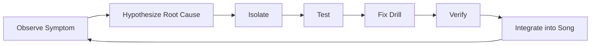
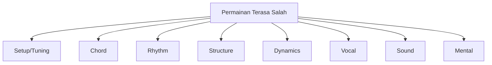
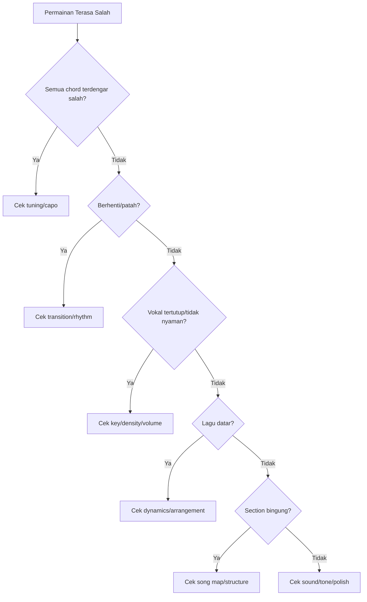
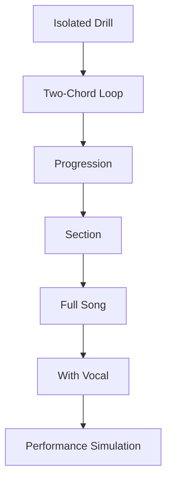
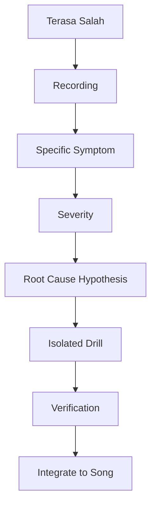

# learn-guitar-accompaniment-part-030.md

# Part 030 — Debugging Guide untuk Pemula Deterministik: Kenapa Permainan Terasa “Salah” dan Cara Memperbaikinya

## Status Seri

Seri: **Belajar Guitar Accompaniment Berdasarkan The First 20 Hours**  
Bagian: **030 dari 035**  
Fokus: memberikan panduan debugging sistematis untuk pemula yang berpikir deterministik, agar masalah dalam bermain gitar dapat didiagnosis berdasarkan symptom, kemungkinan root cause, dan tindakan perbaikan.

Bagian ini dirancang khusus untuk konteks Anda sebagai software engineer: gunakan cara berpikir debugging, observability, hypothesis testing, dan root-cause analysis — tetapi tetap ingat bahwa musik tidak selalu biner seperti compiler.

---

## Tujuan Pembelajaran Part Ini

Setelah menyelesaikan part ini, Anda harus bisa:

1. mengubah rasa “permainan saya salah” menjadi diagnosis spesifik;
2. membedakan masalah tuning, chord, rhythm, dynamics, vocal support, arrangement, dan sound;
3. membuat debugging flow yang tidak panik;
4. menentukan P0/P1/P2 issue;
5. menggunakan recording sebagai log;
6. melakukan isolate-reproduce-fix-verify;
7. memilih drill berdasarkan root cause;
8. menghindari over-analysis;
9. membuat bug log latihan;
10. memperbaiki permainan secara iteratif.

---

## Prinsip Kaufman yang Dipakai di Part Ini

Kaufman menekankan belajar cukup untuk self-correction. Debugging guide ini adalah alat self-correction.

Masalah pemula sering berupa rasa global:

```text
Kok jelek ya?
Kok nggak enak?
Kok beda dari tutorial?
Kok terasa salah?
```

Kalimat seperti itu belum bisa ditindaklanjuti. Kita perlu mengubahnya menjadi:

```text
Tempo naik di chorus.
C telat setelah Em.
Verse terlalu ramai untuk vokal.
D terdengar muddy karena senar 6 ikut.
Capo 2 membuat gitar sharp.
Ending tidak jelas karena belum ada cue.
```

Diagnosis spesifik menghasilkan latihan spesifik.

---

# 1. Prinsip Debugging Musik

Gunakan loop:

```text
Observe → Hypothesize → Isolate → Test → Fix → Verify → Integrate
```



Contoh:

```text
Symptom: chorus terasa kacau
Hypothesis: tempo naik karena strumming terlalu keras
Isolate: chorus only with metronome
Test: record at 70 BPM
Fix: reduce density + smaller motion
Verify: chorus recording stabil
Integrate: full song run
```

---

# 2. Jangan Debug Semua Sekaligus

Jika Anda mencoba memperbaiki:

- chord;
- strumming;
- tempo;
- dynamics;
- singing;
- capo;
- voicing;
- ending;

dalam satu run, otak overload.

Aturan:

```text
Satu run = satu fokus utama.
```

Contoh:

```text
Run 1: hanya tempo.
Run 2: hanya chord transition.
Run 3: hanya vocal space.
Run 4: full performance.
```

---

# 3. Observability: Recording adalah Log

Dalam software, log membantu melihat apa yang terjadi. Dalam gitar, recording adalah log.

Tanpa recording:

```text
Saya merasa tadi lumayan.
Saya merasa chorus kacau.
Saya tidak tahu kenapa.
```

Dengan recording:

```text
Chorus naik tempo 8 BPM.
C chord telat setiap setelah Em.
Verse menutup vokal.
Ending stop terlalu cepat.
```

Gunakan HP. Tidak perlu studio.

---

# 4. Symptom Taxonomy

Masalah umum bisa dikelompokkan:

```text
1. Setup/Tuning
2. Chord Cleanliness
3. Chord Transition
4. Rhythm/Tempo
5. Strumming Pattern
6. Fingerpicking
7. Structure
8. Dynamics
9. Vocal Support
10. Capo/Transpose
11. Sound/Tone
12. Mental/Performance
```



Debugging dimulai dengan menentukan kategori.

---

# 5. P0/P1/P2/P3 Severity

## P0 — Fatal

Harus diperbaiki sebelum tampil.

```text
gitar fals
capo salah
tidak tahu struktur
berhenti total
key tidak nyaman untuk penyanyi
ending tidak jelas
intro membuat penyanyi gagal masuk
```

## P1 — High

Sangat mengganggu, tetapi mungkin masih bisa tampil jika terkendali.

```text
tempo drift besar
chord telat berulang
verse menutup vokal
bridge sering lupa
sound feedback risk
```

## P2 — Medium

Perlu diperbaiki, tetapi tidak selalu fatal.

```text
buzzing kecil
pattern kurang halus
dynamics belum maksimal
voicing kurang indah
```

## P3 — Low

Polish.

```text
fill kurang rapi
ornament kurang elegan
tone belum ideal
```

Jangan menghabiskan 80% waktu untuk P3 jika P0 masih ada.

---

# 6. Debugging Setup/Tuning

## Symptom

```text
Semua chord terasa salah.
Chord yang biasanya benar terdengar aneh.
Penyanyi sulit masuk nada.
Gitar terdengar bergelombang.
Capo membuat suara aneh.
```

## Kemungkinan Root Cause

```text
[ ] gitar belum tune
[ ] satu senar out of tune
[ ] capo menarik senar sharp
[ ] capo tidak rata
[ ] senar lama/tidak stabil
[ ] posisi jari menarik string bending
```

## Test

```text
1. cek tuner semua senar
2. mainkan open strings
3. mainkan G, C, D
4. pasang capo lalu cek tuning lagi
5. rekam chord open
```

## Fix

```text
[ ] tune ulang
[ ] pasang capo dekat fret
[ ] kurangi tekanan capo jika adjustable
[ ] ganti senar jika terlalu tua
[ ] jangan menekan string sideways
```

## Severity

Biasanya P0/P1.

---

# 7. Debugging Chord Cleanliness

## Symptom

```text
Chord buzzing.
Ada string mati.
Chord terdengar kotor.
C tidak jernih.
D terdengar muddy.
Fmaj7 tidak keluar.
```

## Kemungkinan Root Cause

```text
[ ] jari jauh dari fret
[ ] jari menyentuh string lain
[ ] tekanan kurang
[ ] tekanan berlebihan dan tangan tegang
[ ] strum dari string yang salah
[ ] chord shape belum otomatis
[ ] kuku terlalu panjang
```

## Test

Gunakan pick-one-by-one.

Contoh C:

```text
C = x32010
Petik senar 5,4,3,2,1 satu-satu.
```

Tandai string bermasalah.

## Fix

```text
[ ] geser jari dekat fret
[ ] gunakan fingertip
[ ] kurangi rebahan jari
[ ] cek thumb position
[ ] latih chord freeze
[ ] strum dari root
```

## Drill

```text
Chord clean test 5 menit.
Bentuk chord → petik satu-satu → koreksi → lepas → ulang.
```

---

# 8. Debugging Chord Transition

## Symptom

```text
Berhenti sebelum chord baru.
Chord telat di beat 1.
G-C selalu lambat.
Em-C membuat tangan panik.
Pattern berhenti saat pindah chord.
```

## Kemungkinan Root Cause

```text
[ ] chord belum otomatis
[ ] jari diangkat terlalu tinggi
[ ] tidak ada anchor finger
[ ] fingering berubah-ubah
[ ] menunggu chord sempurna
[ ] tangan kanan berhenti menunggu tangan kiri
```

## Test

One-minute change drill:

```text
G ↔ C selama 60 detik
Hitung clean-enough changes
```

## Fix

```text
[ ] low-lift drill
[ ] anchor finger
[ ] slow transition
[ ] partial chord fallback
[ ] right hand keeps moving
[ ] practice pair, not full song
```

## Drill

```text
Pair transition 5 menit:
G-C
Em-C
C-Am
D-A
```

## Severity

Jika menyebabkan stop total: P0/P1.

---

# 9. Debugging Rhythm/Tempo

## Symptom

```text
Tempo naik di chorus.
Tempo turun saat chord sulit.
Strumming terasa goyah.
Penyanyi terasa dikejar.
Lagu dragging.
```

## Kemungkinan Root Cause

```text
[ ] tidak menghitung
[ ] tangan kanan terlalu besar
[ ] chord transition sulit
[ ] gugup
[ ] pattern terlalu kompleks
[ ] tidak latihan metronome
[ ] dynamics naik terlalu agresif
```

## Test

```text
1. metronome 70 BPM
2. muted strum 1 menit
3. chord progression 1 menit
4. record
5. dengarkan click alignment
```

## Fix

```text
[ ] turunkan tempo
[ ] simplify pattern
[ ] downstroke only
[ ] smaller right hand motion
[ ] count aloud
[ ] isolate hard section
```

## Drill

```text
Muted strum + metronome.
Progression one strum per bar.
Then add pattern.
```

---

# 10. Debugging Strumming Pattern

## Symptom

```text
Pattern hilang.
Upstroke nyangkut.
Tangan kanan berhenti.
Pattern benar tapi terdengar kaku.
Semua section terdengar sama.
```

## Root Cause

```text
[ ] pattern dihafal visual, bukan dirasakan
[ ] pendulum tangan kanan tidak konsisten
[ ] terlalu cepat
[ ] accent tidak jelas
[ ] dynamics tidak ada
[ ] chord transition mengganggu pattern
```

## Test

```text
muted strings only
count 1 & 2 & 3 & 4 &
main pattern tanpa chord
```

Jika gagal tanpa chord, problem bukan chord.

## Fix

```text
[ ] mute strum
[ ] count aloud
[ ] slow tempo
[ ] use simpler pattern
[ ] add chord only after stable
[ ] keep hand moving through missed strums
```

---

# 11. Debugging Fingerpicking

## Symptom

```text
Picking tidak stabil.
Bass salah.
Jari treble terlalu keras.
Pattern berhenti saat pindah chord.
Tempo melayang.
```

## Root Cause

```text
[ ] thumb belum stabil
[ ] bass string tiap chord belum hafal
[ ] pattern terlalu rumit
[ ] chord transition belum siap
[ ] tangan kanan tegang
```

## Test

```text
thumb only
P-i-m-i satu chord
P-i-m-i progression
```

## Fix

```text
[ ] thumb-only drill
[ ] root bass table
[ ] satu chord dulu
[ ] satu pattern per bar
[ ] metronome lambat
```

---

# 12. Debugging Structure

## Symptom

```text
Lupa masuk chorus.
Bridge hilang.
Intro terlalu panjang.
Ending tidak jelas.
Penyanyi bingung masuk.
```

## Root Cause

```text
[ ] song map tidak ada
[ ] chord chart terlalu panjang
[ ] tidak tahu lyric cue
[ ] tidak menghitung bar
[ ] tidak ada intro/ending agreement
[ ] tidak latihan full run
```

## Test

Tanpa gitar, ucapkan struktur:

```text
Intro → Verse → Chorus → Verse → Chorus → Bridge → Final Chorus → Outro
```

Jika tidak bisa, problem struktur.

## Fix

```text
[ ] buat song map
[ ] tandai lyric cue
[ ] hitung bar intro
[ ] latih transition antar-section
[ ] no-stop full run
```

---

# 13. Debugging Dynamics

## Symptom

```text
Lagu datar.
Chorus tidak naik.
Verse terlalu besar.
Final chorus tidak punya puncak.
Bridge tidak kontras.
```

## Root Cause

```text
[ ] pattern sama semua section
[ ] volume sama
[ ] density sama
[ ] tidak ada dynamic map
[ ] chorus sudah full dari awal
[ ] takut bermain pelan
```

## Test

Rekam verse dan chorus.

Tanya:

```text
Jika saya tidak tahu lirik, apakah saya bisa mendengar section berubah?
```

## Fix

```text
[ ] verse sparse
[ ] chorus fuller
[ ] pre-chorus build
[ ] bridge contrast
[ ] final chorus peak
[ ] use volume ladder
```

---

# 14. Debugging Vocal Support

## Symptom

```text
Penyanyi sulit masuk.
Lirik tidak jelas.
Penyanyi terasa dikejar.
Vokal tertutup gitar.
Key tidak nyaman.
Gitar dan vokal terasa tidak menyatu.
```

## Root Cause

```text
[ ] key/capo salah
[ ] intro cue tidak jelas
[ ] strumming terlalu ramai
[ ] tempo tidak nyaman
[ ] gitar terlalu keras
[ ] tidak mendengar napas vokal
[ ] arrangement terlalu instrumental
```

## Test

Rekam dengan vokal atau vocal recording.

Checklist:

```text
[ ] lirik jelas?
[ ] vocal entry jelas?
[ ] chorus nyaman?
[ ] gitar menutup kata?
[ ] verse punya ruang?
```

## Fix

```text
[ ] key/capo test
[ ] sparse verse
[ ] reduce volume
[ ] clear intro cue
[ ] ask singer feedback
[ ] simplify arrangement
```

---

# 15. Debugging Capo/Transpose

## Symptom

```text
Penyanyi terlalu tinggi.
Verse terlalu rendah.
Chord shape benar tapi sound salah.
Band/musisi lain bingung.
Gitar fals setelah capo.
```

## Root Cause

```text
[ ] capo position salah
[ ] shape vs sounding key bingung
[ ] capo menarik string sharp
[ ] key dicek dari verse saja
[ ] tidak mencatat capo per lagu
```

## Test

```text
[ ] tulis shape
[ ] tulis capo
[ ] tulis sounding key
[ ] cek chorus dengan penyanyi
[ ] tune setelah capo
```

## Fix

```text
[ ] capo checklist
[ ] key test chorus
[ ] use shape family
[ ] communicate sounding key
[ ] reposition capo
```

---

# 16. Debugging Sound/Tone

## Symptom

```text
Gitar terlalu keras.
Gitar terlalu kecil.
Gitar boomy.
Gitar tajam.
Feedback.
Fingerpicking hilang.
Chorus pecah.
```

## Root Cause

```text
[ ] volume tangan kanan
[ ] pickup gain
[ ] EQ
[ ] mic placement
[ ] room acoustics
[ ] strumming terlalu kuat
[ ] capo tinggi
[ ] pick attack
```

## Test

Rekam dari depan.

Soundcheck:

```text
verse pattern
chorus pattern
fingerpicking
vocal + guitar
```

## Fix

```text
[ ] adjust technique
[ ] adjust volume/gain
[ ] reduce bass/treble
[ ] strum near neck
[ ] change mic position
[ ] control dynamics
```

---

# 17. Debugging Mental/Performance

## Symptom

```text
Bisa latihan, gagal saat dilihat orang.
Tempo naik karena gugup.
Tangan kaku.
Lupa struktur saat recording.
Takut salah.
Setelah salah langsung berhenti.
```

## Root Cause

```text
[ ] tidak ada simulation
[ ] selalu restart saat latihan
[ ] tidak latihan recovery
[ ] terlalu fokus sempurna
[ ] belum pernah rekam video
[ ] belum latihan berdiri
```

## Test

Performance simulation:

```text
record video
stand up
no stop
one full run
```

## Fix

```text
[ ] no-stop rule
[ ] forced mistake drill
[ ] breathing
[ ] simplify arrangement
[ ] perform for one friend
[ ] repeat simulation
```

---

# 18. Decision Tree Global Debugging



Gunakan dari atas ke bawah. Jangan mulai dari polish.

---

# 19. Isolate-Reproduce-Fix-Verify

Ini framework paling penting.

## 19.1 Isolate

Ambil bagian kecil.

```text
Bukan full song.
Ambil 2 chord atau 2 bar.
```

## 19.2 Reproduce

Pastikan bug muncul.

```text
Em-C selalu telat.
Chorus selalu rushing.
D selalu muddy.
```

## 19.3 Fix

Pilih drill spesifik.

```text
Em-C low-lift drill.
Chorus metronome.
D strum from string 4.
```

## 19.4 Verify

Cek apakah bug berkurang.

```text
record again.
compare.
```

## 19.5 Integrate

Masukkan kembali ke lagu.

```text
section → full run.
```

---

# 20. Example Debugging: “Chorus Kacau”

Symptom:

```text
Chorus kacau.
```

Terlalu global. Breakdown:

```text
Apakah chord salah?
Apakah tempo naik?
Apakah pattern hilang?
Apakah vokal tertutup?
Apakah dynamic terlalu besar?
```

Test:

1. main chorus muted dengan metronome;
2. main chord only;
3. main pattern only;
4. rekam dengan vokal.

Diagnosis:

```text
Tempo naik karena strumming chorus terlalu besar.
```

Fix:

```text
Chorus at 70 BPM.
Smaller right hand.
Pattern simplified.
```

Verify:

```text
Record chorus 2x.
```

---

# 21. Example Debugging: “C Chord Jelek”

Symptom:

```text
C jelek.
```

Test:

```text
C = x32010
petik string 5,4,3,2,1
```

Findings:

```text
string 1 mati
string 3 buzzing
senar 6 ikut saat strum
```

Root cause:

```text
telunjuk rebah, jari tengah jauh dari fret, right hand start salah
```

Fix:

```text
fingertip index
middle near fret
strum from string 5
```

Drill:

```text
C clean test 5 minutes
C-Am transition 3 minutes
G-C transition 3 minutes
```

---

# 22. Example Debugging: “Penyanyi Tidak Nyaman”

Symptom:

```text
Penyanyi terlihat susah.
```

Possible causes:

```text
key terlalu tinggi
tempo terlalu cepat
gitar terlalu ramai
intro cue tidak jelas
chorus terlalu keras
monitor/balance buruk
```

Test:

```text
Ask specific questions:
Chorus terlalu tinggi?
Verse terlalu rendah?
Tempo terlalu cepat?
Gitar terlalu ramai?
Kapan kamu butuh ruang?
```

Fix:

- capo turun/naik;
- sparse verse;
- slower tempo;
- clearer cue;
- lower volume.

---

# 23. Example Debugging: “Lagu Datar”

Symptom:

```text
Tidak ada emosi.
```

Possible causes:

```text
dynamics sama
pattern sama
voicing sama
tone sama
chorus tidak naik
bridge tidak kontras
vokal tidak didukung
```

Test:

Rekam intro-verse-chorus-bridge-final.

Tanya:

```text
Apakah chorus jelas lebih besar?
Apakah bridge berbeda?
Apakah final chorus puncak?
```

Fix:

```text
dynamic map
verse sparse
pre build
chorus full
bridge drop
final peak
```

---

# 24. Example Debugging: “Saya Selalu Berhenti Saat Salah”

Symptom:

```text
Setiap error langsung stop.
```

Root cause:

```text
latihan selalu restart
tidak pernah forced mistake
mental model perfect-run
tidak punya fallback
```

Fix:

```text
no-stop rule
muted strum recovery
root note fallback
forced mistake drill
post-mortem setelah run
```

Drill:

```text
Main G-D-Em-C.
Sengaja salah chord sekali.
Lanjut sampai 1 menit.
```

---

# 25. Bug Log Template

```text
# Guitar Bug Log

Date:
Song:
Symptom:
Severity:
Where it happens:
Reproducible? yes/no
Hypothesis:
Test:
Root cause:
Fix drill:
Verification:
Next action:
```

Contoh:

```text
Date: Jun 26
Song: Song A
Symptom: C telat di chorus
Severity: P1
Where: Em -> C
Reproducible: yes
Hypothesis: fingers lift too high
Test: Em-C one-minute drill
Root cause: C shape not automatic
Fix drill: low-lift Em-C at 60 BPM
Verification: changes/min 31 -> 39
Next action: integrate into chorus
```

---

# 26. Top 20 Symptoms and Quick Fixes

| Symptom | Quick Fix |
|---|---|
| Semua chord salah | tune gitar |
| D muddy | strum dari senar 4 |
| C string 1 mati | fingertip index |
| G-C lambat | pair drill |
| Pattern hilang | muted strum |
| Tempo naik | smaller motion |
| Tempo turun | simplify chord |
| Verse ramai | sparse strum |
| Chorus lemah | tambah density |
| Bridge lupa | song map |
| Ending ragu | ending drill |
| Vocal entry kacau | intro agreement |
| Penyanyi teriak | transpose turun |
| Verse terlalu rendah | transpose naik/compromise |
| Gitar tajam | soft attack |
| Gitar boomy | reduce bass |
| Picking goyah | thumb-only |
| Capo fals | reposition/tune |
| Gugup stop | no-stop drill |
| Lagu datar | dynamic map |

---

# 27. Drill Selector

| Root Cause | Drill |
|---|---|
| Chord not clean | pick-one-by-one |
| Transition slow | one-minute pair change |
| Rhythm unstable | metronome muted strum |
| Pattern not internal | count aloud + muted |
| Fingerpicking weak | thumb-only + P-i-m-i |
| Structure weak | song map recitation |
| Vocal support weak | play with vocal recording |
| Dynamics weak | verse/chorus contrast drill |
| Capo confusion | shape/sound key table |
| Performance panic | no-stop simulation |

---

# 28. Debugging Session 45 Menit

## Block 1 — Record, 5 Menit

Mainkan section atau lagu.

## Block 2 — Observe, 5 Menit

Dengarkan dan catat 3 bug.

## Block 3 — Prioritize, 3 Menit

Pilih bug P0/P1 terbesar.

## Block 4 — Isolate, 7 Menit

Ambil 2 chord/bar/section.

## Block 5 — Drill, 15 Menit

Latih root cause.

## Block 6 — Verify, 5 Menit

Rekam lagi bagian yang sama.

## Block 7 — Integrate, 5 Menit

Masukkan ke song context.

---

# 29. Debugging Session 15 Menit

```text
3 menit  record section
2 menit  identify bug
5 menit  isolate drill
3 menit  verify recording
2 menit  log next action
```

Jika hanya 5 menit:

```text
1 menit  play bug section
3 menit  drill root cause
1 menit  note
```

---

# 30. Anti-Pattern Debugging

## 30.1 Random Repetition

```text
Main ulang terus tanpa tahu kenapa salah.
```

Fix:

```text
record → identify → drill.
```

## 30.2 Tutorial Hopping

```text
Setiap bug dicari tutorial baru.
```

Fix:

```text
gunakan existing framework dulu.
```

## 30.3 Over-Theorizing

```text
Menganalisis progression 1 jam tanpa main.
```

Fix:

```text
teori → tindakan 5 menit.
```

## 30.4 Fixing Polish Before Foundation

```text
Belajar sus chord sementara tempo runtuh.
```

Fix:

```text
P0/P1 dulu.
```

## 30.5 Self-Blame Instead of Diagnosis

```text
Saya tidak berbakat.
```

Fix:

```text
Bug spesifik apa?
```

---

# 31. Deterministic Thinking: Kekuatan dan Batas

## Kekuatan

Cara pikir deterministic membantu:

- membuat checklist;
- memecah skill;
- membuat practice log;
- debugging root cause;
- tracking progress;
- menghindari latihan random.

## Batas

Musik tidak selalu punya satu jawaban benar.

Kadang ada beberapa arrangement valid. Kadang “cukup baik” lebih penting daripada “optimal”. Kadang feel tidak bisa dijelaskan 100% dengan aturan.

Gunakan engineering mindset untuk struktur, tetapi gunakan telinga untuk keputusan akhir.

---

# 32. “Compiler Error” vs “Runtime Feel”

Dalam code, compiler error jelas. Dalam musik, banyak error bersifat runtime feel.

Compiler-like error:

```text
gitar fals
chord salah
capo salah
struktur lupa
tempo runtuh
```

Runtime feel issue:

```text
verse kurang ruang
chorus kurang lift
vokal kurang nyaman
tone terlalu tajam
groove kaku
```

Keduanya perlu didiagnosis, tetapi runtime feel butuh rekaman dan feedback manusia.

---

# 33. Root Cause vs Symptom

Contoh:

```text
Symptom: chorus kacau
Root cause: chord C telat
Deeper cause: transisi Em-C belum otomatis
Deeper cause: latihan selalu mulai dari awal, tidak isolate pair
```

Cari root cause yang bisa dilatih.

Jangan berhenti di symptom.

---

# 34. Verification Criteria

Setelah fix, tentukan bukti.

Contoh:

```text
Bug: Em-C telat
Metric: changes/min naik dari 25 ke 35
Verification: chorus full run tanpa stop 2x
```

Bug:

```text
Verse menutup vokal
Metric: vocal support score naik dari 2 ke 4
Verification: recording dengan vocal lebih jelas
```

---

# 35. Regression

Bug bisa kembali.

Contoh:

- C sudah bersih saat drill, tetapi mati lagi saat full song;
- tempo stabil saat metronome, naik saat vokal masuk;
- ending bagus sendiri, ragu dengan penyanyi.

Artinya fix belum terintegrasi.

Solusi:

```text
drill → section → full song → vocal → simulation
```

---

# 36. Debugging Integration Ladder



Jangan menganggap bug selesai hanya karena berhasil di isolated drill.

---

# 37. Debugging Checklist Sebelum Bertanya ke Orang Lain

Sebelum bertanya “kenapa ini jelek?”, cek:

```text
[ ] gitar sudah tune?
[ ] chord dipetik satu-satu?
[ ] tempo dicek metronome?
[ ] sudah direkam?
[ ] sudah tahu section bug?
[ ] sudah isolate 2 bar?
[ ] sudah coba pattern lebih sederhana?
[ ] sudah cek vocal/key?
[ ] sudah cek sound dari depan?
```

Jika sudah, pertanyaan ke guru/teman akan jauh lebih spesifik.

---

# 38. Cara Meminta Feedback yang Baik

Buruk:

```text
Gimana?
```

Lebih baik:

```text
Apakah tempo chorus terasa naik?
Apakah verse terlalu ramai untuk vokal?
Apakah C chord terdengar kotor?
Apakah ending sudah jelas?
Apakah gitar terlalu keras?
```

Feedback spesifik menghasilkan perbaikan spesifik.

---

# 39. Debugging with Singer

Saat dengan penyanyi, gunakan pertanyaan:

```text
Key ini nyaman?
Bagian mana paling berat?
Gitar terlalu ramai di mana?
Cue masuk jelas?
Ending terasa natural?
Tempo terlalu cepat/lambat?
```

Jangan hanya bertanya:

```text
Enak nggak?
```

---

# 40. Debugging Prioritas Mingguan

Setiap minggu pilih:

```text
1 technical bug
1 musical bug
1 performance bug
```

Contoh:

```text
Technical: G-C transition
Musical: verse too dense
Performance: ending cue
```

Ini membuat progress seimbang.

---

# 41. Latihan 45 Menit untuk Part Ini

## Block 1 — Full Run Recording, 8 Menit

Mainkan satu lagu target.

## Block 2 — Bug List, 5 Menit

Tulis maksimal 5 bug.

## Block 3 — Severity, 3 Menit

Tandai P0/P1/P2.

## Block 4 — Root Cause Analysis, 7 Menit

Pilih satu bug terbesar.

## Block 5 — Isolated Drill, 12 Menit

Latih root cause.

## Block 6 — Verify, 5 Menit

Rekam bagian sama.

## Block 7 — Bug Log, 5 Menit

Tulis next action.

---

# 42. Latihan 15 Menit

```text
3 menit  record section
2 menit  identify one bug
5 menit  drill root cause
3 menit  verify
2 menit  log
```

Jika hanya 5 menit:

```text
1 menit  play problematic transition
3 menit  drill
1 menit  note next action
```

---

# 43. Mini Project Part Ini

Ambil satu lagu yang terasa “belum enak”.

Buat bug report lengkap:

```text
Song:
Recording date:
Symptom:
Severity:
Timestamp/section:
Hypothesis:
Test:
Root cause:
Fix drill:
Verification result:
Next action:
```

Target:

> Mengubah rasa kabur menjadi tindakan latihan yang jelas.

---

# 44. Kesalahan Engineer-Minded dalam Debugging

## 44.1 Ingin Root Cause Tunggal Selalu

Kadang masalah gabungan: tempo + dynamics + vocal support.

## 44.2 Terlalu Lama Menganalisis Tanpa Bermain

Debugging harus kembali ke drill.

## 44.3 Menganggap Musik Harus Deterministik 100%

Ada ruang interpretasi. Gunakan telinga dan feedback.

## 44.4 Menolak “Cukup Baik”

Performance membutuhkan threshold, bukan kesempurnaan.

## 44.5 Mengabaikan Emosi

Jika semua benar tapi tidak menyentuh, masalahnya mungkin dynamics, phrasing, atau vocal support, bukan chord.

---

# 45. Master Debugging Matrix

| Category | Symptom | First Check | Likely Fix |
|---|---|---|---|
| Tuning | semua chord salah | tuner | tune/capo |
| Chord | string mati | pick one-by-one | finger placement |
| Transition | stop before chord | pair drill | low-lift |
| Rhythm | tempo drift | metronome recording | simplify/count |
| Strumming | pattern hilang | muted strum | slow/count |
| Picking | bass salah | thumb only | root table |
| Structure | lupa section | song map | section drill |
| Dynamics | lagu datar | verse/chorus recording | dynamic map |
| Vocal | lirik tertutup | vocal recording | reduce density |
| Capo | key salah | shape/sound note | capo sheet |
| Sound | tone buruk | front recording | technique/EQ |
| Mental | panik | simulation | no-stop drill |

---

# 46. Acceptance Criteria Part 030

Anda boleh lanjut ke part 031 jika:

```text
[ ] Bisa menjelaskan observe-hypothesize-isolate-test-fix-verify
[ ] Bisa mengelompokkan bug ke kategori tuning/chord/rhythm/dynamics/vocal/sound
[ ] Bisa memberi severity P0/P1/P2/P3
[ ] Bisa membuat bug log
[ ] Bisa melakukan isolate-reproduce-fix-verify untuk satu masalah
[ ] Bisa memilih drill berdasarkan root cause
[ ] Bisa menggunakan recording sebagai log
[ ] Bisa membedakan symptom dan root cause
[ ] Bisa meminta feedback spesifik
[ ] Bisa menghindari over-analysis dan kembali ke latihan
```

---

# 47. Ringkasan Mental Model

Debugging musik adalah proses mengubah ketidakjelasan menjadi tindakan.



Jangan berkata “saya jelek”. Katakan:

```text
Bug apa?
Di mana?
Kenapa?
Fix drill apa?
Buktinya membaik atau tidak?
```

Itu cara software engineer belajar musik tanpa kehilangan sisi musikalnya.

---

# 48. Output Part Ini

Output konkret:

1. Anda punya debugging framework.
2. Anda bisa membuat bug log.
3. Anda tahu drill untuk root cause umum.
4. Anda bisa memprioritaskan P0/P1.
5. Anda bisa menggunakan recording untuk self-correction.
6. Anda siap masuk ke roadmap 20 jam jam-demi-jam.

Part berikutnya:

> **20-Hour Roadmap Jam demi Jam: Dari Nol ke Siap Mengiringi.**

