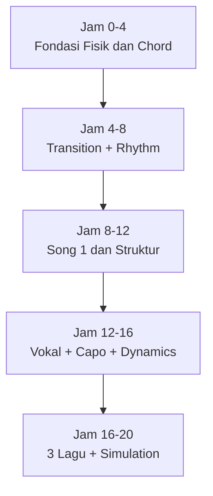
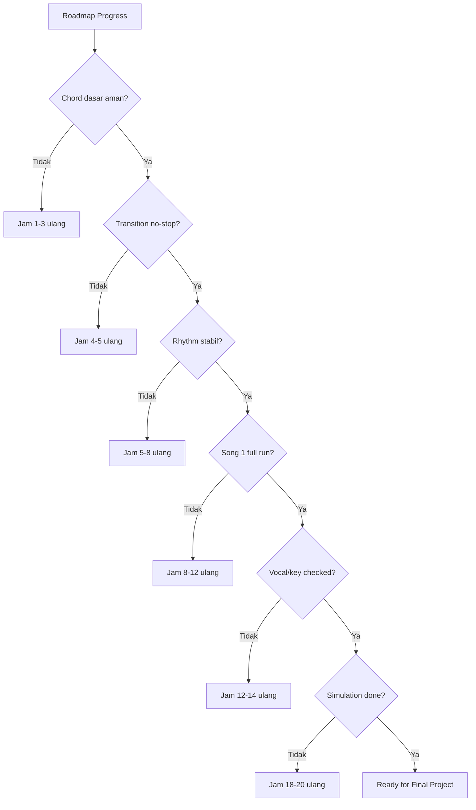
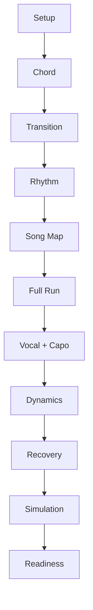

# learn-guitar-accompaniment-part-031.md

# Part 031 — 20-Hour Roadmap Jam demi Jam: Dari Nol ke Siap Mengiringi

## Status Seri

Seri: **Belajar Guitar Accompaniment Berdasarkan The First 20 Hours**  
Bagian: **031 dari 035**  
Fokus: menyusun roadmap latihan 20 jam secara sangat konkret, jam demi jam, agar semua materi sebelumnya berubah menjadi sesi latihan yang executable.

Part ini adalah rencana implementasi. Jika part 017 membahas sistem latihan, part ini memberi **urutan jam demi jam**: apa yang dilatih, output apa yang harus muncul, metrik apa yang dicatat, dan kapan harus lanjut atau rollback.

---

## Tujuan Pembelajaran Part Ini

Setelah menyelesaikan part ini, Anda harus bisa:

1. menjalankan latihan 20 jam dengan urutan yang jelas;
2. tahu fokus setiap jam latihan;
3. tahu output konkret setiap fase;
4. tahu kapan harus lanjut dan kapan harus memperbaiki bottleneck;
5. menghindari latihan random;
6. menghubungkan chord, rhythm, lagu, vokal, dynamics, capo, dan performance;
7. memakai checkpoint 5, 10, 15, dan 20 jam;
8. membuat practice log yang sesuai dengan roadmap;
9. mengukur readiness secara realistis;
10. menyelesaikan 20 jam pertama dengan minimal 3 lagu target yang playable.

---

## Prinsip Kaufman yang Dipakai di Part Ini

Josh Kaufman menekankan bahwa 20 jam pertama harus berupa deliberate practice terhadap sub-skill paling penting. Bukan 20 jam konsumsi materi. Bukan 20 jam “main-main”. Bukan 20 jam menunggu siap.

Roadmap ini mengikuti prinsip:

```text
Deconstruct skill → Choose critical subskills → Remove barriers → Practice actively → Self-correct
```

Target akhir 20 jam:

> Anda bisa mengiringi penyanyi untuk 3 lagu sederhana dengan chord, rhythm, intro, ending, dynamics, capo/key, dan recovery yang cukup aman.

Bukan target akhir:

```text
menjadi gitaris profesional
menguasai semua chord
menguasai fingerstyle kompleks
menguasai teori lengkap
memainkan semua lagu favorit
```

---

# 1. Struktur Besar 20 Jam

Roadmap dibagi menjadi 5 fase.



## Fase 1 — Jam 0–4

Fokus:

```text
setup
tuning
posture
chord dasar
chord cleanliness
```

## Fase 2 — Jam 4–8

Fokus:

```text
transition
right-hand clock
strumming pattern
metronome
```

## Fase 3 — Jam 8–12

Fokus:

```text
safe song
song map
intro
ending
full run
```

## Fase 4 — Jam 12–16

Fokus:

```text
capo/key
vocal support
dynamics
song 2
```

## Fase 5 — Jam 16–20

Fokus:

```text
song 3
recovery
performance simulation
readiness
```

---

# 2. Aturan Roadmap

Roadmap ini fleksibel tetapi punya aturan.

## 2.1 Jangan Lanjut Jika P0 Belum Beres

Contoh P0:

```text
gitar tidak tune
tidak bisa chord dasar sama sekali
selalu berhenti total di progression
tidak tahu struktur lagu
key vokal tidak cocok
ending tidak jelas
```

Jika P0 muncul, rollback ke latihan terkait.

## 2.2 Jangan Menambah Lagu Terlalu Cepat

Batas:

```text
Jam 0–8  : maksimal 1 lagu utama
Jam 8–14 : maksimal 2 lagu
Jam 14–20: maksimal 3 lagu
```

## 2.3 Setiap Jam Harus Ada Output

Output bisa berupa:

- metric;
- recording;
- song map;
- practice log;
- full run;
- bug log;
- readiness score.

Jika tidak ada output, latihan sulit diukur.

## 2.4 Recording Wajib Mulai Jam 5

Sebelum jam 5, recording optional. Setelah jam 5, recording menjadi wajib minimal beberapa menit per sesi.

## 2.5 No-Stop Run Mulai Jam 8

Mulai jam 8, Anda harus melatih no-stop run. Jika salah, lanjut.

---

# 3. Roadmap Ringkas Jam demi Jam

| Jam | Fokus Utama | Output |
|---:|---|---|
| 0–1 | Setup, tuning, posture | pre-flight checklist |
| 1–2 | Open strings, chord Em/G/C/D/Am | chord clean notes |
| 2–3 | Chord cleanliness | chord clean rate |
| 3–4 | Chord recall + first progression | G-D-Em-C one strum |
| 4–5 | Pair transition | changes/min |
| 5–6 | Right-hand clock | muted strum recording |
| 6–7 | Strumming pattern | pattern on progression |
| 7–8 | Progression stability | 1-min no-stop progression |
| 8–9 | Song 1 selection + map | song map |
| 9–10 | Song 1 sections | intro/verse/chorus |
| 10–11 | Song 1 full run | recording |
| 11–12 | Song 1 refinement | bug log |
| 12–13 | Capo/key/vocal check | key decision |
| 13–14 | Vocal support | vocal-aware map |
| 14–15 | Dynamics + song 2 | dynamic map |
| 15–16 | Song 2 full run | recording |
| 16–17 | Song 3 selection | simplified arrangement |
| 17–18 | Error handling | forced mistake drill |
| 18–19 | Setlist simulation | 2–3 songs run |
| 19–20 | Final readiness | go/no-go score |

---

# 4. Jam 0–1: Setup dan Friction Removal

## Fokus

Sebelum skill, pastikan environment tidak melawan Anda.

Latih:

```text
tuning
posture
pick grip
guitar position
practice area
accessories
```

## Checklist

```text
[ ] gitar mudah dijangkau
[ ] tuner siap
[ ] capo siap
[ ] pick siap
[ ] metronome app siap
[ ] HP recording siap
[ ] chord sheet kosong/template siap
[ ] kursi/posisi nyaman
```

## Latihan

```text
10 menit  tuning E A D G B E
10 menit  posture seated/standing
10 menit  pick grip + open string downstroke
10 menit  muted strum ringan
10 menit  setup checklist
10 menit  catatan friction
```

## Output

```text
Pre-flight checklist pribadi
```

## Acceptance

```text
[ ] bisa tune dengan tuner
[ ] tahu string 6–1
[ ] bisa duduk/berdiri stabil
[ ] bisa strum open strings tanpa tegang
```

---

# 5. Jam 1–2: Chord Dasar Pertama

## Fokus

Chord:

```text
Em
G
C
D
Am
```

Urutan latihan:

```text
Em → G → C → D → Am
```

## Latihan

```text
10 menit  Em dan G
10 menit  C
10 menit  D
10 menit  Am
10 menit  pick-one-by-one
10 menit  chord recall
```

## Output

Chord notes:

```text
Em:
G:
C:
D:
Am:
Hardest chord:
Most muted string:
```

## Acceptance

```text
[ ] bisa membentuk Em
[ ] bisa membentuk G
[ ] bisa membentuk C walau belum sempurna
[ ] bisa membentuk D
[ ] bisa membentuk Am
[ ] tahu string mana yang tidak boleh dimainkan pada C dan D
```

---

# 6. Jam 2–3: Chord Cleanliness

## Fokus

Chord clean test.

Tidak perlu sempurna, tetapi harus cukup valid.

## Latihan

Untuk setiap chord:

```text
bentuk chord
petik string target satu-satu
identifikasi bug
koreksi
lepas
ulang
```

## Metrik

```text
Chord clean rate:
Em:
G:
C:
D:
Am:
```

Jika sebuah chord punya 5 string target dan 4 berbunyi, clean rate 80%.

## Target

```text
Em/G >= 80%
C/D/Am >= 60–70%
```

Ini cukup untuk mulai transition.

## Output

```text
Chord clean rate log
```

---

# 7. Jam 3–4: Chord Recall dan Progression Pertama

## Fokus

Mulai menghubungkan chord menjadi progression.

Progression utama:

```text
G - D - Em - C
```

## Latihan

```text
10 menit  chord recall tanpa melihat diagram
10 menit  G-D pair slow
10 menit  D-Em pair slow
10 menit  Em-C pair slow
10 menit  G-D-Em-C one strum per chord
10 menit  recording 30 detik
```

## Aturan

Jangan pakai strumming pattern kompleks.

Gunakan:

```text
satu strum per chord
```

## Output

```text
Recording pertama progression
Hardest transition:
```

## Acceptance

```text
[ ] bisa memainkan G-D-Em-C sangat lambat
[ ] tidak harus bersih sempurna
[ ] tahu transition paling sulit
```

---

# 8. Checkpoint 4 Jam

Tanya:

```text
[ ] Apakah gitar tune?
[ ] Apakah 5 chord dasar sudah dikenal?
[ ] Apakah progression G-D-Em-C bisa dimainkan lambat?
[ ] Apakah saya tahu chord/transition tersulit?
```

Jika belum, ulang jam 2–4. Jangan lanjut ke lagu penuh.

---

# 9. Jam 4–5: Pair Transition Drill

## Fokus

Transition adalah bottleneck utama.

Pair utama:

```text
G ↔ D
D ↔ Em
Em ↔ C
G ↔ C
C ↔ Am
```

## Latihan

One-minute changes:

```text
60 detik G-D
60 detik D-Em
60 detik Em-C
60 detik G-C
60 detik C-Am
```

Ulang 2 putaran.

## Catat

```text
G-D:
D-Em:
Em-C:
G-C:
C-Am:
```

## Target Awal

```text
20+ changes/min = mulai connect
30+ changes/min = cukup bagus untuk slow song
```

## Output

```text
changes/min table
```

---

# 10. Jam 5–6: Right Hand sebagai Clock

## Fokus

Tangan kanan harus stabil walau tangan kiri belum sempurna.

Latihan muted strum:

```text
D D D D
```

Hitung:

```text
1 2 3 4
```

Lalu:

```text
D U D U D U D U
```

Hitung:

```text
1 & 2 & 3 & 4 &
```

## Latihan

```text
10 menit  muted downstroke 60 BPM
10 menit  muted down-up 60 BPM
10 menit  Em downstroke per beat
10 menit  G-D-Em-C one chord per bar
10 menit  recording metronome
10 menit  review
```

## Output

```text
Muted strum recording
Tempo notes:
```

## Acceptance

```text
[ ] bisa mute strum 1 menit
[ ] bisa count aloud
[ ] tangan kanan tidak langsung berhenti saat chord telat
```

---

# 11. Jam 6–7: Strumming Pattern Minimum

## Fokus

Pattern pertama:

```text
D - D U - U D U
```

Tetapi mulai dari simpler ladder.

## Ladder

```text
Level 1: D - - - D - - -
Level 2: D - D - D - D -
Level 3: D - D U D - D U
Level 4: D - D U - U D U
```

## Latihan

```text
10 menit  pattern muted
10 menit  pattern on Em
10 menit  pattern on G
10 menit  G-D loop
10 menit  G-D-Em-C
10 menit  recording
```

## Output

```text
Pattern level reached:
```

## Acceptance

```text
[ ] bisa memainkan minimal level 2 dengan chord
[ ] level 3/4 boleh belum sempurna
[ ] rhythm tidak stop total
```

---

# 12. Jam 7–8: Progression Stability

## Fokus

Progression harus bisa berjalan 1 menit.

Progression:

```text
G - D - Em - C
```

## Latihan

```text
10 menit  one strum per chord
10 menit  downstroke per beat
10 menit  pattern sederhana
10 menit  no-stop 1 menit
10 menit  recording + review
10 menit  bug drill terbesar
```

## Metrik

```text
Stop count:
Tempo:
Worst transition:
Chord cleanliness:
```

## Acceptance

```text
[ ] bisa 1 menit progression tanpa stop total
[ ] jika chord telat, tetap lanjut
[ ] bug terbesar diketahui
```

---

# 13. Checkpoint 8 Jam

Jika Anda sampai sini, seharusnya:

```text
[ ] bisa tune
[ ] tahu chord dasar
[ ] punya transition metrics
[ ] bisa muted strum
[ ] bisa progression 1 menit
[ ] punya recording
```

Jika belum bisa progression no-stop, jangan masuk lagu penuh dulu. Ulang jam 4–8.

---

# 14. Jam 8–9: Pilih Song 1 dan Buat Song Map

## Fokus

Pilih safe song.

Kriteria:

```text
3–5 chord
tempo lambat/sedang
struktur jelas
key bisa disesuaikan
tidak banyak barre chord
```

Jika belum punya lagu nyata, gunakan practice song dengan progression:

```text
G-D-Em-C
```

## Output Song Map

```text
Title:
Key/capo:
Tempo:
Feel:
Intro:
Verse:
Chorus:
Bridge:
Outro:
```

## Latihan

```text
20 menit  pilih/validasi lagu
20 menit  tulis song map
20 menit  main section satu-satu
```

## Acceptance

```text
[ ] song map selesai
[ ] tahu intro
[ ] tahu chorus
[ ] tahu ending kandidat
```

---

# 15. Jam 9–10: Song 1 Section Practice

## Fokus

Latih section, bukan full song dulu.

## Latihan

```text
10 menit  intro
10 menit  verse
10 menit  chorus
10 menit  verse → chorus transition
10 menit  ending
10 menit  section recording
```

## Aturan

Jangan memperbaiki semua sekaligus.

Pilih:

```text
intro jelas
verse stabil
chorus naik sedikit
ending final chord
```

## Output

```text
Song 1 section notes
```

---

# 16. Jam 10–11: Song 1 Full Run Pertama

## Fokus

Full run no-stop.

Aturan:

```text
jika salah, lanjut
jangan restart
catat setelah selesai
```

## Latihan

```text
10 menit  warm-up
10 menit  section hardest
5 menit   pre-run checklist
5 menit   full run
10 menit  recording review
10 menit  fix P0/P1
10 menit  second run partial/full
```

## Output

```text
Full run recording
Bug log:
```

## Acceptance

```text
[ ] full run selesai walau jelek
[ ] bug terbesar diketahui
[ ] tidak berhenti total lebih dari beberapa kali
```

---

# 17. Jam 11–12: Song 1 Refinement

## Fokus

Perbaiki 1–2 bug terbesar.

Contoh bug:

```text
C telat
chorus tempo naik
ending ragu
verse terlalu ramai
```

## Latihan

```text
15 menit  bug drill
15 menit  apply to section
10 menit  full run
10 menit  review
10 menit  update arrangement sheet
```

## Output

```text
Song 1 arrangement v1
```

## Acceptance

```text
[ ] intro lebih jelas
[ ] ending dipilih
[ ] full run kedua lebih baik dari pertama
```

---

# 18. Checkpoint 12 Jam

Tanya:

```text
[ ] Song 1 bisa full run?
[ ] Ada recording?
[ ] Intro jelas?
[ ] Ending jelas?
[ ] Bug terbesar tercatat?
```

Jika song 1 belum full run, jangan tambah song 2. Stabilkan dulu.

---

# 19. Jam 12–13: Capo dan Key Vokal

## Fokus

Sesuaikan dengan penyanyi atau vocal range.

Jika ada penyanyi:

```text
test chorus
test verse
pilih capo/key
```

Jika belum ada penyanyi:

```text
nyanyi/hum sendiri
gunakan vocal recording
siapkan 2 opsi capo
```

## Latihan

```text
15 menit  capo shape/sound test
15 menit  chorus key test
10 menit  verse low check
10 menit  update key/capo
10 menit  play song 1 in chosen key
```

## Output

```text
Song 1 key/capo decision:
Backup key:
```

## Acceptance

```text
[ ] key/capo tertulis
[ ] tahu shape dan sounding key
[ ] chorus tidak terlalu tinggi/rendah untuk target vocal
```

---

# 20. Jam 13–14: Vocal Support

## Fokus

Gitar harus mendukung vokal.

Latihan dengan:

- penyanyi;
- vocal recording;
- hum sendiri.

## Latihan

```text
10 menit  vocal entry
10 menit  verse sparse
10 menit  chorus support
10 menit  balance/density review
10 menit  run with vocal
10 menit  note fixes
```

## Output

```text
Vocal-aware map:
Vocal entry:
Where guitar must be sparse:
Where chorus lifts:
```

## Acceptance

```text
[ ] vocal entry jelas
[ ] verse tidak menutup vokal
[ ] chorus mendukung
```

---

# 21. Jam 14–15: Dynamics dan Song 2

## Fokus

Mulai song 2 sebagai growth song, tetapi tetap latih dynamics.

## Song 2 Kriteria

```text
sedikit lebih sulit dari song 1
mungkin ada Fmaj7
mungkin 6/8
mungkin fingerpicking
tetapi tetap realistis
```

## Latihan

```text
15 menit  choose song 2
10 menit  song 2 map
10 menit  chord/transition check
10 menit  dynamic map song 1
10 menit  verse/chorus contrast
5 menit   notes
```

## Output

```text
Song 2 selected
Song 1 dynamic map
```

---

# 22. Jam 15–16: Song 2 Full Run Awal

## Fokus

Song 2 tidak harus siap, tetapi harus mulai menjadi lagu utuh.

## Latihan

```text
10 menit  song 2 chord transitions
10 menit  song 2 pattern
10 menit  song 2 sections
10 menit  song 2 full run attempt
10 menit  recording review
10 menit  bug drill
```

## Output

```text
Song 2 full run attempt
Bug list:
```

## Acceptance

```text
[ ] song 2 punya map
[ ] full run attempt dilakukan
[ ] tahu apakah song 2 realistis
```

Jika terlalu sulit, simplify atau ganti.

---

# 23. Checkpoint 16 Jam

Tanya:

```text
[ ] Song 1 cukup stabil?
[ ] Song 2 sudah mulai full run?
[ ] Key/capo song 1 jelas?
[ ] Vocal support sudah diuji?
[ ] Dynamics mulai terdengar?
```

Jika Song 2 terlalu sulit, ganti sekarang. Jangan menunggu jam 19.

---

# 24. Jam 16–17: Song 3 Selection dan Arrangement Sederhana

## Fokus

Pilih performance song atau safe backup.

Song 3 sebaiknya:

- cocok untuk penyanyi;
- cukup aman;
- tidak terlalu banyak bottleneck;
- emotional impact baik.

## Latihan

```text
15 menit  pilih song 3
15 menit  scoring difficulty
15 menit  song map + key/capo
10 menit  simplified arrangement
5 menit   next action
```

## Output

```text
Song 3 selected:
Category:
Simplification:
```

## Acceptance

```text
[ ] song 3 realistis
[ ] arrangement minimal ada
[ ] tidak ada P0 obvious
```

---

# 25. Jam 17–18: Error Handling dan Recovery

## Fokus

Latih salah secara sengaja.

## Drills

```text
chord telat
wrong chord
pattern hilang
vocal late entry
pick drop optional
```

## Latihan

```text
10 menit  root note fallback
10 menit  muted strum recovery
10 menit  forced mistake G-D-Em-C
10 menit  song 1 no-stop with forced error
10 menit  song 2 no-stop with forced error
10 menit  post-mortem
```

## Output

```text
Recovery log:
Fallbacks:
```

## Acceptance

```text
[ ] tidak otomatis berhenti saat salah
[ ] tahu fallback root/muted/downstroke
[ ] bisa post-mortem
```

---

# 26. Jam 18–19: Setlist Simulation

## Fokus

Mainkan 2–3 lagu seperti tampil.

Jika 3 lagu belum siap, mainkan:

```text
Song 1 full
Song 2 partial/full
Song 3 simplified
```

## Simulation Rules

```text
[ ] tune dulu
[ ] capo sesuai setlist
[ ] no restart
[ ] record
[ ] intro dan ending real
[ ] jika salah, recover
```

## Output

```text
Setlist simulation recording
Readiness notes:
```

## Acceptance

```text
[ ] minimal 2 lagu bisa selesai
[ ] transisi antar-lagu diuji
[ ] P0 risk terlihat
```

---

# 27. Jam 19–20: Final Readiness dan Next Plan

## Fokus

Evaluasi dan putuskan readiness.

## Latihan

```text
10 menit  warm-up
15 menit  final simulation section/full
10 menit  recording review
10 menit  readiness score
10 menit  P0/P1 list
5 menit   next 20-hour plan
```

## Output

```text
Final readiness dashboard
Go/no-go per song
Next practice focus
```

## Acceptance

```text
[ ] tahu lagu mana performance-ready
[ ] tahu lagu mana masih growth
[ ] punya bug list lanjutan
[ ] punya rencana setelah 20 jam
```

---

# 28. Final 20-Hour Readiness Dashboard

Template:

```text
Total active hours:
Songs attempted:
Songs performance-ready:
Songs growth:
Main strengths:
Main weaknesses:

Song 1:
Key/capo:
Readiness score:
P0:
P1:
Go/no-go:

Song 2:
...

Song 3:
...

Next 5 fixes:
1.
2.
3.
4.
5.
```

---

# 29. Jika Anda Tertinggal dari Roadmap

Tidak masalah. Roadmap adalah guide.

## Jika chord masih buruk di jam 8

Kembali ke jam 2–5.

## Jika rhythm masih goyah di jam 10

Kembali ke jam 5–8.

## Jika song 1 belum full run di jam 12

Jangan tambah song 2.

## Jika key vokal belum jelas di jam 15

Prioritaskan key/capo.

## Jika semua lagu belum siap di jam 20

Pilih 1 safe song dan jadikan itu final project.

Progress nyata lebih penting dari mengikuti tabel secara buta.

---

# 30. Alternative Roadmap: Jika Anda Sudah Bisa Chord Dasar

Jika Anda sudah bisa chord dasar sebelumnya, alihkan lebih banyak waktu ke:

```text
vocal support
dynamics
arrangement
rehearsal
performance simulation
```

Revisi:

```text
Jam 0–2   setup + quick chord audit
Jam 2–5   transition/rhythm
Jam 5–9   song 1
Jam 9–13  song 2
Jam 13–16 song 3
Jam 16–20 rehearsal/simulation
```

Tetap jangan skip recording dan no-stop run.

---

# 31. Alternative Roadmap: Jika Target Hanya 1 Lagu

Jika hanya perlu tampil 1 lagu:

```text
Jam 0–4   setup/chord
Jam 4–7   transition/rhythm
Jam 7–10  song map + sections
Jam 10–13 key/capo + vocal
Jam 13–16 dynamics + arrangement
Jam 16–18 recovery
Jam 18–20 simulation
```

Target 1 lagu bisa lebih polished.

---

# 32. Alternative Roadmap: Jika Ada Penyanyi dari Awal

Jika penyanyi tersedia:

```text
Jam 0–4   setup/chord
Jam 4–6   key/capo test awal
Jam 6–9   rhythm + song 1
Jam 9–12  rehearsal song 1
Jam 12–15 song 2
Jam 15–18 song 3/recovery
Jam 18–20 simulation
```

Kelebihan: feedback vokal lebih cepat. Kekurangan: pressure lebih tinggi. Tetap latihan sendiri di antara rehearsal.

---

# 33. Practice Log Roadmap Template

```text
# 20-Hour Guitar Accompaniment Log

Target:
Start date:
Singer/context:
Songs:

## Hour Log
Hour:
Date:
Duration:
Roadmap focus:
Actual focus:
Drills:
Song:
Recording:
Metrics:
Bug:
Fix:
Next:

## Checkpoint
At hour:
What works:
What fails:
P0:
P1:
Decision:
```

---

# 34. Metrics by Phase

## Jam 0–4

```text
chord clean rate
chord recall time
setup friction
```

## Jam 4–8

```text
changes/min
stop count
metronome alignment
pattern stability
```

## Jam 8–12

```text
full run completion
structure errors
intro/ending clarity
```

## Jam 12–16

```text
vocal comfort
key/capo decision
vocal support score
dynamic contrast
```

## Jam 16–20

```text
recovery score
setlist completion
readiness score
P0/P1 count
```

---

# 35. Jangan Mengukur Terlalu Banyak

Metrik membantu, tetapi jangan membuat latihan berubah menjadi administrasi.

Gunakan:

```text
1–3 metrik per sesi
```

Contoh:

```text
Hari ini:
changes/min Em-C
stop count full run
vocal support score
```

Cukup.

---

# 36. Roadmap Anti-Patterns

## 36.1 Terlalu Cepat Masuk Lagu Sulit

Fix: safe song dulu.

## 36.2 Menonton Tutorial Menggantikan Latihan

Fix: 1 konsep → 1 drill.

## 36.3 Tidak Pernah Full Run

Fix: mulai jam 8 wajib no-stop.

## 36.4 Tidak Pernah dengan Vokal

Fix: vocal recording/hum/penyanyi.

## 36.5 Menunggu Chord Sempurna

Fix: performance-safe threshold.

## 36.6 Tidak Mencatat Bug

Fix: practice log.

---

# 37. Roadmap Debugging Decision Tree



---

# 38. Mini Project Part Ini

Buat roadmap pribadi 20 jam.

Isi:

```text
Target performance:
Singer/context:
Song 1 safe:
Song 2 growth:
Song 3 performance:
Schedule:
Session length:
Checkpoint dates:
Metrics:
Gear:
P0 risks:
Fallback plan:
```

Target:

> Anda punya rencana 20 jam yang bisa dijalankan mulai hari ini.

---

# 39. Acceptance Criteria Part 031

Anda boleh lanjut ke part 032 jika:

```text
[ ] Bisa menjelaskan 5 fase roadmap 20 jam
[ ] Bisa menyebut fokus jam 0–4, 4–8, 8–12, 12–16, 16–20
[ ] Bisa membuat practice log per jam
[ ] Bisa menentukan checkpoint 4/8/12/16/20 jam
[ ] Bisa tahu kapan rollback
[ ] Bisa membuat roadmap pribadi
[ ] Bisa membatasi lagu aktif
[ ] Bisa menentukan metric per fase
[ ] Bisa melakukan setlist simulation di jam akhir
[ ] Bisa membuat readiness dashboard
```

---

# 40. Ringkasan Mental Model

Roadmap 20 jam adalah pipeline skill acquisition.



Jangan mengejar semua hal sekaligus. Ikuti pipeline, ukur bottleneck, rollback jika perlu, lalu lanjut.

---

# 41. Output Part Ini

Output konkret:

1. Anda punya roadmap 20 jam jam-demi-jam.
2. Anda tahu output tiap fase.
3. Anda tahu metric yang harus dicatat.
4. Anda tahu checkpoint dan rollback.
5. Anda siap menggunakan songbook minimum untuk menjalankan roadmap.

Part berikutnya:

> **Songbook Minimum: 10–15 Progression dan Lagu Latihan Template.**

