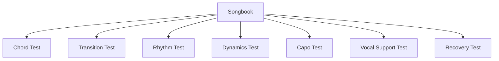
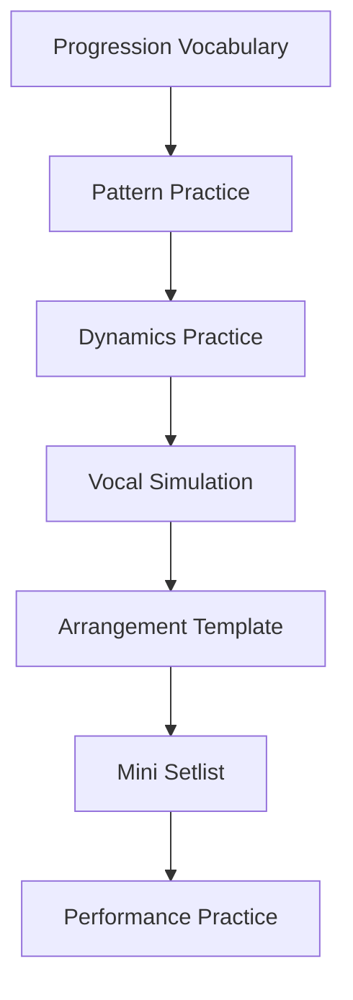

# learn-guitar-accompaniment-part-032.md

# Part 032 — Songbook Minimum: 10–15 Progression dan Lagu Latihan Template

## Status Seri

Seri: **Belajar Guitar Accompaniment Berdasarkan The First 20 Hours**  
Bagian: **032 dari 035**  
Fokus: menyediakan songbook minimum berupa progression, template lagu, pattern, arrangement skeleton, dan latihan yang bisa dipakai langsung tanpa bergantung pada daftar lagu copyrighted tertentu.

Part ini sengaja tidak berisi lirik lagu populer. Tujuannya adalah membuat repertoire latihan yang aman, fleksibel, dan bisa diterapkan ke banyak lagu nyata.

---

## Tujuan Pembelajaran Part Ini

Setelah menyelesaikan part ini, Anda harus bisa:

1. memainkan 10–15 progression paling berguna untuk accompaniment;
2. memahami fungsi progression dalam key G, C, D, dan A via capo/shape;
3. memakai progression sebagai template lagu;
4. membuat safe song, growth song, dan performance song dari progression;
5. melatih strumming, fingerpicking, dynamics, capo, dan vocal cue memakai progression;
6. membuat arrangement skeleton tanpa lirik copyrighted;
7. memilih progression yang sesuai dengan mood;
8. memakai songbook ini dalam roadmap 20 jam;
9. membuat latihan vokal/humming di atas progression;
10. membangun repertoire dasar yang transferable ke lagu nyata.

---

## Prinsip Kaufman yang Dipakai di Part Ini

Dalam *The First 20 Hours*, kita mencari sub-skill dan material latihan yang memberikan coverage besar. Dalam musik pop/acoustic, banyak lagu memakai pola chord yang mirip.

Jika Anda menguasai beberapa progression umum dengan stabil, Anda tidak hanya bisa memainkan satu lagu. Anda membangun vocabulary yang bisa dipakai di banyak lagu.

Target part ini:

> Menguasai progression minimum yang cukup untuk melatih mayoritas skill gitar pengiring awal.

Catatan penting:

- progression ini bukan klaim “semua lagu sama”;
- progression ini adalah template latihan;
- lagu nyata tetap punya struktur, melodi, key, dan feel sendiri;
- gunakan telinga dan arrangement thinking.

---

# 1. Cara Menggunakan Songbook Ini

Untuk setiap progression:

1. mainkan satu strum per chord;
2. mainkan downstroke per beat;
3. mainkan pattern sederhana;
4. mainkan verse sparse;
5. mainkan chorus fuller;
6. coba capo;
7. buat intro 1 putaran;
8. buat ending final chord;
9. rekam;
10. catat bug.

Format latihan:

```text
Progression:
Key/shape:
Mood:
Difficulty:
Useful for:
Pattern:
Dynamics:
Drill:
```

---

# 2. Progression Difficulty Level

Kita gunakan level:

```text
Level 1 = sangat aman
Level 2 = aman dengan sedikit transisi
Level 3 = growth, ada chord/feel baru
Level 4 = cukup menantang untuk 20 jam pertama
```

Jangan mulai dari level 4 jika level 1 belum stabil.

---

# 3. Progression 1 — G - D - Em - C

## Identitas

```text
Shape: G - D - Em - C
Roman: I - V - vi - IV in G
Level: 1
Mood: pop, emotional, familiar
```

## Kenapa Penting

Ini salah satu progression paling transferable untuk pop acoustic.

## Pattern Awal

Verse:

```text
D - - U D - - U
```

Chorus:

```text
D - D U - U D U
```

## Voicing Option

```text
G     = 320033
D     = xx0232
Em7   = 022033
Cadd9 = x32033
```

## Drill

```text
1. one strum per chord
2. one chord per bar
3. verse sparse x2
4. chorus full x2
5. final G sustain
```

## Common Bug

```text
Em → C telat
D terlalu banyak bass
chorus tempo naik
```

---

# 4. Progression 2 — Em - C - G - D

## Identitas

```text
Shape: Em - C - G - D
Roman: vi - IV - I - V in G
Level: 1–2
Mood: lebih minor, ballad, reflective
```

## Kenapa Penting

Cocok untuk lagu yang mulai dari rasa minor/emotional tetapi tetap resolve ke major.

## Pattern

Ballad:

```text
D - D U D - D U
```

atau picking:

```text
P i m i
```

## Drill

```text
Em-C pair
C-G pair
G-D pair
```

## Dynamics

```text
Verse: picking
Chorus: light strum
```

## Common Bug

```text
Em-C transition
D string start
terlalu gelap jika semua dimainkan pelan
```

---

# 5. Progression 3 — C - G - Am - Fmaj7

## Identitas

```text
Shape: C - G - Am - Fmaj7
Roman: I - V - vi - IV in C
Level: 2
Mood: pop, ballad, warm
```

## Kenapa Penting

Versi key C dari I-V-vi-IV. Fmaj7 digunakan sebagai F-friendly shape.

## Pattern

Verse:

```text
P i m i
```

Chorus:

```text
D - D U - U D U
```

## Drill

```text
C-G
G-Am
Am-Fmaj7
```

## Common Bug

```text
Fmaj7 string 1 mati
C-G lambat
Fmaj7 terlalu soft untuk chorus tertentu
```

---

# 6. Progression 4 — Am - Fmaj7 - C - G

## Identitas

```text
Shape: Am - Fmaj7 - C - G
Roman: vi - IV - I - V in C
Level: 2
Mood: melancholic, dramatic, pop ballad
```

## Pattern

Ballad 4/4:

```text
D - - U D - - U
```

atau:

```text
D - D U D - D U
```

## Dynamics

```text
Intro: picking
Verse: sparse
Chorus: fuller
```

## Common Bug

```text
Am-Fmaj7 transition
G terlalu besar setelah C
```

---

# 7. Progression 5 — G - C - D - G

## Identitas

```text
Shape: G - C - D - G
Roman: I - IV - V - I in G
Level: 1
Mood: folk, classic, stable, communal
```

## Kenapa Penting

Progression sangat dasar untuk lagu sederhana, folk, lagu komunal, dan latihan ending.

## Pattern

Folk:

```text
B D B D
```

Simple:

```text
D D D D
```

## Drill

```text
G-C
C-D
D-G
```

## Common Bug

```text
G-C transition lambat
D terlalu banyak bass
```

---

# 8. Progression 6 — C - Fmaj7 - G - C

## Identitas

```text
Shape: C - Fmaj7 - G - C
Roman: I - IV - V - I in C
Level: 2
Mood: stable, classic, warm
```

## Use

- lagu sederhana;
- lagu komunal;
- latihan Fmaj7;
- latihan ending C.

## Pattern

```text
D D D D
```

atau:

```text
B D B D
```

## Common Bug

```text
Fmaj7-G transition
G terlalu keras menutup vokal
```

---

# 9. Progression 7 — G - Em - C - D

## Identitas

```text
Shape: G - Em - C - D
Roman: I - vi - IV - V in G
Level: 1–2
Mood: classic pop, nostalgic, stable
```

## Kenapa Penting

Sangat baik untuk melatih rasa “berputar dan pulang”.

## Pattern

```text
D - D U D - D U
```

## Dynamics

```text
Verse: downstroke
Chorus: fuller
Ending: D → G
```

## Common Bug

```text
Em-C transition
D-G return harus yakin
```

---

# 10. Progression 8 — C - Am - Fmaj7 - G

## Identitas

```text
Shape: C - Am - Fmaj7 - G
Roman: I - vi - IV - V in C
Level: 2
Mood: classic, ballad, sentimental
```

## Pattern

```text
P i m i
```

atau:

```text
D - D U D - D U
```

## Use

- ballad;
- lagu lama;
- latihan C-Am anchor;
- latihan Fmaj7.

## Common Bug

```text
Fmaj7-G
G terlalu bright jika capo tinggi
```

---

# 11. Progression 9 — D - A - Bm - G

## Identitas

```text
Actual chords: D - A - Bm - G
Roman: I - V - vi - IV in D
Level: 4 jika tanpa capo karena Bm
Level: 2 jika pakai shape/capo
```

## Beginner Options

Daripada memainkan Bm barre, gunakan:

### Option A — C Shape Capo 2

```text
C - G - Am - F shape
Capo 2
Sounding: D - A - Bm - G
```

### Option B — G Shape Capo 7

```text
G - D - Em - C shape
Capo 7
Sounding: D - A - Bm - G
```

Capo 7 bisa terlalu bright. Option A sering lebih natural.

## Lesson

Progression ini mengajarkan pentingnya capo.

---

# 12. Progression 10 — D - G - A - D

## Identitas

```text
Shape: D - G - A - D
Roman: I - IV - V - I in D
Level: 2
Mood: bright, communal, folk/pop
```

## Pattern

```text
D D D D
```

atau:

```text
B D B D
```

## Common Bug

```text
A fingering
D string start
D-G transition
```

## Use

- lagu bright;
- latihan A;
- latihan key D tanpa Bm.

---

# 13. Progression 11 — E - A - B7 - E

## Identitas

```text
Shape: E - A - B7 - E
Roman: I - IV - V7 - I in E
Level: 3
Mood: folk, bluesy, classic
```

## Kenapa B7, bukan B barre?

B7 lebih mudah daripada B major barre.

```text
B7 = x21202
```

Ini chord baru, jadi masukkan sebagai growth.

## Use

- folk;
- blues-ish;
- classic acoustic;
- latihan dominant tension.

## Common Bug

```text
B7 shape asing
E-A transition
```

---

# 14. Progression 12 — Am - G - Fmaj7 - E7

## Identitas

```text
Key feel: A minor
Level: 3
Mood: dramatic, minor, cinematic, latin-ish/ballad-ish
```

## Chords

```text
Am    = x02210
G     = 320003
Fmaj7 = x33210
E7    = 020100
```

## Kenapa Penting

Mengajarkan minor key feel dan dominant E7 menuju Am.

## Pattern

Slow dramatic:

```text
D - - U D - - U
```

atau fingerpicking.

## Common Bug

```text
Fmaj7
E7 unfamiliar
terlalu dark jika dimainkan tanpa dynamics
```

---

# 15. Progression 13 — Em - D - C - G

## Identitas

```text
Key feel: G / E minor
Level: 1–2
Mood: descending, reflective
```

## Use

- ballad;
- cinematic acoustic;
- verse minor feel.

## Pattern

```text
P i m i
```

atau:

```text
D - D U D - D U
```

## Common Bug

```text
D-C transition
C-G transition
```

---

# 16. Progression 14 — G - D/F# - Em - C

## Identitas

```text
Base: G - D - Em - C
With bass walkdown: G - F# - E
Level: 3 jika D/F# dimainkan
```

## Beginner Version

```text
G - D - Em - C
```

## Growth Version

```text
G - D/F# - Em - C
```

D/F#:

```text
2x0232
```

atau simplify to D.

## Use

- acoustic ballad;
- smoother bass movement;
- arrangement upgrade.

## Common Bug

```text
D/F# membuat rhythm berhenti
```

Rule:

> Jika D/F# merusak rhythm, pakai D dulu.

---

# 17. Progression 15 — C - G/B - Am - Fmaj7

## Identitas

```text
Base: C - G - Am - F
With bass walkdown: C - B - A
Level: 3
```

## Beginner Version

```text
C - G - Am - Fmaj7
```

## Growth Version

```text
C - G/B - Am - Fmaj7
```

G/B:

```text
x20033
```

atau simplified G.

## Use

- ballad;
- smooth acoustic;
- intro/verse arrangement.

## Common Bug

```text
G/B shape
bass too soft/unclear
transition to Am
```

---

# 18. Song Template A — Safe Pop Song

Gunakan progression:

```text
G - D - Em - C
```

## Structure

```text
Intro: progression x1
Verse: progression x2
Chorus: progression x2
Verse 2: progression x2
Chorus: progression x2
Outro: G final
```

## Pattern

Verse:

```text
D - - U D - - U
```

Chorus:

```text
D - D U - U D U
```

## Goal

```text
full run no-stop
intro clear
ending final G
```

## Acceptance

```text
[ ] bisa selesai 2 menit
[ ] stop count <= 2
[ ] chorus lebih besar dari verse
```

---

# 19. Song Template B — Minor Ballad

Progression:

```text
Em - C - G - D
```

## Structure

```text
Intro: picking x1
Verse: picking x2
Chorus: light strum x2
Bridge: Em-C-G-D sparse
Final: fuller
Outro: Em or G final depending mood
```

## Pattern

Picking:

```text
P i m i
```

Chorus:

```text
D - D U D - D U
```

## Skill Focus

```text
minor mood
picking-to-strum
dynamic build
```

---

# 20. Song Template C — C-Key Ballad

Progression:

```text
C - G - Am - Fmaj7
```

## Structure

```text
Intro: P-i-m-a x1
Verse: P-i-m-i x2
Pre: Fmaj7-G-Am-G x1 optional
Chorus: C-G-Am-Fmaj7 x2
Outro: C final
```

## Skill Focus

```text
Fmaj7
C-G transition
fingerpicking
soft dynamics
```

---

# 21. Song Template D — Folk/Communal

Progression:

```text
G - C - D - G
```

## Structure

```text
Intro: G-C-D-G x1
Verse/Refrain: same x2
Repeat: same
Outro: G final
```

## Pattern

```text
B D B D
```

or:

```text
D D D D
```

## Skill Focus

```text
steady tempo
clear vocal entry
simple ending
```

---

# 22. Song Template E — 6/8 Ballad

Progression:

```text
G - D - Em - C
```

## Meter

```text
6/8
1 2 3 4 5 6
accent 1 and 4
```

## Pattern

```text
D - U D - U
```

or:

```text
P i m a m i
```

## Structure

```text
Intro: picking x1
Verse: picking x2
Chorus: 6/8 strum x2
Bridge: sparse
Final: full
Outro: G arpeggio
```

## Skill Focus

```text
non-4/4 feel
long vocal phrase
ballad dynamics
```

---

# 23. Song Template F — Worship/Anthemic Build

Progression:

```text
G - D - Em7 - Cadd9
```

## Structure

```text
Intro: light open voicing
Verse: sparse
Chorus: medium
Verse 2: medium
Chorus 2: fuller
Bridge: build over repeats
Final Chorus: full
Outro: release
```

## Dynamics

```text
30 → 40 → 60 → 75 → 85 → 90 → 30
```

## Skill Focus

```text
open voicing
long build
not starting too big
```

---

# 24. Song Template G — Rock Acoustic

Progression:

```text
Em - C - G - D
```

## Structure

```text
Intro: muted groove
Verse: palm mute
Pre: build
Chorus: open strum
Bridge: drop
Final: full
Outro: stop/final chord
```

## Pattern

Verse:

```text
muted downstroke
```

Chorus:

```text
D U D U D U D U
```

## Skill Focus

```text
controlled energy
tempo not rushing
palm mute to open
```

---

# 25. Song Template H — Minor Dramatic

Progression:

```text
Am - G - Fmaj7 - E7
```

## Structure

```text
Intro: fingerpicking
Verse: sparse
Chorus: dramatic strum
Bridge: drop or intensify
Outro: Am final
```

## Skill Focus

```text
minor mood
E7 to Am tension
Fmaj7
dramatic dynamics
```

---

# 26. Capo Practice with Songbook

Use progression:

```text
G - D - Em - C
```

Capo ladder:

| Capo | Sounding Key |
|---:|---|
| 0 | G |
| 1 | Ab |
| 2 | A |
| 3 | Bb |
| 4 | B |
| 5 | C |

Exercise:

```text
play verse at capo 0
play chorus at capo 2
hum melody
feel vocal range difference
```

Do not perform by moving capo mid-song unless arranged. This is just key exploration.

---

# 27. Progression Mood Map

| Progression | Mood |
|---|---|
| G-D-Em-C | familiar pop emotional |
| Em-C-G-D | reflective/minor-to-major |
| C-G-Am-F | warm pop |
| Am-F-C-G | melancholic pop |
| G-C-D-G | stable/communal |
| G-Em-C-D | nostalgic/classic |
| Am-G-F-E7 | dramatic/minor |
| G-D/F#-Em-C | smooth descending |
| C-G/B-Am-F | smooth ballad |

Use mood to choose practice song.

---

# 28. Pattern Map for Songbook

| Use Case | Pattern |
|---|---|
| beginner full run | one strum per chord |
| stable simple | D D D D |
| verse sparse | D - - U D - - U |
| pop chorus | D - D U - U D U |
| ballad 4/4 | D - D U D - D U |
| folk | B D B D |
| 6/8 | D - U D - U |
| fingerpicking | P i m i |
| 6/8 picking | P i m a m i |
| rock chorus | D U D U D U D U |

---

# 29. Dynamic Map Defaults

## Safe Pop

```text
Intro 35
Verse 45
Chorus 75
Bridge 50
Final 85
Outro 30
```

## Ballad

```text
Intro 25
Verse 35
Pre 55
Chorus 70
Bridge 30/75
Final 85
Outro 20
```

## Folk/Communal

```text
Intro 45
Verse 55
Refrain 65
Repeat 65
Outro 50
```

## Worship/Anthemic

```text
Intro 25
Verse 35
Chorus 60
Bridge build 50→80
Final 90
Outro 25
```

## Rock Acoustic

```text
Intro 60
Verse 55 muted
Pre 70
Chorus 85
Bridge 45/80
Final 90
```

---

# 30. Vocal Cue Templates

## Intro 1 Progression

```text
Intro: G-D-Em-C x1
Cue: singer enters after C
```

## Half Intro

```text
Intro: G-D
Cue: singer enters after D
```

## Hold Cue

```text
Intro progression ends on C
Hold C for 2 beats
Singer enters next G
```

## Repeat if Late

```text
If singer late: repeat intro progression once
```

Write this into arrangement sheet.

---

# 31. Ending Templates

## Final Tonic

```text
G-D-Em-C-G
hold G
```

## Repeat Last Progression

```text
repeat chorus progression once
final tonic
```

## Stop Ending

```text
final chord on beat 1
mute after sustain
```

## Ballad Ritardando

```text
slow down last 2 bars
final chord sustain
```

Only use ritardando if rehearsed.

---

# 32. Songbook Practice Session 45 Menit

## Block 1 — Choose Progression, 5 Menit

Pick one from level 1 or 2.

## Block 2 — Technical Run, 10 Menit

One strum → downstroke → pattern.

## Block 3 — Arrangement, 10 Menit

Intro, verse, chorus, ending.

## Block 4 — Vocal Simulation, 10 Menit

Hum or speak dummy phrase.

## Block 5 — Full Run, 5 Menit

No-stop.

## Block 6 — Review, 5 Menit

Bug log.

---

# 33. Songbook Practice Session 15 Menit

```text
2 menit  choose progression
3 menit  chord transitions
3 menit  pattern
3 menit  verse/chorus contrast
3 menit  no-stop run
1 menit  notes
```

If only 5 minutes:

```text
1 minute  progression one strum
2 minutes transition pair
2 minutes pattern loop
```

---

# 34. 7-Day Songbook Plan

## Day 1

```text
G-D-Em-C
```

Focus:

```text
transition + pop pattern
```

## Day 2

```text
Em-C-G-D
```

Focus:

```text
minor mood + picking
```

## Day 3

```text
C-G-Am-Fmaj7
```

Focus:

```text
Fmaj7 + ballad
```

## Day 4

```text
G-C-D-G
```

Focus:

```text
folk/communal steady tempo
```

## Day 5

```text
G-D-Em-C in 6/8
```

Focus:

```text
6/8 feel
```

## Day 6

```text
G-D/F#-Em-C or simplified
```

Focus:

```text
bass movement
```

## Day 7

```text
Pick 1 progression and make full arrangement
```

Focus:

```text
intro, verse, chorus, ending, recording
```

---

# 35. 3-Lagu Target dari Songbook

Jika belum punya lagu nyata, gunakan 3 template ini sebagai final practice set.

## Safe Song

```text
G-D-Em-C
4/4
verse sparse
chorus full
```

## Growth Song

```text
C-G-Am-Fmaj7
fingerpicking verse
strum chorus
```

## Performance Song

```text
Em-C-G-D
ballad or rock acoustic depending dynamics
```

Buat lirik dummy/hum melody sendiri atau gunakan vocal syllables seperti:

```text
la la la
na na na
```

Tujuannya latihan accompaniment, bukan songwriting.

---

# 36. Dummy Lyric / Vocal Phrase Practice

Untuk menghindari copyrighted lyrics, gunakan frasa dummy.

Bahasa Indonesia:

```text
aku berjalan pulang
mencari sisa terang
```

Bahasa Inggris dummy:

```text
I keep moving on
through the quiet night
```

Gunakan hanya sebagai latihan phrasing.

Latihan:

- ucapkan sambil strum;
- hum melody sederhana;
- cek vocal space.

---

# 37. Transpose Practice

Ambil progression:

```text
I - V - vi - IV
```

Tulis dalam key:

```text
G: G-D-Em-C
C: C-G-Am-F
D: D-A-Bm-G
A: A-E-F#m-D
```

Lalu cari shape/capo yang mudah:

```text
D using C shape capo 2
A using G shape capo 2
C using G shape capo 5 or C shape open
```

Target:

> Bisa berpikir function, bukan hafal satu key saja.

---

# 38. Songbook Debugging Matrix

| Progression | Common Bug | Fix |
|---|---|---|
| G-D-Em-C | Em-C telat | pair drill |
| Em-C-G-D | C-G lambat | slow loop |
| C-G-Am-Fmaj7 | Fmaj7 lemah | chord clean |
| Am-F-C-G | Am-F transition | low-lift |
| G-C-D-G | G-C lambat | pair drill |
| C-F-G-C | F/G transition | simplify |
| D-A-Bm-G | Bm sulit | capo/shape |
| Am-G-F-E7 | E7 asing | chord recall |
| G-D/F#-Em-C | D/F# stops | simplify to D |
| C-G/B-Am-F | G/B stops | simplify to G |

---

# 39. Building Your Own Progression Template

Template:

```text
Progression:
Key:
Roman:
Mood:
Level:
Chords:
Difficult transition:
Best pattern:
Verse treatment:
Chorus treatment:
Ending:
Capo options:
Vocal risk:
Use case:
```

Example:

```text
Progression: G-D-Em-C
Key: G
Roman: I-V-vi-IV
Mood: pop emotional
Level: 1
Difficult transition: Em-C
Pattern: D-DU-UDU
Verse: sparse
Chorus: full
Ending: G
Capo: 0–5
Vocal risk: chorus key depends singer
Use case: safe pop song
```

---

# 40. Songbook as Test Suite

Untuk software engineer, songbook ini adalah test suite.

Setiap progression menguji skill berbeda:

```text
G-D-Em-C       = baseline pop
Em-C-G-D       = minor mood
C-G-Am-Fmaj7   = F challenge
G-C-D-G        = folk/communal
6/8 template   = meter
D/F# template  = bass movement
Am-G-F-E7      = minor/dominant
```



Jika Anda bisa melewati test suite ini, Anda punya fondasi luas.

---

# 41. Mini Project Part Ini

Buat mini setlist dari songbook.

```text
Songbook Setlist:
1. Safe Pop:
2. Ballad:
3. Folk/Communal or Rock Acoustic:

For each:
- progression
- key/capo
- pattern
- intro
- verse
- chorus
- ending
- risk
```

Lalu lakukan no-stop simulation 3 progression.

Target:

> 3 template lagu bisa dimainkan berurutan dengan feel berbeda.

---

# 42. Acceptance Criteria Part 032

Anda boleh lanjut ke part 033 jika:

```text
[ ] Bisa memainkan G-D-Em-C
[ ] Bisa memainkan Em-C-G-D
[ ] Bisa memainkan C-G-Am-Fmaj7
[ ] Bisa memainkan G-C-D-G
[ ] Bisa memainkan minimal satu progression dalam 6/8
[ ] Bisa membuat verse/chorus contrast dari satu progression
[ ] Bisa membuat intro dan ending dari progression
[ ] Bisa memakai capo untuk mengubah key progression
[ ] Bisa memilih progression berdasarkan mood
[ ] Bisa membuat 3-song mini setlist dari songbook
```

---

# 43. Ringkasan Mental Model

Songbook minimum adalah vocabulary dan test suite.



Anda tidak perlu lagu sulit untuk belajar accompaniment. Progression sederhana yang dimainkan dengan timing, dynamics, cue, dan vocal awareness bisa menjadi latihan yang sangat kuat.

---

# 44. Output Part Ini

Output konkret:

1. Anda punya 15 progression latihan.
2. Anda punya 8 template lagu.
3. Anda punya pattern map.
4. Anda punya dynamic defaults.
5. Anda punya mini setlist practice.
6. Anda siap masuk ke final project.

Part berikutnya:

> **Final Project: Membuat dan Membawakan 3 Lagu Iringan Gitar-Vokal.**

