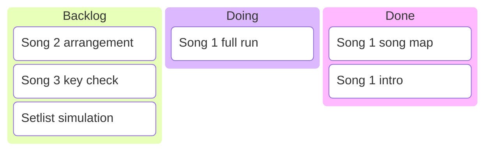
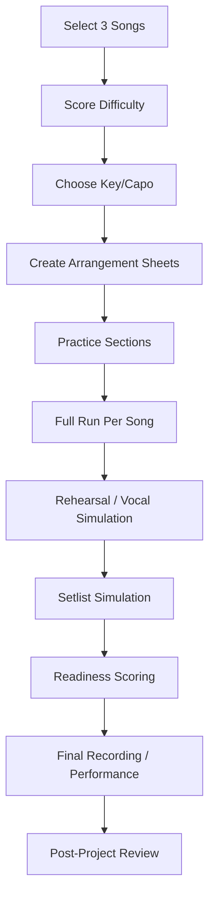
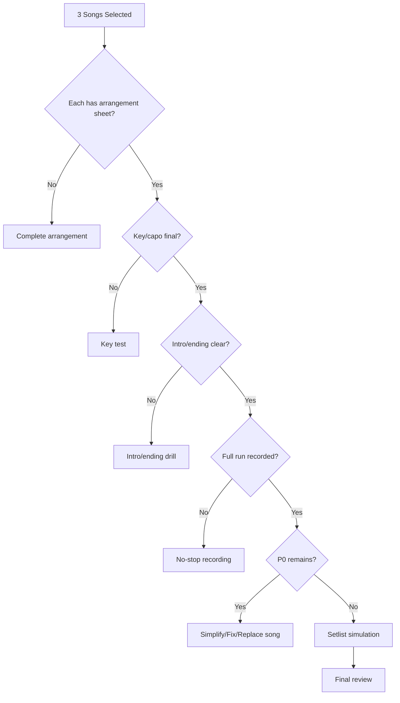
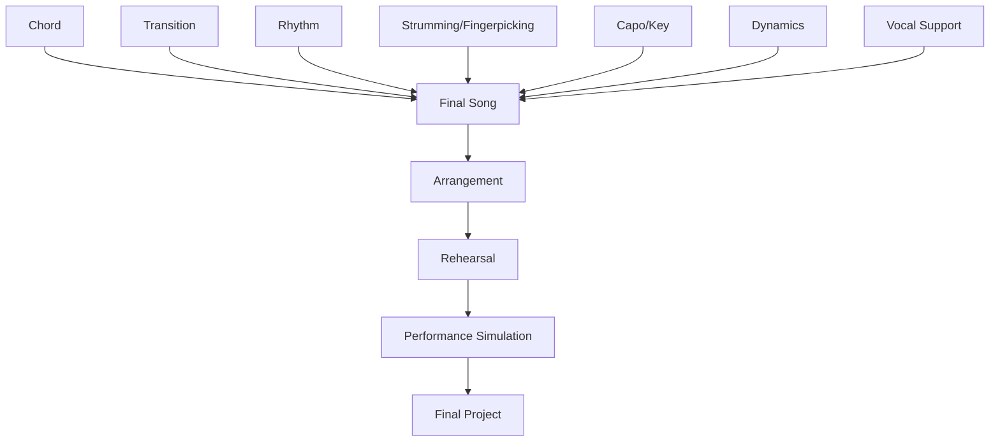
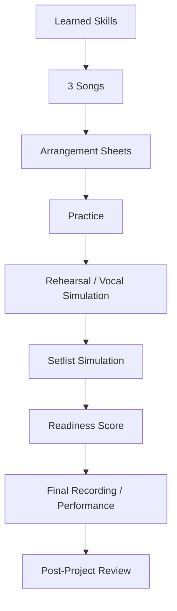

# learn-guitar-accompaniment-part-033.md

# Part 033 — Final Project: Membuat dan Membawakan 3 Lagu Iringan Gitar-Vokal

## Status Seri

Seri: **Belajar Guitar Accompaniment Berdasarkan The First 20 Hours**  
Bagian: **033 dari 035**  
Fokus: menyatukan seluruh materi menjadi proyek akhir: memilih, mengaransemen, melatih, merekam, mengevaluasi, dan membawakan 3 lagu gitar-vokal secara stabil.

Part ini adalah tempat semua skill bertemu:

- chord;
- transition;
- rhythm;
- strumming;
- fingerpicking;
- capo;
- transpose;
- dynamics;
- vocal support;
- arrangement;
- rehearsal;
- sound;
- error recovery;
- performance readiness.

Jika bagian sebelumnya adalah modul, part ini adalah integrasi.

---

## Tujuan Pembelajaran Part Ini

Setelah menyelesaikan part ini, Anda harus bisa:

1. memilih 3 lagu target final;
2. mengategorikan lagu sebagai safe, growth, dan performance;
3. membuat arrangement sheet lengkap untuk setiap lagu;
4. menentukan key/capo dan vocal entry;
5. membuat pattern map dan dynamic map;
6. melatih intro, section, bridge, dan ending;
7. melakukan rehearsal atau simulasi vokal;
8. melakukan no-stop run;
9. membuat readiness score;
10. menghasilkan final recording atau performance simulation sebagai bukti kemampuan.

---

## Prinsip Kaufman yang Dipakai di Part Ini

Dalam *The First 20 Hours*, skill acquisition harus berakhir pada kemampuan nyata, bukan hanya pengetahuan. Maka final project ini bukan ujian teori.

Final project ini menguji:

```text
Bisakah Anda memakai semua sub-skill untuk membuat lagu berjalan dari awal sampai akhir bersama vokal?
```

Targetnya bukan sempurna. Targetnya:

> 3 lagu sederhana bisa dibawakan secara utuh, stabil, vocal-safe, dan recoverable.

---

# 1. Output Final Project

Output akhir proyek ini:

```text
[ ] 3 lagu target dipilih
[ ] 3 arrangement sheet selesai
[ ] 3 key/capo decision selesai
[ ] 3 intro dan ending jelas
[ ] 3 dynamic map dibuat
[ ] minimal 1 full run per lagu direkam
[ ] minimal 1 setlist simulation dilakukan
[ ] readiness score per lagu dibuat
[ ] P0/P1 risk dicatat
[ ] final reflection dibuat
```

Jika ada penyanyi nyata:

```text
[ ] minimal 1 rehearsal dengan penyanyi
[ ] minimal 1 full run dengan penyanyi
```

Jika belum ada penyanyi:

```text
[ ] latihan dengan vocal recording, hum, atau dummy vocal phrase
```

---

# 2. Tiga Lagu Final

Pilih 3 lagu dengan fungsi berbeda.

## 2.1 Lagu 1 — Safe Song

Tujuan:

- membuktikan Anda bisa menyelesaikan lagu;
- membangun confidence;
- menjadi fallback jika lagu lain gagal;
- melatih performance no-stop.

Kriteria:

```text
[ ] chord 3–5
[ ] tempo lambat/sedang
[ ] struktur jelas
[ ] tidak ada chord terlalu sulit
[ ] key/capo mudah
[ ] ending sederhana
```

## 2.2 Lagu 2 — Growth Song

Tujuan:

- menunjukkan perkembangan skill;
- punya satu tantangan utama;
- tidak terlalu banyak bottleneck.

Contoh tantangan:

```text
[ ] Fmaj7
[ ] 6/8
[ ] fingerpicking verse
[ ] capo/transpose
[ ] bridge contrast
[ ] slash chord simplified
```

## 2.3 Lagu 3 — Performance Song

Tujuan:

- lagu yang benar-benar ingin dibawakan;
- punya emotional impact;
- cocok dengan penyanyi/audience;
- masih realistis.

Performance song tidak harus paling sulit. Performance song harus paling bermakna dan cukup aman.

---

# 3. Final Project Scope

Final project bisa memakai:

1. lagu nyata yang legal Anda pelajari dari chord chart;
2. template songbook dari part 032;
3. lagu original sederhana;
4. progression practice dengan dummy vocal phrase;
5. kombinasi.

Karena target skill adalah accompaniment, bukan publikasi lagu, yang penting:

```text
struktur
vokal
chord
rhythm
dynamics
ending
recovery
```

---

# 4. Final Project Board

Gunakan board:

```text
Backlog:
- pilih lagu
- cek key
- buat arrangement sheet
- latih intro
- latih ending
- full run
- recording
- readiness score

Doing:
- Song 1 arrangement

Done:
- Song 1 key/capo
```

Mermaid:



Jika Mermaid `kanban` tidak didukung, gunakan tabel biasa.

---

# 5. Final Project Workflow



Jangan lompat langsung ke final performance tanpa arrangement sheet dan full run.

---

# 6. Song Selection Form

Isi untuk semua kandidat.

```text
Title:
Category: Safe / Growth / Performance
Why this song:
Original key:
Candidate key:
Capo:
Feel:
Tempo:
Chord count:
Hardest chord:
Hardest transition:
Structure risk:
Vocal risk:
Sound risk:
Simplification:
Decision: select / later / reject
```

Pilih 3 yang paling sesuai.

---

# 7. Difficulty Scoring

Beri skor 1–5.

| Aspek | Skor |
|---|---:|
| Chord difficulty | 1–5 |
| Transition speed | 1–5 |
| Rhythm complexity | 1–5 |
| Structure complexity | 1–5 |
| Vocal range risk | 1–5 |
| Capo/transpose risk | 1–5 |
| Performance pressure | 1–5 |

Interpretasi:

```text
7–12  = safe
13–20 = growth
21+   = later / simplify
```

Final set ideal:

```text
Song 1: 7–12
Song 2: 13–18
Song 3: 10–18, tergantung makna dan konteks
```

---

# 8. Arrangement Sheet Final

Untuk setiap lagu, isi:

```text
# Arrangement Sheet

Title:
Category:
Singer:
Context:
Original key:
Chosen key:
Guitar shape:
Capo:
Tempo:
Feel/meter:

## Song Map
Intro:
Verse 1:
Pre-Chorus:
Chorus:
Verse 2:
Bridge:
Final Chorus:
Outro:

## Pattern Map
Intro:
Verse:
Pre-Chorus:
Chorus:
Bridge:
Final Chorus:
Outro:

## Dynamic Map
Intro:
Verse:
Pre-Chorus:
Chorus:
Bridge:
Final Chorus:
Outro:

## Voicing / Bass
Base chords:
Voicing options:
Slash chords:
Simplifications:

## Vocal Support
Vocal entry:
Hardest vocal line:
Where guitar must be sparse:
Where guitar can build:
Breath/rubato notes:

## Cues
Count-in:
Vocal entry cue:
Chorus cue:
Bridge cue:
Ending cue:

## Risks
P0:
P1:
Fallback:

## Definition of Done
[ ] key/capo final
[ ] intro clear
[ ] ending clear
[ ] full run instrumental
[ ] full run with vocal/simulation
[ ] recording reviewed
[ ] readiness score done
```

---

# 9. Key/Capo Finalization

Sebelum latihan detail, finalkan key.

Workflow:

```text
1. mainkan chorus di key kandidat
2. cek bagian tertinggi
3. cek verse terendah
4. cek tone penyanyi
5. cek chord difficulty
6. pilih key/capo
7. tulis besar di sheet
```

Jika belum ada penyanyi, buat dua opsi:

```text
Primary key:
Backup key:
```

Jangan membuat arrangement rumit sebelum key cukup pasti.

---

# 10. Intro Finalization

Intro harus menjawab:

```text
[ ] berapa bar?
[ ] progression apa?
[ ] pattern apa?
[ ] penyanyi masuk kapan?
[ ] cue-nya apa?
[ ] jika penyanyi telat, apa fallback?
```

Contoh:

```text
Intro:
G-D-Em-C x1
Pattern: light strum
Cue: nod at C
Vocal entry: beat 1 after C
If late: repeat intro once
```

Latih intro minimal 10 kali.

---

# 11. Ending Finalization

Ending harus menjawab:

```text
[ ] chord akhir apa?
[ ] stop atau sustain?
[ ] repeat last line?
[ ] ritardando?
[ ] siapa memberi cue?
[ ] fallback jika ragu?
```

Contoh:

```text
Ending:
Final chorus last line repeated once.
End on G.
Sustain 4 beats.
Singer and guitarist eye contact before final chord.
Fallback: hold G.
```

Latih ending lebih sering daripada intro. Banyak lagu gagal terasa siap karena ending ragu.

---

# 12. Pattern Map Final

Pattern map harus sederhana dan konsisten.

Contoh:

```text
Intro: P-i-m-i
Verse: sparse D---D---
Pre: D-DU-D-DU
Chorus: D-DU-UDU
Bridge: palm mute
Final: full D-DU-UDU
Outro: final strum
```

Jika pattern terlalu sulit, simplify.

Rule:

```text
Pattern stabil > pattern keren.
```

---

# 13. Dynamic Map Final

Dynamic map harus memberi perjalanan.

Contoh:

```text
Intro: 30%
Verse 1: 40%
Pre-Chorus: 60%
Chorus: 75%
Verse 2: 50%
Bridge: 35%
Final Chorus: 85%
Outro: 20%
```

Gunakan energy percentage hanya sebagai alat. Yang penting section terdengar berbeda.

---

# 14. Voicing Final

Pilih voicing secara sadar.

Contoh:

```text
Song 1:
Use basic G-D-Em-C.
Reason: safe and clear.

Song 2:
Use G 320033, Em7, Cadd9.
Reason: acoustic modern color.

Song 3:
Use Fmaj7 instead of F.
Reason: F barre not stable and song is ballad.
```

Jangan mengganti voicing saat performance tanpa latihan.

---

# 15. Recovery Plan Final

Untuk setiap lagu:

```text
If chord late:
If singer late:
If singer early:
If bridge forgotten:
If tempo rises:
If ending uncertain:
```

Contoh:

```text
If chord late: muted strum, enter next beat.
If singer late: repeat intro.
If bridge forgotten: go to chorus.
If tempo rises: reduce strum motion.
If ending uncertain: final tonic sustain.
```

Recovery plan membuat performance lebih aman.

---

# 16. Practice Phases for Each Song

Untuk setiap lagu, lakukan fase:

```text
1. Chord audit
2. Transition drill
3. Section practice
4. Intro/ending drill
5. Full run instrumental
6. Vocal simulation
7. Recording review
8. Readiness scoring
```

Jangan langsung full run jika chord audit belum aman.

---

# 17. Song 1 — Safe Song Execution

## Target

```text
Selesai dari awal sampai akhir tanpa stop total.
```

## Recommended Material

Progression:

```text
G-D-Em-C
```

atau lagu nyata yang setara.

## Arrangement

```text
Intro: progression x1
Verse: sparse
Chorus: full
Bridge: optional
Outro: final G/C depending key
```

## Acceptance

```text
[ ] full run 2x
[ ] stop count rendah
[ ] intro clear
[ ] ending clear
[ ] vocal support cukup
```

---

# 18. Song 2 — Growth Song Execution

## Target

```text
Memiliki satu tantangan baru, tetapi tetap bisa selesai.
```

Tantangan contoh:

```text
Fmaj7
6/8
fingerpicking
capo 2
bass walkdown simplified
bridge contrast
```

## Acceptance

```text
[ ] tantangan utama bisa dimainkan cukup stabil
[ ] full run attempt berhasil
[ ] jika terlalu sulit, ada simplification
[ ] dynamics lebih jelas dari Song 1
```

---

# 19. Song 3 — Performance Song Execution

## Target

```text
Paling bermakna dan layak dibawakan.
```

Kriteria:

```text
[ ] cocok untuk penyanyi
[ ] cocok untuk konteks
[ ] emotional impact ada
[ ] risiko terkendali
[ ] arrangement jelas
```

## Acceptance

```text
[ ] full run dengan vokal/simulasi
[ ] readiness score cukup
[ ] tidak ada P0
[ ] fallback plan ada
```

---

# 20. Final Project Timeline 5 Sesi

Jika Anda ingin menyelesaikan final project dalam 5 sesi 45–60 menit:

## Sesi 1 — Selection dan Arrangement

```text
pilih 3 lagu
score difficulty
key/capo candidate
arrangement skeleton
```

## Sesi 2 — Song 1

```text
intro
verse/chorus
ending
full run
recording
```

## Sesi 3 — Song 2

```text
growth challenge
section practice
full run
simplify if needed
```

## Sesi 4 — Song 3

```text
key/capo
vocal support
dynamic map
full run
```

## Sesi 5 — Setlist Simulation

```text
3 lagu no-stop
recording
readiness scoring
post-project review
```

---

# 21. Final Project Timeline 10 Sesi

Jika ingin lebih matang:

| Sesi | Fokus |
|---:|---|
| 1 | pilih 3 lagu + scoring |
| 2 | Song 1 arrangement |
| 3 | Song 1 full run |
| 4 | Song 2 arrangement |
| 5 | Song 2 full run |
| 6 | Song 3 arrangement |
| 7 | Song 3 full run |
| 8 | vocal rehearsal/simulation |
| 9 | setlist simulation |
| 10 | final recording + review |

---

# 22. Rehearsal with Singer

Jika ada penyanyi, lakukan minimal satu rehearsal final.

Format 60 menit:

```text
00–05 setup/tune
05–15 Song 1 key + run
15–25 Song 2 key + run
25–35 Song 3 key + run
35–45 hardest section fixes
45–55 setlist simulation
55–60 action items/readiness
```

Pastikan:

```text
[ ] key/capo final
[ ] intro/ending final
[ ] cue disepakati
[ ] full run direkam
```

---

# 23. Vocal Simulation Jika Tidak Ada Penyanyi

Jika belum ada penyanyi:

- gunakan vocal recording asli;
- hum melody;
- ucapkan dummy lyric;
- rekam gitar dan vokal sederhana;
- minta teman mendengar clarity.

Tujuan:

```text
melatih ruang vokal
```

Bukan menjadi penyanyi sempurna.

---

# 24. Setlist Simulation

Setlist simulation adalah final integration test.

Aturan:

```text
[ ] 3 lagu berurutan
[ ] no restart
[ ] capo sesuai setlist
[ ] tune before start
[ ] intro/ending real
[ ] recover from mistakes
[ ] record
```

Setlist sheet:

```text
Song 1:
Capo:
First chord:
Tempo:
Intro:
Ending:

Song 2:
...

Song 3:
...
```

---

# 25. Final Recording

Buat final recording.

Minimal:

```text
audio HP
```

Lebih baik:

```text
video dari depan
```

Recording harus menangkap:

- gitar;
- vokal/simulasi vokal jika ada;
- tempo;
- dynamics;
- ending.

Jangan menunggu sempurna. Recording adalah bukti dan feedback.

---

# 26. Final Evaluation Rubric

Skor 1–5.

| Area | Score |
|---|---:|
| Tuning | 1–5 |
| Chord clarity | 1–5 |
| Transition | 1–5 |
| Rhythm/tempo | 1–5 |
| Structure | 1–5 |
| Intro/cue | 1–5 |
| Ending | 1–5 |
| Dynamics | 1–5 |
| Vocal support | 1–5 |
| Recovery | 1–5 |
| Sound/balance | 1–5 |
| Confidence | 1–5 |

Interpretasi:

```text
4–5 = strong for current level
3 = acceptable / needs work
1–2 = bottleneck
```

Performance-ready jika:

```text
tidak ada area P0 di skor 1–2
mayoritas area minimal 3
intro, ending, key, rhythm minimal 3–4
```

---

# 27. Final Project Rubric per Song

```text
Song:
Category:
Score total:
Lowest score:
Highest score:
P0:
P1:
Go/no-go:
Next fix:
```

Contoh:

```text
Song 1:
Category: Safe
Lowest score: Dynamics 3
P0: none
P1: chorus tempo slight rise
Go/no-go: Go for informal performance
Next fix: chorus metronome
```

---

# 28. Post-Project Review

Jawab:

```text
Apa yang paling membaik?
Apa bottleneck terbesar?
Lagu mana paling siap?
Lagu mana terlalu sulit?
Skill mana perlu 20 jam berikutnya?
Apakah penyanyi merasa didukung?
Apakah rhythm cukup stabil?
Apakah dynamics terdengar?
Apakah saya bisa recover?
```

Jangan hanya menilai “bagus/jelek”.

---

# 29. Final Project Report Template

```text
# Guitar Accompaniment Final Project Report

Date:
Total active practice hours:
Singer/context:
Songs:

## Song 1
Title:
Category:
Key/capo:
Arrangement summary:
Readiness score:
P0:
P1:
Recording:
Go/no-go:
Next fix:

## Song 2
...

## Song 3
...

## Overall Reflection
What worked:
What failed:
Biggest improvement:
Biggest bottleneck:
Most useful drill:
Next 20-hour focus:
```

---

# 30. Common Final Project Failures

## 30.1 Memilih Lagu Terlalu Sulit

Fix:

- ganti dengan safe song;
- simplify chord;
- turunkan tempo.

## 30.2 Tidak Ada Full Run

Fix:

- no-stop run wajib;
- jangan hanya section practice.

## 30.3 Ending Tidak Dilatih

Fix:

- ending drill 10x.

## 30.4 Key Vokal Tidak Final

Fix:

- chorus key test.

## 30.5 Semua Lagu Terdengar Sama

Fix:

- genre/dynamic map;
- texture variation.

## 30.6 Terlalu Banyak Improvement Terakhir Menjelang Final

Fix:

- freeze arrangement sebelum simulation;
- polish, jangan overhaul.

---

# 31. Scope Freeze

Sebelum final simulation, lakukan scope freeze.

Artinya:

```text
[ ] chord tidak diubah lagi kecuali P0
[ ] key/capo tidak diubah lagi kecuali vokal tidak nyaman
[ ] pattern utama tetap
[ ] intro/ending tetap
[ ] voicing tidak ditambah mendadak
```

Tujuannya mengurangi risiko.

Perubahan last-minute sering merusak stability.

---

# 32. Final Project Decision Tree



---

# 33. Final Project Minimal Version

Jika waktu/energi terbatas, lakukan minimal:

```text
1 lagu safe
1 full arrangement sheet
1 key/capo decision
1 intro
1 ending
1 no-stop full run
1 recording
1 readiness score
```

Lebih baik satu lagu selesai daripada tiga lagu setengah matang.

---

# 34. Final Project Full Version

Jika ingin versi lengkap:

```text
3 lagu
3 arrangement sheets
3 full runs
1 rehearsal dengan penyanyi
1 setlist simulation
1 final recording
1 project report
```

Ini menjadi bukti kuat bahwa 20 jam pertama menghasilkan skill nyata.

---

# 35. Skill Integration Map



Final project menguji integrasi, bukan modul terpisah.

---

# 36. Latihan 45 Menit untuk Part Ini

## Block 1 — Song Selection Review, 5 Menit

Pastikan 3 lagu.

## Block 2 — Arrangement Sheet Audit, 10 Menit

Cek key, intro, ending, pattern, risks.

## Block 3 — Hardest Section, 10 Menit

Latih bagian tersulit dari satu lagu.

## Block 4 — Full Run, 10 Menit

No-stop, record.

## Block 5 — Readiness Score, 5 Menit

Isi rubric.

## Block 6 — Next Action, 5 Menit

Tentukan satu fix.

---

# 37. Latihan 15 Menit

```text
3 menit  pre-song checklist
4 menit  intro + ending
5 menit  no-stop section/full run
2 menit  recording review
1 menit  readiness note
```

Jika hanya 5 menit:

```text
2 menit  intro
2 menit  ending
1 menit  next action
```

---

# 38. Acceptance Criteria Part 033

Anda boleh lanjut ke part 034 jika:

```text
[ ] Sudah memilih 3 lagu final atau 3 template progression
[ ] Bisa menjelaskan kategori safe/growth/performance
[ ] Bisa membuat arrangement sheet per lagu
[ ] Bisa menentukan key/capo
[ ] Bisa membuat intro dan ending final
[ ] Bisa melakukan no-stop full run
[ ] Bisa merekam minimal satu lagu
[ ] Bisa memberi readiness score
[ ] Bisa membuat P0/P1 risk list
[ ] Bisa membuat final project report sederhana
```

---

# 39. Ringkasan Mental Model

Final project adalah integration test.



Jika Anda bisa menyelesaikan final project, Anda tidak hanya “belajar gitar”. Anda sudah membangun sistem untuk mengiringi penyanyi.

---

# 40. Output Part Ini

Output konkret:

1. 3 lagu atau template final.
2. 3 arrangement sheet.
3. 3 readiness score.
4. 1 setlist simulation.
5. 1 final recording.
6. 1 final project report.
7. daftar skill lanjutan untuk setelah 20 jam.

Part berikutnya:

> **Setelah 20 Jam: Roadmap Lanjutan Menuju Pengiring yang Lebih Matang.**

