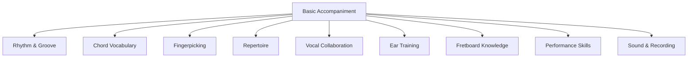
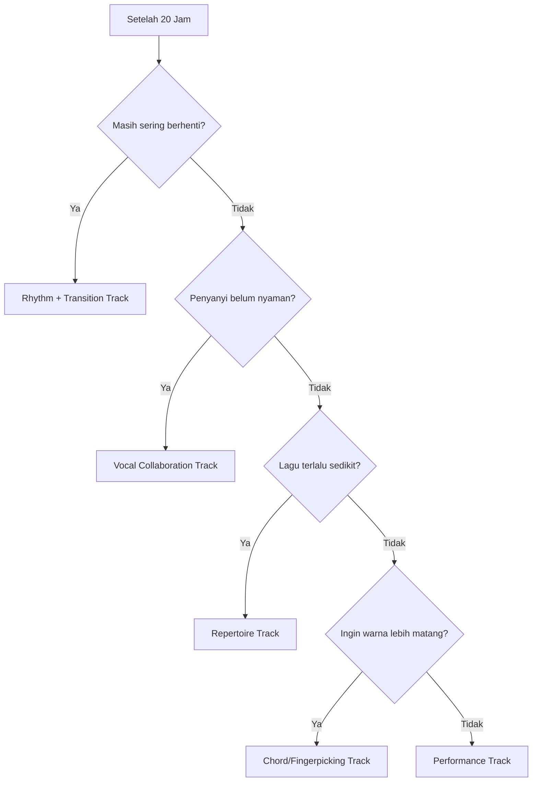
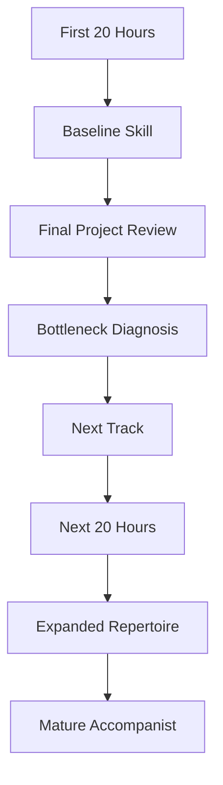

# learn-guitar-accompaniment-part-034.md

# Part 034 — Setelah 20 Jam: Roadmap Lanjutan Menuju Pengiring yang Lebih Matang

## Status Seri

Seri: **Belajar Guitar Accompaniment Berdasarkan The First 20 Hours**  
Bagian: **034 dari 035**  
Fokus: menentukan langkah lanjutan setelah 20 jam pertama, agar kemampuan mengiringi penyanyi berkembang dari “cukup bisa tampil sederhana” menjadi “pengiring yang matang, fleksibel, dan musikal”.

Part ini menjawab pertanyaan:

> Setelah bisa mengiringi 2–3 lagu sederhana, apa berikutnya?

---

## Tujuan Pembelajaran Part Ini

Setelah menyelesaikan part ini, Anda harus bisa:

1. mengevaluasi hasil 20 jam pertama;
2. menentukan skill lanjutan berdasarkan bottleneck;
3. membuat roadmap 20 jam berikutnya;
4. memperluas chord vocabulary secara bertahap;
5. memperbaiki rhythm dan groove;
6. memperdalam fingerpicking;
7. memperluas repertoire;
8. meningkatkan ear training;
9. mulai memahami fretboard lebih luas;
10. bergerak dari pattern-based playing menuju musical accompaniment.

---

## Prinsip Kaufman yang Dipakai di Part Ini

*The First 20 Hours* bukan akhir pembelajaran. Ia adalah fase awal untuk melewati frustrasi dan membangun kemampuan dasar. Setelah 20 jam, Anda punya cukup pengalaman untuk belajar lebih cerdas karena sekarang Anda tahu:

- bottleneck Anda;
- jenis lagu yang cocok;
- chord yang sulit;
- rhythm yang lemah;
- bagaimana vokal bereaksi;
- bagaimana rehearsal terasa;
- bagaimana error terjadi;
- apa yang perlu diperdalam.

Fase setelah 20 jam sebaiknya tidak random. Ia harus berdasarkan diagnosis.

---

# 1. Apa yang Seharusnya Anda Punya Setelah 20 Jam?

Idealnya:

```text
[ ] bisa tune gitar
[ ] tahu chord dasar
[ ] bisa memainkan beberapa progression
[ ] bisa strumming sederhana
[ ] bisa fingerpicking dasar
[ ] tahu capo/transpose minimum
[ ] bisa membuat song map
[ ] bisa intro/ending sederhana
[ ] bisa mengiringi minimal 1–3 lagu sederhana
[ ] tahu cara recording dan review
[ ] tahu bug terbesar
[ ] tahu cara latihan berikutnya
```

Jika semua belum tercapai, tidak apa-apa. Gunakan part ini untuk menentukan prioritas.

---

# 2. Jangan Langsung Mengejar Semua Hal

Setelah 20 jam, godaan besar:

```text
belajar solo
belajar barre chord semua
belajar fingerstyle kompleks
belajar teori jazz
belajar 50 lagu
beli gear baru
belajar improvisasi
```

Semua bisa berguna, tetapi pilih berdasarkan target.

Jika target masih:

```text
mengiringi penyanyi
```

maka prioritas tetap:

```text
rhythm
repertoire
vocal support
chord transition
dynamics
key/capo
ear training
```

---

# 3. Diagnosis Setelah 20 Jam

Isi evaluasi.

```text
Apa lagu yang paling siap?
Apa lagu yang paling sulit?
Chord apa yang masih bermasalah?
Transition apa yang masih lambat?
Pattern apa yang paling stabil?
Apakah tempo sering naik?
Apakah penyanyi nyaman?
Apakah intro/ending jelas?
Apakah saya bisa recover?
Apa yang paling ingin saya tingkatkan?
```

Jawaban ini menentukan roadmap.

---

# 4. Skill Tree Lanjutan



Anda tidak perlu menaikkan semua cabang sekaligus. Pilih 1–2 cabang utama per 20 jam berikutnya.

---

# 5. Roadmap Lanjutan Berdasarkan Bottleneck

## Jika Bottleneck Anda Chord

Fokus:

```text
barre chord dasar
F full
Bm
F#m
B
chord clean
transition
```

## Jika Bottleneck Rhythm

Fokus:

```text
metronome
subdivision
syncopation
strumming groove
6/8
shuffle
percussive muting
```

## Jika Bottleneck Vokal

Fokus:

```text
key selection
listening to singer
dynamics under vocal
cue
rubato
phrasing
```

## Jika Bottleneck Repertoire

Fokus:

```text
10 lagu baru
song map
genre variety
setlist
performance simulation
```

## Jika Bottleneck Sound

Fokus:

```text
tone control
pickup/mic
recording from front
balance
EQ basics
```

---

# 6. 20 Jam Lanjutan — Track A: Rhythm & Groove

Tujuan:

> Membuat iringan terasa lebih stabil, natural, dan tidak kaku.

## Fokus

```text
metronome deeper
accent
ghost strum
syncopation sederhana
palm mute
6/8
shuffle feel
tempo control
```

## Roadmap 20 Jam

```text
0–3 jam   metronome + muted strum
3–6 jam   accent 2/4 dan downbeat
6–9 jam   ghost strum dan pattern variation
9–12 jam  6/8 dan ballad feel
12–15 jam palm mute dan groove rock/pop
15–18 jam play with recordings
18–20 jam record 3 genre feels
```

## Output

```text
[ ] 5 pattern stabil
[ ] 3 tempo berbeda
[ ] 3 genre feel
[ ] recording comparison
```

---

# 7. 20 Jam Lanjutan — Track B: Chord Vocabulary & Barre Chord

Tujuan:

> Memperluas chord yang bisa dimainkan tanpa mengorbankan rhythm.

## Fokus

```text
F full
Bm
F#m
B7
slash chords
sus/add9/maj7
dominant 7
minor key chords
```

## Roadmap

```text
0–4 jam   F full mechanics
4–7 jam   Bm simplified/full
7–10 jam  F#m/B7
10–13 jam chord clean + transition
13–16 jam apply to songs
16–18 jam capo alternatives
18–20 jam 3 songs with one hard chord each
```

## Rule

Jangan belajar chord sebagai koleksi. Pelajari chord dalam lagu/progression.

---

# 8. 20 Jam Lanjutan — Track C: Fingerpicking & Acoustic Texture

Tujuan:

> Membuat verse, intro, bridge, dan ballad lebih intimate.

## Fokus

```text
P-i-m-i
P-i-m-a
P-i-m-a-m-i
alternating bass
simple Travis
bass-strum hybrid
arpeggio endings
```

## Roadmap

```text
0–3 jam   thumb stability
3–6 jam   P-i-m-i across chords
6–9 jam   P-i-m-a-m-i 6/8
9–12 jam  alternating bass
12–15 jam picking-to-strum transitions
15–18 jam 3 ballad arrangements
18–20 jam final recording
```

## Output

```text
[ ] 3 picking patterns
[ ] 2 ballad arrangements
[ ] 1 fingerpicked intro
[ ] 1 picking-to-strum song
```

---

# 9. 20 Jam Lanjutan — Track D: Repertoire Expansion

Tujuan:

> Dari 3 lagu menjadi 10–15 lagu playable.

## Fokus

```text
song selection
key/capo
arrangement sheet
genre variety
setlist
memory
performance simulation
```

## Roadmap

```text
0–3 jam   choose 10 candidate songs
3–6 jam   score and select 5
6–10 jam  arrange 3 safe songs
10–14 jam arrange 3 growth songs
14–17 jam rehearse setlist
17–20 jam record 5-song set
```

## Output

```text
[ ] 10-song backlog
[ ] 5 playable songs
[ ] 1 setlist
[ ] 1 setlist recording
```

---

# 10. 20 Jam Lanjutan — Track E: Vocal Collaboration

Tujuan:

> Menjadi pengiring yang benar-benar responsif terhadap penyanyi.

## Fokus

```text
key test
vocal range
breath
phrasing
rubato
cue
balance
rehearsal workflow
feedback
```

## Roadmap

```text
0–3 jam   vocal-aware listening
3–6 jam   key/capo experiments
6–9 jam   intro/ending cue drills
9–12 jam  dynamics under vocal
12–15 jam rehearsal with singer
15–18 jam recovery with vocal
18–20 jam performance simulation
```

## Output

```text
[ ] 3 songs with singer feedback
[ ] key/capo decisions
[ ] rehearsal notes
[ ] vocal support score
```

---

# 11. 20 Jam Lanjutan — Track F: Ear Training

Tujuan:

> Mendengar masalah lebih cepat dan tidak selalu bergantung pada chord chart.

## Fokus

```text
major/minor
I-IV-V
I-V-vi-IV
bass movement
tempo drift
tuning
vocal pitch comfort
simple chord recognition
```

## Roadmap

```text
0–3 jam   tuning and major/minor
3–6 jam   common progression listening
6–9 jam   identify tonic
9–12 jam  bass note listening
12–15 jam chord chart validation
15–18 jam play by ear simple songs
18–20 jam transcribe basic progression
```

## Output

```text
[ ] recognize major/minor
[ ] hear common progression
[ ] validate simple chord chart
[ ] find tonic in simple songs
```

---

# 12. 20 Jam Lanjutan — Track G: Fretboard & Theory

Tujuan:

> Tidak lagi merasa fretboard sebagai misteri.

## Fokus

```text
notes on E/A strings
root locations
major scale pattern
CAGED intro
movable shapes
triads
capo theory
```

## Roadmap

```text
0–3 jam   notes on string 6 and 5
3–6 jam   root finding
6–9 jam   major scale one position
9–12 jam  triads basic
12–15 jam CAGED overview
15–18 jam movable chord logic
18–20 jam apply to transpose songs
```

## Output

```text
[ ] find roots on E/A strings
[ ] understand movable barre logic
[ ] transpose with less guesswork
```

---

# 13. 20 Jam Lanjutan — Track H: Performance & Stagecraft

Tujuan:

> Tampil lebih tenang, aman, dan profesional.

## Fokus

```text
simulation
setlist
stage setup
soundcheck
mental readiness
mistake recovery
audience interaction
count-in
ending
```

## Roadmap

```text
0–3 jam   performance routine
3–6 jam   no-stop setlist
6–9 jam   stage setup/soundcheck
9–12 jam  video recording
12–15 jam perform for friend/small group
15–18 jam fix stage issues
18–20 jam mini performance
```

## Output

```text
[ ] 3-song live simulation
[ ] video review
[ ] stage checklist
[ ] post-performance notes
```

---

# 14. Memilih Track Lanjutan

Gunakan decision tree:



Pilih berdasarkan bottleneck, bukan rasa penasaran sesaat.

---

# 15. Roadmap 100 Jam

Jika Anda lanjut sampai 100 jam, kira-kira bisa dibagi:

```text
0–20    foundation accompaniment
20–40   rhythm + repertoire expansion
40–60   chord vocabulary + fingerpicking
60–80   vocal collaboration + performance
80–100  ear training + arrangement maturity
```

Ini bukan hukum, tetapi trajectory.

---

# 16. Target Setelah 40 Jam

Setelah 40 jam, target realistis:

```text
[ ] 5–8 lagu playable
[ ] rhythm lebih stabil
[ ] beberapa genre feel
[ ] F/Fmaj7 lebih aman
[ ] capo/transpose lebih cepat
[ ] intro/ending lebih matang
[ ] bisa rehearsal lebih efektif
```

---

# 17. Target Setelah 60 Jam

Setelah 60 jam:

```text
[ ] 10–12 lagu playable
[ ] beberapa barre chord dasar
[ ] fingerpicking lebih natural
[ ] 6/8 lebih stabil
[ ] bisa membuat arrangement sederhana cepat
[ ] bisa mengiringi beberapa penyanyi
```

---

# 18. Target Setelah 100 Jam

Setelah 100 jam:

```text
[ ] 15–25 lagu repertoire
[ ] rhythm cukup matang
[ ] chord vocabulary lebih luas
[ ] bisa transpose lebih nyaman
[ ] bisa memilih voicing
[ ] bisa performance informal dengan aman
[ ] bisa adaptasi lagu baru lebih cepat
```

Masih bukan akhir. Tetapi sudah jauh dari pemula absolut.

---

# 19. Skill yang Layak Dipelajari Setelah Fondasi

## 19.1 Barre Chord

- F;
- Bm;
- F#m;
- B;
- movable E/A shapes.

## 19.2 CAGED System

Untuk memahami shape dan fretboard.

## 19.3 Triads

Untuk voicing kecil, intro, dan fills.

## 19.4 Strumming Advanced

- syncopation;
- percussive mute;
- shuffle;
- 16th note groove.

## 19.5 Fingerpicking Advanced

- alternating bass;
- Travis picking;
- melody fragments;
- arpeggio variation.

## 19.6 Music Theory

- secondary dominant;
- borrowed chords;
- modal mixture;
- chord substitution;
- voice leading.

Pelajari sesuai kebutuhan lagu.

---

# 20. Repertoire Strategy Setelah 20 Jam

Gunakan portfolio.

```text
3 safe songs
3 ballads
3 pop acoustic
2 folk/communal
2 worship/anthemic or komunal
2 rock acoustic
2 personal performance songs
```

Target bukan banyak lagu yang setengah bisa. Target adalah repertoire dengan kategori.

---

# 21. Repertoire Maturity Levels

## Level 1 — Known Chords

Anda tahu chord-nya.

## Level 2 — Playable Sections

Anda bisa verse/chorus.

## Level 3 — Full Run

Anda bisa dari awal sampai akhir.

## Level 4 — Vocal Ready

Bisa dengan penyanyi.

## Level 5 — Performance Ready

Intro, ending, dynamics, recovery siap.

## Level 6 — Flexible

Bisa transpose, adjust tempo, simplify, dan recover.

Target setelah 20 jam: beberapa lagu level 3–5. Target setelah lanjut: lebih banyak lagu level 5–6.

---

# 22. Song Maintenance

Lagu yang sudah bisa akan menurun jika tidak dimainkan.

Buat rotation:

```text
Weekly:
- 2 safe songs
- 1 growth song
- 1 new song
- 1 performance simulation
```

Atau:

```text
Day 1: old repertoire
Day 2: new song
Day 3: technique
Day 4: vocal/rehearsal
Day 5: setlist simulation
```

---

# 23. Practice Ratio Setelah 20 Jam

Rekomendasi:

```text
40% repertoire
25% rhythm/technique
20% vocal/arrangement
10% ear training/theory
5% sound/performance review
```

Jika bottleneck tertentu besar, ubah rasio.

---

# 24. Belajar Lagu Baru Lebih Cepat

Workflow lagu baru:

```text
1. dengarkan lagu
2. cek key dan feel
3. cari chord chart
4. validasi chorus
5. pilih key/capo
6. buat song map
7. pilih pattern
8. desain intro/ending
9. full run
10. rehearsal
```

Target setelah beberapa bulan:

```text
lagu sederhana bisa dibuat arrangement awal dalam 30–60 menit
```

---

# 25. Mengembangkan Ear dan Taste

Setelah fondasi, dengarkan banyak acoustic accompaniment.

Saat mendengar, tanya:

```text
Apa pattern-nya?
Kapan gitar turun?
Kapan chorus naik?
Apakah ada picking?
Apakah ada capo?
Bagaimana ending?
Apakah vokal punya ruang?
```

Taste berkembang dari mendengar aktif.

---

# 26. Mengembangkan Groove

Groove berkembang dari:

- metronome;
- playing with recordings;
- muted strum;
- accent control;
- body movement;
- recording;
- listening to drummers/bassists;
- not overplaying.

Latihan groove:

```text
1 chord, 5 menit, metronome, variasi accent.
```

Sederhana tetapi efektif.

---

# 27. Mengembangkan Dynamics

Lakukan dynamic practice eksplisit:

```text
same progression:
level 1
level 2
level 3
level 4
back to level 1
```

Lalu apply ke lagu.

Tujuan:

```text
kontrol gradual, bukan on/off
```

---

# 28. Mengembangkan Fingerpicking

Jangan belajar pattern baru terus. Matangkan pattern yang ada.

Urutan:

```text
P-i-m-i stable
P-i-m-a stable
P-i-m-a-m-i 6/8
alternating bass
Travis simplified
song application
```

Selalu apply ke lagu.

---

# 29. Mengembangkan Chord Vocabulary

Belajar chord dalam keluarga.

## Key G

```text
G Am Bm C D Em
```

## Key C

```text
C Dm Em F G Am
```

## Key D

```text
D Em F#m G A Bm
```

## Key A

```text
A Bm C#m D E F#m
```

Gunakan capo untuk mengurangi barre di awal, tetapi pelajari barre perlahan.

---

# 30. Mengembangkan Voicing

Setelah basic voicing:

- triads di senar 1–3;
- partial chord;
- inversions;
- CAGED voicing;
- chord melody fragments;
- double stops.

Tetap gunakan untuk support vokal.

---

# 31. Mengembangkan Arrangement

Coba buat 3 versi lagu sama:

```text
Version 1: campfire simple
Version 2: intimate ballad
Version 3: full acoustic performance
```

Ini melatih fleksibilitas.

Pertanyaan:

```text
Apa yang berubah?
Pattern?
Dynamics?
Voicing?
Tempo?
Intro?
Ending?
```

---

# 32. Mengembangkan Rehearsal Skill

Rehearsal skill sama pentingnya dengan gitar.

Latih:

- bertanya key dengan baik;
- memberi cue;
- menerima feedback;
- mencatat action item;
- mengatur waktu rehearsal;
- menentukan go/no-go.

Pengiring matang bukan hanya main bagus, tetapi membuat penyanyi merasa aman.

---

# 33. Mengembangkan Sound

Jika mulai sering tampil, pelajari:

- pickup types;
- DI/preamp;
- EQ;
- mic placement;
- feedback control;
- monitor;
- recording basics.

Tetapi tetap ingat:

```text
Tone starts from hands.
```

---

# 34. Mengembangkan Performance Psychology

Performance skill tumbuh dari exposure.

Langkah:

```text
1. rekam audio
2. rekam video
3. main di depan 1 teman
4. main di depan 3 teman
5. main informal
6. open mic / acara kecil
7. performance lebih formal
```

Jangan menunggu tidak gugup. Latih tetap bermain saat gugup.

---

# 35. Membuat Personal Learning Backlog

Buat backlog:

```text
Technique:
- F barre
- Bm
- palm mute

Rhythm:
- 6/8
- shuffle
- syncopation

Songs:
- Song A
- Song B

Vocal:
- key test
- cue

Sound:
- pickup
- recording

Theory:
- CAGED
- triads
```

Pilih 1–2 item per minggu.

---

# 36. Monthly Review

Setiap bulan, jawab:

```text
Berapa lagu level performance-ready?
Apa bottleneck utama?
Apa lagu baru yang selesai?
Apa recording terbaik?
Apa feedback penyanyi?
Apa teknik yang membaik?
Apa yang harus dihentikan?
Apa fokus bulan depan?
```

Ini menjaga progres tetap sadar.

---

# 37. Jangan Terjebak Gear Acquisition

Gear bagus menyenangkan, tetapi jangan menjadi pelarian dari latihan.

Tanya sebelum beli:

```text
Apakah gear ini menyelesaikan bottleneck nyata?
Apakah bottleneck saya sebenarnya skill?
Apakah saya sudah bisa memanfaatkan gear ini?
Apakah ini untuk performance yang benar-benar akan saya lakukan?
```

Prioritas tetap:

```text
tuning
rhythm
vocal support
repertoire
sound control
```

---

# 38. Jangan Terjebak Tutorial Addiction

Setelah 20 jam, Anda akan menemukan banyak tutorial.

Aturan:

```text
1 tutorial → 1 drill → 1 song application
```

Jika tutorial tidak masuk ke lagu, jangan dihitung sebagai progress utama.

---

# 39. Jangan Mengukur Diri dari Gitaris Profesional

Bandingkan dengan diri Anda 20 jam lalu.

Pertanyaan:

```text
Apakah saya bisa tune lebih cepat?
Apakah chord lebih bersih?
Apakah tempo lebih stabil?
Apakah saya bisa selesai lagu?
Apakah saya lebih mendengar vokal?
Apakah saya bisa recover?
```

Progress musik sering terasa lambat karena telinga Anda juga membaik. Saat telinga membaik, Anda mendengar lebih banyak kekurangan. Itu tanda kemajuan.

---

# 40. Milestone Lanjutan

## Milestone 1

```text
3 lagu full run
```

## Milestone 2

```text
3 lagu dengan penyanyi
```

## Milestone 3

```text
5 lagu setlist
```

## Milestone 4

```text
1 performance informal
```

## Milestone 5

```text
10 lagu repertoire
```

## Milestone 6

```text
transpose lagu sederhana untuk penyanyi dalam <10 menit
```

## Milestone 7

```text
membuat acoustic arrangement dari lagu baru dalam 1 jam
```

---

# 41. Recommended Next Learning Series

Setelah seri ini, beberapa seri lanjutan yang masuk akal:

## 41.1 Guitar Rhythm & Groove Deep Dive

Fokus:

- strumming advanced;
- syncopation;
- groove;
- percussive acoustic;
- 16th note;
- shuffle;
- tempo control.

## 41.2 Acoustic Fingerpicking for Accompaniment

Fokus:

- alternating bass;
- Travis picking;
- 6/8 picking;
- arpeggio arrangement;
- intro/outro;
- pattern variation.

## 41.3 Music Theory for Guitar Accompaniment

Fokus:

- CAGED;
- triads;
- chord function;
- secondary dominant;
- modal mixture;
- transposition;
- reharmonization sederhana.

## 41.4 Vocal Accompaniment and Rehearsal Skills

Fokus:

- key selection;
- singer communication;
- rubato;
- phrasing;
- arrangement for vocal;
- rehearsal workflow.

## 41.5 Acoustic Arrangement Workshop

Fokus:

- full band to acoustic;
- dynamics;
- voicing;
- bass line;
- texture;
- performance version.

## 41.6 Guitar Performance & Stage Sound

Fokus:

- soundcheck;
- mic/pickup;
- DI/EQ;
- stage monitoring;
- performance routine;
- setlist management.

---

# 42. Choosing the Next Series

Gunakan ini:

```text
Jika rhythm masih goyah → Rhythm & Groove
Jika ingin lagu lembut → Fingerpicking
Jika chord/key membingungkan → Theory/CAGED
Jika sering dengan penyanyi → Vocal/Rehearsal
Jika ingin bikin versi acoustic → Arrangement Workshop
Jika mulai tampil → Stage Sound/Performance
```

Jangan pilih hanya karena terlihat keren. Pilih yang menyelesaikan bottleneck.

---

# 43. Roadmap 6 Bulan

Jika latihan 3–5 kali seminggu:

## Bulan 1

```text
selesaikan 20 jam pertama
3 lagu sederhana
```

## Bulan 2

```text
rhythm + 5 lagu
```

## Bulan 3

```text
fingerpicking + ballad
```

## Bulan 4

```text
barre chord + capo/transpose
```

## Bulan 5

```text
rehearsal dengan penyanyi + setlist
```

## Bulan 6

```text
performance informal + recording portfolio
```

Target 6 bulan:

```text
10–15 lagu playable
2–3 lagu performance-ready kuat
bisa adaptasi key
bisa rehearsal efektif
```

---

# 44. Roadmap 1 Tahun

Dalam 1 tahun latihan konsisten:

```text
20–30 lagu repertoire
barre chord dasar cukup aman
fingerpicking beberapa style
rhythm lebih natural
bisa mengiringi beberapa penyanyi
bisa membuat acoustic arrangement
bisa tampil informal
bisa belajar lagu baru lebih cepat
```

Kuncinya bukan latihan brutal, tetapi konsistensi dan feedback.

---

# 45. Personal Style Development

Setelah fondasi, mulai cari gaya.

Pertanyaan:

```text
Apakah saya lebih suka ballad?
Apakah saya suka folk storytelling?
Apakah saya suka pop acoustic?
Apakah saya suka worship/anthemic build?
Apakah saya suka rock acoustic?
Apakah saya suka fingerpicking?
```

Personal style tumbuh dari repertoire dan taste, bukan diputuskan secara abstrak.

---

# 46. Menjadi Pengiring yang Baik

Pengiring yang baik:

```text
mendengar penyanyi
menjaga tempo
tidak overplay
punya dynamics
tahu key
bisa cue
bisa recover
punya tone yang mendukung
membuat lagu terasa aman
```

Pengiring yang belum matang:

```text
ingin terlihat keren
terlalu keras
mengabaikan vokal
terlalu banyak fill
tidak tahu ending
panik saat salah
tidak tune
```

Gunakan ini sebagai kompas jangka panjang.

---

# 47. Setelah 20 Jam, Apa yang Harus Tetap Dilakukan?

Tetap lakukan:

```text
[ ] tune setiap sesi
[ ] metronome practice
[ ] recording review
[ ] full run
[ ] vocal simulation
[ ] bug log
[ ] song map
[ ] ending drill
```

Jangan tinggalkan fondasi hanya karena sudah masuk skill lanjutan.

---

# 48. Latihan 45 Menit untuk Part Ini

## Block 1 — Post-20-Hour Review, 10 Menit

Isi evaluasi.

## Block 2 — Bottleneck Selection, 10 Menit

Pilih 1–2 bottleneck utama.

## Block 3 — Track Selection, 5 Menit

Pilih track lanjutan.

## Block 4 — Roadmap 20 Jam Berikutnya, 10 Menit

Tulis jam 0–20 berikutnya.

## Block 5 — First Drill, 5 Menit

Langsung lakukan drill pertama.

## Block 6 — Commitment Note, 5 Menit

Tulis target minggu ini.

---

# 49. Latihan 15 Menit

```text
5 menit  review 20 jam pertama
5 menit  pilih bottleneck
5 menit  tulis next 5 sessions
```

Jika hanya 5 menit:

```text
Tulis satu kalimat:
"20 jam berikutnya fokus saya adalah ..."
```

---

# 50. Mini Project Part Ini

Buat roadmap 20 jam lanjutan pribadi.

Template:

```text
Current level:
Songs playable:
Biggest bottleneck:
Chosen track:
Why:
20-hour goal:
Success criteria:
Practice schedule:
Metrics:
First 5 sessions:
Next repertoire:
Risk:
Fallback:
```

Target:

> Anda punya arah setelah fondasi, bukan kembali random.

---

# 51. Acceptance Criteria Part 034

Anda boleh lanjut ke part 035 jika:

```text
[ ] Bisa mengevaluasi hasil 20 jam pertama
[ ] Bisa menentukan bottleneck utama
[ ] Bisa memilih track lanjutan
[ ] Bisa membuat roadmap 20 jam berikutnya
[ ] Bisa menjelaskan target 40/60/100 jam
[ ] Bisa membuat repertoire maintenance plan
[ ] Bisa membuat personal learning backlog
[ ] Bisa memilih next learning series
[ ] Bisa membuat milestone 6 bulan
[ ] Bisa menjaga fokus pada accompaniment, bukan sekadar skill acak
```

---

# 52. Ringkasan Mental Model

20 jam pertama adalah bootstrap. Setelah itu, belajar menjadi lebih berbasis diagnosis.



Jangan berhenti di 20 jam. Gunakan 20 jam pertama sebagai fondasi untuk belajar lebih cerdas.

---

# 53. Output Part Ini

Output konkret:

1. Evaluasi hasil 20 jam pertama.
2. Bottleneck utama.
3. Track lanjutan yang dipilih.
4. Roadmap 20 jam berikutnya.
5. Repertoire maintenance plan.
6. Personal learning backlog.
7. Rekomendasi seri lanjutan.

Part berikutnya adalah bagian terakhir:

> **Appendix: Cheat Sheet, Checklist, Templates, dan Referensi Latihan.**

