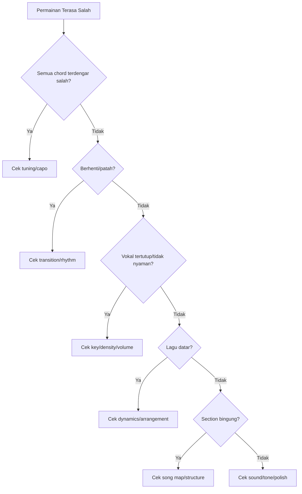
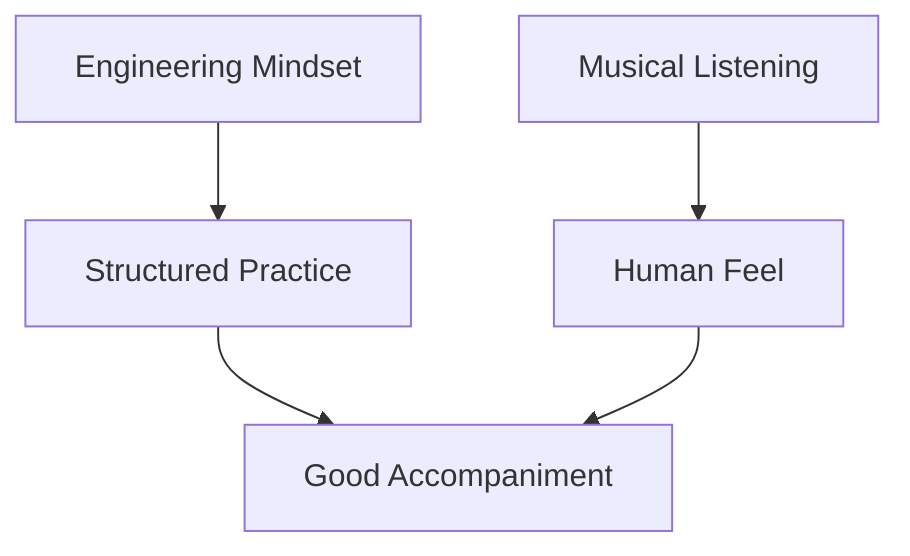
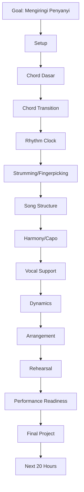

# learn-guitar-accompaniment-part-035.md

# Part 035 — Appendix: Cheat Sheet, Checklist, Templates, dan Referensi Latihan

## Status Seri

Seri: **Belajar Guitar Accompaniment Berdasarkan The First 20 Hours**  
Bagian: **035 dari 035**  
Status: **BAGIAN TERAKHIR / SERI SELESAI**  
Fokus: menyediakan appendix praktis yang bisa dipakai sebagai referensi cepat selama latihan, rehearsal, arrangement, debugging, dan performance.

Bagian ini bukan materi baru yang berat. Ini adalah “operational manual” ringkas yang merangkum seluruh seri menjadi alat pakai harian.

---

## Cara Menggunakan Appendix Ini

Gunakan appendix ini seperti:

```text
cheat sheet
practice companion
debugging guide
rehearsal worksheet
performance checklist
arrangement template
progress tracker
```

Tidak perlu dibaca linear dari atas ke bawah setiap kali. Ambil bagian yang dibutuhkan:

- mau latihan 15 menit → pakai template latihan;
- mau pilih lagu → pakai song selection checklist;
- mau rehearsal → pakai rehearsal notes;
- mau tampil → pakai performance readiness;
- permainan terasa salah → pakai debugging matrix;
- mau transpose → pakai capo/roman numeral cheat sheet.

---

# 1. Prinsip Utama Seluruh Seri

Jika harus diringkas menjadi beberapa prinsip:

```text
1. Tujuan gitar pengiring adalah membuat penyanyi terdengar lebih baik.
2. Rhythm lebih penting daripada chord sempurna.
3. Jangan berhenti saat salah; recover.
4. Key/capo harus melayani vokal.
5. Verse harus memberi ruang; chorus harus mendukung.
6. Intro dan ending harus jelas.
7. Latihan harus aktif, terukur, dan direkam.
8. Lagu mudah yang dibawakan stabil lebih baik daripada lagu sulit yang patah-patah.
9. Arrangement adalah keputusan sadar, bukan sekadar chord chart.
10. Musik dinilai dari suara, bukan dari bentuk jari.
```

Mantra utama:

> **Rhythm first, vocal first, ego last.**

---

# 2. Minimum Viable Accompanist Checklist

Anda berada di level minimum viable accompanist jika:

```text
[ ] Bisa tune gitar dengan tuner
[ ] Bisa memainkan chord dasar G, C, D, Em, Am
[ ] Bisa memainkan Fmaj7 sebagai F sederhana
[ ] Bisa berpindah chord tanpa berhenti total
[ ] Bisa menjaga strumming sederhana
[ ] Bisa memainkan progression G-D-Em-C
[ ] Bisa memainkan progression C-G-Am-Fmaj7
[ ] Bisa membaca chord chart sederhana
[ ] Bisa membuat song map
[ ] Bisa membuat intro sederhana
[ ] Bisa membuat ending final chord
[ ] Bisa menggunakan capo dasar
[ ] Bisa memilih key yang lebih nyaman untuk penyanyi
[ ] Bisa membedakan verse dan chorus secara dynamics
[ ] Bisa full run minimal satu lagu
[ ] Bisa recover dari chord salah kecil
```

Target 20 jam pertama bukan lebih dari ini. Jika ini tercapai, Anda sudah punya fondasi nyata.

---

# 3. Pre-Practice Checklist

Sebelum latihan:

```text
[ ] Gitar siap
[ ] Tuner siap
[ ] Capo siap
[ ] Pick siap
[ ] Metronome siap
[ ] HP recording siap
[ ] Chord/arrangement sheet siap
[ ] Target sesi ditulis
[ ] Timer disiapkan
[ ] Tidak membuka terlalu banyak tutorial
```

Kalimat target sesi:

```text
Hari ini saya melatih: ______________________
Lagu/progression: __________________________
Bug utama yang ingin diperbaiki: ____________
```

---

# 4. Pre-Performance Checklist 60 Detik

Sebelum lagu dimulai:

```text
[ ] Capo benar?
[ ] Gitar sudah tune?
[ ] Chord pertama ingat?
[ ] Tempo terasa?
[ ] Intro berapa bar?
[ ] Penyanyi siap?
[ ] Vocal entry jelas?
[ ] Ending ingat?
[ ] Pick aman?
[ ] Napas tenang?
```

Jika hanya sempat 10 detik:

```text
Capo. Tune. First chord. Tempo. Singer.
```

---

# 5. Chord Shape Cheat Sheet

## Chord Dasar

```text
G      = 320003
G alt  = 320033
C      = x32010
D      = xx0232
Em     = 022000
Am     = x02210
A      = x02220
E      = 022100
Dm     = xx0231
Fmaj7  = x33210
F small= xx3211
```

## Chord Warna Aman

```text
Cadd9  = x32033
Em7    = 022033
Am7    = x02010
Dsus4  = xx0233
Dsus2  = xx0230
Asus4  = x02230
A7     = x02020
E7     = 020100
B7     = x21202
```

## Slash Chord Dasar

```text
G/B    = x20033
D/F#   = 2x0232
C/E    = 032010
```

Jika slash chord membuat rhythm berhenti:

```text
G/B  → G
D/F# → D
C/E  → C
```

---

# 6. Root/Bass String Cheat Sheet

| Chord | Root/Bass | Mulai Strum dari |
|---|---|---|
| G | senar 6 fret 3 | senar 6 |
| C | senar 5 fret 3 | senar 5 |
| D | senar 4 open | senar 4 |
| Em | senar 6 open | senar 6 |
| Am | senar 5 open | senar 5 |
| A | senar 5 open | senar 5 |
| E | senar 6 open | senar 6 |
| Dm | senar 4 open | senar 4 |
| Fmaj7 | senar 5 fret 3 / senar 4 fret 3 | senar 5/4 |

Kesalahan umum:

```text
C dan D distrum dari senar 6 terlalu keras.
```

Fix:

```text
C mulai dari senar 5.
D mulai dari senar 4.
```

---

# 7. Progression Cheat Sheet

## Level 1 — Sangat Aman

```text
G - D - Em - C
Em - C - G - D
G - C - D - G
G - Em - C - D
```

## Level 2 — Aman + Sedikit Growth

```text
C - G - Am - Fmaj7
Am - Fmaj7 - C - G
C - Am - Fmaj7 - G
C - Fmaj7 - G - C
D - G - A - D
```

## Level 3 — Growth

```text
Am - G - Fmaj7 - E7
G - D/F# - Em - C
C - G/B - Am - Fmaj7
E - A - B7 - E
```

## Level 4 — Butuh Capo/Barre Strategy

```text
D - A - Bm - G
A - E - F#m - D
```

Capo alternatives:

```text
D-A-Bm-G = C-G-Am-F shape capo 2
A-E-F#m-D = G-D-Em-C shape capo 2
```

---

# 8. Roman Numeral Cheat Sheet

## Major Key Formula

```text
I   = major
ii  = minor
iii = minor
IV  = major
V   = major
vi  = minor
vii°= diminished
```

## Key C

```text
I   C
ii  Dm
iii Em
IV  F
V   G
vi  Am
```

## Key G

```text
I   G
ii  Am
iii Bm
IV  C
V   D
vi  Em
```

## Key D

```text
I   D
ii  Em
iii F#m
IV  G
V   A
vi  Bm
```

## Progression Umum

```text
I - V - vi - IV
vi - IV - I - V
I - IV - V - I
I - vi - IV - V
ii - V - I
```

---

# 9. Chromatic / Capo Cheat Sheet

Urutan 12 nada:

```text
C C#/Db D D#/Eb E F F#/Gb G G#/Ab A A#/Bb B C
```

Aturan:

```text
1 fret = naik 1 semitone
capo 2 = naik 2 semitone
```

## G Shape Capo

| Capo | Sound |
|---:|---|
| 0 | G |
| 1 | Ab |
| 2 | A |
| 3 | Bb |
| 4 | B |
| 5 | C |
| 6 | Db |
| 7 | D |

## C Shape Capo

| Capo | Sound |
|---:|---|
| 0 | C |
| 1 | Db |
| 2 | D |
| 3 | Eb |
| 4 | E |
| 5 | F |
| 6 | Gb |
| 7 | G |

## D Shape Capo

| Capo | Sound |
|---:|---|
| 0 | D |
| 1 | Eb |
| 2 | E |
| 3 | F |
| 4 | Gb |
| 5 | G |

---

# 10. Strumming Pattern Cheat Sheet

Notation:

```text
D = downstroke
U = upstroke
- = tangan bergerak tapi tidak membunyikan
x = muted/percussive
> = accent
B = bass
T = treble/light strum
```

## Pattern 1 — One Strum per Chord

```text
D - - -
```

Use:

```text
pemula absolut
intro sederhana
ending
debug chord
```

## Pattern 2 — Downstroke Quarter

```text
1 2 3 4
D D D D
```

Use:

```text
lagu sederhana
komunal
tempo stability
```

## Pattern 3 — Basic 8th

```text
1 & 2 & 3 & 4 &
D U D U D U D U
```

Use:

```text
clock training
rock/pop driving
```

## Pattern 4 — Pop Standard

```text
1 & 2 & 3 & 4 &
D - D U - U D U
```

Use:

```text
pop acoustic chorus
```

## Pattern 5 — Sparse Verse

```text
1 & 2 & 3 & 4 &
D - - U D - - U
```

Use:

```text
verse
lirik padat
vokal lembut
```

## Pattern 6 — Ballad 4/4

```text
1 & 2 & 3 & 4 &
D - D U D - D U
```

Use:

```text
ballad slow
pop mellow
```

## Pattern 7 — Folk Bass-Strum

```text
1 2 3 4
B T B T
```

Use:

```text
folk
communal
story-driven
```

## Pattern 8 — 6/8

```text
1 2 3 4 5 6
D - U D - U
```

Accent:

```text
1 and 4
```

---

# 11. Fingerpicking Cheat Sheet

Notation:

```text
P = thumb
i = index
m = middle
a = ring
```

## Right Hand Assignment

```text
Thumb/P = senar 6, 5, 4
Index/i = senar 3
Middle/m = senar 2
Ring/a = senar 1
```

## Pattern 1 — P-i-m-i

```text
P i m i
```

Use:

```text
verse
folk
singer-songwriter
```

## Pattern 2 — P-i-m-a

```text
P i m a
```

Use:

```text
arpeggio naik
intro
```

## Pattern 3 — 6/8 Picking

```text
1 2 3 4 5 6
P i m a m i
```

Use:

```text
6/8 ballad
long vocal phrase
```

## Pattern 4 — Bass Twice

```text
P i m i P i m i
```

Use:

```text
4/4 ballad
steady picking
```

## Bass per Chord

```text
G  : P senar 6
C  : P senar 5
D  : P senar 4
Em : P senar 6
Am : P senar 5
```

---

# 12. 4/4, 3/4, 6/8 Cheat Sheet

## 4/4

```text
1 2 3 4
1 & 2 & 3 & 4 &
```

Use:

```text
pop
rock
folk
most common
```

## 3/4

```text
1 2 3
>    
```

Feel:

```text
ONE two three
```

Pattern:

```text
B D D
```

## 6/8

```text
1 2 3 4 5 6
>     >
```

Feel:

```text
ONE-la-li TWO-la-li
```

Pattern:

```text
D - U D - U
P i m a m i
```

Rule:

```text
Jangan paksa lagu 6/8 menjadi pattern 4/4.
```

---

# 13. Dynamic Ladder

Gunakan level:

```text
0 = silence
1 = single strum per bar
2 = bass only / sparse picking
3 = downstroke light
4 = sparse pattern
5 = medium pattern
6 = full pattern
7 = full pattern + accent
8 = final chorus energy
```

Section default:

```text
Intro       2–4
Verse 1     2–4
Pre-Chorus  4–5
Chorus      5–7
Verse 2     3–5
Bridge      2–6 depending arrangement
Final       6–8
Outro       1–3
```

Mantra:

```text
Jangan mulai terlalu besar.
Simpan ruang untuk chorus/final.
```

---

# 14. Song Selection Checklist

Pilih lagu dengan:

```text
[ ] chord 3–5
[ ] chord open-friendly
[ ] tempo lambat/sedang
[ ] struktur jelas
[ ] key bisa disesuaikan
[ ] intro bisa disederhanakan
[ ] ending bisa dibuat final chord
[ ] vocal range nyaman
[ ] tidak banyak barre chord
[ ] tidak banyak syncopation sulit
```

Red flags:

```text
[ ] banyak barre chord
[ ] tempo cepat
[ ] chord berubah tiap 2 beat
[ ] modulasi
[ ] intro ikonik sulit
[ ] struktur rumit
[ ] bridge panjang dengan chord baru
[ ] range vokal ekstrem
[ ] ending kompleks
```

---

# 15. Safe / Growth / Performance Song

## Safe Song

```text
mudah
stabil
confidence
fallback
```

## Growth Song

```text
satu tantangan baru
masih realistis
skill expansion
```

## Performance Song

```text
cocok untuk penyanyi/audience
emotional impact
cukup aman
```

Final 20 jam ideal:

```text
1 safe
1 growth
1 performance
```

---

# 16. Song Difficulty Scoring

Skor 1–5.

| Area | Score |
|---|---:|
| Chord difficulty | 1–5 |
| Transition speed | 1–5 |
| Rhythm complexity | 1–5 |
| Structure complexity | 1–5 |
| Vocal range risk | 1–5 |
| Capo/transpose complexity | 1–5 |
| Performance pressure | 1–5 |

Interpretasi:

```text
7–12  = safe
13–20 = growth
21+   = later / simplify
```

---

# 17. Arrangement Sheet Template

```text
# Arrangement Sheet

Title:
Singer:
Context:
Original key:
Chosen key:
Guitar shape:
Capo:
Tempo:
Feel/meter:

## Song Map
Intro:
Verse 1:
Pre-Chorus:
Chorus:
Verse 2:
Bridge:
Final Chorus:
Outro:

## Pattern Map
Intro:
Verse:
Pre-Chorus:
Chorus:
Bridge:
Final Chorus:
Outro:

## Dynamic Map
Intro:
Verse:
Pre-Chorus:
Chorus:
Bridge:
Final Chorus:
Outro:

## Voicing / Bass
Base chords:
Voicing options:
Slash chords:
Simplifications:

## Vocal Support
Vocal entry:
Hardest vocal section:
Where guitar must be sparse:
Where guitar can build:
Breath/rubato notes:

## Cues
Count-in:
Vocal entry cue:
Chorus cue:
Bridge cue:
Ending cue:

## Risks
P0:
P1:
Fallback:

## Definition of Done
[ ] key/capo final
[ ] intro clear
[ ] ending clear
[ ] full run instrumental
[ ] full run with vocal/simulation
[ ] recording reviewed
[ ] readiness score done
```

---

# 18. Song Map Template

```text
Title:
Key/Capo:
Tempo:
Feel:

Intro:
Verse 1:
Pre-Chorus:
Chorus:
Verse 2:
Chorus:
Bridge:
Final Chorus:
Outro:
```

Example:

```text
Intro: G-D-Em-C x1
Verse: G-D-Em-C x2
Chorus: G-D-Em-C x2
Bridge: Em-C-G-D x1
Final Chorus: G-D-Em-C x2
Outro: G final
```

---

# 19. Vocal-Aware Map Template

```text
Title:
Singer:
Key/Capo:

Vocal entry:
Hardest high note:
Lowest verse note:
Dense lyric section:
Breath points:
Where guitar must reduce:
Where guitar can fill:
Where chorus needs support:
Rubato moments:
Ending vocal cue:
```

Questions for singer:

```text
Chorus terlalu tinggi?
Verse terlalu rendah?
Tempo nyaman?
Gitar terlalu ramai di mana?
Mau intro berapa bar?
Ending mau stop atau sustain?
```

---

# 20. Rehearsal Notes Template

```text
# Rehearsal Notes

Date:
Participants:
Songs:

## Song 1
Key/capo:
Tempo:
Intro:
Vocal entry:
Verse treatment:
Chorus treatment:
Bridge:
Ending:
Issues:
Decisions:
Action items:

## General Notes
Balance:
Cue:
Dynamics:
Sound:
Next rehearsal focus:
```

Action item format:

```text
Problem:
Owner:
Next action:
Due:
```

---

# 21. Rehearsal Agreement Template

```text
Title:
Key/capo:
Tempo:
Intro length:
Vocal entry:
Verse guitar:
Chorus guitar:
Bridge:
Ending:
If vocal late:
If vocal early:
If lyric forgotten:
If guitarist error:
Emergency fallback:
```

Example:

```text
If vocal late: repeat intro once.
If vocal early: cut intro and follow.
If guitarist error: singer keeps singing, guitarist recovers.
Fallback: repeat chorus progression and end on tonic.
```

---

# 22. Practice Log Template

```text
# Guitar Practice Log

Date:
Session duration:
Total active hours:

Primary focus:
Secondary focus:
Song/progression:

Warm-up:
Skill drill:
Song work:
Performance run:
Recording:

Metrics:
- Tempo:
- Changes/min:
- Stop count:
- Full run: yes/no
- Vocal support score:
- Recovery score:

Biggest bug:
Root cause hypothesis:
Fix drill:
Next action:

Confidence:
Energy:
Notes:
```

---

# 23. Bug Log Template

```text
# Guitar Bug Log

Date:
Song:
Symptom:
Severity: P0/P1/P2/P3
Where it happens:
Reproducible? yes/no
Hypothesis:
Test:
Root cause:
Fix drill:
Verification:
Next action:
```

Example:

```text
Symptom: C telat setelah Em
Severity: P1
Root cause: C shape belum otomatis
Fix drill: Em-C low-lift one-minute changes
Verification: chorus full run no-stop 2x
```

---

# 24. Performance Readiness Checklist

Per lagu:

```text
Title:
Key:
Capo:
Tempo:
Feel:

Technical:
[ ] chord cukup stabil
[ ] transition cukup aman
[ ] rhythm tidak berhenti total
[ ] structure jelas
[ ] intro jelas
[ ] ending jelas

Vocal:
[ ] key nyaman
[ ] vocal entry jelas
[ ] verse memberi ruang
[ ] chorus mendukung
[ ] hard vocal section diuji

Arrangement:
[ ] pattern map ada
[ ] dynamic map ada
[ ] voicing/simplification disepakati
[ ] bridge/contrast jelas

Recovery:
[ ] fallback chord/rhythm ada
[ ] jika singer telat ada plan
[ ] jika ending ragu ada plan
[ ] no-stop run pernah dilakukan

Proof:
[ ] full run instrumental
[ ] full run dengan vokal/simulasi
[ ] recording direview
[ ] tidak ada P0
```

---

# 25. Readiness Score Template

Skor 1–5.

```text
Tuning:
Chord clarity:
Transition:
Rhythm/tempo:
Structure:
Intro/cue:
Ending:
Dynamics:
Vocal support:
Recovery:
Sound/balance:
Confidence:
```

No-go jika:

```text
key/capo belum final
intro tidak jelas
ending tidak jelas
sering berhenti total
struktur belum jelas
vokal tidak nyaman
```

---

# 26. P0/P1/P2/P3 Severity Cheat Sheet

## P0 — Fatal

```text
gitar fals
capo/key salah
tidak tahu struktur
intro gagal
ending tidak jelas
berhenti total
penyanyi tidak nyaman key
```

## P1 — High

```text
tempo drift besar
chord telat berulang
verse menutup vokal
bridge ragu
sound terlalu keras/feedback risk
```

## P2 — Medium

```text
buzzing kecil
pattern kurang halus
dynamics kurang jelas
voicing kurang matang
```

## P3 — Polish

```text
fill kurang rapi
ornament belum elegan
tone belum ideal
```

Fix order:

```text
P0 → P1 → P2 → P3
```

---

# 27. Debugging Master Matrix

| Category | Symptom | First Check | Likely Fix |
|---|---|---|---|
| Tuning | semua chord salah | tuner | tune/capo |
| Chord | string mati | pick one-by-one | finger placement |
| Transition | stop before chord | pair drill | low-lift |
| Rhythm | tempo drift | metronome recording | simplify/count |
| Strumming | pattern hilang | muted strum | slow/count |
| Picking | bass salah | thumb only | root table |
| Structure | lupa section | song map | section drill |
| Dynamics | lagu datar | verse/chorus recording | dynamic map |
| Vocal | lirik tertutup | vocal recording | reduce density |
| Capo | key salah | shape/sound note | capo sheet |
| Sound | tone buruk | front recording | technique/EQ |
| Mental | panik | simulation | no-stop drill |

---

# 28. Global Debugging Flow



---

# 29. Drill Selector

| Problem | Drill |
|---|---|
| chord tidak bersih | pick-one-by-one |
| transition lambat | one-minute changes |
| rhythm goyah | muted metronome strum |
| pattern hilang | count aloud + muted strum |
| picking lemah | thumb-only + P-i-m-i |
| tempo naik | smaller motion + metronome |
| struktur lupa | song map recitation |
| ending ragu | ending drill 10x |
| vokal tertutup | sparse verse drill |
| key salah | chorus capo test |
| panik saat salah | forced mistake no-stop |

---

# 30. One-Minute Change Drill Template

```text
Chord pair:
Timer: 60 seconds
Count only clean-enough changes.
Do not stop for perfection.
```

Pairs:

```text
G-D:
G-C:
D-Em:
Em-C:
C-Am:
Am-Fmaj7:
D-A:
C-G:
```

Target:

```text
20/min = mulai connect
30/min = cukup untuk slow song
40/min = lebih aman
60/min = nyaman
```

---

# 31. Chord Clean Test Template

```text
Chord:
Shape:
Target strings:
Muted strings:
Problem string:
Fix:
Clean rate:
```

Procedure:

```text
1. bentuk chord
2. petik string target satu-satu
3. tandai string mati/buzzing
4. koreksi
5. ulang 5–10 kali
```

---

# 32. No-Stop Run Rules

```text
[ ] mulai dari intro
[ ] lanjut sampai ending
[ ] tidak restart
[ ] jika salah, recover
[ ] catat setelah selesai
[ ] rekam jika mungkin
```

Mantra:

```text
Performance tidak punya tombol restart.
```

---

# 33. Forced Mistake Drill

Progression:

```text
G - D - Em - C
```

Drill:

```text
1. mainkan progression
2. sengaja telat di C
3. pakai muted strum
4. masuk C di beat berikut
5. lanjut
```

Variasi:

```text
sengaja chord salah
sengaja pattern hilang
sengaja vocal entry telat
pick drop simulation
```

Target:

```text
error tidak otomatis menjadi stop.
```

---

# 34. Intro Templates

## Intro Progression x1

```text
G-D-Em-C x1
vocal masuk setelah C
```

## Half Intro

```text
G-D
vocal masuk setelah D
```

## Chorus Intro

```text
mainkan chorus progression x1
```

## Picking Intro

```text
P-i-m-i over progression x1
```

## Hold Cue

```text
tahan chord terakhir 2 beat
eye contact
vocal masuk
```

---

# 35. Ending Templates

## Final Tonic

```text
... C - G
hold G
```

## Repeat Last Line

```text
repeat last progression
final chord sustain
```

## Stop Ending

```text
final chord on beat 1
mute together
```

## Ballad Ending

```text
last 2 bars slight ritardando
final arpeggio
hold
```

Rule:

```text
Ritardando hanya jika disepakati.
```

---

# 36. Genre Quick Reference

| Genre/Feel | Default Approach |
|---|---|
| Pop acoustic | verse sparse, chorus full |
| Ballad 4/4 | soft strum/picking, gradual build |
| Ballad 6/8 | accent 1/4, P-i-m-a-m-i |
| Folk | bass-strum, story clarity |
| Worship/anthemic | open voicing, long build |
| Rock acoustic | palm mute verse, open chorus |
| Lagu Indonesia | diction and lyric space |
| Lagu Barat | word stress, groove, pickup |

---

# 37. Vocal Support Checklist

```text
[ ] key nyaman?
[ ] chorus tidak terlalu tinggi?
[ ] verse tidak terlalu rendah?
[ ] vocal entry jelas?
[ ] gitar terlalu ramai?
[ ] lirik terdengar?
[ ] napas diberi ruang?
[ ] chorus didukung?
[ ] bridge tidak membingungkan?
[ ] ending mengikuti vokal?
```

Remember:

```text
Gitar harus bernapas bersama penyanyi.
```

---

# 38. Soundcheck Checklist

```text
## Guitar
[ ] tuned
[ ] capo checked
[ ] pickup/mic signal
[ ] verse volume
[ ] chorus volume
[ ] fingerpicking level
[ ] no feedback
[ ] tone not too boomy
[ ] tone not too sharp

## Vocal
[ ] vocal clear
[ ] guitar not covering vocal
[ ] singer hears guitar
[ ] guitarist hears vocal

## Stage
[ ] cables safe
[ ] pick/capo reachable
[ ] sheet visible
[ ] eye contact possible
```

---

# 39. Emergency Sound Fixes

| Symptom | Quick Fix |
|---|---|
| gitar terlalu keras | main lebih pelan, kurangi density |
| gitar terlalu kecil | naikkan volume, main lebih jelas |
| gitar boomy | kurangi bass, jangan mic soundhole |
| gitar tajam | soft attack, strum dekat neck |
| feedback | turunkan volume, ubah posisi |
| fingerpicking hilang | soundcheck picking, naikkan sedikit |
| chorus pecah | kurangi attack/gain |
| vokal tertutup | turunkan gitar, sparse pattern |

---

# 40. 20-Hour Roadmap Summary

```text
0–1    setup/tuning/posture
1–2    chord dasar
2–3    chord cleanliness
3–4    progression pertama
4–5    pair transition
5–6    right-hand clock
6–7    strumming pattern
7–8    progression stability
8–9    song 1 selection/map
9–10   song 1 section
10–11  song 1 full run
11–12  song 1 refinement
12–13  capo/key/vocal
13–14  vocal support
14–15  dynamics + song 2
15–16  song 2 full run
16–17  song 3 selection
17–18  error handling
18–19  setlist simulation
19–20  final readiness
```

---

# 41. Checkpoint Summary

## 4 Jam

```text
[ ] tune
[ ] chord dasar
[ ] G-D-Em-C lambat
```

## 8 Jam

```text
[ ] transitions logged
[ ] muted strum
[ ] progression no-stop 1 min
```

## 12 Jam

```text
[ ] song 1 map
[ ] full run
[ ] intro/ending
```

## 16 Jam

```text
[ ] key/capo
[ ] vocal support
[ ] song 2
[ ] dynamics
```

## 20 Jam

```text
[ ] 2–3 songs attempted
[ ] simulation
[ ] readiness score
[ ] next plan
```

---

# 42. 45-Minute Practice Template

```text
00:00–05:00  Tune + warm-up
05:00–15:00  Skill drill
15:00–30:00  Song/section work
30:00–40:00  Full run / performance block
40:00–45:00  Recording review + log
```

---

# 43. 30-Minute Practice Template

```text
00:00–03:00  Tune + warm-up
03:00–10:00  Skill drill
10:00–22:00  Song work
22:00–28:00  Full run
28:00–30:00  Notes
```

---

# 44. 15-Minute Practice Template

```text
00:00–02:00  Tune
02:00–06:00  Drill specific bug
06:00–12:00  Song section/full run
12:00–15:00  Record/review/note
```

---

# 45. 5-Minute Practice Template

```text
1 minute   tune/check
2 minutes  hardest chord pair
2 minutes  target progression
```

If exhausted:

```text
2 minutes muted rhythm
2 minutes chord recall
1 minute note next action
```

---

# 46. 7-Day Mini Practice Plan

## Day 1

```text
Chord clean: G C D Em Am
```

## Day 2

```text
Transitions: G-D, Em-C, G-C
```

## Day 3

```text
Right hand: muted strum + metronome
```

## Day 4

```text
Progression: G-D-Em-C
```

## Day 5

```text
Song map + intro/ending
```

## Day 6

```text
Vocal support + dynamics
```

## Day 7

```text
No-stop full run + recording review
```

---

# 47. Final Project Checklist

```text
[ ] 3 songs/templates selected
[ ] safe/growth/performance category set
[ ] difficulty scored
[ ] key/capo decided
[ ] arrangement sheets done
[ ] intro and ending final
[ ] pattern map done
[ ] dynamic map done
[ ] vocal support notes done
[ ] full run per song
[ ] setlist simulation
[ ] readiness scores
[ ] final project report
```

---

# 48. Final Project Report Template

```text
# Guitar Accompaniment Final Project Report

Date:
Total active practice hours:
Singer/context:
Songs:

## Song 1
Title:
Category:
Key/capo:
Arrangement summary:
Readiness score:
P0:
P1:
Recording:
Go/no-go:
Next fix:

## Song 2
...

## Song 3
...

## Overall Reflection
What worked:
What failed:
Biggest improvement:
Biggest bottleneck:
Most useful drill:
Next 20-hour focus:
```

---

# 49. Post-Performance Review Template

```text
Date:
Context:
Songs:
Singer:

What went well:
What went wrong:
Did songs finish?
Did singer feel supported?
Tempo issues:
Chord issues:
Cue issues:
Sound issues:
Recovery moments:
Audience/context notes:
Top 3 fixes:
Next rehearsal focus:
```

---

# 50. Next 20-Hour Roadmap Template

```text
Current level:
Songs playable:
Biggest bottleneck:
Chosen track:
Why:
20-hour goal:
Success criteria:
Practice schedule:
Metrics:
First 5 sessions:
Next repertoire:
Risk:
Fallback:
```

Tracks:

```text
Rhythm & Groove
Chord Vocabulary / Barre
Fingerpicking
Repertoire Expansion
Vocal Collaboration
Ear Training
Fretboard / Theory
Performance / Stagecraft
```

---

# 51. Common Mistakes Cheat Sheet

```text
[ ] Tidak tune sebelum main
[ ] Semua lagu pakai pattern sama
[ ] Verse terlalu ramai
[ ] Chorus tidak naik
[ ] Key tidak dicek dengan penyanyi
[ ] Capo tidak dicatat
[ ] Intro tidak jelas
[ ] Ending tidak dilatih
[ ] Selalu restart saat salah
[ ] Tidak pernah recording
[ ] Terlalu banyak lagu aktif
[ ] Terlalu banyak tutorial, kurang praktik
[ ] Gear dijadikan alasan
[ ] Chord sulit dipaksa padahal bisa simplify
[ ] Tidak membuat song map
```

---

# 52. High-Value Fixes Cheat Sheet

Jika bingung harus memperbaiki apa, mulai dari ini:

```text
1. Tune gitar.
2. Turunkan tempo.
3. Sederhanakan pattern.
4. Latih transition pair tersulit.
5. Verse dibuat lebih sparse.
6. Chorus dibuat sedikit lebih penuh.
7. Pastikan intro jelas.
8. Latih ending 10 kali.
9. Rekam dari depan.
10. Buat no-stop run.
```

---

# 53. Engineer-Minded Reminder

Cara pikir software engineering sangat berguna untuk:

```text
decomposition
debugging
logging
iteration
severity
rollback
definition of done
test suite
risk management
```

Namun musik juga butuh:

```text
listening
feel
breath
taste
space
human feedback
emotional intention
```

Gunakan keduanya.



---

# 54. Seluruh Seri dalam Satu Peta



---

# 55. Daftar Semua Part Seri

```text
000 — Peta Seri, Target 20 Jam, Cara Menggunakan Materi
001 — Deconstructing Skill
002 — Target Performance Level
003 — Setup Gitar
004 — Mental Model Fretboard
005 — Chord Dasar
006 — Chord Transition
007 — Rhythm sebagai Clock
008 — Strumming Pattern Minimum
009 — Struktur Lagu
010 — Harmoni Minimum
011 — Capo dan Transpose
012 — Mengiringi Vokal
013 — Dinamika
014 — Fingerpicking Minimum
015 — 6/8, Waltz, dan Feel Non-4/4
016 — Repertoire Engineering
017 — Practice System 20 Jam
018 — Error Handling
019 — Ear Training Minimum
020 — Teori Musik Minimum
021 — Voicing dan Warna Chord
022 — Bass Note dan Slash Chord
023 — Arrangement Thinking
024 — Rehearsal Workflow
025 — Performance Readiness
026 — Sound Basics
027 — Genre Companion
028 — Lagu Bahasa Indonesia
029 — Lagu Barat Pop Acoustic
030 — Debugging Guide
031 — 20-Hour Roadmap Jam demi Jam
032 — Songbook Minimum
033 — Final Project
034 — Setelah 20 Jam
035 — Appendix
```

---

# 56. Penutup Seri

Seri ini selesai di sini.

Namun skill mengiringi penyanyi baru benar-benar tumbuh saat Anda:

```text
memilih lagu nyata
membuat arrangement
mencoba dengan vokal
merekam
mendengar ulang
memperbaiki
mengulang
tampil kecil
review
```

Jika harus memilih satu tindakan setelah membaca seluruh seri:

> Ambil satu lagu paling mudah, buat arrangement sheet, rekam full run, lalu debug satu bug terbesar.

Itulah cara materi ini berubah menjadi kemampuan nyata.

---

## Status Akhir

**SERI SELESAI.**

File ini adalah bagian terakhir:

```text
learn-guitar-accompaniment-part-035.md
```

