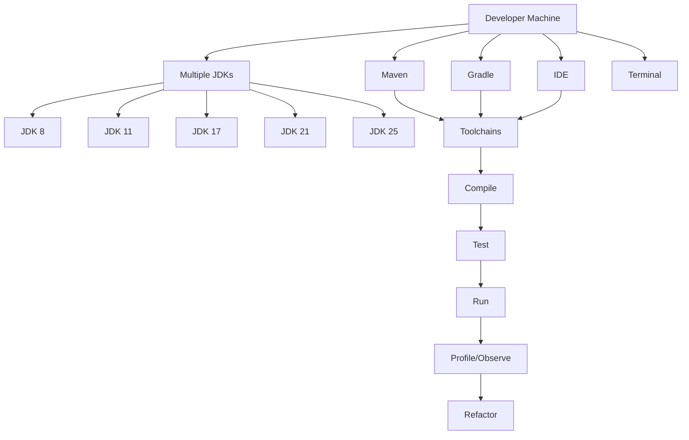
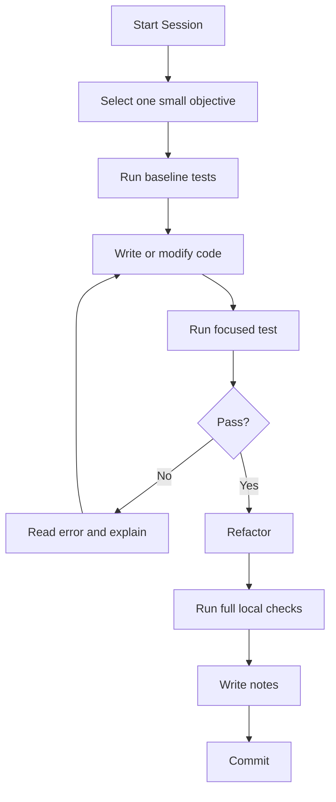

# Modern Java 8–25 Part 002: Practice Environment, Multi-JDK, Build Tool, IDE, dan Feedback Loop

> **Nama file:** `learn-modern-java-8-to-25-part-002-practice-environment.mdx`  
> **Scope:** setup environment belajar Java modern yang reproducible, cepat, dan aman untuk eksperimen lintas versi.  
> **Output:** multi-JDK environment, Maven/Gradle baseline, IDE workflow, JShell workflow, static analysis, test loop, dan repository template.

---

## 1. Tujuan Part Ini

Framework Kaufman menekankan pengurangan hambatan praktik. Untuk Java, hambatan terbesar biasanya bukan konsep bahasa, tetapi environment:

- JDK berbeda antar project;
- `JAVA_HOME` salah;
- IDE memakai JDK berbeda dari terminal;
- Maven/Gradle berjalan di JDK berbeda dari target compile;
- dependency conflict tidak terlihat;
- test lambat;
- tidak ada shortcut untuk menjalankan eksperimen;
- tidak ada static analysis;
- tidak ada struktur repository yang konsisten.

Part ini membuat environment yang memungkinkan Anda latihan cepat.

Target akhirnya:

```text
ubah code -> compile -> test -> run -> observe -> fix -> commit
```

Loop tersebut harus terasa murah. Kalau setiap eksperimen butuh energi tinggi, latihan akan berhenti.

---

## 2. Prinsip Environment yang Baik

Environment Java untuk seri ini harus memenuhi lima prinsip.

| Prinsip | Arti | Kenapa penting |
|---|---|---|
| Reproducible | hasil build bisa diulang | mengurangi “works on my machine” |
| Version-aware | JDK bisa dipilih per project | penting untuk Java 8–25 |
| Fast feedback | compile/test cepat | mendukung deliberate practice |
| Observable | mudah melihat error/runtime behavior | mempercepat koreksi diri |
| Disposable | mudah dibuat ulang | aman untuk eksperimen |

Diagram environment:



---

## 3. JDK Version Strategy

Seri ini memakai anchor JDK berikut:

| JDK | Status dalam seri | Fungsi pembelajaran |
|---:|---|---|
| 8 | legacy baseline | memahami lambda, streams, `java.time`, dan banyak codebase enterprise |
| 11 | LTS modernization baseline | target migrasi awal dari Java 8 |
| 17 | modern LTS baseline | records, sealed classes, strong encapsulation |
| 21 | modern concurrency baseline | virtual threads, pattern matching, sequenced collections |
| 25 | latest LTS target seri | target akhir modern Java dalam seri ini |

Catatan penting:

- Jalankan project lama dengan JDK target yang tepat.
- Jangan mengandalkan `JAVA_HOME` global untuk semua project.
- Gunakan toolchain agar build tahu JDK mana yang dipakai.
- IDE, terminal, dan CI harus memakai versi yang konsisten.

---

## 4. Instalasi Multi-JDK

Ada beberapa pendekatan. Pilih yang cocok dengan OS dan policy organisasi.

### 4.1 Rekomendasi Praktis

Untuk mesin developer pribadi di Linux/macOS, gunakan SDKMAN karena mudah untuk memasang dan mengganti versi JDK.

Untuk Windows, opsi umum:

- installer vendor JDK seperti Eclipse Temurin, Oracle JDK, Microsoft Build of OpenJDK, Azul Zulu;
- package manager seperti `winget` atau Chocolatey;
- WSL + SDKMAN jika workflow utama Anda di Linux shell.

Untuk enterprise:

- ikuti standard vendor internal;
- samakan vendor JDK antara local, CI, staging, dan production jika memungkinkan;
- dokumentasikan support policy dan patch cadence.

### 4.2 Menggunakan SDKMAN

Install SDKMAN:

```bash
curl -s "https://get.sdkman.io" | bash
source "$HOME/.sdkman/bin/sdkman-init.sh"
```

Cek versi Java yang tersedia:

```bash
sdk list java
```

Install beberapa JDK:

```bash
sdk install java 8.0.XXX-tem
sdk install java 11.0.XXX-tem
sdk install java 17.0.XXX-tem
sdk install java 21.0.XXX-tem
sdk install java 25.0.XXX-tem
```

Gunakan versi tertentu di shell saat ini:

```bash
sdk use java 25.0.XXX-tem
java -version
javac -version
```

Set versi default:

```bash
sdk default java 25.0.XXX-tem
```

Gunakan `.sdkmanrc` per project:

```bash
sdk env init
```

Contoh `.sdkmanrc`:

```text
java=25.0.XXX-tem
maven=3.9.XX
gradle=8.XX
```

Aktifkan saat masuk folder:

```bash
sdk env
```

### 4.3 Verifikasi Multi-JDK

Buat script:

```bash
mkdir -p scripts
cat > scripts/check-java.sh <<'EOF'
#!/usr/bin/env bash
set -euo pipefail

echo "JAVA_HOME=${JAVA_HOME:-<not-set>}"
which java
java -version
which javac
javac -version
EOF
chmod +x scripts/check-java.sh
```

Jalankan:

```bash
./scripts/check-java.sh
```

Output yang dicari:

- `java` dan `javac` berasal dari JDK yang sama;
- versi sesuai project;
- `JAVA_HOME` tidak menunjuk ke JRE lama;
- IDE memakai JDK yang sama dengan terminal.

---

## 5. Memahami `JAVA_HOME`, `PATH`, dan Toolchain

Banyak bug environment berasal dari mental model yang salah.

### 5.1 `PATH`

`PATH` menentukan executable mana yang ditemukan shell saat Anda mengetik:

```bash
java
javac
mvn
gradle
```

Cek:

```bash
which java
which javac
which mvn
which gradle
```

Di Windows PowerShell:

```powershell
Get-Command java
Get-Command javac
```

### 5.2 `JAVA_HOME`

`JAVA_HOME` biasanya menunjuk ke root folder JDK.

Contoh:

```bash
export JAVA_HOME="$HOME/.sdkman/candidates/java/current"
export PATH="$JAVA_HOME/bin:$PATH"
```

Masalah umum:

- `JAVA_HOME` menunjuk ke Java 8, tapi `java` dari PATH menunjuk ke Java 21;
- Maven berjalan dengan JDK 17, tapi compile target Java 8;
- IDE project SDK Java 25, tapi Gradle daemon Java 21.

### 5.3 Toolchain

Toolchain memisahkan:

- JDK yang menjalankan build tool;
- JDK yang dipakai untuk compile/test/run project.

Ini penting karena build tool modern kadang membutuhkan JDK baru, sementara project masih target Java 8 atau 11.

---

## 6. Maven Baseline

Maven bagus untuk standardisasi dan dependency visibility. Untuk seri ini, kita gunakan Maven sebagai baseline pertama karena banyak enterprise Java masih berbasis Maven.

### 6.1 Struktur Minimal Maven

```text
modern-java-lab-maven/
  pom.xml
  src/
    main/
      java/
        dev/example/App.java
    test/
      java/
        dev/example/AppTest.java
```

### 6.2 `pom.xml` Baseline untuk Java 25

```xml
<project xmlns="http://maven.apache.org/POM/4.0.0"
         xmlns:xsi="http://www.w3.org/2001/XMLSchema-instance"
         xsi:schemaLocation="http://maven.apache.org/POM/4.0.0 https://maven.apache.org/xsd/maven-4.0.0.xsd">
    <modelVersion>4.0.0</modelVersion>

    <groupId>dev.example</groupId>
    <artifactId>modern-java-lab</artifactId>
    <version>1.0.0-SNAPSHOT</version>

    <properties>
        <project.build.sourceEncoding>UTF-8</project.build.sourceEncoding>
        <maven.compiler.release>25</maven.compiler.release>
        <junit.jupiter.version>5.11.4</junit.jupiter.version>
    </properties>

    <dependencies>
        <dependency>
            <groupId>org.junit.jupiter</groupId>
            <artifactId>junit-jupiter</artifactId>
            <version>${junit.jupiter.version}</version>
            <scope>test</scope>
        </dependency>
    </dependencies>

    <build>
        <plugins>
            <plugin>
                <groupId>org.apache.maven.plugins</groupId>
                <artifactId>maven-compiler-plugin</artifactId>
                <version>3.13.0</version>
                <configuration>
                    <release>${maven.compiler.release}</release>
                    <compilerArgs>
                        <arg>-Xlint:all</arg>
                    </compilerArgs>
                </configuration>
            </plugin>
            <plugin>
                <groupId>org.apache.maven.plugins</groupId>
                <artifactId>maven-surefire-plugin</artifactId>
                <version>3.5.2</version>
            </plugin>
        </plugins>
    </build>
</project>
```

Catatan:

- gunakan `<release>`, bukan kombinasi lama `<source>` dan `<target>`, jika memungkinkan;
- `--release` membantu mencegah penggunaan API JDK yang tidak tersedia di target release;
- untuk Java 8 target, set `<maven.compiler.release>8</maven.compiler.release>`.

### 6.3 Command Maven yang Wajib Hafal

```bash
mvn -version
mvn clean test
mvn clean package
mvn dependency:tree
mvn -q test
mvn -DskipTests package
```

Gunakan `mvn -version` untuk memastikan Maven berjalan di JDK yang benar.

Output penting:

```text
Apache Maven ...
Java version: 25.x.x, vendor: ...
Java home: ...
```

### 6.4 Maven Toolchains

Maven Toolchains memungkinkan project menentukan JDK build tanpa mengandalkan JDK yang menjalankan Maven.

Contoh `~/.m2/toolchains.xml`:

```xml
<?xml version="1.0" encoding="UTF-8"?>
<toolchains>
    <toolchain>
        <type>jdk</type>
        <provides>
            <version>25</version>
            <vendor>temurin</vendor>
        </provides>
        <configuration>
            <jdkHome>/path/to/jdk-25</jdkHome>
        </configuration>
    </toolchain>

    <toolchain>
        <type>jdk</type>
        <provides>
            <version>17</version>
            <vendor>temurin</vendor>
        </provides>
        <configuration>
            <jdkHome>/path/to/jdk-17</jdkHome>
        </configuration>
    </toolchain>
</toolchains>
```

Tambahkan plugin:

```xml
<plugin>
    <groupId>org.apache.maven.plugins</groupId>
    <artifactId>maven-toolchains-plugin</artifactId>
    <version>3.2.0</version>
    <executions>
        <execution>
            <goals>
                <goal>toolchain</goal>
            </goals>
        </execution>
    </executions>
    <configuration>
        <toolchains>
            <jdk>
                <version>25</version>
            </jdk>
        </toolchains>
    </configuration>
</plugin>
```

---

## 7. Gradle Baseline

Gradle kuat untuk build modern, multi-module, incremental build, dan toolchain support.

### 7.1 Struktur Minimal Gradle

```text
modern-java-lab-gradle/
  settings.gradle.kts
  build.gradle.kts
  src/
    main/java/dev/example/App.java
    test/java/dev/example/AppTest.java
```

### 7.2 `settings.gradle.kts`

```kotlin
pluginManagement {
    repositories {
        gradlePluginPortal()
        mavenCentral()
    }
}

dependencyResolutionManagement {
    repositoriesMode.set(RepositoriesMode.FAIL_ON_PROJECT_REPOS)
    repositories {
        mavenCentral()
    }
}

rootProject.name = "modern-java-lab"
```

### 7.3 `build.gradle.kts` Baseline

```kotlin
plugins {
    java
    application
}

group = "dev.example"
version = "1.0.0-SNAPSHOT"

java {
    toolchain {
        languageVersion = JavaLanguageVersion.of(25)
    }
}

repositories {
    mavenCentral()
}

dependencies {
    testImplementation(platform("org.junit:junit-bom:5.11.4"))
    testImplementation("org.junit.jupiter:junit-jupiter")
}

application {
    mainClass = "dev.example.App"
}

tasks.test {
    useJUnitPlatform()
}

tasks.withType<JavaCompile>().configureEach {
    options.compilerArgs.addAll(listOf("-Xlint:all"))
}
```

### 7.4 Command Gradle yang Wajib Hafal

```bash
./gradlew --version
./gradlew clean test
./gradlew run
./gradlew dependencies
./gradlew dependencyInsight --dependency junit
./gradlew javaToolchains
```

Gunakan wrapper:

```bash
gradle wrapper
```

Commit file wrapper:

```text
gradlew
gradlew.bat
gradle/wrapper/gradle-wrapper.jar
gradle/wrapper/gradle-wrapper.properties
```

Alasan: CI dan developer lain memakai Gradle version yang sama.

---

## 8. Maven vs Gradle: Kapan Memakai Apa

| Kriteria | Maven | Gradle |
|---|---|---|
| Standard enterprise | sangat kuat | kuat |
| Simplicity | eksplisit dan familiar | lebih fleksibel |
| Multi-module kompleks | bisa, tapi verbose | sangat kuat |
| Incremental build | terbatas | kuat |
| Convention | kuat | kuat, tapi lebih programmable |
| Learning curve | lebih rendah | lebih tinggi |
| Kotlin DSL | tidak relevan | direkomendasikan |
| Dependency insight | cukup | sangat nyaman |

Untuk seri ini:

- gunakan Maven jika ingin alignment dengan banyak codebase enterprise;
- gunakan Gradle jika ingin build modern dan eksperimen multi-module lebih fleksibel;
- pahami keduanya minimal sampai bisa membaca build orang lain.

---

## 9. IDE Setup

IDE harus mengikuti build, bukan sebaliknya.

### 9.1 IntelliJ IDEA Checklist

- Project SDK: pilih JDK sesuai project.
- Gradle JVM: samakan dengan kebutuhan Gradle.
- Maven runner JRE: samakan dengan project/toolchain.
- Enable annotation processing jika diperlukan.
- Set code style Java.
- Enable compiler warnings.
- Jalankan test dari IDE dan terminal; hasil harus sama.

Checklist verifikasi:

```text
[ ] Terminal java -version sesuai
[ ] IDE Project SDK sesuai
[ ] Maven/Gradle JVM sesuai
[ ] Unit test terminal hijau
[ ] Unit test IDE hijau
[ ] Format code konsisten
[ ] Import tidak wildcard kecuali policy mengizinkan
```

### 9.2 VS Code Checklist

Extension umum:

- Extension Pack for Java;
- Maven for Java;
- Gradle for Java;
- Test Runner for Java.

Verifikasi:

- Java runtime configured;
- language server memakai JDK yang sesuai;
- test discovery berjalan;
- Maven/Gradle task bisa dijalankan dari terminal.

---

## 10. JShell untuk Eksperimen Cepat

JShell berguna untuk eksplorasi kecil tanpa membuat project penuh.

Jalankan:

```bash
jshell
```

Contoh:

```java
var names = java.util.List.of("alpha", "beta", "gamma");
names.stream().map(String::toUpperCase).toList();
```

Command penting:

```text
/list
/vars
/methods
/types
/save scratch.jsh
/open scratch.jsh
/exit
```

Kapan memakai JShell:

- mengecek behavior API kecil;
- mencoba expression;
- mengeksplorasi date/time;
- mengecek collection operation;
- membuat snippet sebelum dimasukkan ke test.

Kapan tidak memakai JShell:

- desain class besar;
- concurrency serius;
- benchmark;
- behavior yang butuh dependency banyak;
- test yang harus repeatable.

Rule: kalau eksperimen penting, pindahkan ke unit test.

---

## 11. Minimal Code untuk Validasi Environment

Buat file:

```text
src/main/java/dev/example/App.java
```

Isi:

```java
package dev.example;

import java.time.Clock;
import java.time.Instant;
import java.util.List;

public class App {
    public static void main(String[] args) {
        var app = new App();
        System.out.println(app.greeting("Java"));
        System.out.println(app.uppercase(List.of("java", "jvm", "jdk")));
        System.out.println(app.now(Clock.systemUTC()));
    }

    public String greeting(String name) {
        if (name == null || name.isBlank()) {
            throw new IllegalArgumentException("name must not be blank");
        }
        return "Hello, " + name;
    }

    public List<String> uppercase(List<String> values) {
        return values.stream()
                .map(String::toUpperCase)
                .toList();
    }

    public Instant now(Clock clock) {
        return clock.instant();
    }
}
```

Test:

```text
src/test/java/dev/example/AppTest.java
```

Isi:

```java
package dev.example;

import org.junit.jupiter.api.Test;

import java.time.Clock;
import java.time.Instant;
import java.time.ZoneOffset;
import java.util.List;

import static org.junit.jupiter.api.Assertions.assertEquals;
import static org.junit.jupiter.api.Assertions.assertThrows;

class AppTest {
    private final App app = new App();

    @Test
    void shouldCreateGreeting() {
        assertEquals("Hello, Java", app.greeting("Java"));
    }

    @Test
    void shouldRejectBlankName() {
        assertThrows(IllegalArgumentException.class, () -> app.greeting(" "));
    }

    @Test
    void shouldUppercaseValues() {
        assertEquals(List.of("JAVA", "JVM"), app.uppercase(List.of("java", "jvm")));
    }

    @Test
    void shouldUseInjectedClock() {
        var fixed = Clock.fixed(Instant.parse("2026-06-26T00:00:00Z"), ZoneOffset.UTC);
        assertEquals(Instant.parse("2026-06-26T00:00:00Z"), app.now(fixed));
    }
}
```

Jalankan:

```bash
mvn test
# atau
./gradlew test
```

Environment dianggap benar jika:

- compile berhasil;
- test berhasil;
- IDE mengenali source/test;
- terminal dan IDE konsisten;
- warning compiler terlihat.

---

## 12. Static Analysis Baseline

Static analysis bukan pengganti review. Ia membantu menangkap error murah lebih awal.

### 12.1 Compiler Warnings

Minimal aktifkan:

```bash
-Xlint:all
```

Kategori warning yang sering bernilai:

- unchecked generic conversion;
- raw type;
- deprecation;
- fallthrough;
- varargs heap pollution;
- serial;
- preview feature warning.

### 12.2 Checkstyle

Checkstyle membantu menjaga style konsisten.

Gunakan untuk:

- import order;
- line length;
- naming convention;
- whitespace;
- braces;
- Javadoc policy jika perlu.

Jangan gunakan Checkstyle untuk menggantikan judgment desain.

### 12.3 SpotBugs

SpotBugs berguna untuk bug pattern:

- null dereference;
- equality bug;
- bad synchronization;
- ignored return value;
- resource leak;
- questionable serialization.

### 12.4 Error Prone

Error Prone kuat untuk menangkap bug compile-time tertentu, terutama di codebase besar.

Cocok untuk:

- API misuse;
- equality mistakes;
- collection misuse;
- concurrency footguns.

### 12.5 Static Analysis Policy

Untuk seri ini, gunakan prinsip:

```text
warning baru = harus dijelaskan atau diperbaiki
```

Jangan biarkan warning menjadi noise. Kalau rule terlalu noisy, konfigurasi rule. Jangan abaikan semuanya.

---

## 13. Test Feedback Loop

Test loop harus cepat.

### 13.1 Command Shortcut

Buat script:

```bash
cat > scripts/test.sh <<'EOF'
#!/usr/bin/env bash
set -euo pipefail

if [ -f "mvnw" ]; then
  ./mvnw -q test
elif [ -f "pom.xml" ]; then
  mvn -q test
elif [ -f "gradlew" ]; then
  ./gradlew test
else
  echo "No Maven or Gradle project found" >&2
  exit 1
fi
EOF
chmod +x scripts/test.sh
```

Jalankan:

```bash
./scripts/test.sh
```

### 13.2 Fast vs Full Test

Pisahkan:

| Test type | Kapan dijalankan | Tujuan |
|---|---|---|
| Unit test | setiap perubahan kecil | feedback cepat |
| Integration test | sebelum commit besar | validasi boundary |
| Contract test | sebelum release | compatibility |
| Performance test | saat ada hypothesis | regression/performance evidence |
| Mutation/property test | berkala | kualitas test suite |

### 13.3 Rule Praktis

- Unit test harus bisa berjalan dalam detik, bukan menit.
- Test yang lambat harus diberi kategori.
- Test tidak boleh bergantung ke waktu nyata tanpa `Clock` injection.
- Test tidak boleh bergantung ke urutan global kecuali memang diuji.
- Test harus gagal dengan pesan yang membantu.

---

## 14. Repository Template untuk Seri Ini

Buat repository:

```bash
mkdir modern-java-8-to-25-lab
cd modern-java-8-to-25-lab
mkdir -p docs/notes docs/decision-records scripts examples labs
```

Struktur final:

```text
modern-java-8-to-25-lab/
  README.md
  .gitignore
  .editorconfig
  .sdkmanrc
  docs/
    notes/
    decision-records/
  examples/
    language/
    collections/
    concurrency/
    jvm/
    architecture/
  labs/
    part-001-skill-map/
    part-002-practice-environment/
  scripts/
    check-java.sh
    test.sh
    run.sh
```

### 14.1 `.gitignore`

```gitignore
# Java build output
target/
build/
out/
*.class

# IDE
.idea/
.vscode/
*.iml

# OS
.DS_Store
Thumbs.db

# Logs
*.log

# JFR / dumps
*.jfr
*.hprof
hs_err_pid*
replay_pid*
```

### 14.2 `.editorconfig`

```editorconfig
root = true

[*]
charset = utf-8
end_of_line = lf
insert_final_newline = true
trim_trailing_whitespace = true

[*.java]
indent_style = space
indent_size = 4
max_line_length = 120

[*.{xml,md,yml,yaml,json,kts}]
indent_style = space
indent_size = 2
```

### 14.3 `README.md`

```markdown
# Modern Java 8 to 25 Lab

This repository contains exercises, notes, and experiments for learning Modern Java 8-25.

## Requirements

- JDK 8, 11, 17, 21, 25
- Maven 3.9+
- Gradle 8+

## Quick Checks

```bash
./scripts/check-java.sh
./scripts/test.sh
```

## Learning Rule

Every part must produce:

- notes
- code example
- failing case
- test
- checklist
```

---

## 15. Runtime and Diagnostic Tools Baseline

Install atau pastikan tersedia:

```bash
java
javac
jar
jdeps
javap
jcmd
jstack
jmap
jfr
jshell
```

Cek:

```bash
for tool in java javac jar jdeps javap jcmd jstack jmap jfr jshell; do
  echo "== $tool =="
  command -v "$tool" || true
done
```

### 15.1 Tool Usage Preview

| Tool | Fungsi |
|---|---|
| `javac` | compile source code |
| `java` | menjalankan class/JAR/module |
| `jar` | membuat/membaca archive |
| `javap` | inspect bytecode |
| `jdeps` | inspect dependency package/module |
| `jcmd` | command diagnostik JVM |
| `jstack` | thread dump |
| `jmap` | heap info/dump |
| `jfr` | Java Flight Recorder command |
| `jshell` | REPL Java |

Jangan tunggu production incident untuk mengenal tool ini.

---

## 16. Common Environment Failure Modes

### 16.1 `UnsupportedClassVersionError`

Gejala:

```text
java.lang.UnsupportedClassVersionError: ... has been compiled by a more recent version of the Java Runtime
```

Arti:

- class dikompilasi dengan JDK lebih baru;
- dijalankan dengan runtime lebih lama.

Fix:

- samakan runtime dengan target compile;
- set Maven/Gradle `release`;
- cek CI dan container image.

### 16.2 `NoSuchMethodError`

Biasanya bukan compilation issue. Ini runtime linkage issue.

Penyebab umum:

- dependency version conflict;
- compile dengan library versi A;
- runtime memakai library versi B.

Investigasi:

```bash
mvn dependency:tree
./gradlew dependencies
./gradlew dependencyInsight --dependency <name>
```

### 16.3 IDE Hijau, Terminal Merah

Penyebab:

- IDE memakai SDK berbeda;
- IDE tidak delegate build ke Maven/Gradle;
- annotation processing berbeda;
- environment variable berbeda.

Fix:

- delegate build/run/test ke Gradle/Maven jika perlu;
- samakan project SDK;
- samakan Gradle JVM/Maven runner;
- jalankan command terminal sebagai source of truth.

### 16.4 Test Lambat Sejak Awal

Penyebab:

- integration test tercampur unit test;
- test memakai sleep;
- test bergantung network;
- test membuat container setiap method;
- global state tidak dibersihkan.

Fix:

- pisahkan test suite;
- hindari `Thread.sleep`;
- gunakan fake clock;
- reuse fixture mahal secara aman;
- desain boundary yang bisa dites.

---

## 17. Daily Practice Workflow

Gunakan workflow ini untuk setiap sesi belajar.



### 17.1 Session Template

Buat file notes per sesi:

```markdown
# Practice Session YYYY-MM-DD

## Objective

## What I changed

## What failed

## What I learned

## Evidence

- commit:
- test output:
- command used:

## Next question
```

---

## 18. Definition of Done Part 002

Part ini selesai jika:

- [ ] minimal satu JDK berhasil dipakai untuk compile/run/test;
- [ ] JDK 8, 11, 17, 21, dan 25 tersedia atau rencana instalasinya jelas;
- [ ] `java -version` dan `javac -version` konsisten;
- [ ] Maven atau Gradle project bisa menjalankan test;
- [ ] toolchain dikonfigurasi atau dipahami;
- [ ] IDE dan terminal menghasilkan hasil test yang sama;
- [ ] `jshell` bisa dijalankan;
- [ ] script `check-java.sh` tersedia;
- [ ] script `test.sh` tersedia;
- [ ] repository template dibuat;
- [ ] common failure modes dipahami.

---

## 19. Latihan Part 002

### Latihan 1 — Multi-JDK Verification Matrix

Buat file:

```text
docs/notes/part-002-jdk-matrix.md
```

Isi:

```markdown
| JDK | Installed | java -version output | javac -version output | Used by project |
|---:|---|---|---|---|
| 8 | [ ] | | | |
| 11 | [ ] | | | |
| 17 | [ ] | | | |
| 21 | [ ] | | | |
| 25 | [ ] | | | |
```

### Latihan 2 — Build Tool Comparison

Buat project minimal dengan Maven dan Gradle. Keduanya harus menjalankan test yang sama.

Pertanyaan:

- Mana yang lebih mudah dipahami?
- Mana yang lebih cepat?
- Mana yang lebih eksplisit?
- Mana yang lebih cocok untuk codebase Anda sekarang?

### Latihan 3 — Intentional Failure

Buat tiga kegagalan:

1. compile error;
2. failing test;
3. wrong JDK runtime.

Untuk setiap kegagalan, tulis:

```markdown
## Failure

## Command

## Error Output

## Root Cause

## Fix

## Prevention
```

### Latihan 4 — JShell Exploration

Coba di JShell:

```java
import java.time.*;
var clock = Clock.fixed(Instant.parse("2026-06-26T00:00:00Z"), ZoneOffset.UTC);
Instant.now(clock);

var values = java.util.List.of("java", "jdk", "jvm");
values.stream().map(String::toUpperCase).toList();
```

Lalu pindahkan eksperimen tersebut ke unit test.

---

## 20. Kesimpulan

Part ini menghapus friction. Environment yang benar membuat deliberate practice menjadi murah.

Prinsip yang harus diingat:

- jangan bergantung pada JDK global;
- samakan terminal, IDE, build tool, dan CI;
- gunakan toolchain untuk project lintas versi;
- buat feedback loop cepat;
- kenali failure mode environment sejak awal;
- ubah eksperimen penting menjadi test.

Part berikutnya akan masuk ke alur source-to-runtime: bagaimana file `.java` berubah menjadi bytecode, bagaimana class dijalankan, dan bagaimana classpath/module path membentuk runtime behavior.

---

## Referensi

- SDKMAN Usage: https://sdkman.io/usage/
- SDKMAN Home: https://sdkman.io/
- Eclipse Temurin Releases: https://adoptium.net/temurin/releases
- Gradle Java Toolchains: https://docs.gradle.org/current/userguide/toolchains.html
- Gradle Java Compatibility: https://docs.gradle.org/current/userguide/compatibility.html
- Apache Maven Guide to Toolchains: https://maven.apache.org/guides/mini/guide-using-toolchains.html
- Apache Maven Toolchains Plugin: https://maven.apache.org/plugins/maven-toolchains-plugin/plugin-info.html
- OpenJDK JDK Project: https://openjdk.org/projects/jdk/
- OpenJDK JDK 25: https://openjdk.org/projects/jdk/25/
