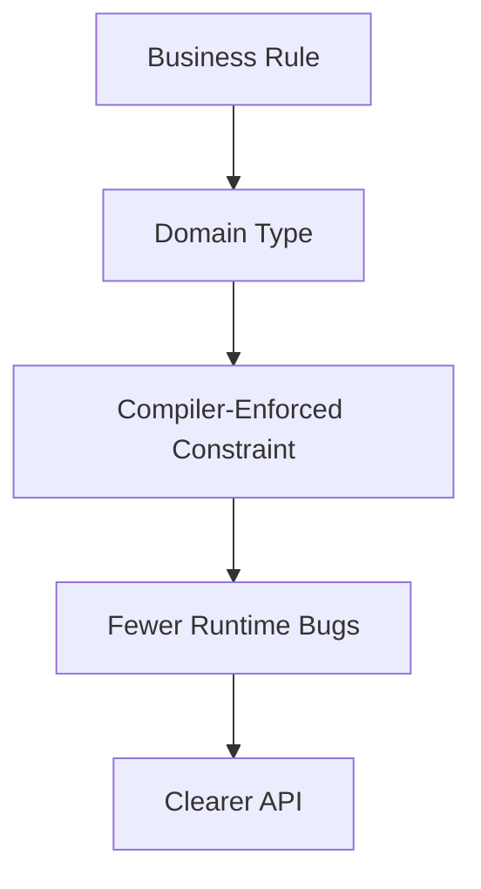
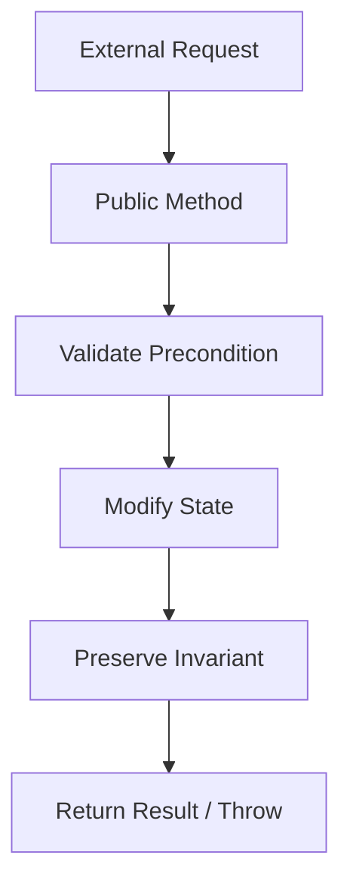
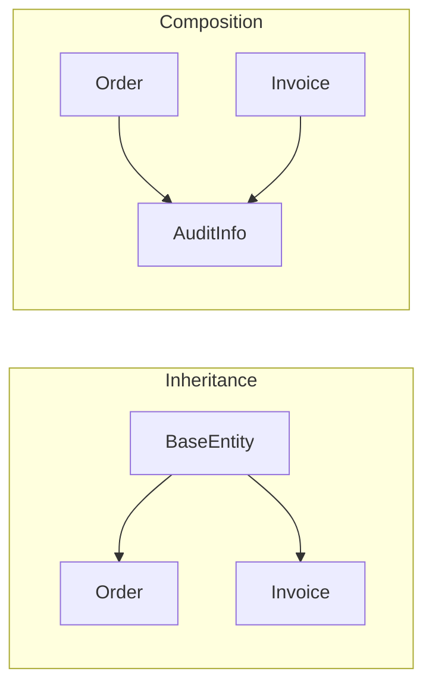
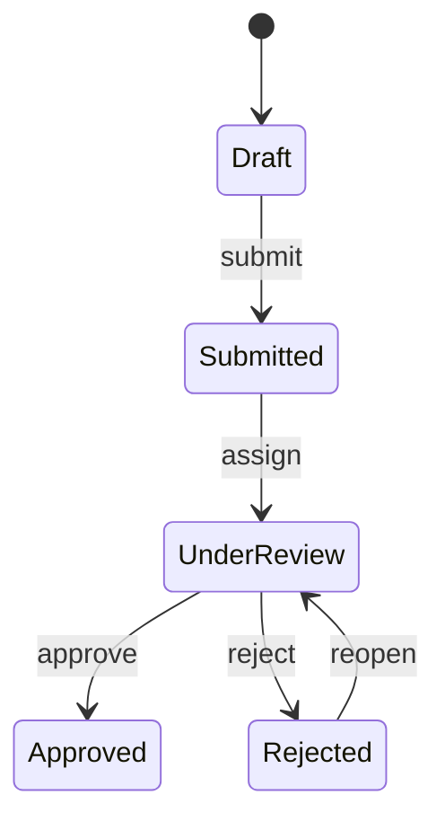
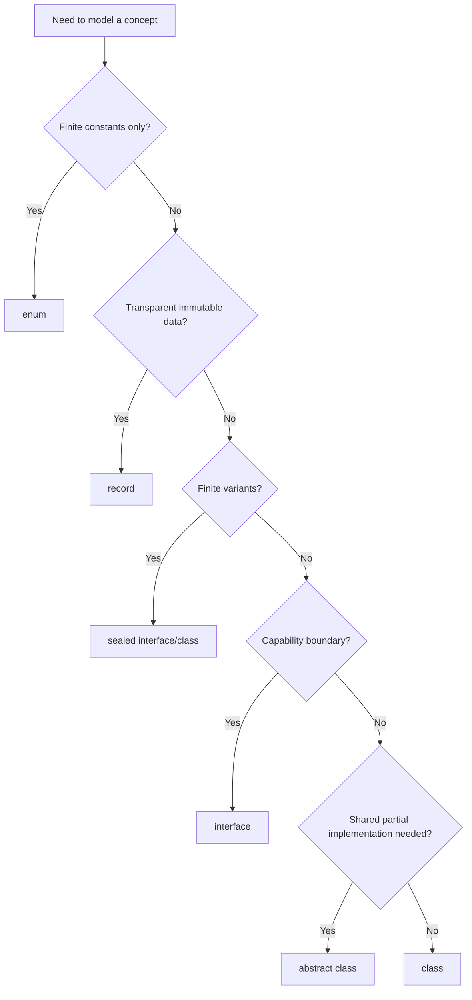

# Part 004 — Type System dan Object Model: Class, Interface, Inheritance, Composition, Records, Sealed Types, dan Equality

> Seri: `modern-java-8-to-25`  
> File: `learn-modern-java-8-to-25-part-004-type-system-object-model.mdx`  
> Posisi: Part 004 dari 035  
> Target fase Kaufman: **dekomposisi sub-skill inti** — memahami model tipe Java agar bisa mendesain kode, API, dan domain model dengan benar.

---

## 1. Kenapa Type System Lebih Penting dari Syntax

Syntax Java mudah dipelajari. Type system Java jauh lebih penting.

Syntax menjawab:

> “Bagaimana cara menulis sesuatu?”

Type system menjawab:

> “Hal apa saja yang boleh terjadi, hal apa saja yang mustahil, dan kontrak apa yang dijaga compiler?”

Software engineer senior tidak hanya bertanya:

```text
Bagaimana cara membuat class ini?
```

Ia bertanya:

```text
Apa identitas object ini?
Apakah ini value atau entity?
Apakah model ini boleh berubah?
Siapa yang boleh membuat instance?
Siapa yang boleh menambah subtype?
Apakah equality-nya berbasis identity atau state?
Apakah null adalah state valid atau invalid?
Apakah hierarchy ini terbuka atau tertutup?
Apakah API ini akan stabil 5 tahun?
```

Part ini membangun fondasi tersebut.

---

## 2. Target Skill Setelah Part Ini

Setelah menyelesaikan part ini, kamu harus mampu:

1. Membedakan primitive type dan reference type secara praktis.
2. Membedakan identity object dan value object.
3. Mendesain class dengan invariant yang jelas.
4. Memilih interface, abstract class, class biasa, record, enum, atau sealed hierarchy secara rasional.
5. Menghindari inheritance yang rapuh.
6. Menggunakan composition untuk menurunkan coupling.
7. Mendesain equality (`equals`/`hashCode`) dengan benar.
8. Memahami record sebagai data carrier, bukan pengganti semua class.
9. Memahami sealed classes/interfaces sebagai closed hierarchy.
10. Menggunakan enum sebagai finite set dengan behavior jika tepat.
11. Menangani mutability dan nullability sebagai keputusan desain, bukan kecelakaan.
12. Membentuk domain model Java modern yang eksplisit dan evolvable.

---

## 3. Mental Model Type System Java

Java adalah bahasa dengan **nominal typing**.

Artinya, kompatibilitas tipe ditentukan oleh nama deklarasi dan hubungan eksplisit, bukan hanya struktur method/field.

Contoh:

```java
record CustomerId(String value) {}
record OrderId(String value) {}
```

Keduanya punya struktur sama: satu `String value`.

Tetapi `CustomerId` bukan `OrderId`.

Ini bagus. Compiler bisa mencegah bug seperti:

```java
void cancelOrder(OrderId orderId) {}

CustomerId customerId = new CustomerId("C-001");
cancelOrder(customerId); // compile error
```

Type system yang baik membuat illegal state sulit atau mustahil direpresentasikan.



---

## 4. Primitive Types vs Reference Types

Java punya primitive types:

| Primitive | Contoh |
|---|---|
| `boolean` | `true`, `false` |
| `byte` | 8-bit integer |
| `short` | 16-bit integer |
| `int` | 32-bit integer |
| `long` | 64-bit integer |
| `float` | 32-bit floating point |
| `double` | 64-bit floating point |
| `char` | UTF-16 code unit |

Dan reference types:

- class
- interface
- array
- enum
- record
- annotation type

Primitive menyimpan value langsung. Reference type menyimpan reference ke object atau `null`.

Contoh:

```java
int count = 10;
String name = "Ayu";
```

`count` adalah primitive. `name` adalah reference ke object `String`.

### Boxing dan Unboxing

Java punya wrapper types:

| Primitive | Wrapper |
|---|---|
| `int` | `Integer` |
| `long` | `Long` |
| `boolean` | `Boolean` |
| `double` | `Double` |

Autoboxing:

```java
Integer value = 10; // int -> Integer
```

Unboxing:

```java
int raw = value; // Integer -> int
```

Bug klasik:

```java
Integer value = null;
int raw = value; // NullPointerException
```

Karena unboxing memanggil value dari wrapper yang ternyata null.

### Kapan Pakai Primitive

Gunakan primitive untuk:

- numeric computation
- counters
- flags sederhana
- hot path performance
- field yang tidak boleh null

Gunakan wrapper untuk:

- generic collections (`List<Integer>`)
- value yang memang optional/null dari external boundary
- API yang butuh object/reference

Rule praktis:

```text
Use primitives for internal required scalar values.
Use wrappers only when object semantics or absence is genuinely needed.
```

---

## 5. Object Identity vs Value Semantics

Ini konsep paling penting dalam object model.

### Identity Object

Identity object penting karena “siapa dia”.

Contoh:

```java
class Customer {
    private final CustomerId id;
    private String name;

    Customer(CustomerId id, String name) {
        this.id = id;
        this.name = name;
    }
}
```

Dua customer dengan nama sama bukan berarti customer yang sama.

Identity biasanya datang dari:

- database id
- business key
- aggregate id
- external system id
- object lifecycle

### Value Object

Value object penting karena “apa nilainya”.

Contoh:

```java
record Money(String currency, long cents) {
    public Money {
        if (currency == null || currency.isBlank()) {
            throw new IllegalArgumentException("currency is required");
        }
        if (cents < 0) {
            throw new IllegalArgumentException("cents must be non-negative");
        }
    }
}
```

Dua `Money("IDR", 1000)` dianggap sama karena state-nya sama.

### Decision Table

| Pertanyaan | Jika Ya | Model |
|---|---|---|
| Apakah object punya lifecycle? | Ya | identity object/entity |
| Apakah dua instance dengan value sama harus dianggap sama? | Ya | value object |
| Apakah object berubah seiring waktu? | Ya | mungkin entity |
| Apakah object idealnya immutable? | Ya | value object |
| Apakah object punya ID stabil? | Ya | entity |

Rule praktis:

```text
Use classes for identity/lifecycle-heavy concepts.
Use records for transparent immutable data/value carriers.
```

---

## 6. Class: Unit Dasar Behavior dan State

Class mendefinisikan:

- fields
- constructors
- methods
- nested types
- initialization logic
- visibility boundary

Contoh:

```java
public final class Account {
    private final AccountId id;
    private long balanceCents;

    public Account(AccountId id, long openingBalanceCents) {
        if (id == null) {
            throw new IllegalArgumentException("id is required");
        }
        if (openingBalanceCents < 0) {
            throw new IllegalArgumentException("opening balance must be non-negative");
        }
        this.id = id;
        this.balanceCents = openingBalanceCents;
    }

    public void deposit(long cents) {
        if (cents <= 0) {
            throw new IllegalArgumentException("deposit must be positive");
        }
        balanceCents += cents;
    }

    public boolean canWithdraw(long cents) {
        return cents > 0 && balanceCents >= cents;
    }

    public void withdraw(long cents) {
        if (!canWithdraw(cents)) {
            throw new IllegalArgumentException("insufficient balance");
        }
        balanceCents -= cents;
    }

    public AccountId id() {
        return id;
    }

    public long balanceCents() {
        return balanceCents;
    }
}
```

Class ini cocok karena:

- punya identity (`AccountId`)
- punya state yang berubah (`balanceCents`)
- punya invariant (`balanceCents` tidak boleh negatif)
- behavior diletakkan dekat dengan state

### Invariant

Invariant adalah kondisi yang harus selalu benar untuk object valid.

Untuk `Account`:

```text
balanceCents >= 0
id != null
```

Method public harus menjaga invariant.



Top-tier Java code sering jelas karena invariant-nya jelas.

---

## 7. Constructor: Gerbang Validitas Object

Constructor harus memastikan object tidak lahir invalid.

Buruk:

```java
public class User {
    public String email;

    public User(String email) {
        this.email = email;
    }
}
```

Masalah:

- `email` bisa null
- `email` bisa blank
- field public bisa diubah sembarang
- tidak ada invariant

Lebih baik:

```java
public final class EmailAddress {
    private final String value;

    public EmailAddress(String value) {
        if (value == null || value.isBlank()) {
            throw new IllegalArgumentException("email is required");
        }
        if (!value.contains("@")) {
            throw new IllegalArgumentException("invalid email");
        }
        this.value = value;
    }

    public String value() {
        return value;
    }
}
```

Di sini type `EmailAddress` membawa aturan.

### Jangan Buat Object Setengah Jadi

Anti-pattern:

```java
User user = new User();
user.setEmail("a@b.com");
user.setName("Ayu");
user.setActive(true);
```

Jika object bisa ada dalam keadaan setengah valid, maka semua code yang menerima object harus defensif.

Lebih baik:

```java
User user = new User(new EmailAddress("a@b.com"), "Ayu", true);
```

Atau gunakan builder jika parameter banyak, tetapi builder tetap harus menghasilkan object valid.

---

## 8. Interface: Contract, Capability, dan Boundary

Interface mendefinisikan apa yang bisa dilakukan tanpa menentukan implementasi detail.

Contoh:

```java
public interface PaymentGateway {
    PaymentResult charge(PaymentRequest request);
}
```

Interface cocok untuk:

- boundary antar layer
- dependency inversion
- plugin point
- testing seam
- multiple implementation
- capability modeling

### Interface Bukan Hanya untuk Mocking

Banyak codebase membuat interface untuk setiap class hanya karena testing framework.

Contoh overengineering:

```java
interface UserService {}
class UserServiceImpl implements UserService {}
```

Jika hanya ada satu implementasi, tidak ada boundary nyata, dan interface tidak membawa abstraction meaningful, maka interface bisa menjadi noise.

Interface harus muncul karena ada variasi yang masuk akal:

```java
interface ExchangeRateProvider {
    ExchangeRate rate(Currency from, Currency to);
}

final class DatabaseExchangeRateProvider implements ExchangeRateProvider {}
final class HttpExchangeRateProvider implements ExchangeRateProvider {}
final class FixedExchangeRateProvider implements ExchangeRateProvider {}
```

### Default Methods

Java 8 menambahkan default method.

```java
public interface Auditable {
    Instant createdAt();

    default boolean wasCreatedBefore(Instant instant) {
        return createdAt().isBefore(instant);
    }
}
```

Default method berguna untuk evolusi interface, tetapi bisa mencampur contract dan behavior terlalu jauh.

Rule praktis:

```text
Use default methods for stable derived behavior, not as a dumping ground for implementation logic.
```

---

## 9. Abstract Class vs Interface

| Aspek | Interface | Abstract Class |
|---|---|---|
| Multiple inheritance | bisa implement banyak | hanya extend satu class |
| State instance | terbatas, tidak punya instance field biasa | bisa punya state |
| Constructor | tidak | ya |
| Cocok untuk | capability/contract | shared base dengan partial implementation |
| API evolution | default method membantu | lebih fleksibel untuk shared internals |

Pakai interface jika ingin menyatakan capability:

```java
interface Retryable {
    boolean canRetry();
}
```

Pakai abstract class jika butuh template lifecycle dengan shared state/algorithm:

```java
public abstract class BatchJob {
    public final void run() {
        before();
        try {
            execute();
        } finally {
            after();
        }
    }

    protected void before() {}
    protected abstract void execute();
    protected void after() {}
}
```

Tetapi hati-hati: abstract class mudah berubah menjadi inheritance framework yang rapuh.

---

## 10. Inheritance: Powerful, tetapi Sering Disalahgunakan

Inheritance menyatakan relasi “is-a”.

```java
class Dog extends Animal {}
```

Tetapi dalam sistem bisnis, inheritance sering dipakai untuk reuse code, bukan model domain yang benar.

Anti-pattern:

```java
class BaseEntity {
    Long id;
    Instant createdAt;
    Instant updatedAt;
    boolean deleted;
    int version;
    String tenantId;
    String createdBy;
    String updatedBy;
}

class Customer extends BaseEntity {}
class Order extends BaseEntity {}
class Invoice extends BaseEntity {}
```

Ini mungkin praktis, tetapi juga menciptakan coupling horizontal. Semua entity mewarisi field dan behavior meskipun tidak semua relevan.

### Fragile Base Class Problem

Superclass berubah, subclass ikut terdampak.

```java
class BaseProcessor {
    void process() {
        validate();
        execute();
    }

    void validate() {}
    void execute() {}
}
```

Subclass bergantung pada urutan internal. Saat superclass berubah, subclass bisa rusak tanpa compile error.

### Rule Praktis

Gunakan inheritance jika:

- hierarchy benar secara domain
- superclass dirancang untuk diwarisi
- invariant superclass dan subclass kompatibel
- behavior polymorphic memang dibutuhkan
- variasi subtype stabil dan bisa dijelaskan

Hindari inheritance jika:

- hanya ingin reuse helper method
- subclass hanya berbeda data sedikit
- hierarchy terus berubah
- subclass perlu menonaktifkan behavior parent
- parent punya terlalu banyak protected state

---

## 11. Composition: Default yang Lebih Aman

Composition berarti object menggunakan object lain, bukan mewarisinya.

Buruk:

```java
class AuditedOrder extends AuditedEntity {}
```

Alternatif:

```java
record AuditInfo(
    Instant createdAt,
    Instant updatedAt,
    String createdBy,
    String updatedBy
) {}

final class Order {
    private final OrderId id;
    private final AuditInfo auditInfo;

    Order(OrderId id, AuditInfo auditInfo) {
        this.id = id;
        this.auditInfo = auditInfo;
    }
}
```

Composition membuat dependency lebih eksplisit.



Composition cocok ketika:

- ingin reuse data/behavior tanpa is-a relationship
- ingin mengganti implementation
- ingin menjaga boundary kecil
- ingin testing lebih mudah
- ingin menghindari fragile base class

Rule praktis:

```text
Prefer composition. Use inheritance only when polymorphic substitution is the core requirement.
```

---

## 12. Records: Data Carrier Modern

Record diperkenalkan sebagai fitur final di Java 16. Record cocok untuk immutable transparent data carrier.

Contoh:

```java
public record CustomerId(String value) {
    public CustomerId {
        if (value == null || value.isBlank()) {
            throw new IllegalArgumentException("customer id is required");
        }
    }
}
```

Record otomatis menghasilkan:

- private final fields
- canonical constructor
- accessor dengan nama component
- `equals`
- `hashCode`
- `toString`

Record ini:

```java
record Point(int x, int y) {}
```

secara konseptual mirip class final immutable dengan constructor/accessor/equality yang transparan.

### Record Bukan Entity Default

Jangan otomatis memakai record untuk semua model.

Record cocok untuk:

- value object
- DTO
- command
- query result
- event payload
- configuration snapshot
- immutable aggregate snapshot
- API response internal

Record kurang cocok untuk:

- entity dengan lifecycle panjang
- object dengan identity mutable
- object dengan state transition kompleks
- lazy-loaded persistence entity
- object yang equality-nya tidak berbasis semua component

### Record dan Defensive Copy

Record tidak membuat object nested menjadi immutable.

Buruk:

```java
public record OrderLines(List<String> lines) {}
```

Caller bisa mengubah list:

```java
List<String> lines = new ArrayList<>();
OrderLines orderLines = new OrderLines(lines);
lines.add("unexpected mutation");
```

Lebih baik:

```java
public record OrderLines(List<String> lines) {
    public OrderLines {
        lines = List.copyOf(lines);
    }
}
```

Record immutable secara shallow, bukan deep.

---

## 13. Sealed Classes dan Sealed Interfaces

Sealed classes/interfaces membatasi siapa yang boleh extend atau implement.

Contoh:

```java
public sealed interface PaymentResult
    permits PaymentResult.Approved, PaymentResult.Declined, PaymentResult.Failed {

    record Approved(String authorizationCode) implements PaymentResult {}
    record Declined(String reason) implements PaymentResult {}
    record Failed(String message) implements PaymentResult {}
}
```

Model ini menyatakan:

```text
PaymentResult hanya bisa Approved, Declined, atau Failed.
```

Ini sangat kuat untuk domain modeling.

### Kenapa Ini Penting

Tanpa sealed type:

```java
interface PaymentResult {}
```

siapa pun bisa membuat implementation baru:

```java
class UnknownPaymentResult implements PaymentResult {}
```

Dengan sealed type, hierarchy tertutup dan compiler bisa membantu exhaustiveness pada pattern matching/switch modern.

### Closed Domain Model

Sealed type cocok untuk:

- finite state
- domain result
- command hierarchy
- error taxonomy
- workflow event
- AST/model tree
- protocol message

Contoh state:

```java
public sealed interface CaseState permits Draft, Submitted, UnderReview, Approved, Rejected {}

public record Draft() implements CaseState {}
public record Submitted(Instant at) implements CaseState {}
public record UnderReview(String reviewer) implements CaseState {}
public record Approved(String approvalId) implements CaseState {}
public record Rejected(String reason) implements CaseState {}
```

Ini lebih aman daripada:

```java
String state = "UNDER_REVIEW";
```

karena string tidak membawa struktur, data, atau exhaustiveness.

---

## 14. Enum: Finite Constants dengan Behavior

Enum cocok untuk finite set konstan.

Contoh sederhana:

```java
public enum OrderStatus {
    DRAFT,
    SUBMITTED,
    PAID,
    CANCELLED
}
```

Enum bisa punya behavior:

```java
public enum RiskLevel {
    LOW(1),
    MEDIUM(2),
    HIGH(3),
    CRITICAL(4);

    private final int severity;

    RiskLevel(int severity) {
        this.severity = severity;
    }

    public boolean requiresEscalation() {
        return severity >= 3;
    }
}
```

### Enum vs Sealed Type

| Kebutuhan | Pilihan |
|---|---|
| Hanya nama konstan | enum |
| Konstan dengan behavior seragam | enum |
| Tiap variant membawa data berbeda | sealed interface + records |
| Butuh subtype-specific structure | sealed hierarchy |
| Butuh stable serialized names | enum dengan strategi hati-hati |

Contoh enum kurang cocok:

```java
enum PaymentResultType {
    APPROVED,
    DECLINED,
    FAILED
}
```

Lalu data disimpan terpisah:

```java
class PaymentResult {
    PaymentResultType type;
    String authorizationCode;
    String declineReason;
    String errorMessage;
}
```

Ini memungkinkan illegal state:

```text
APPROVED dengan declineReason
DECLINED dengan authorizationCode
FAILED tanpa errorMessage
```

Sealed model lebih baik:

```java
sealed interface PaymentResult {
    record Approved(String authorizationCode) implements PaymentResult {}
    record Declined(String reason) implements PaymentResult {}
    record Failed(String message) implements PaymentResult {}
}
```

---

## 15. Equality: `==`, `equals`, dan `hashCode`

### `==`

Untuk primitive, `==` membandingkan value.

```java
int a = 10;
int b = 10;
System.out.println(a == b); // true
```

Untuk reference, `==` membandingkan apakah dua reference menunjuk object yang sama.

```java
var a = new String("x");
var b = new String("x");
System.out.println(a == b);      // false
System.out.println(a.equals(b)); // true
```

### `equals`

`equals` mendefinisikan equality logis.

Jika override `equals`, hampir selalu harus override `hashCode`.

Kontrak penting:

- reflexive: `x.equals(x)` true
- symmetric: jika `x.equals(y)`, maka `y.equals(x)`
- transitive: jika `x.equals(y)` dan `y.equals(z)`, maka `x.equals(z)`
- consistent: hasil stabil selama state relevan tidak berubah
- null comparison: `x.equals(null)` false

### `hashCode`

Jika dua object equal, hashCode harus sama.

```text
x.equals(y) == true -> x.hashCode() == y.hashCode()
```

Jika tidak, `HashMap` dan `HashSet` rusak secara logis.

### Mutability dan Hash-Based Collections

Bahaya:

```java
class UserKey {
    String email;

    @Override
    public boolean equals(Object o) { /* based on email */ }

    @Override
    public int hashCode() { /* based on email */ }
}
```

Jika `email` berubah setelah object masuk `HashSet`, object bisa “hilang” dari lookup.

Rule praktis:

```text
Fields used in equals/hashCode should be immutable for objects stored in hash-based collections.
```

### Record Equality

Record otomatis membuat equality berdasarkan semua components.

```java
record Money(String currency, long cents) {}

System.out.println(new Money("IDR", 1000).equals(new Money("IDR", 1000))); // true
```

Ini bagus untuk value object, tetapi buruk jika kamu tidak ingin semua field menjadi bagian equality.

---

## 16. Mutability: Pilihan Desain, Bukan Default Tidak Sengaja

Mutable object lebih sulit dipahami karena value bisa berubah setelah diberikan ke pihak lain.

Buruk:

```java
public class Invoice {
    public List<String> lines = new ArrayList<>();
}
```

Semua caller bisa mengubah `lines`.

Lebih baik:

```java
public final class Invoice {
    private final List<String> lines;

    public Invoice(List<String> lines) {
        this.lines = List.copyOf(lines);
    }

    public List<String> lines() {
        return lines;
    }
}
```

### Defensive Copy

Defensive copy diperlukan saat menerima mutable object dari luar.

```java
public record Schedule(List<Instant> checkpoints) {
    public Schedule {
        checkpoints = List.copyOf(checkpoints);
    }
}
```

### Mutable Entity Tetap Valid

Tidak semua object harus immutable.

Entity seperti `Account`, `Case`, `WorkflowInstance`, atau `OrderAggregate` bisa mutable karena punya lifecycle dan state transition.

Yang penting:

- mutation dilakukan melalui method bermakna domain
- invariant dijaga
- field tidak dibuka langsung
- transition validasi eksplisit

Contoh:

```java
public final class CaseFile {
    private CaseStatus status = CaseStatus.DRAFT;

    public void submit() {
        if (status != CaseStatus.DRAFT) {
            throw new IllegalStateException("only draft case can be submitted");
        }
        status = CaseStatus.SUBMITTED;
    }
}
```

Mutation yang dikontrol jauh lebih baik daripada setter bebas.

---

## 17. Nullability: Desain Boundary

Java reference bisa null kecuali dicegah oleh desain, convention, annotation, atau runtime check.

Null bukan selalu buruk. Yang buruk adalah null yang tidak didesain.

### Tiga Pertanyaan Nullability

Untuk setiap field/parameter/return value, tanyakan:

1. Apakah absence valid?
2. Jika valid, bagaimana direpresentasikan?
3. Siapa yang bertanggung jawab menangani absence?

### Pilihan Representasi

| Situasi | Representasi |
|---|---|
| Field wajib | reject null di constructor |
| Return mungkin tidak ada | `Optional<T>` bisa tepat |
| Collection kosong | return empty collection, bukan null |
| Boundary external | validate/map secepat mungkin |
| Error state | exception/result type, bukan null diam-diam |

Buruk:

```java
User findUser(String id) {
    return null;
}
```

Lebih eksplisit:

```java
Optional<User> findUser(UserId id) {
    return repository.findById(id);
}
```

Tetapi jangan pakai `Optional` untuk semua hal.

Buruk:

```java
record User(Optional<String> name) {}
```

Biasanya lebih baik domain memutuskan:

```java
record User(String name) {
    public User {
        if (name == null || name.isBlank()) {
            throw new IllegalArgumentException("name is required");
        }
    }
}
```

Atau jika memang optional:

```java
record UserProfile(String displayName, String bio) {
    public boolean hasBio() {
        return bio != null && !bio.isBlank();
    }
}
```

Untuk internal domain, banyak tim memilih invariant non-null dan null hanya di boundary deserialization/database.

---

## 18. Modeling Illegal State

Tujuan type system bukan hanya menyimpan data. Tujuannya mengurangi illegal state.

### Model Lemah

```java
record EnforcementCase(
    String status,
    String assignedOfficer,
    String rejectionReason,
    Instant submittedAt,
    Instant approvedAt
) {}
```

Masalah:

- `status` bisa typo
- `APPROVED` bisa punya `rejectionReason`
- `DRAFT` bisa punya `approvedAt`
- `assignedOfficer` bisa null saat `UNDER_REVIEW`
- aturan tersebar di service layer

### Model Lebih Kuat

```java
sealed interface EnforcementCaseState {
    record Draft() implements EnforcementCaseState {}
    record Submitted(Instant submittedAt) implements EnforcementCaseState {}
    record UnderReview(Instant submittedAt, String assignedOfficer) implements EnforcementCaseState {}
    record Approved(Instant submittedAt, Instant approvedAt) implements EnforcementCaseState {}
    record Rejected(Instant submittedAt, String reason) implements EnforcementCaseState {}
}
```

Sekarang tiap state membawa data yang relevan saja.

Illegal state lebih sulit dibuat.



State machine tetap perlu validasi transition, tetapi type system sudah mengurangi banyak kombinasi invalid.

---

## 19. API Design dengan Type yang Lebih Kuat

Buruk:

```java
void transfer(String fromAccount, String toAccount, long amount, String currency) {}
```

Masalah:

- `fromAccount` dan `toAccount` bisa tertukar
- amount dan currency terpisah
- currency bisa invalid
- tidak jelas unit amount

Lebih baik:

```java
record AccountId(String value) {
    public AccountId {
        if (value == null || value.isBlank()) {
            throw new IllegalArgumentException("account id is required");
        }
    }
}

record Money(String currency, long cents) {
    public Money {
        if (currency == null || currency.isBlank()) {
            throw new IllegalArgumentException("currency is required");
        }
        if (cents <= 0) {
            throw new IllegalArgumentException("amount must be positive");
        }
    }
}

void transfer(AccountId from, AccountId to, Money amount) {}
```

Type yang lebih spesifik membuat code lebih panjang sedikit, tetapi jauh lebih aman.

Rule praktis:

```text
Do not pass raw String/long/int across important domain boundaries when a domain type can encode intent.
```

---

## 20. Designing Type Hierarchies

Saat membuat hierarchy, tanyakan:

1. Apakah variants-nya finite?
2. Apakah tiap variant membawa data berbeda?
3. Apakah caller perlu exhaustive handling?
4. Apakah pihak luar boleh menambah subtype?
5. Apakah behavior lebih stabil daripada data?

### Open Hierarchy

Gunakan interface biasa jika extension oleh pihak luar memang diinginkan.

```java
public interface PaymentProvider {
    PaymentResult charge(PaymentRequest request);
}
```

Pihak luar boleh membuat provider baru.

### Closed Hierarchy

Gunakan sealed interface jika variants harus dikontrol.

```java
public sealed interface PaymentResult permits Approved, Declined, Failed {}
```

Pihak luar tidak boleh sembarang menambah result type.

### Behavior-Centered Polymorphism

Jika tiap subtype punya behavior stabil:

```java
interface DiscountPolicy {
    Money apply(Money subtotal);
}
```

### Data-Centered Dispatch

Jika operation berubah-ubah tetapi data variants stabil, sealed records + switch sering lebih jelas.

```java
sealed interface Discount {
    record Percentage(int percent) implements Discount {}
    record Fixed(Money amount) implements Discount {}
    record None() implements Discount {}
}
```

Part 016 akan membahas data-oriented programming lebih dalam.

---

## 21. Access Control dan Encapsulation

Encapsulation bukan berarti “field private lalu generate getter/setter”.

Buruk:

```java
public class Order {
    private OrderStatus status;

    public OrderStatus getStatus() { return status; }
    public void setStatus(OrderStatus status) { this.status = status; }
}
```

Ini hanya public field dengan langkah ekstra.

Lebih baik:

```java
public final class Order {
    private OrderStatus status = OrderStatus.DRAFT;

    public void submit() {
        if (status != OrderStatus.DRAFT) {
            throw new IllegalStateException("only draft order can be submitted");
        }
        status = OrderStatus.SUBMITTED;
    }

    public OrderStatus status() {
        return status;
    }
}
```

Encapsulation berarti object mengontrol invariant dan transition-nya.

### Visibility Strategy

| Visibility | Use Case |
|---|---|
| `private` | implementation detail internal class |
| package-private | internal collaboration dalam package |
| `protected` | inheritance extension point yang sengaja dirancang |
| `public` | API resmi |

Default:

```text
Start private. Widen only with reason.
```

---

## 22. Top-Level Public Type dan Package Design

Package bukan tempat acak. Package adalah boundary konseptual.

Buruk:

```text
com.acme.model
com.acme.service
com.acme.util
com.acme.dto
```

Ini sering mengelompokkan berdasarkan technical layer, bukan domain boundary.

Lebih baik untuk domain besar:

```text
com.acme.billing
com.acme.billing.api
com.acme.billing.internal
com.acme.billing.persistence

com.acme.enforcement
com.acme.enforcement.workflow
com.acme.enforcement.casefile
```

Dalam Java, package-private bisa dipakai untuk menjaga internal package agar tidak bocor.

Contoh:

```java
package com.acme.billing.internal;

final class BillingRules {
    // package-private implementation detail
}
```

Hanya type yang benar-benar API dibuat public.

---

## 23. Object Model dan Persistence Framework

Banyak Java codebase memakai JPA/Hibernate. Ini mempengaruhi object model.

JPA sering membutuhkan:

- no-arg constructor
- non-final entity class atau bytecode enhancement
- mutable fields
- proxy/lazy loading
- identity berbasis database

Ini bisa bertabrakan dengan desain Java modern yang immutable/final/record.

Rule praktis:

```text
Do not let persistence constraints blindly define your entire domain model.
```

Pilihan realistis:

1. Pakai entity JPA sebagai persistence model, lalu map ke domain model.
2. Pakai domain entity mutable dengan invariant method dan JPA-compatible design.
3. Pakai record untuk projection/DTO/query result, bukan managed entity.
4. Hindari lazy-loaded entity bocor keluar transaction boundary.

Part 030 akan membahas ini lebih detail.

---

## 24. Common Anti-Patterns

### 1. Primitive Obsession

Buruk:

```java
void approve(String caseId, String officerId, String reason) {}
```

Lebih baik:

```java
void approve(CaseId caseId, OfficerId officerId, ApprovalReason reason) {}
```

### 2. Anemic Setter Model

Buruk:

```java
caseFile.setStatus(APPROVED);
caseFile.setApprovedAt(now);
caseFile.setApprovedBy(user);
```

Lebih baik:

```java
caseFile.approve(user, now);
```

### 3. Boolean Parameter Trap

Buruk:

```java
createUser(name, true, false, true);
```

Lebih baik:

```java
createUser(new CreateUserCommand(name, AccountMode.ACTIVE, VerificationMode.SKIP));
```

### 4. Stringly-Typed Domain

Buruk:

```java
if (status.equals("APPROVED")) {}
```

Lebih baik:

```java
if (status == CaseStatus.APPROVED) {}
```

Atau sealed state jika tiap status membawa data.

### 5. Getter/Setter as Architecture

Getter/setter bukan desain. Itu hanya akses.

Desain berarti:

- invariant
- lifecycle
- transition
- boundary
- contract
- failure semantics

### 6. Inheritance for Reuse

Buruk:

```java
class ReportService extends LoggingSupport {}
```

Lebih baik:

```java
class ReportService {
    private final Logger logger;
}
```

---

## 25. Decision Framework: Pilih Type Apa?



Praktisnya:

| Kebutuhan | Pilihan Awal |
|---|---|
| domain ID | record wrapper |
| money/date range/value object | record dengan validation |
| mutable aggregate | final class dengan private state |
| external plugin | interface |
| fixed result variants | sealed interface + records |
| fixed labels | enum |
| shared algorithm skeleton | abstract class, hati-hati |
| internal helper | package-private final class |

---

## 26. Worked Example: Case Management Domain

Kita modelkan regulatory case sederhana.

### Model Lemah

```java
class CaseFile {
    String id;
    String status;
    String assignedTo;
    String rejectionReason;
    Instant submittedAt;
    Instant reviewedAt;
}
```

Masalah:

- `status` typo
- field tidak relevan bisa terisi
- transition tidak dikontrol
- invariant tersebar

### Model Lebih Kuat

```java
public record CaseId(String value) {
    public CaseId {
        if (value == null || value.isBlank()) {
            throw new IllegalArgumentException("case id is required");
        }
    }
}

public record OfficerId(String value) {
    public OfficerId {
        if (value == null || value.isBlank()) {
            throw new IllegalArgumentException("officer id is required");
        }
    }
}

public sealed interface CaseState
    permits CaseState.Draft,
            CaseState.Submitted,
            CaseState.UnderReview,
            CaseState.Approved,
            CaseState.Rejected {

    record Draft() implements CaseState {}

    record Submitted(Instant submittedAt) implements CaseState {
        public Submitted {
            if (submittedAt == null) {
                throw new IllegalArgumentException("submittedAt is required");
            }
        }
    }

    record UnderReview(Instant submittedAt, OfficerId officerId) implements CaseState {
        public UnderReview {
            if (submittedAt == null) {
                throw new IllegalArgumentException("submittedAt is required");
            }
            if (officerId == null) {
                throw new IllegalArgumentException("officerId is required");
            }
        }
    }

    record Approved(Instant submittedAt, OfficerId officerId, Instant approvedAt) implements CaseState {}

    record Rejected(Instant submittedAt, OfficerId officerId, String reason) implements CaseState {
        public Rejected {
            if (reason == null || reason.isBlank()) {
                throw new IllegalArgumentException("reason is required");
            }
        }
    }
}
```

Aggregate:

```java
public final class CaseFile {
    private final CaseId id;
    private CaseState state;

    public CaseFile(CaseId id) {
        if (id == null) {
            throw new IllegalArgumentException("id is required");
        }
        this.id = id;
        this.state = new CaseState.Draft();
    }

    public void submit(Instant now) {
        if (!(state instanceof CaseState.Draft)) {
            throw new IllegalStateException("only draft case can be submitted");
        }
        state = new CaseState.Submitted(now);
    }

    public void assign(OfficerId officerId) {
        if (!(state instanceof CaseState.Submitted submitted)) {
            throw new IllegalStateException("only submitted case can be assigned");
        }
        state = new CaseState.UnderReview(submitted.submittedAt(), officerId);
    }

    public CaseId id() {
        return id;
    }

    public CaseState state() {
        return state;
    }
}
```

Ini belum sempurna, tetapi jauh lebih kuat.

Kita memindahkan aturan dari komentar/service scattered logic ke type dan method.

---

## 27. Practice: 120 Menit Type Modeling Lab

### Latihan 1 — Wrap Primitive Domain IDs

Buat records:

- `CustomerId`
- `OrderId`
- `InvoiceId`

Semua punya validation:

- tidak null
- tidak blank
- prefix sesuai domain, misalnya `CUS-`, `ORD-`, `INV-`

Lalu buat method:

```java
void cancelOrder(OrderId orderId) {}
```

Pastikan `CustomerId` tidak bisa dikirim ke `cancelOrder`.

### Latihan 2 — Money Value Object

Buat record `Money`:

- `String currency`
- `long cents`

Rules:

- currency wajib 3 uppercase letters
- cents tidak boleh negatif
- method `add(Money other)` hanya boleh currency sama
- method `multiply(int quantity)` quantity harus positif

### Latihan 3 — Enum vs Sealed

Modelkan payment result dengan dua cara:

1. enum + class data holder
2. sealed interface + records

Tulis illegal state yang mungkin terjadi di model enum + holder.

### Latihan 4 — Equality Trap

Buat class mutable dengan `equals/hashCode` berdasarkan field mutable. Masukkan ke `HashSet`, ubah field, lalu coba `contains`.

Tulis apa yang terjadi dan kenapa.

### Latihan 5 — Case State Machine

Implementasikan minimal:

- `Draft`
- `Submitted`
- `UnderReview`
- `Approved`
- `Rejected`

Rules:

- Draft bisa submit
- Submitted bisa assign
- UnderReview bisa approve/reject
- Rejected bisa reopen ke UnderReview
- Approved final

Gunakan sealed interface untuk state dan class `CaseFile` untuk transition.

---

## 28. Review Checklist

Sebelum lanjut Part 005, pastikan kamu bisa menjawab:

- Apa bedanya nominal typing dan structural typing?
- Apa bedanya primitive dan reference?
- Apa bahaya autounboxing dari wrapper null?
- Apa bedanya identity object dan value object?
- Kapan memakai class biasa?
- Kapan memakai record?
- Kapan record tidak cocok?
- Apa itu sealed hierarchy?
- Kapan enum lebih cocok daripada sealed type?
- Apa bedanya interface dan abstract class?
- Kenapa inheritance sering lebih berisiko daripada composition?
- Apa kontrak `equals` dan `hashCode`?
- Kenapa field mutable berbahaya untuk hash-based collection?
- Apa beda `==` dan `equals` pada reference?
- Apa itu invariant?
- Apa beda encapsulation dan getter/setter?
- Bagaimana type system bisa mengurangi illegal state?

---

## 29. Mental Model Final

Java type system adalah alat desain.

Gunakan type untuk membuat maksud eksplisit:

```text
String -> CustomerId
long -> Money
String status -> sealed CaseState
public setter -> domain transition method
inheritance -> composition unless polymorphic substitution is essential
nullable mystery -> explicit absence model
```

Target top-tier bukan membuat kode “terlihat modern”, tetapi membuat kode yang:

- illegal state sulit dibuat
- transition mudah diaudit
- API jelas
- invariant dekat dengan data
- mutability terkendali
- equality tidak mengejutkan
- extension point disengaja
- implementation detail tidak bocor

---

## 30. Kesalahan Berpikir yang Harus Dihindari

### 1. “Record selalu lebih baik dari class”

Tidak. Record bagus untuk transparent immutable data. Entity lifecycle-heavy sering lebih cocok class.

### 2. “Interface harus dibuat untuk semua service”

Tidak. Interface harus mewakili abstraction atau variasi nyata.

### 3. “Inheritance adalah reuse”

Inheritance adalah subtype relationship. Untuk reuse, composition sering lebih aman.

### 4. “Enum cukup untuk semua state”

Enum cukup untuk finite constants. Jika tiap state membawa data berbeda, sealed type lebih kuat.

### 5. “Getter/setter berarti encapsulation”

Tidak. Encapsulation berarti menjaga invariant dan menyembunyikan implementation detail.

### 6. “Null tinggal dicek saja”

Nullability harus didesain. Boundary harus jelas. Internal invariant sebaiknya non-null jika memungkinkan.

---

## 31. Referensi Resmi dan Lanjutan

- Java Language Specification, Java SE 25: https://docs.oracle.com/javase/specs/jls/se25/html/index.html
- Java Virtual Machine Specification, Java SE 25: https://docs.oracle.com/javase/specs/jvms/se25/html/index.html
- Oracle Java Records Guide: https://docs.oracle.com/en/java/javase/17/language/records.html
- Oracle Java Sealed Classes Guide: https://docs.oracle.com/en/java/javase/17/language/sealed-classes-and-interfaces.html
- JEP 409 — Sealed Classes: https://openjdk.org/jeps/409
- JEP 395 — Records: https://openjdk.org/jeps/395
- JEP 512 — Compact Source Files and Instance Main Methods: https://openjdk.org/jeps/512

---

## 32. Apa Berikutnya

Part 005 akan membahas **control flow, error flow, dan contract thinking**.

Kita akan masuk ke:

- `if`, loop, switch expression
- pattern matching awal
- checked vs unchecked exception
- try-with-resources
- fail-fast vs fail-safe
- precondition
- invariant
- error taxonomy
- API failure contract

Part 004 membentuk model domain. Part 005 membentuk cara model itu bergerak, gagal, dan menjaga kontraknya.
