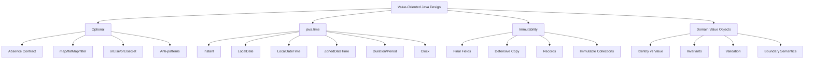
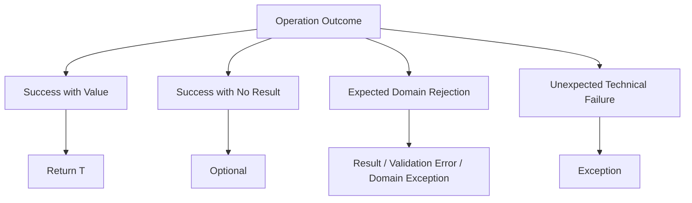
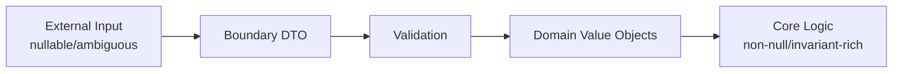
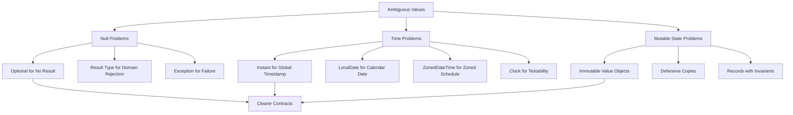

# Part 008 — Optional, java.time, Immutability, dan Value-Oriented Design

## 1. Posisi Part Ini dalam Roadmap

Part ini membahas tiga fondasi Java modern yang sering terlihat kecil, tetapi berdampak besar terhadap reliability sistem:

1. `Optional`
2. `java.time`
3. immutability dan value-oriented design

Ketiganya menyelesaikan keluarga masalah yang sama:

> Banyak bug production lahir dari representasi nilai yang ambigu.

Contoh ambiguitas:

- `null` berarti tidak ditemukan, belum dimuat, tidak berhak melihat, atau bug?
- `LocalDateTime` berarti waktu lokal di zona mana?
- `Date` mutable atau immutable?
- `List` hasil method boleh diubah caller atau tidak?
- Dua object `Money(100, "USD")` adalah value yang sama atau entity berbeda?

Engineer senior tidak hanya tahu API. Engineer senior tahu **konsekuensi representasi**.

---

## 2. Kaufman Lens: Skill yang Harus Dikuasai

### 2.1 Target Performa

Setelah part ini, kita harus mampu:

1. Mengganti null-prone API dengan contract yang eksplisit.
2. Memakai `Optional` sebagai return type secara tepat.
3. Menghindari anti-pattern `Optional`.
4. Memilih type `java.time` yang sesuai dengan makna domain.
5. Menghindari timezone dan DST bug umum.
6. Menggunakan `Clock` untuk testable time.
7. Mendesain immutable value object dengan invariant kuat.
8. Membedakan immutable, unmodifiable, effectively immutable, dan persistent data structure.
9. Menggunakan records untuk value-oriented design tanpa kehilangan validasi.
10. Membuat boundary model yang aman untuk API, persistence, dan distributed systems.

### 2.2 Decomposition



### 2.3 Practice Rule

Jangan mulai dari “kapan semua hal harus immutable?” Mulai dari tiga high-leverage habit:

1. Jangan return `null` untuk “not found” jika caller harus mengambil keputusan.
2. Jangan memakai `LocalDateTime` untuk timestamp global.
3. Jangan membocorkan mutable collection dari object.

Tiga hal itu saja sudah menghilangkan banyak bug.

---

## 3. Optional: Representasi Absence yang Eksplisit

`Optional<T>` adalah container yang mungkin berisi value non-null atau kosong.

```java
Optional<User> user = userRepository.findById(userId);
```

Maknanya:

> Operasi berhasil dijalankan, tetapi hasilnya mungkin tidak ada.

Ini berbeda dari exception.

```java
Optional<User> findById(UserId id); // user mungkin tidak ada
User loadRequired(UserId id);      // user wajib ada, throw jika tidak ada
```

### 3.1 Problem yang Diselesaikan Optional

Sebelum Optional:

```java
User user = userRepository.findById(id);
if (user != null) {
    sendEmail(user.email());
}
```

Masalah:

- method signature tidak memberi tahu apakah `null` valid;
- caller bisa lupa check;
- `null` tidak membawa semantic intent;
- `null` bisa berarti banyak hal.

Dengan Optional:

```java
userRepository.findById(id)
    .map(User::email)
    .ifPresent(emailService::sendEmail);
```

Method signature memaksa caller mengakui kemungkinan absence.

---

## 4. Optional Bukan Replacement Universal untuk Null

Dokumentasi Java menyatakan `Optional` terutama ditujukan sebagai method return type saat perlu merepresentasikan “no result” dan penggunaan `null` rawan error.

Artinya, Optional paling cocok untuk boundary seperti:

```java
Optional<User> findById(UserId id);
Optional<Order> findLatestOrder(CustomerId customerId);
Optional<Discount> activeDiscountFor(ProductId productId);
```

Tidak semua nullable harus menjadi Optional.

### 4.1 Good Use

```java
public Optional<User> findByEmail(Email email) {
    return users.stream()
        .filter(user -> user.email().equals(email))
        .findFirst();
}
```

Caller jelas harus menangani absence.

### 4.2 Bad Use: Optional Field

Kurang baik:

```java
public class UserProfile {
    private Optional<String> middleName;
}
```

Masalah:

- field bisa `null` dan berisi Optional, menambah lapisan ambiguity;
- banyak framework serialization/persistence kurang ideal dengan Optional field;
- domain model jadi tidak lebih jelas.

Lebih baik:

```java
public record UserProfile(String firstName, String middleName, String lastName) {
    public Optional<String> middleNameOptional() {
        return Optional.ofNullable(middleName);
    }
}
```

Atau buat value object khusus jika middle name punya domain meaning.

### 4.3 Bad Use: Optional Parameter

Kurang baik:

```java
void updateProfile(UserId id, Optional<String> middleName) { ... }
```

Caller menjadi awkward:

```java
updateProfile(id, Optional.empty());
```

Lebih baik gunakan overload, command object, atau nullable internal dengan validation jelas.

```java
record UpdateProfileCommand(UserId userId, String middleName) {}
```

Atau jika ada tiga state berbeda:

- tidak diubah;
- diubah menjadi value;
- dihapus;

buat model eksplisit.

```java
sealed interface FieldPatch<T> permits FieldPatch.Unchanged, FieldPatch.Set, FieldPatch.Clear {
    record Unchanged<T>() implements FieldPatch<T> {}
    record Set<T>(T value) implements FieldPatch<T> {}
    record Clear<T>() implements FieldPatch<T> {}
}
```

Ini jauh lebih jelas daripada `Optional<Optional<T>>`.

### 4.4 Bad Use: Optional Collection

Kurang baik:

```java
Optional<List<Order>> findOrders(CustomerId customerId);
```

Jika tidak ada order, gunakan empty list.

```java
List<Order> findOrders(CustomerId customerId);
```

`Optional<List<T>>` hanya masuk akal jika ada perbedaan makna antara:

- query tidak boleh dilihat / tidak tersedia;
- query tersedia tetapi hasil kosong.

Kalau tidak ada perbedaan itu, jangan pakai Optional collection.

---

## 5. Optional API Mental Model

### 5.1 Membuat Optional

```java
Optional<String> present = Optional.of("value");
Optional<String> absent = Optional.empty();
Optional<String> maybe = Optional.ofNullable(possiblyNull);
```

`Optional.of(null)` akan throw `NullPointerException`.

Gunakan `of` jika null adalah bug.

Gunakan `ofNullable` jika input memang bisa null dari boundary lama.

---

### 5.2 `map`

Gunakan `map` untuk transformasi value jika ada.

```java
Optional<String> email = userRepository.findById(id)
    .map(User::email);
```

Jika user tidak ada, hasil tetap `Optional.empty()`.

---

### 5.3 `flatMap`

Gunakan `flatMap` jika function sudah menghasilkan Optional.

```java
Optional<Email> email = userRepository.findById(id)
    .flatMap(User::verifiedEmail);
```

Jika memakai `map`, hasilnya nested:

```java
Optional<Optional<Email>> nested = userRepository.findById(id)
    .map(User::verifiedEmail);
```

Hampir selalu tidak diinginkan.

---

### 5.4 `filter`

```java
Optional<User> activeUser = userRepository.findById(id)
    .filter(User::active);
```

Makna:

- jika user tidak ada → empty;
- jika user ada tetapi tidak active → empty;
- jika user active → present.

Hati-hati: dua penyebab empty menjadi tidak dibedakan. Jika domain butuh error berbeda antara “not found” dan “inactive”, jangan pakai chain ini secara buta.

---

### 5.5 `orElse` vs `orElseGet`

`orElse` mengevaluasi argument sebelum method dipanggil.

```java
var user = maybeUser.orElse(createGuestUser());
```

`createGuestUser()` dipanggil meski `maybeUser` present.

`orElseGet` lazy.

```java
var user = maybeUser.orElseGet(this::createGuestUser);
```

Rule:

- gunakan `orElse` untuk default murah dan sudah tersedia;
- gunakan `orElseGet` untuk default mahal, punya side effect, atau perlu lazy.

Contoh:

```java
String displayName = maybeName.orElse("Anonymous");

User user = maybeUser.orElseGet(() -> userService.createGuest(sessionId));
```

---

### 5.6 `orElseThrow`

```java
User user = userRepository.findById(id)
    .orElseThrow(() -> new UserNotFoundException(id));
```

Gunakan saat absence adalah exceptional untuk use case tersebut.

Jangan gunakan `get()` tanpa check.

Buruk:

```java
User user = userRepository.findById(id).get();
```

Kalau value wajib ada, lebih baik method contract menyatakannya:

```java
User user = userRepository.getRequired(id);
```

---

### 5.7 `ifPresent` dan `ifPresentOrElse`

```java
maybeUser.ifPresent(user -> emailService.send(user.email()));
```

Java 9 menambahkan `ifPresentOrElse`:

```java
maybeUser.ifPresentOrElse(
    user -> emailService.send(user.email()),
    () -> audit.log("User not found")
);
```

Gunakan untuk side effect sederhana. Untuk branching kompleks, `if` biasa sering lebih jelas.

---

### 5.8 `Optional::stream` sejak Java 9

Sangat berguna untuk mengubah `Stream<Optional<T>>` menjadi `Stream<T>`.

```java
var verifiedEmails = users.stream()
    .map(User::verifiedEmail)      // Stream<Optional<Email>>
    .flatMap(Optional::stream)     // Stream<Email>
    .toList();
```

Ini menghindari anti-pattern:

```java
users.stream()
    .map(User::verifiedEmail)
    .filter(Optional::isPresent)
    .map(Optional::get)
    .toList();
```

---

## 6. Optional Design Decision Matrix

| Situasi | Gunakan Optional? | Pilihan yang Lebih Baik |
|---|---:|---|
| Repository `findById` | Ya | `Optional<Entity>` |
| Method `getRequired` | Tidak | Return value atau throw domain exception |
| Field dalam entity | Biasanya tidak | Nullable private field + accessor Optional, atau value object |
| Parameter method | Biasanya tidak | Overload, command object, sealed patch type |
| Collection result | Biasanya tidak | Empty collection |
| Absence punya alasan berbeda-beda | Tidak cukup | Result type/sealed error model |
| Internal local variable | Boleh jika memperjelas | Jangan berlebihan |
| Serialization DTO | Hindari | Explicit nullable/field omission contract |

---

## 7. java.time: Mengganti Date/Calendar dengan Model yang Benar

Java 8 memperkenalkan `java.time`, API tanggal/waktu modern yang jauh lebih jelas daripada `java.util.Date` dan `Calendar`.

Masalah klasik sebelum `java.time`:

- `Date` merepresentasikan instant tetapi namanya “date”.
- `Date` mutable secara historis melalui method deprecated.
- `Calendar` verbose dan mutable.
- Timezone handling membingungkan.
- Formatting/parsing sering tidak thread-safe dengan `SimpleDateFormat`.

`java.time` memperbaiki ini dengan type yang lebih spesifik dan immutable.

---

## 8. Memilih Type java.time Berdasarkan Makna Domain

Ini bagian terpenting.

Jangan mulai dari “saya butuh tanggal, pakai apa?” Mulai dari “nilai ini merepresentasikan apa?”

| Makna Domain | Type Umum | Contoh |
|---|---|---|
| Titik absolut di timeline | `Instant` | event created at, audit timestamp |
| Tanggal kalender tanpa jam | `LocalDate` | tanggal lahir, due date lokal |
| Jam tanpa tanggal | `LocalTime` | jam buka toko |
| Tanggal + jam tanpa zona | `LocalDateTime` | jadwal lokal sebelum zona dipilih |
| Tanggal + jam + offset | `OffsetDateTime` | timestamp API dengan offset |
| Tanggal + jam + timezone region | `ZonedDateTime` | meeting di Asia/Jakarta |
| Durasi berbasis detik/nano | `Duration` | timeout 30 detik |
| Periode berbasis tanggal | `Period` | 3 bulan, 2 tahun |
| Zona waktu region | `ZoneId` | Asia/Jakarta, Europe/Berlin |
| Offset UTC | `ZoneOffset` | +07:00 |
| Source waktu testable | `Clock` | dependency untuk `now()` |

---

## 9. Instant: Timestamp Absolut

`Instant` adalah titik absolut di UTC timeline.

Gunakan untuk:

- audit timestamp;
- event time;
- created/updated at;
- message publish time;
- ordering event lintas timezone;
- expiry timestamp.

```java
record AuditEvent(
    String actor,
    String action,
    Instant occurredAt
) {}
```

Ambil waktu sekarang:

```java
Instant now = Instant.now();
```

Namun untuk testability, jangan panggil `Instant.now()` langsung di domain/service logic. Inject `Clock`.

```java
final class AuditService {
    private final Clock clock;

    AuditService(Clock clock) {
        this.clock = clock;
    }

    AuditEvent record(String actor, String action) {
        return new AuditEvent(actor, action, Instant.now(clock));
    }
}
```

Test:

```java
var fixedClock = Clock.fixed(
    Instant.parse("2026-06-26T10:15:30Z"),
    ZoneOffset.UTC
);

var service = new AuditService(fixedClock);
```

Rule:

> Untuk timestamp global, default-kan ke `Instant`.

---

## 10. LocalDate: Tanggal Kalender Tanpa Jam dan Zona

`LocalDate` merepresentasikan tanggal seperti `2026-06-26` tanpa jam dan timezone.

Cocok untuk:

- tanggal lahir;
- tanggal jatuh tempo lokal;
- tanggal libur;
- tanggal dokumen;
- business day.

```java
record Person(String name, LocalDate birthDate) {}
```

Jangan gunakan `Instant` untuk tanggal lahir jika jam dan timezone tidak relevan.

Buruk:

```java
record Person(String name, Instant birthDate) {}
```

Masalah:

- birth date bukan titik waktu global;
- konversi timezone bisa menggeser tanggal;
- domain meaning jadi salah.

---

## 11. LocalDateTime: Type yang Sering Disalahgunakan

`LocalDateTime` adalah tanggal dan jam tanpa timezone.

Contoh:

```java
LocalDateTime local = LocalDateTime.of(2026, 6, 26, 9, 30);
```

Masalahnya: `2026-06-26T09:30` tidak menjawab “di mana?”

- Jakarta?
- UTC?
- Berlin?
- New York?

Untuk timestamp event production, `LocalDateTime` biasanya salah.

Buruk:

```java
record OrderCreatedEvent(OrderId id, LocalDateTime createdAt) {}
```

Lebih baik:

```java
record OrderCreatedEvent(OrderId id, Instant createdAt) {}
```

Kapan `LocalDateTime` masuk akal?

- input jadwal lokal sebelum timezone dipilih;
- template jadwal lokal;
- domain yang memang belum memiliki zone context.

Contoh:

```java
record LocalAppointmentRequest(
    LocalDateTime requestedLocalTime,
    ZoneId customerZone
) {
    ZonedDateTime toZonedDateTime() {
        return requestedLocalTime.atZone(customerZone);
    }
}
```

Rule:

> `LocalDateTime` bukan timestamp. Ia adalah tanggal+jam lokal tanpa zona.

---

## 12. ZonedDateTime dan OffsetDateTime

### 12.1 ZonedDateTime

`ZonedDateTime` menyimpan date-time dengan timezone region.

```java
var meeting = ZonedDateTime.of(
    2026, 6, 26, 9, 0, 0, 0,
    ZoneId.of("Asia/Jakarta")
);
```

Cocok untuk:

- meeting schedule;
- business rule berbasis timezone;
- calendar event;
- recurring event lokal;
- cut-off harian berdasarkan zona tertentu.

Timezone region seperti `Asia/Jakarta` lebih informatif daripada offset `+07:00`, karena region membawa aturan historis dan perubahan daylight saving jika ada.

### 12.2 OffsetDateTime

`OffsetDateTime` menyimpan date-time dengan offset tetap dari UTC.

```java
OffsetDateTime value = OffsetDateTime.parse("2026-06-26T09:00:00+07:00");
```

Cocok untuk:

- API payload yang menyertakan offset;
- representasi interoperable;
- log/event yang perlu offset eksplisit.

Namun offset bukan timezone region. `+01:00` tidak sama dengan `Europe/Berlin`, karena Berlin bisa berubah offset tergantung DST.

---

## 13. Duration vs Period

### 13.1 Duration

`Duration` adalah jumlah waktu berbasis detik/nanosecond.

```java
Duration timeout = Duration.ofSeconds(30);
Duration ttl = Duration.ofHours(6);
```

Cocok untuk:

- timeout;
- TTL;
- retry delay;
- latency;
- interval teknis.

### 13.2 Period

`Period` adalah jumlah waktu berbasis tanggal: tahun, bulan, hari.

```java
Period billingCycle = Period.ofMonths(1);
Period ageLimit = Period.ofYears(18);
```

Cocok untuk:

- umur;
- masa berlaku berbasis kalender;
- billing bulanan;
- domain tanggal.

Perbedaan penting:

```java
var start = ZonedDateTime.of(
    2026, 3, 29, 1, 30, 0, 0,
    ZoneId.of("Europe/Berlin")
);

var plusDuration = start.plus(Duration.ofDays(1));
var plusPeriod = start.plus(Period.ofDays(1));
```

Di zona dengan DST, hasil bisa berbeda secara lokal karena `Duration.ofDays(1)` berarti 24 jam, sedangkan `Period.ofDays(1)` berarti tanggal kalender berikutnya.

Rule:

> Untuk machine time pakai `Duration`. Untuk human calendar time pakai `Period`.

---

## 14. Clock: Membuat Waktu Bisa Diuji

Anti-pattern umum:

```java
boolean expired(Token token) {
    return token.expiresAt().isBefore(Instant.now());
}
```

Masalah:

- test tidak deterministik;
- sulit menguji boundary;
- logic terikat system clock.

Lebih baik:

```java
final class TokenService {
    private final Clock clock;

    TokenService(Clock clock) {
        this.clock = clock;
    }

    boolean expired(Token token) {
        return token.expiresAt().isBefore(Instant.now(clock));
    }
}
```

Production:

```java
var service = new TokenService(Clock.systemUTC());
```

Test:

```java
var clock = Clock.fixed(
    Instant.parse("2026-06-26T00:00:00Z"),
    ZoneOffset.UTC
);

var service = new TokenService(clock);
```

Rule:

> Domain/service code tidak boleh bergantung langsung pada waktu global jika behavior-nya perlu diuji.

---

## 15. Timezone Bug Patterns

### 15.1 Menyimpan LocalDateTime sebagai Timestamp Global

Buruk:

```java
record Payment(Instant id, LocalDateTime paidAt) {}
```

Jika `paidAt` dikirim ke service lain, service lain tidak tahu zona asal.

Lebih baik:

```java
record Payment(PaymentId id, Instant paidAt) {}
```

### 15.2 Mengubah Instant ke LocalDate Tanpa Zone Explicit

Buruk:

```java
LocalDate date = instant.atZone(ZoneId.systemDefault()).toLocalDate();
```

Server timezone bisa berbeda antar environment.

Lebih baik:

```java
LocalDate date = instant.atZone(customerZone).toLocalDate();
```

Atau:

```java
LocalDate date = instant.atZone(ZoneOffset.UTC).toLocalDate();
```

Pilih berdasarkan business rule.

### 15.3 Menganggap Satu Hari Selalu 24 Jam

Di zona dengan DST, hari tertentu bisa 23 atau 25 jam.

Untuk deadline “besok pukul 00:00 lokal”, jangan gunakan `plus(Duration.ofHours(24))`.

Gunakan kalender lokal:

```java
var tomorrowStart = LocalDate.now(clock)
    .plusDays(1)
    .atStartOfDay(zoneId);
```

### 15.4 Menggunakan System Default Zone Diam-diam

Buruk:

```java
ZonedDateTime.now();
LocalDate.now();
```

Lebih baik:

```java
ZonedDateTime.now(clock);
LocalDate.now(clock);
```

Dengan `Clock` yang zone-nya eksplisit.

---

## 16. Storage dan API Boundary untuk Time

### 16.1 Database

Prinsip umum:

- Simpan event timestamp sebagai UTC instant jika maknanya titik waktu global.
- Simpan local date sebagai date jika maknanya tanggal kalender.
- Simpan timezone region jika business rule perlu reconstruct local time.

Contoh meeting:

```java
record Meeting(
    MeetingId id,
    LocalDateTime localStart,
    ZoneId zoneId
) {
    ZonedDateTime start() {
        return localStart.atZone(zoneId);
    }

    Instant instantStart() {
        return start().toInstant();
    }
}
```

Untuk audit event:

```java
record AuditLog(
    AuditLogId id,
    Instant occurredAt,
    String actor,
    String action
) {}
```

### 16.2 API

Untuk API, gunakan format ISO-8601.

Contoh:

```json
{
  "occurredAt": "2026-06-26T03:15:30Z"
}
```

Untuk local schedule:

```json
{
  "localStart": "2026-06-26T09:00:00",
  "zoneId": "Asia/Jakarta"
}
```

Jangan kirim `2026-06-26T09:00:00` sendirian jika consumer perlu tahu instant global.

---

## 17. Immutability: Mengurangi State-Space Bug

Mutable object memperbesar state-space.

Jika object bisa berubah kapan saja, reasoning menjadi sulit:

- siapa mengubah?
- kapan berubah?
- apakah thread lain melihat perubahan?
- apakah hashCode berubah setelah masuk map?
- apakah invariant masih benar?

Immutability membuat object lebih mudah dipikirkan.

```java
record Money(BigDecimal amount, Currency currency) {}
```

Setelah dibuat, `Money` tidak berubah.

Jika butuh nilai baru:

```java
Money add(Money other) {
    requireSameCurrency(other);
    return new Money(amount.add(other.amount), currency);
}
```

---

## 18. Immutable Bukan Sekadar `final`

Field `final` hanya membuat reference tidak bisa diganti. Object yang direferensikan masih bisa mutable.

```java
public final class Order {
    private final List<OrderLine> lines;

    public Order(List<OrderLine> lines) {
        this.lines = lines;
    }

    public List<OrderLine> lines() {
        return lines;
    }
}
```

Masalah:

```java
var external = new ArrayList<OrderLine>();
var order = new Order(external);
external.add(new OrderLine(...)); // order berubah dari luar

order.lines().clear(); // order berubah dari accessor
```

Benar:

```java
public final class Order {
    private final List<OrderLine> lines;

    public Order(List<OrderLine> lines) {
        this.lines = List.copyOf(lines);
    }

    public List<OrderLine> lines() {
        return lines;
    }
}
```

`List.copyOf` membuat unmodifiable copy dan mencegah caller mengubah isi list melalui reference awal.

Jika element `OrderLine` mutable, masih ada masalah. Idealnya element juga immutable.

---

## 19. Unmodifiable vs Immutable

Unmodifiable view:

```java
var list = new ArrayList<String>();
var view = Collections.unmodifiableList(list);

list.add("A");
System.out.println(view); // [A]
```

`view` tidak bisa dimodifikasi langsung, tetapi backing list masih bisa berubah.

Immutable copy:

```java
var list = new ArrayList<String>();
var copy = List.copyOf(list);

list.add("A");
System.out.println(copy); // []
```

Rule:

> Untuk defensive boundary, pilih copy, bukan sekadar unmodifiable view.

---

## 20. Records untuk Value-Oriented Design

Record cocok untuk data carrier immutable dengan equality berbasis value.

```java
record Email(String value) {
    Email {
        Objects.requireNonNull(value, "value");
        value = value.trim().toLowerCase(Locale.ROOT);
        if (!value.contains("@")) {
            throw new IllegalArgumentException("Invalid email: " + value);
        }
    }
}
```

Compact constructor bisa:

- validasi;
- normalisasi;
- menjaga invariant.

Record memberi:

- final fields;
- canonical constructor;
- accessors;
- `equals`;
- `hashCode`;
- `toString`.

Namun record bukan magic.

Jika component mutable:

```java
record Basket(List<Item> items) {}
```

Caller masih bisa membocorkan mutability jika tidak copy.

Benar:

```java
record Basket(List<Item> items) {
    Basket {
        items = List.copyOf(items);
    }
}
```

---

## 21. Value Object vs Entity

Value object diidentifikasi oleh nilai.

```java
record Money(BigDecimal amount, Currency currency) {}
```

Dua `Money(100, USD)` adalah sama secara value.

Entity diidentifikasi oleh identity.

```java
final class User {
    private final UserId id;
    private String name;
}
```

Dua user dengan nama sama bukan user yang sama jika ID berbeda.

### 21.1 Decision Matrix

| Pertanyaan | Jika Ya | Model |
|---|---|---|
| Apakah object punya lifecycle sendiri? | Ya | Entity |
| Apakah identity lebih penting dari attribute? | Ya | Entity |
| Apakah equality berdasarkan semua field? | Ya | Value object |
| Apakah object sebaiknya immutable? | Biasanya ya | Value object |
| Apakah object merepresentasikan measurement/concept? | Ya | Value object |

---

## 22. Designing Strong Value Objects

### 22.1 Email

Buruk:

```java
record User(String email) {}
```

String terlalu lemah. Tidak ada invariant.

Lebih baik:

```java
record Email(String value) {
    Email {
        Objects.requireNonNull(value, "value");
        value = value.trim().toLowerCase(Locale.ROOT);
        if (value.isBlank() || !value.contains("@")) {
            throw new IllegalArgumentException("Invalid email");
        }
    }
}
```

Sekarang method yang menerima `Email` tidak perlu validasi ulang basic invariant.

```java
void sendWelcomeEmail(Email email) { ... }
```

### 22.2 Money

Buruk:

```java
record Product(BigDecimal price) {}
```

Tidak ada currency.

Lebih baik:

```java
record Money(BigDecimal amount, Currency currency) {
    Money {
        Objects.requireNonNull(amount, "amount");
        Objects.requireNonNull(currency, "currency");
        if (amount.scale() > currency.getDefaultFractionDigits()) {
            amount = amount.setScale(currency.getDefaultFractionDigits(), RoundingMode.UNNECESSARY);
        }
    }

    Money add(Money other) {
        requireSameCurrency(other);
        return new Money(amount.add(other.amount), currency);
    }

    private void requireSameCurrency(Money other) {
        if (!currency.equals(other.currency)) {
            throw new IllegalArgumentException("Currency mismatch");
        }
    }
}
```

Catatan: money handling bisa sangat domain-specific. Rounding, scale, tax, FX, dan regulation harus dirancang sesuai kebutuhan bisnis.

### 22.3 Identifier Value Object

```java
record UserId(UUID value) {
    UserId {
        Objects.requireNonNull(value, "value");
    }

    static UserId random() {
        return new UserId(UUID.randomUUID());
    }
}
```

Lebih baik daripada menyebar `UUID` mentah di semua layer.

---

## 23. Boundary Design: Null, Optional, Exception, atau Result?

Absence dan failure berbeda.



### 23.1 `Optional<T>`

Cocok untuk successful no-result.

```java
Optional<User> findById(UserId id);
```

### 23.2 Exception

Cocok untuk failure yang menggagalkan operasi.

```java
User getRequired(UserId id) {
    return findById(id).orElseThrow(() -> new UserNotFoundException(id));
}
```

### 23.3 Result Type

Cocok jika failure adalah bagian dari business flow dan caller harus mengambil keputusan.

```java
sealed interface RegistrationResult
    permits RegistrationResult.Success, RegistrationResult.EmailAlreadyUsed, RegistrationResult.InvalidInput {

    record Success(UserId userId) implements RegistrationResult {}
    record EmailAlreadyUsed(Email email) implements RegistrationResult {}
    record InvalidInput(List<ValidationError> errors) implements RegistrationResult {}
}
```

Ini lebih jelas daripada `Optional<UserId>` untuk registration, karena empty tidak menjelaskan alasan gagal.

---

## 24. Combining Optional, Time, dan Immutability dalam Domain Model

Contoh domain: enforcement case.

```java
record CaseId(UUID value) {
    CaseId {
        Objects.requireNonNull(value, "value");
    }
}

record OfficerId(UUID value) {
    OfficerId {
        Objects.requireNonNull(value, "value");
    }
}

enum CaseStatus {
    DRAFT,
    SUBMITTED,
    UNDER_REVIEW,
    ESCALATED,
    CLOSED
}

record CaseAssignment(
    CaseId caseId,
    OfficerId officerId,
    Instant assignedAt
) {
    CaseAssignment {
        Objects.requireNonNull(caseId, "caseId");
        Objects.requireNonNull(officerId, "officerId");
        Objects.requireNonNull(assignedAt, "assignedAt");
    }
}

record EnforcementCase(
    CaseId id,
    CaseStatus status,
    Instant createdAt,
    Optional<CaseAssignment> currentAssignment
) {}
```

Di sini ada satu hal yang perlu dikritik: `Optional` sebagai record component berarti field Optional. Untuk pure domain object internal, kita sebaiknya hindari.

Lebih baik:

```java
record EnforcementCase(
    CaseId id,
    CaseStatus status,
    Instant createdAt,
    CaseAssignment currentAssignment
) {
    EnforcementCase {
        Objects.requireNonNull(id, "id");
        Objects.requireNonNull(status, "status");
        Objects.requireNonNull(createdAt, "createdAt");
        // currentAssignment boleh null secara internal jika memang belum ada
    }

    Optional<CaseAssignment> currentAssignmentOptional() {
        return Optional.ofNullable(currentAssignment);
    }
}
```

Atau lebih eksplisit dengan sealed state:

```java
sealed interface AssignmentState permits AssignmentState.Unassigned, AssignmentState.Assigned {
    record Unassigned() implements AssignmentState {}
    record Assigned(CaseAssignment assignment) implements AssignmentState {
        public Assigned {
            Objects.requireNonNull(assignment, "assignment");
        }
    }
}

record EnforcementCase(
    CaseId id,
    CaseStatus status,
    Instant createdAt,
    AssignmentState assignmentState
) {}
```

Ini lebih kuat karena absence menjadi state domain, bukan sekadar missing value.

---

## 25. Defensive Copies for Records

Record dengan collection component butuh defensive copy.

```java
record ValidationResult(List<ValidationError> errors) {
    ValidationResult {
        errors = List.copyOf(errors);
    }

    boolean valid() {
        return errors.isEmpty();
    }
}
```

Jika tidak copy:

```java
var errors = new ArrayList<ValidationError>();
var result = new ValidationResult(errors);
errors.add(new ValidationError("field", "bad"));
```

`result` berubah dari luar.

Rule:

> Record tidak otomatis membuat deep immutable object. Ia hanya membuat shallow immutable reference components.

---

## 26. Null Handling at Boundaries

Dalam sistem nyata, kita tetap bertemu null dari:

- database;
- JSON payload;
- legacy API;
- third-party library;
- framework reflection;
- cache;
- external service.

Strategi yang sehat:

1. Terima null di boundary.
2. Validasi/normalisasi secepat mungkin.
3. Ubah menjadi domain type yang jelas.
4. Jangan biarkan null menyebar ke core domain.



Contoh:

```java
record CreateUserRequest(String email, String birthDate) {}

record CreateUserCommand(Email email, LocalDate birthDate) {}

CreateUserCommand toCommand(CreateUserRequest request) {
    Objects.requireNonNull(request, "request");

    return new CreateUserCommand(
        new Email(request.email()),
        LocalDate.parse(request.birthDate())
    );
}
```

Jika parsing/validation butuh error accumulation, jangan throw di tengah. Gunakan validation result.

---

## 27. Practical Patterns

### 27.1 Repository Pattern

```java
interface UserRepository {
    Optional<User> findById(UserId id);
    User save(User user);
}
```

### 27.2 Required Load

```java
final class UserService {
    private final UserRepository repository;

    User getRequired(UserId id) {
        return repository.findById(id)
            .orElseThrow(() -> new UserNotFoundException(id));
    }
}
```

### 27.3 Time-Aware Domain Method

```java
record Subscription(Instant expiresAt) {
    boolean activeAt(Instant instant) {
        return instant.isBefore(expiresAt);
    }

    boolean activeNow(Clock clock) {
        return activeAt(Instant.now(clock));
    }
}
```

Better testing:

```java
assertTrue(subscription.activeAt(Instant.parse("2026-06-26T00:00:00Z")));
```

### 27.4 Immutable Aggregate Snapshot

```java
record CaseSnapshot(
    CaseId id,
    CaseStatus status,
    List<CaseEvent> events,
    Instant capturedAt
) {
    CaseSnapshot {
        events = List.copyOf(events);
    }
}
```

---

## 28. Anti-Patterns

### 28.1 `Optional.get()` Driven Code

Buruk:

```java
if (maybeUser.isPresent()) {
    send(maybeUser.get().email());
}
```

Lebih baik:

```java
maybeUser.map(User::email)
    .ifPresent(this::send);
```

Atau untuk flow kompleks:

```java
if (maybeUser.isEmpty()) {
    return;
}

var user = maybeUser.orElseThrow();
send(user.email());
```

### 28.2 Swallowing Domain Meaning with Optional

Buruk:

```java
Optional<Approval> approve(CaseId id);
```

Apa arti empty?

- case tidak ditemukan?
- tidak eligible?
- sudah approved?
- user tidak authorized?

Lebih baik:

```java
sealed interface ApprovalResult {
    record Approved(Approval approval) implements ApprovalResult {}
    record CaseNotFound(CaseId id) implements ApprovalResult {}
    record NotEligible(String reason) implements ApprovalResult {}
    record AlreadyApproved(CaseId id) implements ApprovalResult {}
}
```

### 28.3 `LocalDateTime.now()` untuk Audit

Buruk:

```java
var event = new AuditEvent(action, LocalDateTime.now());
```

Lebih baik:

```java
var event = new AuditEvent(action, Instant.now(clock));
```

### 28.4 Returning Mutable Collections

Buruk:

```java
class Order {
    private final List<OrderLine> lines = new ArrayList<>();

    List<OrderLine> lines() {
        return lines;
    }
}
```

Lebih baik:

```java
class Order {
    private final List<OrderLine> lines = new ArrayList<>();

    List<OrderLine> lines() {
        return List.copyOf(lines);
    }
}
```

Atau expose behavior, bukan collection:

```java
void addLine(OrderLine line) { ... }
Money total() { ... }
```

---

## 29. Testing Strategy

### 29.1 Optional Tests

Test both branches.

```java
@Test
void returnsUserWhenFound() { ... }

@Test
void returnsEmptyWhenNotFound() { ... }
```

### 29.2 Time Tests

Gunakan fixed clock.

```java
@Test
void tokenIsExpiredAfterExpiryInstant() {
    var clock = Clock.fixed(
        Instant.parse("2026-06-26T10:00:00Z"),
        ZoneOffset.UTC
    );

    var token = new Token(Instant.parse("2026-06-26T09:59:59Z"));

    assertTrue(new TokenService(clock).expired(token));
}
```

### 29.3 Immutability Tests

```java
@Test
void basketDefensivelyCopiesItems() {
    var items = new ArrayList<Item>();
    var basket = new Basket(items);

    items.add(new Item("SKU-1"));

    assertTrue(basket.items().isEmpty());
}
```

Test accessor immutability:

```java
@Test
void basketItemsCannotBeMutatedFromAccessor() {
    var basket = new Basket(List.of(new Item("SKU-1")));

    assertThrows(UnsupportedOperationException.class, () ->
        basket.items().add(new Item("SKU-2"))
    );
}
```

---

## 30. Practice: 20-Hour Drill

### Hour 1–2: Optional Basics

Latihan:

- Ubah repository method nullable menjadi `Optional`.
- Tulis caller dengan `map`, `flatMap`, `orElseThrow`.
- Refactor `isPresent/get` menjadi chain yang lebih jelas.

Checklist:

- Bisa menjelaskan kapan Optional cocok.
- Tidak menggunakan Optional field/parameter tanpa alasan kuat.

### Hour 3–4: Absence vs Failure

Latihan:

- Ambil tiga method yang return null.
- Klasifikasikan:
  - no result;
  - domain rejection;
  - technical failure.
- Ubah menjadi `Optional`, exception, atau sealed result.

Checklist:

- Tidak memakai Optional untuk menyembunyikan error domain.

### Hour 5–6: java.time Type Selection

Latihan:

Untuk setiap field berikut, pilih type:

- `createdAt`
- `birthDate`
- `meetingStart`
- `storeOpeningHour`
- `retryDelay`
- `billingCycle`
- `customerLocalDeadline`

Checklist:

- Bisa menjelaskan alasan pemilihan type.

### Hour 7–8: Clock Injection

Latihan:

- Refactor service yang memakai `now()` langsung.
- Tambahkan `Clock`.
- Buat test dengan `Clock.fixed`.

Checklist:

- Test waktu deterministik.

### Hour 9–10: Timezone Bugs

Latihan:

- Convert `Instant` ke local date dengan explicit zone.
- Buat contoh deadline lokal.
- Hindari `ZoneId.systemDefault()` di business logic.

Checklist:

- Tidak ada timezone implicit di core logic.

### Hour 11–12: Records and Validation

Latihan:

- Buat `Email`, `UserId`, `Money` sebagai record.
- Tambahkan validation dan normalization.

Checklist:

- Invariant dijaga di constructor.

### Hour 13–14: Defensive Copy

Latihan:

- Buat record dengan `List` component.
- Tambahkan `List.copyOf`.
- Tulis test mutability leak.

Checklist:

- Tidak ada mutable collection leak.

### Hour 15–16: Value Object vs Entity

Latihan:

- Ambil 10 konsep domain.
- Klasifikasikan entity atau value object.
- Jelaskan equality rule masing-masing.

Checklist:

- Tidak memakai primitive/string obsession untuk konsep penting.

### Hour 17–18: Boundary Mapping

Latihan:

- Buat DTO nullable.
- Map ke command domain non-null.
- Kumpulkan validation error.

Checklist:

- Null berhenti di boundary.

### Hour 19–20: Code Review Kata

Ambil codebase nyata dan cari:

- nullable return;
- `Optional.get()`;
- `LocalDateTime.now()`;
- mutable collection leak;
- primitive obsession;
- missing value object;
- unclear absence/failure semantics.

Checklist:

- Bisa membuat review comment yang menjelaskan risiko, bukan sekadar preferensi style.

---

## 31. Production Checklist

### Optional

- Apakah `Optional` digunakan sebagai return type untuk no-result?
- Apakah absence berbeda dari failure?
- Apakah empty punya makna yang cukup jelas?
- Apakah ada `Optional.get()` tanpa guard?
- Apakah ada Optional field/parameter yang bisa diganti model lebih eksplisit?
- Apakah collection kosong lebih tepat daripada `Optional<List<T>>`?

### Time

- Apakah timestamp global memakai `Instant`?
- Apakah tanggal kalender memakai `LocalDate`?
- Apakah timezone eksplisit saat mengubah instant ke local time?
- Apakah `Clock` di-inject untuk logic yang testable?
- Apakah `LocalDateTime` tidak dipakai sebagai timestamp global?
- Apakah `Duration` dan `Period` dipilih sesuai machine time vs calendar time?

### Immutability

- Apakah value object immutable?
- Apakah collection di-copy saat masuk object?
- Apakah accessor membocorkan mutable state?
- Apakah record dengan mutable component sudah defensive copy?
- Apakah equality semantics jelas?
- Apakah invariant dijaga di constructor/factory?

---

## 32. Common Interview/Review Questions

### Q1: Kenapa Optional sebaiknya tidak dipakai sebagai field?

Karena `Optional` terutama dimaksudkan sebagai return type untuk merepresentasikan no-result. Sebagai field, ia bisa menambah ambiguity, tetap bisa null, dan sering tidak cocok dengan serialization/persistence framework.

### Q2: Apa beda `orElse` dan `orElseGet`?

`orElse` mengevaluasi default value secara eager. `orElseGet` mengevaluasi supplier secara lazy hanya saat Optional kosong.

### Q3: Kenapa `LocalDateTime` bukan timestamp?

Karena tidak memiliki timezone atau offset. Nilai seperti `2026-06-26T09:00` tidak menunjuk satu titik global sampai zone/offset diberikan.

### Q4: Kapan pakai `Instant`?

Gunakan `Instant` untuk titik waktu absolut: audit event, createdAt, updatedAt, message timestamp, expiry timestamp.

### Q5: Apa beda unmodifiable dan immutable?

Unmodifiable view tidak bisa diubah melalui view tersebut, tetapi backing object bisa berubah. Immutable copy tidak berubah walaupun source collection berubah setelah copy dibuat.

### Q6: Apakah record otomatis immutable?

Record memberikan final component references, tetapi tidak membuat object di dalam component menjadi immutable. Untuk collection atau mutable component, tetap perlu defensive copy.

---

## 33. Ringkasan Mental Model



Optional, `java.time`, dan immutability bukan fitur kecil. Mereka adalah alat untuk membuat state, absence, dan time menjadi eksplisit. Semakin eksplisit representasi nilai, semakin kecil ruang bug yang tersembunyi.

---

## 34. Referensi

- Oracle Java SE 25 API — `java.util.Optional`.
- Oracle Java SE 8 API — `java.util.Optional`.
- Oracle Java SE 25 API — `java.time` package summary.
- Oracle Java SE 8 API — `java.time.LocalDate`.
- Oracle Java SE 25 API — `java.time.Instant`, `LocalDate`, `LocalDateTime`, `ZonedDateTime`, `Duration`, `Period`, `Clock`.
- Java Language Specification Java SE 25 — records, final fields, object model, and value-based API implications.
