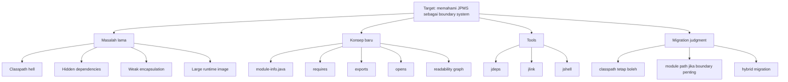
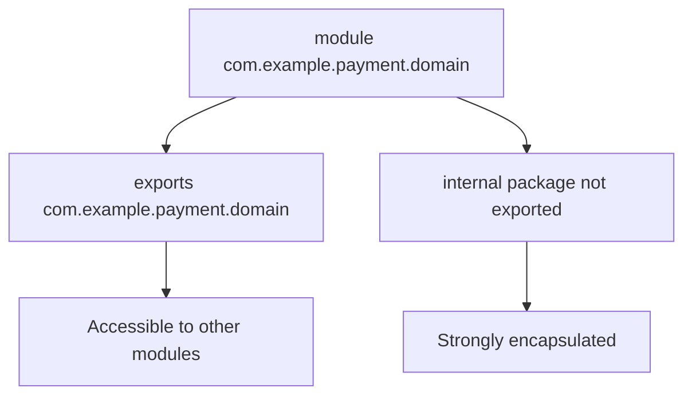
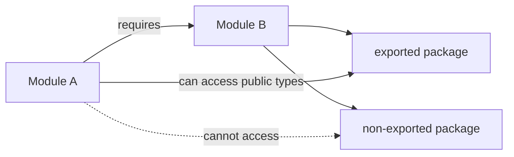
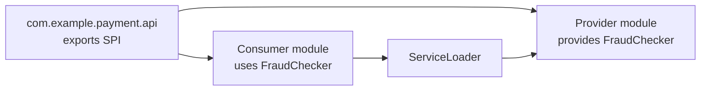
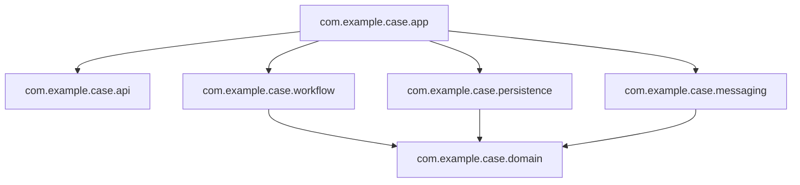
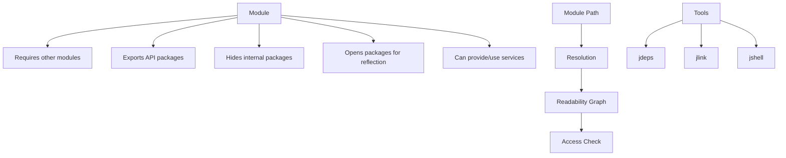

# Part 012 — Java 9: JPMS, Modules, JShell, jlink, dan Strong Encapsulation

> **Tujuan part ini:** memahami Java Platform Module System sebagai boundary model, bukan sekadar fitur Java 9. Setelah part ini, kamu harus bisa menjelaskan perbedaan classpath dan module path, membaca `module-info.java`, memakai `jdeps`, memahami `exports` vs `opens`, dan membuat keputusan rasional kapan JPMS layak dipakai.

Java 9 adalah salah satu rilis paling struktural dalam sejarah Java. Java 8 membawa lambda dan stream ke level bahasa/API. Java 9 membawa modularity ke level platform.

Sebelum Java 9, unit modularitas utama di Java application biasanya:

- class,
- package,
- JAR,
- build module Maven/Gradle,
- runtime convention.

Masalahnya: JAR tidak punya boundary semantik yang kuat. Ia bisa berisi apa saja, bergantung pada apa saja, dan mengekspos package apa saja. Classpath hanya daftar lokasi pencarian class. Ia tidak menjelaskan dependency graph secara eksplisit.

JPMS memperkenalkan module sebagai unit baru di atas package.

---

## 1. Posisi dalam Framework Kaufman

Dalam framework Kaufman, JPMS harus dipelajari dengan dekomposisi yang tepat. Jangan mulai dari semua detail syntax. Mulai dari masalah yang diselesaikan.



Target performa praktis:

> Kamu bisa membuat dua module kecil, mengatur dependency antar-module, membedakan package yang diekspor dan yang internal, menjalankan dengan module path, menganalisis dependency memakai `jdeps`, dan menjelaskan risiko migration dari classpath ke module path.

---

## 2. Problem Space: Classpath Hell

Classpath adalah mekanisme lama untuk memberi tahu JVM di mana mencari class.

Contoh:

```bash
java -cp app.jar:lib/a.jar:lib/b.jar com.example.Main
```

Masalah classpath:

### 2.1 Tidak Ada Dependency Declaration di Runtime

Classpath hanya daftar. Ia tidak mengatakan:

- `app.jar` membutuhkan `a.jar`,
- `a.jar` membutuhkan `b.jar`,
- package mana yang public API,
- package mana yang internal,
- apakah dependency optional,
- apakah ada duplicate class.

### 2.2 Missing Dependency Baru Ketahuan Saat Runtime

Jika class tidak ditemukan:

```text
java.lang.NoClassDefFoundError
java.lang.ClassNotFoundException
```

Sering baru muncul saat path code tertentu dieksekusi.

### 2.3 Duplicate Class Tergantung Urutan Classpath

Jika dua JAR berisi class yang sama, classpath order bisa menentukan class mana yang dipakai.

```bash
java -cp lib/v1.jar:lib/v2.jar com.example.Main
```

Ini rapuh karena hasilnya tergantung urutan.

### 2.4 Split Package

Split package terjadi saat package yang sama ada di lebih dari satu JAR/module.

Contoh:

```text
jar-a.jar -> com.acme.util.Strings
jar-b.jar -> com.acme.util.Dates
```

Di classpath, ini bisa berjalan. Di module path, ini menjadi masalah karena module system ingin package ownership lebih jelas.

### 2.5 Weak Encapsulation

Di Java sebelum JPMS, `public` berarti public untuk semua code yang bisa melihat classpath.

Jika library punya package internal:

```text
com.example.payment.internal
```

Tidak ada enforcement kuat yang mencegah consumer memakainya jika class-nya `public`.

JPMS memperbaiki ini dengan `exports`.

---

## 3. Module: Unit Baru di Atas Package

Module adalah named collection dari packages dan resources dengan descriptor eksplisit.

Struktur sederhana:

```text
payment.domain/
  src/main/java/
    module-info.java
    com/example/payment/domain/Payment.java
    com/example/payment/domain/Money.java
    com/example/payment/domain/internal/MoneyParser.java
```

`module-info.java`:

```java
module com.example.payment.domain {
    exports com.example.payment.domain;
}
```

Makna:

- module bernama `com.example.payment.domain`,
- package `com.example.payment.domain` diekspor ke module lain,
- package `com.example.payment.domain.internal` tidak diekspor,
- public class di package internal tidak otomatis bisa diakses module lain.



---

## 4. `module-info.java`: Descriptor sebagai Kontrak

`module-info.java` bukan dekorasi. Ia adalah kontrak module.

Directive umum:

```java
module com.example.payment.app {
    requires com.example.payment.domain;
    requires com.example.payment.persistence;

    exports com.example.payment.api;

    opens com.example.payment.api.dto to com.fasterxml.jackson.databind;

    uses com.example.payment.spi.FraudChecker;
    provides com.example.payment.spi.FraudChecker
        with com.example.payment.internal.DefaultFraudChecker;
}
```

Directive penting:

| Directive | Makna |
|---|---|
| `requires` | Module ini membaca module lain. |
| `requires transitive` | Dependency ikut terbaca oleh module yang bergantung pada module ini. |
| `requires static` | Dependency dibutuhkan saat compile, optional saat runtime. |
| `exports` | Package boleh dipakai module lain saat compile dan runtime. |
| `exports ... to` | Package hanya diekspor ke module tertentu. |
| `opens` | Package dibuka untuk deep reflection. |
| `opens ... to` | Package dibuka untuk reflection hanya ke module tertentu. |
| `uses` | Module memakai service provider. |
| `provides ... with` | Module menyediakan implementasi service. |

---

## 5. Readability vs Accessibility

JPMS punya dua konsep yang sering tertukar.

### 5.1 Readability

Module A membaca module B jika A punya dependency ke B.

```java
module com.example.app {
    requires com.example.domain;
}
```

Artinya `com.example.app` bisa membaca `com.example.domain`.

### 5.2 Accessibility

Meskipun A membaca B, A hanya bisa mengakses public type dari package yang diekspor oleh B.

```java
module com.example.domain {
    exports com.example.domain.api;
    // com.example.domain.internal tidak diekspor
}
```

Jadi:

```java
import com.example.domain.api.Payment;      // OK
import com.example.domain.internal.Parser;  // tidak OK dari module lain
```

Mental model:



Readability adalah “module mana yang terlihat”. Accessibility adalah “type mana yang boleh dipakai”.

---

## 6. `exports` vs `opens`

Ini krusial.

### 6.1 `exports`

`exports` membuat public types dalam package bisa diakses oleh module lain untuk compile-time dan runtime normal access.

```java
module com.example.user {
    exports com.example.user.api;
}
```

Gunakan untuk public API.

### 6.2 `opens`

`opens` tidak membuat package menjadi compile-time API. Ia membuka package untuk deep reflection.

```java
module com.example.user {
    opens com.example.user.dto to com.fasterxml.jackson.databind;
}
```

Gunakan untuk framework yang perlu reflection, misalnya serialization/deserialization, dependency injection, ORM, testing tools.

### 6.3 Jangan `opens` Semuanya Tanpa Alasan

```java
open module com.example.user {
    exports com.example.user.api;
}
```

`open module` membuka semua package untuk reflection. Ini kadang berguna saat migration, tetapi mengurangi manfaat strong encapsulation.

Rule:

- `exports` untuk API compile-time.
- `opens` untuk reflection runtime.
- `exports ... to` dan `opens ... to` untuk exposure terbatas.
- Jangan membuka internal package hanya karena “biar jalan”. Cari framework/module yang benar-benar butuh akses.

---

## 7. `requires`, `requires transitive`, dan API Leakage

### 7.1 `requires`

```java
module com.example.payment.service {
    requires com.example.payment.domain;
}
```

Module service membaca domain.

### 7.2 `requires transitive`

Gunakan jika dependency menjadi bagian dari public API module kamu.

Misalnya:

```java
module com.example.payment.api {
    requires transitive com.example.money;
    exports com.example.payment.api;
}
```

Jika public API kamu expose type dari `com.example.money`, consumer API mungkin perlu membaca money module juga.

Contoh:

```java
package com.example.payment.api;

import com.example.money.Money;

public record PaymentRequest(Money amount) {}
```

Jika consumer memakai `PaymentRequest`, ia juga perlu melihat `Money`.

### 7.3 Jangan Sembarangan Transitive

`requires transitive` memperluas dependency surface.

Gunakan hanya jika dependency benar-benar muncul di public API. Jika dependency hanya implementation detail, pakai `requires` biasa.

---

## 8. Named, Unnamed, dan Automatic Modules

JPMS harus bisa hidup berdampingan dengan ecosystem lama.

### 8.1 Named Module

Module yang punya descriptor eksplisit:

```text
module-info.java
```

Atau descriptor di JAR modular.

### 8.2 Unnamed Module

Code di classpath masuk ke unnamed module.

Karakteristik:

- membaca banyak module platform,
- tidak punya nama eksplisit,
- berguna untuk backward compatibility,
- tidak memberi strong modular boundary seperti named module.

### 8.3 Automatic Module

JAR non-modular yang diletakkan di module path bisa menjadi automatic module.

Karakteristik umum:

- nama module diturunkan dari JAR name atau `Automatic-Module-Name`,
- mengekspor semua package,
- membaca module lain secara luas,
- berguna untuk migration bridge,
- bukan desain akhir ideal.

### 8.4 Migration Reality

Banyak aplikasi enterprise tidak langsung full JPMS.

Strategi umum:

1. Tetap di classpath, upgrade JDK dulu.
2. Tambahkan `Automatic-Module-Name` pada library internal.
3. Modularisasi library domain yang stabil.
4. Hindari split package.
5. Gunakan `jdeps` untuk audit dependency.
6. Baru pindahkan module tertentu ke module path.

---

## 9. Classpath vs Module Path

Classpath:

```bash
java -cp out:lib/* com.example.Main
```

Module path:

```bash
java --module-path mods \
     --module com.example.app/com.example.app.Main
```

Atau lebih pendek:

```bash
java -p mods -m com.example.app/com.example.app.Main
```

Perbandingan:

| Aspek | Classpath | Module Path |
|---|---|---|
| Dependency graph | Implisit | Eksplisit via `requires` |
| Encapsulation | Lemah, package convention | Kuat via `exports` |
| Duplicate package | Bisa terjadi | Lebih ketat |
| Reflection | Umumnya bebas sebelum strong encapsulation | Perlu `opens` untuk deep reflection |
| Startup validation | Lebih sedikit | Module resolution lebih awal |
| Migration friction | Rendah | Lebih tinggi |
| Boundary clarity | Rendah | Tinggi |

JPMS bukan pengganti Maven/Gradle. Maven/Gradle mengatur build dependency. JPMS mengatur module dependency dan access pada compile/runtime platform.

---

## 10. Hands-On: Membuat Dua Module

Kita buat project minimal.

```text
workspace/
  src/
    com.example.greeter/
      module-info.java
      com/example/greeter/Greeter.java
    com.example.app/
      module-info.java
      com/example/app/Main.java
```

### 10.1 Module `com.example.greeter`

`src/com.example.greeter/module-info.java`:

```java
module com.example.greeter {
    exports com.example.greeter;
}
```

`src/com.example.greeter/com/example/greeter/Greeter.java`:

```java
package com.example.greeter;

public final class Greeter {
    public String greet(String name) {
        return "Hello, " + name;
    }
}
```

### 10.2 Module `com.example.app`

`src/com.example.app/module-info.java`:

```java
module com.example.app {
    requires com.example.greeter;
}
```

`src/com.example.app/com/example/app/Main.java`:

```java
package com.example.app;

import com.example.greeter.Greeter;

public final class Main {
    public static void main(String[] args) {
        System.out.println(new Greeter().greet("Java 9"));
    }
}
```

### 10.3 Compile

```bash
mkdir -p mods
javac -d mods --module-source-path src \
  $(find src -name "*.java")
```

### 10.4 Run

```bash
java --module-path mods \
  --module com.example.app/com.example.app.Main
```

Output:

```text
Hello, Java 9
```

---

## 11. Internal Package Enforcement

Tambahkan internal package:

```text
src/com.example.greeter/com/example/greeter/internal/NameNormalizer.java
```

```java
package com.example.greeter.internal;

public final class NameNormalizer {
    public String normalize(String name) {
        return name == null || name.isBlank() ? "friend" : name.trim();
    }
}
```

Pakai dari `Greeter`:

```java
package com.example.greeter;

import com.example.greeter.internal.NameNormalizer;

public final class Greeter {
    private final NameNormalizer normalizer = new NameNormalizer();

    public String greet(String name) {
        return "Hello, " + normalizer.normalize(name);
    }
}
```

Module descriptor tetap:

```java
module com.example.greeter {
    exports com.example.greeter;
}
```

`com.example.app` tidak bisa langsung import:

```java
import com.example.greeter.internal.NameNormalizer;
```

Karena package internal tidak diekspor.

Ini value JPMS: public class tidak otomatis menjadi public API lintas module.

---

## 12. Reflection dan `opens`

Framework seperti Jackson, Hibernate, CDI, atau test framework sering butuh reflection.

Misalnya DTO:

```java
package com.example.user.dto;

public class UserDto {
    public String id;
    public String name;
}
```

Descriptor:

```java
module com.example.user {
    exports com.example.user.api;
    opens com.example.user.dto to com.fasterxml.jackson.databind;
}
```

Artinya:

- `com.example.user.api` adalah API biasa,
- `com.example.user.dto` tidak diekspor sebagai compile-time API umum,
- Jackson boleh melakukan deep reflection ke DTO package.

Jika framework gagal karena reflective access, jangan langsung menambahkan:

```bash
--add-opens java.base/java.lang=ALL-UNNAMED
```

Itu mungkin workaround sementara, bukan desain jangka panjang.

---

## 13. `jdeps`: Membaca Dependency Aktual

`jdeps` membantu menganalisis dependency class/JAR/module.

Contoh:

```bash
jdeps --module-path mods \
  --module com.example.app
```

Untuk JAR legacy:

```bash
jdeps --multi-release 25 \
  --class-path "lib/*" \
  app.jar
```

Untuk melihat penggunaan internal JDK API:

```bash
jdeps --jdk-internals app.jar
```

Ini penting untuk migration Java 8 ke Java 11/17/21/25, karena banyak code lama bergantung pada internal JDK API.

Contoh dependency yang perlu dicurigai:

- `sun.misc.Unsafe`,
- `com.sun.*`,
- internal XML/JAXB packages lama,
- reflective access ke JDK internals.

`jdeps` bukan pengganti test, tetapi memberi peta risiko.

---

## 14. `jlink`: Custom Runtime Image

Sebelum Java 9, deployment biasanya membawa JRE/JDK lengkap atau mengandalkan runtime terinstal.

Dengan modules, Java bisa membuat custom runtime image yang hanya berisi module yang dibutuhkan.

Contoh:

```bash
jlink \
  --module-path "$JAVA_HOME/jmods:mods" \
  --add-modules com.example.app \
  --output image
```

Run:

```bash
./image/bin/java \
  --module com.example.app/com.example.app.Main
```

Manfaat:

- runtime lebih kecil,
- dependency platform lebih eksplisit,
- cocok untuk packaging appliance/container tertentu,
- tidak perlu JDK lengkap di runtime image.

Trade-off:

- build pipeline lebih kompleks,
- perlu memperhatikan OS/architecture target,
- tidak selalu perlu untuk aplikasi server containerized,
- observability/debugging tool mungkin tidak ikut jika tidak dimasukkan.

### 14.1 `jlink` Decision Rule

Gunakan `jlink` jika:

- kamu butuh runtime image kecil,
- target environment terkendali,
- startup/packaging footprint penting,
- aplikasi modular atau dependency-nya bisa dianalisis baik.

Tidak wajib jika:

- kamu deploy fat JAR di base image JRE/JDK standar,
- dependency masih sangat classpath-heavy,
- operational simplicity lebih penting dari footprint.

---

## 15. JShell: Feedback Loop Cepat

Java 9 memperkenalkan JShell, REPL resmi untuk Java.

Start:

```bash
jshell
```

Contoh:

```java
jshell> var names = List.of("Ayu", "Bima", "Citra")
jshell> names.stream().map(String::toUpperCase).toList()
```

Gunakan JShell untuk:

- eksplorasi API JDK,
- mencoba expression kecil,
- memahami behavior collection/stream/time,
- membuat micro-experiment cepat.

Jangan gunakan JShell sebagai pengganti test. JShell adalah scratchpad, bukan safety net.

Dalam kerangka Kaufman, JShell mengurangi friction praktik. Feedback loop jadi cepat.

---

## 16. Multi-Release JAR

Java 9 memperkenalkan multi-release JAR, yaitu JAR yang bisa memiliki class khusus untuk versi Java tertentu.

Struktur konseptual:

```text
my-lib.jar
  com/example/Foo.class              # base version
  META-INF/versions/11/com/example/Foo.class
  META-INF/versions/17/com/example/Foo.class
```

Runtime Java memilih class sesuai versi runtime.

Kapan berguna:

- library ingin support Java 8 tetapi memakai API lebih baru saat berjalan di Java 11/17+,
- ingin optimasi versi tertentu tanpa memutus backward compatibility.

Risiko:

- testing matrix lebih kompleks,
- behavior bisa berbeda antar-runtime,
- debugging lebih sulit,
- build pipeline lebih rumit.

Untuk aplikasi internal biasa, multi-release JAR jarang diperlukan. Untuk library yang support banyak versi Java, ia bisa berguna.

---

## 17. Strong Encapsulation dan Migration Pain

JPMS juga membawa strong encapsulation terhadap JDK internals secara bertahap di rilis-rilis setelah Java 9.

Masalah umum saat migration:

```text
Illegal reflective access by ...
```

Atau pada versi lebih baru:

```text
java.lang.reflect.InaccessibleObjectException
```

Penyebab:

- library lama memakai reflection ke internal JDK,
- framework belum compatible,
- code internal memakai `sun.*` atau `com.sun.*`,
- test melakukan deep reflection tanpa `opens`.

Workaround sementara:

```bash
--add-opens java.base/java.lang=ALL-UNNAMED
--add-exports java.base/sun.nio.ch=ALL-UNNAMED
```

Tetapi prinsipnya:

- gunakan workaround hanya sebagai bridge migration,
- dokumentasikan alasan dan owner,
- buat tiket untuk menghapusnya,
- upgrade dependency jika possible,
- hindari menambah ketergantungan baru ke internal API.

---

## 18. JPMS dengan Maven

Struktur Maven sederhana:

```text
payment-domain/
  pom.xml
  src/main/java/module-info.java
  src/main/java/com/example/payment/domain/Payment.java

payment-app/
  pom.xml
  src/main/java/module-info.java
  src/main/java/com/example/payment/app/Main.java
```

`payment-domain/module-info.java`:

```java
module com.example.payment.domain {
    exports com.example.payment.domain;
}
```

`payment-app/module-info.java`:

```java
module com.example.payment.app {
    requires com.example.payment.domain;
}
```

Maven tetap mengatur dependency artifact:

```xml
<dependency>
    <groupId>com.example</groupId>
    <artifactId>payment-domain</artifactId>
    <version>${project.version}</version>
</dependency>
```

JPMS mengatur module readability/accessibility.

Jangan berpikir “Maven module sama dengan JPMS module”. Mereka berbeda:

| Maven/Gradle Module | JPMS Module |
|---|---|
| Build unit | Runtime/compile module unit |
| Menghasilkan artifact | Mengatur readability/accessibility |
| Dependency untuk build | Dependency untuk module graph |
| Tidak otomatis enforce package export | Enforce `exports`/`opens` |

---

## 19. JPMS dengan Gradle

Gradle juga bisa compile project modular. Konsepnya sama:

- source set berisi `module-info.java`,
- dependencies tetap dideklarasikan di Gradle,
- compiler/runtime memakai module path jika dikonfigurasi.

Contoh conceptual `module-info.java` tetap sama:

```java
module com.example.catalog {
    requires java.sql;
    exports com.example.catalog.api;
}
```

Dalam project besar, pastikan:

- nama module stabil,
- artifact name tidak otomatis menjadi public module name tanpa dipikirkan,
- dependency lama yang belum modular diperlakukan sebagai automatic module dengan hati-hati,
- CI menjalankan test di target JDK modern.

---

## 20. Services: `uses` dan `provides`

JPMS mendukung service provider mechanism.

### 20.1 Service Interface

```java
package com.example.payment.spi;

public interface FraudChecker {
    FraudDecision check(Payment payment);
}
```

Module API:

```java
module com.example.payment.api {
    exports com.example.payment.spi;
}
```

### 20.2 Provider Module

```java
package com.example.payment.fraud.simple;

import com.example.payment.spi.FraudChecker;

public final class SimpleFraudChecker implements FraudChecker {
    @Override
    public FraudDecision check(Payment payment) {
        return FraudDecision.approved();
    }
}
```

Descriptor:

```java
module com.example.payment.fraud.simple {
    requires com.example.payment.api;

    provides com.example.payment.spi.FraudChecker
        with com.example.payment.fraud.simple.SimpleFraudChecker;
}
```

### 20.3 Consumer Module

```java
module com.example.payment.app {
    requires com.example.payment.api;
    uses com.example.payment.spi.FraudChecker;
}
```

Load:

```java
ServiceLoader<FraudChecker> loader = ServiceLoader.load(FraudChecker.class);
for (FraudChecker checker : loader) {
    checker.check(payment);
}
```

Mental model:



Ini berguna untuk plugin architecture, tetapi jangan berlebihan. Untuk dependency injection biasa, framework DI sering lebih praktis.

---

## 21. Kapan JPMS Layak Dipakai?

JPMS berguna jika kamu membutuhkan boundary kuat.

Gunakan JPMS secara serius jika:

- kamu membuat library/platform internal yang dipakai banyak tim,
- public API harus jelas dan kecil,
- kamu ingin mencegah consumer memakai internal package,
- kamu butuh custom runtime image dengan `jlink`,
- kamu membangun aplikasi desktop/CLI/appliance yang packaging footprint-nya penting,
- kamu ingin dependency graph runtime lebih eksplisit.

JPMS mungkin tidak prioritas jika:

- aplikasi adalah service Spring Boot sederhana,
- dependency ecosystem masih banyak non-modular,
- deployment sudah standar container image,
- tim belum punya disiplin API boundary,
- migration cost lebih besar dari manfaat saat ini.

Poin penting:

> Tidak memakai JPMS bukan berarti codebase buruk. Tetapi tidak memahami JPMS membuatmu kehilangan salah satu mental model penting dalam Java modern.

---

## 22. Migration Strategy: Java 8 ke Java 9+ Tanpa Panik

Migration yang baik bukan “langsung module path semua”.

### 22.1 Tahap 1 — Upgrade Runtime di Classpath

Jalankan aplikasi di JDK baru tetapi tetap classpath.

Checklist:

- update build plugin,
- update test framework,
- update bytecode tooling,
- jalankan full test,
- audit warning illegal reflective access,
- audit removed Java EE modules jika dari Java 8 ke 11+.

### 22.2 Tahap 2 — Audit Dependency dengan `jdeps`

```bash
jdeps --jdk-internals app.jar
jdeps --class-path "lib/*" app.jar
```

Tujuan:

- internal JDK API usage,
- missing dependency,
- package split,
- module candidate.

### 22.3 Tahap 3 — Stabilkan Module Names

Untuk library internal non-modular, tambahkan manifest:

```text
Automatic-Module-Name: com.example.payment.domain
```

Ini membantu consumer jika library nanti dipakai di module path.

### 22.4 Tahap 4 — Modularisasi Library Stabil

Mulai dari library domain kecil yang dependency-nya sedikit.

Jangan mulai dari aplikasi terbesar dengan dependency framework paling kompleks.

### 22.5 Tahap 5 — Hilangkan Workaround

Daftar semua:

- `--add-opens`,
- `--add-exports`,
- `--illegal-access` legacy,
- reflective hacks,
- internal API usage.

Beri owner dan deadline.

---

## 23. Architecture Boundary dengan JPMS

JPMS bisa membantu mengekspresikan architecture.

Contoh layering:



Possible descriptors:

```java
module com.example.case.domain {
    exports com.example.case.domain;
    exports com.example.case.domain.events;
}
```

```java
module com.example.case.workflow {
    requires com.example.case.domain;
    exports com.example.case.workflow;
}
```

```java
module com.example.case.persistence {
    requires com.example.case.domain;
    exports com.example.case.persistence;
    opens com.example.case.persistence.entity to org.hibernate.orm.core;
}
```

Boundary rule:

- domain tidak membaca persistence,
- domain tidak membaca messaging,
- workflow membaca domain,
- app melakukan wiring,
- internal implementation tidak diekspor.

JPMS tidak otomatis membuat architecture bagus, tetapi bisa membantu enforce sebagian boundary.

---

## 24. Common Anti-Patterns

### 24.1 Satu Module Raksasa

```java
module com.example.everything {
    exports com.example.a;
    exports com.example.b;
    exports com.example.c;
    exports com.example.internal;
    requires everything.else;
}
```

Ini hanya memindahkan monolith classpath ke monolith module.

### 24.2 Mengekspor Semua Package

```java
module com.example.payment {
    exports com.example.payment.api;
    exports com.example.payment.internal;
    exports com.example.payment.persistence;
    exports com.example.payment.util;
}
```

Jika semua diekspor, encapsulation hilang.

### 24.3 `open module` Permanen Tanpa Alasan

```java
open module com.example.app {
    // everything open for reflection
}
```

Mungkin berguna untuk migration cepat, tetapi jangan jadikan default permanen.

### 24.4 `requires transitive` untuk Semua Dependency

Ini membuat dependency implementation bocor ke consumer.

### 24.5 Module Name Tidak Stabil

Nama module adalah API. Jangan asal mengikuti artifact name yang bisa berubah.

Buruk:

```java
module payment.domain.v2.experimental {
}
```

Lebih baik:

```java
module com.example.payment.domain {
}
```

---

## 25. Practice Plan: 2 Jam Fokus

### Sesi 1 — Two-Module Application

Durasi: 30 menit.

Tugas:

1. Buat `com.example.greeter`.
2. Buat `com.example.app`.
3. Compile dengan `--module-source-path`.
4. Run dengan `--module-path` dan `--module`.

Output:

- project kecil yang berjalan.

### Sesi 2 — Encapsulation Experiment

Durasi: 25 menit.

Tugas:

1. Tambahkan package internal.
2. Coba import dari module lain.
3. Amati compile error.
4. Tambahkan `exports` sementara.
5. Amati bahwa akses menjadi mungkin.
6. Hapus `exports` lagi.

Output:

- catatan perbedaan `public` vs `exported`.

### Sesi 3 — Reflection Experiment

Durasi: 25 menit.

Tugas:

1. Buat DTO package.
2. Buat reflective access sederhana.
3. Jalankan tanpa `opens`.
4. Tambahkan `opens`.
5. Bandingkan behavior.

Output:

- pemahaman `exports` vs `opens`.

### Sesi 4 — jdeps dan jlink

Durasi: 40 menit.

Tugas:

1. Jalankan `jdeps` ke module kecil.
2. Buat runtime image dengan `jlink`.
3. Jalankan aplikasi dari image.
4. Bandingkan ukuran image dengan JDK penuh.

Output:

- catatan manfaat dan trade-off `jlink`.

---

## 26. Checklist Review JPMS

### Module Design

- [ ] Nama module stabil dan berbasis domain/organization.
- [ ] Package internal tidak diekspor.
- [ ] `exports` hanya untuk API yang memang public.
- [ ] `opens` hanya untuk package yang butuh reflection.
- [ ] `requires transitive` hanya untuk dependency yang muncul di public API.
- [ ] Tidak ada split package.

### Migration

- [ ] `jdeps` dijalankan untuk dependency audit.
- [ ] Internal JDK API usage dicatat.
- [ ] `--add-opens`/`--add-exports` didokumentasikan sebagai workaround.
- [ ] Automatic module diperlakukan sebagai bridge, bukan desain akhir.
- [ ] Full test dijalankan di target JDK.

### Production

- [ ] Runtime packaging strategy jelas: classpath, module path, atau jlink image.
- [ ] Observability/debugging tools tetap tersedia.
- [ ] Build pipeline mendukung module path.
- [ ] Framework reflection requirement dipahami.

---

## 27. Mental Model Final

JPMS bisa diringkas seperti ini:



Kalimat yang harus tertanam:

> JPMS bukan tentang menambah file `module-info.java`; JPMS adalah cara Java membuat dependency, accessibility, encapsulation, service discovery, dan runtime image menjadi lebih eksplisit.

---

## 28. Referensi Utama

- JEP 261 — Module System  
  https://openjdk.org/jeps/261

- Oracle Dev.java — Modules  
  https://dev.java/learn/modules/

- Oracle Java SE 25 API Documentation — `java.lang.module`  
  https://docs.oracle.com/en/java/javase/25/docs/api/java.base/java/lang/module/package-summary.html

- OpenJDK Project Jigsaw  
  https://openjdk.org/projects/jigsaw/

- Oracle Tools Reference — `jdeps`  
  https://docs.oracle.com/en/java/javase/25/docs/specs/man/jdeps.html

- Oracle Tools Reference — `jlink`  
  https://docs.oracle.com/en/java/javase/25/docs/specs/man/jlink.html

- Oracle Tools Reference — `jshell`  
  https://docs.oracle.com/en/java/javase/25/jshell/introduction-jshell.html

---

## 29. Ringkasan

Di part ini kamu sudah memahami Java 9 sebagai perubahan struktural:

- Classpath tidak punya dependency graph dan encapsulation kuat.
- JPMS memperkenalkan module sebagai unit di atas package.
- `module-info.java` adalah descriptor kontrak module.
- `requires` mengatur readability.
- `exports` mengatur API access.
- `opens` mengatur reflective access.
- Named, unnamed, dan automatic modules membantu migration bertahap.
- `jdeps` membantu audit dependency.
- `jlink` membuat custom runtime image.
- JShell mempercepat feedback loop pembelajaran.
- JPMS tidak wajib untuk semua aplikasi, tetapi penting dipahami untuk Java modern.

Part berikutnya masuk ke Java 10 dan 11 LTS: `var`, HttpClient, single-file source execution, removal Java EE/CORBA modules, dan migration baseline dari Java 8 ke Java 11.
