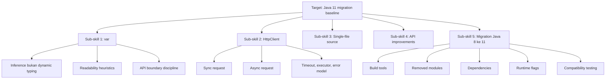
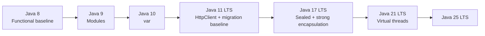
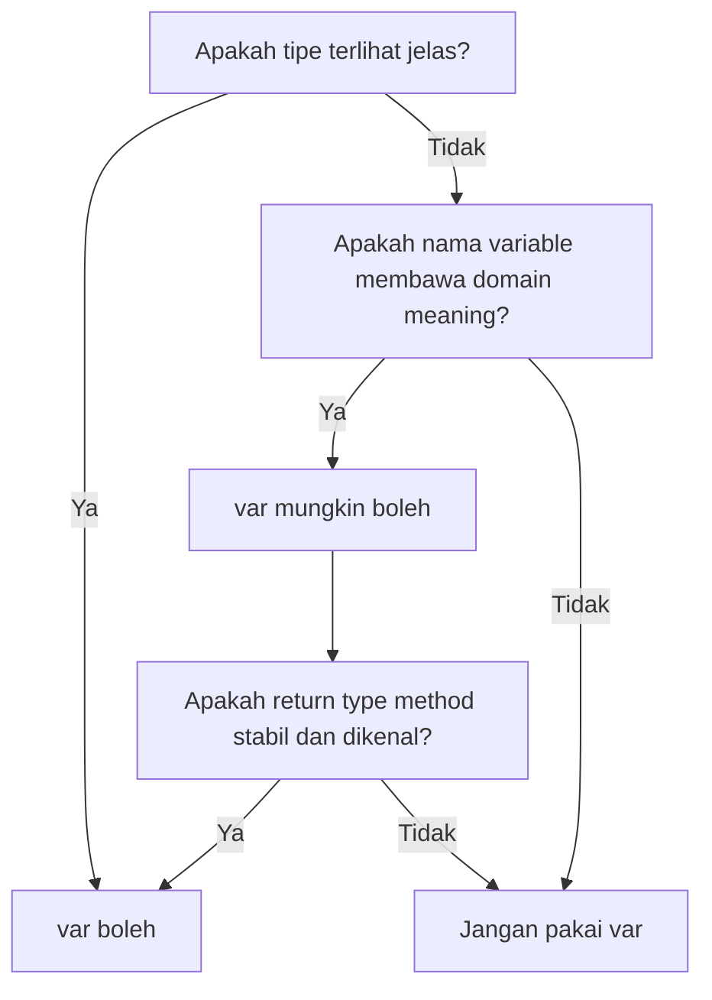
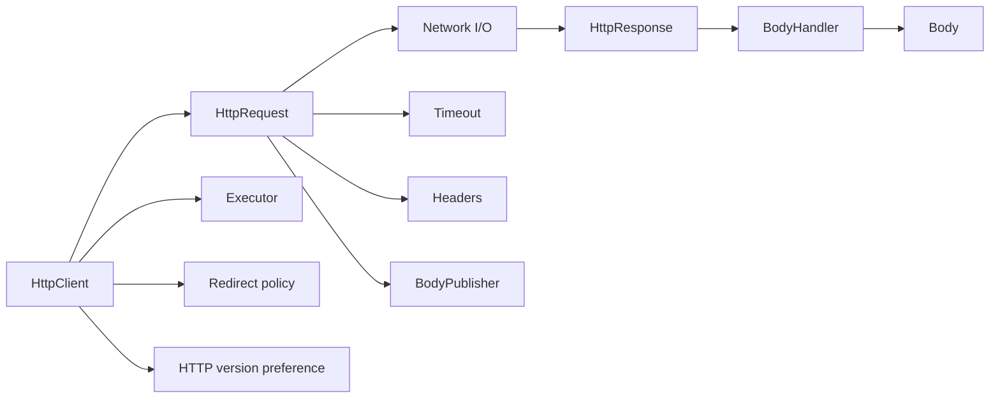
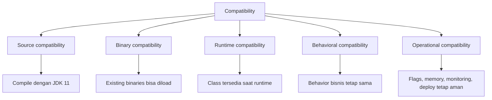

# Part 013 — Java 10 dan 11 LTS: `var`, HttpClient, Single-File Source, dan Migration Baseline

> **Tujuan part ini:** memahami Java 10 dan Java 11 bukan sebagai daftar fitur kecil, tetapi sebagai titik transisi dari Java 8-era application menuju Java modern yang lebih eksplisit, ringan, scriptable, dan siap dimigrasikan ke LTS berikutnya.

Java 8 adalah fondasi besar: lambda, stream, default methods, `Optional`, `java.time`, dan `CompletableFuture`.

Java 9 memperkenalkan modularitas platform.

Java 10 dan Java 11 menggeser pengalaman developer dan baseline enterprise:

- Java 10 membawa `var` untuk local variable type inference.
- Java 11 menjadi LTS penting setelah Java 8.
- Java 11 menstandarkan HTTP Client baru.
- Java 11 bisa menjalankan single-file source program.
- Java 11 menghapus Java EE dan CORBA modules dari JDK.
- Java 11 menjadi migration checkpoint pertama yang realistis untuk banyak sistem Java 8.

Dalam seri ini, Java 10/11 diperlakukan sebagai **modernization baseline**, bukan sekadar versi di antara Java 8 dan Java 17.

---

## 1. Posisi dalam Framework Kaufman

Framework Kaufman meminta kita menghindari belajar terlalu luas sebelum bisa praktik. Untuk Java 10/11, target performanya spesifik:

> Kamu bisa membaca codebase Java 8, memodernisasi sebagian ke Java 11 secara aman, menggunakan `var` tanpa mengorbankan readability, memakai `HttpClient` bawaan JDK, menjalankan utility single-file, dan membuat migration checklist Java 8 ke 11 yang bisa dipertanggungjawabkan.



Prinsip praktik 20 jam untuk part ini:

1. Ambil satu project Java 8 kecil.
2. Jalankan di JDK 11 tanpa mengubah behavior.
3. Perbaiki build dan dependency yang gagal.
4. Refactor lokal dengan `var` hanya jika meningkatkan clarity.
5. Ganti satu penggunaan HTTP client eksternal sederhana dengan `java.net.http.HttpClient` jika realistis.
6. Tulis migration notes: apa yang berubah, apa yang tidak boleh diubah, dan risiko apa yang masih terbuka.

---

## 2. Mental Model Java 10/11

Java 10 dan Java 11 tidak mengubah Java menjadi bahasa baru. Mereka membuat Java lebih nyaman dan lebih siap untuk lifecycle rilis modern.



Cara berpikir yang benar:

- Java 10/11 bukan tujuan akhir.
- Java 11 adalah batu loncatan dari Java 8 ke Java 17/21/25.
- Tujuan utama Java 11 migration adalah membuat codebase keluar dari era Java 8 tanpa memecahkan runtime behavior.
- Jangan melakukan migration besar dan refactor besar di commit yang sama.

---

## 3. Java 10: Local Variable Type Inference dengan `var`

JEP 286 memperkenalkan local variable type inference. Artinya, compiler bisa menyimpulkan tipe local variable dari initializer.

Sebelum Java 10:

```java
Map<String, List<OrderLine>> linesByOrderId = new HashMap<>();
```

Dengan `var`:

```java
var linesByOrderId = new HashMap<String, List<OrderLine>>();
```

Atau:

```java
var path = Path.of("orders.csv");
var lines = Files.readAllLines(path);
```

Hal penting:

> `var` bukan dynamic typing. Tipe tetap statis, disimpulkan saat compile-time, dan tidak berubah setelah variable dideklarasikan.

Contoh:

```java
var name = "Ada";
// name = 42; // compile error
```

Compiler menyimpulkan `name` sebagai `String`.

---

## 4. `var` Bukan Keyword Biasa

`var` adalah reserved type name, bukan keyword universal seperti `class` atau `public`. Konsekuensinya, dalam konteks tertentu nama `var` lama masih punya aturan kompatibilitas, tetapi sebagai gaya penulisan modern kamu sebaiknya tidak memakai `var` sebagai nama class, method, atau variable.

Yang penting secara praktis:

```java
var user = userRepository.findById(id);
```

Boleh.

```java
var count;
count = 10;
```

Tidak boleh, karena tidak ada initializer.

```java
var value = null;
```

Tidak boleh, karena compiler tidak bisa menyimpulkan tipe yang berguna dari `null` saja.

```java
private var name = "Ada";
```

Tidak boleh, karena `var` hanya untuk local variable, bukan field.

```java
void register(var user) {
}
```

Tidak boleh untuk method parameter biasa.

---

## 5. `var` Membaca dari Kanan ke Kiri

Tanpa `var`, deklarasi sering dibaca dari kiri ke kanan:

```java
Customer customer = customerRepository.findById(id);
```

Dengan `var`, pembaca harus mengambil tipe dari expression di kanan:

```java
var customer = customerRepository.findById(id);
```

Itu bisa bagus jika expression kanan jelas.

Bagus:

```java
var customer = new Customer("C-001", "Ada");
var timeout = Duration.ofSeconds(3);
var createdAt = Instant.now(clock);
var ordersByCustomerId = new HashMap<CustomerId, List<Order>>();
```

Kurang bagus:

```java
var result = service.process(input);
var data = mapper.map(raw);
var value = repository.get(id);
```

Masalahnya bukan `var`. Masalahnya nama variable dan nama method tidak memberi semantic signal yang cukup.

Lebih baik:

```java
var decision = enforcementDecisionService.evaluate(caseFile);
var customerSummary = customerMapper.toSummary(customer);
var activeSubscription = subscriptionRepository.findActiveByCustomerId(customerId);
```

Mental model:



---

## 6. Heuristik Pemakaian `var`

Gunakan `var` ketika:

1. Initializer sudah menunjukkan tipe.

```java
var request = new CreateCaseRequest(caseId, reporterId);
```

2. Tipe eksplisit terlalu panjang dan tidak menambah informasi.

```java
var groupedViolations = new HashMap<RegulationId, List<Violation>>();
```

3. Variable name lebih penting daripada tipe teknis.

```java
var overdueCases = caseRepository.findOverdueCases(now);
```

4. Dalam try-with-resources.

```java
try (var reader = Files.newBufferedReader(path)) {
    return reader.lines().toList();
}
```

5. Dalam loop dengan tipe yang jelas.

```java
for (var order : orders) {
    total = total.add(order.total());
}
```

Hindari `var` ketika:

1. Initializer tidak jelas.

```java
var response = client.send(request, handler);
```

Bisa jadi jelas dalam konteks kecil, tetapi sering lebih baik:

```java
HttpResponse<String> response = client.send(request, BodyHandlers.ofString());
```

2. Literal membuat tipe yang tidak kamu maksud.

```java
var amount = 10;      // int
var rate = 0.1;       // double
var id = 123456789L;  // long
```

3. Tipe interface penting sebagai contract.

```java
List<Order> orders = new ArrayList<>();
```

Kadang lebih baik daripada:

```java
var orders = new ArrayList<Order>();
```

Karena pada contoh pertama, variable dikontrak sebagai `List`, bukan `ArrayList`.

4. Kamu sedang menulis sample code pembelajaran yang butuh memperlihatkan tipe.

5. Return type method terlalu generik.

```java
var payload = objectMapper.readValue(json, Map.class);
```

Lebih baik gunakan type reference atau DTO eksplisit.

---

## 7. `var` dan API Boundary

`var` tidak boleh mengubah API publik. Ia hanya muncul di local implementation detail.

Tidak bisa:

```java
public var findCustomer(CustomerId id) {
    return repository.findById(id);
}
```

Harus eksplisit:

```java
public Optional<Customer> findCustomer(CustomerId id) {
    return repository.findById(id);
}
```

Prinsip:

> Public API harus eksplisit. Implementation detail boleh dibantu inference.

Ini cocok dengan engineering maturity:

- API boundary harus stabil.
- Local computation boleh ringkas.
- Caller tidak boleh dipaksa menebak semantic type.

---

## 8. Java 11: `var` pada Lambda Parameter

Java 11 menambahkan local-variable syntax untuk lambda parameters melalui JEP 323.

Sebelum Java 11:

```java
list.stream()
    .map((String value) -> value.strip())
    .toList();
```

Atau:

```java
list.stream()
    .map(value -> value.strip())
    .toList();
```

Dengan `var`:

```java
list.stream()
    .map((var value) -> value.strip())
    .toList();
```

Sekilas terlihat tidak berguna. Kegunaan utamanya adalah ketika kamu butuh annotation pada parameter lambda.

Contoh:

```java
orders.stream()
    .map((@Nonnull var order) -> order.id())
    .toList();
```

Aturan penting:

Jika satu parameter lambda memakai `var`, semua parameter harus memakai `var`.

```java
// Tidak boleh
// (var left, right) -> left.compareTo(right)

// Boleh
(var left, var right) -> left.compareTo(right)
```

Dalam praktik production, fitur ini jarang diperlukan kecuali kamu memakai annotation-driven tooling.

---

## 9. Java 11 LTS sebagai Migration Baseline

Java 11 adalah LTS pertama setelah Java 8. Banyak organisasi memilih rute:

```text
Java 8 -> Java 11 -> Java 17 -> Java 21/25
```

Alasannya:

- Gap Java 8 ke 17/21 bisa terlalu besar untuk legacy codebase.
- Java 11 memaksa dependency lama diperbarui, terutama yang bergantung pada Java EE/CORBA modules.
- Java 11 masih cukup dekat secara mental dengan Java 8, sehingga cocok sebagai checkpoint.

Tetapi jangan salah:

> Migration ke Java 11 bukan hanya mengganti JDK di CI.

Ia menyentuh:

- build tool,
- plugin,
- dependency,
- runtime flags,
- reflective access,
- removed modules,
- container image,
- test behavior,
- TLS/security defaults,
- garbage collector behavior,
- deployment baseline.

---

## 10. Java 11 HTTP Client

Java 11 menstandarkan HTTP Client API di package:

```java
java.net.http
```

Komponen utamanya:

- `HttpClient`
- `HttpRequest`
- `HttpResponse`
- `HttpRequest.BodyPublishers`
- `HttpResponse.BodyHandlers`
- `WebSocket`

API ini mendukung:

- HTTP/1.1
- HTTP/2
- synchronous request
- asynchronous request dengan `CompletableFuture`
- builder pattern
- body handler/publisher abstraction

Minimal synchronous GET:

```java
import java.net.URI;
import java.net.http.HttpClient;
import java.net.http.HttpRequest;
import java.net.http.HttpResponse;

public class FetchExample {
    public static void main(String[] args) throws Exception {
        var client = HttpClient.newHttpClient();

        var request = HttpRequest.newBuilder()
            .uri(URI.create("https://example.com"))
            .GET()
            .build();

        var response = client.send(request, HttpResponse.BodyHandlers.ofString());

        System.out.println(response.statusCode());
        System.out.println(response.body());
    }
}
```

Perhatikan: `send` adalah blocking call.

---

## 11. HTTP Client Mental Model



`HttpClient` adalah reusable component.

Jangan membuat client baru untuk setiap request kecuali ada alasan kuat. Biasanya buat satu client per konfigurasi:

```java
var client = HttpClient.newBuilder()
    .connectTimeout(Duration.ofSeconds(2))
    .followRedirects(HttpClient.Redirect.NORMAL)
    .version(HttpClient.Version.HTTP_2)
    .build();
```

`HttpRequest` bersifat immutable setelah `build()`.

```java
var request = HttpRequest.newBuilder()
    .uri(URI.create("https://api.example.com/cases"))
    .timeout(Duration.ofSeconds(5))
    .header("Accept", "application/json")
    .GET()
    .build();
```

`HttpResponse<T>` membawa:

- status code,
- headers,
- body,
- URI final,
- protocol version,
- request asal.

---

## 12. Synchronous POST dengan JSON

```java
var json = """
    {
      "caseId": "CASE-001",
      "reason": "missing-document"
    }
    """;

var request = HttpRequest.newBuilder()
    .uri(URI.create("https://api.example.com/enforcement/cases"))
    .timeout(Duration.ofSeconds(5))
    .header("Content-Type", "application/json")
    .header("Accept", "application/json")
    .POST(HttpRequest.BodyPublishers.ofString(json))
    .build();

var response = client.send(request, HttpResponse.BodyHandlers.ofString());

if (response.statusCode() / 100 != 2) {
    throw new ExternalServiceException(
        "Case API returned " + response.statusCode() + ": " + response.body()
    );
}
```

Untuk Java 11, text block belum tersedia. Contoh di atas memakai text block yang final di Java 15. Jika menjalankan di Java 11, tulis JSON sebagai string biasa atau resource file.

Versi Java 11-compatible:

```java
var json = "{\n" +
    "  \"caseId\": \"CASE-001\",\n" +
    "  \"reason\": \"missing-document\"\n" +
    "}";
```

---

## 13. Asynchronous HTTP Request

`sendAsync` mengembalikan `CompletableFuture<HttpResponse<T>>`.

```java
var request = HttpRequest.newBuilder()
    .uri(URI.create("https://api.example.com/health"))
    .timeout(Duration.ofSeconds(2))
    .GET()
    .build();

CompletableFuture<HttpResponse<String>> future = client.sendAsync(
    request,
    HttpResponse.BodyHandlers.ofString()
);

future.thenApply(HttpResponse::body)
    .thenAccept(System.out::println)
    .exceptionally(error -> {
        error.printStackTrace();
        return null;
    });
```

Async bukan berarti gratis.

Yang harus dipikirkan:

- executor apa yang dipakai,
- timeout ada di mana,
- cancellation dipropagasikan atau tidak,
- error mapping seperti apa,
- response body dibaca penuh atau streaming,
- jumlah concurrent request dibatasi atau tidak.

---

## 14. Executor Strategy untuk HTTP Client

Jika tidak mengatur executor secara eksplisit, implementasi akan memakai executor default internal. Untuk service serius, lebih baik kamu memahami model eksekusinya dan mengatur executor jika perlu.

```java
var executor = Executors.newFixedThreadPool(32);

var client = HttpClient.newBuilder()
    .executor(executor)
    .connectTimeout(Duration.ofSeconds(2))
    .build();
```

Tetapi jangan asal fixed pool.

Pertanyaan desain:

- Apakah request mostly I/O-bound?
- Berapa latency dependency downstream?
- Berapa concurrency maksimum yang diizinkan upstream/downstream?
- Apakah pool ini shared dengan workload lain?
- Apa yang terjadi saat queue penuh?
- Bagaimana shutdown dilakukan?

Contoh wrapper sederhana:

```java
public final class CaseApiClient implements AutoCloseable {
    private final ExecutorService executor;
    private final HttpClient client;
    private final URI baseUri;

    public CaseApiClient(URI baseUri, int threads) {
        this.executor = Executors.newFixedThreadPool(threads);
        this.client = HttpClient.newBuilder()
            .executor(executor)
            .connectTimeout(Duration.ofSeconds(2))
            .build();
        this.baseUri = baseUri;
    }

    public CompletableFuture<String> fetchCase(String caseId) {
        var request = HttpRequest.newBuilder()
            .uri(baseUri.resolve("/cases/" + caseId))
            .timeout(Duration.ofSeconds(3))
            .GET()
            .build();

        return client.sendAsync(request, HttpResponse.BodyHandlers.ofString())
            .thenApply(this::requireSuccess)
            .thenApply(HttpResponse::body);
    }

    private <T> HttpResponse<T> requireSuccess(HttpResponse<T> response) {
        if (response.statusCode() / 100 != 2) {
            throw new CompletionException(
                new ExternalServiceException("Unexpected status: " + response.statusCode())
            );
        }
        return response;
    }

    @Override
    public void close() {
        executor.shutdown();
    }
}
```

Catatan: `HttpClient` sendiri tidak `AutoCloseable` di Java 11. Jika kamu menyediakan executor sendiri, kamulah yang bertanggung jawab atas lifecycle executor tersebut.

---

## 15. Timeout Bukan Satu Hal

Dalam HTTP call, timeout minimal terdiri dari:

1. connect timeout,
2. request timeout,
3. read/body processing timeout,
4. business deadline,
5. retry budget.

Contoh:

```java
var client = HttpClient.newBuilder()
    .connectTimeout(Duration.ofSeconds(1))
    .build();

var request = HttpRequest.newBuilder()
    .uri(URI.create("https://api.example.com/cases/CASE-001"))
    .timeout(Duration.ofSeconds(3))
    .GET()
    .build();
```

Anti-pattern:

```java
client.send(request, BodyHandlers.ofString()); // no visible timeout policy
```

Lebih buruk:

```java
future.get(); // no timeout
```

Lebih aman:

```java
var response = client.sendAsync(request, BodyHandlers.ofString())
    .orTimeout(3, TimeUnit.SECONDS)
    .join();
```

Tetapi ingat: `orTimeout` mengatur completion dari `CompletableFuture`. Kamu tetap perlu memahami apakah underlying network operation benar-benar berhenti sesuai ekspektasi.

---

## 16. Error Model untuk HTTP Client

HTTP error bukan Java exception secara otomatis. Status `404` atau `500` tetap menghasilkan `HttpResponse` jika request berhasil mencapai server dan response diterima.

```java
var response = client.send(request, BodyHandlers.ofString());

if (response.statusCode() == 404) {
    return Optional.empty();
}

if (response.statusCode() / 100 != 2) {
    throw new ExternalServiceException("Unexpected status " + response.statusCode());
}

return Optional.of(parseCustomer(response.body()));
```

Bedakan:

| Kondisi | Representasi |
|---|---|
| DNS failure | exception |
| connection refused | exception |
| timeout | exception |
| HTTP 400 | response status |
| HTTP 401/403 | response status, security decision |
| HTTP 404 | bisa domain result atau error |
| HTTP 429 | retry/backoff concern |
| HTTP 500 | downstream failure |

Untuk production, jangan sebarkan status code mentah ke seluruh domain. Buat translation layer.

```java
sealed interface CaseApiResult permits CaseFound, CaseNotFound, CaseApiUnavailable {}
record CaseFound(CaseSummary summary) implements CaseApiResult {}
record CaseNotFound(String caseId) implements CaseApiResult {}
record CaseApiUnavailable(String reason) implements CaseApiResult {}
```

Jika masih Java 11, sealed/record belum tersedia; modelkan dengan class/interface biasa atau gunakan ini sebagai target refactor saat naik ke Java 17+.

---

## 17. Single-File Source-Code Programs

Java 11 melalui JEP 330 memungkinkan menjalankan satu file `.java` langsung dengan launcher `java`, tanpa eksplisit menjalankan `javac` terlebih dahulu.

Contoh file `Hello.java`:

```java
public class Hello {
    public static void main(String[] args) {
        System.out.println("Hello from single-file Java");
    }
}
```

Jalankan:

```bash
java Hello.java
```

Ini berguna untuk:

- utility kecil,
- demo,
- script operasional sederhana,
- reproducer bug,
- eksperimen API JDK,
- onboarding exercise.

Ini bukan pengganti build tool untuk aplikasi besar.

---

## 18. Single-File Source untuk Reproducer

Saat debugging bug production, reproducer kecil sering lebih berharga daripada stack trace panjang.

Contoh `ReproduceDateBug.java`:

```java
import java.time.*;

public class ReproduceDateBug {
    public static void main(String[] args) {
        var zone = ZoneId.of("Asia/Jakarta");
        var local = LocalDateTime.of(2026, 3, 1, 0, 0);
        var instant = local.atZone(zone).toInstant();

        System.out.println(local);
        System.out.println(instant);
    }
}
```

Jalankan:

```bash
java ReproduceDateBug.java
```

Kaufman angle:

> Single-file source mengurangi friction praktik. Kamu bisa menguji satu konsep tanpa membuat project Maven/Gradle.

Gunakan untuk latihan harian.

---

## 19. String API Improvements di Java 11

Java 11 menambahkan beberapa method string yang sering membuat code lebih ekspresif.

### 19.1 `isBlank()`

```java
"   ".isBlank(); // true
"".isBlank();    // true
"x".isBlank();   // false
```

Berbeda dari `isEmpty()`:

```java
"   ".isEmpty(); // false
```

Use case:

```java
if (comment == null || comment.isBlank()) {
    throw new IllegalArgumentException("comment must not be blank");
}
```

### 19.2 `strip()`, `stripLeading()`, `stripTrailing()`

`strip()` Unicode-aware, berbeda dari `trim()` yang historis dan lebih terbatas.

```java
var normalized = input.strip();
```

### 19.3 `lines()`

```java
var count = text.lines()
    .filter(line -> !line.isBlank())
    .count();
```

### 19.4 `repeat(int)`

```java
var separator = "-".repeat(80);
```

---

## 20. Files API Improvements

Java 11 menambahkan convenience methods:

```java
String content = Files.readString(path);
Files.writeString(path, content);
```

Sebelumnya, code biasanya lebih verbose:

```java
String content = new String(Files.readAllBytes(path), StandardCharsets.UTF_8);
```

Tetap perhatikan:

- file besar jangan selalu dibaca penuh ke memory,
- charset harus dipikirkan,
- exception handling harus sesuai boundary,
- path harus divalidasi jika berasal dari input user.

Contoh utility kecil:

```java
static List<String> readNonBlankLines(Path path) throws IOException {
    return Files.readString(path).lines()
        .map(String::strip)
        .filter(line -> !line.isBlank())
        .toList(); // toList() baru di Java 16; untuk Java 11 gunakan collect(Collectors.toList())
}
```

Java 11-compatible:

```java
static List<String> readNonBlankLines(Path path) throws IOException {
    return Files.readString(path).lines()
        .map(String::strip)
        .filter(line -> !line.isBlank())
        .collect(Collectors.toList());
}
```

---

## 21. Collection Copy Factories

Java 10 menambahkan `copyOf` pada collection types:

```java
var immutableList = List.copyOf(input);
var immutableSet = Set.copyOf(input);
var immutableMap = Map.copyOf(inputMap);
```

Ini membuat defensive copy lebih jelas.

Contoh:

```java
public final class CaseSnapshot {
    private final List<Violation> violations;

    public CaseSnapshot(List<Violation> violations) {
        this.violations = List.copyOf(violations);
    }

    public List<Violation> violations() {
        return violations;
    }
}
```

Catatan:

- Hasilnya unmodifiable.
- Tidak menerima `null` element.
- Jika element mutable, object di dalam list tetap bisa berubah.

Unmodifiable collection bukan deep immutable object graph.

---

## 22. `Collectors.toUnmodifiableList()`

Java 10 juga menambahkan collector unmodifiable:

```java
var activeCases = cases.stream()
    .filter(Case::isActive)
    .collect(Collectors.toUnmodifiableList());
```

Bedakan dengan Java 16 `Stream.toList()`.

Di Java 11:

```java
.collect(Collectors.toUnmodifiableList())
```

Di Java 16+:

```java
.toList()
```

Tetapi semantics dan implementation detail tidak harus kamu asumsikan identik untuk semua kebutuhan. Jika kamu butuh jelas “unmodifiable collector”, tulis eksplisit.

---

## 23. Removed Java EE dan CORBA Modules di Java 11

Java 11 menghapus Java EE dan CORBA modules yang sebelumnya deprecated for removal di Java 9.

Modul yang terdampak termasuk:

- `java.xml.ws` / JAX-WS
- `java.xml.bind` / JAXB
- `java.activation` / JAF
- `java.xml.ws.annotation`
- `java.corba`
- `java.transaction`

Gejala migration umum:

```text
package javax.xml.bind does not exist
```

atau:

```text
ClassNotFoundException: javax.xml.bind.JAXBContext
```

Solusi bukan “balik ke Java 8”. Solusinya:

1. Identifikasi API yang dipakai.
2. Tambahkan dependency eksplisit yang sesuai.
3. Pastikan namespace dan versi cocok.
4. Jalankan test integrasi.
5. Dokumentasikan dependency baru sebagai bagian migration.

Contoh Maven untuk JAXB era `javax`:

```xml
<dependency>
    <groupId>jakarta.xml.bind</groupId>
    <artifactId>jakarta.xml.bind-api</artifactId>
    <version>2.3.3</version>
</dependency>
<dependency>
    <groupId>org.glassfish.jaxb</groupId>
    <artifactId>jaxb-runtime</artifactId>
    <version>2.3.3</version>
</dependency>
```

Untuk ekosistem modern `jakarta.*`, versi dan package bisa berubah. Jangan upgrade namespace bersamaan dengan migration JDK kecuali memang sudah direncanakan.

---

## 24. Illegal Reflective Access: Warning Hari Ini, Failure Besok

Saat berjalan di Java 9–15, banyak aplikasi Java 8-era menampilkan warning seperti:

```text
WARNING: Illegal reflective access by ...
```

Ini sering berasal dari library yang mengakses internal JDK API atau private member lewat reflection.

Jangan abaikan.

Warning tersebut adalah sinyal:

- dependency terlalu lama,
- framework memakai internal JDK API,
- module encapsulation akan makin ketat di versi berikutnya,
- migration ke Java 17+ berisiko gagal.

Langkah:

```bash
jdeps --jdk-internals app.jar
```

Kemudian:

- upgrade dependency,
- hapus penggunaan internal API,
- gunakan API resmi,
- jika terpaksa, dokumentasikan `--add-opens` sebagai temporary workaround.

Temporary workaround bukan architecture decision final.

---

## 25. Build Tool Compatibility

Migration Java 8 ke 11 sering gagal bukan karena source code, tetapi karena build tool.

Periksa:

- Maven version,
- Gradle version,
- compiler plugin,
- surefire/failsafe plugin,
- annotation processor,
- code generation plugin,
- bytecode manipulation library,
- test framework,
- container plugin,
- shading plugin.

Maven compiler plugin contoh:

```xml
<plugin>
    <groupId>org.apache.maven.plugins</groupId>
    <artifactId>maven-compiler-plugin</artifactId>
    <version>3.13.0</version>
    <configuration>
        <release>11</release>
    </configuration>
</plugin>
```

`--release 11` lebih aman daripada hanya `source` dan `target`, karena compiler juga membatasi API sesuai target platform.

Gradle contoh:

```kotlin
java {
    toolchain {
        languageVersion.set(JavaLanguageVersion.of(11))
    }
}
```

---

## 26. Source Compatibility vs Runtime Compatibility

Code bisa compile tetapi tetap gagal runtime.

Contoh penyebab:

- dependency runtime memakai class internal JDK,
- JAXB hilang dari JDK,
- reflective access makin ketat,
- TLS handshake berubah karena security defaults,
- GC flag tidak valid,
- container memory detection berubah,
- logging binding berubah,
- annotation processor menghasilkan bytecode bermasalah,
- test memakai urutan reflection yang tidak dijamin.

Pisahkan compatibility menjadi:



Migration yang matang menguji semuanya.

---

## 27. Migration Strategy Java 8 ke 11

Gunakan strategi bertahap.

### Step 1 — Inventory

Kumpulkan:

- JDK saat ini,
- build tool version,
- dependencies,
- plugins,
- annotation processors,
- runtime flags,
- container base image,
- test coverage,
- integration endpoints,
- generated code,
- reflection usage,
- serialization usage,
- JAXB/JAX-WS/CORBA usage.

### Step 2 — Build dengan JDK 11, Target Tetap 8 Jika Perlu

Untuk transisi awal, kamu bisa menjalankan build memakai JDK 11 tetapi masih menghasilkan bytecode Java 8.

Maven:

```xml
<release>8</release>
```

Ini membantu memisahkan masalah build environment dari masalah language upgrade.

### Step 3 — Jalankan Test Suite

Minimal:

```bash
mvn clean test
mvn verify
```

Atau Gradle:

```bash
./gradlew clean test check
```

### Step 4 — Perbaiki Dependency dan Removed Modules

Jangan rewrite domain logic dulu.

Fokus:

- dependency compile/runtime,
- plugin compatibility,
- JAXB/JAX-WS,
- reflection warning,
- test infrastructure.

### Step 5 — Ubah Release Target ke 11

Setelah build/test stabil:

```xml
<release>11</release>
```

### Step 6 — Jalankan Integration dan Smoke Test

Wajib untuk sistem service:

- database integration,
- HTTP calls,
- message broker,
- scheduled jobs,
- TLS endpoints,
- serialization/deserialization,
- startup/shutdown,
- metrics/logging/tracing.

### Step 7 — Modernisasi Secara Selektif

Baru gunakan:

- `var`,
- `HttpClient`,
- `Files.readString/writeString`,
- `String.isBlank/strip/lines/repeat`,
- collection copy factories.

Jangan melakukan semua refactor sekaligus.

---

## 28. Migration Commit Discipline

Buruk:

```text
commit: migrate to Java 11 and refactor services and update dependencies and rewrite HTTP clients
```

Bagus:

```text
commit 1: add JDK 11 toolchain to CI
commit 2: update Maven/Gradle plugins for JDK 11 compatibility
commit 3: add explicit JAXB dependencies removed from JDK 11
commit 4: run test suite on JDK 11 while release target remains 8
commit 5: change compiler release target to 11
commit 6: replace small internal utility with Java 11 HttpClient
commit 7: apply var only to local variables where type is obvious
```

Tujuan migration bukan terlihat modern. Tujuannya mengurangi risiko.

---

## 29. Java 11 Adoption Decision Matrix

| Pertanyaan | Jika Ya | Jika Tidak |
|---|---|---|
| Masih Java 8? | Java 11 adalah checkpoint penting | Bisa langsung evaluasi 17/21/25 |
| Banyak dependency legacy? | Migrasi bertahap ke 11 lebih aman | Bisa lompat ke LTS lebih baru |
| Menggunakan JAXB/JAX-WS? | Siapkan dependency eksplisit | Risiko removed modules lebih rendah |
| Banyak reflection/internal API? | Jalankan `jdeps` dan upgrade library | Migration cenderung lebih mudah |
| CI sudah support multi-JDK? | Tambah matrix test | Perbaiki pipeline dulu |
| Perlu fitur Java 17+? | Jangan berhenti terlalu lama di 11 | 11 cukup sebagai baseline sementara |

---

## 30. Latihan 20 Jam untuk Part Ini

### Latihan 1 — `var` Refactoring Audit

Ambil 30 deklarasi local variable dari project lama.

Klasifikasikan:

- tetap eksplisit,
- ubah ke `var`,
- rename variable agar `var` masuk akal,
- jangan sentuh.

Output:

```text
Variable: Customer customer = repository.findById(id).orElseThrow()
Decision: keep explicit / use var
Reason: ...
```

### Latihan 2 — HTTP Client Wrapper

Buat wrapper untuk endpoint palsu:

- GET `/cases/{id}`
- POST `/cases`
- timeout,
- error mapping,
- async method,
- test dengan mock server.

### Latihan 3 — Single-File Reproducer

Tulis 3 file single-source:

- reproducer timezone bug,
- reproducer `Optional` misuse,
- reproducer HTTP timeout.

Jalankan langsung:

```bash
java ReproduceSomething.java
```

### Latihan 4 — Java 8 ke 11 Migration Dry Run

Pada project kecil:

1. jalankan test dengan JDK 8,
2. jalankan test dengan JDK 11,
3. catat error,
4. update plugin/dependency,
5. buat migration notes.

---

## 31. Checklist Praktis

Sebelum mengklaim “sudah paham Java 10/11”, pastikan kamu bisa:

- [ ] Menjelaskan `var` sebagai compile-time inference, bukan dynamic typing.
- [ ] Menentukan kapan `var` meningkatkan readability.
- [ ] Menentukan kapan `var` menyembunyikan intent.
- [ ] Memakai `var` dalam loop dan try-with-resources.
- [ ] Memahami `var` pada lambda parameter Java 11.
- [ ] Membuat `HttpClient` reusable.
- [ ] Mengirim sync dan async request.
- [ ] Menangani status code dan exception secara berbeda.
- [ ] Mengatur timeout HTTP call.
- [ ] Menjalankan single-file Java source.
- [ ] Memakai String API Java 11 dengan benar.
- [ ] Memakai `Files.readString/writeString` secara proporsional.
- [ ] Memahami removed Java EE/CORBA modules.
- [ ] Membuat checklist migration Java 8 ke 11.
- [ ] Menjalankan `jdeps` untuk internal API.
- [ ] Memisahkan migration commit dari refactor commit.

---

## 32. Common Anti-Patterns

### 32.1 `var` Everywhere

```java
var a = x.get();
var b = y.process(a);
var c = z.convert(b);
```

Ini bukan modern Java. Ini unreadable Java.

### 32.2 Migration Sekaligus Refactor Besar

Migration harus mengurangi variabel bebas. Jika kamu mengubah JDK, dependency, framework, domain logic, dan architecture sekaligus, debugging menjadi mahal.

### 32.3 HTTP Client Tanpa Timeout

```java
HttpClient.newHttpClient().send(request, BodyHandlers.ofString());
```

Untuk production, timeout bukan optional.

### 32.4 Treat HTTP 500 as Exception Otomatis

Java HTTP Client memberi `HttpResponse`. Kamu harus memutuskan mapping error sendiri.

### 32.5 Mengandalkan Java EE Modules dari JDK

Di Java 11, dependency harus eksplisit.

---

## 33. Mental Model yang Harus Dibawa ke Part Berikutnya

Java 10/11 mengajarkan tiga pola penting:

1. **Readability is a design constraint**  
   `var` mempercepat penulisan hanya jika semantic signal tetap kuat.

2. **JDK semakin lengkap sebagai platform**  
   `HttpClient`, `Files`, String API, dan single-file source mengurangi kebutuhan utility eksternal untuk kasus umum.

3. **Migration adalah engineering process**  
   Upgrade JDK bukan dependency bump biasa. Ia menyentuh source, binary, runtime, behavior, dan operasi.

Part berikutnya membahas Java 12–16: switch expressions, text blocks, records, pattern matching, dan bagaimana Java mulai bergerak ke data-oriented programming.

---

## 34. Referensi

- JEP 286 — Local-Variable Type Inference: https://openjdk.org/jeps/286
- JEP 323 — Local-Variable Syntax for Lambda Parameters: https://openjdk.org/jeps/323
- JEP 321 — HTTP Client: https://openjdk.org/jeps/321
- Java HTTP Client introduction: https://openjdk.org/groups/net/httpclient/intro.html
- JEP 330 — Launch Single-File Source-Code Programs: https://openjdk.org/jeps/330
- JEP 320 — Remove the Java EE and CORBA Modules: https://openjdk.org/jeps/320
- Oracle Java Language Guide — Local Variable Type Inference: https://docs.oracle.com/en/java/javase/25/language/local-variable-type-inference.html
- Java SE 25 API — `java.net.http`: https://docs.oracle.com/en/java/javase/25/docs/api/java.net.http/java/net/http/package-summary.html
