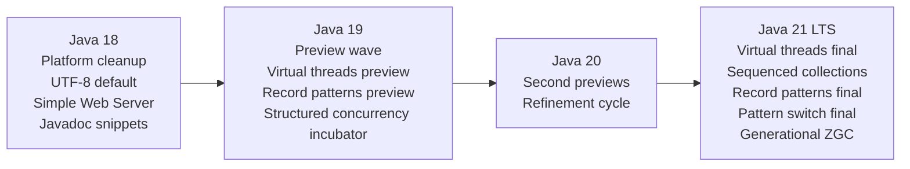
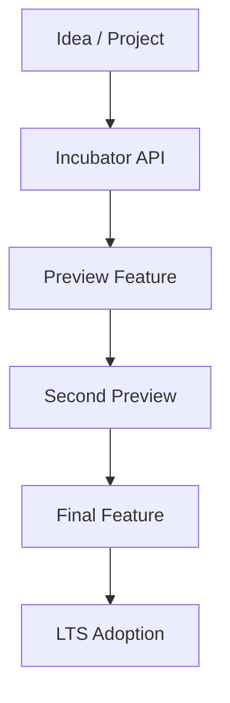
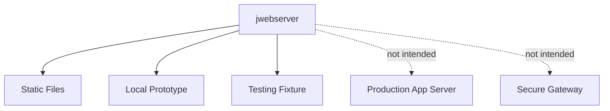
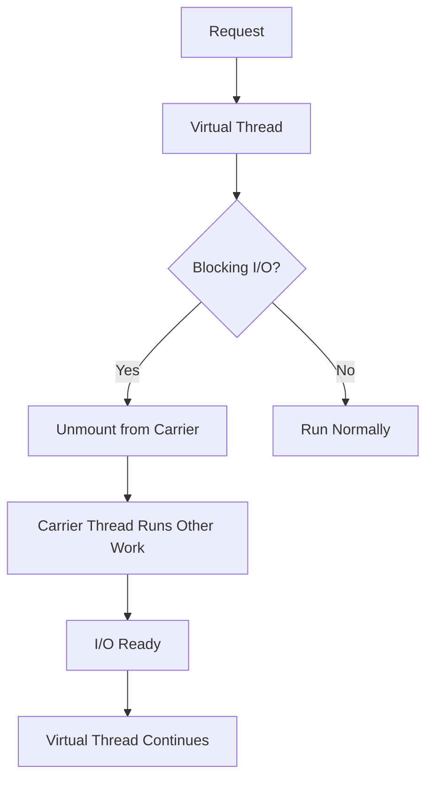
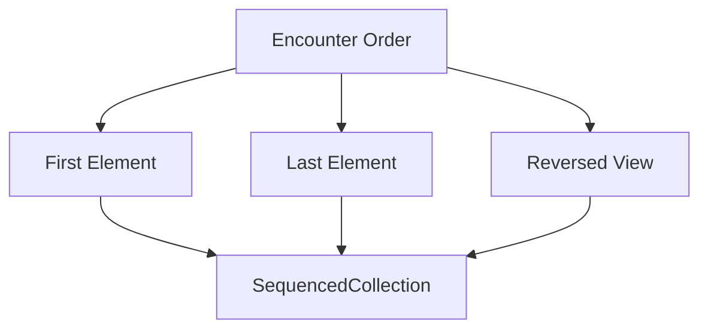
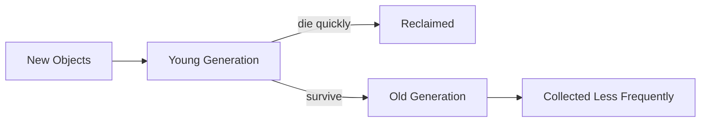
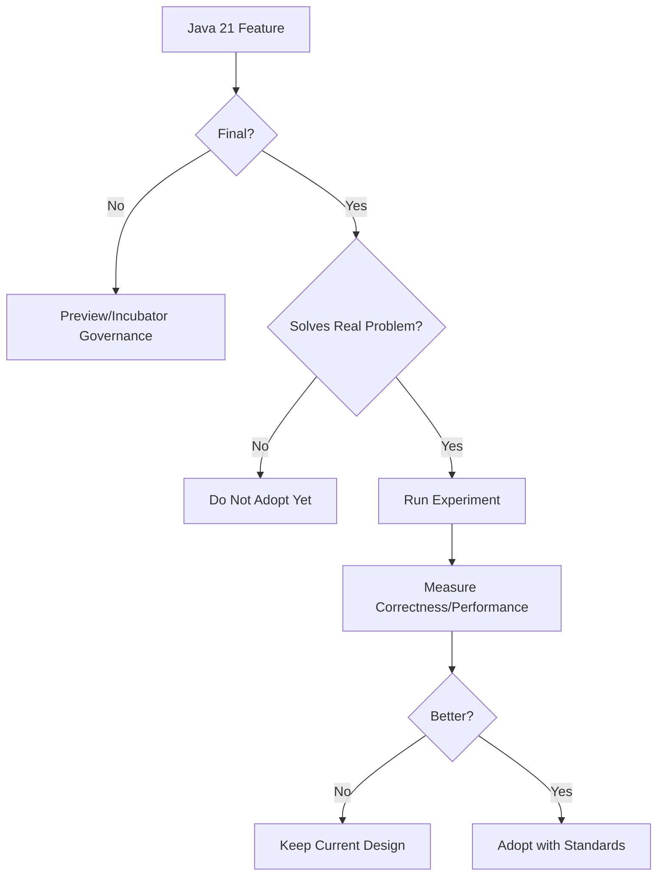

# Part 018 — Java 18 sampai 21: UTF-8 Default, Simple Web Server, Pattern Finalization, dan Java 21 LTS

Part sebelumnya membahas API evolution dan compatibility. Bagian ini masuk ke Java 18 sampai Java 21, fase penting karena Java 21 menjadi anchor LTS modern setelah Java 17.

Java 18, 19, dan 20 bukan sekadar “versi antara”. Tiga versi ini adalah jalur inkubasi dan preview menuju Java 21. Banyak fitur besar Java 21 tidak muncul tiba-tiba; fitur-fitur itu dipreview, diubah, distabilkan, lalu difinalisasi.

Mental modelnya:



Jika Java 17 adalah baseline modern yang konservatif, Java 21 adalah baseline modern yang mengubah cara kita menulis concurrent server-side Java.

---

## 1. Target Pembelajaran

Setelah menyelesaikan part ini, kamu harus mampu:

1. Menjelaskan peran Java 18, 19, dan 20 sebagai jalur menuju Java 21.
2. Memahami dampak UTF-8 by default terhadap aplikasi lama.
3. Memakai `jwebserver` secara tepat untuk prototyping/testing, bukan production server.
4. Memahami manfaat Javadoc snippets untuk dokumentasi API yang bisa diverifikasi lebih baik.
5. Memetakan preview/incubator features menuju final features.
6. Menjelaskan fitur utama Java 21:
   - virtual threads;
   - sequenced collections;
   - record patterns;
   - pattern matching for switch;
   - generational ZGC.
7. Menilai kapan upgrade Java 17 ke Java 21 masuk akal.
8. Membuat checklist migrasi Java 17 ke Java 21.

---

## 2. Kenapa Java 18–21 Harus Dipelajari sebagai Satu Fase

Java sekarang memakai release cadence feature release setiap enam bulan. Artinya fitur besar biasanya melewati siklus:



Tidak semua fitur melalui jalur persis sama, tetapi pola besarnya seperti itu.

Java 18–20 banyak berisi:

- cleanup platform;
- default behavior yang distandarkan;
- tooling kecil tapi berguna;
- preview dan incubator features.

Java 21 kemudian membawa beberapa hasil final yang siap dipakai lebih luas.

Untuk engineer production, ini berarti:

- Jangan hanya membaca “What’s new in Java 21”.
- Pahami proses matangnya fitur.
- Bedakan final feature dari preview/incubator.
- Jangan adopsi preview feature di production tanpa governance.

---

## 3. Java 18 Overview

Java 18 dirilis sebagai feature release setelah Java 17. Fitur yang paling relevan untuk banyak engineer aplikasi:

| Area | Feature | Dampak praktis |
|---|---|---|
| Charset | UTF-8 by default | Aplikasi lebih portable, tapi aplikasi lama yang mengandalkan default charset OS bisa berubah behavior |
| Tooling | Simple Web Server | Server static minimal untuk prototyping/testing |
| Documentation | Javadoc snippets | Contoh code di docs lebih rapi dan bisa di-maintain |
| Lifecycle | Finalization deprecated for removal | Mendorong migrasi dari finalizer ke cleaner/try-with-resources |
| Core reflection | Reimplementation with method handles | Mostly internal, tapi penting untuk platform maintenance |

Fokus kita: fitur yang berdampak pada mental model dan praktik engineering.

---

## 4. JEP 400 — UTF-8 by Default

Sebelum Java 18, default charset bisa bergantung pada operating system, locale, dan konfigurasi runtime. Ini membuat code seperti ini tidak portable:

```java
String text = Files.readString(Path.of("case-notes.txt"));
```

Jika tidak memberikan charset eksplisit, API tertentu memakai default charset. Di satu mesin default-nya UTF-8, di mesin lain bisa berbeda.

Mulai JDK 18, default charset standard Java APIs adalah UTF-8, dengan pengecualian tertentu seperti console I/O.

Dampak positif:

- behavior lebih konsisten lintas OS;
- container Linux, Windows laptop, dan CI lebih seragam;
- bug encoding lebih mudah direproduksi;
- default lebih sesuai dengan modern web/cloud systems.

Namun ini bisa breaking untuk aplikasi lama.

Contoh risiko:

```java
// File lama ditulis dengan Windows-1252
String content = Files.readString(Path.of("legacy-report.txt"));
```

Di Java 17 pada Windows lama, mungkin terbaca sesuai default platform. Di Java 18+, default menjadi UTF-8 dan karakter tertentu bisa rusak.

Engineering rule:

> Untuk data boundary, selalu sebutkan charset secara eksplisit.

Lebih baik:

```java
String content = Files.readString(path, StandardCharsets.UTF_8);
```

Atau untuk file legacy:

```java
String content = Files.readString(path, Charset.forName("windows-1252"));
```

Checklist migration:

- Cari penggunaan `new String(byte[])` tanpa charset.
- Cari `String.getBytes()` tanpa charset.
- Cari `Files.readString(path)` tanpa charset jika membaca file legacy.
- Cari `new FileReader(...)` dan `new FileWriter(...)` lama.
- Cari parser CSV/fixed-width yang mengandalkan default platform.
- Tambahkan fixture encoding untuk data historis.

Contoh test:

```java
@Test
void readsUtf8CaseNotesExplicitly() throws IOException {
    Path path = Path.of("src/test/resources/case-notes-utf8.txt");

    String text = Files.readString(path, StandardCharsets.UTF_8);

    assertThat(text).contains("pelanggaran administratif");
}
```

---

## 5. JEP 408 — Simple Web Server

Java 18 menambahkan command-line tool `jwebserver` untuk menjalankan HTTP file server sederhana.

Contoh:

```bash
jwebserver -p 8080 -d ./public
```

Use case yang masuk akal:

- serve static files saat demo lokal;
- quick test generated documentation;
- inspect output frontend build;
- serve fixture file untuk integration test ringan;
- smoke test HTTP client sederhana.

Bukan untuk:

- production traffic;
- authentication;
- dynamic application server;
- TLS termination;
- reverse proxy;
- high-performance file serving;
- complex routing.

Mental model:



Contoh pemakaian untuk testing HTTP client:

```bash
mkdir -p /tmp/case-fixtures
cat > /tmp/case-fixtures/case-001.json <<JSON
{"id":"CASE-001","status":"SUBMITTED"}
JSON

jwebserver -p 9000 -d /tmp/case-fixtures
```

Client:

```java
HttpClient client = HttpClient.newHttpClient();
HttpRequest request = HttpRequest.newBuilder()
        .uri(URI.create("http://localhost:9000/case-001.json"))
        .GET()
        .build();

HttpResponse<String> response = client.send(request, BodyHandlers.ofString());
```

Untuk integration test serius, Testcontainers/WireMock/MockWebServer biasanya lebih baik. `jwebserver` berguna sebagai tool kecil, bukan testing platform penuh.

---

## 6. JEP 413 — Code Snippets in Java API Documentation

Javadoc lama bisa menyertakan contoh code, tetapi formatting dan validasi sering tidak nyaman. JEP 413 menambahkan `@snippet` tag.

Contoh inline snippet:

```java
/**
 * Submits a case.
 *
 * {@snippet :
 * CaseId id = service.submit(command);
 * CaseSnapshot snapshot = service.getRequired(id);
 * }
 */
public CaseId submit(CreateCaseCommand command) { ... }
```

Manfaat:

- contoh code lebih mudah dibaca;
- syntax highlighting lebih baik;
- snippet bisa berasal dari file eksternal;
- dokumentasi API bisa menjadi learning surface yang lebih kuat;
- cocok untuk internal platform/library.

Untuk engineering handbook internal, snippets penting karena API docs sering menjadi entrypoint consumer.

Bad docs:

```java
/** Creates case. */
CaseId submit(CreateCaseCommand command);
```

Useful docs:

```java
/**
 * Submits a new case and returns its generated identifier.
 *
 * <p>The operation is idempotent if the command contains a request id.
 *
 * {@snippet :
 * CreateCaseCommand command = CreateCaseCommand.builder("Late report", reporterId)
 *         .requestId(RequestId.of("REQ-123"))
 *         .build();
 *
 * CaseId id = caseService.submit(command);
 * }
 *
 * @throws DuplicateRequestException if the request id was already processed
 */
CaseId submit(CreateCaseCommand command);
```

Documentation is part of API design.

---

## 7. JEP 421 — Deprecate Finalization for Removal

Finalization adalah mekanisme lama yang memungkinkan object menjalankan `finalize()` sebelum garbage collected.

Masalah finalization:

- tidak deterministic;
- bisa sangat lambat;
- bisa menyebabkan resurrection;
- sulit diuji;
- berisiko security;
- tidak cocok untuk resource management modern.

Buruk:

```java
@Override
protected void finalize() throws Throwable {
    closeNativeHandle(handle);
}
```

Lebih baik:

```java
public final class NativeCaseIndex implements AutoCloseable {
    private final long handle;

    @Override
    public void close() {
        closeNativeHandle(handle);
    }
}
```

Pemakaian:

```java
try (NativeCaseIndex index = NativeCaseIndex.open(path)) {
    index.search("CASE-001");
}
```

Untuk fallback cleanup, Java menyediakan `Cleaner`, tetapi deterministic cleanup tetap harus menggunakan `AutoCloseable` dan try-with-resources.

Migration checklist:

- Cari override `finalize()`.
- Ganti resource lifecycle dengan `AutoCloseable`.
- Tambahkan try-with-resources di caller.
- Gunakan `Cleaner` hanya sebagai safety net.
- Tambahkan leak tests jika resource native/file/socket terlibat.

---

## 8. Java 19 dan 20: Preview Wave

Java 19 dan Java 20 penting karena banyak fitur Java 21 melewati preview di sini.

Fitur yang relevan:

| Feature family | Java 19 | Java 20 | Java 21 |
|---|---|---|---|
| Virtual Threads | Preview | Second Preview | Final |
| Record Patterns | Preview | Second Preview | Final |
| Pattern Matching for switch | Preview iteration | Preview iteration | Final |
| Structured Concurrency | Incubator | Incubator | Preview |
| Scoped Values | Incubator/preview path | Incubator | Preview |
| Foreign Function & Memory | Preview/incubator path | Preview/incubator path | Preview |
| Vector API | Incubator iterations | Incubator iterations | Incubator iteration |

Engineer production harus membaca ini sebagai sinyal:

- fitur yang final di Java 21 lebih aman diadopsi;
- fitur preview di Java 21 tetap butuh `--enable-preview` dan governance;
- incubator API belum stabil untuk long-term API surface.

Rule:

> Jangan expose preview/incubator API sebagai public API internal platform kecuali kamu siap migration cost saat API berubah.

---

## 9. Java 21 Overview

Java 21 mencapai General Availability pada 19 September 2023 dan menjadi release yang sangat penting untuk modern server-side Java.

Fitur utama yang akan berdampak langsung pada banyak codebase:

| Area | Feature | Status di Java 21 | Dampak |
|---|---|---:|---|
| Concurrency | Virtual Threads | Final | Model thread-per-request kembali praktis untuk banyak workload I/O-bound |
| Collections | Sequenced Collections | Final | API first/last/reversed yang konsisten |
| Language | Record Patterns | Final | Deconstruction data lebih jelas |
| Language | Pattern Matching for switch | Final | Type dispatch lebih aman dan concise |
| GC | Generational ZGC | Final | Low-latency GC lebih efisien untuk banyak allocation patterns |

Java 21 juga punya preview/incubator features penting, tetapi bagian ini fokus pada fitur final dan perubahan yang layak menjadi baseline produksi.

---

## 10. JEP 444 — Virtual Threads

Virtual threads adalah lightweight threads yang dikelola JDK, bukan langsung OS thread satu-ke-satu seperti platform threads.

Sebelum virtual threads, Java server sering memilih antara:

1. thread-per-request dengan platform thread, mudah dipahami tapi mahal jika concurrency sangat tinggi;
2. async/reactive model, scalable tapi code lebih kompleks.

Virtual threads membuat thread-per-request kembali masuk akal untuk banyak workload I/O-bound.

Contoh:

```java
try (ExecutorService executor = Executors.newVirtualThreadPerTaskExecutor()) {
    Future<CaseSnapshot> future = executor.submit(() -> caseClient.fetch(caseId));
    CaseSnapshot snapshot = future.get();
}
```

Atau server framework bisa menjalankan satu request dalam satu virtual thread.

Mental model:



Manfaat:

- code synchronous tetap mudah dibaca;
- stack trace lebih natural;
- debugging lebih familiar;
- high concurrency untuk blocking I/O lebih feasible;
- tidak perlu memecah flow bisnis menjadi callback chain hanya demi scalability.

Namun virtual threads bukan magic.

Bottleneck tetap ada:

- database connection pool;
- remote service capacity;
- rate limit;
- lock contention;
- CPU-bound computation;
- synchronized block yang menyebabkan pinning pada versi tertentu;
- ThreadLocal misuse;
- memory per task walaupun lebih kecil dari platform thread.

Buruk:

```java
try (ExecutorService executor = Executors.newVirtualThreadPerTaskExecutor()) {
    for (int i = 0; i < 1_000_000; i++) {
        executor.submit(() -> expensiveCpuWork());
    }
}
```

Virtual threads tidak membuat CPU menjadi lebih banyak.

Gunakan virtual threads terutama untuk:

- request handling I/O-bound;
- blocking HTTP calls;
- JDBC calls dengan pool yang dikontrol;
- file/network I/O;
- task orchestration yang banyak menunggu.

Jangan gunakan sebagai alasan untuk menghapus backpressure.

---

## 11. Virtual Threads dan JDBC

Virtual threads sangat menarik untuk aplikasi enterprise karena JDBC tradisional blocking. Dengan platform threads, blocking JDBC pada concurrency tinggi bisa mahal. Dengan virtual threads, blocking menjadi lebih murah dari sisi thread.

Namun connection pool tetap bottleneck.

Contoh problem:

```text
virtual threads: 10,000
DB connections: 50
```

Hanya 50 query bisa berjalan bersamaan. Sisanya menunggu connection.

Ini bukan bug. Ini backpressure.

Jangan set pool DB menjadi 10,000. Database akan jatuh.

Design yang benar:


Checklist:

- Ukur DB capacity.
- Set pool size berdasarkan capacity, bukan jumlah virtual threads.
- Tambahkan timeout saat acquire connection.
- Tambahkan metric pool wait time.
- Tambahkan bulkhead per dependency jika perlu.
- Jangan menyembunyikan queue yang tak terbatas.

---

## 12. Virtual Threads vs Reactive

Virtual threads tidak otomatis menggantikan reactive programming.

Bandingkan:

| Aspek | Virtual Threads | Reactive/Event Loop |
|---|---|---|
| Programming model | Synchronous, direct style | Async stream pipeline |
| Debugging | Stack trace familiar | Lebih kompleks, operator chain |
| I/O-bound scalability | Sangat baik | Sangat baik |
| CPU-bound workload | Perlu bounded executor | Perlu scheduler tepat |
| Backpressure | Harus dirancang eksplisit | Built-in di reactive streams model |
| Library compatibility | Blocking libraries cocok | Butuh non-blocking drivers untuk optimal |
| Learning curve | Lebih rendah untuk Java dev | Lebih tinggi |

Gunakan virtual threads jika:

- workflow bisnis sequential lebih jelas;
- library dependency blocking;
- team lebih efektif dengan imperative style;
- observability/debugging direct style penting.

Gunakan reactive jika:

- data stream berkelanjutan;
- backpressure end-to-end adalah konsep utama;
- non-blocking drivers sudah tersedia dan matang;
- team menguasai model operator;
- workload sangat event-stream oriented.

Keputusan bukan agama. Keputusan berdasarkan workload dan maintainability.

---

## 13. JEP 431 — Sequenced Collections

Sebelum Java 21, banyak collection punya encounter order, tetapi API untuk first/last/reversed tidak konsisten.

Contoh sebelum Java 21:

```java
List<String> list = List.of("a", "b", "c");
String first = list.get(0);
String last = list.get(list.size() - 1);
```

Untuk `Deque`:

```java
String first = deque.getFirst();
String last = deque.getLast();
```

Untuk `LinkedHashSet`, tidak ada API langsung yang seragam untuk first/last.

Java 21 memperkenalkan:

- `SequencedCollection`
- `SequencedSet`
- `SequencedMap`

Contoh:

```java
SequencedCollection<String> names = new ArrayList<>(List.of("A", "B", "C"));

String first = names.getFirst();
String last = names.getLast();
SequencedCollection<String> reversed = names.reversed();
```

Untuk map:

```java
SequencedMap<String, Integer> scores = new LinkedHashMap<>();
scores.put("alice", 10);
scores.put("bob", 20);

Map.Entry<String, Integer> first = scores.firstEntry();
Map.Entry<String, Integer> last = scores.lastEntry();
SequencedMap<String, Integer> reversed = scores.reversed();
```

Mental model:



Manfaat:

- API lebih ekspresif;
- mengurangi utility method custom;
- mengurangi indexing manual;
- membuat order contract lebih jelas.

Namun hati-hati:

- tidak semua collection sequenced;
- reversed bisa berupa view, pahami mutability/side effect;
- order tetap harus didokumentasikan sebagai API contract.

---

## 14. JEP 440 — Record Patterns

Record patterns memungkinkan deconstruction record secara langsung.

Record:

```java
public record Point(int x, int y) {}
```

Sebelum record pattern:

```java
if (obj instanceof Point p) {
    int x = p.x();
    int y = p.y();
}
```

Dengan record pattern:

```java
if (obj instanceof Point(int x, int y)) {
    System.out.println(x + ", " + y);
}
```

Manfaatnya terasa besar pada nested data.

```java
public record Address(String city, String country) {}
public record Officer(String name, Address address) {}
```

```java
if (obj instanceof Officer(String name, Address(String city, String country))) {
    System.out.println(name + " works in " + city);
}
```

Dalam domain event:

```java
sealed interface CaseEvent permits CaseSubmitted, CaseAssigned {}

record CaseSubmitted(CaseId caseId, Instant submittedAt) implements CaseEvent {}
record CaseAssigned(CaseId caseId, OfficerId officerId) implements CaseEvent {}
```

Record pattern membantu membaca data event tanpa boilerplate.

Namun jangan terlalu agresif membuat nested pattern panjang.

Buruk:

```java
if (obj instanceof A(B(C(D(E(String value)))))) {
    // unreadable
}
```

Jika pattern terlalu dalam, pecah menjadi beberapa langkah atau method domain.

---

## 15. JEP 441 — Pattern Matching for switch

Pattern matching for switch memperluas `switch` agar bisa dispatch berdasarkan type pattern.

Sebelum:

```java
String render(CaseEvent event) {
    if (event instanceof CaseSubmitted submitted) {
        return "Submitted: " + submitted.caseId();
    } else if (event instanceof CaseAssigned assigned) {
        return "Assigned: " + assigned.caseId();
    } else {
        throw new IllegalArgumentException("Unknown event: " + event);
    }
}
```

Dengan pattern switch:

```java
String render(CaseEvent event) {
    return switch (event) {
        case CaseSubmitted submitted -> "Submitted: " + submitted.caseId();
        case CaseAssigned assigned -> "Assigned: " + assigned.caseId();
    };
}
```

Jika `CaseEvent` sealed, compiler bisa mengecek exhaustiveness.

Dengan record pattern:

```java
String render(CaseEvent event) {
    return switch (event) {
        case CaseSubmitted(CaseId id, Instant at) -> "Submitted: " + id.value();
        case CaseAssigned(CaseId id, OfficerId officer) -> "Assigned: " + id.value();
    };
}
```

Ini sangat kuat untuk:

- command handling;
- event projection;
- error mapping;
- workflow state transition;
- API response rendering;
- validation result handling.

Contoh error mapping:

```java
sealed interface SubmitError permits DuplicateCase, InvalidReporter, PolicyViolation {}

record DuplicateCase(CaseId id) implements SubmitError {}
record InvalidReporter(ReporterId id) implements SubmitError {}
record PolicyViolation(String ruleCode, String message) implements SubmitError {}

HttpError toHttpError(SubmitError error) {
    return switch (error) {
        case DuplicateCase(CaseId id) -> new HttpError(409, "Duplicate case: " + id.value());
        case InvalidReporter(ReporterId id) -> new HttpError(400, "Invalid reporter: " + id.value());
        case PolicyViolation(String code, String message) -> new HttpError(422, code + ": " + message);
    };
}
```

Ini lebih aman daripada map stringly-typed.

---

## 16. Guards dalam Pattern Switch

Pattern switch mendukung guard dengan `when`.

```java
String priority(CaseSnapshot snapshot) {
    return switch (snapshot) {
        case CaseSnapshot(var id, CaseStatus.SUBMITTED, var risk) when risk.score() >= 80 -> "HIGH";
        case CaseSnapshot(var id, CaseStatus.SUBMITTED, var risk) -> "NORMAL";
        case CaseSnapshot(var id, CaseStatus.CLOSED, var risk) -> "NONE";
        default -> "UNKNOWN";
    };
}
```

Gunakan guard untuk kondisi tambahan setelah type/shape cocok.

Hati-hati dengan ordering. Case lebih spesifik harus muncul sebelum case lebih umum.

Buruk:

```java
switch (event) {
    case CaseSubmitted e -> handle(e);
    case CaseSubmitted e when e.urgent() -> handleUrgent(e); // unreachable/invalid style
}
```

Lebih baik:

```java
switch (event) {
    case CaseSubmitted e when e.urgent() -> handleUrgent(e);
    case CaseSubmitted e -> handle(e);
}
```

---

## 17. Exhaustiveness dan Domain Safety

Exhaustiveness adalah salah satu manfaat terbesar sealed types + pattern switch.

```java
sealed interface ReviewState permits Draft, Submitted, UnderReview, Closed {}

record Draft() implements ReviewState {}
record Submitted() implements ReviewState {}
record UnderReview(OfficerId officerId) implements ReviewState {}
record Closed(Instant closedAt) implements ReviewState {}
```

Transition function:

```java
List<Action> allowedActions(ReviewState state) {
    return switch (state) {
        case Draft d -> List.of(Action.SUBMIT);
        case Submitted s -> List.of(Action.ASSIGN, Action.CLOSE);
        case UnderReview u -> List.of(Action.APPROVE, Action.REQUEST_INFO, Action.CLOSE);
        case Closed c -> List.of();
    };
}
```

Jika nanti tambah:

```java
record Suspended(String reason) implements ReviewState {}
```

Compiler membantu menunjukkan switch yang belum menangani `Suspended`.

Ini sangat berguna untuk enforcement/workflow lifecycle modeling.

Namun sebagai API public, menambah permitted subtype bisa membuat consumer yang recompile harus memperbarui switch. Itu bukan alasan untuk menghindari sealed types, tetapi harus menjadi bagian dari API evolution plan.

---

## 18. JEP 439 — Generational ZGC

ZGC adalah low-latency garbage collector. Java 21 memperkenalkan Generational ZGC.

Ide generational GC:

- kebanyakan object mati muda;
- object yang baru dialokasikan dikumpulkan di young generation;
- object yang bertahan dipromosikan ke old generation;
- collector bisa fokus ke area yang paling menguntungkan.

Mental model:



Generational ZGC penting untuk aplikasi dengan:

- allocation rate tinggi;
- latency requirement ketat;
- heap besar;
- tail latency sensitif;
- microservice yang banyak membuat temporary objects.

Namun GC choice harus evidence-based.

Jangan mengganti GC hanya karena fitur baru.

Checklist evaluasi GC:

- latency SLO berapa?
- heap size berapa?
- allocation rate berapa?
- pause time saat ini berapa?
- throughput impact bisa diterima?
- container memory limit berapa?
- apakah workload CPU-bound atau allocation-heavy?
- apakah sudah membaca GC logs?
- apakah ada heap dump untuk memory leak?

Contoh flags eksplorasi:

```bash
java -XX:+UseZGC -Xms2g -Xmx2g -Xlog:gc* -jar app.jar
```

Pada Java 21, Generational ZGC dapat diaktifkan dengan mode generational sesuai opsi yang tersedia di release tersebut. Pada Java lebih baru, status default/opsi bisa berubah, jadi selalu cek release notes runtime yang dipakai.

---

## 19. Java 17 ke Java 21: Apa yang Berubah untuk Aplikasi Biasa?

Untuk banyak aplikasi enterprise, perubahan yang paling terasa:

1. Virtual threads tersedia final.
2. Pattern matching dan records menjadi jauh lebih useful bersama sealed types.
3. Collections punya sequenced API.
4. ZGC punya generational mode.
5. Preview/incubator features makin banyak, sehingga governance dibutuhkan.

Migrasi Java 17 ke 21 biasanya lebih mudah daripada Java 8 ke 17, tetapi tetap perlu testing.

Area audit:

- dependency compatibility;
- build plugin compatibility;
- test framework compatibility;
- bytecode manipulation libraries;
- mocking library;
- annotation processors;
- reflection terhadap JDK internals;
- container base image;
- GC flags;
- observability agent;
- APM/profiler;
- native libraries.

---

## 20. Migration Checklist Java 17 ke 21

### 20.1 Build

- Pastikan Maven/Gradle support JDK 21.
- Gunakan toolchains.
- Set `--release 21` jika target runtime Java 21.
- Update compiler plugin.
- Update Surefire/Failsafe atau Gradle test config.
- Update static analysis tools.

### 20.2 Dependencies

- Update libraries yang melakukan bytecode manipulation.
- Cek Byte Buddy, ASM, Mockito, Hibernate, Spring/Quarkus/Micronaut version.
- Cek JDBC driver.
- Cek APM agent.
- Cek logging framework.

### 20.3 Runtime

- Review JVM flags.
- Hapus flags obsolete.
- Cek GC default/selected collector.
- Cek container memory settings.
- Cek startup scripts.
- Cek CDS/AppCDS jika dipakai.

### 20.4 Functional Test

- Jalankan full regression suite.
- Jalankan integration tests dengan database/message broker asli atau Testcontainers.
- Jalankan contract tests.
- Jalankan serialization compatibility tests.

### 20.5 Performance Test

- Bandingkan startup time.
- Bandingkan throughput.
- Bandingkan p95/p99 latency.
- Bandingkan memory footprint.
- Bandingkan GC logs.
- Jalankan load test yang sama antara Java 17 dan 21.

### 20.6 Virtual Thread Experiment

Jangan langsung mengganti seluruh executor.

Mulai dari satu boundary:

- internal HTTP aggregation endpoint;
- background task I/O-bound;
- blocking client wrapper;
- batch job dengan banyak remote calls.

Tambahkan metrics:

- request latency;
- executor queue;
- DB pool wait;
- remote dependency latency;
- thread count;
- CPU usage;
- memory usage.

---

## 21. Adoption Decision: Java 17 vs Java 21

| Kondisi | Rekomendasi |
|---|---|
| Codebase legacy Java 8 besar | Migrasi bertahap ke 11/17 dulu bisa lebih aman |
| Sudah di Java 17 dan dependency modern | Evaluasi Java 21 sebagai target berikutnya |
| Workload I/O-bound dengan thread pool kompleks | Java 21 sangat menarik karena virtual threads |
| Workload CPU-bound murni | Java 21 tetap bagus, tapi virtual threads bukan faktor utama |
| Banyak sealed/record domain modeling | Java 21 meningkatkan expressiveness via record patterns/switch |
| Organisasi konservatif dengan support policy ketat | Pilih vendor JDK dan support lifecycle dulu |
| Banyak agent/profiler lama | Audit compatibility sebelum upgrade |

Java 21 bukan hanya “lebih baru”. Java 21 membuka pilihan arsitektur concurrency baru.

---

## 22. Practical Refactoring: Dari Java 17 Style ke Java 21 Style

### 22.1 Before: `instanceof` Chain

```java
String describe(Decision decision) {
    if (decision instanceof Approved approved) {
        return "Approved: " + approved.reason();
    }
    if (decision instanceof Rejected rejected) {
        return "Rejected: " + rejected.reason();
    }
    if (decision instanceof Escalated escalated) {
        return "Escalated to " + escalated.queue();
    }
    throw new IllegalStateException("Unknown decision: " + decision);
}
```

### 22.2 After: Pattern Switch

```java
String describe(Decision decision) {
    return switch (decision) {
        case Approved(var reason) -> "Approved: " + reason;
        case Rejected(var reason) -> "Rejected: " + reason;
        case Escalated(var queue, var reason) -> "Escalated to " + queue;
    };
}
```

Cleaner, exhaustive, dan lebih dekat ke domain.

---

## 23. Practical Refactoring: Executor ke Virtual Threads

### 23.1 Before

```java
private final ExecutorService executor = Executors.newFixedThreadPool(100);

public List<CaseSnapshot> fetchAll(List<CaseId> ids) {
    List<CompletableFuture<CaseSnapshot>> futures = ids.stream()
            .map(id -> CompletableFuture.supplyAsync(() -> client.fetch(id), executor))
            .toList();

    return futures.stream()
            .map(CompletableFuture::join)
            .toList();
}
```

### 23.2 After Experiment

```java
public List<CaseSnapshot> fetchAll(List<CaseId> ids) throws InterruptedException, ExecutionException {
    try (ExecutorService executor = Executors.newVirtualThreadPerTaskExecutor()) {
        List<Future<CaseSnapshot>> futures = new ArrayList<>();
        for (CaseId id : ids) {
            futures.add(executor.submit(() -> client.fetch(id)));
        }

        List<CaseSnapshot> result = new ArrayList<>();
        for (Future<CaseSnapshot> future : futures) {
            result.add(future.get());
        }
        return List.copyOf(result);
    }
}
```

Namun ini belum lengkap. Production version butuh:

- timeout;
- cancellation;
- bounded concurrency jika dependency terbatas;
- error aggregation;
- metrics;
- structured concurrency jika tersedia dan sesuai versi.

Virtual threads membuat code lebih mudah, tetapi tidak menghapus kebutuhan desain failure handling.

---

## 24. Java 21 dan Internal Engineering Handbook Standard

Untuk organisasi engineering, Java 21 adoption sebaiknya disertai standard:

### 24.1 Language Standard

- Records boleh untuk immutable data carrier.
- Sealed types boleh untuk closed domain variants.
- Pattern switch dianjurkan untuk sealed hierarchy.
- `var` boleh untuk local variable jika type jelas dari RHS.
- Jangan gunakan preview feature di production tanpa RFC.

### 24.2 Concurrency Standard

- Virtual threads boleh untuk I/O-bound request/task.
- Jangan gunakan virtual threads untuk unbounded CPU work.
- Pool database tetap bounded.
- Semua remote call harus punya timeout.
- Semua fan-out harus punya cancellation policy.
- Semua executor custom harus punya owner dan shutdown lifecycle.

### 24.3 Collection Standard

- Gunakan sequenced APIs jika order adalah bagian dari domain.
- Dokumentasikan order result.
- Jangan return mutable internal collection.

### 24.4 Runtime Standard

- Semua service punya JVM flags baseline.
- Semua service mengirim GC logs minimal di staging/perf env.
- Semua service punya heap/thread dump procedure.
- Semua service menjalankan smoke test di JDK target.

---

## 25. Common Misconceptions

### Misconception 1: “Java 21 berarti semua code harus pakai virtual threads.”

Tidak. Virtual threads adalah tool untuk workload tertentu, terutama I/O-bound concurrency.

### Misconception 2: “Virtual threads menggantikan connection pool.”

Tidak. Connection pool membatasi akses ke dependency finite seperti database.

### Misconception 3: “Pattern matching hanya syntax sugar.”

Tidak hanya. Bersama sealed types, pattern matching memberi exhaustiveness dan safety saat domain variants berubah.

### Misconception 4: “Sequenced collections cuma tambahan kecil.”

Kecil secara syntax, tapi penting untuk API clarity karena order sering menjadi implicit contract.

### Misconception 5: “Upgrade Java 17 ke 21 pasti aman karena sama-sama modern.”

Tidak otomatis. Library, agents, build tools, bytecode tools, GC flags, dan runtime assumptions tetap harus diuji.

---

## 26. Practice: Java 21 Modernization Mini-Lab

Buat project kecil `case-modernization-lab`.

### 26.1 Domain Model

```java
sealed interface CaseCommand permits SubmitCase, AssignCase, CloseCase {}

record SubmitCase(String subject, ReporterId reporterId) implements CaseCommand {}
record AssignCase(CaseId caseId, OfficerId officerId) implements CaseCommand {}
record CloseCase(CaseId caseId, String reason) implements CaseCommand {}
```

### 26.2 Handler dengan Pattern Switch

```java
CommandResult handle(CaseCommand command) {
    return switch (command) {
        case SubmitCase(var subject, var reporterId) -> submit(subject, reporterId);
        case AssignCase(var caseId, var officerId) -> assign(caseId, officerId);
        case CloseCase(var caseId, var reason) -> close(caseId, reason);
    };
}
```

### 26.3 Sequenced Collection

```java
SequencedCollection<CaseEvent> events = new ArrayList<>();
CaseEvent first = events.getFirst();
CaseEvent last = events.getLast();
```

### 26.4 Virtual Thread Experiment

```java
try (ExecutorService executor = Executors.newVirtualThreadPerTaskExecutor()) {
    List<Future<CaseSnapshot>> futures = ids.stream()
            .map(id -> executor.submit(() -> client.fetch(id)))
            .toList();
}
```

### 26.5 Encoding Test

```java
@Test
void readsFixtureWithExplicitUtf8() throws IOException {
    String text = Files.readString(Path.of("src/test/resources/report.txt"), StandardCharsets.UTF_8);
    assertThat(text).contains("validasi");
}
```

Deliverables:

- domain model memakai sealed + records;
- command handler memakai pattern switch;
- satu API memakai sequenced collection;
- satu I/O boundary memakai explicit charset;
- satu concurrency experiment memakai virtual threads;
- catatan trade-off kapan feature dipakai/tidak.

---

## 27. Java 18–21 Summary Table

| Version | Focus | Features yang perlu kamu ingat |
|---|---|---|
| Java 18 | Platform consistency + tooling | UTF-8 default, Simple Web Server, Javadoc snippets, finalization deprecated |
| Java 19 | Preview wave | Virtual threads preview, record patterns preview, structured concurrency incubator |
| Java 20 | Refinement | Second previews/incubator iterations |
| Java 21 | LTS modernization | Virtual threads final, sequenced collections, record patterns final, pattern switch final, generational ZGC |

---

## 28. Top-Tier Engineering Judgment

Engineer top-tier tidak bertanya:

> “Fitur baru apa yang bisa saya pakai?”

Mereka bertanya:

1. Problem apa yang diselesaikan fitur ini?
2. Apakah problem itu ada di sistem saya?
3. Apa failure mode baru yang muncul?
4. Apakah fitur ini final, preview, atau incubator?
5. Apakah fitur ini masuk public API surface?
6. Apakah dependency dan tooling mendukung?
7. Apakah observability sudah siap?
8. Bagaimana rollback jika runtime upgrade bermasalah?
9. Apa migration path untuk team lain?
10. Bagaimana kita mengukur improvement?

Java 21 layak dipelajari bukan karena “modern”, tetapi karena membuka desain yang sebelumnya mahal:

- synchronous code dengan high concurrency;
- domain modeling yang lebih exhaustive;
- ordered collections API yang lebih jelas;
- low-latency GC yang makin matang.

---

## 29. Ringkasan Mental Model



Inti part ini:

- Java 18–20 adalah jalur pematangan menuju Java 21.
- Java 18 membuat default charset lebih konsisten dengan UTF-8.
- `jwebserver` berguna untuk prototyping/testing kecil, bukan production.
- Javadoc snippets meningkatkan kualitas dokumentasi API.
- Java 21 membawa fitur final yang berdampak besar: virtual threads, sequenced collections, record patterns, pattern switch, dan generational ZGC.
- Virtual threads memudahkan concurrency I/O-bound, tetapi tidak menghapus bottleneck dependency.
- Pattern matching + sealed types meningkatkan safety domain modeling.
- Upgrade Java 17 ke 21 harus berbasis testing, dependency audit, dan measurement.

---

## 30. Latihan 20 Jam: Slot untuk Java 18–21

Alokasi latihan praktis:

| Durasi | Latihan |
|---:|---|
| 30 menit | Audit charset usage di project lama |
| 20 menit | Jalankan `jwebserver` untuk fixture static |
| 30 menit | Tulis Javadoc dengan `@snippet` untuk API kecil |
| 60 menit | Refactor sealed hierarchy memakai pattern switch Java 21 |
| 45 menit | Gunakan sequenced collection untuk order-sensitive API |
| 90 menit | Buat virtual thread experiment untuk fan-out HTTP calls |
| 60 menit | Bandingkan latency/thread count fixed pool vs virtual threads |
| 45 menit | Buat Java 17 ke 21 migration checklist untuk satu service |

Targetnya bukan memakai semua fitur baru. Targetnya bisa menjawab:

> “Kapan fitur Java 21 ini membuat desain lebih sederhana, lebih aman, atau lebih observable?”

---

## 31. Referensi

- OpenJDK JDK 21 Project: https://openjdk.org/projects/jdk/21/
- OpenJDK JDK Project release model: https://openjdk.org/projects/jdk/
- JEP 400 — UTF-8 by Default: https://openjdk.org/jeps/400
- Oracle Migration Guide — Significant Changes in JDK 18: https://docs.oracle.com/en/java/javase/25/migrate/significant-changes-jdk-18.html
- JEP 408 — Simple Web Server: https://openjdk.org/jeps/408
- JEP 413 — Code Snippets in Java API Documentation: https://openjdk.org/jeps/413
- JEP 421 — Deprecate Finalization for Removal: https://openjdk.org/jeps/421
- JEP 431 — Sequenced Collections: https://openjdk.org/jeps/431
- Oracle Java 21 Core Libraries — Sequenced Collections: https://docs.oracle.com/en/java/javase/21/core/creating-sequenced-collections-sets-and-maps.html
- JEP 439 — Generational ZGC: https://openjdk.org/jeps/439
- JEP 440 — Record Patterns: https://openjdk.org/jeps/440
- JEP 441 — Pattern Matching for switch: https://openjdk.org/jeps/441
- JEP 444 — Virtual Threads: https://openjdk.org/jeps/444
- Oracle Java 21 Guide — Virtual Threads: https://docs.oracle.com/en/java/javase/21/core/virtual-threads.html
