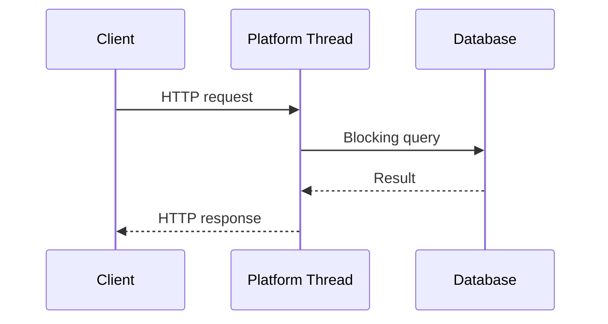
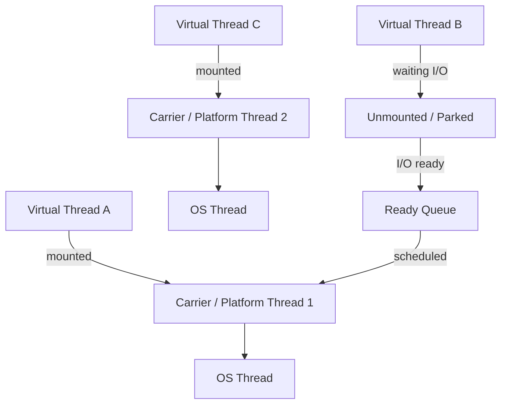
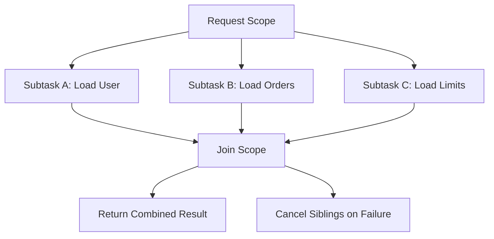
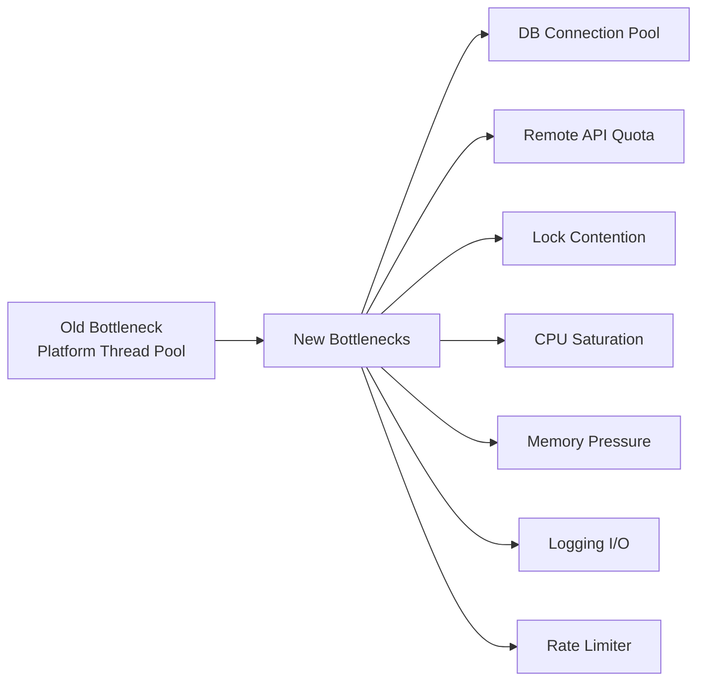

# Part 019 — Virtual Threads dan Project Loom: Throughput, Blocking, Pinning, dan Structured Thinking

Virtual threads adalah salah satu perubahan paling penting dalam Java modern setelah Java 8. Namun cara paling berbahaya untuk mempelajarinya adalah dengan menyederhanakan menjadi:

> "Virtual threads membuat aplikasi Java lebih cepat."

Itu framing yang salah.

Virtual threads tidak membuat instruksi CPU dieksekusi lebih cepat. Virtual threads membuat model **thread-per-task** menjadi murah untuk workload yang dominan **blocking I/O**. Nilai utamanya adalah:

- kode concurrent bisa tetap ditulis secara sekuensial;
- jumlah concurrent task bisa jauh lebih besar daripada jumlah platform thread;
- blocking Java I/O dapat disuspend tanpa menahan OS thread;
- observability, debugging, stack trace, dan mental model lebih dekat ke Java klasik dibanding callback-heavy async/reactive style.

Dalam framework Kaufman, bagian ini adalah sub-skill dengan leverage tinggi. Kita tidak mempelajari semua detail Loom secara akademik dulu. Kita mempelajari cukup untuk:

1. tahu masalah apa yang diselesaikan;
2. tahu kapan virtual threads cocok;
3. tahu kapan virtual threads tidak memberi manfaat;
4. tahu failure mode yang biasa muncul di production;
5. mampu memigrasikan kode executor/thread-pool secara aman.

---

## 1. Target Performa

Setelah menyelesaikan bagian ini, kamu harus mampu:

- menjelaskan perbedaan platform thread dan virtual thread;
- membaca code Java 8-style `ExecutorService` dan mengubahnya ke virtual-thread-per-task model;
- menjelaskan kenapa virtual threads cocok untuk high-concurrency blocking I/O;
- menolak penggunaan virtual threads untuk CPU-bound parallelism;
- menghindari kesalahan pooling virtual threads;
- membatasi akses ke resource langka tanpa membuat virtual thread pool;
- mendeteksi risiko pinning, lock contention, `ThreadLocal` bloat, dan connection-pool bottleneck;
- membedakan virtual threads, `CompletableFuture`, reactive streams, dan structured concurrency;
- membuat migration plan dari thread pool klasik atau reactive style ke virtual threads.

---

## 2. Masalah Dasar: Thread-Per-Request Tidak Salah, Tetapi Platform Thread Mahal

Dalam server klasik, satu request sering diproses oleh satu thread:



Model ini mudah dipahami karena flow code terlihat linear:

```java
public Response handle(Request request) {
    User user = userRepository.findById(request.userId());
    List<Order> orders = orderRepository.findByUserId(user.id());
    return Response.of(user, orders);
}
```

Masalahnya bukan model sekuensialnya. Masalahnya adalah **platform thread** mahal:

- setiap platform thread dipetakan ke OS thread;
- stack memory dan scheduling cost lebih besar;
- jumlah thread practical terbatas;
- thread pool harus dipakai untuk menghindari membuat OS thread terlalu banyak;
- ketika thread blocking menunggu I/O, OS thread ikut tertahan.

Akibatnya, ketika concurrency naik, sistem sering bottleneck di thread pool, queue, atau connection pool.

---

## 3. Mental Model Virtual Thread

Virtual thread adalah `java.lang.Thread`, tetapi bukan OS thread langsung. Virtual thread dijadwalkan oleh JDK di atas sejumlah platform thread yang disebut **carrier thread**.



Konsep penting:

| Istilah | Makna |
|---|---|
| Platform thread | Thread tradisional Java yang dipetakan ke OS thread |
| Virtual thread | Thread ringan yang dikelola JDK |
| Carrier thread | Platform thread tempat virtual thread sedang menjalankan kode |
| Mount | Virtual thread menempati carrier thread untuk berjalan |
| Unmount | Virtual thread dilepas dari carrier thread ketika menunggu blocking operation tertentu |
| Parking | Virtual thread berhenti sementara tanpa menahan carrier |
| Scheduler | Komponen JDK yang menjadwalkan virtual thread ke carrier |

Saat virtual thread melakukan blocking I/O yang didukung JDK, runtime dapat melakukan operasi non-blocking di bawahnya, lalu **unmount** virtual thread. Carrier thread bebas menjalankan virtual thread lain.

Itulah sumber skalabilitasnya.

---

## 4. Platform Thread vs Virtual Thread

| Aspek | Platform Thread | Virtual Thread |
|---|---|---|
| Backing | OS thread | Dikelola JDK, berjalan di carrier thread |
| Cost | Mahal | Murah |
| Jumlah practical | Terbatas | Bisa sangat banyak |
| Pooling | Umum dan perlu | Jangan dipool |
| Cocok untuk | CPU-bound, long-lived worker, OS-level integration | Banyak task blocking I/O pendek |
| Observability | Mature | Didukung tool modern, tetapi perlu kebiasaan baru |
| Bottleneck umum | Thread exhaustion | Resource eksternal, pinning/locking, memory, connection pool |

Virtual threads bukan pengganti semua concurrency primitive. Mereka adalah cara baru untuk menjalankan **banyak task blocking** tanpa membayar biaya satu OS thread per task.

---

## 5. Cara Membuat Virtual Thread

### 5.1 Satu Virtual Thread Langsung

```java
Thread thread = Thread.ofVirtual()
        .name("fetch-user-")
        .start(() -> {
            System.out.println(Thread.currentThread());
        });

thread.join();
```

### 5.2 Virtual Thread Per Task Executor

Ini bentuk yang paling umum untuk migrasi dari executor klasik.

```java
try (var executor = Executors.newVirtualThreadPerTaskExecutor()) {
    Future<User> user = executor.submit(() -> userClient.fetchUser(userId));
    Future<List<Order>> orders = executor.submit(() -> orderClient.fetchOrders(userId));

    return new UserOrders(user.get(), orders.get());
}
```

Perhatikan dua hal:

1. Executor ini membuat virtual thread baru untuk setiap task.
2. Executor ditutup dengan try-with-resources agar task lifecycle jelas.

---

## 6. Jangan Pool Virtual Threads

Thread pool dibuat karena platform thread mahal. Virtual thread murah. Jadi membuat pool virtual thread biasanya salah kaprah.

Salah:

```java
ExecutorService executor = Executors.newFixedThreadPool(100, Thread.ofVirtual().factory());
```

Masalahnya: kamu sedang membatasi jumlah virtual thread seolah-olah virtual thread adalah resource mahal. Padahal resource yang harus dibatasi biasanya bukan thread, melainkan:

- database connection;
- remote API quota;
- disk bandwidth;
- memory;
- CPU;
- message broker partition;
- rate limit eksternal.

Benar: buat virtual thread per task, lalu batasi resource yang memang langka.

```java
private final Semaphore dbPermits = new Semaphore(50);

public User loadUser(String id) throws Exception {
    dbPermits.acquire();
    try {
        return userRepository.findById(id);
    } finally {
        dbPermits.release();
    }
}
```

Atau, lebih baik lagi, atur batas di connection pool, HTTP client, rate limiter, atau bulkhead yang sesuai.

---

## 7. Virtual Threads untuk Blocking I/O

Virtual threads paling kuat ketika code banyak menunggu:

```java
public InvoiceView loadInvoiceView(String invoiceId) {
    Invoice invoice = invoiceClient.getInvoice(invoiceId);
    Customer customer = customerClient.getCustomer(invoice.customerId());
    List<Payment> payments = paymentClient.getPayments(invoiceId);

    return new InvoiceView(invoice, customer, payments);
}
```

Code di atas sederhana, tetapi sequential. Dengan virtual threads, kita bisa tetap menulis style blocking namun menjalankan beberapa I/O secara concurrent:

```java
public InvoiceView loadInvoiceView(String invoiceId) throws Exception {
    try (var executor = Executors.newVirtualThreadPerTaskExecutor()) {
        Future<Invoice> invoiceFuture =
                executor.submit(() -> invoiceClient.getInvoice(invoiceId));

        Future<Customer> customerFuture =
                executor.submit(() -> {
                    Invoice invoice = invoiceFuture.get();
                    return customerClient.getCustomer(invoice.customerId());
                });

        Future<List<Payment>> paymentsFuture =
                executor.submit(() -> paymentClient.getPayments(invoiceId));

        Invoice invoice = invoiceFuture.get();
        Customer customer = customerFuture.get();
        List<Payment> payments = paymentsFuture.get();

        return new InvoiceView(invoice, customer, payments);
    }
}
```

Namun contoh ini mulai memperlihatkan kelemahan `Future`: cancellation, failure propagation, dan dependency antar-task masih manual. Di sinilah structured concurrency menjadi relevan.

---

## 8. Structured Concurrency: Mengelola Task sebagai Satu Unit

Virtual threads membuat banyak thread murah. Tetapi banyak thread murah tetap bisa kacau jika lifecycle-nya tidak dikelola.

Structured concurrency memperlakukan beberapa subtask sebagai satu unit kerja:



Prinsipnya:

- subtask tidak boleh orphan;
- failure satu task bisa membatalkan task lain;
- parent scope menunggu child task selesai atau dibatalkan;
- observability lebih baik karena hubungan task eksplisit.

Pada Java 25, structured concurrency masih **preview**. Artinya desain dan implementasi tersedia untuk dicoba, tetapi belum permanen untuk API production tanpa governance.

Contoh konseptual:

```java
// API structured concurrency masih preview pada Java 25.
// Compile/run membutuhkan --enable-preview.
try (var scope = new StructuredTaskScope.ShutdownOnFailure()) {
    var user = scope.fork(() -> userClient.fetchUser(userId));
    var orders = scope.fork(() -> orderClient.fetchOrders(userId));
    var limits = scope.fork(() -> limitClient.fetchLimits(userId));

    scope.join();
    scope.throwIfFailed();

    return new UserDashboard(user.get(), orders.get(), limits.get());
}
```

Tujuan contoh ini bukan untuk menghafal API. Tujuannya adalah memahami invariant:

> Jika sebuah operasi bisnis terdiri dari beberapa subtask, lifecycle subtask harus berada di bawah lifecycle operasi bisnis tersebut.

---

## 9. ThreadLocal dan Masalah Context Propagation

Banyak aplikasi Java lama memakai `ThreadLocal` untuk:

- request context;
- correlation id;
- security principal;
- tenant id;
- locale;
- transaction context;
- MDC logging;
- tracing context.

Dengan platform thread pool, `ThreadLocal` sering bermasalah karena thread dipakai ulang. Dengan virtual threads, setiap task bisa punya thread sendiri, sehingga leak antar-request lebih kecil. Namun bukan berarti `ThreadLocal` bebas risiko.

Masalah yang tetap ada:

- terlalu banyak `ThreadLocal` memperbesar memory footprint;
- context tersembunyi membuat flow sulit diuji;
- library bisa mengisi context tanpa lifecycle jelas;
- inheritance context bisa mengejutkan;
- cleanup masih perlu disiplin.

Pattern lama:

```java
public final class RequestContextHolder {
    private static final ThreadLocal<RequestContext> CURRENT = new ThreadLocal<>();

    public static void set(RequestContext context) {
        CURRENT.set(context);
    }

    public static RequestContext get() {
        return CURRENT.get();
    }

    public static void clear() {
        CURRENT.remove();
    }
}
```

Dengan virtual threads, lebih baik mulai berpikir ke arah **lexically scoped context**. Pada Java 25, `ScopedValue` sudah final. Scoped values memungkinkan data immutable dibagikan ke callee dan child thread dalam scope yang jelas.

Contoh konseptual:

```java
private static final ScopedValue<RequestContext> REQUEST_CONTEXT =
        ScopedValue.newInstance();

public Response handle(Request request) {
    RequestContext context = RequestContext.from(request);

    return ScopedValue.where(REQUEST_CONTEXT, context)
            .call(() -> service.process(request));
}

public void audit(String action) {
    RequestContext context = REQUEST_CONTEXT.get();
    auditSink.write(context.tenantId(), context.userId(), action);
}
```

Mental model:

| `ThreadLocal` | `ScopedValue` |
|---|---|
| Mutable per thread | Immutable binding dalam scope |
| Lifetime sering implisit | Lifetime terlihat dari struktur kode |
| Cleanup manual | Scope-bound |
| Mudah bocor di thread pool | Lebih mudah ditalar |
| Cocok untuk legacy context | Cocok untuk virtual threads + structured concurrency |

---

## 10. Pinning: Apa Itu dan Kenapa Penting

Virtual thread idealnya bisa unmount saat blocking. Namun dalam kondisi tertentu virtual thread bisa **pinned**, yaitu tetap menahan carrier thread ketika seharusnya bisa dilepas.

Sebelum JDK 24, salah satu kasus penting adalah blocking di dalam `synchronized`.

```java
public synchronized byte[] read() throws IOException {
    return socket.getInputStream().readAllBytes();
}
```

Jika virtual thread blocking di dalam monitor, carrier bisa ikut tertahan. Jika banyak virtual thread mengalami hal yang sama, sistem bisa kehilangan carrier dan throughput turun drastis.

Di JDK 24, JEP 491 memperbaiki kondisi besar ini: virtual threads yang block di dalam `synchronized` methods/statements dapat melepas underlying platform thread. Ini mengurangi hampir semua kasus pinning utama yang dulu membuat banyak library harus mengganti `synchronized` dengan `java.util.concurrent` locks.

Namun ini bukan berarti `synchronized` menjadi gratis.

Masalah yang tetap mungkin:

- critical section tetap serial;
- monitor contention tetap menghambat;
- lock scope yang terlalu besar tetap buruk;
- native calls atau blocking operasi tertentu tetap perlu dicek;
- resource eksternal tetap bottleneck.

Rule praktis:

> Setelah JDK 24, jangan panik hanya karena ada `synchronized`; tetap audit lock scope, contention, dan blocking boundary.

---

## 11. Virtual Threads Tidak Menyelesaikan CPU-Bound Work

Virtual threads tidak membuat CPU bertambah.

Salah:

```java
try (var executor = Executors.newVirtualThreadPerTaskExecutor()) {
    for (int i = 0; i < 1_000_000; i++) {
        executor.submit(() -> expensiveCpuCalculation());
    }
}
```

Jika task dominan CPU, kamu tetap dibatasi jumlah core. Membuat jutaan virtual thread hanya menambah scheduling overhead dan memory pressure.

Untuk CPU-bound workload, pertimbangkan:

- fixed platform thread pool sebesar jumlah core atau sedikit di atasnya;
- `ForkJoinPool`;
- parallel stream untuk data parallelism tertentu;
- batching;
- vectorization;
- algorithmic improvement;
- native/SIMD jika benar-benar perlu.

Virtual threads cocok untuk:

```text
Banyak task + sering menunggu I/O + code blocking sederhana
```

Bukan untuk:

```text
Banyak task + kerja CPU berat + tidak banyak blocking
```

---

## 12. Bottleneck Bergeser dari Thread Pool ke Resource Lain

Dengan platform thread pool, throughput sering berhenti karena thread habis.

Dengan virtual threads, thread tidak lagi menjadi bottleneck utama. Bottleneck akan muncul di tempat lain:



Contoh umum:

```java
try (var executor = Executors.newVirtualThreadPerTaskExecutor()) {
    for (String id : ids) {
        executor.submit(() -> repository.load(id));
    }
}
```

Jika `ids` berisi 100.000 item dan database pool hanya 30 connection, maka virtual threads akan menunggu connection. Itu bukan salah virtual threads. Itu sinyal bahwa concurrency harus dibatasi di boundary yang benar.

---

## 13. Migration dari ExecutorService Klasik

Kode lama:

```java
private final ExecutorService ioPool = Executors.newFixedThreadPool(200);

public Future<Customer> fetchCustomer(String id) {
    return ioPool.submit(() -> customerClient.get(id));
}
```

Masalah:

- pool size harus ditebak;
- queue bisa menumpuk;
- cancellation sering lemah;
- thread dump penuh platform threads;
- blocking tetap menahan OS thread.

Migrasi awal:

```java
public Customer fetchCustomer(String id) throws Exception {
    try (var executor = Executors.newVirtualThreadPerTaskExecutor()) {
        return executor.submit(() -> customerClient.get(id)).get();
    }
}
```

Namun bentuk ini tidak selalu ideal jika hanya satu task. Lebih sederhana:

```java
public Customer fetchCustomer(String id) {
    return customerClient.get(id);
}
```

Virtual thread biasanya diletakkan di boundary request/task, bukan di setiap method kecil.

Contoh boundary:

```java
public final class Worker {
    public void run(List<Job> jobs) throws Exception {
        try (var executor = Executors.newVirtualThreadPerTaskExecutor()) {
            for (Job job : jobs) {
                executor.submit(() -> process(job));
            }
        }
    }

    private void process(Job job) {
        // blocking I/O is fine here
    }
}
```

---

## 14. Migration dari Reactive ke Virtual Threads

Reactive style sering dipakai untuk menghindari blocking platform threads:

```java
public Mono<Response> handle(Request request) {
    return userClient.get(request.userId())
            .zipWith(orderClient.getOrders(request.userId()))
            .map(tuple -> toResponse(tuple.getT1(), tuple.getT2()));
}
```

Dengan virtual threads, sebagian workload dapat kembali ke style blocking:

```java
public Response handle(Request request) throws Exception {
    try (var executor = Executors.newVirtualThreadPerTaskExecutor()) {
        var user = executor.submit(() -> userClient.get(request.userId()));
        var orders = executor.submit(() -> orderClient.getOrders(request.userId()));

        return toResponse(user.get(), orders.get());
    }
}
```

Tetapi jangan jadikan ini dogma.

Reactive tetap relevan jika:

- kamu butuh backpressure end-to-end;
- data streaming panjang;
- integrasi event-loop sudah mature;
- ecosystem sudah reactive;
- kamu memproses stream event continuous, bukan request/response I/O biasa;
- kamu butuh operator composition yang kuat.

Virtual threads unggul jika:

- workload request/response;
- banyak blocking I/O;
- codebase imperative;
- debugging/reactive complexity mahal;
- library blocking lebih matang daripada reactive equivalent;
- team lebih produktif dengan sequential code.

---

## 15. Timeout, Cancellation, dan Deadline

Virtual threads membuat blocking lebih murah, tetapi blocking tanpa timeout tetap buruk.

Salah:

```java
public PaymentResult pay(PaymentRequest request) {
    return paymentGateway.charge(request); // no timeout, no cancellation strategy
}
```

Lebih baik:

```java
public PaymentResult pay(PaymentRequest request) {
    return paymentGateway.charge(request, Duration.ofSeconds(3));
}
```

Jika memakai executor:

```java
try (var executor = Executors.newVirtualThreadPerTaskExecutor()) {
    Future<PaymentResult> future =
            executor.submit(() -> paymentGateway.charge(request));

    return future.get(3, TimeUnit.SECONDS);
}
```

Namun timeout di `Future#get` hanya membatasi caller menunggu. Kamu tetap perlu memastikan operasi underlying bisa dibatalkan atau punya timeout sendiri.

Checklist:

- setiap HTTP client punya connect timeout;
- setiap HTTP client punya read/request timeout;
- setiap DB query punya query timeout;
- setiap remote call punya deadline;
- cancellation tidak hanya berhenti di caller;
- retry tidak memperpanjang waktu melewati business deadline.

---

## 16. Observability Virtual Threads

Thread dump platform thread klasik sering menunjukkan puluhan/ratusan thread. Dengan virtual threads, jumlah thread bisa ribuan bahkan jutaan. Cara membaca thread dump harus berubah.

Yang harus dicari:

- virtual thread states;
- blocking point;
- carrier saturation;
- lock contention;
- connection pool wait;
- repeated stack trace pattern;
- banyak virtual thread menunggu resource yang sama;
- thread-local memory bloat;
- pinning diagnostics jika relevan.

Observability event yang berguna:

- request latency percentile;
- active virtual thread count;
- executor/task count;
- DB pool active/waiting;
- HTTP client pending requests;
- lock contention events;
- JFR virtual thread events;
- pinned thread diagnostics;
- GC allocation rate;
- memory per request/task.

Jangan hanya mengukur:

```text
Jumlah thread naik drastis = buruk
```

Dengan virtual threads, jumlah thread yang tinggi bisa normal. Yang penting adalah:

```text
Apa yang sedang ditunggu oleh virtual threads itu?
```

---

## 17. Logging dan MDC

Banyak logging framework memakai MDC berbasis `ThreadLocal`.

Dengan virtual threads, MDC per request bisa bekerja lebih natural karena virtual thread tidak dipakai ulang seperti pool thread klasik. Namun tetap hati-hati:

- jangan simpan object besar di MDC;
- jangan mengandalkan context implisit untuk domain logic;
- cleanup tetap perlu jika memakai platform thread pool juga;
- pada bridging async/reactive, context propagation masih perlu mekanisme eksplisit.

Contoh sederhana:

```java
try (MDC.MDCCloseable ignored = MDC.putCloseable("correlationId", correlationId)) {
    service.process(request);
}
```

Lebih baik context domain tetap dikirim eksplisit:

```java
service.process(new RequestContext(correlationId, tenantId), request);
```

Gunakan MDC untuk observability, bukan sebagai dependency injection tersembunyi.

---

## 18. Rate Limiting dan Bulkhead

Virtual threads membuat mudah menembakkan terlalu banyak concurrent call. Maka kamu perlu guardrail.

Contoh bulkhead sederhana dengan semaphore:

```java
public final class RemoteClientBulkhead {
    private final Semaphore permits;

    public RemoteClientBulkhead(int maxConcurrentCalls) {
        this.permits = new Semaphore(maxConcurrentCalls);
    }

    public <T> T call(Callable<T> operation) throws Exception {
        if (!permits.tryAcquire(100, TimeUnit.MILLISECONDS)) {
            throw new RejectedExecutionException("Remote client bulkhead saturated");
        }

        try {
            return operation.call();
        } finally {
            permits.release();
        }
    }
}
```

Ini membatasi **remote dependency pressure**, bukan membatasi virtual threads.

---

## 19. Failure Mode Catalog

### 19.1 CPU Saturation

Gejala:

- CPU 100%;
- latency naik;
- virtual thread count tinggi tetapi tidak banyak blocked I/O;
- GC allocation tinggi.

Penyebab:

- virtual threads dipakai untuk CPU-bound parallelism;
- terlalu banyak serialization/compression/encryption;
- algoritma boros;
- logging sinkron berat.

Mitigasi:

- batasi parallelism CPU;
- gunakan platform thread pool/ForkJoin;
- profiling CPU;
- batching;
- optimasi algoritma.

### 19.2 Connection Pool Exhaustion

Gejala:

- banyak virtual thread stuck menunggu connection;
- DB active connection mentok;
- request latency naik;
- throughput tidak naik meski virtual thread banyak.

Mitigasi:

- ukur pool wait time;
- set timeout acquire connection;
- tune pool berdasarkan DB capacity;
- batching query;
- query optimization;
- caching;
- reduce chatty database calls.

### 19.3 Remote API Flood

Gejala:

- 429 rate limit;
- dependency latency naik;
- retry storm;
- queue menumpuk.

Mitigasi:

- rate limiter;
- circuit breaker;
- jittered backoff;
- bulkhead per dependency;
- request coalescing;
- cache;
- deadline propagation.

### 19.4 Lock Contention

Gejala:

- banyak virtual thread menunggu monitor/lock;
- CPU tidak penuh tetapi latency tinggi;
- critical section besar.

Mitigasi:

- perkecil lock scope;
- gunakan concurrent data structures;
- shard lock;
- hindari I/O dalam lock;
- gunakan immutable snapshot;
- audit synchronized method.

### 19.5 ThreadLocal Memory Bloat

Gejala:

- memory naik seiring jumlah virtual thread;
- heap dump menunjukkan banyak per-thread context;
- request kecil punya overhead besar.

Mitigasi:

- kurangi `ThreadLocal`;
- gunakan `ScopedValue` untuk context immutable;
- simpan ID kecil, bukan object graph besar;
- cleanup eksplisit untuk legacy code;
- audit library context.

### 19.6 Unbounded Task Creation

Gejala:

- jutaan task dibuat;
- memory pressure;
- downstream overloaded;
- cancellation terlambat.

Mitigasi:

- bound input;
- batching;
- structured concurrency;
- rate limiting;
- backpressure;
- queue capacity di boundary bisnis.

---

## 20. Decision Matrix

| Situasi | Virtual Threads? | Catatan |
|---|---:|---|
| HTTP service dengan blocking JDBC | Ya | Cocok, tapi DB pool tetap bottleneck |
| Banyak outbound REST calls blocking | Ya | Tambahkan timeout, bulkhead, rate limiter |
| CPU-heavy image processing | Tidak sebagai solusi utama | Gunakan bounded CPU executor |
| Stream event tak berujung dengan backpressure | Tergantung | Reactive masih bisa lebih tepat |
| Legacy synchronous codebase | Ya, kandidat kuat | Migration relatif natural |
| Low-concurrency CLI | Tidak perlu | Manfaat kecil |
| High-concurrency gateway dengan non-blocking stack matang | Tergantung | Pertimbangkan cost migration |
| Library banyak native blocking calls | Audit dulu | Pastikan behavior terhadap carrier thread |

---

## 21. Migration Strategy

### Step 1 — Klasifikasikan Workload

```text
I/O-bound?
CPU-bound?
Mixed?
Latency-sensitive?
Throughput-sensitive?
Memory-sensitive?
```

### Step 2 — Temukan Boundary

Boundary yang cocok untuk virtual threads:

- HTTP request handler;
- message consumer task;
- batch job item;
- scheduled job unit;
- CLI command;
- integration task.

Boundary yang kurang cocok:

- helper method kecil;
- CPU loop;
- low-level library internal tanpa lifecycle jelas.

### Step 3 — Tambahkan Timeout Sebelum Migrasi

Jangan migrasi blocking code tanpa timeout.

### Step 4 — Ganti Thread Pool I/O dengan Virtual-Thread-Per-Task

Sebelum:

```java
ExecutorService ioPool = Executors.newFixedThreadPool(200);
```

Sesudah:

```java
ExecutorService ioExecutor = Executors.newVirtualThreadPerTaskExecutor();
```

Namun pastikan lifecycle executor jelas.

### Step 5 — Pindahkan Batas Concurrency ke Resource

- DB pool max size;
- HTTP connection pool;
- semaphore;
- rate limiter;
- bulkhead;
- queue capacity.

### Step 6 — Observability

Tambahkan metrik:

- active requests;
- virtual thread count;
- pool waits;
- remote dependency latency;
- GC;
- CPU;
- heap;
- lock contention.

### Step 7 — Load Test

Bandingkan:

- p50/p95/p99 latency;
- throughput;
- memory;
- CPU;
- GC pause;
- DB pressure;
- error rate;
- downstream saturation.

---

## 22. Contoh Refactoring: Aggregator Service

### 22.1 Sequential Baseline

```java
public Dashboard load(String userId) {
    User user = userClient.getUser(userId);
    List<Order> orders = orderClient.getOrders(userId);
    CreditLimit limit = creditClient.getLimit(userId);

    return new Dashboard(user, orders, limit);
}
```

Masalah: latency total kira-kira jumlah semua call.

### 22.2 CompletableFuture

```java
public Dashboard load(String userId) {
    CompletableFuture<User> user =
            CompletableFuture.supplyAsync(() -> userClient.getUser(userId), ioPool);

    CompletableFuture<List<Order>> orders =
            CompletableFuture.supplyAsync(() -> orderClient.getOrders(userId), ioPool);

    CompletableFuture<CreditLimit> limit =
            CompletableFuture.supplyAsync(() -> creditClient.getLimit(userId), ioPool);

    return new Dashboard(user.join(), orders.join(), limit.join());
}
```

Masalah: pool sizing, cancellation, context, exception wrapping, readability.

### 22.3 Virtual Threads

```java
public Dashboard load(String userId) throws Exception {
    try (var executor = Executors.newVirtualThreadPerTaskExecutor()) {
        Future<User> user =
                executor.submit(() -> userClient.getUser(userId));

        Future<List<Order>> orders =
                executor.submit(() -> orderClient.getOrders(userId));

        Future<CreditLimit> limit =
                executor.submit(() -> creditClient.getLimit(userId));

        return new Dashboard(user.get(), orders.get(), limit.get());
    }
}
```

Lebih sederhana, tetapi failure handling masih manual. Structured concurrency membuat model ini lebih eksplisit ketika API final dan policy mengizinkan.

---

## 23. Production Checklist

Gunakan checklist ini sebelum mengaktifkan virtual threads di service nyata.

### Workload

- [ ] Workload dominan blocking I/O.
- [ ] CPU-bound path tidak diparalelkan secara liar.
- [ ] Request fan-out diketahui.
- [ ] Downstream capacity diketahui.

### Resource Boundary

- [ ] DB pool size punya rationale.
- [ ] HTTP client timeout dikonfigurasi.
- [ ] Rate limiter tersedia untuk dependency sensitif.
- [ ] Bulkhead tersedia untuk dependency mahal.
- [ ] Retry memakai backoff dan jitter.

### Code

- [ ] Tidak ada virtual thread pool fixed-size tanpa alasan kuat.
- [ ] Executor lifecycle jelas.
- [ ] Timeout bukan hanya di caller, tapi juga di underlying operation.
- [ ] `ThreadLocal` diaudit.
- [ ] MDC/logging context tidak menyimpan object besar.
- [ ] Lock scope diaudit.
- [ ] Tidak ada I/O berat di critical section besar.

### Observability

- [ ] JFR/profile baseline tersedia.
- [ ] Thread dump bisa dibaca.
- [ ] Metrics pool wait tersedia.
- [ ] Metrics latency per dependency tersedia.
- [ ] Error/cancellation visible.
- [ ] GC/memory allocation dimonitor.

### Rollout

- [ ] Feature flag tersedia.
- [ ] Canary plan tersedia.
- [ ] Rollback plan tersedia.
- [ ] Load test sebelum dan sesudah.
- [ ] Dependency owner diberitahu jika concurrency pressure naik.

---

## 24. Latihan 20 Jam

### Jam 1–3: Model Dasar

- Buat program yang menjalankan 10.000 blocking sleep task dengan fixed pool dan virtual-thread-per-task.
- Bandingkan total waktu, jumlah thread, dan memory.
- Tulis catatan: apa yang berubah dan apa yang tidak.

### Jam 4–6: Blocking I/O Simulation

- Buat fake remote client yang sleep 100–500 ms.
- Buat aggregator sequential, `CompletableFuture`, dan virtual thread.
- Bandingkan readability dan failure handling.

### Jam 7–9: Resource Bottleneck

- Tambahkan semaphore 20 permit.
- Jalankan 1.000 virtual thread.
- Observasi bahwa throughput mengikuti permit, bukan jumlah virtual thread.

### Jam 10–12: Timeout dan Cancellation

- Tambahkan timeout di remote call.
- Simulasikan satu dependency lambat.
- Pastikan sibling task tidak dibiarkan orphan.

### Jam 13–15: ThreadLocal vs ScopedValue

- Buat context dengan `ThreadLocal`.
- Refactor ke `ScopedValue` jika memakai JDK 25.
- Bandingkan lifecycle dan testability.

### Jam 16–18: Profiling

- Jalankan workload dengan JFR.
- Ambil thread dump.
- Cari virtual thread yang menunggu resource.

### Jam 19–20: Migration Mini-RFC

Tulis RFC 1 halaman:

- workload mana yang akan dimigrasikan;
- boundary mana yang akan memakai virtual threads;
- resource apa yang harus dibatasi;
- failure mode apa yang paling mungkin;
- metrik apa yang harus dipantau;
- rollback plan.

---

## 25. Anti-Pattern

### Anti-Pattern 1 — Virtual Threads untuk Semua Hal

Virtual threads bukan silver bullet. Mereka kuat untuk blocking I/O, bukan untuk semua concurrency.

### Anti-Pattern 2 — Membuat Fixed Virtual Thread Pool

Ini biasanya menandakan kamu membatasi hal yang salah.

### Anti-Pattern 3 — Menghapus Backpressure

Karena virtual threads murah, developer sering lupa bahwa downstream tetap tidak murah.

### Anti-Pattern 4 — Mengabaikan Timeout

Blocking murah bukan berarti blocking boleh tak terbatas.

### Anti-Pattern 5 — Menyimpan Context Besar di ThreadLocal

Virtual thread banyak berarti per-thread baggage bisa menjadi memory problem.

### Anti-Pattern 6 — Menganggap Reactive Selalu Usang

Reactive masih relevan untuk streaming dan backpressure-heavy system.

### Anti-Pattern 7 — Tidak Melakukan Load Test

Virtual threads mengubah pressure distribution. Tanpa load test, bottleneck baru bisa muncul di tempat tidak terduga.

---

## 26. Mental Model Ringkas

Virtual threads mengubah pertanyaan dari:

```text
Berapa thread pool size yang aman?
```

menjadi:

```text
Berapa banyak tekanan yang boleh kita berikan ke setiap resource?
```

Platform thread pool adalah mekanisme pembatas kasar. Virtual threads membuat thread murah, sehingga pembatas harus pindah ke boundary yang benar:

- database;
- remote service;
- CPU;
- memory;
- lock;
- queue;
- rate limit.

---

## 27. Kapan Harus Menggunakan Virtual Threads

Gunakan virtual threads jika:

- codebase imperative/blocking;
- workload I/O-bound;
- concurrency tinggi;
- reactive complexity tinggi;
- platform thread pool menjadi bottleneck;
- debugging async callback sulit;
- library blocking lebih matang.

Jangan gunakan sebagai solusi utama jika:

- workload CPU-bound;
- data-parallel computation;
- streaming membutuhkan backpressure end-to-end;
- downstream tidak bisa menerima concurrency lebih besar;
- memory per task besar;
- observability belum siap.

---

## 28. Referensi Resmi

- JEP 444 — Virtual Threads: https://openjdk.org/jeps/444
- JEP 491 — Synchronize Virtual Threads without Pinning: https://openjdk.org/jeps/491
- JEP 505 — Structured Concurrency, Fifth Preview: https://openjdk.org/jeps/505
- JEP 506 — Scoped Values: https://openjdk.org/jeps/506
- Oracle Java Core Libraries — Structured Concurrency: https://docs.oracle.com/en/java/javase/21/core/structured-concurrency.html
- Java API — Executors: https://docs.oracle.com/en/java/javase/25/docs/api/java.base/java/util/concurrent/Executors.html
- Java API — Thread: https://docs.oracle.com/en/java/javase/25/docs/api/java.base/java/lang/Thread.html

---

## 29. Ringkasan

Virtual threads adalah cara Java modern mengembalikan kesederhanaan thread-per-task tanpa kembali ke biaya OS thread-per-task. Mereka sangat cocok untuk high-concurrency blocking I/O, tetapi tidak menghapus batas CPU, memory, database, remote service, lock, atau rate limit.

Invariant paling penting:

> Jangan batasi virtual thread. Batasi resource yang sebenarnya langka.

Jika kamu memahami mount/unmount, carrier thread, blocking boundary, pinning, `ThreadLocal`, `ScopedValue`, timeout, cancellation, dan bottleneck shift, kamu tidak hanya "memakai Loom". Kamu mulai berpikir seperti engineer yang bisa mengadopsi perubahan runtime besar secara aman di production.
