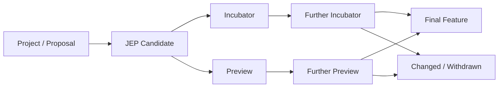
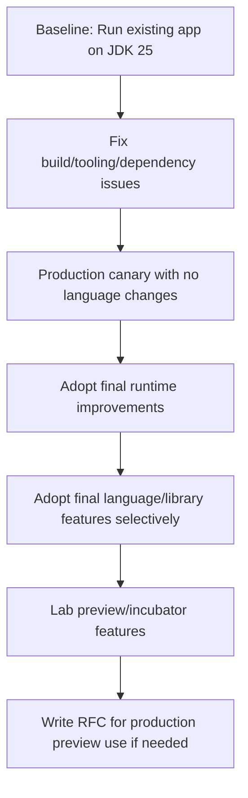
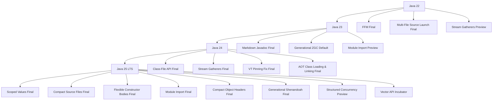

# Part 020 — Java 22 sampai 25: Preview, Incubator, Final Features, dan Governance Adopsi

Java modern bergerak cepat. Sejak model rilis enam bulanan, setiap rilis JDK membawa kombinasi:

- fitur final;
- preview language/API features;
- incubator modules;
- experimental VM/runtime features;
- removals/deprecations;
- perubahan tooling;
- perubahan security/performance.

Ini membuat cara belajar Java harus berubah. Kita tidak bisa lagi berpikir:

> "Tunggu beberapa tahun, baru pelajari Java baru."

Tetapi kita juga tidak boleh berpikir:

> "Ada fitur baru, langsung pakai di production."

Part ini membangun kemampuan yang lebih penting daripada hafal daftar fitur: **governance adopsi fitur Java**.

Kamu akan belajar:

- membedakan final, preview, incubator, dan experimental;
- membaca JEP secara kritis;
- memetakan Java 22 sampai 25;
- menentukan fitur mana yang aman dipakai;
- menentukan fitur mana yang cukup dieksplorasi;
- membuat RFC internal sebelum adopsi;
- menyiapkan migration dan rollback path.

---

## 1. Target Performa

Setelah bagian ini, kamu harus mampu:

- menjelaskan status fitur Java 22–25 tanpa mencampur final/preview/incubator;
- membaca JEP untuk memahami goal, non-goal, risk, dan compatibility;
- membuat policy kapan fitur preview boleh digunakan;
- mengatur compiler/runtime flags untuk preview;
- mendesain spike/lab untuk fitur baru;
- membuat adoption matrix untuk organisasi;
- menilai apakah fitur Java baru cocok untuk production, library, CLI, test, atau training;
- membuat migration note dari Java 21 LTS ke Java 25 LTS.

---

## 2. Mental Model: Java Feature Lifecycle



Tidak semua fitur melewati jalur yang sama.

| Status | Makna Praktis | Risiko |
|---|---|---|
| Final | Bagian permanen dari Java SE/JDK release tersebut | Risiko relatif rendah, tetap cek compatibility |
| Preview | Desain cukup matang tetapi belum permanen; bisa berubah | Risiko API/syntax berubah |
| Incubator | API non-final dalam module incubator; eksplorasi | Risiko lebih tinggi |
| Experimental | VM/tooling feature untuk eksperimen | Risiko behavior/flag berubah |
| Deprecated | Masih ada, tetapi disarankan pindah | Risiko future removal |
| Removed | Tidak tersedia lagi | Migration wajib |

Rule:

> Fitur final boleh dievaluasi untuk production. Fitur preview/incubator harus melalui policy eksplisit.

---

## 3. Cara Membaca JEP

JEP bukan marketing page. JEP adalah dokumen engineering decision.

Saat membaca JEP, cari bagian ini:

| Bagian JEP | Pertanyaan yang Harus Dijawab |
|---|---|
| Summary | Fitur ini sebenarnya apa? |
| Goals | Masalah apa yang ingin diselesaikan? |
| Non-Goals | Apa yang sengaja tidak diselesaikan? |
| Motivation | Kenapa fitur ini diperlukan? |
| Description | Bagaimana modelnya bekerja? |
| Alternatives | Solusi apa yang ditolak? |
| Risks and Assumptions | Risiko desain apa yang diketahui? |
| Dependencies | Fitur/proyek apa yang terkait? |
| History | Sudah preview/incubator berapa kali? |
| Status/Release | Final, preview, incubator, atau delivered di rilis mana? |

Pertanyaan paling penting:

```text
Apakah problem yang diselesaikan JEP ini adalah problem yang benar-benar kita punya?
```

Jika tidak, fitur itu mungkin menarik, tetapi belum tentu layak masuk production codebase.

---

## 4. Compiler dan Runtime Preview Flags

Preview feature tidak aktif otomatis.

Untuk compile:

```bash
javac --release 25 --enable-preview Main.java
```

Untuk run:

```bash
java --enable-preview Main
```

Untuk Maven, konfigurasi biasanya diletakkan di compiler plugin dan test/runtime plugin:

```xml
<configuration>
    <release>25</release>
    <compilerArgs>
        <arg>--enable-preview</arg>
    </compilerArgs>
</configuration>
```

Untuk Gradle:

```kotlin
tasks.withType<JavaCompile>().configureEach {
    options.compilerArgs.add("--enable-preview")
}

tasks.withType<Test>().configureEach {
    jvmArgs("--enable-preview")
}
```

Governance rule:

> Jika production artifact membutuhkan `--enable-preview`, itu harus diperlakukan sebagai keputusan arsitektural, bukan keputusan developer individual.

---

## 5. Java 22 Feature Map

JDK 22 GA pada 19 Maret 2024. Banyak fitur di Java 22 adalah preview/incubator wave yang kemudian berlanjut ke Java 23, 24, atau 25.

Fitur penting:

| JEP | Fitur | Status di JDK 22 | Kategori | Catatan |
|---:|---|---|---|---|
| 423 | Region Pinning for G1 | Final | GC | Mengurangi latency saat JNI critical regions |
| 447 | Statements before `super(...)` | Preview | Language | Awal evolusi flexible constructor bodies |
| 454 | Foreign Function & Memory API | Final | Native interop | Fondasi Project Panama |
| 456 | Unnamed Variables & Patterns | Final | Language | Mengurangi noise untuk binding yang tidak dipakai |
| 457 | Class-File API | Preview | Tooling/API | API standar untuk parse/generate/transform class files |
| 458 | Launch Multi-File Source-Code Programs | Final | Tooling | Menjalankan program multi-file tanpa build tool |
| 459 | String Templates | Second Preview | Language | Kemudian ditarik/diubah arah; jangan treat sebagai final |
| 460 | Vector API | Seventh Incubator | Performance | SIMD-oriented API, belum final |
| 461 | Stream Gatherers | Preview | Libraries | Custom intermediate operations untuk stream |
| 462 | Structured Concurrency | Second Preview | Concurrency | Lifecycle task sebagai unit |
| 463 | Implicitly Declared Classes and Instance Main Methods | Second Preview | On-ramp | Evolusi menuju compact source files |
| 464 | Scoped Values | Second Preview | Concurrency | Evolusi menuju final di JDK 25 |

### 5.1 Apa yang Layak Dipelajari dari Java 22?

Untuk engineer production, yang paling penting:

- FFM API final;
- unnamed variables/patterns;
- launch multi-file source;
- Class-File API direction;
- Stream Gatherers direction;
- structured concurrency direction;
- scoped values direction.

Namun jangan otomatis mengadopsi semua preview feature.

---

## 6. Java 23 Feature Map

JDK 23 GA pada 17 September 2024.

Fitur penting yang perlu kamu kenali:

| JEP | Fitur | Status di JDK 23 | Kategori | Catatan |
|---:|---|---|---|---|
| 455 | Primitive Types in Patterns, `instanceof`, and `switch` | Preview | Language | Langkah menuju pattern matching yang lebih lengkap |
| 466 | Class-File API | Second Preview | Tooling/API | Melanjutkan JDK 22 |
| 467 | Markdown Documentation Comments | Final | Tooling/Javadoc | Dokumentasi bisa ditulis dengan Markdown |
| 469 | Vector API | Eighth Incubator | Performance | Masih incubator |
| 473 | Stream Gatherers | Second Preview | Libraries | Lanjutan dari JDK 22 |
| 474 | ZGC Generational Mode by Default | Final | GC | Generational ZGC menjadi default mode |
| 476 | Module Import Declarations | Preview | Language | Import seluruh module untuk code ringkas |
| 477 | Implicitly Declared Classes and Instance Main Methods | Third Preview | On-ramp | Lanjutan fitur on-ramp |
| 480 | Structured Concurrency | Third Preview | Concurrency | Lanjutan |
| 481 | Scoped Values | Third Preview | Concurrency | Lanjutan |
| 482 | Flexible Constructor Bodies | Second Preview | Language | Evolusi statements before super |
| 471 | Deprecate the Memory-Access Methods in `sun.misc.Unsafe` for Removal | Final | Platform hygiene | Mengurangi ketergantungan ke internal unsafe memory access |

### 6.1 Catatan Java 23

Java 23 bukan LTS, tetapi penting sebagai sinyal arah:

- Java makin nyaman untuk scripting/prototyping;
- JDK makin menyediakan API resmi untuk tooling class file;
- concurrency API Loom makin matang;
- runtime/GC makin diarahkan ke latency dan startup;
- penggunaan API internal semakin dibatasi.

---

## 7. Java 24 Feature Map

JDK 24 GA pada 18 Maret 2025 dan membawa jumlah JEP yang besar.

Fitur penting:

| JEP | Fitur | Status di JDK 24 | Kategori | Catatan |
|---:|---|---|---|---|
| 404 | Generational Shenandoah | Experimental | GC | Generational mode untuk Shenandoah |
| 450 | Compact Object Headers | Experimental | Runtime/Memory | Project Lilliput; mengurangi object header footprint |
| 472 | Prepare to Restrict the Use of JNI | Final | Security/Interop | Warning/guardrail untuk native access |
| 475 | Late Barrier Expansion for G1 | Final | GC/Performance | Optimisasi G1 |
| 478 | Key Derivation Function API | Preview | Security | Awal API KDF standar |
| 479 | Remove the Windows 32-bit x86 Port | Final | Platform removal | Port lama dihapus |
| 483 | Ahead-of-Time Class Loading & Linking | Final | Startup/Leyden | Mengurangi startup/warmup tertentu |
| 484 | Class-File API | Final | Tooling/API | API class file menjadi final |
| 485 | Stream Gatherers | Final | Libraries | Gatherers menjadi final |
| 486 | Permanently Disable the Security Manager | Final | Security/Platform | Security Manager tidak lagi bisa diaktifkan |
| 487 | Scoped Values | Fourth Preview | Concurrency | Menuju final JDK 25 |
| 488 | Primitive Types in Patterns, `instanceof`, and `switch` | Second Preview | Language | Lanjutan |
| 489 | Vector API | Ninth Incubator | Performance | Masih incubator |
| 490 | ZGC: Remove the Non-Generational Mode | Final | GC | Generational ZGC menjadi arah utama |
| 491 | Synchronize Virtual Threads without Pinning | Final | Loom/Runtime | Mengurangi pinning besar pada virtual threads |
| 492 | Flexible Constructor Bodies | Third Preview | Language | Menuju final JDK 25 |
| 493 | Linking Run-Time Images without JMODs | Final | Packaging | Image runtime lebih fleksibel |
| 494 | Module Import Declarations | Second Preview | Language | Lanjutan |
| 495 | Simple Source Files and Instance Main Methods | Fourth Preview | On-ramp | Menuju compact source files JDK 25 |
| 496 | Quantum-Resistant Module-Lattice-Based Key Encapsulation Mechanism | Final | Security | ML-KEM |
| 497 | Quantum-Resistant Module-Lattice-Based Digital Signature Algorithm | Final | Security | ML-DSA |
| 498 | Warn upon Use of Memory-Access Methods in `sun.misc.Unsafe` | Final | Platform hygiene | Migration pressure dari Unsafe |
| 499 | Structured Concurrency | Fourth Preview | Concurrency | Lanjutan |
| 501 | Deprecate the 32-bit x86 Port for Removal | Final | Platform removal | Langkah sebelum removal di JDK 25 |

### 7.1 Java 24 sebagai Release Transisi

Java 24 penting karena beberapa fitur yang masih preview di Java 24 menjadi final di Java 25:

- Scoped Values;
- Compact Source Files and Instance Main Methods;
- Flexible Constructor Bodies;
- Module Import Declarations.

Selain itu, JDK 24 memperbaiki bottleneck pinning virtual threads yang sebelumnya menjadi perhatian besar.

---

## 8. Java 25 Feature Map

JDK 25 GA pada 16 September 2025 dan merupakan rilis LTS bagi banyak vendor.

Fitur JDK 25:

| JEP | Fitur | Status di JDK 25 | Kategori | Catatan |
|---:|---|---|---|---|
| 470 | PEM Encodings of Cryptographic Objects | Preview | Security | API encode/decode PEM |
| 502 | Stable Values | Preview | Core Libraries/Performance | Lazy immutable values yang dapat dioptimasi JVM |
| 503 | Remove the 32-bit x86 Port | Final | Platform removal | Removal port lama |
| 505 | Structured Concurrency | Fifth Preview | Concurrency | Masih preview |
| 506 | Scoped Values | Final | Concurrency | Alternatif context immutable untuk ThreadLocal |
| 507 | Primitive Types in Patterns, `instanceof`, and `switch` | Third Preview | Language | Masih preview |
| 508 | Vector API | Tenth Incubator | Performance | Masih incubator |
| 509 | JFR CPU-Time Profiling | Experimental | Observability | Profiling CPU-time di JFR |
| 510 | Key Derivation Function API | Final | Security | API KDF standar |
| 511 | Module Import Declarations | Final | Language | Import module langsung |
| 512 | Compact Source Files and Instance Main Methods | Final | Language/On-ramp | On-ramp Java final |
| 513 | Flexible Constructor Bodies | Final | Language | Validasi/komputasi sebelum `super(...)` dalam batas aman |
| 514 | Ahead-of-Time Command-Line Ergonomics | Final | Startup/Leyden | Ergonomi AOT cache |
| 515 | Ahead-of-Time Method Profiling | Final | Startup/Warmup | Profiling method untuk AOT |
| 518 | JFR Cooperative Sampling | Final | Observability | Sampling JFR lebih kooperatif |
| 519 | Compact Object Headers | Final | Runtime/Memory | Mengurangi object header footprint |
| 520 | JFR Method Timing & Tracing | Experimental | Observability | Timing/tracing method via JFR |
| 521 | Generational Shenandoah | Final | GC | Generational Shenandoah final |

### 8.1 Java 25 sebagai LTS Modern

Java 25 layak diperlakukan sebagai target modernisasi karena:

- banyak fitur preview dari 21–24 sudah final;
- Loom context story lebih matang dengan `ScopedValue`;
- JDK runtime makin baik untuk startup, memory footprint, profiling, dan GC;
- beberapa fitur preview tetap perlu governance;
- platform lama seperti 32-bit x86 makin ditinggalkan.

---

## 9. Fitur Final di Java 25 yang Paling Relevan untuk Production

### 9.1 Scoped Values

Scoped values menyelesaikan masalah context sharing immutable dengan lifetime jelas.

Gunakan untuk:

- request context;
- tenant id;
- security principal immutable;
- tracing context kecil;
- config per-scope;
- context yang harus terlihat oleh child task.

Jangan gunakan untuk:

- mutable accumulator;
- object besar;
- domain dependency injection tersembunyi;
- menggantikan parameter eksplisit di semua tempat.

### 9.2 Module Import Declarations

Module import declaration memungkinkan mengimpor package yang diekspor oleh module.

Contoh konseptual:

```java
import module java.base;

void main() {
    List<String> names = List.of("Duke", "Leyden", "Loom");
    IO.println(names);
}
```

Manfaat:

- mengurangi boilerplate untuk small programs;
- cocok untuk tutorial, script, exploratory code;
- mendukung compact source files.

Risiko:

- untuk code production besar, explicit import sering lebih jelas;
- bisa menyembunyikan asal type;
- style guide perlu menentukan kapan boleh.

### 9.3 Compact Source Files and Instance Main Methods

Java 25 memfinalisasi fitur on-ramp.

Contoh:

```java
void main() {
    IO.println("Hello, Java 25");
}
```

Manfaat:

- onboarding lebih mudah;
- script kecil lebih ringkas;
- mengurangi ceremony saat eksplorasi.

Untuk enterprise production code, tetap gunakan struktur eksplisit:

```java
package com.acme.billing;

public final class BillingApplication {
    public static void main(String[] args) {
        Application.run(args);
    }
}
```

Rule:

> Compact source files bagus untuk belajar, CLI kecil, scratchpad, dan demo. Untuk service production besar, explicit structure masih lebih defensible.

### 9.4 Flexible Constructor Bodies

Fitur ini memungkinkan statement tertentu sebelum pemanggilan constructor superclass, dengan batas keselamatan bahasa.

Masalah lama:

```java
public final class Money extends Amount {
    public Money(BigDecimal value, Currency currency) {
        super(validate(value), currency);
    }

    private static BigDecimal validate(BigDecimal value) {
        if (value.signum() < 0) {
            throw new IllegalArgumentException("value must be non-negative");
        }
        return value;
    }
}
```

Dengan flexible constructor bodies, validasi bisa lebih natural sebelum `super(...)`, selama tidak mengakses instance yang belum diinisialisasi secara tidak aman.

Manfaat:

- constructor validation lebih readable;
- mengurangi helper static palsu;
- mendukung invariant checking lebih bersih.

### 9.5 Compact Object Headers

Compact object headers mengurangi memory footprint object header. Ini penting untuk aplikasi dengan banyak object kecil.

Dampak potensial:

- heap footprint lebih rendah;
- cache locality lebih baik;
- GC pressure bisa turun;
- efek paling terasa pada object-heavy workloads.

Tetapi jangan klaim manfaat tanpa measurement. Gunakan heap dump, allocation profiling, dan load test.

### 9.6 Generational Shenandoah

Generational Shenandoah membawa model generational ke low-pause GC Shenandoah.

Pertimbangkan jika:

- latency-sensitive;
- pause time penting;
- allocation rate tinggi;
- deployment memakai distribusi yang mendukung Shenandoah.

Tetap bandingkan dengan G1 dan ZGC berdasarkan workload nyata.

---

## 10. Fitur Preview/Incubator di Java 25: Cara Menyikapinya

### 10.1 Structured Concurrency — Fifth Preview

Status preview berarti:

- bagus untuk lab/spike;
- bisa dipakai di internal experiment;
- jangan masuk public library API stabil tanpa policy;
- production use perlu approval arsitektur.

Alasan tetap dipelajari:

- ini likely arah resmi Java concurrency;
- mental modelnya penting meskipun API bisa berubah;
- sangat terkait virtual threads dan scoped values.

### 10.2 Primitive Types in Patterns — Third Preview

Ini melanjutkan evolusi pattern matching agar primitive types lebih natural dalam `instanceof` dan `switch`.

Cocok untuk:

- eksplorasi language evolution;
- compiler/language team;
- domain dengan banyak numeric classification.

Belum cocok untuk:

- API publik stabil;
- codebase yang tidak ingin `--enable-preview`.

### 10.3 Vector API — Tenth Incubator

Vector API masih incubator. Gunakan untuk:

- performance lab;
- numeric workloads;
- SIMD-heavy algorithms;
- library internal dengan benchmark kuat.

Jangan gunakan hanya karena "lebih modern". Wajib ada JMH dan production-like benchmark.

### 10.4 Stable Values — Preview

Stable values memungkinkan lazy immutable value yang dapat diperlakukan JVM seperti constant setelah inisialisasi.

Potensi use case:

- expensive object lazy initialization;
- config/cache immutable;
- value yang ingin dibuat saat dibutuhkan tetapi tetap optimizable.

Risiko:

- API preview;
- belum cocok untuk public library API;
- perlu profiling untuk membuktikan manfaat.

### 10.5 PEM Encodings — Preview

Berguna untuk security tooling yang berurusan dengan key/certificate/CRL dalam format PEM.

Karena preview, production use perlu policy. Namun domain security sering membutuhkan standar resmi; tetap monitor finalization.

---

## 11. Adoption Matrix

Gunakan matrix ini untuk menentukan tingkat adopsi.

| Status Fitur | Training | Test Code | Internal Tooling | Production App | Public Library API |
|---|---:|---:|---:|---:|---:|
| Final | Ya | Ya | Ya | Ya, setelah review | Ya, setelah compatibility review |
| Preview | Ya | Ya | Mungkin | Hanya dengan approval | Hindari |
| Incubator | Ya | Mungkin | Mungkin | Hindari kecuali isolated | Hindari |
| Experimental | Ya | Tidak untuk CI wajib | Mungkin | Hindari | Hindari |
| Deprecated | Pelajari migration | Test compatibility | Hindari baru | Jangan tambah usage baru | Jangan expose |
| Removed | Migration only | N/A | N/A | Wajib hapus | Wajib hapus |

---

## 12. Policy Internal untuk Preview Features

Contoh policy:

```text
Preview features are disabled by default.

A team may use preview features only when:
1. The feature solves a documented problem.
2. The usage is isolated behind internal boundaries.
3. The artifact is not a public library consumed by external teams.
4. CI explicitly compiles and runs with --enable-preview.
5. A rollback path exists.
6. The team owns upgrade work if the feature changes.
7. Architecture review approves the usage.
```

Untuk production service:

```text
Preview feature usage requires:
- RFC
- migration owner
- compatibility risk analysis
- version pinning
- canary deployment
- rollback plan
- observability plan
```

---

## 13. Java 21 LTS ke Java 25 LTS: Migration Thinking

Java 25 adalah target menarik dari Java 21 karena:

- virtual threads sudah final sejak 21 dan runtime support membaik;
- scoped values final;
- compact source files final;
- flexible constructor bodies final;
- module import declarations final;
- Class-File API dan Stream Gatherers sudah final sejak 24;
- runtime/GC/AOT/JFR improvements bertambah;
- removal/deprecation lama makin terasa.

Migration bukan hanya mengganti JDK.

Checklist:

### Build

- [ ] Maven/Gradle mendukung Java 25.
- [ ] Compiler plugin mendukung `release=25`.
- [ ] Toolchains dikonfigurasi.
- [ ] CI image tersedia.
- [ ] Static analysis tool mendukung syntax Java 25.
- [ ] Annotation processors kompatibel.
- [ ] Bytecode tools kompatibel.

### Runtime

- [ ] JVM flags lama diaudit.
- [ ] GC flags dicek.
- [ ] Container memory behavior diuji.
- [ ] JFR configuration diuji.
- [ ] CDS/AOT options dievaluasi.
- [ ] Native/JNI access warning dicek.

### Code

- [ ] Tidak bergantung pada removed port/API/tool.
- [ ] Tidak bergantung pada internal JDK API.
- [ ] Reflection illegal access dicek.
- [ ] `sun.misc.Unsafe` usage diaudit.
- [ ] Serialization risk diaudit.
- [ ] ThreadLocal/context usage diaudit jika memakai virtual threads.

### Dependencies

- [ ] Framework mendukung Java 25.
- [ ] Test libraries mendukung Java 25.
- [ ] Bytecode libraries seperti ASM/Byte Buddy/Javassist mendukung class file baru.
- [ ] Observability agent mendukung Java 25.
- [ ] JDBC driver kompatibel.
- [ ] App server/runtime kompatibel.

### Rollout

- [ ] Run test suite di Java 21 dan 25.
- [ ] Shadow/canary traffic.
- [ ] Performance baseline.
- [ ] GC baseline.
- [ ] Memory baseline.
- [ ] Rollback ke Java 21 jelas.

---

## 14. Feature-Specific Governance

### 14.1 Stream Gatherers

Status final sejak Java 24.

Gunakan jika:

- built-in stream operations tidak cukup;
- butuh custom intermediate operation;
- ingin menjaga pipeline tetap composable.

Jangan gunakan jika loop sederhana lebih jelas.

Contoh konseptual:

```java
List<List<Order>> batches = orders.stream()
        .gather(customBatcher(100))
        .toList();
```

Pertanyaan review:

- Apakah gatherer lebih jelas daripada loop?
- Apakah statefulness aman?
- Apakah parallel stream behavior dipahami?
- Apakah ada test untuk edge case?

### 14.2 Class-File API

Status final sejak Java 24.

Gunakan untuk:

- bytecode tools;
- static analysis;
- instrumentation;
- compiler/language tooling;
- migration dari ASM untuk use case tertentu.

Tidak perlu untuk aplikasi bisnis biasa.

Pertanyaan review:

- Apakah benar perlu membaca/menulis class file?
- Apakah tool harus mengikuti class file version baru?
- Apakah transformasi bytecode aman?
- Apakah ada golden test?

### 14.3 FFM API

Status final sejak Java 22.

Gunakan jika:

- perlu native library;
- JNI terlalu berat/rapuh;
- butuh off-heap memory dengan API modern;
- performance boundary jelas.

Pertanyaan review:

- Apakah Java murni cukup?
- Apakah native dependency bisa dideploy semua platform?
- Apakah memory lifecycle aman?
- Apakah crash isolation cukup?
- Apakah security review dilakukan?

### 14.4 Virtual Threads + Scoped Values

Gunakan untuk:

- high-concurrency blocking I/O;
- context immutable per request;
- synchronous codebase yang ingin lebih scalable.

Pertanyaan review:

- Apa bottleneck sesungguhnya?
- Apakah DB/HTTP pool siap?
- Apakah timeout lengkap?
- Apakah ThreadLocal usage diaudit?
- Apakah JFR/thread dump siap?

---

## 15. Internal RFC Template

Gunakan template ini sebelum adopsi fitur Java baru.

```markdown
# RFC: Adopt <Java Feature> in <System/Module>

## 1. Summary

One paragraph explaining the feature and intended usage.

## 2. Problem

What concrete problem do we have today?

## 3. Proposed Solution

How will the feature solve the problem?

## 4. Feature Status

- JDK version:
- JEP:
- Status: final / preview / incubator / experimental
- Requires --enable-preview: yes/no
- Affected modules:

## 5. Alternatives Considered

- Alternative A:
- Alternative B:
- Do nothing:

## 6. Compatibility Impact

- Source compatibility:
- Binary compatibility:
- Runtime compatibility:
- Tooling compatibility:
- Dependency compatibility:

## 7. Operational Impact

- Metrics:
- Logs:
- Traces:
- JFR:
- Failure modes:
- Rollback:

## 8. Security Impact

- New permissions/native access:
- Secrets/crypto impact:
- Serialization/reflection impact:

## 9. Testing Plan

- Unit:
- Integration:
- Performance:
- Regression:
- Canary:

## 10. Rollout Plan

- Phase 1:
- Phase 2:
- Phase 3:

## 11. Owner

- Engineering owner:
- Reviewers:
- Migration owner:
```

---

## 16. Style Guide untuk Fitur Baru

### 16.1 Compact Source Files

Boleh:

- tutorial;
- kata pengantar;
- scratchpad;
- CLI kecil;
- demo.

Hindari:

- service production besar;
- public library;
- codebase yang butuh package discipline;
- modul dengan API stabil.

### 16.2 Module Imports

Boleh:

- tutorial;
- script;
- prototype;
- internal CLI.

Hindari:

- business-critical package besar jika explicit imports lebih terbaca;
- public API examples yang butuh origin type jelas.

### 16.3 Flexible Constructor Bodies

Boleh:

- invariant validation;
- parameter normalization;
- fail-fast constructor.

Hindari:

- side effect berat sebelum object valid;
- remote call;
- blocking I/O;
- logic bisnis kompleks;
- dependency lookup.

### 16.4 Scoped Values

Boleh:

- immutable request context;
- correlation id;
- tenant id;
- security principal kecil;
- child-task context.

Hindari:

- mutable state;
- large object graph;
- hidden domain dependency;
- optional parameter global.

---

## 17. Anti-Pattern dalam Mengadopsi Java Baru

### Anti-Pattern 1 — Version Tourism

Mengaktifkan fitur hanya karena baru.

Solusi:

```text
Mulai dari problem, bukan dari fitur.
```

### Anti-Pattern 2 — Preview in Public API

Mengekspos preview feature ke library publik.

Solusi:

```text
Preview hanya boleh di boundary internal dan isolated.
```

### Anti-Pattern 3 — Ignoring Tooling

Code compile dengan JDK 25, tetapi formatter, linter, IDE, coverage agent, atau bytecode tool gagal.

Solusi:

```text
Tooling compatibility masuk checklist migration.
```

### Anti-Pattern 4 — Mixing Language Experiment with Business Migration

Migrasi runtime Java 25 dicampur dengan refactor besar fitur baru.

Solusi:

```text
Pisahkan runtime upgrade dari language adoption.
```

### Anti-Pattern 5 — No Rollback

Mengadopsi fitur baru tanpa rollback path.

Solusi:

```text
Setiap adopsi fitur harus punya rollback strategy.
```

---

## 18. Recommended Adoption Roadmap

Untuk organisasi yang saat ini di Java 17 atau 21:



Urutan yang sehat:

1. Upgrade runtime tanpa mengubah code style besar.
2. Stabilkan build, CI, agent, dependency.
3. Ambil performance/observability benefit.
4. Baru adopsi fitur language final.
5. Preview/incubator hanya di lab atau dengan RFC.

---

## 19. Latihan 20 Jam

### Jam 1–3: JEP Reading Drill

Pilih 3 JEP:

- satu final;
- satu preview;
- satu incubator.

Untuk masing-masing, tulis:

- problem;
- goal;
- non-goal;
- risk;
- apakah cocok untuk production.

### Jam 4–6: Preview Flag Lab

Buat project kecil Java 25.

- Compile dengan dan tanpa `--enable-preview`.
- Jalankan test dengan dan tanpa `--enable-preview`.
- Catat bagaimana build tool harus dikonfigurasi.

### Jam 7–9: Compact Source Files

Buat CLI kecil dengan compact source file.

Lalu refactor menjadi struktur production:

- package;
- class eksplisit;
- test;
- build tool;
- logging;
- argument parsing.

Tulis kapan masing-masing bentuk lebih baik.

### Jam 10–12: ScopedValue Lab

Implementasikan request context dengan:

- explicit parameter;
- `ThreadLocal`;
- `ScopedValue`.

Bandingkan:

- readability;
- testability;
- lifetime;
- child task behavior.

### Jam 13–15: Feature Adoption RFC

Ambil satu fitur Java 25 final, misalnya `ScopedValue` atau `Flexible Constructor Bodies`.

Tulis RFC 1 halaman menggunakan template di atas.

### Jam 16–18: Migration Simulation

Ambil project Java 21 kecil.

- Jalankan di JDK 25.
- Audit dependency.
- Audit compiler plugin.
- Audit static analysis.
- Audit runtime flags.

### Jam 19–20: Adoption Matrix

Buat matrix internal:

- fitur boleh dipakai di tutorial;
- fitur boleh dipakai di test;
- fitur boleh dipakai di internal CLI;
- fitur boleh dipakai di production;
- fitur boleh dipakai di public API.

---

## 20. Review Checklist

Sebelum menerima PR yang memakai fitur Java 22–25:

- [ ] Apakah fitur final?
- [ ] Jika preview/incubator, apakah ada approval?
- [ ] Apakah butuh `--enable-preview`?
- [ ] Apakah toolchain CI mendukung?
- [ ] Apakah IDE/formatter/linter mendukung?
- [ ] Apakah test coverage cukup?
- [ ] Apakah fitur benar-benar menyelesaikan problem?
- [ ] Apakah readability meningkat?
- [ ] Apakah compatibility impact dipahami?
- [ ] Apakah rollback path ada?
- [ ] Apakah public API terdampak?
- [ ] Apakah dokumentasi internal diperbarui?

---

## 21. Ringkasan Final/Preview/Incubator Java 22–25



---

## 22. Referensi Resmi

- OpenJDK JDK 22: https://openjdk.org/projects/jdk/22/
- OpenJDK JDK 23: https://openjdk.org/projects/jdk/23/
- OpenJDK JDK 24: https://openjdk.org/projects/jdk/24/
- OpenJDK JDK 25: https://openjdk.org/projects/jdk/25/
- JEP 12 — Preview Features: https://openjdk.org/jeps/12
- JEP 11 — Incubator Modules: https://openjdk.org/jeps/11
- JEP 444 — Virtual Threads: https://openjdk.org/jeps/444
- JEP 491 — Synchronize Virtual Threads without Pinning: https://openjdk.org/jeps/491
- JEP 505 — Structured Concurrency: https://openjdk.org/jeps/505
- JEP 506 — Scoped Values: https://openjdk.org/jeps/506
- JEP 511 — Module Import Declarations: https://openjdk.org/jeps/511
- JEP 512 — Compact Source Files and Instance Main Methods: https://openjdk.org/jeps/512
- JEP 513 — Flexible Constructor Bodies: https://openjdk.org/jeps/513
- Oracle JDK 25 Migration Guide: https://docs.oracle.com/en/java/javase/25/migrate/

---

## 23. Ringkasan

Java 22 sampai 25 bukan sekadar daftar fitur baru. Ini adalah periode konsolidasi besar:

- Project Loom makin matang;
- Project Amber membuat Java lebih ekspresif;
- Project Panama membuat native interop lebih aman;
- Project Leyden mulai memperbaiki startup/warmup;
- JFR dan observability makin kuat;
- GC modern makin banyak opsi;
- internal/legacy API makin ditekan;
- Java 25 menjadi target LTS modern.

Skill terpenting bukan menghafal fitur. Skill terpenting adalah mengadopsi fitur dengan disiplin:

```text
Problem -> JEP -> Status -> Risk -> Experiment -> RFC -> Rollout -> Measurement -> Rollback
```

Itulah perbedaan antara developer yang "tahu Java baru" dan engineer yang mampu membawa platform Java baru ke production tanpa membuat organisasi membayar risiko tersembunyi.
