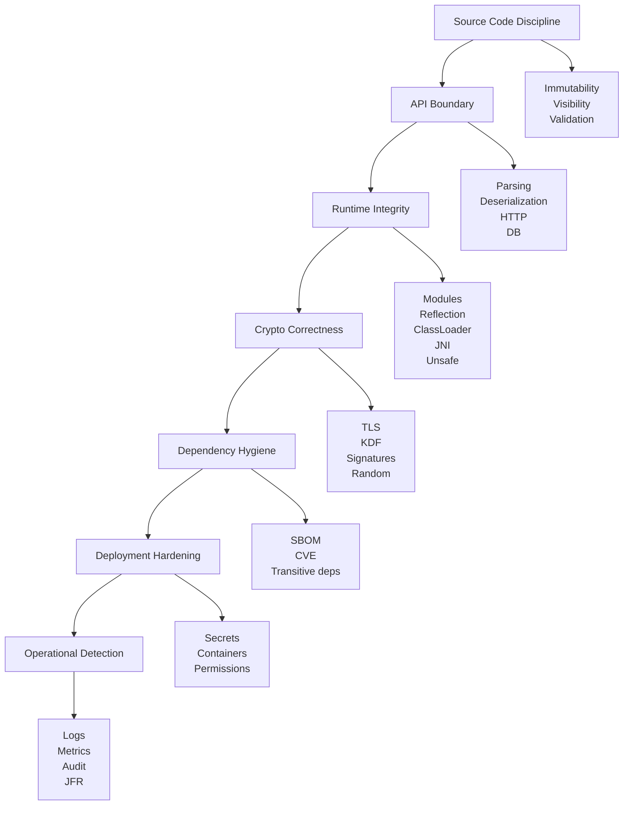
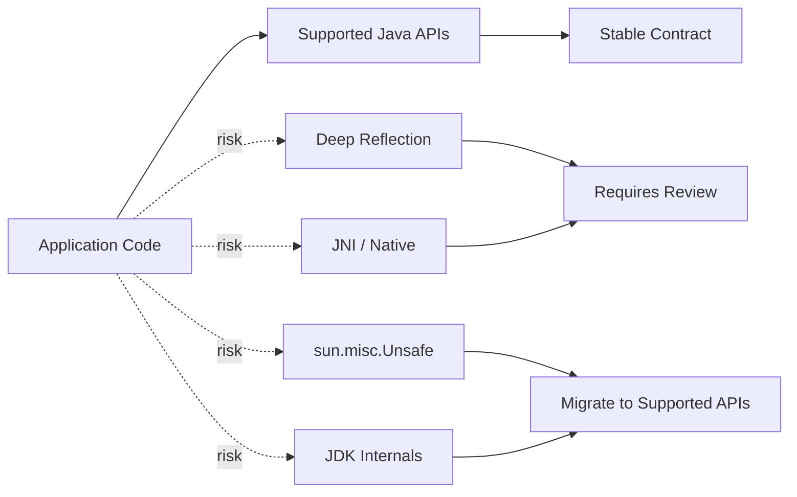

# Part 021 — Security, Crypto, Integrity, dan Platform Hardening di Java Modern

Security di Java modern tidak bisa dipahami hanya sebagai:

- pakai HTTPS;
- pakai library crypto;
- jangan hardcode password;
- update dependency;
- aktifkan scanner.

Itu semua penting, tetapi belum cukup.

Untuk engineer yang bekerja di sistem production, security Java harus dipahami sebagai kombinasi dari:

1. **language-level safety** — type system, access control, visibility, finality, immutability;
2. **runtime integrity** — class loading, reflection, module boundaries, native access, `Unsafe`;
3. **data boundary safety** — input validation, parsing, serialization, deserialization;
4. **cryptographic correctness** — TLS, key handling, random, KDF, signatures, certificates;
5. **dependency and supply-chain hygiene** — artifact trust, transitive dependency, SBOM, CVE response;
6. **operational hardening** — secrets, configuration, logs, permissions, containers, rollout;
7. **governance** — secure defaults, review checklists, threat models, exception process.

Java 8 sampai Java 25 juga membawa perubahan besar: Security Manager yang dahulu dianggap sandbox mechanism makin ditinggalkan dan akhirnya dinonaktifkan; deserialization diberi filter yang lebih kontekstual; JNI/native access dan `sun.misc.Unsafe` makin dibatasi; crypto API diperluas; dan platform Java bergerak ke arah **integrity by default**.

---

## 1. Target Performa

Setelah bagian ini, kamu harus mampu:

- menjelaskan kenapa Security Manager tidak boleh lagi dijadikan fondasi sandbox modern;
- mendesain boundary untuk parsing, deserialization, reflection, dan native access;
- memilih pendekatan crypto Java yang benar untuk use case umum;
- membedakan hashing, encryption, signature, MAC, KDF, dan random;
- mengelola keystore/truststore, TLS, certificate, dan PEM dengan benar;
- mengaudit penggunaan `ObjectInputStream`, `Serializable`, reflection, JNI, dan `Unsafe`;
- membuat secure coding checklist untuk service Java;
- membaca warning JDK modern terkait native access dan `Unsafe`;
- membuat threat model ringan untuk modul Java;
- membuat migration plan dari security pattern lama menuju Java 25.

---

## 2. Mental Model Security Java Modern



Security bukan satu fitur. Security adalah kualitas sistemik.

Rule pertama:

> Data yang melewati boundary harus dianggap hostile sampai divalidasi.

Rule kedua:

> Kode yang melewati integrity boundary harus dianggap privileged sampai dibatasi.

Rule ketiga:

> Crypto API yang salah dipakai sering lebih buruk daripada tidak ada crypto, karena memberi rasa aman palsu.

---

## 3. Security Manager: Dari Legacy Sandbox ke Removal Path

### 3.1 Apa Itu Security Manager?

Security Manager historisnya dirancang untuk mengontrol tindakan sensitif:

- membaca file;
- membuka socket;
- memuat native library;
- melakukan reflection;
- keluar dari JVM;
- mengakses property tertentu;
- menjalankan privileged action.

Di era applet dan remote code, ini masuk akal. Namun untuk aplikasi server modern, model ini jarang dipakai secara benar dan sulit dipertahankan.

### 3.2 Kenapa Tidak Lagi Menjadi Fondasi?

Masalah utama Security Manager:

- sulit dikonfigurasi benar;
- permission model rumit;
- banyak library tidak mendokumentasikan permission;
- sering dimatikan di production;
- tidak cukup untuk ancaman modern seperti supply-chain attack;
- tidak menggantikan OS/container sandbox;
- membebani evolusi platform;
- integrasinya dengan native/reflection/module modern kompleks.

### 3.3 Implikasi Java 17 sampai 25

Java 17 mendeprecate Security Manager for removal. Java 24 secara permanen menonaktifkan Security Manager. Artinya, strategi baru harus bergeser ke:

- process/container isolation;
- OS-level permissions;
- least privilege IAM;
- module boundaries;
- deny-by-default network egress;
- dependency allowlist;
- deserialization filters;
- native access restrictions;
- secure deployment pipeline;
- runtime observability.

### 3.4 Replacement Thinking

Jangan cari satu fitur pengganti Security Manager. Gunakan kombinasi kontrol:

| Kebutuhan Lama | Pengganti Modern |
|---|---|
| Batasi file access | Container filesystem, read-only FS, OS permissions |
| Batasi network | Network policy, firewall, service mesh, egress control |
| Batasi secrets | Secret manager, IAM, short-lived credentials |
| Batasi untrusted code | Jangan jalankan dalam JVM utama; isolate process/VM/container |
| Batasi reflection | JPMS strong encapsulation, code review, dependency hygiene |
| Batasi native access | `--enable-native-access`, JNI policy, dependency audit |
| Audit tindakan sensitif | logs, audit events, JFR, runtime policy |

Invariant:

> Untrusted code tidak boleh hanya "dibatasi" di dalam JVM production utama. Jalankan di isolation boundary yang lebih kuat.

---

## 4. Java Platform Integrity: Encapsulation, Reflection, Native Access, dan Unsafe

### 4.1 Integrity Boundary

Platform integrity berarti kode tidak bisa sembarangan:

- membuka internal JDK;
- menulis memory arbitrary;
- mengubah private field via reflection tanpa izin;
- memanggil native library tanpa policy;
- memakai internal API yang tidak stabil.

Java modern makin ketat terhadap hal-hal ini.



### 4.2 Reflection Risk

Reflection sering dipakai untuk:

- frameworks;
- serialization;
- ORM;
- dependency injection;
- testing;
- plugin systems.

Risiko:

- bypass encapsulation;
- runtime failure setelah upgrade JDK;
- security audit sulit;
- performance overhead;
- hidden coupling;
- module boundary breakage.

Praktik aman:

- gunakan reflection di framework boundary, bukan domain logic;
- dokumentasikan reflective access;
- hindari akses private internal class;
- siapkan test runtime di target JDK;
- gunakan JPMS `opens` secara spesifik, bukan broad open module jika memungkinkan.

### 4.3 JNI dan Native Access

JNI memberi akses ke native code. Begitu native code berjalan, safety Java tidak lagi penuh:

- memory corruption;
- process crash;
- arbitrary code execution;
- platform-specific behavior;
- deployment complexity;
- supply-chain risk native binary.

Java modern mulai memberi warning dan mekanisme selective enablement untuk native access.

Rule:

> Native access adalah privilege escalation. Treat sebagai architecture decision.

Checklist JNI/native:

- [ ] Apakah Java murni cukup?
- [ ] Apakah FFM API lebih cocok daripada JNI?
- [ ] Apakah native binary signed/verifiable?
- [ ] Apakah platform support jelas?
- [ ] Apakah crash isolation dibutuhkan?
- [ ] Apakah `--enable-native-access` dikelola di deployment?
- [ ] Apakah SBOM mencakup native artifact?
- [ ] Apakah CVE process mencakup native dependency?

### 4.4 `sun.misc.Unsafe`

`Unsafe` memberi operasi memory-level yang bisa melanggar Java safety:

- allocate object tanpa constructor;
- arbitrary memory access;
- CAS low-level;
- off-heap memory;
- field offset;
- memory fences.

Sebagian capability `Unsafe` sudah punya pengganti supported:

| Use Case Lama | Replacement Modern |
|---|---|
| Atomic field update | `VarHandle`, `Atomic*` classes |
| Memory fences | `VarHandle` fences |
| Off-heap memory | Foreign Function & Memory API |
| Object layout hack | Hindari; gunakan supported API |
| Serialization magic | Hindari Java serialization jika bisa |

Rule:

> Application code seharusnya tidak memakai `Unsafe`. Jika dependency memakai `Unsafe`, audit versi dan roadmap migration-nya.

---

## 5. Deserialization Security

### 5.1 Problem Space

Java serialization adalah salah satu area paling risk-heavy di Java. Masalahnya bukan hanya format. Masalahnya adalah deserialization dapat membuat object graph dan memicu code path seperti:

- constructor-like logic;
- `readObject`;
- `readResolve`;
- gadget chains;
- class loading;
- resource allocation besar.

Data serialized dari luar trust boundary harus dianggap berbahaya.

Salah:

```java
try (ObjectInputStream input = new ObjectInputStream(socket.getInputStream())) {
    Object object = input.readObject();
    return (Command) object;
}
```

### 5.2 Preferred Strategy

Urutan rekomendasi:

1. Jangan pakai Java native serialization untuk untrusted input.
2. Gunakan format eksplisit: JSON, CBOR, Protobuf, Avro, MessagePack.
3. Validasi schema dan size.
4. Batasi type yang boleh dibuat.
5. Gunakan deserialization filters jika harus memakai `ObjectInputStream`.
6. Isolate legacy deserialization boundary.

### 5.3 ObjectInputFilter

Filter dapat membatasi:

- class yang boleh dideserialize;
- depth object graph;
- jumlah references;
- array length;
- bytes.

Contoh konseptual:

```java
ObjectInputFilter filter = ObjectInputFilter.Config.createFilter(
        "com.acme.commands.*;java.base/*;!*"
);

try (ObjectInputStream input = new ObjectInputStream(stream)) {
    input.setObjectInputFilter(filter);
    Command command = (Command) input.readObject();
    return command;
}
```

Jangan jadikan ini excuse untuk menerima arbitrary serialized data. Filter adalah guardrail, bukan desain ideal.

### 5.4 Context-Specific Filters

Context-specific filter memungkinkan policy berbeda untuk boundary berbeda.

Contoh:

| Boundary | Policy |
|---|---|
| Internal cache restore | Allow limited internal value classes |
| Message broker legacy | Allow command DTO package only |
| External upload | No Java serialization |
| Test fixture | Allow test package only |

Rule:

> Filter harus sedekat mungkin dengan boundary. Jangan pakai satu allowlist global yang terlalu luas.

---

## 6. Input Validation dan Parsing Boundary

Java code sering aman secara type internal, tetapi boundary eksternal tetap string/bytes.

Boundary umum:

- HTTP request;
- JSON body;
- query parameter;
- headers;
- file upload;
- CSV;
- XML;
- message queue payload;
- environment variables;
- system properties;
- database rows;
- command-line args.

Prinsip:

```text
Parse -> Validate -> Normalize -> Convert to Domain Type
```

Contoh buruk:

```java
public void transfer(String amount, String targetAccount) {
    BigDecimal value = new BigDecimal(amount);
    repository.transfer(value, targetAccount);
}
```

Contoh lebih baik:

```java
public record Money(BigDecimal value, Currency currency) {
    public Money {
        Objects.requireNonNull(value);
        Objects.requireNonNull(currency);

        if (value.scale() > currency.getDefaultFractionDigits()) {
            throw new IllegalArgumentException("Too many fractional digits");
        }

        if (value.signum() < 0) {
            throw new IllegalArgumentException("Money must be non-negative");
        }
    }
}
```

Boundary DTO:

```java
public record TransferRequest(
        String amount,
        String currency,
        String targetAccount
) {
}
```

Domain conversion:

```java
public TransferCommand toCommand(TransferRequest request) {
    return new TransferCommand(
            parseMoney(request.amount(), request.currency()),
            AccountId.parse(request.targetAccount())
    );
}
```

---

## 7. Path Traversal dan File Boundary

Salah:

```java
Path file = Path.of("/data/uploads", userInput);
return Files.readAllBytes(file);
```

Jika `userInput` berisi `../../etc/passwd`, sistem bisa membaca file di luar root.

Lebih aman:

```java
private static final Path ROOT = Path.of("/data/uploads").toAbsolutePath().normalize();

public byte[] readUserFile(String name) throws IOException {
    Path resolved = ROOT.resolve(name).normalize();

    if (!resolved.startsWith(ROOT)) {
        throw new SecurityException("Path traversal attempt");
    }

    if (!Files.isRegularFile(resolved)) {
        throw new FileNotFoundException(name);
    }

    return Files.readAllBytes(resolved);
}
```

Checklist file boundary:

- [ ] normalize path;
- [ ] enforce root;
- [ ] reject absolute path from user input;
- [ ] check symlink policy;
- [ ] set max file size;
- [ ] scan content if needed;
- [ ] do not trust MIME type from client;
- [ ] avoid writing executable files;
- [ ] use random server-side file name.

---

## 8. Crypto Mental Model

Crypto primitives punya tujuan berbeda.

| Primitive | Tujuan | Contoh |
|---|---|---|
| Hash | Integrity fingerprint, bukan secret | SHA-256 |
| Password hash/KDF | Simpan password/verifier | PBKDF2, bcrypt/scrypt/Argon2 via libs |
| MAC | Integrity + authenticity dengan shared secret | HMAC-SHA256 |
| Symmetric encryption | Confidentiality dengan shared key | AES-GCM |
| Asymmetric encryption/KEM | Key exchange/encryption berbasis public key | RSA-OAEP, ML-KEM |
| Signature | Authenticity + non-repudiation | ECDSA, EdDSA, ML-DSA |
| KDF | Derive keys dari secret/key material | HKDF, PBKDF2 |
| Random | Entropy untuk key/nonce/token | SecureRandom |

Kesalahan umum:

- memakai hash untuk password tanpa salt/KDF;
- memakai AES-CBC tanpa MAC;
- memakai mode ECB;
- reuse nonce/IV di GCM;
- membuat random dengan `java.util.Random`;
- menyimpan key di source code;
- log secret/token;
- membuat crypto protocol sendiri.

Rule:

> Jangan desain crypto protocol sendiri. Gunakan protokol dan library yang sudah matang.

---

## 9. SecureRandom

Gunakan `SecureRandom` untuk:

- token;
- nonce;
- key material;
- password reset code;
- session identifier.

Contoh:

```java
public final class TokenGenerator {
    private final SecureRandom secureRandom = new SecureRandom();

    public String token(int bytes) {
        byte[] buffer = new byte[bytes];
        secureRandom.nextBytes(buffer);
        return Base64.getUrlEncoder().withoutPadding().encodeToString(buffer);
    }
}
```

Jangan:

```java
new Random().nextLong()
Math.random()
UUID.randomUUID().toString() // boleh untuk ID umum, jangan otomatis untuk secret high-value
```

Untuk token:

- gunakan entropy cukup;
- URL-safe encoding;
- expiration;
- one-time use jika reset token;
- store hash token jika token sensitif;
- rate limit verification.

---

## 10. Password Storage

Jangan simpan password plaintext. Jangan simpan `SHA-256(password)`.

Gunakan password hashing/KDF yang sesuai:

- PBKDF2 jika hanya memakai JDK standard;
- bcrypt/scrypt/Argon2 via library terpercaya jika policy mengizinkan;
- salt unik per password;
- iteration/cost parameter dikelola;
- migration strategy untuk cost upgrade.

Contoh PBKDF2 konseptual:

```java
public PasswordHash hash(char[] password, byte[] salt) throws GeneralSecurityException {
    PBEKeySpec spec = new PBEKeySpec(password, salt, 210_000, 256);
    SecretKeyFactory factory = SecretKeyFactory.getInstance("PBKDF2WithHmacSHA256");
    byte[] encoded = factory.generateSecret(spec).getEncoded();
    return new PasswordHash("PBKDF2WithHmacSHA256", 210_000, salt, encoded);
}
```

Checklist:

- [ ] salt random unik;
- [ ] cost cukup untuk hardware saat ini;
- [ ] algorithm/version disimpan;
- [ ] password char array dibersihkan jika memungkinkan;
- [ ] comparison constant-time;
- [ ] login rate limited;
- [ ] rehash saat login jika cost lama.

---

## 11. KDF API di Java 25

Java 25 memfinalisasi Key Derivation Function API. Tujuannya adalah menyediakan API standar untuk algoritma KDF yang menurunkan key tambahan dari secret key dan data lain.

KDF relevan untuk:

- deriving session keys;
- deriving multiple keys from one shared secret;
- protocol implementation;
- post-quantum KEM integration;
- HKDF/PBKDF-style flows.

Governance:

- gunakan API final jika tersedia di target runtime;
- jangan membuat KDF manual dengan `MessageDigest` kecuali benar-benar mengikuti standar;
- simpan parameter derivation yang diperlukan untuk verifikasi/replay;
- pastikan provider crypto mendukung algoritma yang dibutuhkan.

---

## 12. Symmetric Encryption

Untuk data confidentiality, pilihan umum adalah authenticated encryption seperti AES-GCM.

Contoh konseptual:

```java
public Encrypted encrypt(byte[] plaintext, SecretKey key, byte[] aad)
        throws GeneralSecurityException {

    byte[] nonce = new byte[12];
    secureRandom.nextBytes(nonce);

    Cipher cipher = Cipher.getInstance("AES/GCM/NoPadding");
    GCMParameterSpec spec = new GCMParameterSpec(128, nonce);
    cipher.init(Cipher.ENCRYPT_MODE, key, spec);
    cipher.updateAAD(aad);

    byte[] ciphertext = cipher.doFinal(plaintext);
    return new Encrypted(nonce, ciphertext);
}
```

Critical invariant AES-GCM:

> Jangan pernah reuse nonce dengan key yang sama.

Simpan:

- algorithm;
- key id;
- nonce;
- ciphertext;
- tag;
- AAD version/context.

Jangan:

- pakai ECB;
- buat IV deterministik tanpa alasan cryptographic valid;
- abaikan authentication tag;
- encrypt tanpa integrity;
- menyimpan key bersama ciphertext.

---

## 13. TLS, Keystore, dan Truststore

### 13.1 TLS Boundary

TLS menyediakan:

- confidentiality;
- integrity;
- server authentication;
- optional client authentication.

Tetapi TLS bukan magic:

- certificate chain harus benar;
- hostname verification harus aktif;
- truststore harus dikontrol;
- protocol/cipher suite harus sesuai policy;
- private key harus dijaga;
- mTLS perlu lifecycle certificate.

### 13.2 Keystore vs Truststore

| Store | Isi | Digunakan Untuk |
|---|---|---|
| Keystore | Private key + certificate chain | Identitas service |
| Truststore | Trusted CA/certificates | Memverifikasi pihak lain |

Dalam Java modern, format default keystore adalah PKCS12.

Checklist TLS client:

- [ ] hostname verification aktif;
- [ ] truststore dikelola;
- [ ] tidak memakai trust-all manager;
- [ ] tidak disable certificate validation;
- [ ] timeout dikonfigurasi;
- [ ] certificate rotation diuji;
- [ ] mTLS identity jelas.

Anti-pattern fatal:

```java
TrustManager[] trustAll = new TrustManager[] {
    new X509TrustManager() {
        public void checkClientTrusted(X509Certificate[] chain, String authType) {}
        public void checkServerTrusted(X509Certificate[] chain, String authType) {}
        public X509Certificate[] getAcceptedIssuers() { return new X509Certificate[0]; }
    }
};
```

Ini mematikan inti TLS authentication. Jangan pakai di production.

---

## 14. PEM Support

Java 25 menambahkan preview API untuk PEM encodings of cryptographic objects. PEM penting karena banyak ekosistem menyimpan certificate/key dalam format:

```text
-----BEGIN CERTIFICATE-----
...
-----END CERTIFICATE-----
```

Sebelum ada API yang lebih langsung, developer sering memakai kombinasi:

- manual string parsing;
- Base64 decode;
- `KeyFactory`;
- `CertificateFactory`;
- library pihak ketiga.

Governance:

- karena status preview di Java 25, gunakan untuk lab/internal tool terlebih dahulu;
- untuk production, ikuti policy preview feature;
- jangan manual parse PEM secara asal;
- hati-hati encrypted private key;
- hapus key material dari memory jika memungkinkan.

---

## 15. Post-Quantum Crypto di Java 24/25 Context

Java modern mulai memasukkan algorithm support untuk crypto post-quantum, seperti ML-KEM dan ML-DSA di JDK 24. Ini bukan berarti semua sistem harus langsung migrasi ke post-quantum.

Yang perlu dilakukan engineer:

- tahu bahwa algorithm availability berkembang;
- ikuti policy security organisasi;
- jangan mengganti protocol tanpa interoperability plan;
- cek provider support;
- cek regulatory/compliance requirement;
- pahami certificate ecosystem;
- monitor TLS/library roadmap.

Rule:

> Crypto migration adalah ecosystem migration, bukan hanya mengganti algoritma di code.

---

## 16. Secrets Handling

Secret mencakup:

- password;
- API key;
- OAuth client secret;
- private key;
- database credential;
- signing key;
- encryption key;
- token;
- webhook secret.

Jangan:

- commit ke Git;
- masukkan ke Docker image;
- log;
- expose di metrics label;
- pass lewat command-line args jika bisa terlihat process list;
- simpan di config file world-readable;
- print saat startup.

Lebih baik:

- secret manager;
- environment variable dengan kontrol akses;
- mounted file dengan permission ketat;
- short-lived credentials;
- IAM role/workload identity;
- key rotation;
- audit access.

Java-specific:

- hati-hati `String` untuk secret karena immutable dan sulit dibersihkan;
- gunakan `char[]`/byte[] jika lifecycle sangat sensitif;
- jangan overclaim memory erasure di managed runtime;
- prioritaskan tidak bocor di logs/dumps;
- batasi heap dump access;
- treat crash dump sebagai sensitive artifact.

---

## 17. Logging Security

Log berguna untuk forensics, tetapi sering menjadi data leak.

Jangan log:

- password;
- token;
- Authorization header;
- Set-Cookie;
- private key;
- full credit card;
- PII sensitif tanpa policy;
- raw request body untuk endpoint sensitif;
- decrypted payload.

Gunakan redaction:

```java
public String redact(String value) {
    if (value == null || value.length() < 8) {
        return "***";
    }
    return value.substring(0, 4) + "..." + value.substring(value.length() - 2);
}
```

Structured logging:

```java
logger.info("payment_authorized userId={} amount={} currency={} correlationId={}",
        userId, amount, currency, correlationId);
```

Hindari:

```java
logger.info("request={}", rawRequestBody);
```

Checklist:

- [ ] log schema punya classification;
- [ ] sensitive fields di-redact;
- [ ] sampling untuk high-volume logs;
- [ ] audit logs immutable/append-only jika perlu;
- [ ] akses log dibatasi;
- [ ] retention policy ada;
- [ ] correlation id tidak menjadi secret.

---

## 18. Dependency dan Supply-Chain Hygiene

Java ecosystem sangat bergantung pada dependency Maven/Gradle. Risiko datang dari:

- vulnerable dependency;
- transitive dependency;
- abandoned library;
- typosquatting;
- compromised maintainer;
- dependency confusion;
- malicious plugin;
- build script execution;
- native artifact tersembunyi;
- outdated bytecode library.

Checklist:

- [ ] dependency lock atau version catalog;
- [ ] BOM untuk alignment;
- [ ] dependency convergence check;
- [ ] vulnerability scan;
- [ ] SBOM;
- [ ] license scan;
- [ ] repository allowlist;
- [ ] plugin allowlist;
- [ ] checksum/signature verification jika feasible;
- [ ] remove unused dependencies;
- [ ] review transitive dependency besar;
- [ ] monitor CVE.

Maven hygiene:

```bash
mvn dependency:tree
mvn versions:display-dependency-updates
```

Gradle hygiene:

```bash
./gradlew dependencies
./gradlew dependencyInsight --dependency log4j
```

Rule:

> Dependency adalah executable code yang kamu deploy. Treat seperti code sendiri.

---

## 19. Secure API Design

API yang aman tidak hanya menolak input buruk. API yang aman membuat misuse sulit.

Contoh buruk:

```java
public User findUser(String query) {
    return jdbc.queryForObject("select * from users where id = " + query, mapper);
}
```

Lebih baik:

```java
public Optional<User> findUser(UserId id) {
    return jdbc.query("""
            select id, name, status
            from users
            where id = ?
            """, mapper, id.value()).stream().findFirst();
}
```

API design rules:

- gunakan value object untuk validated data;
- gunakan prepared statement;
- pisahkan raw DTO dan domain command;
- jangan expose mutable internal collection;
- jangan return raw exception detail ke client;
- jangan menerima `Map<String, Object>` sebagai domain boundary jika schema jelas;
- jadikan illegal state unrepresentable jika mungkin.

---

## 20. Error Handling dan Information Disclosure

Jangan bocorkan detail internal:

```json
{
  "error": "SQLSyntaxErrorException at com.acme.UserRepository line 91"
}
```

Lebih baik:

```json
{
  "errorCode": "USER_NOT_FOUND",
  "message": "User not found",
  "correlationId": "01J..."
}
```

Internal log boleh lebih detail, tetapi redacted.

Pattern:

```java
try {
    service.process(command);
} catch (DomainException ex) {
    return Problem.of(ex.code(), ex.publicMessage(), correlationId);
} catch (Exception ex) {
    logger.error("unexpected_failure correlationId={}", correlationId, ex);
    return Problem.of("INTERNAL_ERROR", "Unexpected error", correlationId);
}
```

---

## 21. Threat Modeling Ringan untuk Java Module

Gunakan STRIDE sederhana:

| Kategori | Pertanyaan |
|---|---|
| Spoofing | Siapa yang bisa mengaku sebagai user/service lain? |
| Tampering | Data apa yang bisa dimodifikasi? |
| Repudiation | Apakah action bisa diaudit? |
| Information Disclosure | Data sensitif apa yang bisa bocor? |
| Denial of Service | Resource apa yang bisa dihabiskan? |
| Elevation of Privilege | Boundary apa yang bisa dilewati? |

Untuk setiap module, tulis:

```markdown
## Assets
- Customer PII
- Payment token
- Admin action

## Entry Points
- POST /payments
- Kafka topic payment.commands
- S3 upload callback

## Trust Boundaries
- Public internet -> API gateway
- API -> internal service
- Service -> database
- Service -> payment gateway

## Top Risks
1. Replay payment command
2. Token leak in logs
3. Deserialization of untrusted message
4. SQL injection in search endpoint
5. Dependency compromise

## Controls
- Idempotency key
- Redaction
- JSON schema validation
- Prepared statements
- SBOM + scanner
```

---

## 22. Secure Coding Checklist

### Input

- [ ] Semua external input divalidasi.
- [ ] Size limit ada.
- [ ] Format/schema jelas.
- [ ] Normalization dilakukan.
- [ ] Encoding/charset eksplisit.
- [ ] Path traversal dicegah.
- [ ] SQL memakai parameter binding.

### Serialization

- [ ] Tidak menerima Java serialization dari untrusted source.
- [ ] Jika legacy, ObjectInputFilter dipakai.
- [ ] Allowlist class sempit.
- [ ] Depth/array/reference limit ada.
- [ ] Gadget-prone libraries diaudit.

### Crypto

- [ ] Tidak memakai custom crypto protocol.
- [ ] Tidak memakai MD5/SHA1 untuk security.
- [ ] Password memakai KDF/password hashing.
- [ ] SecureRandom dipakai untuk secret.
- [ ] AES-GCM nonce unik.
- [ ] Key tidak hardcoded.
- [ ] Rotation plan ada.
- [ ] TLS validation tidak dimatikan.

### Runtime Integrity

- [ ] Reflection usage terdokumentasi.
- [ ] JPMS opens minimal.
- [ ] JNI/native access disetujui.
- [ ] Unsafe usage diaudit.
- [ ] Internal JDK API tidak dipakai.
- [ ] Security Manager tidak dijadikan kontrol utama.

### Dependencies

- [ ] Dependency tree ditinjau.
- [ ] Vulnerability scan aktif.
- [ ] SBOM tersedia.
- [ ] Plugin build diaudit.
- [ ] Native artifact diketahui.
- [ ] Version update process ada.

### Operations

- [ ] Secrets tidak masuk log.
- [ ] Heap/thread dumps dianggap sensitif.
- [ ] Least privilege diterapkan.
- [ ] Audit log tersedia.
- [ ] Incident playbook ada.
- [ ] Rollback tersedia.

---

## 23. Latihan 20 Jam

### Jam 1–3: Boundary Audit

Ambil satu service Java.

Identifikasi:

- HTTP boundary;
- DB boundary;
- file boundary;
- message boundary;
- secret boundary;
- native/reflection boundary.

Tulis risk per boundary.

### Jam 4–6: Deserialization Lab

Buat contoh `ObjectInputStream`, lalu tambahkan `ObjectInputFilter`.

Bandingkan:

- tanpa filter;
- allowlist sempit;
- reject semua selain package tertentu;
- limit depth/array.

### Jam 7–9: TLS/Keystore Lab

Buat keystore dan truststore lokal.

- Jalankan HTTPS server lokal.
- Buat Java client dengan truststore eksplisit.
- Pastikan trust-all manager tidak dipakai.

### Jam 10–12: Crypto Lab

Implementasikan:

- secure token generation;
- PBKDF2 password hash;
- AES-GCM encrypt/decrypt;
- constant-time comparison.

Catat parameter dan failure mode.

### Jam 13–15: Dependency Audit

Jalankan dependency tree.

Cari:

- dependency lama;
- transitive dependency besar;
- bytecode manipulation library;
- native dependency;
- logging framework;
- serialization library.

### Jam 16–18: Unsafe/Reflection Audit

Cari:

```bash
grep -R "sun.misc.Unsafe\|setAccessible\|System.loadLibrary" .
```

Untuk setiap hasil, tulis:

- siapa owner;
- alasan;
- replacement;
- test coverage;
- migration risk.

### Jam 19–20: Threat Model Mini-RFC

Tulis threat model untuk satu module dengan format STRIDE ringan.

---

## 24. Anti-Pattern

### Anti-Pattern 1 — Trust-All TLS

Mematikan certificate validation untuk "sementara", lalu terbawa ke production.

### Anti-Pattern 2 — Java Serialization over Network

Menggunakan native Java serialization untuk external/untrusted message.

### Anti-Pattern 3 — Security Manager as Last Defense

Menganggap Security Manager masih menjadi sandbox modern.

### Anti-Pattern 4 — Crypto by StackOverflow

Copy-paste crypto snippet tanpa memahami mode, nonce, key, authentication tag.

### Anti-Pattern 5 — Secrets in Logs

Menyimpan Authorization header atau full request body di log.

### Anti-Pattern 6 — Dependency Blindness

Menganggap dependency aman karena populer.

### Anti-Pattern 7 — Native Access Without Owner

Memakai JNI/native library tanpa owner, update process, dan deployment strategy.

---

## 25. Ringkasan

Security Java modern bergerak dari model "sandbox di dalam JVM" menuju model:

```text
stronger platform integrity
+ explicit boundary validation
+ supported APIs
+ native access governance
+ dependency hygiene
+ operational isolation
+ observability
```

Security Manager tidak lagi menjadi fondasi. Java serialization harus dibatasi keras. JNI dan `Unsafe` harus dianggap privileged boundary. Crypto harus memakai primitive yang tepat, parameter yang benar, dan lifecycle key yang jelas. Dependency adalah executable code dan harus diaudit seperti code sendiri.

Jika kamu bisa menjelaskan dan menerapkan semua boundary ini, kamu tidak hanya "menulis Java yang aman". Kamu membangun sistem Java yang bisa dipertanggungjawabkan saat audit, incident, migration, dan review arsitektur.

---

## 26. Referensi Resmi

- JEP 411 — Deprecate the Security Manager for Removal: https://openjdk.org/jeps/411
- JEP 486 — Permanently Disable the Security Manager: https://openjdk.org/jeps/486
- JEP 415 — Context-Specific Deserialization Filters: https://openjdk.org/jeps/415
- JEP 472 — Prepare to Restrict the Use of JNI: https://openjdk.org/jeps/472
- JEP 471 — Deprecate the Memory-Access Methods in sun.misc.Unsafe for Removal: https://openjdk.org/jeps/471
- JEP 498 — Warn upon Use of Memory-Access Methods in sun.misc.Unsafe: https://openjdk.org/jeps/498
- JEP 510 — Key Derivation Function API: https://openjdk.org/jeps/510
- JEP 496 — Quantum-Resistant Module-Lattice-Based Key Encapsulation Mechanism: https://openjdk.org/jeps/496
- JEP 497 — Quantum-Resistant Module-Lattice-Based Digital Signature Algorithm: https://openjdk.org/jeps/497
- Java Object Serialization Filtering: https://docs.oracle.com/en/java/javase/25/core/serialization-filtering1.html
- Java Cryptography Architecture Guide: https://docs.oracle.com/en/java/javase/25/security/java-cryptography-architecture-jca-reference-guide.html
- JSSE Reference Guide: https://docs.oracle.com/en/java/javase/25/security/java-secure-socket-extension-jsse-reference-guide.html
